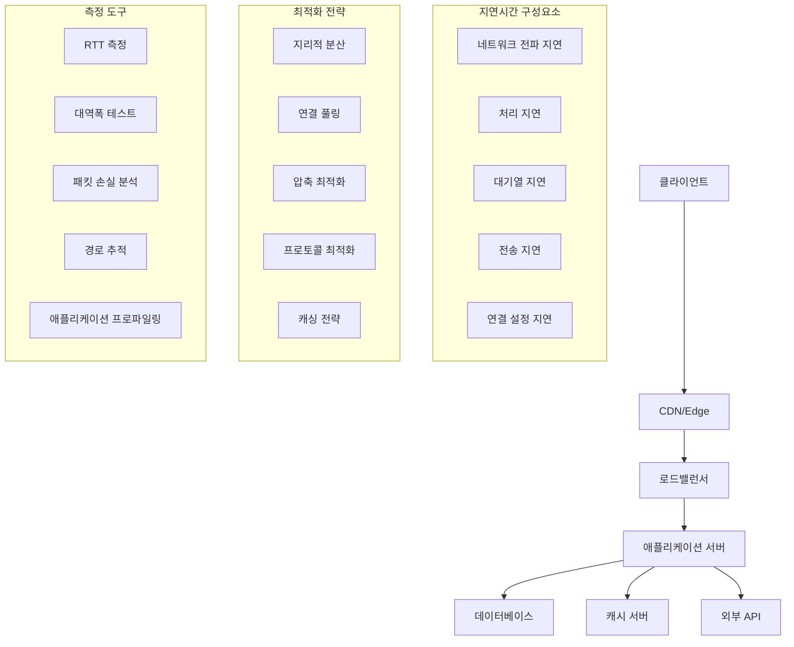

---
tags:
  - Network Latency
  - Performance Optimization
  - Bandwidth Utilization
  - Network Tuning
---

# 네트워크 지연시간 최적화: "응답이 너무 느려요"

## 상황: 높은 네트워크 지연시간

"안녕하세요, 우리 API 서버의 응답시간이 너무 느립니다. 로컬에서는 빠른데 원격 클라이언트에서 호출하면 몇 초씩 걸려요. 특히 지역이 다른 사용자들의 불만이 많습니다. 대역폭은 충분한 것 같은데 왜 이렇게 느린지 모르겠어요. 네트워크 지연시간을 어떻게 최적화할 수 있을까요?"

이런 네트워크 지연시간 문제는 글로벌 서비스에서 매우 중요한 이슈입니다. 체계적인 분석과 최적화가 필요합니다.

## 네트워크 지연시간 분석 체계



## 1. 네트워크 지연시간 분석 도구

포괄적인 네트워크 성능 분석을 위한 C 기반 도구입니다.

```c
// network_latency_analyzer.c
#include <stdio.h>
#include <stdlib.h>
#include <string.h>
#include <unistd.h>
#include <sys/socket.h>
#include <netinet/in.h>
#include <netinet/ip_icmp.h>
#include <netinet/tcp.h>
#include <arpa/inet.h>
#include <netdb.h>
#include <errno.h>
#include <time.h>
#include <sys/time.h>
#include <signal.h>
#include <pthread.h>
#include <math.h>
#include <fcntl.h>
#include <sys/epoll.h>

#define MAX_PACKET_SIZE 65536
#define MAX_HOPS 30
#define MAX_TARGETS 100
#define DEFAULT_TIMEOUT 5

typedef struct {
    char hostname[256];
    struct in_addr addr;
    double min_rtt;
    double max_rtt;
    double avg_rtt;
    double stddev_rtt;
    int packets_sent;
    int packets_received;
    double packet_loss;
    double jitter;
    int bandwidth_mbps;
} target_stats_t;

typedef struct {
    char target[256];
    int port;
    int count;
    int interval;
    int timeout;
    int packet_size;
    int concurrent;
    int show_hops;
} test_config_t;

typedef struct {
    struct timeval timestamp;
    double rtt;
    int sequence;
    int success;
} measurement_t;

static volatile int running = 1;
static target_stats_t targets[MAX_TARGETS];
static int target_count = 0;

void signal_handler(int sig) {
    running = 0;
}

double get_time_diff(struct timeval *start, struct timeval *end) {
    return (end->tv_sec - start->tv_sec) * 1000.0 +
           (end->tv_usec - start->tv_usec) / 1000.0;
}

unsigned short checksum(void *b, int len) {
    unsigned short *buf = b;
    unsigned int sum = 0;
    unsigned short result;

    while (len > 1) {
        sum += *buf++;
        len -= 2;
    }

    if (len == 1)
        sum += *(unsigned char*)buf << 8;

    while (sum >> 16)
        sum = (sum & 0xFFFF) + (sum >> 16);

    result = ~sum;
    return result;
}

int resolve_hostname(const char *hostname, struct in_addr *addr) {
    struct hostent *he = gethostbyname(hostname);
    if (he == NULL) {
        return -1;
    }

    memcpy(addr, he->h_addr_list[0], sizeof(struct in_addr));
    return 0;
}

int create_icmp_socket() {
    int sock = socket(AF_INET, SOCK_RAW, IPPROTO_ICMP);
    if (sock < 0) {
        if (errno == EPERM) {
            printf("ICMP 소켓을 생성하려면 root 권한이 필요합니다.\n");
            printf("sudo로 실행하거나 TCP 연결 테스트를 사용하세요.\n");
        }
        return -1;
    }

    // 타임아웃 설정
    struct timeval timeout;
    timeout.tv_sec = DEFAULT_TIMEOUT;
    timeout.tv_usec = 0;

    if (setsockopt(sock, SOL_SOCKET, SO_RCVTIMEO, &timeout, sizeof(timeout)) < 0) {
        perror("setsockopt SO_RCVTIMEO");
        close(sock);
        return -1;
    }

    return sock;
}

int send_icmp_ping(int sock, struct in_addr *addr, int sequence, int packet_size) {
    struct icmp *icmp_packet;
    char packet[MAX_PACKET_SIZE];
    struct sockaddr_in dest_addr;
    struct timeval *timestamp;

    // ICMP 패킷 구성
    icmp_packet = (struct icmp*)packet;
    icmp_packet->icmp_type = ICMP_ECHO;
    icmp_packet->icmp_code = 0;
    icmp_packet->icmp_id = getpid();
    icmp_packet->icmp_seq = sequence;
    icmp_packet->icmp_cksum = 0;

    // 타임스탬프 추가
    timestamp = (struct timeval*)(packet + 8);
    gettimeofday(timestamp, NULL);

    // 패킷 크기 맞추기
    memset(packet + 8 + sizeof(struct timeval), 0,
           packet_size - 8 - sizeof(struct timeval));

    // 체크섬 계산
    icmp_packet->icmp_cksum = checksum(packet, packet_size);

    // 대상 주소 설정
    memset(&dest_addr, 0, sizeof(dest_addr));
    dest_addr.sin_family = AF_INET;
    dest_addr.sin_addr = *addr;

    // 패킷 전송
    int bytes_sent = sendto(sock, packet, packet_size, 0,
                           (struct sockaddr*)&dest_addr, sizeof(dest_addr));

    return bytes_sent > 0 ? 0 : -1;
}

double receive_icmp_reply(int sock, int expected_sequence) {
    char packet[MAX_PACKET_SIZE];
    struct sockaddr_in from_addr;
    socklen_t from_len = sizeof(from_addr);
    struct timeval now, *sent_time;
    struct ip *ip_header;
    struct icmp *icmp_header;

    int bytes_received = recvfrom(sock, packet, sizeof(packet), 0,
                                 (struct sockaddr*)&from_addr, &from_len);

    if (bytes_received < 0) {
        return -1;  // 타임아웃 또는 오류
    }

    gettimeofday(&now, NULL);

    // IP 헤더 파싱
    ip_header = (struct ip*)packet;
    int ip_header_len = ip_header->ip_hl * 4;

    // ICMP 헤더 확인
    icmp_header = (struct icmp*)(packet + ip_header_len);

    if (icmp_header->icmp_type == ICMP_ECHOREPLY &&
        icmp_header->icmp_id == getpid() &&
        icmp_header->icmp_seq == expected_sequence) {

        // 전송 시간 추출
        sent_time = (struct timeval*)(packet + ip_header_len + 8);

        return get_time_diff(sent_time, &now);
    }

    return -1;  // 예상하지 못한 패킷
}

int tcp_connect_test(const char *hostname, int port, double *rtt) {
    int sock;
    struct sockaddr_in addr;
    struct timeval start_time, end_time;
    int result;

    // 호스트명 해석
    struct hostent *he = gethostbyname(hostname);
    if (he == NULL) {
        return -1;
    }

    // 소켓 생성
    sock = socket(AF_INET, SOCK_STREAM, 0);
    if (sock < 0) {
        return -1;
    }

    // 논블로킹 모드 설정
    int flags = fcntl(sock, F_GETFL, 0);
    fcntl(sock, F_SETFL, flags | O_NONBLOCK);

    // 주소 설정
    memset(&addr, 0, sizeof(addr));
    addr.sin_family = AF_INET;
    addr.sin_port = htons(port);
    memcpy(&addr.sin_addr, he->h_addr_list[0], sizeof(struct in_addr));

    // 연결 시작 시간 기록
    gettimeofday(&start_time, NULL);

    // 연결 시도
    result = connect(sock, (struct sockaddr*)&addr, sizeof(addr));

    if (result < 0 && errno == EINPROGRESS) {
        // 연결 완료 대기
        fd_set write_fds;
        struct timeval timeout;

        FD_ZERO(&write_fds);
        FD_SET(sock, &write_fds);
        timeout.tv_sec = DEFAULT_TIMEOUT;
        timeout.tv_usec = 0;

        result = select(sock + 1, NULL, &write_fds, NULL, &timeout);

        if (result > 0) {
            // 연결 상태 확인
            int error;
            socklen_t len = sizeof(error);

            if (getsockopt(sock, SOL_SOCKET, SO_ERROR, &error, &len) == 0 && error == 0) {
                gettimeofday(&end_time, NULL);
                *rtt = get_time_diff(&start_time, &end_time);
                close(sock);
                return 0;
            }
        }
    }

    close(sock);
    return -1;
}

void calculate_statistics(measurement_t *measurements, int count, target_stats_t *stats) {
    double sum = 0, sum_sq = 0;
    double prev_rtt = -1;
    double jitter_sum = 0;
    int jitter_count = 0;

    stats->packets_sent = count;
    stats->packets_received = 0;
    stats->min_rtt = INFINITY;
    stats->max_rtt = 0;

    for (int i = 0; i < count; i++) {
        if (measurements[i].success) {
            stats->packets_received++;

            double rtt = measurements[i].rtt;
            sum += rtt;
            sum_sq += rtt * rtt;

            if (rtt < stats->min_rtt) stats->min_rtt = rtt;
            if (rtt > stats->max_rtt) stats->max_rtt = rtt;

            // 지터 계산
            if (prev_rtt >= 0) {
                jitter_sum += fabs(rtt - prev_rtt);
                jitter_count++;
            }
            prev_rtt = rtt;
        }
    }

    if (stats->packets_received > 0) {
        stats->avg_rtt = sum / stats->packets_received;

        // 표준편차 계산
        if (stats->packets_received > 1) {
            double variance = (sum_sq - (sum * sum) / stats->packets_received) /
                             (stats->packets_received - 1);
            stats->stddev_rtt = sqrt(variance);
        } else {
            stats->stddev_rtt = 0;
        }

        // 지터 계산
        stats->jitter = jitter_count > 0 ? jitter_sum / jitter_count : 0;
    } else {
        stats->avg_rtt = 0;
        stats->stddev_rtt = 0;
        stats->jitter = 0;
        stats->min_rtt = 0;
    }

    stats->packet_loss = (double)(count - stats->packets_received) / count * 100.0;
}

int ping_test(const char *hostname, test_config_t *config) {
    struct in_addr addr;
    int sock;
    measurement_t measurements[1000];
    target_stats_t stats;

    printf("PING 테스트: %s\n", hostname);

    // 호스트명 해석
    if (resolve_hostname(hostname, &addr) < 0) {
        printf("호스트명 해석 실패: %s\n", hostname);
        return -1;
    }

    strcpy(stats.hostname, hostname);
    stats.addr = addr;

    printf("PING %s (%s): %d 바이트 데이터\n",
           hostname, inet_ntoa(addr), config->packet_size);

    // ICMP 소켓 생성
    sock = create_icmp_socket();
    if (sock < 0) {
        printf("TCP 연결 테스트로 대체합니다.\n");

        // TCP 연결 테스트로 대체
        for (int i = 0; i < config->count && running; i++) {
            double rtt;

            measurements[i].sequence = i + 1;
            measurements[i].success = (tcp_connect_test(hostname, config->port, &rtt) == 0);

            if (measurements[i].success) {
                measurements[i].rtt = rtt;
                printf("%d: %s port %d 연결 시간=%.2fms\n",
                       i + 1, hostname, config->port, rtt);
            } else {
                printf("%d: %s port %d 연결 실패\n", i + 1, hostname, config->port);
            }

            if (i < config->count - 1) {
                sleep(config->interval);
            }
        }
    } else {
        // ICMP ping 테스트
        for (int i = 0; i < config->count && running; i++) {
            measurements[i].sequence = i + 1;

            if (send_icmp_ping(sock, &addr, i + 1, config->packet_size) == 0) {
                double rtt = receive_icmp_reply(sock, i + 1);

                if (rtt >= 0) {
                    measurements[i].success = 1;
                    measurements[i].rtt = rtt;
                    printf("%d: %s에서 응답: 시간=%.2fms\n", i + 1, hostname, rtt);
                } else {
                    measurements[i].success = 0;
                    printf("%d: %s 요청 시간 초과\n", i + 1, hostname);
                }
            } else {
                measurements[i].success = 0;
                printf("%d: %s 패킷 전송 실패\n", i + 1, hostname);
            }

            if (i < config->count - 1) {
                sleep(config->interval);
            }
        }

        close(sock);
    }

    // 통계 계산
    calculate_statistics(measurements, config->count, &stats);

    // 결과 출력
    printf("\n--- %s ping 통계 ---\n", hostname);
    printf("%d 패킷 전송, %d 패킷 수신, %.1f%% 패킷 손실\n",
           stats.packets_sent, stats.packets_received, stats.packet_loss);

    if (stats.packets_received > 0) {
        printf("왕복 시간 최소/평균/최대/표준편차 = %.2f/%.2f/%.2f/%.2f ms\n",
               stats.min_rtt, stats.avg_rtt, stats.max_rtt, stats.stddev_rtt);
        printf("지터: %.2f ms\n", stats.jitter);
    }

    return 0;
}

int traceroute_test(const char *hostname) {
    printf("경로 추적: %s\n", hostname);

    struct in_addr addr;
    if (resolve_hostname(hostname, &addr) < 0) {
        printf("호스트명 해석 실패: %s\n", hostname);
        return -1;
    }

    printf("traceroute to %s (%s), %d hops max\n",
           hostname, inet_ntoa(addr), MAX_HOPS);

    // 간단한 traceroute 구현 (TCP 기반)
    for (int ttl = 1; ttl <= MAX_HOPS; ttl++) {
        int sock = socket(AF_INET, SOCK_STREAM, 0);
        if (sock < 0) continue;

        // TTL 설정
        if (setsockopt(sock, IPPROTO_IP, IP_TTL, &ttl, sizeof(ttl)) < 0) {
            close(sock);
            continue;
        }

        struct sockaddr_in dest_addr;
        memset(&dest_addr, 0, sizeof(dest_addr));
        dest_addr.sin_family = AF_INET;
        dest_addr.sin_addr = addr;
        dest_addr.sin_port = htons(80);  // HTTP 포트 사용

        struct timeval start_time, end_time;
        gettimeofday(&start_time, NULL);

        int result = connect(sock, (struct sockaddr*)&dest_addr, sizeof(dest_addr));
        gettimeofday(&end_time, NULL);

        double rtt = get_time_diff(&start_time, &end_time);

        printf("%2d  ", ttl);

        if (result == 0 || errno == ECONNREFUSED) {
            // 목적지 도달 또는 연결 거부 (정상)
            printf("%s  %.2f ms\n", inet_ntoa(addr), rtt);
            close(sock);
            break;
        } else {
            printf("* * *\n");
        }

        close(sock);
    }

    return 0;
}

void bandwidth_test(const char *hostname, int port) {
    printf("대역폭 테스트: %s:%d\n", hostname, port);

    int sock = socket(AF_INET, SOCK_STREAM, 0);
    if (sock < 0) {
        perror("socket");
        return;
    }

    struct hostent *he = gethostbyname(hostname);
    if (he == NULL) {
        printf("호스트명 해석 실패\n");
        close(sock);
        return;
    }

    struct sockaddr_in addr;
    memset(&addr, 0, sizeof(addr));
    addr.sin_family = AF_INET;
    addr.sin_port = htons(port);
    memcpy(&addr.sin_addr, he->h_addr_list[0], sizeof(struct in_addr));

    if (connect(sock, (struct sockaddr*)&addr, sizeof(addr)) < 0) {
        perror("connect");
        close(sock);
        return;
    }

    // 대용량 데이터 전송 테스트
    char buffer[8192];
    memset(buffer, 'A', sizeof(buffer));

    struct timeval start_time, end_time;
    gettimeofday(&start_time, NULL);

    long total_bytes = 0;
    int test_duration = 10;  // 10초 테스트

    while (running) {
        gettimeofday(&end_time, NULL);
        if (get_time_diff(&start_time, &end_time) >= test_duration * 1000) {
            break;
        }

        int bytes_sent = send(sock, buffer, sizeof(buffer), 0);
        if (bytes_sent > 0) {
            total_bytes += bytes_sent;
        } else {
            break;
        }
    }

    gettimeofday(&end_time, NULL);
    double duration = get_time_diff(&start_time, &end_time) / 1000.0;  // 초로 변환

    double bandwidth_mbps = (total_bytes * 8.0) / (duration * 1000000.0);

    printf("전송 데이터: %ld 바이트\n", total_bytes);
    printf("소요 시간: %.2f 초\n", duration);
    printf("대역폭: %.2f Mbps\n", bandwidth_mbps);

    close(sock);
}

void print_usage(const char *program_name) {
    printf("네트워크 지연시간 분석기\n");
    printf("사용법: %s [옵션] 호스트명\n", program_name);
    printf("옵션:\n");
    printf("  -c COUNT     ping 횟수 (기본값: 4)\n");
    printf("  -i INTERVAL  ping 간격 (초, 기본값: 1)\n");
    printf("  -s SIZE      패킷 크기 (바이트, 기본값: 64)\n");
    printf("  -p PORT      TCP 테스트 포트 (기본값: 80)\n");
    printf("  -t           traceroute 실행\n");
    printf("  -b           대역폭 테스트 실행\n");
    printf("  -w TIMEOUT   타임아웃 (초, 기본값: 5)\n");
    printf("  --help       이 도움말 출력\n");
}

int main(int argc, char *argv[]) {
    test_config_t config = {
        .count = 4,
        .interval = 1,
        .timeout = DEFAULT_TIMEOUT,
        .packet_size = 64,
        .port = 80,
        .show_hops = 0
    };

    int do_traceroute = 0;
    int do_bandwidth = 0;
    char *target_host = NULL;

    // 명령행 인자 처리
    for (int i = 1; i < argc; i++) {
        if (strcmp(argv[i], "-c") == 0 && i + 1 < argc) {
            config.count = atoi(argv[++i]);
        } else if (strcmp(argv[i], "-i") == 0 && i + 1 < argc) {
            config.interval = atoi(argv[++i]);
        } else if (strcmp(argv[i], "-s") == 0 && i + 1 < argc) {
            config.packet_size = atoi(argv[++i]);
        } else if (strcmp(argv[i], "-p") == 0 && i + 1 < argc) {
            config.port = atoi(argv[++i]);
        } else if (strcmp(argv[i], "-w") == 0 && i + 1 < argc) {
            config.timeout = atoi(argv[++i]);
        } else if (strcmp(argv[i], "-t") == 0) {
            do_traceroute = 1;
        } else if (strcmp(argv[i], "-b") == 0) {
            do_bandwidth = 1;
        } else if (strcmp(argv[i], "--help") == 0) {
            print_usage(argv[0]);
            return 0;
        } else if (argv[i][0] != '-') {
            target_host = argv[i];
        }
    }

    if (target_host == NULL) {
        printf("오류: 대상 호스트를 지정해야 합니다.\n");
        print_usage(argv[0]);
        return 1;
    }

    strcpy(config.target, target_host);

    // 시그널 핸들러 설정
    signal(SIGINT, signal_handler);

    printf("네트워크 지연시간 분석기\n");
    printf("대상: %s\n", target_host);
    printf("==========================\n\n");

    // ping 테스트
    ping_test(target_host, &config);

    if (running && do_traceroute) {
        printf("\n");
        traceroute_test(target_host);
    }

    if (running && do_bandwidth) {
        printf("\n");
        bandwidth_test(target_host, config.port);
    }

    return 0;
}
```

## 2. 네트워크 최적화 자동화 스크립트

```bash
#!/bin/bash
# network_optimization.sh

set -euo pipefail

# 색상 정의
RED='\033[0;31m'
GREEN='\033[0;32m'
YELLOW='\033[1;33m'
BLUE='\033[0;34m'
NC='\033[0m'

log_info() {
    echo -e "${BLUE}[INFO]${NC} $1"
}

log_success() {
    echo -e "${GREEN}[SUCCESS]${NC} $1"
}

log_warning() {
    echo -e "${YELLOW}[WARNING]${NC} $1"
}

log_error() {
    echo -e "${RED}[ERROR]${NC} $1"
}

# 기본 설정
CONFIG_FILE="network_optimization.conf"
BACKUP_DIR="/etc/network/backup"
SYSCTL_CONF="/etc/sysctl.conf"

# 설정 로드
load_config() {
    if [[ -f "$CONFIG_FILE" ]]; then
        source "$CONFIG_FILE"
        log_info "설정 파일 로드: $CONFIG_FILE"
    else
        log_warning "설정 파일이 없습니다. 기본값 사용"
    fi

    # 기본값 설정
    TCP_WINDOW_SCALING=${TCP_WINDOW_SCALING:-1}
    TCP_CONGESTION_CONTROL=${TCP_CONGESTION_CONTROL:-"bbr"}
    TCP_SLOW_START_AFTER_IDLE=${TCP_SLOW_START_AFTER_IDLE:-0}
    NET_CORE_RMEM_MAX=${NET_CORE_RMEM_MAX:-134217728}
    NET_CORE_WMEM_MAX=${NET_CORE_WMEM_MAX:-134217728}
    NET_CORE_NETDEV_MAX_BACKLOG=${NET_CORE_NETDEV_MAX_BACKLOG:-30000}
    TARGET_HOSTS=${TARGET_HOSTS:-"8.8.8.8,1.1.1.1,google.com"}
}

# 백업 생성
create_backup() {
    log_info "시스템 설정 백업 중..."

    sudo mkdir -p "$BACKUP_DIR"

    # 기존 설정 백업
    if [[ -f "$SYSCTL_CONF" ]]; then
        sudo cp "$SYSCTL_CONF" "$BACKUP_DIR/sysctl.conf.backup.$(date +%Y%m%d_%H%M%S)"
        log_success "sysctl.conf 백업 완료"
    fi

    # 네트워크 인터페이스 설정 백업
    if [[ -d "/etc/network" ]]; then
        sudo cp -r /etc/network "$BACKUP_DIR/network.backup.$(date +%Y%m%d_%H%M%S)" 2>/dev/null || true
    fi

    # 현재 네트워크 설정 정보 저장
    {
        echo "# 백업 시점: $(date)"
        echo "# 네트워크 인터페이스 정보"
        ip addr show
        echo ""
        echo "# 라우팅 테이블"
        ip route show
        echo ""
        echo "# 현재 sysctl 설정"
        sysctl -a 2>/dev/null | grep -E "(net\.|kernel\.)" || true
    } > "$BACKUP_DIR/network_info.$(date +%Y%m%d_%H%M%S).txt"

    log_success "네트워크 설정 백업 완료"
}

# 네트워크 인터페이스 분석
analyze_network_interfaces() {
    log_info "네트워크 인터페이스 분석 중..."

    echo "=== 네트워크 인터페이스 정보 ==="

    # 활성 인터페이스 목록
    local interfaces=$(ip -o link show | awk -F': ' '{print $2}' | grep -v '^lo$')

    for interface in $interfaces; do
        echo ""
        echo "인터페이스: $interface"

        # 인터페이스 상태
        local state=$(ip link show "$interface" | grep -o 'state [A-Z]*' | cut -d' ' -f2)
        echo "  상태: $state"

        # IP 주소
        local ip_addr=$(ip addr show "$interface" | grep 'inet ' | head -1 | awk '{print $2}')
        if [[ -n "$ip_addr" ]]; then
            echo "  IP 주소: $ip_addr"
        fi

        # MTU 크기
        local mtu=$(ip link show "$interface" | grep -o 'mtu [0-9]*' | cut -d' ' -f2)
        echo "  MTU: $mtu"

        # 네트워크 통계
        if [[ -f "/sys/class/net/$interface/statistics/rx_bytes" ]]; then
            local rx_bytes=$(cat "/sys/class/net/$interface/statistics/rx_bytes")
            local tx_bytes=$(cat "/sys/class/net/$interface/statistics/tx_bytes")
            local rx_errors=$(cat "/sys/class/net/$interface/statistics/rx_errors")
            local tx_errors=$(cat "/sys/class/net/$interface/statistics/tx_errors")

            echo "  수신: $(numfmt --to=iec $rx_bytes)B, 오류: $rx_errors"
            echo "  송신: $(numfmt --to=iec $tx_bytes)B, 오류: $tx_errors"
        fi

        # 드라이버 정보
        if command -v ethtool >/dev/null 2>&1; then
            local speed=$(sudo ethtool "$interface" 2>/dev/null | grep "Speed:" | awk '{print $2}' || echo "Unknown")
            local duplex=$(sudo ethtool "$interface" 2>/dev/null | grep "Duplex:" | awk '{print $2}' || echo "Unknown")
            echo "  속도: $speed, 듀플렉스: $duplex"
        fi
    done
}

# TCP 버퍼 크기 최적화
optimize_tcp_buffers() {
    log_info "TCP 버퍼 크기 최적화 중..."

    # 현재 설정 확인
    echo "=== 현재 TCP 버퍼 설정 ==="
    echo "net.core.rmem_default: $(sysctl -n net.core.rmem_default)"
    echo "net.core.rmem_max: $(sysctl -n net.core.rmem_max)"
    echo "net.core.wmem_default: $(sysctl -n net.core.wmem_default)"
    echo "net.core.wmem_max: $(sysctl -n net.core.wmem_max)"
    echo "net.ipv4.tcp_rmem: $(sysctl -n net.ipv4.tcp_rmem)"
    echo "net.ipv4.tcp_wmem: $(sysctl -n net.ipv4.tcp_wmem)"

    # 메모리 기반 최적값 계산
    local total_mem=$(grep MemTotal /proc/meminfo | awk '{print $2}')
    local optimal_rmem_max=$((total_mem * 1024 / 8))  # 전체 메모리의 1/8
    local optimal_wmem_max=$optimal_rmem_max

    # 최대값 제한
    if [[ $optimal_rmem_max -gt $NET_CORE_RMEM_MAX ]]; then
        optimal_rmem_max=$NET_CORE_RMEM_MAX
    fi
    if [[ $optimal_wmem_max -gt $NET_CORE_WMEM_MAX ]]; then
        optimal_wmem_max=$NET_CORE_WMEM_MAX
    fi

    echo ""
    echo "=== 최적화된 TCP 버퍼 설정 ==="
    echo "권장 rmem_max: $optimal_rmem_max"
    echo "권장 wmem_max: $optimal_wmem_max"

    # sysctl 설정 적용
    sudo sysctl -w net.core.rmem_default=262144
    sudo sysctl -w net.core.rmem_max=$optimal_rmem_max
    sudo sysctl -w net.core.wmem_default=262144
    sudo sysctl -w net.core.wmem_max=$optimal_wmem_max
    sudo sysctl -w net.ipv4.tcp_rmem="4096 87380 $optimal_rmem_max"
    sudo sysctl -w net.ipv4.tcp_wmem="4096 65536 $optimal_wmem_max"

    log_success "TCP 버퍼 크기 최적화 완료"
}

# 혼잡 제어 알고리즘 최적화
optimize_congestion_control() {
    log_info "TCP 혼잡 제어 최적화 중..."

    # 사용 가능한 혼잡 제어 알고리즘 확인
    echo "=== 사용 가능한 혼잡 제어 알고리즘 ==="
    cat /proc/sys/net/ipv4/tcp_available_congestion_control

    echo ""
    echo "=== 현재 혼잡 제어 알고리즘 ==="
    cat /proc/sys/net/ipv4/tcp_congestion_control

    # BBR 알고리즘 사용 가능 여부 확인
    if grep -q "bbr" /proc/sys/net/ipv4/tcp_available_congestion_control; then
        echo ""
        log_info "BBR 알고리즘으로 변경 중..."
        sudo sysctl -w net.ipv4.tcp_congestion_control=bbr
        sudo sysctl -w net.core.default_qdisc=fq
        log_success "BBR 혼잡 제어 알고리즘 적용 완료"
    elif grep -q "cubic" /proc/sys/net/ipv4/tcp_available_congestion_control; then
        echo ""
        log_info "CUBIC 알고리즘으로 설정 중..."
        sudo sysctl -w net.ipv4.tcp_congestion_control=cubic
        log_success "CUBIC 혼잡 제어 알고리즘 적용 완료"
    else
        log_warning "최적의 혼잡 제어 알고리즘을 찾을 수 없습니다"
    fi

    # 기타 TCP 최적화 설정
    sudo sysctl -w net.ipv4.tcp_window_scaling=$TCP_WINDOW_SCALING
    sudo sysctl -w net.ipv4.tcp_slow_start_after_idle=$TCP_SLOW_START_AFTER_IDLE
    sudo sysctl -w net.ipv4.tcp_no_metrics_save=1
    sudo sysctl -w net.ipv4.tcp_moderate_rcvbuf=1
}

# 네트워크 큐 최적화
optimize_network_queues() {
    log_info "네트워크 큐 최적화 중..."

    # 현재 설정 확인
    echo "=== 현재 네트워크 큐 설정 ==="
    echo "net.core.netdev_max_backlog: $(sysctl -n net.core.netdev_max_backlog)"
    echo "net.core.netdev_budget: $(sysctl -n net.core.netdev_budget)"

    # CPU 코어 수 기반 최적화
    local cpu_count=$(nproc)
    local optimal_backlog=$((cpu_count * 1000))

    if [[ $optimal_backlog -gt $NET_CORE_NETDEV_MAX_BACKLOG ]]; then
        optimal_backlog=$NET_CORE_NETDEV_MAX_BACKLOG
    fi

    echo ""
    echo "=== 최적화된 네트워크 큐 설정 ==="
    echo "권장 netdev_max_backlog: $optimal_backlog (CPU 코어: $cpu_count)"

    # 설정 적용
    sudo sysctl -w net.core.netdev_max_backlog=$optimal_backlog
    sudo sysctl -w net.core.netdev_budget=600
    sudo sysctl -w net.core.dev_weight=64

    # 인터럽트 코어 할당 최적화 (가능한 경우)
    if command -v irqbalance >/dev/null 2>&1; then
        sudo systemctl enable irqbalance
        sudo systemctl start irqbalance
        log_info "IRQ 밸런싱 서비스 활성화"
    fi

    log_success "네트워크 큐 최적화 완료"
}

# DNS 설정 최적화
optimize_dns() {
    log_info "DNS 설정 최적화 중..."

    # 현재 DNS 설정 확인
    echo "=== 현재 DNS 설정 ==="
    if [[ -f "/etc/resolv.conf" ]]; then
        cat /etc/resolv.conf
    fi

    # 빠른 DNS 서버 테스트
    echo ""
    echo "=== DNS 응답 시간 테스트 ==="

    declare -A dns_servers=(
        ["Google"]="8.8.8.8"
        ["Cloudflare"]="1.1.1.1"
        ["Quad9"]="9.9.9.9"
        ["OpenDNS"]="208.67.222.222"
    )

    declare -A dns_times

    for name in "${!dns_servers[@]}"; do
        local server="${dns_servers[$name]}"
        local response_time=$(dig @"$server" google.com +time=2 +tries=1 | grep "Query time:" | awk '{print $4}' 2>/dev/null || echo "timeout")
        dns_times["$name"]="$response_time"
        echo "$name ($server): ${response_time}ms"
    done

    # 가장 빠른 DNS 서버 찾기
    local fastest_dns=""
    local fastest_time=999999

    for name in "${!dns_times[@]}"; do
        local time="${dns_times[$name]}"
        if [[ "$time" != "timeout" ]] && [[ $time -lt $fastest_time ]]; then
            fastest_time=$time
            fastest_dns="${dns_servers[$name]}"
        fi
    done

    if [[ -n "$fastest_dns" ]]; then
        echo ""
        log_info "가장 빠른 DNS: $fastest_dns (${fastest_time}ms)"

        # DNS 캐시 최적화
        sudo sysctl -w net.ipv4.ip_forward=0
        sudo sysctl -w net.ipv6.conf.all.disable_ipv6=0

        # systemd-resolved 설정 (Ubuntu/Debian)
        if command -v systemd-resolve >/dev/null 2>&1; then
            echo ""
            log_info "systemd-resolved DNS 캐시 설정 중..."

            sudo mkdir -p /etc/systemd/resolved.conf.d
            cat << EOF | sudo tee /etc/systemd/resolved.conf.d/dns-optimization.conf > /dev/null
[Resolve]
DNS=$fastest_dns
DNSStubListener=yes
Cache=yes
CacheFromLocalhost=yes
EOF
            sudo systemctl restart systemd-resolved
            log_success "systemd-resolved 최적화 완료"
        fi
    else
        log_warning "빠른 DNS 서버를 찾을 수 없습니다"
    fi
}

# 지연시간 벤치마크
benchmark_latency() {
    local targets="$1"

    log_info "네트워크 지연시간 벤치마크 시작..."

    IFS=',' read -ra TARGET_ARRAY <<< "$targets"

    echo "=== 네트워크 지연시간 테스트 ==="

    for target in "${TARGET_ARRAY[@]}"; do
        echo ""
        echo "대상: $target"
        echo "----------------------------------------"

        # ping 테스트
        if command -v ping >/dev/null 2>&1; then
            local ping_result=$(ping -c 4 -W 3 "$target" 2>/dev/null | tail -1)
            if [[ -n "$ping_result" ]]; then
                echo "PING: $ping_result"
            else
                echo "PING: 실패"
            fi
        fi

        # curl을 이용한 HTTP 응답시간 테스트
        if command -v curl >/dev/null 2>&1; then
            local http_time=$(curl -o /dev/null -s -w "%{time_total}" "http://$target" 2>/dev/null || echo "N/A")
            echo "HTTP 응답시간: ${http_time}초"
        fi

        # traceroute (간단 버전)
        if command -v traceroute >/dev/null 2>&1; then
            echo "경로 추적 (처음 5홉):"
            timeout 30s traceroute -m 5 "$target" 2>/dev/null | head -7 || echo "  경로 추적 실패"
        fi
    done
}

# 대역폭 테스트
bandwidth_test() {
    log_info "대역폭 테스트 시작..."

    # iperf3 사용 가능 시
    if command -v iperf3 >/dev/null 2>&1; then
        echo "=== iperf3 대역폭 테스트 ==="

        # 공개 iperf3 서버들
        declare -a iperf_servers=(
            "iperf.scottlinux.com"
            "iperf.he.net"
            "speedtest.selectel.ru"
        )

        for server in "${iperf_servers[@]}"; do
            echo ""
            echo "서버: $server"
            echo "----------------------------------------"

            # 다운로드 테스트
            timeout 20s iperf3 -c "$server" -t 10 2>/dev/null || echo "테스트 실패: $server"
        done
    else
        log_warning "iperf3가 설치되지 않음. 간단한 다운로드 테스트 실행"

        # wget을 이용한 간단한 대역폭 테스트
        if command -v wget >/dev/null 2>&1; then
            echo ""
            echo "다운로드 속도 테스트 (10MB 파일):"
            timeout 30s wget -O /dev/null --progress=dot:giga \
                "http://speedtest.ftp.otenet.gr/files/test10Mb.db" 2>&1 | \
                tail -2 || echo "다운로드 테스트 실패"
        fi
    fi
}

# 설정 영구 저장
save_optimizations() {
    log_info "최적화 설정을 영구적으로 저장 중..."

    # sysctl 설정 파일에 추가
    cat << EOF | sudo tee -a "$SYSCTL_CONF" > /dev/null

# 네트워크 최적화 설정 ($(date))
# TCP 버퍼 크기 최적화
net.core.rmem_default = 262144
net.core.rmem_max = $NET_CORE_RMEM_MAX
net.core.wmem_default = 262144
net.core.wmem_max = $NET_CORE_WMEM_MAX
net.ipv4.tcp_rmem = 4096 87380 $NET_CORE_RMEM_MAX
net.ipv4.tcp_wmem = 4096 65536 $NET_CORE_WMEM_MAX

# 혼잡 제어 최적화
net.ipv4.tcp_congestion_control = $TCP_CONGESTION_CONTROL
net.core.default_qdisc = fq
net.ipv4.tcp_window_scaling = $TCP_WINDOW_SCALING
net.ipv4.tcp_slow_start_after_idle = $TCP_SLOW_START_AFTER_IDLE
net.ipv4.tcp_no_metrics_save = 1
net.ipv4.tcp_moderate_rcvbuf = 1

# 네트워크 큐 최적화
net.core.netdev_max_backlog = $NET_CORE_NETDEV_MAX_BACKLOG
net.core.netdev_budget = 600
net.core.dev_weight = 64
EOF

    # 설정 적용
    sudo sysctl -p

    log_success "최적화 설정 영구 저장 완료"
}

# 최적화 상태 검증
verify_optimizations() {
    log_info "최적화 설정 검증 중..."

    echo "=== 적용된 최적화 설정 확인 ==="

    declare -a settings=(
        "net.core.rmem_max"
        "net.core.wmem_max"
        "net.ipv4.tcp_congestion_control"
        "net.core.netdev_max_backlog"
        "net.ipv4.tcp_window_scaling"
        "net.ipv4.tcp_slow_start_after_idle"
    )

    for setting in "${settings[@]}"; do
        local value=$(sysctl -n "$setting" 2>/dev/null || echo "N/A")
        echo "$setting: $value"
    done

    echo ""
    echo "=== 네트워크 성능 테스트 ==="

    # 간단한 성능 테스트
    benchmark_latency "$TARGET_HOSTS"
}

# 메인 함수
main() {
    echo "========================================"
    echo "네트워크 지연시간 최적화 도구"
    echo "========================================"
    echo ""

    # 권한 확인
    if [[ $EUID -ne 0 ]] && [[ "$1" != "test" ]] && [[ "$1" != "analyze" ]]; then
        log_error "이 스크립트는 root 권한이 필요합니다."
        echo "sudo $0 $*"
        exit 1
    fi

    # 설정 로드
    load_config

    case "${1:-optimize}" in
        "analyze")
            analyze_network_interfaces
            ;;
        "optimize")
            create_backup
            analyze_network_interfaces
            optimize_tcp_buffers
            optimize_congestion_control
            optimize_network_queues
            optimize_dns
            save_optimizations
            verify_optimizations
            ;;
        "test")
            benchmark_latency "$TARGET_HOSTS"
            bandwidth_test
            ;;
        "restore")
            if [[ -f "$BACKUP_DIR/sysctl.conf.backup"* ]]; then
                local latest_backup=$(ls -t "$BACKUP_DIR"/sysctl.conf.backup* | head -1)
                sudo cp "$latest_backup" "$SYSCTL_CONF"
                sudo sysctl -p
                log_success "설정 복원 완료: $latest_backup"
            else
                log_error "백업 파일을 찾을 수 없습니다"
            fi
            ;;
        *)
            echo "사용법: $0 [analyze|optimize|test|restore]"
            echo ""
            echo "analyze  - 네트워크 인터페이스 분석"
            echo "optimize - 네트워크 설정 최적화"
            echo "test     - 네트워크 성능 테스트"
            echo "restore  - 백업된 설정으로 복원"
            exit 1
            ;;
    esac
}

# 스크립트 실행
main "$@"
```

이 문서는 네트워크 지연시간 문제를 체계적으로 분석하고 최적화하는 방법을 제공합니다. C 기반 분석 도구와 Bash 최적화 스크립트를 통해 TCP 버퍼, 혼잡 제어, DNS 등을 종합적으로 최적화할 수 있습니다.
