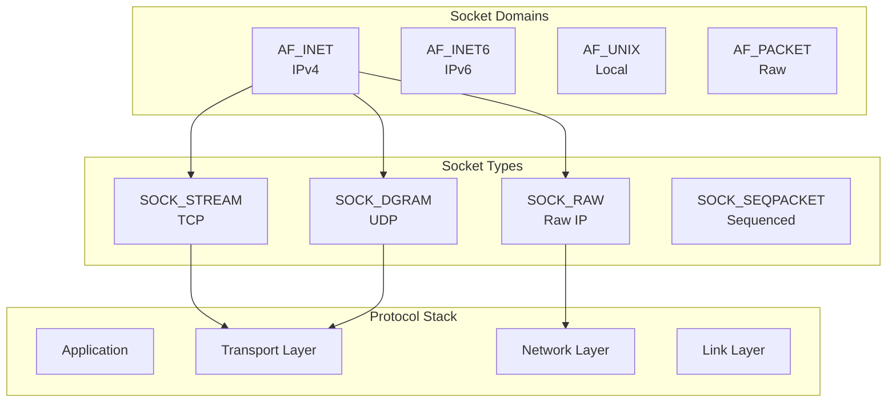

---
tags:
  - IPv4
  - TCP
  - UDP
  - balanced
  - fundamentals
  - medium-read
  - sockaddr
  - socket
  - 시스템프로그래밍
difficulty: FUNDAMENTALS
learning_time: "3-5시간"
main_topic: "시스템 프로그래밍"
priority_score: 4
---

# 7.1.2: 소켓의 개념과 기본 구조

## 🏗️ 소켓의 분류: 용도에 맞는 선택

소켓을 선택하는 건 마치 교통수단을 선택하는 것과 같습니다:

- **TCP (SOCK_STREAM)**: 안전한 택배 서비스 (도착 보장, 순서 보장)
- **UDP (SOCK_DGRAM)**: 빠른 우편 (빠르지만 분실 가능)
- **Raw Socket**: 직접 운전 (모든 제어 가능, 위험할 수 있음)
- **Unix Socket**: 지하철 (같은 도시 내에서만, 매우 빠름)

제가 실제로 사용한 예:

```bash
# 웹 서버: TCP 사용 (신뢰성 필수)
# 게임 서버: UDP 사용 (낮은 지연 중요)
# 모니터링: Raw Socket (패킷 분석)
# Docker: Unix Socket (컨테이너 통신)
```

## 소켓 도메인과 타입



## 📦 소켓 구조체와 주소 체계

소켓 주소 구조체는 마치 러시아 인형 같습니다. 겉은 같아 보이지만 안은 다르죠.

```c
// 범용 소켓 주소 구조체 (모든 소켓의 부모)
struct sockaddr {
    sa_family_t sa_family;  // 주소 패밀리
    char        sa_data[14]; // 주소 데이터
};

// IPv4 소켓 주소
struct sockaddr_in {
    sa_family_t    sin_family;  // AF_INET
    in_port_t      sin_port;    // 포트 번호 (네트워크 바이트 순서)
    struct in_addr sin_addr;    // IPv4 주소
    uint8_t        sin_zero[8]; // 패딩 (0으로 채움)
};

struct in_addr {
    uint32_t s_addr;  // IPv4 주소 (네트워크 바이트 순서)
};

// IPv6 소켓 주소
struct sockaddr_in6 {
    sa_family_t     sin6_family;   // AF_INET6
    in_port_t       sin6_port;     // 포트 번호
    uint32_t        sin6_flowinfo; // 플로우 정보
    struct in6_addr sin6_addr;     // IPv6 주소
    uint32_t        sin6_scope_id; // 스코프 ID
};

struct in6_addr {
    uint8_t s6_addr[16];  // IPv6 주소 (128비트)
};

// Unix 도메인 소켓 주소
struct sockaddr_un {
    sa_family_t sun_family;  // AF_UNIX
    char        sun_path[108]; // 경로명
};

// 소켓 저장 구조체 (IPv4/IPv6 동시 지원)
struct sockaddr_storage {
    sa_family_t ss_family;
    char        __ss_padding[128 - sizeof(sa_family_t)];
    // 충분한 크기와 정렬 보장
} __attribute__((aligned(8)));
```

## 🔄 네트워크 바이트 순서 변환

### 바이트 순서의 중요성

Intel CPU는 리틀 엔디안, 네트워크는 빅 엔디안을 사용합니다.
포트 8080(0x1F90)이 0x901F로 바뀌어 36895번 포트로 연결을 시도하는 실수를 방지해야 합니다!

```c
// 네트워크 바이트 순서 변환
uint16_t htons(uint16_t hostshort);  // Host to Network Short
uint32_t htonl(uint32_t hostlong);   // Host to Network Long
uint16_t ntohs(uint16_t netshort);   // Network to Host Short
uint32_t ntohl(uint32_t netlong);    // Network to Host Long

// 현대적인 바이트 순서 변환 (endian.h)
uint16_t htobe16(uint16_t host_16bits);
uint32_t htobe32(uint32_t host_32bits);
uint64_t htobe64(uint64_t host_64bits);
uint16_t be16toh(uint16_t big_endian_16bits);
uint32_t be32toh(uint32_t big_endian_32bits);
uint64_t be64toh(uint64_t big_endian_64bits);
```

### 실제 사용 예제

```c
// 올바른 주소 설정 방법
struct sockaddr_in server_addr;
memset(&server_addr, 0, sizeof(server_addr));
server_addr.sin_family = AF_INET;
server_addr.sin_port = htons(8080);  // 포트 번호 변환

// IP 주소 설정
inet_pton(AF_INET, "192.168.1.100", &server_addr.sin_addr);

// 또는 모든 인터페이스에 바인드
server_addr.sin_addr.s_addr = INADDR_ANY;
```

### IP 주소 변환 함수

```c
#include <arpa/inet.h>

// 문자열 → 이진 형태 (IPv4/IPv6 지원)
int inet_pton(int af, const char *src, void *dst);

// 이진 형태 → 문자열 (IPv4/IPv6 지원)
const char *inet_ntop(int af, const void *src, char *dst, socklen_t size);

// 예제: IPv4 주소 변환
struct in_addr addr;
if (inet_pton(AF_INET, "192.168.1.1", &addr) == 1) {
    printf("주소 변환 성공\n");
}

char addr_str[INET_ADDRSTRLEN];
inet_ntop(AF_INET, &addr, addr_str, sizeof(addr_str));
printf("주소: %s\n", addr_str);
```

## 🔧 소켓 생성과 바인드

### 소켓 생성

```c
#include <sys/socket.h>

int socket(int domain, int type, int protocol);

// 예제: 다양한 소켓 생성
int tcp_sock = socket(AF_INET, SOCK_STREAM, 0);     // TCP
int udp_sock = socket(AF_INET, SOCK_DGRAM, 0);      // UDP
int raw_sock = socket(AF_INET, SOCK_RAW, IPPROTO_ICMP); // Raw ICMP
int unix_sock = socket(AF_UNIX, SOCK_STREAM, 0);    // Unix domain
```

### 소켓 바인드

```c
int bind(int sockfd, const struct sockaddr *addr, socklen_t addrlen);

// IPv4 TCP 소켓 바인드 예제
int create_and_bind_socket(const char *ip, uint16_t port) {
    int sock_fd;
    struct sockaddr_in addr;
    
    // 1. 소켓 생성
    sock_fd = socket(AF_INET, SOCK_STREAM, 0);
    if (sock_fd < 0) {
        perror("socket");
        return -1;
    }
    
    // 2. 주소 구조체 설정
    memset(&addr, 0, sizeof(addr));
    addr.sin_family = AF_INET;
    addr.sin_port = htons(port);
    
    if (ip == NULL) {
        addr.sin_addr.s_addr = INADDR_ANY;  // 모든 인터페이스
    } else {
        if (inet_pton(AF_INET, ip, &addr.sin_addr) <= 0) {
            perror("inet_pton");
            close(sock_fd);
            return -1;
        }
    }
    
    // 3. 바인드
    if (bind(sock_fd, (struct sockaddr *)&addr, sizeof(addr)) < 0) {
        perror("bind");
        close(sock_fd);
        return -1;
    }
    
    return sock_fd;
}
```

### IPv6 주소 처리

```c
// IPv6 지원 소켓 생성 및 바인드
int create_ipv6_socket(const char *ip, uint16_t port) {
    int sock_fd;
    struct sockaddr_in6 addr;
    
    sock_fd = socket(AF_INET6, SOCK_STREAM, 0);
    if (sock_fd < 0) {
        perror("socket");
        return -1;
    }
    
    // IPv6 전용 모드 비활성화 (IPv4도 수용)
    int no = 0;
    setsockopt(sock_fd, IPPROTO_IPV6, IPV6_V6ONLY, &no, sizeof(no));
    
    memset(&addr, 0, sizeof(addr));
    addr.sin6_family = AF_INET6;
    addr.sin6_port = htons(port);
    
    if (ip == NULL) {
        addr.sin6_addr = in6addr_any;  // 모든 IPv6 인터페이스
    } else {
        if (inet_pton(AF_INET6, ip, &addr.sin6_addr) <= 0) {
            perror("inet_pton");
            close(sock_fd);
            return -1;
        }
    }
    
    if (bind(sock_fd, (struct sockaddr *)&addr, sizeof(addr)) < 0) {
        perror("bind");
        close(sock_fd);
        return -1;
    }
    
    return sock_fd;
}
```

## 💡 실전 팁과 모범 사례

### 1. sockaddr_storage 활용

```c
// IPv4/IPv6 모두 지원하는 범용 함수
int create_socket_any(const char *ip, uint16_t port, int family) {
    int sock_fd;
    struct sockaddr_storage addr;
    socklen_t addr_len;
    
    if (family == AF_INET) {
        struct sockaddr_in *addr4 = (struct sockaddr_in *)&addr;
        sock_fd = socket(AF_INET, SOCK_STREAM, 0);
        
        memset(addr4, 0, sizeof(*addr4));
        addr4->sin_family = AF_INET;
        addr4->sin_port = htons(port);
        
        if (ip) {
            inet_pton(AF_INET, ip, &addr4->sin_addr);
        } else {
            addr4->sin_addr.s_addr = INADDR_ANY;
        }
        
        addr_len = sizeof(*addr4);
    } else if (family == AF_INET6) {
        struct sockaddr_in6 *addr6 = (struct sockaddr_in6 *)&addr;
        sock_fd = socket(AF_INET6, SOCK_STREAM, 0);
        
        memset(addr6, 0, sizeof(*addr6));
        addr6->sin6_family = AF_INET6;
        addr6->sin6_port = htons(port);
        
        if (ip) {
            inet_pton(AF_INET6, ip, &addr6->sin6_addr);
        } else {
            addr6->sin6_addr = in6addr_any;
        }
        
        addr_len = sizeof(*addr6);
    } else {
        return -1;
    }
    
    if (sock_fd < 0) return -1;
    
    if (bind(sock_fd, (struct sockaddr *)&addr, addr_len) < 0) {
        close(sock_fd);
        return -1;
    }
    
    return sock_fd;
}
```

### 2. 주소 정보 출력

```c
void print_socket_address(struct sockaddr *addr) {
    char addr_str[INET6_ADDRSTRLEN];
    uint16_t port;
    
    if (addr->sa_family == AF_INET) {
        struct sockaddr_in *addr4 = (struct sockaddr_in *)addr;
        inet_ntop(AF_INET, &addr4->sin_addr, addr_str, sizeof(addr_str));
        port = ntohs(addr4->sin_port);
        printf("IPv4: %s:%u\n", addr_str, port);
    } else if (addr->sa_family == AF_INET6) {
        struct sockaddr_in6 *addr6 = (struct sockaddr_in6 *)addr;
        inet_ntop(AF_INET6, &addr6->sin6_addr, addr_str, sizeof(addr_str));
        port = ntohs(addr6->sin6_port);
        printf("IPv6: [%s]:%u\n", addr_str, port);
    } else if (addr->sa_family == AF_UNIX) {
        struct sockaddr_un *unix_addr = (struct sockaddr_un *)addr;
        printf("Unix: %s\n", unix_addr->sun_path);
    }
}
```

### 3. 에러 처리와 검증

```c
int validate_and_create_socket(const char *ip, uint16_t port) {
    // 포트 범위 검증
    if (port == 0 || port > 65535) {
        fprintf(stderr, "잘못된 포트 번호: %u\n", port);
        return -1;
    }
    
    // 특권 포트 검증 (1024 미만)
    if (port < 1024 && getuid() != 0) {
        fprintf(stderr, "특권 포트 %u는 root 권한이 필요합니다\n", port);
        return -1;
    }
    
    // IP 주소 형식 검증
    if (ip != NULL) {
        struct in_addr addr4;
        struct in6_addr addr6;
        
        if (inet_pton(AF_INET, ip, &addr4) != 1 &&
            inet_pton(AF_INET6, ip, &addr6) != 1) {
            fprintf(stderr, "잘못된 IP 주소 형식: %s\n", ip);
            return -1;
        }
    }
    
    // 실제 소켓 생성 로직...
    return create_and_bind_socket(ip, port);
}
```

## 핵심 요점

### 1. 주소 구조체 시스템

- `sockaddr`는 모든 주소 구조체의 공통 인터페이스
- 실제 사용 시 구체적인 타입으로 캐스팅 필요
- `sockaddr_storage`로 모든 주소 타입 수용 가능

### 2. 바이트 순서 변환

- 항상 `htons()/ntohs()`로 포트 번호 변환
- `inet_pton()/inet_ntop()`로 IP 주소 변환
- 리틀 엔디안 시스템에서 특히 중요

### 3. 소켓 생성과 바인드

- domain, type, protocol 조합으로 소켓 특성 결정
- bind()로 로컬 주소 할당
- INADDR_ANY로 모든 인터페이스 바인드 가능

---

**이전**: [소켓 프로그래밍 개요](./07-01-01-socket-basics.md)  
**다음**: [TCP 소켓 프로그래밍](./07-01-03-tcp-programming.md)에서 실제 서버/클라이언트 구현을 학습합니다.

## 📚 관련 문서

### 📖 현재 문서 정보

- **난이도**: FUNDAMENTALS
- **주제**: 시스템 프로그래밍
- **예상 시간**: 3-5시간

### 🎯 학습 경로

- [📚 FUNDAMENTALS 레벨 전체 보기](../learning-paths/fundamentals/)
- [🏠 메인 학습 경로](../learning-paths/)
- [📋 전체 가이드 목록](../README.md)

### 📂 같은 챕터 (chapter-07-network-programming)

- [7.1.1: 소켓 프로그래밍의 기초 개요](./07-01-01-socket-basics.md)
- [7.1.3: TCP 소켓 프로그래밍](./07-01-03-tcp-programming.md)
- [7.1.4: UDP와 Raw 소켓 프로그래밍](./07-01-04-udp-raw-sockets.md)
- [7.1.5: 소켓 옵션과 Unix 도메인 소켓](./07-01-05-socket-options-unix.md)
- [Chapter 7-2: TCP/IP 스택의 내부 구현 개요](./07-02-02-tcp-ip-stack.md)

### 🏷️ 관련 키워드

`socket`, `sockaddr`, `TCP`, `UDP`, `IPv4`

### ⏭️ 다음 단계 가이드

- 기초 개념을 충분히 이해한 후 INTERMEDIATE 레벨로 진행하세요
- 실습 위주의 학습을 권장합니다
