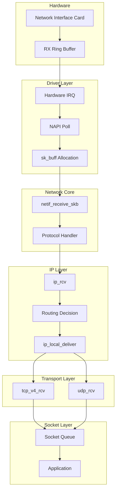

---
tags:
  - balanced
  - intermediate
  - kernel_networking
  - medium-read
  - napi
  - network_stack
  - packet_processing
  - sk_buff
  - 시스템프로그래밍
difficulty: INTERMEDIATE
learning_time: "4-6시간"
main_topic: "시스템 프로그래밍"
priority_score: 4
---

# Chapter 7-2A: 리눅스 네트워크 스택 아키텍처

## 도입: 패킷의 여정

### 🌊 데이터의 대서사시

어느 날, 구글 서버에서 출발한 작은 패킷이 있었습니다. 이 패킷의 목표는 당신의 브라우저까지 무사히 도착하는 것이었죠. 하지만 이 여정은 마치 반지의 제왕의 프로도처럼 험난했습니다!

```bash
# 패킷의 여정 추적하기
$ tcpdump -i eth0 -n port 443 -X
16:42:31.123456 IP 142.250.185.46.443 > 192.168.1.100.54321:
  Flags [P.], seq 1:1461, ack 1, win 65535, length 1460
  0x0000:  4500 05dc 3a2b 4000 3606 8c4a 8efa b92e  E...:+@.6..J....
  0x0010:  c0a8 0164 01bb d431 5e2a 1b3c 7f3d 4a21  ...d...1^*.<.=J!
```

네트워크 카드에 도착한 패킷이 애플리케이션까지 전달되는 과정은 복잡한 여정입니다. 하드웨어 인터럽트부터 시작하여 드라이버, 네트워크 스택, 소켓 버퍼를 거쳐 최종적으로 사용자 공간에 도달합니다.

### 💡 제가 경험한 패킷 처리 병목

제가 게임 서버를 개발할 때의 일입니다. 동시 접속자 1만 명을 목표로 했는데, 5천 명에서 서버가 멈춰버렸습니다. 문제는 패킷 처리 과정의 각 단계에서 발생하는 미세한 지연이었죠:

```bash
# 네트워크 스택 지연 측정
$ perf record -e net:* -a sleep 10
$ perf report

# 결과
Overhead  Command          Symbol
  23.45%  [kernel]        [k] __netif_receive_skb_core
  18.32%  [kernel]        [k] ip_rcv
  15.67%  [kernel]        [k] tcp_v4_rcv
  12.89%  [kernel]        [k] skb_copy_datagram_iter
```

이 여정의 각 단계는 성능과 직결됩니다. 현대의 10Gbps, 100Gbps 네트워크에서는 마이크로초 단위의 최적화가 중요하며, DPDK나 XDP 같은 커널 바이패스 기술이 등장한 배경이기도 합니다.

🎯 **실전 팁**: 100Gbps 네트워크에서는 패킷 하나당 6.7 나노초밖에 처리 시간이 없습니다! 이는 CPU 사이클로 따지면 겨우 20 사이클 정도입니다.

## 리눅스 네트워크 스택 아키텍처

### 패킷 수신 경로



### sk_buff: 네트워크 패킷의 핵심 구조체

#### 📦 sk_buff의 탄생 비화

sk_buff(socket buffer)는 리눅스 네트워킹의 심장입니다. 이 구조체는 1991년 리누스 토르발스가 처음 설계했는데, 당시엔 단 50줄짜리 구조체였습니다. 지금은? 무려 200줄이 넘습니다!

제가 처음 sk_buff를 분석했을 때, 마치 스위스 군용 칼을 보는 기분이었습니다. 모든 기능이 다 들어있었거든요:

```c
// sk_buff 메모리 레이아웃 시각화
/*
 * +------------------+
 * | struct sk_buff   |  <-- 메타데이터 (약 240 바이트)
 * +------------------+
 * | headroom        |  <-- 프로토콜 헤더 추가 공간
 * +------------------+
 * | data            |  <-- 실제 패킷 데이터
 * |                 |
 * | (payload)       |
 * +------------------+
 * | tailroom        |  <-- 추가 데이터 공간
 * +------------------+
 * | skb_shared_info |  <-- 프래그먼트 정보
 * +------------------+
 */
```

```c
// Socket Buffer: 리눅스 네트워킹의 핵심
// 이 구조체 하나가 패킷의 모든 정보를 담고 있습니다!
struct sk_buff {
    union {
        struct {
            struct sk_buff *next;
            struct sk_buff *prev;
            union {
                struct net_device *dev;
                unsigned long dev_scratch;
            };
        };
        struct rb_node rbnode;
        struct list_head list;
    };
    
    union {
        struct sock *sk;
        int ip_defrag_offset;
    };
    
    union {
        ktime_t tstamp;
        u64 skb_mstamp_ns;
    };
    
    char cb[48] __aligned(8);  // Control Buffer
    
    union {
        struct {
            unsigned long _skb_refdst;
            void (*destructor)(struct sk_buff *skb);
        };
        struct list_head tcp_tsorted_anchor;
    };
    
    unsigned long _nfct;
    unsigned int len, data_len;
    __u16 mac_len, hdr_len;
    
    __u16 queue_mapping;
    __u8 __cloned_offset[0];
    __u8 cloned:1,
         nohdr:1,
         fclone:2,
         peeked:1,
         head_frag:1,
         pfmemalloc:1;
    
    __u8 active_extensions;
    
    union {
        struct {
            __u8 __pkt_type_offset[0];
            __u8 pkt_type:3;
            __u8 ignore_df:1;
            __u8 nf_trace:1;
            __u8 ip_summed:2;
            __u8 ooo_okay:1;
            
            __u8 l4_hash:1;
            __u8 sw_hash:1;
            __u8 wifi_acked_valid:1;
            __u8 wifi_acked:1;
            __u8 no_fcs:1;
            __u8 encapsulation:1;
            __u8 encap_hdr_csum:1;
            __u8 csum_valid:1;
        };
        __wsum csum;
    };
    
    __u32 priority;
    int skb_iif;
    __u32 hash;
    __be16 vlan_proto;
    __u16 vlan_tci;
    
    union {
        unsigned int napi_id;
        unsigned int sender_cpu;
    };
    
    __u32 secmark;
    
    union {
        __u32 mark;
        __u32 reserved_tailroom;
    };
    
    union {
        __be16 inner_protocol;
        __u8 inner_ipproto;
    };
    
    __u16 inner_transport_header;
    __u16 inner_network_header;
    __u16 inner_mac_header;
    
    __be16 protocol;
    __u16 transport_header;
    __u16 network_header;
    __u16 mac_header;
    
    /* 실제 데이터 포인터들 */
    sk_buff_data_t tail;
    sk_buff_data_t end;
    unsigned char *head, *data;
    unsigned int truesize;
    refcount_t users;
    
    /* Extensions */
    struct skb_ext *extensions;
};

// sk_buff 할당과 관리
struct sk_buff *alloc_skb(unsigned int size, gfp_t priority) {
    struct kmem_cache *cache;
    struct sk_buff *skb;
    u8 *data;
    
    cache = (flags & SKB_ALLOC_FCLONE)
        ? skbuff_fclone_cache : skbuff_head_cache;
    
    skb = kmem_cache_alloc_node(cache, priority, NUMA_NO_NODE);
    if (!skb)
        goto out;
        
    size = SKB_DATA_ALIGN(size);
    size += SKB_DATA_ALIGN(sizeof(struct skb_shared_info));
    data = kmalloc_reserve(size, priority, NUMA_NO_NODE, NULL);
    if (!data)
        goto nodata;
        
    memset(skb, 0, offsetof(struct sk_buff, tail));
    skb->truesize = SKB_TRUESIZE(size);
    refcount_set(&skb->users, 1);
    skb->head = data;
    skb->data = data;
    skb_reset_tail_pointer(skb);
    skb->end = skb->tail + size;
    skb->mac_header = (typeof(skb->mac_header))~0U;
    skb->transport_header = (typeof(skb->transport_header))~0U;
    
    /* shinfo 초기화 */
    struct skb_shared_info *shinfo = skb_shinfo(skb);
    memset(shinfo, 0, offsetof(struct skb_shared_info, dataref));
    atomic_set(&shinfo->dataref, 1);
    
    return skb;
    
nodata:
    kmem_cache_free(cache, skb);
out:
    return NULL;
}

// 패킷 데이터 조작
static inline unsigned char *skb_put(struct sk_buff *skb, unsigned int len) {
    unsigned char *tmp = skb_tail_pointer(skb);
    SKB_LINEAR_ASSERT(skb);
    skb->tail += len;
    skb->len  += len;
    return tmp;
}

static inline unsigned char *skb_push(struct sk_buff *skb, unsigned int len) {
    skb->data -= len;
    skb->len  += len;
    return skb->data;
}

static inline unsigned char *skb_pull(struct sk_buff *skb, unsigned int len) {
    skb->len -= len;
    return skb->data += len;
}
```

## NAPI와 인터럽트 처리

### 🚨 인터럽트 폭풍의 공포

2000년대 초, 기가비트 이더넷이 등장했을 때 큰 문제가 발생했습니다. 바로 "인터럽트 폭풍(Interrupt Storm)"이었죠. 초당 148만 개의 패킷이 도착하니, CPU가 인터럽트 처리만 하다가 실제 일은 못하는 상황이 발생했습니다.

```bash
# 인터럽트 폭풍 관찰하기
$ watch -n 1 'cat /proc/interrupts | grep eth0'
CPU0       CPU1       CPU2       CPU3
1234567    0          0          0         eth0-rx-0  # CPU0만 죽어나가는 중...
```

그래서 리눅스 커뮤니티는 NAPI(New API)라는 천재적인 해결책을 만들었습니다:

### NAPI (New API) 폴링 메커니즘

#### 🎯 NAPI의 핵심 아이디어

"패킷이 많이 올 때는 인터럽트를 끄고 폴링하자!"

이것은 마치 택배 기사님이 하루에 100번 초인종을 누르는 대신, 한 번에 모아서 가져다주는 것과 같습니다:

```python
# NAPI 동작 원리 (의사코드)
if 패킷_도착:
    if 패킷_많음:
        인터럽트_비활성화()
        while 패킷_있음 and budget > 0:
            패킷_처리()
            budget -= 1
        if 패킷_없음:
            인터럽트_재활성화()
    else:
        일반_인터럽트_처리()
```

```c
// NAPI 구조체
struct napi_struct {
    struct list_head poll_list;
    unsigned long state;
    int weight;
    int (*poll)(struct napi_struct *, int);
    
    unsigned int gro_bitmask;
    int gro_count;
    struct sk_buff *gro_hash[GRO_HASH_BUCKETS];
    struct sk_buff *skb;
    
    struct list_head rx_list;
    int rx_count;
    
    struct hrtimer timer;
    struct list_head dev_list;
    struct hlist_node napi_hash_node;
    unsigned int napi_id;
};

// 네트워크 드라이버의 인터럽트 핸들러
// 이 함수는 초당 수십만 번 호출될 수 있습니다!
static irqreturn_t e1000_intr(int irq, void *data) {
    struct net_device *netdev = data;
    struct e1000_adapter *adapter = netdev_priv(netdev);
    u32 icr = er32(ICR);  // Interrupt Cause Read
    
    if (!icr)
        return IRQ_NONE;
        
    // 인터럽트 비활성화
    ew32(IMC, ~0);
    E1000_WRITE_FLUSH();
    
    // NAPI 스케줄
    if (likely(napi_schedule_prep(&adapter->napi))) {
        __napi_schedule(&adapter->napi);
    }
    
    return IRQ_HANDLED;
}

// NAPI 폴 함수
// budget은 한 번에 처리할 패킷 수 제한 (보통 64개)
static int e1000_poll(struct napi_struct *napi, int budget) {
    struct e1000_adapter *adapter = container_of(napi,
                                                struct e1000_adapter,
                                                napi);
    struct net_device *netdev = adapter->netdev;
    int work_done = 0;
    
    // RX 처리
    work_done = e1000_clean_rx_irq(adapter, budget);
    
    // TX 완료 처리
    e1000_clean_tx_irq(adapter);
    
    // 모든 패킷 처리 완료
    if (work_done < budget) {
        napi_complete_done(napi, work_done);
        
        // 인터럽트 재활성화
        ew32(IMS, IMS_ENABLE_MASK);
        E1000_WRITE_FLUSH();
    }
    
    return work_done;
}

// RX 패킷 처리
static int e1000_clean_rx_irq(struct e1000_adapter *adapter, int budget) {
    struct e1000_rx_ring *rx_ring = adapter->rx_ring;
    struct net_device *netdev = adapter->netdev;
    struct pci_dev *pdev = adapter->pdev;
    struct e1000_rx_desc *rx_desc;
    struct sk_buff *skb;
    int work_done = 0;
    
    rx_desc = E1000_RX_DESC(*rx_ring, rx_ring->next_to_clean);
    
    while (rx_desc->status & E1000_RXD_STAT_DD) {
        struct sk_buff *skb;
        u16 length;
        
        if (work_done >= budget)
            break;
            
        rmb();  // 디스크립터 읽기 배리어
        
        length = le16_to_cpu(rx_desc->length);
        skb = rx_ring->buffer_info[rx_ring->next_to_clean].skb;
        
        // DMA 언맵
        dma_unmap_single(&pdev->dev,
                        rx_ring->buffer_info[rx_ring->next_to_clean].dma,
                        adapter->rx_buffer_len,
                        DMA_FROM_DEVICE);
        
        // sk_buff 설정
        skb_put(skb, length);
        skb->protocol = eth_type_trans(skb, netdev);
        
        // 체크섬 오프로드
        e1000_rx_checksum(adapter, rx_desc, skb);
        
        // GRO (Generic Receive Offload)
        napi_gro_receive(&adapter->napi, skb);
        
        work_done++;
        
        // 다음 디스크립터로
        rx_ring->next_to_clean++;
        if (rx_ring->next_to_clean == rx_ring->count)
            rx_ring->next_to_clean = 0;
            
        rx_desc = E1000_RX_DESC(*rx_ring, rx_ring->next_to_clean);
    }
    
    // RX 버퍼 재충전
    e1000_alloc_rx_buffers(adapter);
    
    return work_done;
}
```

## 핵심 요점

### 1. 패킷 처리 경로

네트워크 카드에서 애플리케이션까지의 복잡한 여정과 각 단계의 최적화 포인트

### 2. sk_buff 구조체

리눅스 네트워킹의 핵심 데이터 구조로 패킷의 모든 메타데이터와 실제 데이터를 관리

### 3. NAPI 메커니즘  

인터럽트 폭풍을 방지하고 고성능 패킷 처리를 위한 폴링과 인터럽트의 하이브리드 방식

---

**이전**: [Chapter 7-2: TCP/IP 스택 개요](./07-13-tcp-ip-stack.md)  
**다음**: [Chapter 7-2B: TCP 상태 머신](./07-14-tcp-state-machine.md)에서 TCP 연결 관리와 상태 전이를 학습합니다.

## 📚 관련 문서

### 📖 현재 문서 정보

- **난이도**: INTERMEDIATE
- **주제**: 시스템 프로그래밍
- **예상 시간**: 4-6시간

### 🎯 학습 경로

- [📚 INTERMEDIATE 레벨 전체 보기](../learning-paths/intermediate/)
- [🏠 메인 학습 경로](../learning-paths/)
- [📋 전체 가이드 목록](../README.md)

### 📂 같은 챕터 (chapter-07-network-programming)

- [Chapter 7-1: 소켓 프로그래밍의 기초 개요](./07-01-socket-basics.md)
- [Chapter 7-1A: 소켓의 개념과 기본 구조](./07-02-socket-fundamentals.md)
- [Chapter 7-1B: TCP 소켓 프로그래밍](./07-10-tcp-programming.md)
- [Chapter 7-1C: UDP와 Raw 소켓 프로그래밍](./07-11-udp-raw-sockets.md)
- [Chapter 7-1D: 소켓 옵션과 Unix 도메인 소켓](./07-12-socket-options-unix.md)

### 🏷️ 관련 키워드

`network_stack`, `sk_buff`, `napi`, `kernel_networking`, `packet_processing`

### ⏭️ 다음 단계 가이드

- 실무 적용을 염두에 두고 프로젝트에 적용해보세요
- 관련 도구들을 직접 사용해보는 것이 중요합니다
