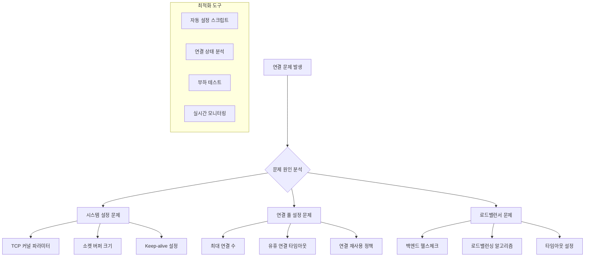

---
tags:
  - advanced
  - connection-pool
  - deep-study
  - hands-on
  - kernel-tuning
  - load-balancer
  - performance-optimization
  - tcp-optimization
  - 인프라스트럭처
difficulty: ADVANCED
learning_time: "8-12시간"
main_topic: "인프라스트럭처"
priority_score: 4
---

# 7.4.9: 연결 풀 최적화

마이크로서비스 간 통신에서 "연결이 자꾸 끊어져요" 문제의 대부분은 연결 풀과 시스템 설정 최적화로 해결할 수 있습니다. 자동화된 스크립트를 통해 TCP 설정을 체계적으로 관리하고 로드밸런서를 최적화하는 방법을 알아보겠습니다.

## 연결 풀 최적화 전략



## 1. 종합 TCP 최적화 스크립트

연결 풀과 로드밸런서 설정을 최적화하는 자동화 스크립트입니다.

```bash
#!/bin/bash
# optimize_tcp_connections.sh - TCP 연결 최적화 종합 도구

set -euo pipefail

# 색상 정의로 가독성 향상
RED='\033[0;31m'
GREEN='\033[0;32m'
YELLOW='\033[1;33m'
BLUE='\033[0;34m'
NC='\033[0m' # No Color

# 로깅 시스템 - 체계적인 메시지 출력
log_info() {
    echo -e "${BLUE}[INFO]${NC} $1"
}

log_success() {
    echo -e "${GREEN}[SUCCESS]${NC} $1"
}

log_warning() {
    echo -e "${YELLOW}[WARNING]${NC} $1"
}

log_error() {
    echo -e "${RED}[ERROR]${NC} $1"
}

# 기본 설정값 - 프로덕션 환경에 최적화
DEFAULT_TARGET_HOST="localhost"
DEFAULT_TARGET_PORT="8080"
DEFAULT_MAX_CONNECTIONS="1000"
DEFAULT_KEEPALIVE_TIME="7200"      # 2시간
DEFAULT_TCP_FIN_TIMEOUT="60"       # 1분

# 설정 파일 관리
CONFIG_FILE="tcp_optimization.conf"

# 설정 파일에서 환경별 설정 로드
# 개발, 스테이징, 프로덕션 환경에 따라 다른 값 사용 가능
load_config() {
    if [[ -f "$CONFIG_FILE" ]]; then
        source "$CONFIG_FILE"
        log_info "설정 파일 로드: $CONFIG_FILE"
    else
        log_warning "설정 파일이 없습니다. 기본값 사용: $CONFIG_FILE"
    fi

    # 환경변수나 설정 파일이 없는 경우 기본값 적용
    TARGET_HOST=${TARGET_HOST:-$DEFAULT_TARGET_HOST}
    TARGET_PORT=${TARGET_PORT:-$DEFAULT_TARGET_PORT}
    MAX_CONNECTIONS=${MAX_CONNECTIONS:-$DEFAULT_MAX_CONNECTIONS}
    KEEPALIVE_TIME=${KEEPALIVE_TIME:-$DEFAULT_KEEPALIVE_TIME}
    TCP_FIN_TIMEOUT=${TCP_FIN_TIMEOUT:-$DEFAULT_TCP_FIN_TIMEOUT}
}

# 시스템 TCP 설정을 프로덕션에 최적화
# 대용량 트래픽을 처리하기 위한 커널 파라미터 튜닝
optimize_tcp_settings() {
    log_info "TCP 커널 파라미터 최적화 중..."

    # 기존 설정 백업 (안전한 롤백을 위해)
    if [[ ! -f /etc/sysctl.conf.backup ]]; then
        sudo cp /etc/sysctl.conf /etc/sysctl.conf.backup
        log_info "기존 sysctl.conf 백업 생성"
    fi

    # TCP 최적화 설정을 시스템에 적용
    # 각 설정의 의미와 영향을 주석으로 상세히 설명
    cat << EOF | sudo tee -a /etc/sysctl.conf > /dev/null

# TCP 연결 최적화 설정 ($(date))
# Keep-alive 관련 설정 - 비활성 연결 감지 및 정리
net.ipv4.tcp_keepalive_time = $KEEPALIVE_TIME     # Keep-alive 프로브 시작 시간 (초)
net.ipv4.tcp_keepalive_probes = 9                 # Keep-alive 프로브 최대 횟수
net.ipv4.tcp_keepalive_intvl = 75                 # Keep-alive 프로브 간격 (초)

# 연결 재사용 최적화 - TIME_WAIT 상태 관리
net.ipv4.tcp_tw_reuse = 1                         # TIME_WAIT 소켓 재사용 허용
net.ipv4.tcp_fin_timeout = $TCP_FIN_TIMEOUT       # FIN_WAIT_2 상태 타임아웃

# 소켓 버퍼 크기 최적화 - 대용량 데이터 전송 성능 향상
net.core.rmem_default = 262144                    # 기본 수신 버퍼 크기 (256KB)
net.core.rmem_max = 16777216                      # 최대 수신 버퍼 크기 (16MB)
net.core.wmem_default = 262144                    # 기본 송신 버퍼 크기 (256KB)
net.core.wmem_max = 16777216                      # 최대 송신 버퍼 크기 (16MB)
net.ipv4.tcp_rmem = 4096 87380 16777216          # TCP 수신 버퍼 범위
net.ipv4.tcp_wmem = 4096 65536 16777216          # TCP 송신 버퍼 범위

# 연결 큐 크기 최적화 - 동시 연결 처리 능력 향상
net.core.somaxconn = 65535                        # listen() 백로그 큐 최대 크기
net.ipv4.tcp_max_syn_backlog = 65535              # SYN 백로그 큐 크기

# 추가 TCP 성능 최적화
net.ipv4.tcp_no_metrics_save = 1                  # TCP 메트릭 저장 비활성화
net.ipv4.tcp_moderate_rcvbuf = 1                  # 수신 버퍼 자동 조정
net.ipv4.tcp_congestion_control = bbr             # BBR 혼잡 제어 알고리즘 사용
EOF

    # 설정 즉시 적용
    sudo sysctl -p
    log_success "TCP 설정 최적화 완료"
}

# 현재 TCP 연결 상태를 상세히 분석
# 문제 진단을 위한 종합적인 연결 정보 수집
analyze_connections() {
    log_info "TCP 연결 상태 분석 중..."

    echo "=== TCP 연결 상태 통계 ==="
    # ss 명령어로 전체 소켓 상태 요약
    ss -s

    echo -e "\n=== 연결 상태별 카운트 ==="
    # 각 TCP 상태별로 연결 수를 집계
    # ESTABLISHED, TIME_WAIT, LISTEN 등의 분포를 확인
    ss -tan | awk 'NR>1 {count[$1]++} END {for (state in count) print state, count[state]}' | sort -k2 -nr

    echo -e "\n=== 포트별 연결 수 (상위 10개) ==="
    # 가장 많은 연결을 받는 포트 식별
    # 특정 서비스의 부하 집중 여부 확인 가능
    ss -tan | awk 'NR>1 {split($4,a,":"); count[a[length(a)]]++} END {for (port in count) print port, count[port]}' | sort -k2 -nr | head -10

    echo -e "\n=== TIME_WAIT 상태 연결 분석 ==="
    local time_wait_count=$(ss -tan | grep TIME-WAIT | wc -l)
    echo "TIME_WAIT 연결 수: $time_wait_count"

    # TIME_WAIT 과다 시 경고
    if [[ $time_wait_count -gt 10000 ]]; then
        log_warning "TIME_WAIT 연결이 너무 많습니다 ($time_wait_count). 최적화가 필요합니다."
    fi

    echo -e "\n=== 로컬 포트 사용량 ==="
    # 포트 고갈 위험성 체크
    local local_port_range=$(sysctl net.ipv4.ip_local_port_range | cut -d= -f2)
    echo "로컬 포트 범위: $local_port_range"

    local used_ports=$(ss -tan | grep ESTAB | wc -l)
    echo "사용 중인 포트: $used_ports"
}

# 애플리케이션별 연결 풀 설정 검증
# Java, Node.js 등 각 플랫폼의 연결 풀 상태를 점검
validate_connection_pools() {
    log_info "애플리케이션 연결 풀 설정 검증 중..."

    # Java 애플리케이션 연결 상태 분석
    if command -v jps >/dev/null 2>&1; then
        echo "=== Java 프로세스 연결 상태 ==="
        for pid in $(jps -q); do
            if [[ -n $pid ]]; then
                local java_app=$(jps | grep $pid | cut -d' ' -f2-)
                echo "Java 애플리케이션: $java_app (PID: $pid)"

                # 해당 프로세스의 TCP 소켓 연결 수
                local socket_count=$(lsof -p $pid 2>/dev/null | grep 'IPv4.*TCP' | wc -l)
                echo "  TCP 소켓 수: $socket_count"

                # TCP 연결의 상태별 분포
                echo "  연결 상태 분포:"
                lsof -p $pid 2>/dev/null | grep 'IPv4.*TCP' | awk '{print $8}' | sort | uniq -c
                echo ""
            fi
        done
    fi

    # Node.js 애플리케이션 연결 상태 분석
    if pgrep node >/dev/null; then
        echo "=== Node.js 프로세스 연결 상태 ==="
        for pid in $(pgrep node); do
            local cmd=$(ps -p $pid -o cmd --no-headers | head -1)
            echo "Node.js 애플리케이션: $cmd (PID: $pid)"

            local socket_count=$(lsof -p $pid 2>/dev/null | grep 'IPv4.*TCP' | wc -l)
            echo "  TCP 소켓 수: $socket_count"
            echo ""
        done
    fi
}

# 네트워크 지연 시간과 연결 품질 테스트
test_network_latency() {
    local target_host=$1
    local target_port=$2

    log_info "네트워크 지연시간 테스트: $target_host:$target_port"

    # 여러 번의 연결 시도로 일관성 확인
    for i in {1..5}; do
        local start_time=$(date +%s%N)  # 나노초 정밀도로 시간 측정
        if timeout 5s bash -c "echo >/dev/tcp/$target_host/$target_port" 2>/dev/null; then
            local end_time=$(date +%s%N)
            local duration=$((($end_time - $start_time) / 1000000)) # 밀리초로 변환
            echo "연결 시도 $i: ${duration}ms"
        else
            echo "연결 시도 $i: 실패"
        fi
        sleep 1
    done
}

# 대량 연결을 통한 서버 부하 테스트
# 연결 풀의 한계와 서버 처리 능력을 검증
stress_test_connections() {
    local target_host=$1
    local target_port=$2
    local max_connections=$3

    log_info "연결 풀 부하 테스트 시작: $max_connections개 동시 연결"

    # 임시 디렉토리에서 결과 수집
    local temp_dir=$(mktemp -d)
    local success_count=0
    local failure_count=0

    # 동시 연결 생성 - 백그라운드 프로세스 활용
    for ((i=1; i<=max_connections; i++)); do
        {
            # 각 연결 시도를 별도 프로세스로 실행
            if timeout 10s bash -c "echo 'test' >/dev/tcp/$target_host/$target_port" 2>/dev/null; then
                echo "success" > "$temp_dir/conn_$i"
            else
                echo "failure" > "$temp_dir/conn_$i"
            fi
        } &

        # 시스템 부하 관리를 위해 100개마다 대기
        if (( i % 100 == 0 )); then
            wait  # 현재 배치의 모든 프로세스 완료 대기
        fi
    done

    # 모든 백그라운드 프로세스 완료 대기
    wait

    # 결과 집계 및 분석
    success_count=$(grep -l "success" "$temp_dir"/conn_* 2>/dev/null | wc -l)
    failure_count=$(grep -l "failure" "$temp_dir"/conn_* 2>/dev/null | wc -l)

    echo "=== 부하 테스트 결과 ==="
    echo "성공한 연결: $success_count"
    echo "실패한 연결: $failure_count"
    echo "성공률: $(( success_count * 100 / max_connections ))%"

    # 임시 파일 정리
    rm -rf "$temp_dir"

    # 실패율이 높은 경우 경고
    if (( failure_count > max_connections / 10 )); then
        log_warning "실패율이 10%를 초과합니다. 연결 풀 설정을 검토하세요."
    fi
}

# 실시간 연결 상태 모니터링
# 지정된 시간 동안 연결 상태 변화를 추적
monitor_connections() {
    local duration=${1:-60}

    log_info "연결 상태 모니터링 시작 (${duration}초)"

    local end_time=$(($(date +%s) + duration))

    while [[ $(date +%s) -lt $end_time ]]; do
        clear
        echo "=== TCP 연결 모니터링 ($(date)) ==="

        # 현재 TCP 연결 상태 요약
        echo "현재 연결 상태:"
        ss -s | grep TCP

        echo -e "\n포트별 연결 수 (상위 5개):"
        ss -tan | awk 'NR>1 {split($4,a,":"); count[a[length(a)]]++} END {for (port in count) print port, count[port]}' | sort -k2 -nr | head -5

        echo -e "\n연결 상태별 분포:"
        ss -tan | awk 'NR>1 {count[$1]++} END {for (state in count) print state, count[state]}' | sort -k2 -nr

        echo -e "\n시스템 부하:"
        uptime

        sleep 10
    done
}

# HAProxy 설정 파일 생성
# 고성능 로드밸런서를 위한 최적화된 설정
generate_haproxy_config() {
    local backend_servers=$1

    log_info "HAProxy 설정 파일 생성 중..."

    cat << EOF > haproxy_optimized.cfg
global
    daemon
    maxconn 4096                    # 최대 동시 연결 수
    log stdout local0               # 로깅 설정

defaults
    mode http                       # HTTP 모드
    timeout connect 5000ms          # 백엔드 연결 타임아웃
    timeout client 50000ms          # 클라이언트 타임아웃
    timeout server 50000ms          # 서버 타임아웃
    option httplog                  # HTTP 로그 포맷
    option dontlognull             # 헬스체크 로그 제외
    retries 3                      # 재시도 횟수
    option redispatch              # 서버 장애시 재분배

frontend web_frontend
    bind *:80                      # 80 포트로 바인딩
    option httpclose               # HTTP 연결 관리
    option forwardfor              # X-Forwarded-For 헤더 추가
    default_backend web_servers

backend web_servers
    balance roundrobin             # 라운드로빈 로드밸런싱
    option httpchk GET /health     # 헬스체크 경로
    timeout check 3000ms          # 헬스체크 타임아웃

EOF

    # 백엔드 서버 목록을 설정에 추가
    IFS=',' read -ra SERVERS <<< "$backend_servers"
    for i in "${!SERVERS[@]}"; do
        echo "    server web$((i+1)) ${SERVERS[i]} check" >> haproxy_optimized.cfg
    done

    log_success "HAProxy 설정 파일 생성 완료: haproxy_optimized.cfg"
}

# Nginx 설정 파일 생성
# 연결 풀링과 Keep-alive 최적화에 중점
generate_nginx_config() {
    local backend_servers=$1

    log_info "Nginx 설정 파일 생성 중..."

    cat << EOF > nginx_optimized.conf
upstream backend_servers {
    # 연결 풀 최적화 설정
    keepalive 100;                 # 백엔드와의 Keep-alive 연결 풀 크기
    keepalive_requests 1000;       # Keep-alive 연결당 최대 요청 수
    keepalive_timeout 60s;         # Keep-alive 연결 타임아웃

EOF

    # 백엔드 서버 추가
    IFS=',' read -ra SERVERS <<< "$backend_servers"
    for server in "${SERVERS[@]}"; do
        echo "    server $server max_fails=3 fail_timeout=30s;" >> nginx_optimized.conf
    done

    cat << EOF >> nginx_optimized.conf
}

server {
    listen 80;

    # 클라이언트 연결 최적화
    keepalive_timeout 65;          # 클라이언트 Keep-alive 타임아웃
    keepalive_requests 100;        # Keep-alive 연결당 최대 요청

    location / {
        proxy_pass http://backend_servers;
        proxy_http_version 1.1;              # HTTP/1.1 사용 (Keep-alive 지원)
        proxy_set_header Connection "";       # Connection 헤더 초기화
        proxy_set_header Host \$host;
        proxy_set_header X-Real-IP \$remote_addr;
        proxy_set_header X-Forwarded-For \$proxy_add_x_forwarded_for;

        # 타임아웃 설정
        proxy_connect_timeout 5s;           # 백엔드 연결 타임아웃
        proxy_send_timeout 60s;             # 백엔드 전송 타임아웃
        proxy_read_timeout 60s;             # 백엔드 읽기 타임아웃

        # 응답 버퍼링 최적화
        proxy_buffering on;
        proxy_buffer_size 4k;
        proxy_buffers 8 4k;
    }

    # 헬스체크 엔드포인트
    location /health {
        access_log off;
        return 200 "healthy\n";
        add_header Content-Type text/plain;
    }
}
EOF

    log_success "Nginx 설정 파일 생성 완료: nginx_optimized.conf"
}

# 메인 실행 로직
# 명령행 인자에 따라 적절한 기능 실행
main() {
    echo "=== TCP 연결 최적화 도구 ==="
    echo ""

    # 설정 파일 로드
    load_config

    # 첫 번째 인자에 따른 동작 분기
    case "${1:-analyze}" in
        "optimize")
            # 시스템 TCP 설정 최적화 실행
            optimize_tcp_settings
            ;;
        "analyze")
            # 현재 연결 상태 분석
            analyze_connections
            validate_connection_pools
            ;;
        "test")
            # 네트워크 테스트 및 부하 테스트
            test_network_latency "$TARGET_HOST" "$TARGET_PORT"
            stress_test_connections "$TARGET_HOST" "$TARGET_PORT" "$MAX_CONNECTIONS"
            ;;
        "monitor")
            # 실시간 연결 모니터링 (기본 60초)
            monitor_connections "${2:-60}"
            ;;
        "haproxy")
            # HAProxy 설정 파일 생성 (기본 로컬호스트)
            generate_haproxy_config "${2:-127.0.0.1:8080}"
            ;;
        "nginx")
            # Nginx 설정 파일 생성 (기본 로컬호스트)
            generate_nginx_config "${2:-127.0.0.1:8080}"
            ;;
        *)
            # 사용법 안내
            echo "사용법: $0 [optimize|analyze|test|monitor|haproxy|nginx]"
            echo ""
            echo "optimize - 시스템 TCP 설정 최적화"
            echo "analyze  - 현재 연결 상태 분석"
            echo "test     - 연결 테스트 및 부하 테스트"
            echo "monitor  - 실시간 연결 모니터링"
            echo "haproxy  - HAProxy 설정 파일 생성"
            echo "nginx    - Nginx 설정 파일 생성"
            exit 1
            ;;
    esac
}

# 스크립트 실행 시작점
main "$@"
```

## 2. 설정 파일 예제

환경별로 다른 최적화 설정을 적용할 수 있는 설정 파일입니다.

```bash
# tcp_optimization.conf - 환경별 TCP 최적화 설정

# === 개발 환경 설정 ===
if [[ "${ENVIRONMENT:-dev}" == "dev" ]]; then
    TARGET_HOST="localhost"
    TARGET_PORT="8080"
    MAX_CONNECTIONS="100"
    KEEPALIVE_TIME="3600"         # 1시간 (개발용 짧은 설정)
    TCP_FIN_TIMEOUT="30"
    
    # 개발 환경에서는 낮은 부하 설정
    WORKER_PROCESSES="2"
    CONNECTION_POOL_SIZE="10"
fi

# === 스테이징 환경 설정 ===
if [[ "${ENVIRONMENT}" == "staging" ]]; then
    TARGET_HOST="staging.example.com"
    TARGET_PORT="80"
    MAX_CONNECTIONS="500"
    KEEPALIVE_TIME="7200"         # 2시간
    TCP_FIN_TIMEOUT="60"
    
    # 프로덕션과 유사한 설정으로 테스트
    WORKER_PROCESSES="4"
    CONNECTION_POOL_SIZE="50"
fi

# === 프로덕션 환경 설정 ===
if [[ "${ENVIRONMENT}" == "prod" ]]; then
    TARGET_HOST="api.example.com"
    TARGET_PORT="443"
    MAX_CONNECTIONS="2000"         # 높은 부하 처리
    KEEPALIVE_TIME="7200"          # 2시간
    TCP_FIN_TIMEOUT="60"
    
    # 프로덕션 최적화 설정
    WORKER_PROCESSES="8"
    CONNECTION_POOL_SIZE="200"
    
    # SSL/TLS 최적화 설정
    SSL_SESSION_CACHE="shared:SSL:10m"
    SSL_SESSION_TIMEOUT="10m"
fi

# === 공통 백엔드 서버 설정 ===
BACKEND_SERVERS="192.168.1.10:8080,192.168.1.11:8080,192.168.1.12:8080"

# === 모니터링 설정 ===
MONITORING_INTERVAL="10"        # 10초마다 상태 체크
ALERT_THRESHOLD_CONNECTION="1500"  # 연결 수 경고 임계값
ALERT_THRESHOLD_ERROR_RATE="0.05" # 오류율 5% 초과시 경고

# === 로그 설정 ===
LOG_LEVEL="INFO"
LOG_FILE="/var/log/tcp-optimization.log"
LOG_ROTATION="daily"
```

## 3. 실행 예제

```bash
# 스크립트 실행 권한 부여
chmod +x optimize_tcp_connections.sh

# 현재 연결 상태 분석
./optimize_tcp_connections.sh analyze

# 시스템 TCP 설정 최적화 (관리자 권한 필요)
sudo ./optimize_tcp_connections.sh optimize

# 특정 서버에 대한 부하 테스트
TARGET_HOST=api.example.com TARGET_PORT=443 ./optimize_tcp_connections.sh test

# 5분간 실시간 모니터링
./optimize_tcp_connections.sh monitor 300

# 로드밸런서 설정 파일 생성
./optimize_tcp_connections.sh haproxy "server1:8080,server2:8080,server3:8080"
./optimize_tcp_connections.sh nginx "server1:8080,server2:8080,server3:8080"
```

## 핵심 요점

### 1. 시스템 레벨 최적화

-**Keep-alive 설정**: 비활성 연결을 적절히 감지하고 정리
-**버퍼 크기 조정**: 대용량 데이터 전송을 위한 버퍼 최적화
-**연결 큐 확장**: 동시 연결 처리 능력 향상

### 2. 로드밸런서 최적화

-**HAProxy**: 고성능 레이어 7 로드밸런싱
-**Nginx**: 연결 풀링과 Keep-alive 최적화
-**헬스체크**: 장애 서버 자동 감지 및 배제

### 3. 모니터링과 분석

-**실시간 상태 추적**: 연결 수, 상태별 분포, 포트 사용량
-**부하 테스트**: 시스템 한계점 파악
-**자동 알림**: 임계값 초과시 경고

---

**이전**: [07-41-tcp-analysis-tools.md](./07-41-tcp-analysis-tools.md)  
**다음**: [07-43-realtime-connection-monitoring.md](./07-43-realtime-connection-monitoring.md)에서 Python 기반 실시간 모니터링 시스템을 학습합니다.

## 📚 관련 문서

### 📖 현재 문서 정보

-**난이도**: ADVANCED
-**주제**: 인프라스트럭처
-**예상 시간**: 8-12시간

### 🎯 학습 경로

- [📚 ADVANCED 레벨 전체 보기](../learning-paths/advanced/)
- [🏠 메인 학습 경로](../learning-paths/)
- [📋 전체 가이드 목록](../README.md)

### 📂 같은 챕터 (chapter-07-network-programming)

- [7.1.1: 소켓 프로그래밍의 기초 개요](./07-01-socket-basics.md)
- [7.1.2: 소켓의 개념과 기본 구조](./07-02-socket-fundamentals.md)
- [7.1.3: TCP 소켓 프로그래밍](./07-10-tcp-programming.md)
- [7.1.4: UDP와 Raw 소켓 프로그래밍](./07-11-udp-raw-sockets.md)
- [7.1.5: 소켓 옵션과 Unix 도메인 소켓](./07-12-socket-options-unix.md)

### 🏷️ 관련 키워드

`connection-pool`, `tcp-optimization`, `load-balancer`, `kernel-tuning`, `performance-optimization`

### ⏭️ 다음 단계 가이드

- 시스템 전체의 관점에서 이해하려 노력하세요
- 다른 고급 주제들과의 연관성을 파악해보세요
