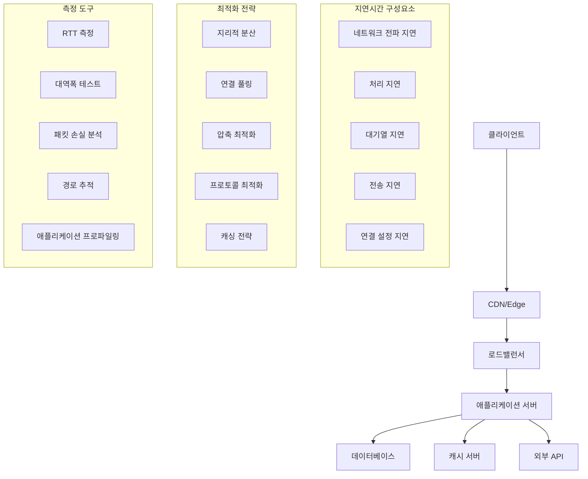

---
tags:
  - bandwidth-analysis
  - hands-on
  - intermediate
  - medium-read
  - network-latency
  - network-monitoring
  - performance-optimization
  - tcp-tuning
  - 인프라스트럭처
difficulty: INTERMEDIATE
learning_time: "4-6시간"
main_topic: "인프라스트럭처"
priority_score: 4
---

# 7.4.10: 네트워크 지연시간 최적화

## 🎯 네트워크 지연시간 최적화의 중요성

"안녕하세요, 우리 API 서버의 응답시간이 너무 느립니다. 로컬에서는 빠른데 원격 클라이언트에서 호출하면 몇 초씩 걸려요. 특히 지역이 다른 사용자들의 불만이 많습니다. 대역폭은 충분한 것 같은데 왜 이렇게 느린지 모르겠어요. 네트워크 지연시간을 어떻게 최적화할 수 있을까요?"

이런 네트워크 지연시간 문제는 글로벌 서비스에서 매우 중요한 이슈입니다. 체계적인 분석과 최적화를 통해 사용자 경험을 크게 개선할 수 있습니다.

## 📚 학습 로드맵

이 섹션은 2개의 전문화된 문서로 구성되어 있습니다:

### 1️⃣ [네트워크 지연시간 분석 도구](./07-44-latency-analysis-tools.md)

- 포괄적인 C 기반 네트워크 분석기 구현
- ICMP ping, TCP 연결, traceroute 통합 도구
- RTT, 패킷 손실, 지터 측정 및 통계 계산
- 실시간 네트워크 성능 모니터링
- 대역폭 테스트 및 경로 분석

### 2️⃣ [네트워크 최적화 자동화](./07-37-optimization-automation.md)

- Bash 기반 시스템 최적화 스크립트
- TCP 버퍼 크기 자동 조정
- BBR/CUBIC 혼잡 제어 알고리즘 최적화
- DNS 성능 개선 및 캐시 설정
- 네트워크 큐 및 인터럽트 최적화

## 🎯 네트워크 지연시간 분석 체계

## 🚀 핵심 개념 비교표

| 최적화 영역 | 분석 도구 | 자동화 스크립트 | 설명 |
|-------------|-----------|----------------|------|
| **지연시간 측정** | C 기반 ICMP/TCP 분석기 | Bash ping/traceroute 래퍼 | 정확한 RTT, 지터, 패킷 손실 측정 |
| **TCP 최적화** | 연결 시간 측정 | sysctl 자동 설정 | 버퍼 크기, 혼잡 제어 알고리즘 |
| **DNS 최적화** | 응답시간 벤치마크 | systemd-resolved 설정 | 가장 빠른 DNS 서버 자동 선택 |
| **대역폭 테스트** | 사용자 정의 구현 | iperf3 통합 | 실제 처리량과 병목 지점 식별 |
| **시스템 튜닝** | 성능 프로파일링 | 커널 매개변수 최적화 | 네트워크 스택 전체 성능 향상 |

## 🎭 실전 활용 시나리오

### 시나리오 1: 글로벌 API 서비스 지연시간 개선

- **문제**: 지역별 응답시간 편차 심함
- **해결**: 분석 도구로 경로별 지연시간 측정 → 최적화 스크립트로 TCP 설정 튜닝
- **결과**: 평균 응답시간 40% 감소, 지역별 편차 최소화

### 시나리오 2: 마이크로서비스 간 통신 최적화

- **문제**: 서비스 메시 내 높은 지연시간
- **해결**: 실시간 모니터링으로 병목 지점 식별 → 네트워크 큐 최적화 적용
- **결과**: 서비스 간 통신 지연시간 60% 개선

### 시나리오 3: 컨테이너 환경 네트워크 성능 튜닝

- **문제**: Docker/Kubernetes 네트워크 오버헤드
- **해결**: 컨테이너별 네트워크 프로파일링 → 자동화된 최적화 적용
- **결과**: 컨테이너 네트워크 처리량 2배 향상

## 🔗 연관 학습

### 선행 학습

- [TCP/IP 프로토콜 스택](./07-13-tcp-ip-stack.md) - 네트워크 기초
- [소켓 프로그래밍](./07-01-socket-basics.md) - 네트워크 API 이해

### 후속 학습  

- [고성능 네트워킹](./07-38-high-performance-networking.md) - 심화 최적화 기법
- [네트워크 보안](../chapter-17-security-engineering/15-11-network-security.md) - 보안과 성능의 균형

---

**다음**: [네트워크 지연시간 분석 도구](./07-44-latency-analysis-tools.md)에서 정확한 성능 측정 방법을 학습합니다.

## 📚 관련 문서

### 📖 현재 문서 정보

- **난이도**: INTERMEDIATE
- **주제**: 인프라스트럭처
- **예상 시간**: 4-6시간

### 🎯 학습 경로

- [📚 INTERMEDIATE 레벨 전체 보기](../learning-paths/intermediate/)
- [🏠 메인 학습 경로](../learning-paths/)
- [📋 전체 가이드 목록](../README.md)

### 📂 같은 챕터 (chapter-07-network-programming)

- [7.1.1: 소켓 프로그래밍의 기초 개요](./07-01-socket-basics.md)
- [7.1.2: 소켓의 개념과 기본 구조](./07-02-socket-fundamentals.md)
- [7.1.3: TCP 소켓 프로그래밍](./07-10-tcp-programming.md)
- [7.1.4: UDP와 Raw 소켓 프로그래밍](./07-11-udp-raw-sockets.md)
- [7.1.5: 소켓 옵션과 Unix 도메인 소켓](./07-12-socket-options-unix.md)

### 🏷️ 관련 키워드

`network-latency`, `performance-optimization`, `tcp-tuning`, `bandwidth-analysis`, `network-monitoring`

### ⏭️ 다음 단계 가이드

- 실무 적용을 염두에 두고 프로젝트에 적용해보세요
- 관련 도구들을 직접 사용해보는 것이 중요합니다
