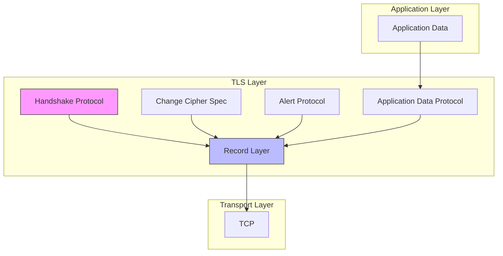
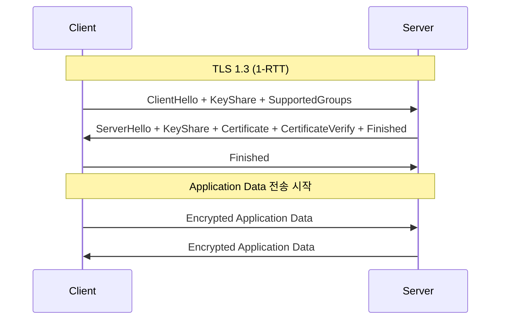

---
tags:
  - SSL
  - TLS
  - balanced
  - intermediate
  - medium-read
  - 네트워크프로그래밍
  - 보안
  - 암호화
  - 핸드셰이크
difficulty: INTERMEDIATE
learning_time: "4-6시간"
main_topic: "네트워크 프로그래밍"
priority_score: 4
---

# Chapter 7-4A: TLS 프로토콜 기초

## 🔐 인터넷 암호화의 역사

1994년, Netscape가 SSL 1.0을 개발했을 때는 심각한 보안 결함 때문에 공개조차 하지 않았습니다. 그 후 SSL 2.0, SSL 3.0을 거쳐 TLS 1.0(1999년)이 표준이 되었고, 지금은 TLS 1.3(2018년)이 최신 버전입니다.

제가 처음 HTTPS를 설정했을 때의 일화:

```bash
# 2010년대 초반...
$ openssl s_client -connect mysite.com:443
SSL handshake has read 3847 bytes and written 438 bytes
Verify return code: 21 (unable to verify the first certificate)
# "아, 인증서 체인이 빠졌구나... 😱"

# 지금은?
$ openssl s_client -connect mysite.com:443
Verify return code: 0 (ok)
# Let's Encrypt 덕분에 무료 SSL! 🎉
```

## 1. TLS 프로토콜 아키텍처

### 1.1 TLS 레이어 구조

#### 🍰 케이크처럼 층층이 쌓인 보안

TLS는 Record Layer와 Handshake Protocol로 구성됩니다. 마치 케이크의 층처럼, 각 층이 다른 역할을 합니다:



### 1.2 TLS 1.3 핸드셰이크

#### 🤝 TLS 1.3의 혁명: 1-RTT에서 0-RTT로

TLS 1.2는 핸드셰이크에 2-RTT가 필요했지만, TLS 1.3은 1-RTT로 줄였고, 재연결 시에는 0-RTT까지 가능합니다!

```python
# 핸드셰이크 시간 비교
TLS 1.2: 
    RTT 1: ClientHello → ServerHello, Certificate, ServerKeyExchange, ServerHelloDone
    RTT 2: ClientKeyExchange, ChangeCipherSpec, Finished → Finished
    총 2 RTT (200ms on 해외 서버!)

TLS 1.3:
    RTT 1: ClientHello + KeyShare → ServerHello + KeyShare, {EncryptedExtensions, Certificate, Finished}
    총 1 RTT (100ms로 단축!)
    
    재연결 시 (0-RTT):
    ClientHello + EarlyData → 즉시 데이터 전송 가능!
```

TLS 1.3는 1-RTT 핸드셰이크를 기본으로 합니다:

```c
// TLS 1.3 핸드셰이크 메시지 타입
// CloudFlare가 TLS 1.3을 적용하여 성능을 30% 향상시킨 비결!
typedef enum {
    CLIENT_HELLO = 1,
    SERVER_HELLO = 2,
    NEW_SESSION_TICKET = 4,
    END_OF_EARLY_DATA = 5,
    ENCRYPTED_EXTENSIONS = 8,
    CERTIFICATE = 11,
    CERTIFICATE_REQUEST = 13,
    CERTIFICATE_VERIFY = 15,
    FINISHED = 20,
    KEY_UPDATE = 24,
    MESSAGE_HASH = 254
} HandshakeType;

// TLS 1.3 핸드셰이크 구조체
typedef struct {
    uint8_t msg_type;
    uint24_t length;
    uint8_t* data;
} HandshakeMessage;

// 암호화 스위트
typedef struct {
    uint16_t cipher_suite;
    const EVP_CIPHER* cipher;
    const EVP_MD* hash;
    size_t key_len;
    size_t iv_len;
    size_t tag_len;
} CipherSuite;

// TLS 1.3 지원 암호화 스위트
static const CipherSuite tls13_cipher_suites[] = {
    {0x1301, EVP_aes_128_gcm(), EVP_sha256(), 16, 12, 16},  // TLS_AES_128_GCM_SHA256
    {0x1302, EVP_aes_256_gcm(), EVP_sha384(), 32, 12, 16},  // TLS_AES_256_GCM_SHA384
    {0x1303, EVP_chacha20_poly1305(), EVP_sha256(), 32, 12, 16}  // TLS_CHACHA20_POLY1305_SHA256
};
```

### 1.3 핸드셰이크 프로토콜 구현

#### 🔧 실전 TLS 서버 구현

제가 웹 서버에 HTTPS를 처음 적용할 때, OpenSSL API의 복잡함에 놀랐습니다. 하지만 한 번 이해하면 그리 어렵지 않습니다:

```c
#include <openssl/ssl.h>
#include <openssl/evp.h>
#include <openssl/x509.h>

// TLS 컨텍스트
typedef struct {
    SSL_CTX* ssl_ctx;
    SSL* ssl;
    int socket_fd;
    
    // 세션 정보
    uint8_t client_random[32];
    uint8_t server_random[32];
    uint8_t master_secret[48];
    
    // 암호화 키
    uint8_t client_write_key[32];
    uint8_t server_write_key[32];
    uint8_t client_write_iv[12];
    uint8_t server_write_iv[12];
    
    // 상태
    int handshake_complete;
    int early_data_enabled;
    size_t max_early_data;
} TLSContext;

// TLS 서버 초기화
// Google, Facebook 같은 대규모 서비스도 이런 방식으로 시작합니다
TLSContext* tls_server_init(const char* cert_file, const char* key_file) {
    TLSContext* ctx = calloc(1, sizeof(TLSContext));
    
    // OpenSSL 초기화
    SSL_library_init();
    SSL_load_error_strings();
    OpenSSL_add_all_algorithms();
    
    // TLS 1.3 컨텍스트 생성
    ctx->ssl_ctx = SSL_CTX_new(TLS_server_method());
    
    // TLS 1.3 강제
    SSL_CTX_set_min_proto_version(ctx->ssl_ctx, TLS1_3_VERSION);
    SSL_CTX_set_max_proto_version(ctx->ssl_ctx, TLS1_3_VERSION);
    
    // 암호화 스위트 설정
    SSL_CTX_set_cipher_list(ctx->ssl_ctx, 
        "TLS_AES_256_GCM_SHA384:"
        "TLS_AES_128_GCM_SHA256:"
        "TLS_CHACHA20_POLY1305_SHA256");
    
    // 인증서와 개인키 로드
    if (SSL_CTX_use_certificate_file(ctx->ssl_ctx, cert_file, SSL_FILETYPE_PEM) <= 0) {
        ERR_print_errors_fp(stderr);
        free(ctx);
        return NULL;
    }
    
    if (SSL_CTX_use_PrivateKey_file(ctx->ssl_ctx, key_file, SSL_FILETYPE_PEM) <= 0) {
        ERR_print_errors_fp(stderr);
        free(ctx);
        return NULL;
    }
    
    // 개인키 검증
    if (!SSL_CTX_check_private_key(ctx->ssl_ctx)) {
        fprintf(stderr, "Private key does not match certificate\n");
        free(ctx);
        return NULL;
    }
    
    // Session Ticket 활성화
    SSL_CTX_set_session_cache_mode(ctx->ssl_ctx, SSL_SESS_CACHE_SERVER);
    SSL_CTX_set_num_tickets(ctx->ssl_ctx, 2);  // 2개의 티켓 발급
    
    // Early Data (0-RTT) 설정
    SSL_CTX_set_max_early_data(ctx->ssl_ctx, 16384);
    
    return ctx;
}

// TLS 핸드셰이크 수행
int tls_handshake(TLSContext* ctx, int client_fd) {
    ctx->socket_fd = client_fd;
    
    // SSL 객체 생성
    ctx->ssl = SSL_new(ctx->ssl_ctx);
    SSL_set_fd(ctx->ssl, client_fd);
    
    // 핸드셰이크 콜백 설정
    SSL_set_info_callback(ctx->ssl, tls_info_callback);
    
    // 서버 핸드셰이크 수행
    int ret = SSL_accept(ctx->ssl);
    if (ret <= 0) {
        int err = SSL_get_error(ctx->ssl, ret);
        if (err == SSL_ERROR_WANT_READ || err == SSL_ERROR_WANT_WRITE) {
            // Non-blocking I/O에서 재시도 필요
            return 0;
        }
        
        char buf[256];
        ERR_error_string_n(ERR_get_error(), buf, sizeof(buf));
        fprintf(stderr, "SSL_accept failed: %s\n", buf);
        return -1;
    }
    
    ctx->handshake_complete = 1;
    
    // 협상된 프로토콜 정보
    printf("TLS Version: %s\n", SSL_get_version(ctx->ssl));
    printf("Cipher: %s\n", SSL_get_cipher(ctx->ssl));
    
    // 세션 정보 추출
    SSL_get_client_random(ctx->ssl, ctx->client_random, 32);
    SSL_get_server_random(ctx->ssl, ctx->server_random, 32);
    
    return 1;
}

// TLS 정보 콜백
static void tls_info_callback(const SSL* ssl, int where, int ret) {
    const char* str;
    int w = where & ~SSL_ST_MASK;
    
    if (w & SSL_ST_CONNECT) str = "SSL_connect";
    else if (w & SSL_ST_ACCEPT) str = "SSL_accept";
    else str = "undefined";
    
    if (where & SSL_CB_LOOP) {
        printf("%s: %s\n", str, SSL_state_string_long(ssl));
    } else if (where & SSL_CB_ALERT) {
        str = (where & SSL_CB_READ) ? "read" : "write";
        printf("SSL3 alert %s: %s:%s\n", str,
               SSL_alert_type_string_long(ret),
               SSL_alert_desc_string_long(ret));
    } else if (where & SSL_CB_EXIT) {
        if (ret == 0) {
            printf("%s: failed in %s\n", str, SSL_state_string_long(ssl));
        } else if (ret < 0) {
            printf("%s: error in %s\n", str, SSL_state_string_long(ssl));
        }
    }
}
```

## 2. TLS 1.3의 혁신적 변화

### 2.1 단순화된 핸드셰이크

TLS 1.3에서는 복잡했던 협상 과정을 대폭 단순화했습니다:



### 2.2 보안 강화

TLS 1.3은 취약한 암호화 방식을 모두 제거했습니다:

```python
# TLS 1.2에서 제거된 취약 기능들
제거됨:
  - RSA 키 교환 (PFS 미보장)
  - DH static 키 교환
  - RC4, 3DES 암호화
  - MD5, SHA-1 해시
  - 압축 (CRIME 공격 취약)
  
유지됨 (안전한 것만):
  - ECDHE 키 교환 (PFS 보장)
  - AES-GCM, ChaCha20-Poly1305
  - SHA-256, SHA-384
```

### 2.3 성능 최적화 기법

```c
// TLS 1.3 성능 최적화 설정
void optimize_tls13(SSL_CTX* ctx) {
    // 1. 최적화된 암호 스위트 순서
    SSL_CTX_set_cipher_list(ctx,
        "TLS_AES_128_GCM_SHA256:"      // 빠른 처리
        "TLS_CHACHA20_POLY1305_SHA256:" // 모바일 최적
        "TLS_AES_256_GCM_SHA384");     // 보안 중시
    
    // 2. 세션 티켓 최적화
    SSL_CTX_set_num_tickets(ctx, 2);
    SSL_CTX_set_session_cache_mode(ctx, 
        SSL_SESS_CACHE_SERVER | SSL_SESS_CACHE_NO_INTERNAL);
    
    // 3. Early Data 활성화 (주의: GET 요청만)
    SSL_CTX_set_max_early_data(ctx, 16384);
    
    // 4. 키 업데이트 주기 설정
    SSL_CTX_set_keylog_callback(ctx, key_update_callback);
    
    // 5. 클라이언트 인증서 요청 최적화
    SSL_CTX_set_verify(ctx, SSL_VERIFY_PEER | SSL_VERIFY_CLIENT_ONCE, NULL);
}

// Early Data 처리 예제
int handle_early_data(SSL* ssl) {
    size_t readbytes;
    unsigned char buffer[16384];
    
    int ret = SSL_read_early_data(ssl, buffer, sizeof(buffer), &readbytes);
    
    switch (ret) {
        case SSL_READ_EARLY_DATA_SUCCESS:
            printf("Early data received: %zu bytes\n", readbytes);
            // 주의: GET 요청인지 확인 필요!
            if (is_safe_request(buffer, readbytes)) {
                process_request(buffer, readbytes);
            }
            return 0;
            
        case SSL_READ_EARLY_DATA_FINISH:
            printf("Early data finished, starting normal handshake\n");
            return 1;
            
        case SSL_READ_EARLY_DATA_ERROR:
            printf("Early data error\n");
            return -1;
    }
    
    return -1;
}
```

## 핵심 요점

### 1. TLS 1.3의 핵심 혁신

- 1-RTT 핸드셰이크로 50% 성능 향상
- 취약한 암호화 방식 완전 제거
- 0-RTT Early Data로 재연결 최적화

### 2. 실무 구현 포인트

- OpenSSL 1.1.1+ 버전 사용 필수
- 적절한 암호 스위트 순서 설정
- Early Data는 안전한 요청에만 사용

### 3. 모니터링과 디버깅

- 핸드셰이크 콜백으로 실시간 모니터링
- 세션 재사용률 추적으로 성능 측정
- 프로토콜 버전별 통계 수집

---

**이전**: [보안 네트워킹 개요](./07-19-secure-networking.md)  
**다음**: [X.509 인증서와 PKI 시스템](./04b-certificates-pki.md)에서 신뢰성 검증 체계를 학습합니다.

## 📚 관련 문서

### 📖 현재 문서 정보

- **난이도**: INTERMEDIATE
- **주제**: 네트워크 프로그래밍
- **예상 시간**: 4-6시간

### 🎯 학습 경로

- [📚 INTERMEDIATE 레벨 전체 보기](../learning-paths/intermediate/)
- [🏠 메인 학습 경로](../learning-paths/)
- [📋 전체 가이드 목록](../README.md)

### 📂 같은 챕터 (chapter-07-network-programming)

- [Chapter 7-1: 소켓 프로그래밍의 기초 개요](./07-01-socket-basics.md)
- [Chapter 7-1A: 소켓의 개념과 기본 구조](./07-02-socket-fundamentals.md)
- [Chapter 7-1B: TCP 소켓 프로그래밍](./07-10-tcp-programming.md)
- [Chapter 7-1C: UDP와 Raw 소켓 프로그래밍](./07-11-udp-raw-sockets.md)
- [Chapter 7-1D: 소켓 옵션과 Unix 도메인 소켓](./07-12-socket-options-unix.md)

### 🏷️ 관련 키워드

`TLS`, `SSL`, `암호화`, `핸드셰이크`, `보안`

### ⏭️ 다음 단계 가이드

- 실무 적용을 염두에 두고 프로젝트에 적용해보세요
- 관련 도구들을 직접 사용해보는 것이 중요합니다
