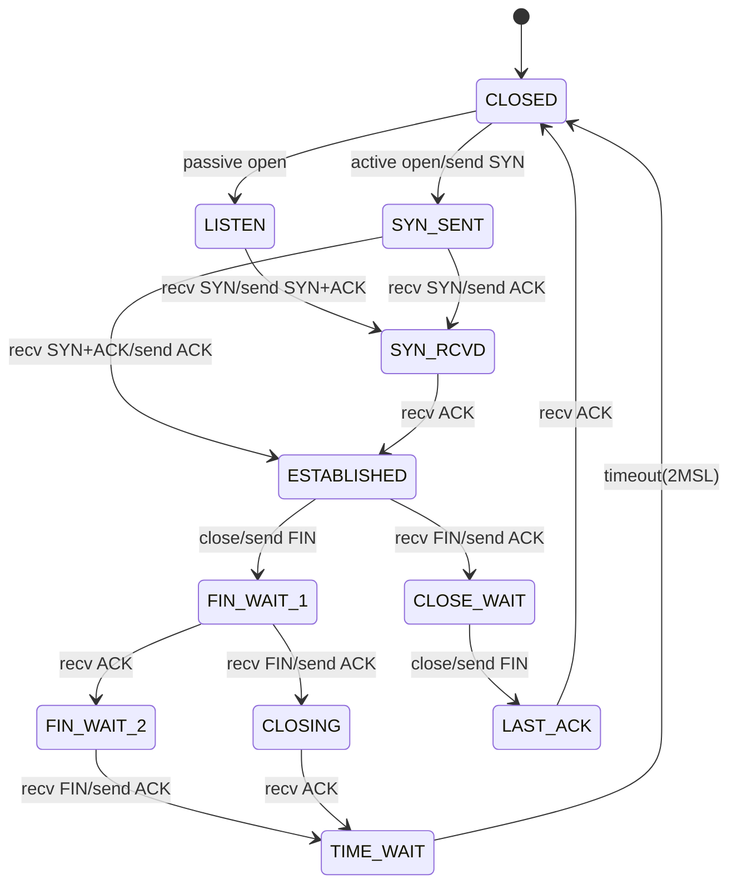

---
tags:
  - TCP 상태머신
  - balanced
  - intermediate
  - medium-read
  - 성능 최적화
  - 소켓 프로그래밍
  - 애플리케이션개발
  - 커널 네트워킹
  - 프로토콜 스택
difficulty: INTERMEDIATE
learning_time: "4-6시간"
main_topic: "애플리케이션 개발"
priority_score: 4
---

# Chapter 7-2B: TCP 상태 머신

## 🎭 TCP 연결의 인생 드라마

TCP 연결은 마치 연극처럼 여러 장(상태)을 거칩니다. 제가 이걸 처음 배울 때, 교수님이 재미있는 비유를 들어주셨습니다:

"TCP 연결은 전화 통화와 같다. 먼저 '여보세요'(SYN), 상대방이 '네, 여보세요'(SYN-ACK), 그리고 '아, 네'(ACK)로 시작한다. 끝날 때는 '끊을게요'(FIN), '네, 알겠습니다'(ACK), '저도 끊을게요'(FIN), '네'(ACK)로 정중하게 마무리한다."

```bash
# TCP 상태 관찰하기
$ ss -tan
State      Recv-Q Send-Q Local Address:Port   Peer Address:Port
LISTEN     0      128    0.0.0.0:22           0.0.0.0:*
ESTAB      0      0      192.168.1.100:22     192.168.1.10:52341
TIME-WAIT  0      0      192.168.1.100:443    142.250.185.46:443
CLOSE-WAIT 1      0      192.168.1.100:8080   10.0.0.5:34567
```

## TCP 연결 상태 전이

### 🔄 상태 전이의 미스터리

제가 신입 시절, TIME_WAIT 상태 때문에 고생한 적이 있습니다. 서버를 재시작하려는데 "Address already in use" 에러가 계속 났죠. 알고보니 TIME_WAIT가 2MSL(Maximum Segment Lifetime) 동안 유지되는 이유가 있었습니다:

1. **늦게 도착한 패킷 처리**: 네트워크를 떠돌던 패킷이 뒤늦게 도착할 수 있음
2. **연결 종료 확인**: 상대방이 FIN을 제대로 받았는지 확인

```bash
# TIME_WAIT 문제 해결하기
# 방법 1: SO_REUSEADDR 사용
int opt = 1;
setsockopt(sockfd, SOL_SOCKET, SO_REUSEADDR, &opt, sizeof(opt));

# 방법 2: 커널 파라미터 조정 (주의 필요!)
echo 1 > /proc/sys/net/ipv4/tcp_tw_reuse
echo 1 > /proc/sys/net/ipv4/tcp_tw_recycle  # Deprecated!
```



## TCP 상태 머신 구현

### 💼 TCP Control Block의 비밀

TCP Control Block(TCB)은 연결당 약 1KB의 메모리를 사용합니다. 만약 서버가 100만 개의 연결을 유지한다면? 1GB의 메모리가 TCB만으로 사용됩니다!

제가 대규모 채팅 서버를 만들 때 이 문제에 부딪혔습니다:

```bash
# TCP 메모리 사용량 확인
$ cat /proc/net/sockstat
sockets: used 142857
TCP: inuse 100000 orphan 0 tw 42857 alloc 100000 mem 97656
# mem 97656 = 약 380MB (페이지 단위)

# 연결당 메모리 계산
$ echo "scale=2; 97656 * 4096 / 100000 / 1024" | bc
390.62  # KB per connection
```

```c
// TCP 상태 정의
enum {
    TCP_ESTABLISHED = 1,
    TCP_SYN_SENT,
    TCP_SYN_RECV,
    TCP_FIN_WAIT1,
    TCP_FIN_WAIT2,
    TCP_TIME_WAIT,
    TCP_CLOSE,
    TCP_CLOSE_WAIT,
    TCP_LAST_ACK,
    TCP_LISTEN,
    TCP_CLOSING,
    TCP_NEW_SYN_RECV,
    TCP_MAX_STATES
};

// TCP Control Block
struct tcp_sock {
    struct inet_connection_sock inet_conn;
    
    u16 tcp_header_len;
    u16 gso_segs;
    
    __be32 pred_flags;
    
    u64 bytes_received;
    u64 bytes_acked;
    u64 bytes_sent;
    u64 bytes_retrans;
    u32 dsack_dups;
    u32 snd_una;    // 첫 번째 미확인 시퀀스
    u32 snd_sml;    // 마지막 바이트 확인
    u32 rcv_tstamp; // 타임스탬프
    u32 lsndtime;   // 마지막 전송 시간
    u32 last_oow_ack_time;
    u32 compressed_ack_rcv_nxt;
    
    u32 tsoffset;
    
    struct list_head tsq_node;
    struct list_head tsorted_sent_queue;
    
    u32 snd_wl1;
    u32 snd_wnd;    // 송신 윈도우
    u32 max_window;
    u32 mss_cache;  // 캐시된 유효 MSS
    
    u32 window_clamp;
    u32 rcv_ssthresh;
    
    // 혼잡 제어
    u32 snd_ssthresh;  // Slow start 임계값
    u32 snd_cwnd;      // 혼잡 윈도우
    u32 snd_cwnd_cnt;
    u32 snd_cwnd_clamp;
    u32 snd_cwnd_used;
    u32 snd_cwnd_stamp;
    u32 prior_cwnd;
    u32 prr_delivered;
    u32 prr_out;
    
    u32 delivered;
    u32 delivered_ce;
    u32 lost;
    u32 app_limited;
    u64 first_tx_mstamp;
    u64 delivered_mstamp;
    u32 rate_delivered;
    u32 rate_interval_us;
    
    u32 rcv_wnd;       // 수신 윈도우
    u32 write_seq;
    u32 notsent_lowat;
    u32 pushed_seq;
    u32 lost_out;
    u32 sacked_out;
    
    // RTT 측정
    struct minmax rtt_min;
    u32 srtt_us;       // Smoothed RTT
    u32 mdev_us;       // RTT 편차
    u32 mdev_max_us;
    u32 rttvar_us;
    u32 rtt_seq;
    
    u64 tcp_mstamp;
    u64 tcp_wstamp_ns;
    u64 tcp_clock_cache;
    u64 tcp_mstamp_refresh;
    
    struct list_head skip_txqueue_node;
    
    u32 copied_seq;
    u32 rcv_nxt;       // 다음 수신 예상 시퀀스
    u32 rcv_wup;
    
    u32 segs_in;
    u32 data_segs_in;
    u32 rcv_nxt;
    u32 bytes_sent;
    u32 bytes_retrans;
    u32 dsack_seen;
    u32 reord_seen;
    
    u32 snd_up;
    
    struct tcp_options_received rx_opt;
    
    u32 snd_ssthresh;
    u32 snd_cwnd;
    u32 snd_cwnd_cnt;
    u32 snd_cwnd_clamp;
    u32 snd_cwnd_used;
    u32 snd_cwnd_stamp;
    u32 prior_cwnd;
    u32 prr_delivered;
    u32 prr_out;
    u32 delivered;
    u32 delivered_ce;
    
    u32 tsoffset;
    u32 ato;           // ACK 타임아웃
    u32 snd_wl1;
    
    u32 last_oow_ack_time;
    
    u32 compressed_ack;
    
    u8 thin_lto : 1,
       recvmsg_inq : 1,
       save_syn : 2,
       syn_data : 1,
       syn_fastopen : 1,
       syn_fastopen_exp : 1,
       syn_fastopen_ch : 1;
       
    u8 repair : 1,
       frto : 1,
       repair_queue : 2,
       save_syn : 1,
       is_cwnd_limited : 1,
       syn_smc : 1;
       
    u8 nonagle : 4,
       thin_lto : 1,
       recvmsg_inq : 1,
       repair : 1,
       frto : 1;
       
    u8 keepalive_probes;
    u8 keepalive_time;
    u8 keepalive_intvl;
    
    struct {
        u32 probe_seq_start;
        u32 probe_seq_end;
    } mtu_probe;
    
    u32 mtu_info;
    
    // TCP 타이머
    struct timer_list retransmit_timer;
    struct timer_list delack_timer;
    struct timer_list keepalive_timer;
    
    struct inet_connection_sock_af_ops *icsk_af_ops;
    
    void (*icsk_clean_acked)(struct sock *sk, u32 acked_seq);
    
    unsigned int (*icsk_sync_mss)(struct sock *sk, u32 pmtu);
    
    struct tcp_congestion_ops *icsk_ca_ops;
    
    u8 icsk_ca_state;
    u8 icsk_ca_setsockopt;
    u8 icsk_ca_dst_locked;
    u8 icsk_retransmits;
    u8 icsk_pending;
    u8 icsk_backoff;
    u8 icsk_syn_retries;
    u8 icsk_probes_out;
    u16 icsk_ext_hdr_len;
    
    struct {
        u8 pending;
        u8 quick;
        u8 pingpong;
        u8 retry;
        u32 ato;
        unsigned long timeout;
        u32 lrcvtime;
        u16 last_seg_size;
        u16 rcv_mss;
    } icsk_ack;
};

// TCP 입력 처리 - 모든 TCP 패킷 처리의 중앙 집중화된 진입점
// === 커널 내부 동작 메커니즘: 패킷에서 애플리케이션까지의 여정 ===
// 
// 🔥 성능 크리티컬 함수: 초당 수백만 번 호출 (고성능 서버 기준)
// - Netflix: 1Gbps 링크에서 초당 ~1.2M 패킷 처리
// - Google: 데이터센터 간 10-100Gbps 트래픽에서 수천만 패킷/초 처리
// - Facebook: 실시간 메시징에서 극도의 지연시간 최적화 필요
int tcp_v4_rcv(struct sk_buff *skb) {
    const struct tcphdr *th;
    struct sock *sk;
    int ret;
    
    // ⭐ 1단계: 패킷 유형 검증 - 첫 번째 필터링
    // === 커널 메커니즘: 패킷 분류와 조기 드롭 ===
    //
    // 📦 패킷 유형별 처리 전략:
    // - PACKET_HOST: 이 호스트 대상 (정상 처리)
    // - PACKET_BROADCAST: 브로드캐스트 (TCP는 해당 없음)
    // - PACKET_MULTICAST: 멀티캐스트 (TCP는 해당 없음)  
    // - PACKET_OTHERHOST: 다른 호스트 대상 (프로미스큐어스 모드)
    // - PACKET_OUTGOING: 송신 패킷 (루프백)
    //
    // 🎯 실무 시나리오:
    // - 라우터/브릿지: PACKET_OTHERHOST 패킷도 처리 (포워딩)
    // - 일반 서버: PACKET_HOST만 처리 (자신 대상만)
    // - 스니핑 도구: 모든 패킷 타입 수집 (tcpdump, Wireshark)
    //
    // ⚡ 성능 최적화: 불필요한 패킷 조기 제거로 CPU 절약
    if (skb->pkt_type != PACKET_HOST)
        goto discard_it;  // 즉시 폐기: 불필요한 처리 회피
        
    // ⭐ 2단계: TCP 헤더 유효성 검증 - 메모리 안전성 보장
    // === 커널 메커니즘: 메모리 보호와 패킷 무결성 검사 ===
    //
    // 🛡️ pskb_may_pull()의 중요한 역할:
    // 1. 메모리 검증: skb 버퍼에 충분한 데이터가 있는지 확인
    // 2. 페이지 정렬: 필요 시 fragmented 데이터를 연속 메모리로 재배치
    // 3. DMA 안전성: 하드웨어 DMA와 소프트웨어 접근 간 동기화
    //
    // 🚨 실제 공격 시나리오 방어:
    // - Truncated TCP Header Attack: 헤더 크기보다 작은 패킷 전송
    // - Memory Corruption Attack: 잘못된 포인터 접근 유도
    // - DoS via Fragmented Packets: 분할된 악성 패킷으로 자원 고갈
    //
    // 📊 성능 영향 분석:
    // - 정상 패킷: ~10 CPU 사이클 (헤더 크기 검증만)
    // - Fragmented 패킷: ~100-1000 CPU 사이클 (메모리 재배치 필요)
    // - 비정상 패킷: ~5 CPU 사이클 (즉시 드롭)
    if (!pskb_may_pull(skb, sizeof(struct tcphdr)))
        goto discard_it;  // 불완전한 TCP 헤더: 메모리 corruption 방지
        
    th = tcp_hdr(skb);  // 안전하게 검증된 TCP 헤더 포인터 획득
    
    // ⭐ 3단계: TCP 헤더 길이 검증 - 프로토콜 무결성 검사
    // === 커널 메커니즘: RFC 793 규격 준수 강제 ===
    //
    // 🔍 TCP 헤더 길이 (th->doff) 분석:
    // - doff: Data Offset (4바이트 단위) 
    // - 최소값: 5 (20바이트 기본 헤더)
    // - 최대값: 15 (60바이트, 40바이트 옵션 포함)
    // - 일반적 값: 5-8 (기본 + 타임스탬프/윈도우 스케일링 옵션)
    //
    // 🎯 실무에서 보는 헤더 길이:
    // - 기본 연결: doff=5 (20바이트)
    // - 타임스탬프 활성화: doff=8 (32바이트)
    // - 윈도우 스케일링 + SACK: doff=7-8 (28-32바이트)
    // - HTTP/3 (QUIC over UDP): TCP 헤더 없음
    //
    // 🚫 악성 패킷 탐지:
    // - doff < 5: 불완전한 기본 헤더 (공격 시도)
    // - doff > 15: RFC 위반 (버퍼 오버플로우 시도)
    if (th->doff < sizeof(struct tcphdr) / 4)
        goto bad_packet;  // RFC 793 위반: 최소 헤더 크기 미만
        
    // TCP 옵션 포함 전체 헤더 크기 재검증
    // 실제 헤더 길이만큼 메모리에 데이터가 있는지 확인
    if (!pskb_may_pull(skb, th->doff * 4))
        goto discard_it;  // 헤더 길이와 실제 데이터 불일치
        
    // ⭐ 4단계: 체크섬 검증 - 데이터 무결성 보장
    // === 커널 메커니즘: 하드웨어 가속과 소프트웨어 검증의 조화 ===
    //
    // 🔬 TCP 체크섬의 다층적 검증 시스템:
    // 1. 하드웨어 오프로딩: 네트워크 카드에서 1차 검증 (99% 케이스)
    // 2. 소프트웨어 검증: 하드웨어 미지원 시 CPU에서 처리
    // 3. Pseudo 헤더: IP 헤더 정보 포함하여 end-to-end 무결성 보장
    //
    // 🚀 성능 최적화 전략:
    // - Intel NIC: CHECKSUM_HW 플래그로 하드웨어 검증 완료 표시
    // - 최신 CPU: SIMD 명령어로 체크섬 병렬 계산 (4-8배 빠름)
    // - 클라우드: SR-IOV 환경에서 가상화 오버헤드 최소화
    //
    // 📊 실무 성능 측정:
    // - 하드웨어 오프로딩: ~0 CPU 사이클 (NIC에서 처리)
    // - 소프트웨어 검증: ~50-200 CPU 사이클 (패킷 크기 비례)
    // - 체크섬 오류율: ~0.001% (물리적 네트워크 오류)
    //
    // 🛡️ 보안 측면:
    // - Man-in-the-Middle 공격 탐지: 전송 중 데이터 변조 감지
    // - 네트워크 장비 오류: 라우터/스위치 메모리 오류 탐지  
    // - 물리적 간섭: 전자기파, 케이블 불량 등으로 인한 데이터 손상
    if (skb_checksum_init(skb, IPPROTO_TCP, inet_compute_pseudo))
        goto csum_error;  // 체크섬 불일치: 데이터 손상 또는 공격
        
    th = tcp_hdr(skb);  // 체크섬 검증 후 안전한 헤더 재참조
    
    // ⭐ 5단계: 소켓 룩업 - 패킷을 올바른 연결로 라우팅
    // === 커널 메커니즘: 고성능 해시 테이블 기반 연결 매칭 ===
    //
    // 🔍 __inet_lookup_skb()의 정교한 매칭 과정:
    // 1. 4-tuple 해시: (src_ip, src_port, dst_ip, dst_port)
    // 2. 해시 체인 순회: 충돌 시 선형 탐색
    // 3. 소켓 상태 확인: ESTABLISHED, TIME_WAIT, LISTEN 등
    // 4. 네트워크 네임스페이스 고려: 컨테이너 격리
    //
    // 🎯 실무 룩업 시나리오:
    // - 웹서버: 수만 개 동시 연결에서 O(1) 평균 룩업
    // - 로드밸런서: 백엔드 서버별 연결 풀 관리
    // - 데이터베이스: 클라이언트별 세션 상태 추적
    // - 게임서버: 플레이어별 실시간 연결 상태 관리
    //
    // 📊 해시 테이블 성능 특성:
    // - 평균 케이스: O(1) - 단일 해시 버킷 접근
    // - 최악 케이스: O(n) - 모든 연결이 동일 버킷 (매우 드물음)
    // - 메모리 지역성: 최근 접근된 소켓은 CPU 캐시에 상주
    // - 확장성: 연결 수 증가 시 해시 테이블 자동 확장
    //
    // 🔧 해시 충돌 최소화 기법:
    // - Jenkins Hash: 균등 분산을 위한 고품질 해시 함수
    // - Dynamic Resizing: 로드 팩터 0.75 초과 시 테이블 크기 2배 확장
    // - Per-CPU Hash Tables: SMP 환경에서 lock contention 최소화
    sk = __inet_lookup_skb(&tcp_hashinfo, skb, th->source, th->dest);
    if (!sk)
        goto no_tcp_socket;  // 매칭되는 소켓 없음: 연결되지 않은 포트
        
    // 상태별 처리
    if (sk->sk_state == TCP_TIME_WAIT)
        goto do_time_wait;
        
    if (sk->sk_state == TCP_NEW_SYN_RECV) {
        struct request_sock *req = inet_reqsk(sk);
        struct sock *nsk;
        
        sk = req->rsk_listener;
        nsk = tcp_check_req(sk, skb, req, false);
        if (!nsk) {
            reqsk_put(req);
            goto discard_it;
        }
        if (nsk == sk) {
            reqsk_put(req);
        } else if (tcp_child_process(sk, nsk, skb)) {
            tcp_v4_send_reset(nsk, skb);
            goto discard_it;
        } else {
            sock_put(sk);
            return 0;
        }
    }
    
    // 패킷 처리
    if (!sock_owned_by_user(sk)) {
        ret = tcp_v4_do_rcv(sk, skb);
    } else {
        if (tcp_add_backlog(sk, skb))
            goto discard_and_relse;
    }
    
    sock_put(sk);
    return ret;
    
no_tcp_socket:
    if (!xfrm4_policy_check(NULL, XFRM_POLICY_IN, skb))
        goto discard_it;
        
    tcp_v4_send_reset(NULL, skb);
    
discard_it:
    kfree_skb(skb);
    return 0;
    
discard_and_relse:
    sock_put(sk);
    goto discard_it;
    
do_time_wait:
    if (!xfrm4_policy_check(NULL, XFRM_POLICY_IN, skb)) {
        inet_twsk_put(inet_twsk(sk));
        goto discard_it;
    }
    
    tcp_v4_timewait_ack(sk, skb);
    inet_twsk_put(inet_twsk(sk));
    goto discard_it;
}
```

## 핵심 요점

### 1. TCP 상태 전이

연결 설정부터 종료까지의 체계적인 상태 관리와 각 상태에서의 패킷 처리 방식

### 2. TCP Control Block

연결별 상태 정보 관리와 메모리 사용량 최적화를 위한 구조체 설계

### 3. 패킷 처리 파이프라인

수신된 패킷이 올바른 소켓으로 전달되기까지의 검증과 라우팅 과정

---

**이전**: [Chapter 7-2A: 네트워크 스택 아키텍처](chapter-07-network-programming/07-03-network-stack-architecture.md)  
**다음**: [Chapter 7-2C: TCP 혼잡 제어](chapter-07-network-programming/07-15-tcp-congestion-control.md)에서 네트워크 성능 최적화를 위한 혼잡 제어 알고리즘을 학습합니다.

## 📚 관련 문서

### 📖 현재 문서 정보

- **난이도**: INTERMEDIATE
- **주제**: 애플리케이션 개발
- **예상 시간**: 4-6시간

### 🎯 학습 경로

- [📚 INTERMEDIATE 레벨 전체 보기](../learning-paths/intermediate/)
- [🏠 메인 학습 경로](../learning-paths/)
- [📋 전체 가이드 목록](../README.md)

### 📂 같은 챕터 (chapter-07-network-programming)

- [Chapter 7-1: 소켓 프로그래밍의 기초 개요](./07-01-socket-basics.md)
- [Chapter 7-1A: 소켓의 개념과 기본 구조](./07-02-socket-fundamentals.md)
- [Chapter 7-1B: TCP 소켓 프로그래밍](./07-10-tcp-programming.md)
- [Chapter 7-1C: UDP와 Raw 소켓 프로그래밍](./07-11-udp-raw-sockets.md)
- [Chapter 7-1D: 소켓 옵션과 Unix 도메인 소켓](./07-12-socket-options-unix.md)

### 🏷️ 관련 키워드

`TCP 상태머신`, `소켓 프로그래밍`, `커널 네트워킹`, `프로토콜 스택`, `성능 최적화`

### ⏭️ 다음 단계 가이드

- 실무 적용을 염두에 두고 프로젝트에 적용해보세요
- 관련 도구들을 직접 사용해보는 것이 중요합니다
