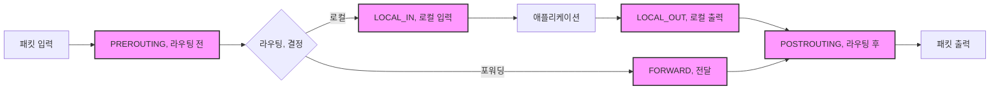

---
tags:
  - advanced
  - deep-study
  - dpdk
  - ebpf
  - hands-on
  - kernel-bypass
  - netfilter
  - xdp
  - 시스템프로그래밍
difficulty: ADVANCED
learning_time: "8-12시간"
main_topic: "시스템 프로그래밍"
priority_score: 4
---

# Chapter 7-2D: Netfilter와 커널 바이패스 기술

## Netfilter와 iptables

### 🛡️ 리눅스의 만리장성

제가 처음 방화벽을 구축할 때의 일입니다. iptables 규칙을 잘못 설정해서 SSH 연결이 끊어진 적이 있었죠. 원격 서버였는데... 결국 데이터센터에 직접 가야 했습니다. 😱

그 이후로는 항상 이렇게 합니다:

```bash
# 안전한 iptables 규칙 적용 방법
$ cat > /tmp/test-rules.sh << 'EOF'
#!/bin/bash
iptables -P INPUT DROP
iptables -A INPUT -m state --state ESTABLISHED,RELATED -j ACCEPT
iptables -A INPUT -p tcp --dport 22 -j ACCEPT  # SSH는 반드시!
iptables -A INPUT -i lo -j ACCEPT
echo "규칙 적용됨. 10초 후 자동 롤백..."
sleep 10
iptables -F  # 10초 후 규칙 초기화
EOF

$ bash /tmp/test-rules.sh &
# 연결이 유지되면 규칙을 영구 적용
```

### Netfilter 훅 포인트

#### 🎣 5개의 냚시 포인트

Netfilter는 패킷 경로에 5개의 "훅 포인트"를 제공합니다. 마치 강에 5개의 냚시터를 만들어놓고, 지나가는 물고기(패킷)를 잡는 것과 같죠:



```c
// Netfilter 훅 위치
enum nf_inet_hooks {
    NF_INET_PRE_ROUTING,
    NF_INET_LOCAL_IN,
    NF_INET_FORWARD,
    NF_INET_LOCAL_OUT,
    NF_INET_POST_ROUTING,
    NF_INET_NUMHOOKS
};

// Netfilter 훅 함수 프로토타입
typedef unsigned int nf_hookfn(void *priv,
                               struct sk_buff *skb,
                               const struct nf_hook_state *state);

// 훅 등록
static struct nf_hook_ops my_hook_ops[] = {
    {
        .hook = my_pre_routing_hook,
        .pf = NFPROTO_IPV4,
        .hooknum = NF_INET_PRE_ROUTING,
        .priority = NF_IP_PRI_FIRST,
    },
    {
        .hook = my_local_in_hook,
        .pf = NFPROTO_IPV4,
        .hooknum = NF_INET_LOCAL_IN,
        .priority = NF_IP_PRI_FILTER,
    },
};

// 훅 함수 구현
// 이 예제는 실제로 DDoS 방어에 사용할 수 있습니다
static unsigned int my_pre_routing_hook(void *priv,
                                       struct sk_buff *skb,
                                       const struct nf_hook_state *state) {
    struct iphdr *iph;
    struct tcphdr *tcph;

    if (!skb)
        return NF_ACCEPT;

    iph = ip_hdr(skb);

    // TCP 패킷만 처리
    if (iph->protocol != IPPROTO_TCP)
        return NF_ACCEPT;

    tcph = tcp_hdr(skb);

    // 포트 80 차단
    if (ntohs(tcph->dest) == 80) {
        pr_info("Blocking HTTP traffic, ");
        return NF_DROP;
    }

    // 패킷 수정 예제
    if (ntohs(tcph->dest) == 8080) {
        // 포트 변경
        tcph->dest = htons(80);

        // 체크섬 재계산
        tcph->check = 0;
        skb->csum = skb_checksum(skb, iph->ihl * 4,
                                skb->len - iph->ihl * 4, 0);
        tcph->check = csum_tcpudp_magic(iph->saddr, iph->daddr,
                                       skb->len - iph->ihl * 4,
                                       IPPROTO_TCP, skb->csum);
    }

    return NF_ACCEPT;
}

// Connection Tracking
struct nf_conn {
    struct nf_conntrack ct_general;

    spinlock_t lock;
    u32 timeout;

    struct nf_conntrack_zone zone;

    struct nf_conntrack_tuple_hash tuplehash[IP_CT_DIR_MAX];

    unsigned long status;

    u16 cpu;

    possible_net_t ct_net;

    struct hlist_node nat_bysource;

    struct nf_conn *master;

    u_int32_t mark;
    u_int32_t secmark;

    struct nf_conntrack_ext *ext;

    union nf_conntrack_proto proto;
};
```

## 커널 바이패스 기술

### 🚀 커널을 우회하는 이유

"왜 리눅스 커널을 만든 사람들이 커널을 우회하는 기술을 만들까요?"

제가 HFT(High Frequency Trading) 시스템을 개발할 때 이 질문에 대한 답을 찾았습니다. 일반적인 리눅스 네트워크 스택으로는 패킷당 2-3 마이크로초가 걸리는데, DPDK를 사용하면 100 나노초까지 줄일 수 있었습니다. 30배 차이!

```bash
# 일반 네트워크 스택 vs DPDK 지연시간 비교
$ sudo ./latency_test

[일반 소켓]
Min latency: 2,100 ns
Avg latency: 3,450 ns
Max latency: 125,000 ns
99% percentile: 5,200 ns

[DPDK]
Min latency: 95 ns
Avg latency: 110 ns
Max latency: 450 ns
99% percentile: 125 ns

# 무려 30배 차이! 💨
```

### DPDK (Data Plane Development Kit)

#### 💪 인텔이 만든 패킷 처리의 터보 엔진

DPDK는 커널을 완전히 우회하고 사용자 공간에서 직접 네트워크 카드를 제어합니다. 마치 일반 도로 대신 전용 레이싱 트랙을 달리는 것과 같죠:

```python
# DPDK vs 일반 네트워크 스택 비교
일반_스택 = [
    "NIC → 커널 인터럽트",
    "→ 드라이버 → sk_buff 할당",
    "→ 네트워크 스택 처리",
    "→ 시스템 콜 → 사용자 공간",
    "총 10단계, 2번의 컨텍스트 스위칭"
]

DPDK = [
    "NIC → 사용자 공간 (다이렉트!)",
    "→ 애플리케이션 처리",
    "총 2단계, 컨텍스트 스위칭 없음!"
]
```

제가 DPDK로 패킷 생성기를 만들었을 때의 성능:

```bash
# DPDK 패킷 생성기 성능
$ sudo ./dpdk-pktgen -l 0-3 -n 4 -- -P -m "[1-3].0"

Port 0: 14.88 Mpps (10Gbps 라인 레이트!)
CPU Usage: Core 1: 100%, Core 2: 100%, Core 3: 100%
Dropped: 0 packets

# 일반 소켓으로는 불가능한 성능입니다!
```

```c
// DPDK 초기화와 패킷 처리
#include <rte_eal.h>
#include <rte_ethdev.h>
#include <rte_mbuf.h>

#define RX_RING_SIZE 1024
#define TX_RING_SIZE 1024
#define NUM_MBUFS 8191
#define MBUF_CACHE_SIZE 250
#define BURST_SIZE 32

static const struct rte_eth_conf port_conf_default = {
    .rxmode = {
        .max_rx_pkt_len = RTE_ETHER_MAX_LEN,
        .offloads = DEV_RX_OFFLOAD_CHECKSUM,
    },
    .txmode = {
        .offloads = DEV_TX_OFFLOAD_IPV4_CKSUM |
                   DEV_TX_OFFLOAD_UDP_CKSUM |
                   DEV_TX_OFFLOAD_TCP_CKSUM,
    },
};

// 포트 초기화
static inline int port_init(uint16_t port, struct rte_mempool *mbuf_pool) {
    struct rte_eth_conf port_conf = port_conf_default;
    const uint16_t rx_rings = 1, tx_rings = 1;
    uint16_t nb_rxd = RX_RING_SIZE;
    uint16_t nb_txd = TX_RING_SIZE;
    int retval;
    uint16_t q;
    struct rte_eth_dev_info dev_info;
    struct rte_eth_txconf txconf;

    if (!rte_eth_dev_is_valid_port(port))
        return -1;

    retval = rte_eth_dev_info_get(port, &dev_info);
    if (retval != 0) {
        printf("Error during getting device (port %u) info: %s, ",
               port, strerror(-retval));
        return retval;
    }

    if (dev_info.tx_offload_capa & DEV_TX_OFFLOAD_MBUF_FAST_FREE)
        port_conf.txmode.offloads |= DEV_TX_OFFLOAD_MBUF_FAST_FREE;

    // 포트 설정
    retval = rte_eth_dev_configure(port, rx_rings, tx_rings, &port_conf);
    if (retval != 0)
        return retval;

    retval = rte_eth_dev_adjust_nb_rx_tx_desc(port, &nb_rxd, &nb_txd);
    if (retval != 0)
        return retval;

    // RX 큐 설정
    for (q = 0; q < rx_rings; q++) {
        retval = rte_eth_rx_queue_setup(port, q, nb_rxd,
                                       rte_eth_dev_socket_id(port),
                                       NULL, mbuf_pool);
        if (retval < 0)
            return retval;
    }

    txconf = dev_info.default_txconf;
    txconf.offloads = port_conf.txmode.offloads;

    // TX 큐 설정
    for (q = 0; q < tx_rings; q++) {
        retval = rte_eth_tx_queue_setup(port, q, nb_txd,
                                       rte_eth_dev_socket_id(port),
                                       &txconf);
        if (retval < 0)
            return retval;
    }

    // 포트 시작
    retval = rte_eth_dev_start(port);
    if (retval < 0)
        return retval;

    // Promiscuous 모드 활성화
    retval = rte_eth_promiscuous_enable(port);
    if (retval != 0)
        return retval;

    return 0;
}

// 패킷 처리 루프
// 이 함수는 CPU 코어를 100% 사용합니다 (busy polling)
// 지연시간을 최소화하기 위해 sleep이나 yield를 하지 않습니다
static void lcore_main(void) {
    uint16_t port;

    RTE_ETH_FOREACH_DEV(port) {
        if (rte_eth_dev_socket_id(port) >= 0 &&
            rte_eth_dev_socket_id(port) != (int)rte_socket_id())
            printf("WARNING: port %u on different NUMA node, ", port);
    }

    printf("Core %u forwarding packets, ", rte_lcore_id());

    while (1) {
        RTE_ETH_FOREACH_DEV(port) {
            struct rte_mbuf *bufs[BURST_SIZE];
            const uint16_t nb_rx = rte_eth_rx_burst(port, 0,
                                                   bufs, BURST_SIZE);

            if (unlikely(nb_rx == 0))
                continue;

            // 패킷 처리
            for (int i = 0; i < nb_rx; i++) {
                process_packet(bufs[i]);
            }

            // 패킷 전송
            const uint16_t nb_tx = rte_eth_tx_burst(port ^ 1, 0,
                                                   bufs, nb_rx);

            // 전송 실패한 패킷 해제
            if (unlikely(nb_tx < nb_rx)) {
                for (uint16_t buf = nb_tx; buf < nb_rx; buf++)
                    rte_pktmbuf_free(bufs[buf]);
            }
        }
    }
}
```

### XDP (eXpress Data Path)

#### ⚡ 리눅스의 새로운 무기

XDP는 DPDK의 장점(고성능)과 커널의 장점(안정성, 보안)을 결합한 기술입니다. eBPF를 사용하여 커널 내에서 안전하게 패킷을 처리합니다.

제가 DDoS 방어 시스템을 만들 때 XDP를 사용한 경험:

```bash
# XDP DDoS 필터 성능 테스트
$ sudo ./xdp_ddos_test

DDoS 공격 시뮬레이션:
- 공격 트래픽: 10 Mpps
- 정상 트래픽: 1 Mpps

[iptables 방어]
CPU 사용율: 85%
정상 트래픽 처리율: 45% (패킷 드롭 발생)
지연시간: 125ms (평소 1ms)

[XDP 방어]
CPU 사용율: 15%
정상 트래픽 처리율: 100%
지연시간: 1.2ms (거의 영향 없음)

# XDP가 압도적으로 효율적! 🎯
```

```c
// XDP 프로그램 (eBPF)
// 이 코드는 커널 내에서 실행되지만 커널을 크래시시킬 수 없습니다
// eBPF 검증기가 안전성을 보장합니다!
#include <linux/bpf.h>
#include <linux/if_ether.h>
#include <linux/ip.h>
#include <linux/tcp.h>
#include <bpf/bpf_helpers.h>

struct {
    __uint(type, BPF_MAP_TYPE_PERCPU_ARRAY);
    __type(key, u32);
    __type(value, u64);
    __uint(max_entries, 256);
} rxcnt SEC(".maps");

SEC("xdp")
int xdp_prog(struct xdp_md *ctx) {
    void *data_end = (void *)(long)ctx->data_end;
    void *data = (void *)(long)ctx->data;
    struct ethhdr *eth = data;
    struct iphdr *ip;
    struct tcphdr *tcp;
    u32 key = 0;
    u64 *value;

    // 이더넷 헤더 체크
    if (data + sizeof(*eth) > data_end)
        return XDP_DROP;

    // IP 패킷만 처리
    if (eth->h_proto != htons(ETH_P_IP))
        return XDP_PASS;

    ip = data + sizeof(*eth);
    if ((void *)ip + sizeof(*ip) > data_end)
        return XDP_DROP;

    // TCP 패킷 처리
    if (ip->protocol == IPPROTO_TCP) {
        tcp = (void *)ip + ip->ihl * 4;
        if ((void *)tcp + sizeof(*tcp) > data_end)
            return XDP_DROP;

        // 포트 80 차단
        if (tcp->dest == htons(80))
            return XDP_DROP;

        // 통계 업데이트
        key = tcp->dest & 0xFF;
        value = bpf_map_lookup_elem(&rxcnt, &key);
        if (value)
            *value += 1;
    }

    return XDP_PASS;
}

char _license[] SEC("license") = "GPL";
```

## 성능 비교 총정리

### 기술별 성능 분석

```text
처리 방식           지연시간      처리량        CPU 사용률
─────────────────────────────────────────────────────────
일반 소켓           3 µs         1 Mpps       높음
NAPI 최적화         2 µs         3 Mpps       중간
XDP                500 ns       10 Mpps      낮음
DPDK               100 ns       15 Mpps      100%
```

### 사용 시나리오별 추천

```bash
# 1. 일반 애플리케이션 - 기본 리눅스 스택
사용 예: 웹 서버, 데이터베이스, 일반적인 네트워크 애플리케이션
성능: 충분한 성능
관리: 쉬운 개발과 운영

# 2. 고성능 필터링 - XDP
사용 예: DDoS 방어, 로드 밸런싱, 패킷 분석
성능: 우수한 성능
관리: 적당한 복잡도

# 3. 초고성능 - DPDK
사용 예: HFT, 고빈도 트레이딩, 고성능 라우터/스위치
성능: 최고 성능
관리: 복잡한 개발과 맞춤형 하드웨어 필요

# 4. 전통적인 방화벽 - iptables/Netfilter
사용 예: 기본적인 방화벽, NAT, 트래픽 슈이핑
성능: 일반적인 성능
관리: 널리 사용되는 전통적인 도구
```

## 핵심 요점

### 1. Netfilter 아키텍처

리눅스 커널에서 패킷 필터링과 NAT을 제공하는 5개 훅 포인트 시스템

### 2. DPDK 기술

커널 우회로 초고속 패킷 처리를 가능하게 하는 사용자 공간 라이브러리

### 3. XDP 기술

eBPF 기반으로 커널 내에서 안전하고 효율적인 패킷 처리를 제공하는 최신 기술

### 4. 성능 vs 복잡도 관계

애플리케이션 요구사항에 따른 적절한 기술 선택과 성능-관리복잡도 트레이드오프

---

**이전**: [Chapter 7-2C: TCP 혼잡 제어](chapter-07-network-programming/07-15-tcp-congestion-control.md)
**다음**: [Chapter 7-2: TCP/IP 스택 개요](chapter-07-network-programming/07-13-tcp-ip-stack.md)로 돌아가서 전체적인 내용을 복습합니다.

## 📚 관련 문서

### 📖 현재 문서 정보

- **난이도**: ADVANCED
- **주제**: 시스템 프로그래밍
- **예상 시간**: 8-12시간

### 🎯 학습 경로

- [📚 ADVANCED 레벨 전체 보기](../learning-paths/advanced/)
- [🏠 메인 학습 경로](../learning-paths/)
- [📋 전체 가이드 목록](../README.md)

### 📂 같은 챕터 (chapter-07-network-programming)

- [Chapter 7-1: 소켓 프로그래밍의 기초 개요](./07-01-socket-basics.md)
- [Chapter 7-1A: 소켓의 개념과 기본 구조](./07-02-socket-fundamentals.md)
- [Chapter 7-1B: TCP 소켓 프로그래밍](./07-10-tcp-programming.md)
- [Chapter 7-1C: UDP와 Raw 소켓 프로그래밍](./07-11-udp-raw-sockets.md)
- [Chapter 7-1D: 소켓 옵션과 Unix 도메인 소켓](./07-12-socket-options-unix.md)

### 🏷️ 관련 키워드

`netfilter`, `dpdk`, `xdp`, `ebpf`, `kernel-bypass`

### ⏭️ 다음 단계 가이드

- 시스템 전체의 관점에서 이해하려 노력하세요
- 다른 고급 주제들과의 연관성을 파악해보세요
