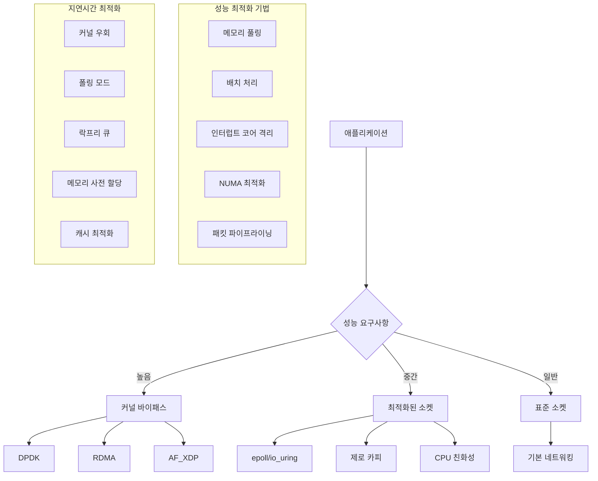

---
tags:
  - High Performance Networking
  - Network Architecture
  - Zero Copy
  - Performance Optimization
---

# 고성능 네트워킹 아키텍처: "극한 성능을 위한 설계"

## 상황: 극한 성능이 필요한 네트워크 애플리케이션

"안녕하세요, 실시간 트레이딩 시스템을 개발하고 있는데 네트워크 지연시간이 생명입니다. 마이크로초 단위의 지연시간도 중요하고, 초당 수백만 개의 패킷을 처리해야 해요. 일반적인 소켓 프로그래밍으로는 한계가 있는 것 같습니다. 커널 바이패스나 제로 카피 같은 고성능 네트워킹 기술을 어떻게 활용할 수 있을까요?"

이런 극한 성능이 요구되는 상황에서는 전통적인 네트워킹 방식을 넘어선 고급 기술들이 필요합니다.

## 고성능 네트워킹 아키텍처

## 핵심 요점

### 1. 성능 계층별 접근법

고성능 네트워킹에서는 요구사항에 따라 다른 기술 스택을 선택해야 합니다

### 2. 커널 바이패스의 중요성

DPDK, RDMA, AF_XDP 같은 기술로 커널 오버헤드를 제거할 수 있습니다

### 3. 시스템 레벨 최적화

CPU 친화성, 메모리 풀링, 배치 처리 등의 최적화가 필수적입니다

---

**다음**: [고성능 분석 도구](07b-high-performance-analysis-tool.md)에서 실제 구현과 성능 측정 도구를 학습합니다.
