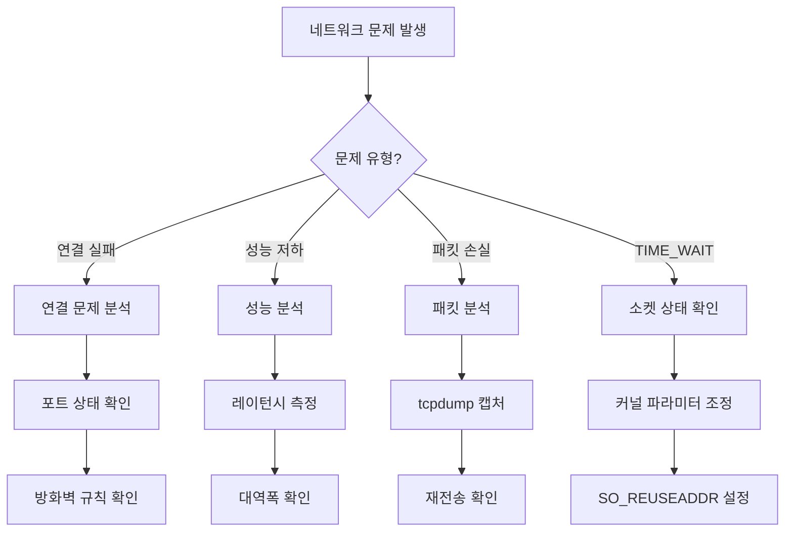

---
tags:
  - Network
  - Socket
  - TCP/IP
  - Guide
  - SystemProgramming
  - Performance
---

# Chapter 7: 네트워크 프로그래밍 - C10K에서 C10M까지

## 이 장에서 다루는 내용

1999년, Dan Kegel이 제기한 C10K(Concurrent 10,000 connections) 문제. 한 대의 서버가 어떻게 1만 개의 동시 연결을 처리할 수 있을까요?

20년이 지난 지금, 우리는 C10M(1천만 연결)을 논의하고 있습니다. 이 놀라운 발전은 어떻게 가능했을까요?

이 장에서는 소켓 프로그래밍의 기초부터 현대적인 고성능 네트워크 서버 구현까지, 네트워크 프로그래밍의 모든 것을 깊이 있게 탐구합니다. TCP/IP 스택의 내부 동작, epoll과 같은 I/O 멀티플렉싱, 그리고 보안 통신까지 다룹니다.

## 왜 이것을 알아야 하는가?

### 실무에서 마주치는 네트워크 문제들

다음과 같은 상황을 경험해보셨나요?

- 🌐 **C10K 문제**: 수많은 동시 연결 처리의 어려움
- 🐌 **네트워크 지연**: 왜 로컬은 빠른데 원격은 느릴까?
- 💔 **연결 끊김**: TIME_WAIT, Connection Reset 문제
- 🔒 **보안 이슈**: 중간자 공격, 데이터 노출 위험
- ⚡ **성능 한계**: CPU는 놀고 있는데 처리량이 낮은 상황

이런 문제들의 근본 원인은 네트워크 프로그래밍과 프로토콜에 대한 이해 부족입니다. 이 장을 마스터하면, 안정적이고 빠른 네트워크 애플리케이션을 구현할 수 있습니다.

## 네트워크 프로그래밍 아키텍처 한눈에 보기


## 이 장의 구성

### [7-1: 소켓 프로그래밍 기초](01-socket-basics.md)

**"네트워크 통신의 시작점"**

- 🔌 **소켓 API**: socket(), bind(), listen(), accept()
- 📡 **TCP vs UDP**: 연결 지향 vs 데이터그램
- 🔄 **블로킹 vs 논블로킹**: I/O 모델의 차이
- 💡 **실전 예제**: Echo 서버와 클라이언트 구현

### [7-2: TCP/IP 스택 내부 구조](02-tcp-ip-stack.md)

**"패킷의 여정 - 커널 내부를 따라서"**

- 📦 **패킷 처리 과정**: 송신과 수신의 전체 흐름
- 🔄 **TCP 상태 머신**: 3-way handshake와 4-way close
- 💾 **소켓 버퍼**: 송신/수신 버퍼와 흐름 제어
- ⚡ **성능 튜닝**: TCP 파라미터 최적화

### [7-3: 고성능 네트워크 서버](03-high-performance.md)

**"C10K를 넘어 C10M으로"**

- 🚀 **I/O 멀티플렉싱**: select, poll, epoll의 진화
- ⚡ **Zero-copy**: sendfile과 splice
- 🔧 **커널 우회**: DPDK와 user-space 네트워킹
- 🌐 **실전 예제**: 10만 동시 연결 서버 구현

### [7-4: 보안 네트워킹과 TLS](04-secure-networking.md)

**"안전한 통신의 구현"**

- 🔐 **TLS/SSL**: 암호화 통신의 원리
- 🔑 **인증서와 PKI**: 신뢰의 연쇄
- 🛡️ **보안 위협**: 중간자 공격, DDoS 방어
- 💻 **실전 예제**: OpenSSL을 활용한 보안 서버

## 실습 환경 준비

이 장의 예제들을 직접 실행해보려면 다음 도구들이 필요합니다:

```bash
# 네트워크 상태 확인
$ netstat -tuln          # 리스닝 포트 확인
$ ss -s                  # 소켓 통계
$ lsof -i               # 네트워크 연결 확인

# 패킷 분석
$ tcpdump -i any port 80
$ wireshark             # GUI 패킷 분석
$ tshark                # CLI 패킷 분석

# 성능 테스트
$ iperf3 -s             # 서버 모드
$ iperf3 -c <server>    # 클라이언트 모드
$ ab -n 10000 -c 100    # Apache Bench

# 네트워크 디버깅
$ strace -e network     # 네트워크 시스템 콜 추적
$ ltrace -e socket      # 라이브러리 호출 추적
```

## 이 장을 읽고 나면

✅ **소켓 프로그래밍 마스터**: TCP/UDP 소켓 자유자재로 활용  
✅ **프로토콜 이해**: TCP/IP 스택의 내부 동작 원리 파악  
✅ **고성능 서버 구현**: C10K 문제 해결과 최적화  
✅ **보안 통신**: TLS/SSL을 활용한 암호화 통신 구현  
✅ **문제 해결**: 네트워크 문제 진단과 디버깅 능력  

## 핵심 개념 미리보기

```mermaid
mindmap
  root((네트워크 프로그래밍))
    소켓 API
      생성과 연결
        socket()
        bind()
        listen()
        accept()
        connect()
      데이터 전송
        send()/recv()
        sendto()/recvfrom()
        writev()/readv()
      옵션 설정
        SO_REUSEADDR
        SO_KEEPALIVE
        TCP_NODELAY
    TCP/IP 스택
      TCP
        3-way handshake
        4-way close
        흐름 제어
        혼잡 제어
      IP
        라우팅
        단편화
        TTL
      버퍼 관리
        송신 버퍼
        수신 버퍼
        윈도우 크기
    I/O 모델
      동기 I/O
        블로킹
        논블로킹
      I/O 멀티플렉싱
        select
        poll
        epoll/kqueue
      비동기 I/O
        POSIX AIO
        io_uring
    성능 최적화
      Zero-copy
        sendfile
        splice
        MSG_ZEROCOPY
      커널 우회
        DPDK
        XDP
        RDMA
      튜닝
        TCP 파라미터
        소켓 버퍼
        인터럽트 처리
```

## 네트워크 문제 진단 플로우차트



## 다음 단계

이제 [7-1: 소켓 프로그래밍 기초](01-socket-basics.md)부터 시작하여, 네트워크 프로그래밍의 기초를 탄탄히 다져봅시다.

네트워크는 현대 컴퓨팅의 핵심입니다. 클라우드, 마이크로서비스, IoT - 모든 것이 네트워크로 연결되어 있습니다. 이 장을 통해 네트워크의 깊은 곳까지 이해하고, 진정한 네트워크 전문가로 거듭나게 될 것입니다.