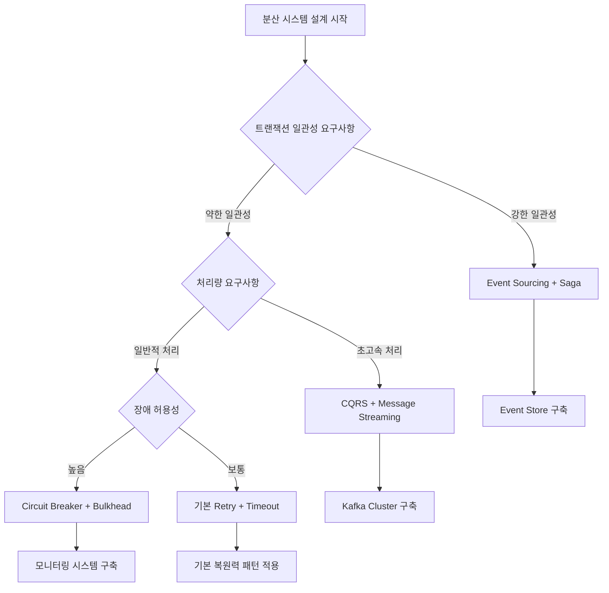

---
tags:
  - DistributedSystems
  - Async
  - Microservices
  - EventSourcing
  - Saga
  - Overview
---

# Chapter 8-4: 분산 시스템의 비동기 패턴 개요

## 🎯 분산 비동기 시스템의 핵심 도전과제

분산 시스템에서 비동기 패턴을 마스터한다는 것은 현대 소프트웨어 아키텍처의 핵심을 이해하는 것입니다:

1. **"분산 트랜잭션 없이 어떻게 일관성을 보장하죠?"** - Saga 패턴으로 eventual consistency를 구현할 수 있습니다
2. **"마이크로서비스 간 통신이 너무 복잡해요"** - Event-driven architecture로 느슨한 결합을 달성합니다
3. **"메시지가 중복 처리되면 어떻게 하죠?"** - Idempotency와 exactly-once delivery를 보장하는 방법을 배웁니다
4. **"서비스 하나가 죽으면 전체가 멈춰요"** - Circuit breaker와 bulkhead로 장애를 격리합니다

## 📚 학습 로드맵

이 섹션은 5개의 전문화된 문서로 구성되어 있습니다:

### 1️⃣ [분산 트랜잭션과 Saga 패턴](04a-distributed-transactions.md)

- Two-Phase Commit의 한계점과 실패 이유
- Saga 패턴의 핵심 원리와 구현 방법
- Orchestration vs Choreography 비교 분석
- 보상 트랜잭션(Compensation)의 설계 원칙

### 2️⃣ [Event Sourcing과 CQRS](04b-event-sourcing-cqrs.md)

- Event Sourcing의 기본 개념과 구현
- 이벤트 스토어 설계와 최적화 전략
- CQRS 패턴으로 읽기/쓰기 모델 분리
- Eventual Consistency 처리 방법

### 3️⃣ [메시지 큐와 스트리밍](04c-message-streaming.md)

- Kafka를 이용한 대용량 이벤트 스트리밍
- Exactly-once semantics 구현 방법
- Back-pressure와 Flow Control 패턴
- 동적 스케일링과 성능 최적화

### 4️⃣ [복원력 패턴](04d-resilience-patterns.md)

- Circuit Breaker 패턴과 구현 전략
- Bulkhead 패턴으로 장애 격리
- 지능적인 Retry와 Timeout 전략
- Hedged Requests와 적응적 시스템

### 5️⃣ [실전 사례 연구](04e-production-case-study.md)

- 대규모 이커머스 시스템 아키텍처
- 2023년 블랙프라이데이 장애 대응 사례
- 프로덕션 환경 모니터링과 알림 전략
- 비용 최적화와 리소스 관리

## 🎯 핵심 개념 비교표

분산 비동기 시스템의 주요 패턴들을 비교해보겠습니다:

| 패턴 | 적용 상황 | 장점 | 단점 | 구현 복잡도 |
|------|----------|------|------|-------------|
| **Saga** | 분산 트랜잭션 | Eventual consistency, 높은 가용성 | 복잡한 보상 로직 | 중간 |
| **Event Sourcing** | 감사 추적 필요 | 완전한 이력, 시간 여행 | 쿼리 복잡성, 저장 공간 | 높음 |
| **CQRS** | 읽기/쓰기 패턴 차이 | 독립 최적화, 확장성 | 복잡성 증가, 일관성 지연 | 높음 |
| **Circuit Breaker** | 외부 서비스 호출 | 빠른 실패, 시스템 보호 | 오탐 가능성 | 낮음 |
| **Bulkhead** | 리소스 격리 | 장애 영향 제한 | 리소스 비효율 | 중간 |
| **Message Queue** | 비동기 통신 | 확장성, 내결함성 | 메시지 순서, 중복 처리 | 중간 |

## 🚀 실전 활용 시나리오

### 시나리오 1: 대용량 이커머스 주문 처리

- **도전과제**: 초당 10만 건의 주문 요청 처리
- **솔루션**: Saga + CQRS + Event Streaming + Circuit Breaker
- **핵심 전략**:
  - Saga 패턴으로 분산 트랜잭션 관리
  - CQRS로 읽기/쓰기 최적화
  - Kafka로 이벤트 스트리밍
  - Circuit Breaker로 장애 전파 방지

### 시나리오 2: 글로벌 뱅킹 시스템

- **도전과제**: 강한 일관성과 감사 추적 필요
- **솔루션**: Event Sourcing + Saga + 다중 리전 복제
- **핵심 전략**:
  - Event Sourcing으로 완전한 감사 추적
  - Saga로 국가간 거래 처리
  - 지역별 읽기 전용 복제본 운영

### 시나리오 3: IoT 데이터 처리 플랫폼

- **도전과제**: 초당 수백만 센서 데이터 실시간 처리
- **솔루션**: Back-pressure + Stream Processing + Event Sourcing
- **핵심 전략**:
  - Back-pressure로 과부하 방지
  - 실시간 스트림 처리로 즉시 분석
  - 중요 이벤트만 Event Store에 저장

## 🎭 학습 전략

분산 비동기 시스템을 효과적으로 학습하기 위한 단계별 접근법:

### 초보자 (추천 순서)

1. **[분산 트랜잭션과 Saga](04a-distributed-transactions.md)** → 분산 시스템의 기본 딜레마 이해
2. **[복원력 패턴](04d-resilience-patterns.md)** → 실용적인 장애 대응 패턴 학습
3. **[메시지 큐와 스트리밍](04c-message-streaming.md)** → 비동기 통신 기초
4. 간단한 마이크로서비스 프로젝트 구현 연습

### 중급자 (심화 학습)

1. **[Event Sourcing과 CQRS](04b-event-sourcing-cqrs.md)** → 고급 아키텍처 패턴
2. **[실전 사례 연구](04e-production-case-study.md)** → 프로덕션 환경 경험
3. 대용량 트래픽 처리 시스템 설계 연습
4. Chaos Engineering 도입

### 고급자 (전문가 수준)

1. 모든 패턴을 통합한 복합 시스템 설계
2. 성능 최적화와 비용 효율성 극대화
3. 새로운 패턴 연구와 기술 트렌드 적용

## 🎯 아키텍처 결정 가이드

복잡한 분산 시스템을 설계할 때 패턴 선택을 위한 의사결정 트리:

### 패턴 조합 전략

| 비즈니스 요구사항 | 추천 패턴 조합 | 구현 복잡도 | 예상 비용 |
|-------------------|----------------|-------------|----------|
| **금융/결제** | Event Sourcing + Saga + Circuit Breaker | 높음 | 높음 |
| **이커머스** | CQRS + Message Streaming + Bulkhead | 중간 | 중간 |
| **IoT/센서** | Event Streaming + Back-pressure + Cache | 중간 | 낮음 |
| **소셜미디어** | CQRS + Cache + Circuit Breaker | 중간 | 중간 |
| **게임** | Event Sourcing + Message Streaming + Bulkhead | 높음 | 높음 |

## 🔗 연관 학습

### 선행 학습 권장

- **[Chapter 7: 네트워크 프로그래밍](../chapter-07-network-programming/)** - TCP/IP 스택과 소켓 프로그래밍 기초
- **[Chapter 4: 프로세스와 스레드](../chapter-04-process-thread/)** - 동시성과 병렬 처리 개념
- **[Chapter 6: 파일 I/O](../chapter-06-file-io/)** - 비동기 I/O 패턴

### 후속 학습 추천  

- **[Chapter 9: 메모리 관리와 GC](../chapter-09-memory-gc/)** - 분산 시스템의 메모리 최적화
- **[Chapter 13: 관찰 가능성과 디버깅](../chapter-13-observability-debugging/)** - 분산 추적과 모니터링
- **[Chapter 16: 시스템 설계 패턴](../chapter-16-system-design-patterns/)** - 대규모 시스템 설계 사례

## 💡 실전 체크리스트

분산 비동기 시스템을 구축할 때 반드시 확인해야 할 항목들:

### 기본 복원력

- [ ] **Idempotency 보장**: 같은 작업을 여러 번 실행해도 안전
- [ ] **Circuit Breaker 구현**: 연쇄 장애 방지
- [ ] **Retry with Exponential Backoff**: 지능적인 재시도
- [ ] **Timeout 설정**: 적절한 응답 시간 제한

### 고급 패턴

- [ ] **Event Sourcing**: 완전한 감사 추적
- [ ] **CQRS**: 읽기/쓰기 최적화
- [ ] **Saga Pattern**: 분산 트랜잭션 관리
- [ ] **Bulkhead**: 리소스 격리

### 모니터링과 운영

- [ ] **Distributed Tracing**: 요청 흐름 추적
- [ ] **Metrics Collection**: 실시간 성능 지표
- [ ] **Alerting**: 임계치 기반 알림
- [ ] **Chaos Engineering**: 의도적 장애 테스트

## 🎓 마스터리 달성 경로

### 초급 → 중급 (3-6개월)

1. 기본 패턴 3개 이상 실제 프로젝트에 적용
2. 간단한 마이크로서비스 아키텍처 구축 경험
3. Kafka 또는 RabbitMQ를 이용한 메시징 시스템 구현

### 중급 → 고급 (6-12개월)

1. Event Sourcing과 CQRS 패턴 프로덕션 적용
2. 대용량 트래픽 처리 시스템 설계 및 운영
3. 복합 장애 상황에서의 문제 해결 경험

### 고급 → 전문가 (12개월+)

1. 새로운 패턴 연구 및 적용
2. 팀/조직의 아키텍처 의사결정 주도
3. 컨퍼런스 발표 또는 기술 블로그 기고

## 📖 추천 참고 자료

### 핵심 논문과 아티클

- **[Saga Pattern](https://microservices.io/patterns/data/saga.html)** - Chris Richardson의 마이크로서비스 패턴
- **[Event Sourcing](https://martinfowler.com/eaaDev/EventSourcing.html)** - Martin Fowler의 이벤트 소싱 가이드
- **[Circuit Breaker](https://martinfowler.com/bliki/CircuitBreaker.html)** - 회로 차단기 패턴 원문
- **[Reactive Manifesto](https://www.reactivemanifesto.org/)** - 반응형 시스템 선언문

### 실무 가이드북

- **[Building Event-Driven Microservices](https://www.confluent.io/resources/ebook/building-event-driven-microservices/)** - Adam Bellemare
- **[Microservices Patterns](https://www.manning.com/books/microservices-patterns)** - Chris Richardson
- **[Designing Data-Intensive Applications](https://dataintensive.net/)** - Martin Kleppmann

### 실습 리소스

- **[Eventuate](https://eventuate.io/)** - Event Sourcing과 CQRS 플랫폼
- **[Apache Kafka Documentation](https://kafka.apache.org/documentation/)** - 공식 Kafka 문서
- **[Spring Cloud](https://spring.io/projects/spring-cloud)** - 마이크로서비스 프레임워크

---

**시작점**: [04a-distributed-transactions.md](04a-distributed-transactions.md)에서 분산 트랜잭션의 기본 개념부터 학습을 시작하세요!
