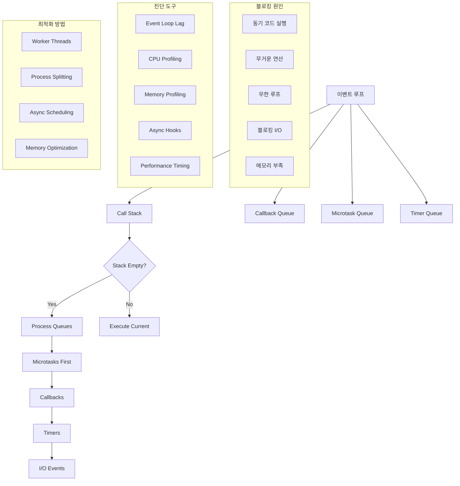
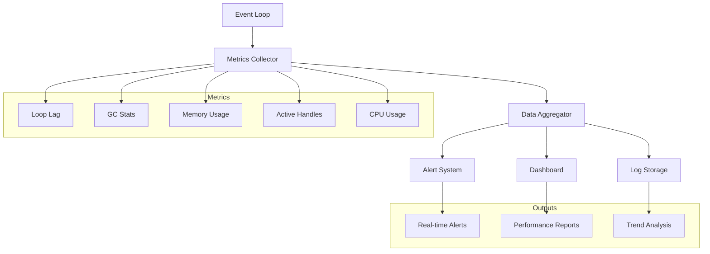

---
tags:
  - Event Loop
  - Asynchronous Programming
  - Performance Debugging
  - Monitoring
---

# 이벤트 루프 기초와 모니터링

## 상황: 응답하지 않는 이벤트 루프

"안녕하세요, Node.js로 개발한 API 서버가 간헐적으로 응답하지 않는 문제가 있습니다. CPU 사용률은 높지 않은데 요청이 처리되지 않아요. 이벤트 루프가 블록되는 것 같은데 어떻게 원인을 찾을 수 있을까요? 비동기 코드에서 어떤 부분이 문제인지 모르겠어요."

이런 이벤트 루프 블로킹 문제는 비동기 프로그래밍에서 가장 흔하면서도 찾기 어려운 문제입니다. 체계적인 접근이 필요합니다.

## 이벤트 루프 분석 체계



## 이벤트 루프 동작 원리

### Call Stack과 Queue 관리

이벤트 루프는 단일 스레드에서 비동기 작업을 처리하는 핵심 메커니즘입니다:

1. **Call Stack 확인**: 현재 실행 중인 함수가 있는지 확인
2. **Queue 우선순위**: Microtask Queue → Callback Queue → Timer Queue 순서로 처리
3. **Non-blocking 보장**: I/O 작업은 별도 스레드에서 처리 후 콜백 등록

### 블로킹 원인 분석

```javascript
// 블로킹 원인 1: 동기적인 무거운 연산
function heavyComputation() {
    let result = 0;
    for (let i = 0; i < 10000000000; i++) { // 100억 번 반복
        result += i;
    }
    return result;
}

// 블로킹 원인 2: 잘못된 비동기 패턴
function badAsyncPattern() {
    // Promise를 동기적으로 대기
    const result = syncWait(asyncOperation()); // 잘못된 패턴
    return result;
}

// 블로킹 원인 3: 메모리 부족으로 인한 GC 과부하
function memoryLeak() {
    const largeArray = [];
    setInterval(() => {
        largeArray.push(new Array(1000000).fill('data')); // 메모리 누수
    }, 100);
}
```

## 진단 도구와 메트릭

### 1. Event Loop Lag 측정

```javascript
// 이벤트 루프 지연시간 측정 기본 패턴
function measureEventLoopLag() {
    const start = process.hrtime.bigint();
    
    setImmediate(() => {
        const end = process.hrtime.bigint();
        const lag = Number(end - start) / 1000000; // 밀리초 변환
        console.log(`Event Loop Lag: ${lag.toFixed(2)}ms`);
        
        if (lag > 100) { // 100ms 이상이면 문제
            console.warn('⚠️ High event loop lag detected!');
        }
    });
}

// 지속적인 모니터링
setInterval(measureEventLoopLag, 1000);
```

### 2. Performance Hooks 활용

```javascript
const { performance, PerformanceObserver } = require('perf_hooks');

// GC 이벤트 모니터링
const obs = new PerformanceObserver((list) => {
    const entries = list.getEntries();
    
    entries.forEach(entry => {
        if (entry.entryType === 'gc') {
            console.log(`GC Event: ${entry.kind} took ${entry.duration.toFixed(2)}ms`);
            
            if (entry.duration > 50) { // 50ms 이상 GC는 문제
                console.warn('⚠️ Long GC pause detected!');
            }
        }
    });
});

obs.observe({ entryTypes: ['gc'] });
```

### 3. Active Handles 모니터링

```javascript
// 활성 핸들과 요청 모니터링
function monitorActiveResources() {
    const handles = process._getActiveHandles();
    const requests = process._getActiveRequests();
    
    console.log(`Active handles: ${handles.length}`);
    console.log(`Active requests: ${requests.length}`);
    
    // 핸들 타입별 분류
    const handleTypes = {};
    handles.forEach(handle => {
        const type = handle.constructor.name;
        handleTypes[type] = (handleTypes[type] || 0) + 1;
    });
    
    console.log('Handle types:', handleTypes);
    
    // 핸들 수가 계속 증가하면 메모리 누수 가능성
    if (handles.length > 1000) {
        console.warn('⚠️ Too many active handles - possible memory leak');
    }
}

setInterval(monitorActiveResources, 5000);
```

## 실시간 모니터링 설계

### 모니터링 아키텍처



### 기본 모니터링 클래스

```javascript
class EventLoopMonitor {
    constructor(options = {}) {
        this.options = {
            lagThreshold: options.lagThreshold || 100, // ms
            sampleInterval: options.sampleInterval || 1000, // ms
            enableGCMonitoring: options.enableGCMonitoring || true,
            enableMemoryMonitoring: options.enableMemoryMonitoring || true,
            ...options
        };
        
        this.metrics = {
            lagSamples: [],
            gcEvents: [],
            memoryUsage: [],
            activeHandles: []
        };
        
        this.isRunning = false;
        this.setupMonitoring();
    }
    
    setupMonitoring() {
        // Event Loop Lag 모니터링
        this.lagTimer = setInterval(() => {
            this.measureLag();
        }, this.options.sampleInterval);
        
        // GC 모니터링
        if (this.options.enableGCMonitoring) {
            this.setupGCMonitoring();
        }
        
        // 메모리 모니터링
        if (this.options.enableMemoryMonitoring) {
            this.memoryTimer = setInterval(() => {
                this.collectMemoryStats();
            }, this.options.sampleInterval);
        }
    }
    
    measureLag() {
        const start = process.hrtime.bigint();
        
        setImmediate(() => {
            const end = process.hrtime.bigint();
            const lag = Number(end - start) / 1000000;
            
            this.metrics.lagSamples.push({
                timestamp: Date.now(),
                lag: lag
            });
            
            // 최근 100개 샘플만 유지
            if (this.metrics.lagSamples.length > 100) {
                this.metrics.lagSamples.shift();
            }
            
            // 임계값 초과 시 알림
            if (lag > this.options.lagThreshold) {
                this.onLagSpike(lag);
            }
        });
    }
    
    setupGCMonitoring() {
        const obs = new PerformanceObserver((list) => {
            const entries = list.getEntries();
            
            entries.forEach(entry => {
                if (entry.entryType === 'gc') {
                    this.metrics.gcEvents.push({
                        timestamp: Date.now(),
                        type: entry.kind,
                        duration: entry.duration
                    });
                    
                    // 최근 50개 이벤트만 유지
                    if (this.metrics.gcEvents.length > 50) {
                        this.metrics.gcEvents.shift();
                    }
                    
                    // 긴 GC 감지
                    if (entry.duration > 50) {
                        this.onLongGC(entry);
                    }
                }
            });
        });
        
        obs.observe({ entryTypes: ['gc'] });
    }
    
    collectMemoryStats() {
        const memUsage = process.memoryUsage();
        const handles = process._getActiveHandles();
        const requests = process._getActiveRequests();
        
        this.metrics.memoryUsage.push({
            timestamp: Date.now(),
            ...memUsage,
            activeHandles: handles.length,
            activeRequests: requests.length
        });
        
        // 최근 100개 샘플만 유지
        if (this.metrics.memoryUsage.length > 100) {
            this.metrics.memoryUsage.shift();
        }
    }
    
    onLagSpike(lag) {
        console.warn(`⚠️ Event Loop Lag Spike: ${lag.toFixed(2)}ms`);
        
        // 스택 트레이스 수집
        const error = new Error('Event Loop Lag Spike');
        console.warn('Stack trace:', error.stack);
        
        // 추가 진단 정보 수집
        this.collectDiagnosticInfo();
    }
    
    onLongGC(gcEntry) {
        console.warn(`⚠️ Long GC: ${gcEntry.kind} took ${gcEntry.duration.toFixed(2)}ms`);
    }
    
    collectDiagnosticInfo() {
        const v8 = require('v8');
        
        const diagnostics = {
            timestamp: Date.now(),
            heapStats: v8.getHeapStatistics(),
            heapSpaceStats: v8.getHeapSpaceStatistics(),
            cpuUsage: process.cpuUsage(),
            memoryUsage: process.memoryUsage(),
            activeHandles: process._getActiveHandles().length,
            activeRequests: process._getActiveRequests().length
        };
        
        console.log('🔍 Diagnostic Info:', JSON.stringify(diagnostics, null, 2));
    }
    
    getStats() {
        const lagSamples = this.metrics.lagSamples;
        const gcEvents = this.metrics.gcEvents;
        
        if (lagSamples.length === 0) return null;
        
        const lags = lagSamples.map(s => s.lag);
        const avgLag = lags.reduce((a, b) => a + b, 0) / lags.length;
        const maxLag = Math.max(...lags);
        const minLag = Math.min(...lags);
        
        const totalGCTime = gcEvents.reduce((sum, gc) => sum + gc.duration, 0);
        
        return {
            samples: lagSamples.length,
            avgLag: avgLag.toFixed(2),
            maxLag: maxLag.toFixed(2),
            minLag: minLag.toFixed(2),
            lagSpikes: lags.filter(lag => lag > this.options.lagThreshold).length,
            gcEvents: gcEvents.length,
            totalGCTime: totalGCTime.toFixed(2)
        };
    }
    
    stop() {
        this.isRunning = false;
        
        if (this.lagTimer) clearInterval(this.lagTimer);
        if (this.memoryTimer) clearInterval(this.memoryTimer);
        
        console.log('Event Loop Monitor stopped');
        console.log('Final stats:', this.getStats());
    }
}
```

## 최적화 전략

### 1. Worker Threads 활용

```javascript
const { Worker, isMainThread, parentPort, workerData } = require('worker_threads');

if (isMainThread) {
    // 메인 스레드: CPU 집약적 작업을 워커로 이동
    function heavyTask(data) {
        return new Promise((resolve, reject) => {
            const worker = new Worker(__filename, {
                workerData: data
            });
            
            worker.on('message', resolve);
            worker.on('error', reject);
            worker.on('exit', (code) => {
                if (code !== 0) {
                    reject(new Error(`Worker stopped with exit code ${code}`));
                }
            });
        });
    }
    
    // 사용 예시
    heavyTask({ numbers: [1, 2, 3, 4, 5] })
        .then(result => console.log('Result:', result))
        .catch(err => console.error('Error:', err));
        
} else {
    // 워커 스레드: 실제 연산 수행
    const { numbers } = workerData;
    
    // CPU 집약적 연산
    const result = numbers.reduce((sum, num) => {
        // 복잡한 연산 시뮬레이션
        for (let i = 0; i < 1000000; i++) {
            sum += Math.sqrt(num);
        }
        return sum;
    }, 0);
    
    parentPort.postMessage(result);
}
```

### 2. 비동기 스케줄링

```javascript
// setImmediate를 활용한 비동기 스케줄링
function processLargeArray(array, processor) {
    const batchSize = 1000;
    let index = 0;
    
    return new Promise((resolve) => {
        function processBatch() {
            const endIndex = Math.min(index + batchSize, array.length);
            
            // 배치 처리
            for (let i = index; i < endIndex; i++) {
                processor(array[i], i);
            }
            
            index = endIndex;
            
            if (index < array.length) {
                // 이벤트 루프에 제어권 반환
                setImmediate(processBatch);
            } else {
                resolve();
            }
        }
        
        processBatch();
    });
}

// 사용 예시
const largeArray = new Array(1000000).fill(0).map((_, i) => i);

processLargeArray(largeArray, (item, index) => {
    // 각 항목에 대한 처리 (가벼운 작업)
    return item * 2;
})
.then(() => {
    console.log('Large array processing completed without blocking');
});
```

## 핵심 요점

### 1. 모니터링이 핵심

이벤트 루프 문제는 실시간 모니터링 없이는 찾기 어렵습니다. 지속적인 메트릭 수집이 필요합니다.

### 2. 예방이 최선의 치료

CPU 집약적 작업은 Worker Thread로, 대량 데이터 처리는 비동기 스케줄링으로 미리 방지하세요.

### 3. 진단 정보의 중요성

문제 발생 시점의 스택 트레이스, 메모리 사용량, GC 통계 등을 함께 수집해야 정확한 원인을 찾을 수 있습니다.

---

**이전**: [이벤트 루프 디버깅 개요](05-event-loop-debugging.md)  
**다음**: [C 기반 모니터링 시스템](05b-c-monitoring-system.md)에서 고성능 네이티브 모니터링 도구를 학습합니다.
