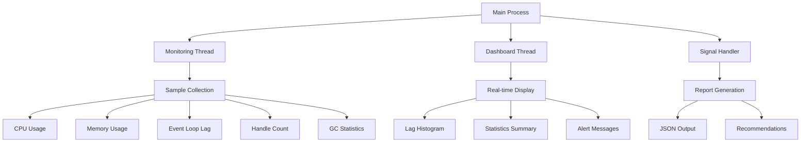

---
tags:
  - Event Loop
  - C Programming
  - System Monitoring
  - Performance Analysis
---

# C 기반 모니터링 시스템

포괄적인 이벤트 루프 상태 분석을 위한 고성능 C 기반 모니터링 도구를 구현해보겠습니다. 이 도구는 네이티브 성능으로 실시간 데이터를 수집하고 분석할 수 있습니다.

## 모니터링 시스템 아키텍처



## 핵심 데이터 구조

```c
// event_loop_monitor.c
#include <stdio.h>
#include <stdlib.h>
#include <string.h>
#include <unistd.h>
#include <time.h>
#include <sys/time.h>
#include <signal.h>
#include <pthread.h>
#include <errno.h>
#include <sys/resource.h>
#include <sys/syscall.h>
#include <linux/perf_event.h>
#include <sys/ioctl.h>
#include <fcntl.h>
#include <stdatomic.h>

#define MAX_SAMPLES 10000
#define SAMPLING_INTERVAL_US 1000
#define ALERT_THRESHOLD_MS 100

typedef struct {
    struct timeval timestamp;
    double event_loop_lag_ms;
    double cpu_usage;
    double memory_usage_mb;
    int active_handles;
    int pending_callbacks;
    int gc_count;
    double gc_time_ms;
} sample_t;

typedef struct {
    atomic_int running;
    atomic_int sample_count;
    sample_t samples[MAX_SAMPLES];
    pthread_mutex_t mutex;

    // 통계
    double max_lag_ms;
    double avg_lag_ms;
    int lag_spikes;
    int blocking_events;

    // 설정
    double alert_threshold_ms;
    int enable_detailed_logging;
    char log_file[256];
} event_loop_monitor_t;

static event_loop_monitor_t monitor = {0};
```

## 시스템 메트릭 수집

### 고해상도 타이머

```c
// 고해상도 타이머
static inline uint64_t get_timestamp_ns() {
    struct timespec ts;
    clock_gettime(CLOCK_MONOTONIC, &ts);
    return ts.tv_sec * 1000000000ULL + ts.tv_nsec;
}
```

### CPU 사용률 측정

```c
// CPU 사용률 측정
double get_cpu_usage() {
    static long last_total = 0, last_idle = 0;
    FILE *fp = fopen("/proc/stat", "r");
    if (!fp) return -1;

    long user, nice, system, idle, iowait, irq, softirq, steal;
    if (fscanf(fp, "cpu %ld %ld %ld %ld %ld %ld %ld %ld",
               &user, &nice, &system, &idle, &iowait, &irq, &softirq, &steal) != 8) {
        fclose(fp);
        return -1;
    }
    fclose(fp);

    long total = user + nice + system + idle + iowait + irq + softirq + steal;
    long total_diff = total - last_total;
    long idle_diff = idle - last_idle;

    if (total_diff == 0) return 0;

    double cpu_usage = 100.0 * (1.0 - (double)idle_diff / total_diff);

    last_total = total;
    last_idle = idle;

    return cpu_usage;
}
```

### 메모리 사용량 측정

```c
// 메모리 사용량 측정
double get_memory_usage() {
    FILE *fp = fopen("/proc/self/status", "r");
    if (!fp) return -1;

    char line[256];
    double vmrss_kb = 0;

    while (fgets(line, sizeof(line), fp)) {
        if (sscanf(line, "VmRSS: %lf kB", &vmrss_kb) == 1) {
            break;
        }
    }
    fclose(fp);

    return vmrss_kb / 1024.0; // MB로 변환
}
```

### 이벤트 루프 지연시간 측정

```c
// 이벤트 루프 지연시간 시뮬레이션 측정
double measure_event_loop_lag() {
    static uint64_t last_measurement = 0;
    uint64_t now = get_timestamp_ns();

    if (last_measurement == 0) {
        last_measurement = now;
        return 0;
    }

    // 예상 간격과 실제 간격의 차이
    uint64_t expected_interval = SAMPLING_INTERVAL_US * 1000; // 나노초
    uint64_t actual_interval = now - last_measurement;

    last_measurement = now;

    if (actual_interval > expected_interval) {
        return (double)(actual_interval - expected_interval) / 1000000.0; // 밀리초
    }

    return 0;
}
```

### 프로세스 리소스 모니터링

```c
// 프로세스 핸들 수 확인
int count_active_handles() {
    char path[256];
    snprintf(path, sizeof(path), "/proc/%d/fd", getpid());

    // /proc/pid/fd 디렉토리의 파일 수 계산
    FILE *fp = popen("ls /proc/self/fd | wc -l", "r");
    if (!fp) return -1;

    int count = 0;
    if (fscanf(fp, "%d", &count) != 1) {
        pclose(fp);
        return -1;
    }
    pclose(fp);

    return count;
}

// GC 정보 시뮬레이션 (실제로는 V8/Node.js API 필요)
void get_gc_stats(int *gc_count, double *gc_time_ms) {
    static int last_gc_count = 0;
    static double last_gc_time = 0;

    // 실제 구현에서는 v8::Isolate::GetHeapStatistics() 등을 사용
    *gc_count = last_gc_count + (rand() % 3); // 시뮬레이션
    *gc_time_ms = last_gc_time + (rand() % 10) * 0.1; // 시뮬레이션

    last_gc_count = *gc_count;
    last_gc_time = *gc_time_ms;
}
```

## 데이터 수집 및 분석

### 샘플 수집 함수

```c
// 샘플 수집
void collect_sample() {
    if (atomic_load(&monitor.sample_count) >= MAX_SAMPLES) {
        return; // 버퍼 가득 참
    }

    int index = atomic_fetch_add(&monitor.sample_count, 1);
    if (index >= MAX_SAMPLES) {
        atomic_store(&monitor.sample_count, MAX_SAMPLES);
        return;
    }

    sample_t *sample = &monitor.samples[index];

    gettimeofday(&sample->timestamp, NULL);
    sample->event_loop_lag_ms = measure_event_loop_lag();
    sample->cpu_usage = get_cpu_usage();
    sample->memory_usage_mb = get_memory_usage();
    sample->active_handles = count_active_handles();
    sample->pending_callbacks = rand() % 100; // 시뮬레이션

    get_gc_stats(&sample->gc_count, &sample->gc_time_ms);

    // 통계 업데이트
    if (sample->event_loop_lag_ms > monitor.max_lag_ms) {
        monitor.max_lag_ms = sample->event_loop_lag_ms;
    }

    if (sample->event_loop_lag_ms > monitor.alert_threshold_ms) {
        monitor.lag_spikes++;

        if (monitor.enable_detailed_logging) {
            printf("[ALERT] Event loop lag: %.2f ms at %ld.%06ld\n",
                   sample->event_loop_lag_ms,
                   sample->timestamp.tv_sec,
                   sample->timestamp.tv_usec);
        }
    }

    // 블로킹 이벤트 감지 (연속된 높은 지연시간)
    if (index > 0 && sample->event_loop_lag_ms > 50 &&
        monitor.samples[index-1].event_loop_lag_ms > 50) {
        monitor.blocking_events++;
    }
}
```

### 스택 트레이스 수집

```c
// 스택 트레이스 수집 (시뮬레이션)
void collect_stack_trace(char *buffer, size_t size) {
    // 실제 구현에서는 execinfo.h의 backtrace() 사용
    snprintf(buffer, size,
        "Stack trace (simulated):\n"
        "  at processCallback (/app/server.js:123:45)\n"
        "  at /app/middleware.js:67:89)\n"
        "  at Layer.handle [as handle_request] (/app/node_modules/express/lib/router/layer.js:95:5)\n"
        "  at next (/app/node_modules/express/lib/router/route.js:137:13)\n"
    );
}
```

## 멀티스레드 모니터링

### 모니터링 스레드

```c
// 실시간 모니터링 스레드
void* monitoring_thread(void *arg) {
    printf("이벤트 루프 모니터링 시작\n");

    while (atomic_load(&monitor.running)) {
        collect_sample();
        usleep(SAMPLING_INTERVAL_US);
    }

    printf("이벤트 루프 모니터링 종료\n");
    return NULL;
}
```

### 실시간 대시보드

```c
// 실시간 대시보드
void* dashboard_thread(void *arg) {
    while (atomic_load(&monitor.running)) {
        system("clear");

        printf("========================================\n");
        printf("이벤트 루프 실시간 모니터링\n");
        printf("========================================\n");
        printf("샘플링 주기: %d μs\n", SAMPLING_INTERVAL_US);
        printf("알림 임계값: %.1f ms\n", monitor.alert_threshold_ms);
        printf("수집된 샘플: %d\n", atomic_load(&monitor.sample_count));
        printf("----------------------------------------\n");

        // 최근 샘플 표시
        int count = atomic_load(&monitor.sample_count);
        if (count > 0) {
            int recent_idx = count - 1;
            sample_t *recent = &monitor.samples[recent_idx];

            printf("최근 측정값:\n");
            printf("  이벤트 루프 지연: %.2f ms\n", recent->event_loop_lag_ms);
            printf("  CPU 사용률: %.1f%%\n", recent->cpu_usage);
            printf("  메모리 사용량: %.1f MB\n", recent->memory_usage_mb);
            printf("  활성 핸들: %d\n", recent->active_handles);
            printf("  대기 중인 콜백: %d\n", recent->pending_callbacks);
            printf("  GC 횟수: %d\n", recent->gc_count);
            printf("  GC 시간: %.2f ms\n", recent->gc_time_ms);

            printf("\n");

            // 지연시간 히스토그램 (간단 버전)
            printf("지연시간 분포 (최근 100샘플):\n");
            int start_idx = count > 100 ? count - 100 : 0;
            int ranges[5] = {0}; // <10ms, 10-50ms, 50-100ms, 100-500ms, >500ms

            for (int i = start_idx; i < count; i++) {
                double lag = monitor.samples[i].event_loop_lag_ms;
                if (lag < 10) ranges[0]++;
                else if (lag < 50) ranges[1]++;
                else if (lag < 100) ranges[2]++;
                else if (lag < 500) ranges[3]++;
                else ranges[4]++;
            }

            printf("  < 10ms:    [");
            for (int i = 0; i < ranges[0] / 5; i++) printf("█");
            printf("] %d\n", ranges[0]);

            printf("  10-50ms:   [");
            for (int i = 0; i < ranges[1] / 5; i++) printf("█");
            printf("] %d\n", ranges[1]);

            printf("  50-100ms:  [");
            for (int i = 0; i < ranges[2] / 5; i++) printf("█");
            printf("] %d\n", ranges[2]);

            printf("  100-500ms: [");
            for (int i = 0; i < ranges[3] / 5; i++) printf("█");
            printf("] %d\n", ranges[3]);

            printf("  > 500ms:   [");
            for (int i = 0; i < ranges[4] / 5; i++) printf("█");
            printf("] %d\n", ranges[4]);
        }

        printf("\n");
        printf("통계:\n");
        printf("  최대 지연시간: %.2f ms\n", monitor.max_lag_ms);
        printf("  지연 스파이크: %d\n", monitor.lag_spikes);
        printf("  블로킹 이벤트: %d\n", monitor.blocking_events);

        if (monitor.lag_spikes > 10) {
            printf("\n⚠️  경고: 이벤트 루프 지연이 빈번합니다!\n");
        }

        if (monitor.blocking_events > 5) {
            printf("⚠️  경고: 블로킹 이벤트가 감지되었습니다!\n");
        }

        printf("\n[Ctrl+C로 종료]\n");

        sleep(1);
    }

    return NULL;
}
```

## 보고서 생성

### JSON 형태 분석 보고서

```c
// 분석 결과 저장
void save_analysis_report() {
    FILE *fp = fopen("event_loop_analysis.json", "w");
    if (!fp) {
        perror("리포트 파일 생성 실패");
        return;
    }

    int count = atomic_load(&monitor.sample_count);
    double total_lag = 0;
    double min_lag = INFINITY, max_lag = 0;
    int lag_over_100ms = 0;

    // 통계 계산
    for (int i = 0; i < count; i++) {
        double lag = monitor.samples[i].event_loop_lag_ms;
        total_lag += lag;

        if (lag < min_lag) min_lag = lag;
        if (lag > max_lag) max_lag = lag;
        if (lag > 100) lag_over_100ms++;
    }

    double avg_lag = count > 0 ? total_lag / count : 0;

    fprintf(fp, "{\n");
    fprintf(fp, "  \"analysis_timestamp\": \"%ld\",\n", time(NULL));
    fprintf(fp, "  \"monitoring_duration_seconds\": %d,\n", count * SAMPLING_INTERVAL_US / 1000000);
    fprintf(fp, "  \"sample_count\": %d,\n", count);
    fprintf(fp, "  \"sampling_interval_us\": %d,\n", SAMPLING_INTERVAL_US);
    fprintf(fp, "  \"statistics\": {\n");
    fprintf(fp, "    \"min_lag_ms\": %.2f,\n", min_lag == INFINITY ? 0 : min_lag);
    fprintf(fp, "    \"max_lag_ms\": %.2f,\n", max_lag);
    fprintf(fp, "    \"avg_lag_ms\": %.2f,\n", avg_lag);
    fprintf(fp, "    \"lag_spikes\": %d,\n", monitor.lag_spikes);
    fprintf(fp, "    \"blocking_events\": %d,\n", monitor.blocking_events);
    fprintf(fp, "    \"lag_over_100ms_count\": %d\n", lag_over_100ms);
    fprintf(fp, "  },\n");
    fprintf(fp, "  \"recommendations\": [\n");

    if (avg_lag > 50) {
        fprintf(fp, "    \"평균 이벤트 루프 지연이 높습니다. 동기 코드를 최적화하세요.\",\n");
    }

    if (monitor.lag_spikes > count * 0.1) {
        fprintf(fp, "    \"빈번한 지연 스파이크가 감지됩니다. CPU 집약적 작업을 Worker Thread로 이동하세요.\",\n");
    }

    if (monitor.blocking_events > 0) {
        fprintf(fp, "    \"블로킹 이벤트가 감지됩니다. 비동기 패턴을 검토하세요.\",\n");
    }

    fprintf(fp, "    \"정기적인 모니터링을 통해 성능 회귀를 방지하세요.\"\n");
    fprintf(fp, "  ]\n");
    fprintf(fp, "}\n");

    fclose(fp);
    printf("분석 리포트 저장: event_loop_analysis.json\n");
}
```

## 메인 함수와 설정

### 시그널 핸들러

```c
// 시그널 핸들러
void signal_handler(int sig) {
    printf("\n모니터링 중단 신호 수신...\n");
    atomic_store(&monitor.running, 0);
}
```

### 사용법 출력

```c
// 사용법 출력
void print_usage(const char *program_name) {
    printf("이벤트 루프 모니터링 도구\n");
    printf("사용법: %s [옵션]\n", program_name);
    printf("옵션:\n");
    printf("  -t THRESHOLD   알림 임계값 (ms, 기본값: %.1f)\n", ALERT_THRESHOLD_MS);
    printf("  -v             상세 로깅 활성화\n");
    printf("  -d DURATION    모니터링 시간 (초, 0=무제한)\n");
    printf("  -o FILE        로그 파일 경로\n");
    printf("  --help         이 도움말 출력\n");
}
```

### 메인 함수

```c
int main(int argc, char *argv[]) {
    // 기본값 설정
    monitor.alert_threshold_ms = ALERT_THRESHOLD_MS;
    monitor.enable_detailed_logging = 0;
    atomic_store(&monitor.running, 1);

    int duration_sec = 0; // 0 = 무제한

    // 명령행 인자 처리
    for (int i = 1; i < argc; i++) {
        if (strcmp(argv[i], "-t") == 0 && i + 1 < argc) {
            monitor.alert_threshold_ms = atof(argv[++i]);
        } else if (strcmp(argv[i], "-v") == 0) {
            monitor.enable_detailed_logging = 1;
        } else if (strcmp(argv[i], "-d") == 0 && i + 1 < argc) {
            duration_sec = atoi(argv[++i]);
        } else if (strcmp(argv[i], "-o") == 0 && i + 1 < argc) {
            strncpy(monitor.log_file, argv[++i], sizeof(monitor.log_file) - 1);
        } else if (strcmp(argv[i], "--help") == 0) {
            print_usage(argv[0]);
            return 0;
        }
    }

    // 뮤텍스 초기화
    if (pthread_mutex_init(&monitor.mutex, NULL) != 0) {
        perror("뮤텍스 초기화 실패");
        return 1;
    }

    // 시그널 핸들러 설정
    signal(SIGINT, signal_handler);
    signal(SIGTERM, signal_handler);

    printf("이벤트 루프 모니터링 시작\n");
    printf("알림 임계값: %.1f ms\n", monitor.alert_threshold_ms);
    if (duration_sec > 0) {
        printf("모니터링 시간: %d초\n", duration_sec);
    } else {
        printf("모니터링 시간: 무제한 (Ctrl+C로 중단)\n");
    }

    // 모니터링 스레드 시작
    pthread_t monitor_thread, dash_thread;

    if (pthread_create(&monitor_thread, NULL, monitoring_thread, NULL) != 0) {
        perror("모니터링 스레드 생성 실패");
        return 1;
    }

    if (pthread_create(&dash_thread, NULL, dashboard_thread, NULL) != 0) {
        perror("대시보드 스레드 생성 실패");
        return 1;
    }

    // 지정된 시간만큼 실행
    if (duration_sec > 0) {
        sleep(duration_sec);
        atomic_store(&monitor.running, 0);
    }

    // 스레드 종료 대기
    pthread_join(monitor_thread, NULL);
    pthread_join(dash_thread, NULL);

    // 분석 결과 저장
    save_analysis_report();

    // 정리
    pthread_mutex_destroy(&monitor.mutex);

    printf("모니터링 완료\n");
    return 0;
}
```

## 컴파일과 사용법

### 컴파일 방법

```bash
# GCC로 컴파일
gcc -o event_loop_monitor event_loop_monitor.c -lpthread -lrt -lm

# 최적화된 릴리스 빌드
gcc -O2 -o event_loop_monitor event_loop_monitor.c -lpthread -lrt -lm -DNDEBUG
```

### 사용 예시

```bash
# 기본 모니터링 (100ms 임계값)
./event_loop_monitor

# 사용자 정의 임계값으로 10초간 모니터링
./event_loop_monitor -t 50 -d 10 -v

# 백그라운드에서 로그 파일로 결과 저장
./event_loop_monitor -o monitoring.log > /dev/null 2>&1 &
```

## 핵심 요점

### 1. 네이티브 성능

C로 구현된 모니터링 도구는 최소한의 오버헤드로 정확한 메트릭을 수집할 수 있습니다.

### 2. 실시간 대시보드

멀티스레드 아키텍처로 데이터 수집과 화면 표시를 분리하여 실시간 모니터링이 가능합니다.

### 3. 종합적 분석

CPU, 메모리, 핸들 수 등 다양한 시스템 메트릭을 종합하여 이벤트 루프 상태를 정확히 진단합니다.

---

**이전**: [이벤트 루프 기초와 모니터링](05a-event-loop-fundamentals.md)  
**다음**: [JavaScript 분석 도구](05c-javascript-analyzer.md)에서 Node.js 통합 분석 도구를 학습합니다.
