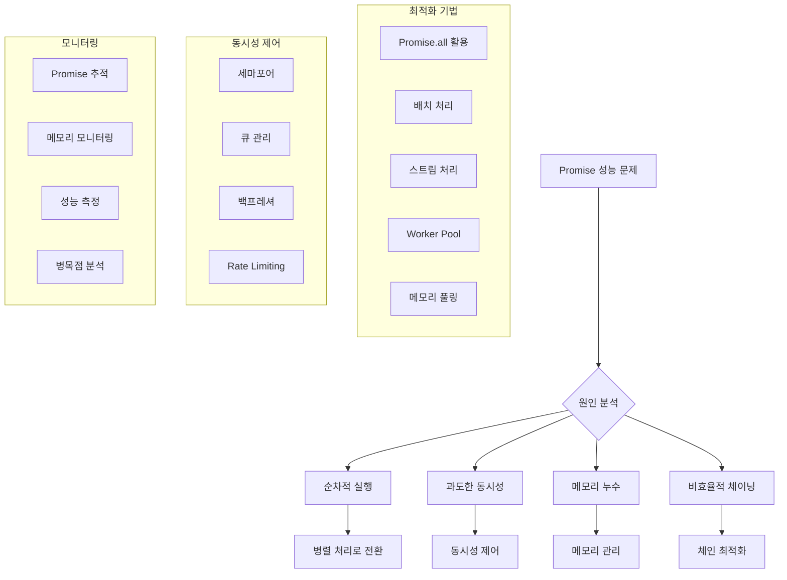

---
tags:
  - Promise Performance
  - Performance Analysis
  - C Programming
  - Memory Management
  - Concurrency Monitoring
---

# 06A. Promise 성능 분석 도구

## Promise 성능 문제 진단의 출발점

"Promise가 느려요"라는 문제를 해결하려면 먼저 정확한 측정과 분석이 필요합니다. 단순히 "느리다"고 느끼는 것과 실제로 어디서 병목이 발생하는지 아는 것은 완전히 다른 차원의 문제입니다.

성능 최적화의 첫 단계는 항상 측정입니다. 추측이나 직감이 아닌, 데이터에 기반한 분석을 통해서만 진정한 최적화가 가능합니다.

## Promise 성능 최적화 전략 개요



## C 기반 Promise 성능 분석기

JavaScript 환경에서의 Promise 성능 분석을 위해 C로 구현된 고성능 분석 도구입니다. 네이티브 수준의 정밀한 측정과 최소한의 오버헤드를 제공합니다.

```c
// promise_performance_analyzer.c
#include <stdio.h>
#include <stdlib.h>
#include <string.h>
#include <unistd.h>
#include <time.h>
#include <sys/time.h>
#include <pthread.h>
#include <errno.h>
#include <math.h>
#include <stdatomic.h>
#include <sys/resource.h>

#define MAX_PROMISES 10000
#define MAX_BATCH_SIZE 100
#define MEMORY_POOL_SIZE 1024

// Promise 상태 정의
typedef enum {
    PROMISE_PENDING,     // 대기 중
    PROMISE_FULFILLED,   // 이행됨
    PROMISE_REJECTED     // 거부됨
} promise_state_t;

// Promise 구조체 - 각 Promise의 생명주기와 성능 메트릭 추적
typedef struct promise {
    int id;                          // 고유 식별자
    promise_state_t state;           // 현재 상태
    struct timeval created;          // 생성 시각
    struct timeval resolved;         // 해결 시각
    double execution_time_ms;        // 실행 시간 (밀리초)
    size_t memory_usage;             // 메모리 사용량
    char error_message[256];         // 에러 메시지
    struct promise *next;            // 연결리스트용 포인터
} promise_t;

// Promise 큐 구조체 - 스레드 안전한 Promise 관리
typedef struct {
    promise_t *head;                 // 큐 헤드
    promise_t *tail;                 // 큐 테일
    int count;                       // 현재 큐 크기
    pthread_mutex_t mutex;           // 동시성 제어
} promise_queue_t;

// 성능 통계 구조체 - 원자적 연산으로 스레드 안전성 보장
typedef struct {
    atomic_int total_promises;       // 총 Promise 수
    atomic_int pending_promises;     // 대기 중인 Promise 수
    atomic_int fulfilled_promises;   // 성공한 Promise 수
    atomic_int rejected_promises;    // 실패한 Promise 수
    atomic_long total_memory_usage;  // 총 메모리 사용량
    atomic_long total_execution_time_ns; // 총 실행 시간 (나노초)

    // 성능 메트릭
    double avg_execution_time_ms;    // 평균 실행 시간
    double max_execution_time_ms;    // 최대 실행 시간
    double min_execution_time_ms;    // 최소 실행 시간
    double memory_peak_mb;           // 메모리 피크 사용량
    int memory_leaks;                // 메모리 누수 감지

    // 동시성 통계
    int max_concurrent_promises;     // 최대 동시 Promise 수
    int current_concurrent_promises; // 현재 동시 Promise 수
    double concurrency_efficiency;   // 동시성 효율성
} performance_stats_t;

// 설정 구조체
typedef struct {
    int max_concurrent;              // 최대 동시성
    int batch_size;                  // 배치 크기
    int enable_memory_pool;          // 메모리 풀 활성화
    int enable_detailed_logging;     // 상세 로깅 활성화
    double timeout_ms;               // 타임아웃 (밀리초)
} config_t;

// 전역 변수들
static performance_stats_t stats = {0};
static promise_queue_t active_promises = {0};
static promise_queue_t completed_promises = {0};
static config_t config = {
    .max_concurrent = 10,
    .batch_size = 50,
    .enable_memory_pool = 1,
    .enable_detailed_logging = 0,
    .timeout_ms = 5000.0
};

// 메모리 풀 - 동적 할당 오버헤드 최소화
static char memory_pool[MEMORY_POOL_SIZE * 1024]; // 1MB 풀
static int memory_pool_index = 0;
static pthread_mutex_t memory_pool_mutex = PTHREAD_MUTEX_INITIALIZER;

// 고해상도 타이머 - 나노초 단위 정밀 측정
static inline uint64_t get_timestamp_ns() {
    struct timespec ts;
    clock_gettime(CLOCK_MONOTONIC, &ts);
    return ts.tv_sec * 1000000000ULL + ts.tv_nsec;
}

// 시간 차이 계산 (밀리초)
double time_diff_ms(struct timeval *start, struct timeval *end) {
    return (end->tv_sec - start->tv_sec) * 1000.0 +
           (end->tv_usec - start->tv_usec) / 1000.0;
}

// 메모리 풀에서 할당 - 빠른 메모리 할당으로 성능 향상
void* pool_alloc(size_t size) {
    if (!config.enable_memory_pool) {
        return malloc(size);
    }

    pthread_mutex_lock(&memory_pool_mutex);

    if (memory_pool_index + size > sizeof(memory_pool)) {
        pthread_mutex_unlock(&memory_pool_mutex);
        return malloc(size); // 풀 부족 시 일반 할당
    }

    void *ptr = memory_pool + memory_pool_index;
    memory_pool_index += size;

    pthread_mutex_unlock(&memory_pool_mutex);
    return ptr;
}

// 메모리 풀 해제 (실제로는 아무것도 하지 않음)
void pool_free(void *ptr) {
    if (!config.enable_memory_pool) {
        free(ptr);
    }
    // 풀 메모리는 프로그램 종료 시 해제
}

// 큐 초기화
void init_queue(promise_queue_t *queue) {
    queue->head = NULL;
    queue->tail = NULL;
    queue->count = 0;
    if (pthread_mutex_init(&queue->mutex, NULL) != 0) {
        perror("큐 뮤텍스 초기화 실패");
        exit(1);
    }
}

// 큐에 Promise 추가 - 스레드 안전한 큐 연산
void enqueue_promise(promise_queue_t *queue, promise_t *promise) {
    pthread_mutex_lock(&queue->mutex);

    if (queue->tail) {
        queue->tail->next = promise;
    } else {
        queue->head = promise;
    }

    queue->tail = promise;
    promise->next = NULL;
    queue->count++;

    pthread_mutex_unlock(&queue->mutex);
}

// 큐에서 Promise 제거
promise_t* dequeue_promise(promise_queue_t *queue) {
    pthread_mutex_lock(&queue->mutex);

    if (!queue->head) {
        pthread_mutex_unlock(&queue->mutex);
        return NULL;
    }

    promise_t *promise = queue->head;
    queue->head = promise->next;

    if (!queue->head) {
        queue->tail = NULL;
    }

    queue->count--;

    pthread_mutex_unlock(&queue->mutex);
    return promise;
}

// Promise 생성 - 메트릭 추적 포함
promise_t* create_promise() {
    promise_t *promise = (promise_t*)pool_alloc(sizeof(promise_t));
    if (!promise) {
        return NULL;
    }

    static int promise_id = 0;
    promise->id = __sync_add_and_fetch(&promise_id, 1);
    promise->state = PROMISE_PENDING;
    gettimeofday(&promise->created, NULL);
    promise->execution_time_ms = 0;
    promise->memory_usage = sizeof(promise_t);
    promise->error_message[0] = '\0';
    promise->next = NULL;

    // 원자적 통계 업데이트
    atomic_fetch_add(&stats.total_promises, 1);
    atomic_fetch_add(&stats.pending_promises, 1);
    atomic_fetch_add(&stats.total_memory_usage, promise->memory_usage);

    // 동시성 추적
    int current = atomic_fetch_add(&stats.current_concurrent_promises, 1) + 1;
    if (current > stats.max_concurrent_promises) {
        stats.max_concurrent_promises = current;
    }

    enqueue_promise(&active_promises, promise);

    if (config.enable_detailed_logging) {
        printf("[CREATE] Promise %d 생성\n", promise->id);
    }

    return promise;
}

// Promise 해결 - 성공 케이스 처리
void resolve_promise(promise_t *promise, const char *result) {
    if (promise->state != PROMISE_PENDING) {
        return;
    }

    gettimeofday(&promise->resolved, NULL);
    promise->state = PROMISE_FULFILLED;
    promise->execution_time_ms = time_diff_ms(&promise->created, &promise->resolved);

    atomic_fetch_sub(&stats.pending_promises, 1);
    atomic_fetch_add(&stats.fulfilled_promises, 1);
    atomic_fetch_sub(&stats.current_concurrent_promises, 1);

    // 실행 시간 통계 업데이트
    if (promise->execution_time_ms > stats.max_execution_time_ms) {
        stats.max_execution_time_ms = promise->execution_time_ms;
    }

    if (promise->execution_time_ms < stats.min_execution_time_ms ||
        stats.min_execution_time_ms == 0) {
        stats.min_execution_time_ms = promise->execution_time_ms;
    }

    atomic_fetch_add(&stats.total_execution_time_ns,
                     (long)(promise->execution_time_ms * 1000000));

    enqueue_promise(&completed_promises, promise);

    if (config.enable_detailed_logging) {
        printf("[RESOLVE] Promise %d 해결 (%.2fms)\n",
               promise->id, promise->execution_time_ms);
    }
}

// Promise 거부 - 실패 케이스 처리
void reject_promise(promise_t *promise, const char *error) {
    if (promise->state != PROMISE_PENDING) {
        return;
    }

    gettimeofday(&promise->resolved, NULL);
    promise->state = PROMISE_REJECTED;
    promise->execution_time_ms = time_diff_ms(&promise->created, &promise->resolved);
    strncpy(promise->error_message, error, sizeof(promise->error_message) - 1);

    atomic_fetch_sub(&stats.pending_promises, 1);
    atomic_fetch_add(&stats.rejected_promises, 1);
    atomic_fetch_sub(&stats.current_concurrent_promises, 1);

    enqueue_promise(&completed_promises, promise);

    if (config.enable_detailed_logging) {
        printf("[REJECT] Promise %d 거부: %s\n", promise->id, error);
    }
}

// 비동기 작업 시뮬레이션
void* async_worker(void *arg) {
    promise_t *promise = (promise_t*)arg;

    // 실제 작업 시뮬레이션 (100ms ~ 1초)
    int work_time_ms = 100 + (rand() % 900);
    usleep(work_time_ms * 1000);

    // 90% 확률로 성공
    if (rand() % 100 < 90) {
        resolve_promise(promise, "작업 완료");
    } else {
        reject_promise(promise, "작업 실패");
    }

    return NULL;
}
```

## 동시성 제어된 Promise 실행

시스템 리소스를 효율적으로 활용하면서도 과부하를 방지하는 동시성 제어 메커니즘입니다.

```c
// 동시성 제어된 Promise 실행
void execute_promises_with_concurrency_control(int count) {
    printf("동시성 제어 Promise 실행 시작 (%d개, 최대 동시성: %d)\n",
           count, config.max_concurrent);

    pthread_t threads[config.max_concurrent];
    int active_threads = 0;
    int created_promises = 0;

    uint64_t start_time = get_timestamp_ns();

    while (created_promises < count || active_threads > 0) {
        // 새 Promise 생성 (동시성 한도 내에서)
        while (created_promises < count && active_threads < config.max_concurrent) {
            promise_t *promise = create_promise();
            if (!promise) {
                printf("Promise 생성 실패\n");
                break;
            }

            if (pthread_create(&threads[active_threads], NULL,
                              async_worker, promise) == 0) {
                active_threads++;
                created_promises++;
            } else {
                reject_promise(promise, "스레드 생성 실패");
            }
        }

        // 완료된 스레드 정리
        for (int i = 0; i < active_threads; i++) {
            if (pthread_tryjoin_np(threads[i], NULL) == 0) {
                // 완료된 스레드를 배열에서 제거
                for (int j = i; j < active_threads - 1; j++) {
                    threads[j] = threads[j + 1];
                }
                active_threads--;
                i--; // 인덱스 조정
            }
        }

        usleep(1000); // 1ms 대기
    }

    uint64_t end_time = get_timestamp_ns();
    double total_time_ms = (end_time - start_time) / 1000000.0;

    printf("실행 완료: %.2fms\n", total_time_ms);
}
```

## 배치 처리 시스템

대량의 Promise를 효율적으로 처리하기 위한 배치 시스템입니다.

```c
// 배치 처리
void execute_promises_in_batches(int total_count) {
    printf("배치 처리 시작 (총 %d개, 배치 크기: %d)\n",
           total_count, config.batch_size);

    int remaining = total_count;
    int batch_number = 1;

    uint64_t start_time = get_timestamp_ns();

    while (remaining > 0) {
        int batch_size = remaining < config.batch_size ? remaining : config.batch_size;

        printf("배치 %d 실행 중 (%d개)...\n", batch_number, batch_size);

        // 배치 내 Promise들을 병렬로 실행
        pthread_t threads[batch_size];
        promise_t *promises[batch_size];

        // Promise 생성 및 스레드 시작
        for (int i = 0; i < batch_size; i++) {
            promises[i] = create_promise();
            if (promises[i]) {
                if (pthread_create(&threads[i], NULL, async_worker, promises[i]) != 0) {
                    reject_promise(promises[i], "스레드 생성 실패");
                }
            }
        }

        // 배치 완료 대기
        for (int i = 0; i < batch_size; i++) {
            if (promises[i]) {
                pthread_join(threads[i], NULL);
            }
        }

        remaining -= batch_size;
        batch_number++;

        printf("배치 %d 완료\n", batch_number - 1);
    }

    uint64_t end_time = get_timestamp_ns();
    double total_time_ms = (end_time - start_time) / 1000000.0;

    printf("배치 처리 완료: %.2fms\n", total_time_ms);
}
```

## 메모리 사용량 모니터링

Promise 실행 중 메모리 사용 패턴을 실시간으로 모니터링합니다.

```c
// 메모리 사용량 모니터링
void monitor_memory_usage() {
    struct rusage usage;
    if (getrusage(RUSAGE_SELF, &usage) == 0) {
        double memory_mb = usage.ru_maxrss / 1024.0; // KB를 MB로 변환

        if (memory_mb > stats.memory_peak_mb) {
            stats.memory_peak_mb = memory_mb;
        }

        printf("현재 메모리 사용량: %.2f MB (피크: %.2f MB)\n",
               memory_mb, stats.memory_peak_mb);
    }
}
```

## 성능 통계 및 리포트

수집된 메트릭을 분석하여 최적화 권장사항을 제공합니다.

```c
// 성능 통계 계산
void calculate_performance_stats() {
    int total = atomic_load(&stats.total_promises);
    int fulfilled = atomic_load(&stats.fulfilled_promises);
    long total_time_ns = atomic_load(&stats.total_execution_time_ns);

    if (fulfilled > 0) {
        stats.avg_execution_time_ms = (double)total_time_ns / (fulfilled * 1000000.0);
    }

    if (stats.max_concurrent_promises > 0) {
        stats.concurrency_efficiency = (double)fulfilled / stats.max_concurrent_promises;
    }

    // 메모리 누수 감지 (간단한 휴리스틱)
    if (atomic_load(&stats.total_memory_usage) > total * sizeof(promise_t) * 2) {
        stats.memory_leaks = 1;
    }
}

// 성능 리포트 출력
void print_performance_report() {
    calculate_performance_stats();

    printf("\n=====================================\n");
    printf("Promise 성능 분석 리포트\n");
    printf("=====================================\n");

    printf("📊 기본 통계:\n");
    printf("  총 Promise 수: %d\n", atomic_load(&stats.total_promises));
    printf("  성공한 Promise: %d\n", atomic_load(&stats.fulfilled_promises));
    printf("  실패한 Promise: %d\n", atomic_load(&stats.rejected_promises));
    printf("  대기 중인 Promise: %d\n", atomic_load(&stats.pending_promises));

    if (atomic_load(&stats.fulfilled_promises) > 0) {
        double success_rate = (double)atomic_load(&stats.fulfilled_promises) /
                             atomic_load(&stats.total_promises) * 100;
        printf("  성공률: %.1f%%\n", success_rate);
    }

    printf("\n⏱️  실행 시간 통계:\n");
    printf("  평균 실행 시간: %.2f ms\n", stats.avg_execution_time_ms);
    printf("  최소 실행 시간: %.2f ms\n", stats.min_execution_time_ms);
    printf("  최대 실행 시간: %.2f ms\n", stats.max_execution_time_ms);

    printf("\n🔄 동시성 통계:\n");
    printf("  최대 동시 Promise 수: %d\n", stats.max_concurrent_promises);
    printf("  동시성 효율성: %.2f\n", stats.concurrency_efficiency);
    printf("  설정된 최대 동시성: %d\n", config.max_concurrent);

    printf("\n💾 메모리 통계:\n");
    printf("  총 메모리 사용량: %ld bytes\n", atomic_load(&stats.total_memory_usage));
    printf("  피크 메모리 사용량: %.2f MB\n", stats.memory_peak_mb);
    printf("  메모리 풀 사용: %s\n", config.enable_memory_pool ? "활성화" : "비활성화");

    if (stats.memory_leaks) {
        printf("  ⚠️  메모리 누수 감지됨\n");
    }

    printf("\n🎯 최적화 권장사항:\n");

    if (stats.avg_execution_time_ms > 1000) {
        printf("  - 평균 실행 시간이 높습니다. 작업을 더 작은 단위로 분할하세요.\n");
    }

    if (stats.concurrency_efficiency < 0.5) {
        printf("  - 동시성 효율성이 낮습니다. 동시성 수준을 조정하세요.\n");
    }

    if (stats.memory_leaks) {
        printf("  - 메모리 누수가 감지되었습니다. Promise 정리를 확인하세요.\n");
    }

    if (atomic_load(&stats.rejected_promises) > atomic_load(&stats.total_promises) * 0.1) {
        printf("  - 실패율이 높습니다. 에러 처리를 개선하세요.\n");
    }

    if (stats.max_concurrent_promises < config.max_concurrent) {
        printf("  - 설정된 동시성이 충분히 활용되지 않았습니다.\n");
    }

    printf("\n최적화 기법:\n");
    printf("  - Promise.all() 사용으로 병렬 처리\n");
    printf("  - 적절한 동시성 제어 (세마포어 패턴)\n");
    printf("  - 메모리 풀링으로 할당 최적화\n");
    printf("  - 배치 처리로 리소스 효율성 향상\n");
}
```

## 핵심 요점

### 1. 정밀한 측정

고해상도 타이머와 원자적 연산을 통한 정확한 성능 측정

### 2. 메모리 최적화

메모리 풀을 활용한 동적 할당 오버헤드 최소화

### 3. 동시성 제어

세마포어 패턴으로 시스템 리소스 보호 및 효율적 활용

---

**다음**: [06B. JavaScript Promise 최적화 라이브러리](06b-promise-optimization-library.md)에서 실용적인 JavaScript 최적화 구현을 학습합니다.
