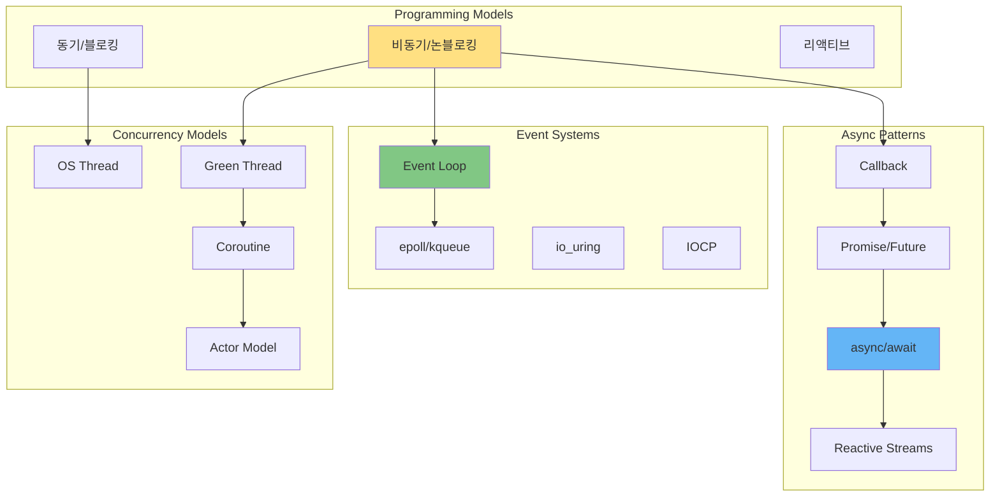
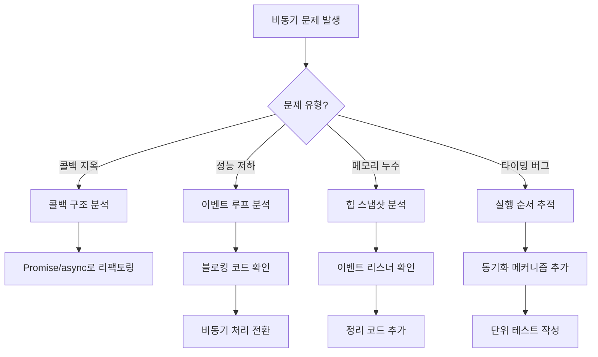

---
tags:
  - Async
  - EventLoop
  - Concurrency
  - Guide
  - SystemProgramming
  - Performance
---

# Chapter 8: 비동기 프로그래밍 - 동시성의 예술

## 이 장에서 다루는 내용

"이게 어떻게 가능해?" 

싱글 스레드 Node.js가 100만 개의 동시 연결을 처리하고, Go의 goroutine이 수백만 개 생성되어도 시스템이 멈추지 않습니다. 이 마법의 비밀은 무엇일까요?

이 장에서는 콜백에서 시작해 Promise, async/await를 거쳐 최신 비동기 패턴까지, 비동기 프로그래밍의 모든 것을 깊이 있게 탐구합니다. 이벤트 루프의 내부 동작, 코루틴과 그린 스레드, 그리고 분산 시스템에서의 비동기 패턴까지 다룹니다.

## 왜 이것을 알아야 하는가?

### 실무에서 마주치는 비동기 문제들

다음과 같은 상황을 경험해보셨나요?

- 🌀 **콜백 지옥**: 중첩된 콜백으로 읽기 힘든 코드
- ⏰ **타이밍 버그**: 비동기 작업 순서로 인한 간헐적 오류
- 💀 **데드락**: 잘못된 동기화로 인한 교착 상태
- 🐌 **성능 저하**: 동기 I/O로 인한 병목 현상
- 🔥 **메모리 누수**: 처리되지 않은 Promise와 이벤트 리스너

이런 문제들의 근본 원인은 비동기 프로그래밍 모델에 대한 이해 부족입니다. 이 장을 마스터하면, 효율적이고 확장 가능한 비동기 시스템을 구현할 수 있습니다.

## 비동기 프로그래밍 아키텍처 한눈에 보기



## 이 장의 구성

### [8-1: Promise와 Future 패턴](01-promise-future.md)

**"콜백 지옥에서 탈출하기"**

- 📦 **Promise의 탄생**: 콜백의 한계와 Promise의 해결책
- 🔗 **Promise 체이닝**: then, catch, finally의 우아한 조합
- ⚡ **async/await**: 동기 코드처럼 보이는 비동기
- 💡 **실전 패턴**: Promise.all, Promise.race 활용법

### [8-2: 이벤트 루프와 동시성](02-event-loop.md)

**"싱글 스레드의 마법"**

- 🔄 **이벤트 루프 구조**: 6단계 페이즈의 동작 원리
- 📊 **마이크로태스크 큐**: Promise와 process.nextTick
- ⏱️ **타이머의 비밀**: setTimeout이 정확하지 않은 이유
- 🚀 **성능 최적화**: 이벤트 루프 블로킹 방지

### [8-3: 코루틴과 그린 스레드](03-coroutine.md)

**"경량 동시성의 구현"**

- 🧵 **그린 스레드**: OS 스레드 vs 유저 스레드
- 🔀 **코루틴**: 협력적 멀티태스킹의 구현
- 🐹 **Go의 goroutine**: M:N 스케줄링 모델
- 🦀 **Rust의 async**: Zero-cost abstraction

### [8-4: 분산 비동기 패턴](04-distributed-async.md)

**"네트워크를 넘어서는 비동기"**

- 📬 **메시지 큐**: RabbitMQ, Kafka의 비동기 통신
- 🎭 **Actor 모델**: Erlang/Akka의 분산 시스템
- 🔄 **Saga 패턴**: 분산 트랜잭션의 해결책
- ⚡ **이벤트 소싱**: CQRS와 이벤트 기반 아키텍처

## 실습 환경 준비

이 장의 예제들을 직접 실행해보려면 다음 도구들이 필요합니다:

```bash
# Node.js 환경
$ node --version        # Node.js 버전 확인
$ npm install -g nodemon # 자동 재시작 도구

# Go 환경
$ go version           # Go 버전 확인
$ go get -u golang.org/x/tools/...

# Python asyncio
$ python3 -m pip install aiohttp asyncio

# 성능 모니터링
$ htop                 # CPU/메모리 모니터링
$ strace -c            # 시스템 콜 통계
$ perf record          # 성능 프로파일링

# 이벤트 루프 디버깅
$ node --trace-events-enabled
$ node --inspect-brk   # Chrome DevTools 연결
```

## 이 장을 읽고 나면

✅ **비동기 마스터**: 다양한 비동기 패턴 자유자재로 활용  
✅ **이벤트 루프 이해**: Node.js와 브라우저의 동작 원리 파악  
✅ **동시성 프로그래밍**: 코루틴과 액터 모델 구현 능력  
✅ **성능 최적화**: 비동기 병목 현상 해결  
✅ **분산 시스템**: 마이크로서비스 간 비동기 통신 구현  

## 핵심 개념 미리보기

```mermaid
mindmap
  root((비동기 프로그래밍))
    기본 개념
      동기 vs 비동기
        블로킹
        논블로킹
        동시성
        병렬성
      I/O 모델
        동기 블로킹
        동기 논블로킹
        비동기 블로킹
        비동기 논블로킹
    Promise/Future
      상태
        Pending
        Fulfilled
        Rejected
      메서드
        then()
        catch()
        finally()
      조합
        Promise.all()
        Promise.race()
        Promise.allSettled()
    이벤트 루프
      페이즈
        timers
        pending callbacks
        idle/prepare
        poll
        check
        close callbacks
      큐
        마이크로태스크
        매크로태스크
        nextTick
    코루틴
      특징
        협력적 스케줄링
        상태 보존
        경량성
      구현
        Generator
        async/await
        Fiber
      언어별
        Python asyncio
        Go goroutine
        Kotlin coroutine
    분산 패턴
      메시징
        Pub/Sub
        Request/Reply
        Fire-and-Forget
      패턴
        Saga
        Event Sourcing
        CQRS
      도구
        RabbitMQ
        Kafka
        Redis Streams
```

## 비동기 문제 진단 플로우차트



## 다음 단계

이제 [8-1: Promise와 Future 패턴](01-promise-future.md)부터 시작하여, 비동기 프로그래밍의 기초부터 고급 패턴까지 단계별로 마스터해봅시다.

비동기 프로그래밍은 현대 소프트웨어의 핵심입니다. 웹 서버, 모바일 앱, IoT, 클라우드 - 모든 곳에서 비동기가 사용됩니다. 이 장을 통해 비동기의 깊은 원리를 이해하고, 진정한 비동기 전문가로 거듭나게 될 것입니다.