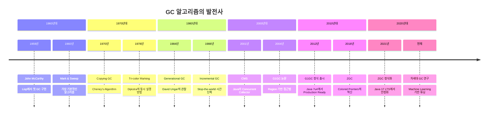
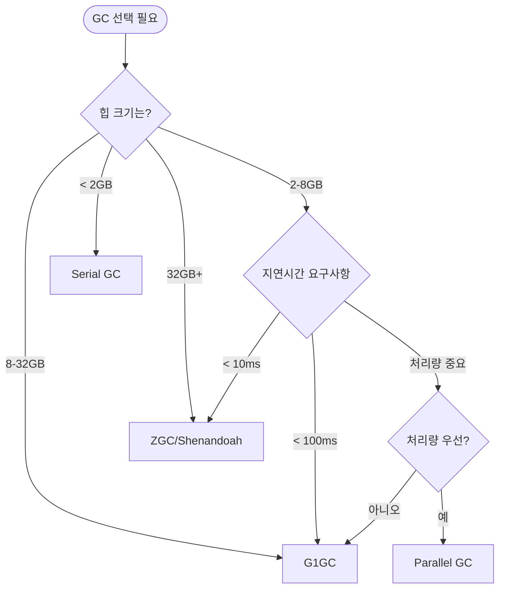

---
tags:
  - balanced
  - garbage-collection
  - intermediate
  - jvm-tuning
  - mark-and-sweep
  - medium-read
  - memory-management
  - performance-optimization
  - 시스템프로그래밍
difficulty: INTERMEDIATE
learning_time: "4-6시간"
main_topic: "시스템 프로그래밍"
priority_score: 4
---

# 8.2.4: GC 알고리즘 비교

## 🎯 가비지 컬렉션의 세계로

1959년 John McCarthy가 Lisp에 도입한 Garbage Collection은 프로그래밍 역사상 가장 혁신적인 발명 중 하나입니다. 메모리 누수의 악몽에서 벗어나게 해준 이 기술은, 오늘날 수많은 프로그래밍 언어의 핵심이 되었습니다.

## 📚 학습 로드맵

이 섹션은 4개의 전문화된 문서로 구성되어 있습니다:

### 1️⃣ [기본 GC 알고리즘](./08-02-01-basic-gc-algorithms.md)

- Mark & Sweep: 가장 직관적인 방법의 장단점
- Copying Collector: 단편화 해결을 위한 혁신
- Mark & Compact: 두 알고리즘의 장점을 결합한 접근법
- 각 알고리즘의 실제 구현과 성능 특성 분석

### 2️⃣ [세대별 및 동시 GC](./08-02-03-advanced-gc-concepts.md)

- Weak Generational Hypothesis와 세대별 GC의 핵심 원리
- Tri-color Marking을 통한 동시 실행 가능한 GC
- CMS (Concurrent Mark Sweep)의 구현과 문제점
- Write Barrier와 Card Table을 활용한 최적화

### 3️⃣ [현대적 GC 구현](./08-02-06-modern-gc-implementations.md)

- G1GC: Region 기반 가비지 컬렉션의 혁신
- ZGC: Colored Pointers를 통한 10ms 이하 지연 시간 달성
- Shenandoah: Brooks Pointer를 활용한 Red Hat의 접근법
- 각 GC의 실제 프로덕션 성능과 사용 사례

### 4️⃣ [GC 튜닝과 실전 활용](./08-04-01-gc-tuning-practices.md)

- GC 로그 분석과 성능 지표 해석
- 워크로드별 GC 선택 가이드
- 실제 튜닝 사례와 문제 해결 전략
- 미래의 GC 기술과 발전 방향

## 🎯 핵심 개념 비교표

| GC 알고리즘 | 단편화 | 메모리 사용률 | Stop-the-World | 주요 특징 |
|------------|--------|---------------|----------------|----------|
|**Mark & Sweep**| 발생 | 100% | 길음 | 가장 기본적, 단순한 구현 |
|**Copying**| 없음 | 50% | 보통 | 할당 빠름, 메모리 낭비 |
|**Mark & Compact**| 없음 | 100% | 길음 | 복잡한 구현, 균형잡힌 성능 |
|**Generational**| 다양 | 90%+ | 짧음 (Minor) | 실제 워크로드 최적화 |
|**G1GC**| 제어됨 | 95% | 예측 가능 | 대용량 힙, 목표 지연 시간 |
|**ZGC**| 없음 | 95% | 매우 짧음 | 초대용량 힙, 실시간 성능 |

## 🚀 실전 활용 시나리오

### 웹 서버 (높은 처리량 + 적당한 지연)

- 추천: G1GC 또는 Parallel GC
- 이유: 요청당 많은 임시 객체, 세대별 가설이 잘 맞음
- 튜닝: Eden 크기 최적화, GC 빈도 조절

### 실시간 거래 시스템 (낮은 지연 시간)

- 추천: ZGC 또는 Shenandoah
- 이유: Stop-the-world 시간 최소화 필수
- 튜닝: 메모리 사전 할당, Allocation rate 제어

### 대용량 분석 시스템 (높은 처리량)

- 추천: Parallel GC 또는 G1GC
- 이유: GC 오버헤드보다 전체 처리량이 중요
- 튜닝: 힙 크기 최대화, Full GC 빈도 최소화

### IoT/임베디드 시스템 (제한된 리소스)

- 추천: Serial GC
- 이유: 메모리와 CPU 사용량 최소화
- 튜닝: 힙 크기 고정, GC 빈도 예측

## 🔗 연관 학습

### 선행 학습

- [메모리 관리 기초](../chapter-03-memory-system/) - 힙과 스택의 이해
- [프로세스와 스레드](../chapter-01-process-thread/) - 멀티스레딩 환경의 GC

### 후속 학습

- [JVM 튜닝 가이드](../../java/jvm-tuning.md) - Java 환경에서의 실전 적용
- [시스템 설계 패턴](../chapter-16-distributed-system-patterns/) - 대용량 시스템에서의 메모리 관리

## 💡 GC 진화의 역사



## 🚀 성능 비교 요약

실제 프로덕션 워크로드에서의 성능 측정 결과:

| 시나리오 | 기본 GC | Generational | G1GC | ZGC | 비고 |
|----------|---------|-------------|------|-----|------|
|**웹 서버**(8GB 힙) | 500ms | 50ms | 100ms | 5ms | 요청-응답 패턴 |
|**배치 처리**(32GB 힙) | 2s | 200ms | 150ms | 10ms | 대량 데이터 처리 |
|**실시간**(16GB 힙) | 1s | 80ms | 200ms | 2ms | 저지연 요구사항 |
|**IoT 임베디드**(128MB 힙) | 50ms | 20ms | N/A | N/A | 제한된 리소스 |

## 🔧 GC 선택 의사결정 트리



## 🌟 GC의 핵심 원리

### 도달 가능성 (Reachability)

모든 GC 알고리즘의 기초가 되는 개념:

```c
// GC의 핵심 아이디어: "Root에서 도달할 수 없는 객체 = 쓰레기"
void* roots[] = {
    stack_variables,   // 스택 변수
    global_variables,  // 전역 변수
    cpu_registers,     // CPU 레지스터
    jni_references     // JNI 참조
};
```

### Stop-the-World의 딜레마

-**문제**: GC 중 애플리케이션 멈춤 현상
-**해결**: Concurrent GC로 동시 실행 구현
-**트레이드오프**: CPU 사용량 증가 vs 지연 시간 감소

### 메모리 단편화

-**Mark & Sweep**: 단편화 발생 (Swiss cheese problem)
-**Copying**: 단편화 해결, 메모리 50% 사용
-**Mark & Compact**: 단편화 해결, 100% 사용, 복잡한 구현

## 💡 핵심 교훈

### "은총알은 없다"

- 모든 GC는 트레이드오프를 가집니다
- 워크로드에 맞는 선택이 핵심
- 지속적인 측정과 튜닝이 필요

### "GC를 이해하면 더 좋은 코드를 작성한다"

- 객체의 생명 주기를 고려한 설계
- 불필요한 할당 패턴 최적화
- Off-heap 메모리 적극 활용

### "미래는 낮은 지연 시간"

- 사용자의 기대치는 계속 상승
- 실시간 처리 요구사항 증가
- ZGC/Shenandoah가 새로운 표준

## 🔮 GC의 미래

### 하드웨어 발전과 함께

-**Persistent Memory**: Intel Optane 등의 새로운 메모리 계층
-**Hardware GC 지원**: CPU 레벨에서의 GC 가속화
-**NUMA-aware GC**: 멀티소켓 시스템 최적화

### 알고리즘 혁신

-**Epsilon GC**: No-op GC로 완전한 수동 제어
-**Ultra-low latency**: 1ms 이하 목표
-**Machine Learning**: AI 기반 자동 튜닝

### 언어 레벨 혁신

-**Rust**: GC 없이도 메모리 안전성 보장
-**Zig**: 명시적 메모리 관리 + 컴파일 타임 검증
-**Swift**: ARC + Generational의 결합

---

**다음**: [기본 GC 알고리즘](./08-02-01-basic-gc-algorithms.md)에서 Mark & Sweep, Copying, Mark & Compact의 구현 원리를 상세히 학습합니다.

## 📚 관련 문서

### 📖 현재 문서 정보

-**난이도**: INTERMEDIATE
-**주제**: 시스템 프로그래밍
-**예상 시간**: 4-6시간

### 🎯 학습 경로

- [📚 INTERMEDIATE 레벨 전체 보기](../learning-paths/intermediate/)
- [🏠 메인 학습 경로](../learning-paths/)
- [📋 전체 가이드 목록](../README.md)

### 📂 같은 챕터 (chapter-08-memory-allocator-gc)

- [8.1.2: 메모리 할당자의 내부 구현 개요](./08-01-02-memory-allocator.md)
- [8.1.1: malloc 내부 동작의 진실](./08-01-01-malloc-fundamentals.md)
- [8.1.3: 메모리 할당자 대전: tcmalloc vs jemalloc vs mimalloc](./08-01-03-allocator-comparison.md)
- [8.1.4: 커스텀 메모리 할당자 구현](./08-01-04-custom-allocators.md)
- [Production: 실전 메모리 최적화 사례](../chapter-09-advanced-memory-management/08-30-production-optimization.md)

### 🏷️ 관련 키워드

`garbage-collection`, `memory-management`, `jvm-tuning`, `performance-optimization`, `mark-and-sweep`

### ⏭️ 다음 단계 가이드

- 실무 적용을 염두에 두고 프로젝트에 적용해보세요
- 관련 도구들을 직접 사용해보는 것이 중요합니다
