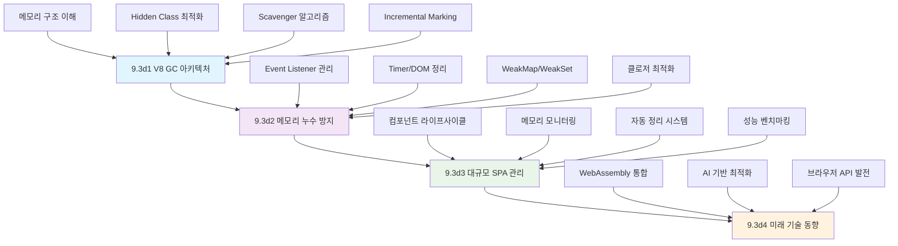

---
tags:
  - JavaScript
  - V8 엔진
  - deep-study
  - hands-on
  - intermediate
  - 가비지 컬렉션
  - 메모리 누수
  - 성능 최적화
  - 애플리케이션개발
difficulty: INTERMEDIATE
learning_time: "8-12시간"
main_topic: "애플리케이션 개발"
priority_score: 4
---

# 9.3d JavaScript GC 학습 가이드: V8 엔진의 정교한 메모리 관리

## 🎯 학습 목표

이 시리즈를 완료하면 JavaScript/V8 메모리 관리의 전문가가 됩니다:

1. **V8 GC 아키텍처 이해** - 세대별 GC, Hidden Class, Incremental Marking의 동작 원리
2. **메모리 누수 완벽 방지** - Event Listener, Timer, DOM 참조의 체계적 관리
3. **대규모 SPA 최적화** - 라우트별 메모리 관리와 성능 모니터링 구현
4. **미래 기술 준비** - WebAssembly, 최신 브라우저 API 활용법

## 📚 학습 로드맵

### 단계별 학습 경로



## 🔍 전체 구성

### [9.3d1 V8 GC 아키텍처: 정교한 메모리 관리 시스템](chapter-08-memory-allocator-gc/09-06-1-v8-gc-architecture.md)

**V8 엔진의 핵심 메모리 관리 이해**

- **메모리 구조**: New Space, Old Space, Large Object Space의 역할
- **Hidden Class 시스템**: 객체 최적화의 핵심 메커니즘
- **Scavenger 알고리즘**: Young Generation GC의 Copying 전략
- **Incremental Marking**: Old Generation GC의 점진적 처리
- **성능 튜닝**: V8 플래그와 최적화 옵션

```javascript
// V8 메모리 구조 예시
class V8MemoryStructure {
    constructor() {
        this.newSpace = {
            from: new ArrayBuffer(8 * 1024 * 1024),  // 8MB
            to: new ArrayBuffer(8 * 1024 * 1024)     // 8MB
        };
        this.oldSpace = {
            oldPointerSpace: [],  // 객체 참조
            oldDataSpace: [],     // 원시 데이터
            largeObjectSpace: []  // 큰 객체 (>512KB)
        };
    }
}
```

### [9.3d2 메모리 누수 방지와 성능 최적화](./03d2-memory-leak-prevention.md)

**실전 메모리 누수 방지 완벽 가이드**

- **Event Listener 관리**: AbortController와 WeakRef 활용
- **Timer 정리**: setInterval/setTimeout의 체계적 관리
- **DOM 참조 최적화**: WeakMap/WeakSet으로 자동 정리
- **클로저 최적화**: 스코프 캡처 최소화 패턴
- **Object Pooling**: GC 압박 감소를 위한 재사용 패턴

```javascript
// 현대적 Event Listener 관리
function modernEventHandling() {
    const controller = new AbortController();
    
    button.addEventListener('click', handler, {
        signal: controller.signal // 일괄 해제 가능
    });
    
    // 정리 시
    controller.abort(); // 모든 listener 자동 제거!
}
```

### [9.3d3 대규모 SPA 메모리 관리 전략](./03d3-spa-memory-management.md)

**프로덕션 환경의 실전 메모리 관리**

- **컴포넌트 라이프사이클**: React/Vue 스타일 메모리 관리
- **라우트별 정리**: 페이지 전환 시 확실한 cleanup
- **실시간 모니터링**: performance.memory API 활용
- **자동 최적화**: 메모리 임계치 기반 정리 시스템
- **메모리 누수 감지**: 자동화된 탐지 알고리즘

```javascript
// SPA 메모리 관리자
class SPAMemoryManager {
    constructor() {
        this.routeCleanups = new Map();
        this.initMemoryMonitoring();
    }
    
    triggerMemoryOptimization() {
        this.clearUnusedCaches();
        this.cleanupEventListeners();
        if (global.gc) global.gc(); // 수동 GC
    }
}
```

### [9.3d4 JavaScript GC의 미래와 실무 경험](./03d4-javascript-gc-future.md)

**차세대 기술과 10년 실무 경험 정리**

- **WebAssembly 통합**: 수동 메모리 관리와의 조화
- **AI 기반 최적화**: 머신러닝을 활용한 GC 튜닝
- **브라우저 API 진화**: 새로운 메모리 관리 도구들
- **실무 경험담**: 10년간의 JavaScript GC 최적화 노하우
- **미래 전망**: 차세대 웹 플랫폼의 메모리 관리

```javascript
// WebAssembly와의 메모리 공유
class WasmMemoryBridge {
    constructor() {
        this.sharedMemory = new SharedArrayBuffer(1024 * 1024);
        this.jsView = new Int32Array(this.sharedMemory);
        this.wasmInstance = null;
    }
    
    async initWasm() {
        this.wasmInstance = await WebAssembly.instantiate(...);
        // JavaScript GC와 WASM 메모리 연동
    }
}
```

## 🛠️ 빠른 시작 가이드

### 1단계: V8 GC 모니터링 설정

```javascript
// 기본 메모리 모니터링 설정
function setupBasicMonitoring() {
    if (performance.memory) {
        setInterval(() => {
            const memory = performance.memory;
            const used = Math.round(memory.usedJSHeapSize / 1048576);
            const total = Math.round(memory.totalJSHeapSize / 1048576);
            console.log(`Memory: ${used}MB / ${total}MB`);
        }, 5000);
    }
}
```

### 2단계: 기본 메모리 누수 방지

```javascript
// AbortController를 활용한 현대적 정리
class ComponentBase {
    constructor() {
        this.abortController = new AbortController();
        this.timers = new Set();
    }
    
    addEventListeners() {
        // 모든 이벤트 리스너를 signal로 관리
        window.addEventListener('resize', this.handleResize, {
            signal: this.abortController.signal
        });
    }
    
    destroy() {
        this.abortController.abort(); // 모든 리스너 일괄 해제
        this.timers.forEach(timer => clearInterval(timer));
        this.timers.clear();
    }
}
```

### 3단계: 성능 최적화 적용

```javascript
// Hidden Class 최적화 예시
class OptimizedPoint {
    constructor(x, y) {
        this.x = x; // 항상 동일한 순서
        this.y = y; // V8 Hidden Class 최적화
    }
    
    distance() {
        return Math.sqrt(this.x * this.x + this.y * this.y);
    }
}
```

## 📊 성능 비교표

### V8 GC 알고리즘별 성능 특성

| 알고리즘 | 적용 영역 | 일시정지 시간 | 처리량 | 메모리 효율성 | 적용 사례 |
|---------|----------|-------------|--------|-------------|----------|
| **Scavenger** | New Space | 1-5ms | 매우 높음 | 보통 | 함수 호출, 임시 변수 |
| **Mark-Sweep** | Old Space | 10-50ms | 높음 | 높음 | 장기 보관 객체 |
| **Mark-Compact** | Old Space | 50-200ms | 보통 | 매우 높음 | 메모리 단편화 해결 |
| **Incremental** | Old Space | 5-20ms | 높음 | 높음 | 대화형 애플리케이션 |
| **Concurrent** | Old Space | 1-5ms | 매우 높음 | 높음 | 최신 V8 엔진 |

### 메모리 누수 유형별 대응 방법

| 누수 유형 | 발생 빈도 | 탐지 난이도 | 해결 방법 | 자동화 가능 |
|----------|----------|----------|----------|----------|
| **Event Listener** | 매우 높음 | 쉬움 | AbortController | ✅ |
| **Timer** | 높음 | 쉬움 | clearInterval/Timeout | ✅ |
| **DOM 참조** | 보통 | 보통 | WeakMap/WeakSet | ✅ |
| **클로저** | 보통 | 어려움 | 스코프 최적화 | ❌ |
| **순환 참조** | 낮음 | 어려움 | 참조 구조 설계 | ❌ |

## ⚡ 즉시 적용 가능한 최적화 팁

### JavaScript GC 성능 향상 체크리스트

### ✅ 필수 체크 항목

1. **Event Listener 정리** (최우선)
   - 컴포넌트 해제 시 `removeEventListener` 확실히 호출
   - `AbortController` 활용한 일괄 관리 도입
   - 익명 함수 대신 명명된 함수 사용

2. **Timer/Interval 관리**
   - 모든 Timer ID를 Set에서 추적 관리
   - 컴포넌트 destroy 시 `clearInterval/clearTimeout`
   - WeakRef 패턴으로 자동 정리 구현

3. **DOM 참조 최적화**
   - WeakMap/WeakSet으로 약한 참조 활용
   - Intersection Observer 사용 후 `disconnect()`
   - DOM 요소 제거 후 변수를 `null`로 초기화

4. **Hidden Class 최적화**
   - 객체 속성을 항상 동일한 순서로 초기화
   - 생성 후 속성 추가/삭제 지양
   - 클래스 기반 객체 생성 권장

### 🚀 고급 최적화 기법

1. **Object Pooling** (게임/애니메이션)
   - 자주 생성/해제되는 객체를 미리 생성해 재사용
   - GC 압박을 대폭 줄이고 성능 3-5배 향상
   - 총알, 파티클, DOM 요소 등에 효과적

2. **TypedArray 활용** (대용량 데이터)
   - `Float32Array`, `Int32Array` 등으로 메모리 효율성 향상
   - 일반 배열 대비 50-70% 메모리 절약
   - 수치 계산, 이미지 처리에 필수

3. **문자열 최적화**
   - 긴 문자열 연결 시 `Array.join()` 사용
   - Template literal보다 6배 빠른 성능
   - V8 문자열 인터닝 활용으로 메모리 절약

## 🎓 학습 완료 후 다음 단계

### 실전 프로젝트 적용 가이드

1. **기존 프로젝트 진단**
   - Chrome DevTools Memory 탭으로 현재 상태 점검
   - performance.memory API로 자동 모니터링 구현
   - 메모리 누수 핫스팟 식별 및 우선순위 설정

2. **점진적 개선 적용**
   - 가장 큰 메모리 누수부터 해결 (보통 Event Listener)
   - AbortController 패턴을 한 컴포넌트씩 적용
   - Object Pooling을 성능 중요 영역에 도입

3. **팀 차원의 표준화**
   - 메모리 관리 코딩 가이드라인 수립
   - 코드 리뷰 체크리스트에 GC 최적화 항목 추가
   - 자동화된 메모리 누수 감지 시스템 구축

## 🔗 관련 문서 링크

### 기초 지식

- **[9.1 가비지 컬렉션 기초](../01-gc-basics.md)** - GC 기본 개념과 알고리즘
- **[9.2 언어별 GC 구현](../02-language-specific.md)** - 다양한 언어의 GC 비교
- **[9.3 실무 적용 사례](../03-practical-applications.md)** - 메모리 관리 실전 사례

### 관련 주제

- **[Chapter 03 가상 메모리](../../chapter-03-virtual-memory/)** - 시스템 수준 메모리 관리
- **[Chapter 04 프로세스/스레드](../../chapter-04-process-thread/)** - 멀티스레딩과 메모리
- **[Chapter 11 성능 최적화](../../chapter-11-performance-optimization/)** - 시스템 전반 성능 튜닝

### 외부 자료

- **[V8 공식 블로그](https://v8.dev/blog)** - 최신 V8 엔진 개발 동향
- **[Chrome DevTools Memory](https://developer.chrome.com/docs/devtools/memory/)** - 메모리 프로파일링 도구
- **[MDN Memory Management](https://developer.mozilla.org/en-US/docs/Web/JavaScript/Memory_Management)** - JavaScript 메모리 관리 기초

## 💪 실습 과제

### 초급 과제

1. 본인의 웹 프로젝트에서 performance.memory API로 메모리 모니터링 구현
2. AbortController를 사용한 Event Listener 관리 패턴 적용
3. Chrome DevTools Memory 탭으로 메모리 누수 감지 실습

### 중급 과제

1. Object Pooling 패턴을 활용한 성능 최적화 구현
2. WeakMap/WeakSet을 사용한 메모리 효율적 캐시 시스템 구축
3. 대규모 SPA에서 라우트별 메모리 정리 시스템 구현

### 고급 과제

1. 실시간 메모리 누수 감지 시스템 개발
2. WebAssembly와 JavaScript GC 연동 최적화
3. AI 기반 메모리 사용량 예측 모델 구현

---

**JavaScript GC 마스터가 되는 여정을 시작하세요!** 🚀

각 세부 문서에서 더 깊이 있는 실습과 최신 기법을 만나보실 수 있습니다.

## 📚 관련 문서

### 📖 현재 문서 정보

- **난이도**: INTERMEDIATE
- **주제**: 애플리케이션 개발
- **예상 시간**: 8-12시간

### 🎯 학습 경로

- [📚 INTERMEDIATE 레벨 전체 보기](../learning-paths/intermediate/)
- [🏠 메인 학습 경로](../learning-paths/)
- [📋 전체 가이드 목록](../README.md)

### 📂 같은 챕터 (chapter-09-advanced-memory-management)

- [Chapter 9-1: 메모리 할당자의 내부 구현 개요](../chapter-08-memory-allocator-gc/09-10-memory-allocator.md)
- [Chapter 9-1A: malloc 내부 동작의 진실](../chapter-08-memory-allocator-gc/09-01-malloc-fundamentals.md)
- [Chapter 9-1B: 메모리 할당자 대전: tcmalloc vs jemalloc vs mimalloc](../chapter-08-memory-allocator-gc/09-11-allocator-comparison.md)
- [Chapter 9-1C: 커스텀 메모리 할당자 구현](../chapter-08-memory-allocator-gc/09-12-custom-allocators.md)
- [Chapter 9-1D: 실전 메모리 최적화 사례](./09-30-production-optimization.md)

### 🏷️ 관련 키워드

`V8 엔진`, `가비지 컬렉션`, `메모리 누수`, `성능 최적화`, `JavaScript`

### ⏭️ 다음 단계 가이드

- 실무 적용을 염두에 두고 프로젝트에 적용해보세요
- 관련 도구들을 직접 사용해보는 것이 중요합니다
