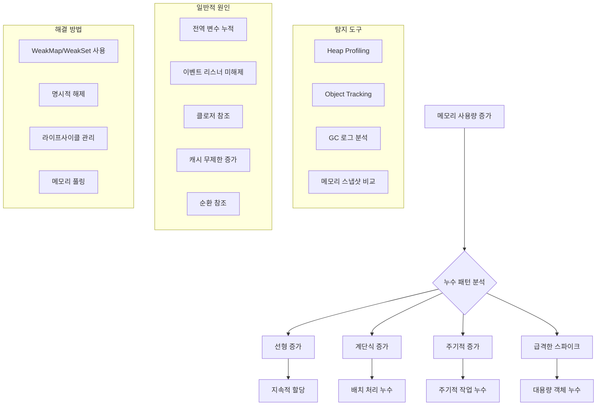

---
tags:
  - gc-analysis
  - hands-on
  - heap-profiling
  - intermediate
  - medium-read
  - memory-leak-detection
  - nodejs-profiling
  - system-monitoring
  - 시스템프로그래밍
difficulty: INTERMEDIATE
learning_time: "4-6시간"
main_topic: "시스템 프로그래밍"
priority_score: 4
---

# 메모리 누수 탐지: "메모리가 계속 늘어나요" 개요

## 🎯 메모리 누수의 체계적 분석과 해결

"안녕하세요, 서버 애플리케이션이 시간이 지날수록 메모리 사용량이 계속 늘어나는 문제가 있습니다. 재시작하면 정상으로 돌아가지만 며칠 지나면 다시 메모리가 부족해져요. GC가 제대로 동작하지 않는 것 같습니다. 메모리 누수를 어떻게 찾고 해결할 수 있을까요?"

이런 메모리 누수 문제는 장기간 운영되는 서비스에서 치명적인 장애로 이어질 수 있습니다. 체계적인 탐지와 분석이 필요합니다.

## 📚 학습 로드맵

이 섹션은 2개의 전문화된 문서로 구성되어 있습니다:

### 1️⃣ [시스템 레벨 탐지 도구](./05a-system-level-detection.md)

- C 기반 메모리 누수 탐지기 구현
- 해시 테이블 기반 할당 추적
- 실시간 누수 패턴 분석
- 힙 파편화 분석
- 메모리 사용량 히스토리 모니터링

### 2️⃣ [JavaScript/Node.js 프로파일링](./09-37-nodejs-profiling.md)

- V8 힙 스냅샷 분석
- GC 성능 모니터링
- 객체 타입별 메모리 분석
- 실시간 누수 감지 알고리즘
- 상세 분석 리포트 생성

## 🎯 핵심 개념 비교표

| 접근법 | 시스템 레벨 | JavaScript/Node.js |
|--------|-------------|-------------------|
| **추적 방법** | malloc/free 래퍼 | V8 힙 스냅샷 |
| **실시간성** | 스레드 기반 모니터링 | 이벤트 기반 샘플링 |
| **분석 대상** | 전체 프로세스 메모리 | JavaScript 힙 메모리 |
| **성능 오버헤드** | 낮음 (네이티브) | 중간 (V8 API) |
| **정확도** | 매우 높음 | 높음 |

## 메모리 누수 분석 체계

## 🚀 실전 활용 시나리오

### 서버 애플리케이션 누수 분석

- 장기 실행 서비스에서 점진적 메모리 증가
- 배치 처리 후 메모리 미해제 문제
- 캐시 무제한 증가로 인한 메모리 부족

### 클라이언트 애플리케이션 최적화

- SPA에서 DOM 이벤트 리스너 누적
- WebWorker 메모리 관리
- 대용량 데이터 처리 후 정리

## 🎭 학습 전략

### 초보자 (추천 순서)

1. [시스템 레벨 탐지 도구](./05a-system-level-detection.md) → 기본 메모리 추적 이해
2. [JavaScript/Node.js 프로파일링](./09-37-nodejs-profiling.md) → 실무 적용
3. 간단한 누수 시나리오 실습

### 중급자 (심화 학습)

1. [JavaScript/Node.js 프로파일링](./09-37-nodejs-profiling.md) → 고급 프로파일링 기법
2. [시스템 레벨 탐지 도구](./05a-system-level-detection.md) → 네이티브 레벨 분석
3. 프로덕션 환경 모니터링 적용

## 🔗 연관 학습

### 선행 학습

- [GC 알고리즘](chapter-08-memory-allocator-gc/09-13-gc-algorithms.md) - 가비지 컬렉션 동작 원리
- [메모리 최적화](./09-34-memory-optimization.md) - 메모리 효율적 사용법

### 후속 학습

- [메모리 최적화](./09-34-memory-optimization.md) - 누수 해결 후 성능 최적화
- [JavaScript GC 구현체별 차이점](./03d-javascript-gc.md) - 플랫폼별 세부 특성

---

**다음**: [시스템 레벨 탐지 도구](./05a-system-level-detection.md)에서 C 기반 메모리 누수 탐지기를 학습합니다.

## 📚 관련 문서

### 📖 현재 문서 정보

- **난이도**: INTERMEDIATE
- **주제**: 시스템 프로그래밍
- **예상 시간**: 4-6시간

### 🎯 학습 경로

- [📚 INTERMEDIATE 레벨 전체 보기](../learning-paths/intermediate/)
- [🏠 메인 학습 경로](../learning-paths/)
- [📋 전체 가이드 목록](../README.md)

### 📂 같은 챕터 (chapter-09-advanced-memory-management)

- [Chapter 9-1: 메모리 할당자의 내부 구현 개요](../chapter-08-memory-allocator-gc/09-10-memory-allocator.md)
- [Chapter 9-1A: malloc 내부 동작의 진실](../chapter-08-memory-allocator-gc/09-01-malloc-fundamentals.md)
- [Chapter 9-1B: 메모리 할당자 대전: tcmalloc vs jemalloc vs mimalloc](../chapter-08-memory-allocator-gc/09-11-allocator-comparison.md)
- [Chapter 9-1C: 커스텀 메모리 할당자 구현](../chapter-08-memory-allocator-gc/09-12-custom-allocators.md)
- [Chapter 9-1D: 실전 메모리 최적화 사례](./09-30-production-optimization.md)

### 🏷️ 관련 키워드

`memory-leak-detection`, `heap-profiling`, `gc-analysis`, `system-monitoring`, `nodejs-profiling`

### ⏭️ 다음 단계 가이드

- 실무 적용을 염두에 두고 프로젝트에 적용해보세요
- 관련 도구들을 직접 사용해보는 것이 중요합니다
