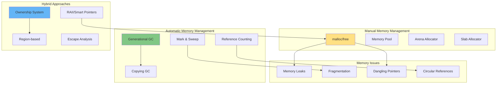
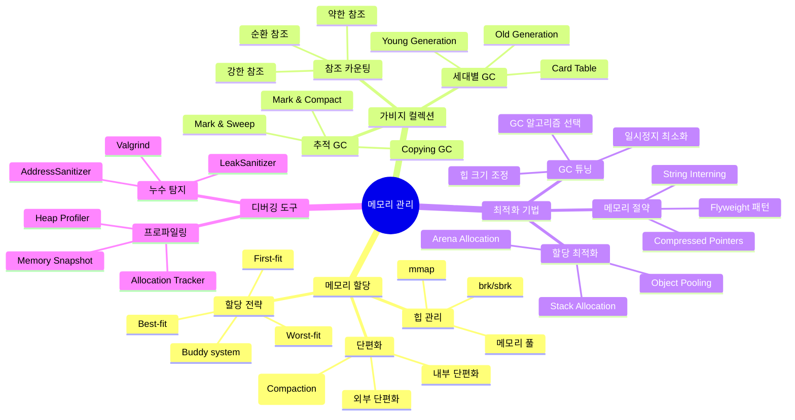
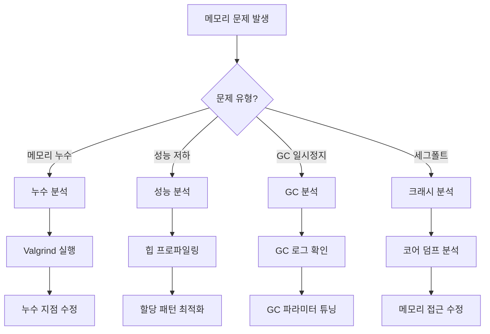

---
tags:
  - Memory
  - GC
  - Performance
  - Guide
  - SystemProgramming
  - Optimization
---

# Chapter 9: 메모리 관리와 가비지 컬렉션 - 자동과 수동의 균형

## 이 장에서 다루는 내용

"메모리가 부족합니다" - 개발자가 가장 두려워하는 메시지 중 하나입니다.

수동 메모리 관리의 복잡함과 자동 가비지 컬렉션의 편리함 사이에서, 현대 프로그래밍 언어들은 각자의 해답을 찾아왔습니다. C의 malloc/free, Java의 G1GC, Go의 concurrent GC, Rust의 소유권 시스템까지.

이 장에서는 메모리 할당자의 내부 구조부터 최신 가비지 컬렉션 알고리즘까지, 메모리 관리의 모든 것을 깊이 있게 탐구합니다. 성능과 안정성의 균형을 찾는 방법을 배웁니다.

## 왜 이것을 알아야 하는가?

### 실무에서 마주치는 메모리 문제들

다음과 같은 상황을 경험해보셨나요?

- 💥 **메모리 누수**: 점점 늘어나는 메모리 사용량
- 🐌 **GC 일시정지**: Stop-the-world로 인한 지연
- 💀 **세그폴트**: 잘못된 메모리 접근으로 인한 크래시
- 🎯 **성능 저하**: 잦은 할당/해제로 인한 오버헤드
- 🔥 **OOM Killer**: 메모리 부족으로 프로세스 강제 종료

이런 문제들의 근본 원인은 메모리 관리 메커니즘에 대한 이해 부족입니다. 이 장을 마스터하면, 메모리 효율적이고 안정적인 시스템을 구현할 수 있습니다.

## 메모리 관리 아키텍처 한눈에 보기



## 이 장의 구성

### [9-1: 메모리 할당자 내부 구조](01-memory-allocator.md)

**"malloc은 어떻게 동작하는가?"**

- 🧱 **힙 메모리 구조**: brk, sbrk, mmap의 역할
- 📦 **할당 전략**: First-fit, Best-fit, Buddy system
- 🔗 **프리 리스트**: 메모리 블록 관리 메커니즘
- 💡 **실전 예제**: 커스텀 메모리 할당자 구현

### [9-2: 가비지 컬렉션 알고리즘](02-gc-algorithms.md)

**"자동 메모리 관리의 마법"**

- 🔍 **Mark & Sweep**: 도달 가능성 분석
- 📋 **Copying GC**: 반공간 복사 알고리즘
- 👶 **Generational GC**: 세대별 수집 전략
- ⚡ **Concurrent GC**: STW 최소화 기법

### [9-3: 언어별 메모리 관리](03-language-gc.md)

**"각 언어의 선택과 트레이드오프"**

- ☕ **Java**: G1GC, ZGC, Shenandoah
- 🐹 **Go**: Tricolor concurrent GC
- 🦀 **Rust**: 소유권과 빌림 검사기
- 🐍 **Python**: Reference counting + cycle detection

### [9-4: 메모리 최적화와 디버깅](04-memory-optimization.md)

**"메모리 문제 해결의 기술"**

- 🔎 **메모리 누수 탐지**: Valgrind, AddressSanitizer
- 📊 **프로파일링**: 힙 분석과 할당 추적
- 🚀 **최적화 기법**: Object pooling, Zero-allocation
- 🛠️ **실전 예제**: 메모리 효율적인 서버 구현

### [9-5: 메모리 누수 탐지](05-memory-leak-detection.md)

**"메모리가 계속 늘어나요"**

- 🔍 **누수 패턴 분석**: 선형/계단식/주기적/급격한 스파이크 증가
- 🛠️ **탐지 도구**: 힙 프로파일링, 객체 추적, GC 로그 분석, 메모리 스냅샷 비교
- ⚠️ **일반적 원인**: 전역 변수 누적, 이벤트 리스너 미해제, 클로저 참조, 캐시 무제한 증가
- 🩺 **진단 방법**: WeakMap/WeakSet 활용, 명시적 해제, 참조 체인 분석
- 📊 **실전 도구**: Chrome DevTools, Node.js --inspect, Java VisualVM, Go pprof

## 실습 환경 준비

이 장의 예제들을 직접 실행해보려면 다음 도구들이 필요합니다:

```bash
# 메모리 디버깅 도구
$ valgrind --leak-check=full ./program
$ gcc -fsanitize=address -g program.c

# 힙 프로파일링
$ pmap -x <pid>              # 프로세스 메모리 맵
$ jmap -heap <pid>           # Java 힙 정보
$ go tool pprof              # Go 메모리 프로파일

# GC 로그 분석
$ java -Xlog:gc* App        # Java GC 로그
$ GODEBUG=gctrace=1 ./app   # Go GC 추적

# 메모리 모니터링
$ htop                       # 메모리 사용량 모니터링
$ vmstat 1                   # 가상 메모리 통계
$ /proc/<pid>/status        # 상세 메모리 정보
```

## 이 장을 읽고 나면

✅ **메모리 할당자 이해**: malloc/free의 내부 동작 원리 파악
✅ **GC 알고리즘 마스터**: 다양한 가비지 컬렉션 전략 이해
✅ **언어별 특성 파악**: 각 언어의 메모리 관리 방식 비교
✅ **메모리 누수 해결**: 디버깅 도구 활용과 문제 진단
✅ **성능 최적화**: 메모리 효율적인 코드 작성 능력

## 핵심 개념 미리보기



## 메모리 문제 진단 플로우차트



## 다음 단계

이제 [9-1: 메모리 할당자 내부 구조](01-memory-allocator.md)부터 시작하여, 메모리 관리의 기초부터 고급 기법까지 단계별로 마스터해봅시다.

메모리는 모든 프로그램의 기반입니다. 효율적인 메모리 관리는 고성능 시스템의 핵심이며, 이 장을 통해 메모리의 깊은 원리를 이해하고 진정한 시스템 프로그래밍 전문가로 거듭나게 될 것입니다.
