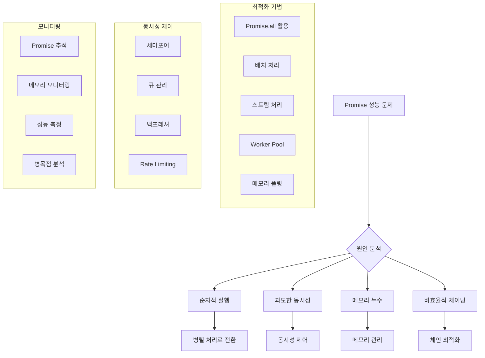

---
tags:
  - async-performance
  - batch-processing
  - concurrency-control
  - hands-on
  - intermediate
  - medium-read
  - memory-management
  - promise-optimization
  - 애플리케이션개발
difficulty: INTERMEDIATE
learning_time: "4-6시간"
main_topic: "애플리케이션 개발"
priority_score: 4
---

# Promise 성능 최적화: "비동기 코드가 느려요" 개요

## 🎯 Promise 성능 문제 해결

"비동기 처리가 많은 Node.js 애플리케이션을 개발 중인데 성능이 기대보다 느립니다. Promise.all을 써도 느리고, async/await을 써도 느려요. 특히 대량의 데이터를 처리할 때 메모리 사용량도 급증합니다."

이런 Promise 성능 문제는 잘못된 비동기 패턴 사용으로 인해 발생하는 경우가 많습니다. 체계적인 최적화가 필요합니다.

## 📚 학습 로드맵

이 섹션은 2개의 전문화된 문서로 구성되어 있습니다:

### 1️⃣ [Promise 성능 분석 도구](./10-45-promise-performance-analysis.md)

C 기반 성능 분석 도구로 정밀한 Promise 성능 측정과 분석을 수행합니다:

- **정밀한 성능 측정**: 고해상도 타이머와 원자적 연산으로 나노초 단위 측정
- **메모리 효율성**: 메모리 풀을 활용한 할당 최적화와 누수 방지
- **동시성 제어**: 세마포어 패턴으로 시스템 리소스 효율적 사용
- **종합적 분석**: 실행 시간, 메모리, 동시성 효율성 종합 분석

### 2️⃣ [JavaScript Promise 최적화 라이브러리](./10-31-promise-optimization-library.md)

실제 프로덕션 환경에서 바로 사용할 수 있는 종합적인 최적화 라이브러리입니다:

- **동시성 제어**: 세마포어 기반 리소스 관리와 백프레셔 제어
- **배치 처리**: 대규모 작업의 효율적인 분할 처리
- **스마트 재시도**: 지수 백오프와 에러 패턴 학습을 통한 재시도 전략
- **스트림 처리**: 메모리 효율적인 대용량 데이터 처리
- **실시간 모니터링**: 메트릭 수집과 성능 분석 리포트 생성

## 🎯 핵심 개념 비교표

| 접근법 | C 분석 도구 | JavaScript 라이브러리 | 주요 차이점 |
|-------|------------|-------------------|-----------|
| **목적** | 정밀한 성능 분석 | 실용적 최적화 | 분석 vs 구현 |
| **정확도** | 나노초 단위 | 밀리초 단위 | 극도의 정밀성 vs 실용성 |
| **사용성** | 분석/디버깅용 | 프로덕션 적용 | 전문가용 vs 개발자용 |
| **메모리 관리** | 메모리 풀링 | GC 힌트 제공 | 저수준 제어 vs 고수준 최적화 |
| **동시성 제어** | 세마포어 구현 | Promise 래핑 | 시스템 수준 vs 애플리케이션 수준 |

## Promise 성능 최적화 전략



## 🚀 실전 활용 시나리오

### 대규모 API 호출 처리

- **문제점**: 수천 개의 API 호출로 인한 성능 저하
- **해결책**: 동시성 제어와 배치 처리로 처리량 최적화
- **도구**: JavaScript 라이브러리의 배치 처리 + C 도구의 성능 분석

### 메모리 집약적 데이터 처리

- **문제점**: 대용량 데이터 처리 시 메모리 부족과 GC 압박
- **해결책**: 스트림 처리와 메모리 풀링으로 효율성 향상
- **도구**: C 도구의 메모리 분석 + JavaScript 스트림 처리

### 실시간 성능 모니터링

- **문제점**: 프로덕션 환경의 성능 저하 원인 파악 어려움
- **해결책**: 실시간 메트릭 수집과 자동화된 성능 리포트
- **도구**: 두 도구의 통합 모니터링 시스템

## 🎭 학습 전략

### 초보자 (추천 순서)

1. [JavaScript Promise 최적화 라이브러리](./10-31-promise-optimization-library.md) → 실용적 구현 학습
2. [Promise 성능 분석 도구](./10-45-promise-performance-analysis.md) → 성능 측정 기초 이해
3. 간단한 API 호출 최적화 실습

### 중급자 (심화 학습)

1. [Promise 성능 분석 도구](./10-45-promise-performance-analysis.md) → 깊이 있는 성능 분석
2. [JavaScript Promise 최적화 라이브러리](./10-31-promise-optimization-library.md) → 고급 패턴 마스터
3. 프로덕션 환경 모니터링 구축

### 고급자 (전문가 수준)

1. 두 도구를 조합한 종합 성능 분석 시스템 구축
2. 커스텀 성능 최적화 솔루션 개발
3. 대규모 시스템의 성능 아키텍처 설계

## 🔗 연관 학습

### 선행 학습

- [Promise와 Future 패턴](./10-10-promise-future.md) - 기본 Promise 패턴 이해
- [이벤트 루프 메커니즘](./10-14-event-loop.md) - 비동기 실행 원리

### 후속 학습  

- [분산 비동기 시스템](./10-18-distributed-async.md) - 마이크로서비스 환경 최적화
- [이벤트 루프 디버깅](./10-42-event-loop-debugging.md) - 성능 이슈 해결

## 📊 성능 최적화 체크리스트

### 🎯 기본 최적화

```bash
✅ Promise.all() 사용으로 병렬 처리
✅ 적절한 동시성 제어 (세마포어 패턴)
✅ 메모리 풀링으로 할당 최적화
✅ 배치 처리로 리소스 효율성 향상
✅ 타임아웃 설정으로 무한 대기 방지
```

### 🔧 고급 최적화

```bash
✅ 백프레셔 제어로 메모리 압박 방지
✅ 스마트 재시도 전략 구현
✅ 스트림 처리로 대용량 데이터 효율 처리
✅ 실시간 성능 모니터링 설정
✅ 자동화된 성능 리포트 생성
```

### ⚠️ 흔한 성능 함정

```bash
❌ 순차적 Promise 체이닝 (병렬 처리 가능한 작업)
❌ 무제한 동시성으로 인한 메모리 폭증
❌ 적절하지 않은 배치 크기 설정
❌ 재시도 로직 부재로 인한 일시적 실패
❌ 성능 모니터링 없이 프로덕션 운영
```

---

**다음**: [Promise 성능 분석 도구](./10-45-promise-performance-analysis.md)에서 C 기반 정밀 성능 측정 도구를 학습합니다.

Promise 성능 최적화를 위한 체계적인 접근법과 실용적인 구현 방법을 종합적으로 다루는 전문 가이드입니다.

## 📚 관련 문서

### 📖 현재 문서 정보

- **난이도**: INTERMEDIATE
- **주제**: 애플리케이션 개발
- **예상 시간**: 4-6시간

### 🎯 학습 경로

- [📚 INTERMEDIATE 레벨 전체 보기](../learning-paths/intermediate/)
- [🏠 메인 학습 경로](../learning-paths/)
- [📋 전체 가이드 목록](../README.md)

### 📂 같은 챕터 (chapter-10-async-programming)

- [8.1 Promise/Future 패턴 개요](./10-10-promise-future.md)
- [8.1a Promise/Future 기본 개념과 구현](./10-01-promise-future-basics.md)
- [8.1b 비동기 연산 조합과 병렬 처리](./10-11-async-composition.md)
- [8.1c 취소와 타임아웃 처리](./10-12-cancellation-timeout.md)
- [8.1d 실행 모델과 스케줄링](./10-13-execution-scheduling.md)

### 🏷️ 관련 키워드

`promise-optimization`, `async-performance`, `concurrency-control`, `memory-management`, `batch-processing`

### ⏭️ 다음 단계 가이드

- 실무 적용을 염두에 두고 프로젝트에 적용해보세요
- 관련 도구들을 직접 사용해보는 것이 중요합니다
