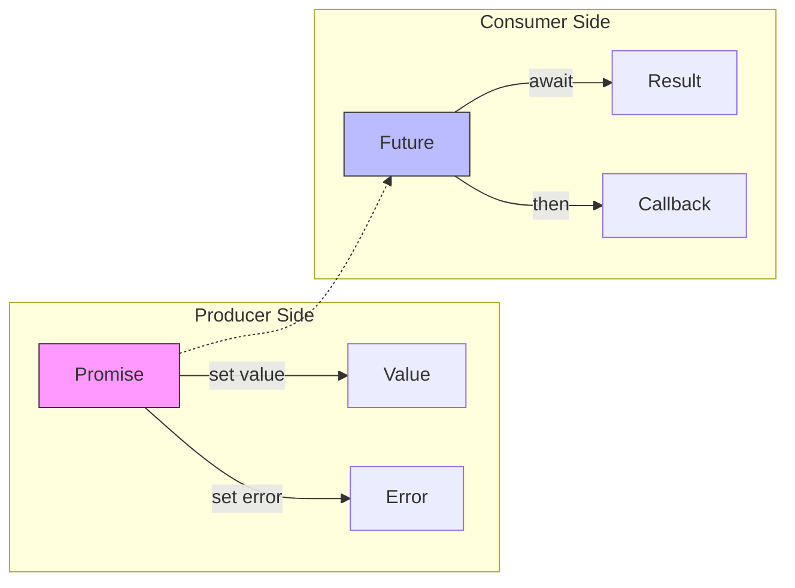

---
tags:
  - Future
  - Promise
  - async
  - concurrency
  - hands-on
  - intermediate
  - medium-read
  - threading
  - 애플리케이션개발
difficulty: INTERMEDIATE
learning_time: "4-6시간"
main_topic: "애플리케이션 개발"
priority_score: 4
---

# 10.1.1: Promise와 Future 기초

## 🎁 비동기의 선물상자: Promise와 Future

2013년, 저는 약속에 늦은 친구를 기다리다 홀로 극장에 들어간 적이 있습니다. "티켓을 나중에 줄게"라는 말만 믿고요. 그날 저는 두 가지를 깨달았습니다:

1.**약속(Promise)**은 미래의 가치를 나타낸다
2.**미래(Future)**는 그 가치를 받을 수 있는 통로다

이것이 바로 비동기 프로그래밍의 핵심입니다!

## 🏭 레스토랑 예약 시스템으로 이해하는 Promise/Future

제가 처음 Promise를 이해한 계기는 레스토랑 예약 시스템을 구현할 때였습니다:

1.**예약 접수**(레스토랑이 Promise를 생성)

- "예약을 받았습니다. 확정되면 알려드릴게요"
- Promise 객체 생성

2.**예약 번호 발급**(고객이 Future를 받음)

- "예약 번호 123번입니다"
- Future 객체 반환

3.**예약 확정**(Promise에 값 설정)

- "테이블이 준비되었습니다"
- promise.set_value()

4.**예약 확인**(Future로 결과 확인)

- 고객이 현장에서 확인
- future.get()

## Promise와 Future의 차이

**실제 프로덕션 코드에서의 차이:**

| 구분 | Promise (생산자) | Future (소비자) |
|------|------------------|------------------|
| 역할 | 값을 설정하는 쪽 | 값을 받는 쪽 |
| 사용처 | 서버, 작업자 | 클라이언트, 대기자 |
| 메서드 | set_value(), set_exception() | get(), wait(), then() |
| 예시 | HTTP 응답 보내기 | HTTP 응답 받기 |

Promise와 Future는 비동기 연산의 결과를 나타내는 프록시 객체입니다:



## C++ Promise/Future 구현

### 🔨 직접 만들어보면서 배우는 Promise/Future

2018년, Facebook의 Folly 라이브러리를 분석하다가 Promise/Future의 진짜 동작 원리를 이해했습니다. 핵심은**공유 상태(SharedState)**입니다!

```cpp
#include <future>
#include <thread>
#include <chrono>
#include <memory>
#include <queue>
#include <functional>

// 커스텀 Promise/Future 구현 - 비동기 프로그래밍의 핵심 메커니즘
template<typename T>
class MyPromise;

template<typename T>
class MyFuture {
private:
    // ⭐ 핵심: SharedState - Promise와 Future 간 공유되는 상태 저장소
    struct SharedState {
        // 🔒 동시성 제어 - 여러 스레드에서 안전한 접근 보장
        std::mutex mutex;                              // 상태 변경 시 mutual exclusion
        std::condition_variable cv;                    // 완료 대기를 위한 조건 변수
        
        // 📊 상태 추적 - 비동기 작업의 현재 상태
        bool ready = false;                            // 값 설정 완료 여부 (핵심 플래그)
        bool has_exception = false;                    // 예외 발생 여부
        
        // 💾 데이터 저장소 - 실제 결과값과 예외 정보
        T value;                                       // 성공 시 결과값
        std::exception_ptr exception;                  // 예외 발생 시 예외 객체
        
        // 🔗 Continuation Chain - 비동기 체이닝을 위한 콜백 큐
        std::vector<std::function<void()>> callbacks;  // 완료 시 실행할 콜백 함수들
    };
    
    // 💡 스마트 포인터 사용 - Promise와 Future 간 안전한 상태 공유
    std::shared_ptr<SharedState> state;
    
public:
    MyFuture(std::shared_ptr<SharedState> s) : state(s) {}
    
    // ⭐ 블로킹 대기 - 비동기 결과를 동기적으로 가져오기
    T get() {
        std::unique_lock<std::mutex> lock(state->mutex);
        
        // 📋 조건 변수로 값 설정 완료까지 대기
        state->cv.wait(lock, [this] { return state->ready; });
        
        // 🚨 예외 처리 - 원격 스레드의 예외를 현재 스레드로 전파
        if (state->has_exception) {
            std::rethrow_exception(state->exception);
        }
        
        return state->value;
    }
    
    // 논블로킹 체크
    bool is_ready() const {
        std::lock_guard<std::mutex> lock(state->mutex);
        return state->ready;
    }
    
    // 타임아웃 대기
    std::future_status wait_for(std::chrono::milliseconds timeout) {
        std::unique_lock<std::mutex> lock(state->mutex);
        if (state->cv.wait_for(lock, timeout, [this] { return state->ready; })) {
            return std::future_status::ready;
        }
        return std::future_status::timeout;
    }
};

template<typename T>
class MyPromise {
private:
    std::shared_ptr<typename MyFuture<T>::SharedState> state;
    std::atomic<bool> value_set{false};
    
public:
    MyPromise() : state(std::make_shared<typename MyFuture<T>::SharedState>()) {}
    
    MyFuture<T> get_future() {
        return MyFuture<T>(state);
    }
    
    void set_value(const T& value) {
        bool expected = false;
        if (!value_set.compare_exchange_strong(expected, true)) {
            throw std::future_error(std::future_errc::promise_already_satisfied);
        }
        
        std::vector<std::function<void()>> callbacks_to_run;
        
        {
            std::lock_guard<std::mutex> lock(state->mutex);
            state->value = value;
            state->ready = true;
            callbacks_to_run = std::move(state->callbacks);
        }
        
        state->cv.notify_all();
        
        // 콜백 실행
        for (auto& callback : callbacks_to_run) {
            callback();
        }
    }
    
    void set_exception(std::exception_ptr e) {
        bool expected = false;
        if (!value_set.compare_exchange_strong(expected, true)) {
            throw std::future_error(std::future_errc::promise_already_satisfied);
        }
        
        std::vector<std::function<void()>> callbacks_to_run;
        
        {
            std::lock_guard<std::mutex> lock(state->mutex);
            state->exception = e;
            state->has_exception = true;
            state->ready = true;
            callbacks_to_run = std::move(state->callbacks);
        }
        
        state->cv.notify_all();
        
        // 콜백 실행
        for (auto& callback : callbacks_to_run) {
            callback();
        }
    }
};
```

## JavaScript Promise 구현

### 🎯 Promise/A+ 스펙을 직접 구현해보기

Promise/A+ 스펙은 Promise의 표준을 정의합니다. 핵심은**상태 전환**과**체이닝**입니다:

```javascript
// Promise/A+ 스펙을 따르는 커스텀 Promise 구현
// 핵심 개념: 상태 기반 설계 + 콜백 체인 + 마이크로태스크
class MyPromise {
    constructor(executor) {
        // ⭐ 상태 관리: Pending → Fulfilled/Rejected (단방향, 불가역)
        this.state = 'pending';     // 'pending' | 'fulfilled' | 'rejected'
        this.value = undefined;     // 성공 값 또는 실패 이유
        
        // 🔗 콜백 체인: .then() 호출로 등록되는 핸들러들
        this.fulfillmentHandlers = [];  // 성공 시 실행할 콜백들
        this.rejectionHandlers = [];    // 실패 시 실행할 콜백들
        
        // 🎯 즉시 실행: executor는 Promise 생성과 동시에 실행
        try {
            executor(this.resolve.bind(this), this.reject.bind(this));
        } catch (error) {
            // 💥 executor 실행 중 동기 예외 발생 시 자동 reject
            this.reject(error);
        }
    }
    
    resolve(value) {
        // ⭐ 상태 불변성: 이미 settled된 Promise는 변경 불가
        if (this.state !== 'pending') return;
        
        // 🔄 Promise 값 처리: thenable 객체 감지 및 플래튼
        if (value && typeof value.then === 'function') {
            // Promise 또는 thenable 객체인 경우 체이닝
            value.then(this.resolve.bind(this), this.reject.bind(this));
            return;
        }
        
        // 📊 상태 전환: pending → fulfilled
        this.state = 'fulfilled';
        this.value = value;
        
        // 🚀 마이크로태스크로 콜백 실행 (비동기 보장)
        queueMicrotask(() => {
            this.fulfillmentHandlers.forEach(handler => {
                try {
                    handler(value);
                } catch (error) {
                    // 핸들러 실행 중 오류는 무시 (스펙 준수)
                    console.error('Handler error:', error);
                }
            });
        });
    }
    
    reject(reason) {
        if (this.state !== 'pending') return;
        
        this.state = 'rejected';
        this.value = reason;
        
        queueMicrotask(() => {
            this.rejectionHandlers.forEach(handler => {
                try {
                    handler(reason);
                } catch (error) {
                    console.error('Rejection handler error:', error);
                }
            });
        });
    }
    
    // ⭐ then 메서드: Promise 체이닝의 핵심 구현
    then(onFulfilled, onRejected) {
        // 🔗 새로운 Promise 반환: 체이닝을 위한 핵심 설계
        return new MyPromise((resolve, reject) => {
            // 📋 핸들러 래핑: 결과를 다음 Promise로 전파
            const handleFulfillment = (value) => {
                try {
                    if (typeof onFulfilled === 'function') {
                        // 🎯 변환 함수 실행: 값 변환 및 체이닝
                        const result = onFulfilled(value);
                        resolve(result);
                    } else {
                        // 🔄 값 전파: 핸들러 없으면 그대로 전달
                        resolve(value);
                    }
                } catch (error) {
                    // 💥 핸들러 실행 중 오류는 reject로 전환
                    reject(error);
                }
            };
            
            const handleRejection = (reason) => {
                try {
                    if (typeof onRejected === 'function') {
                        // 🛡️ 에러 복구: rejection handler로 에러 처리
                        const result = onRejected(reason);
                        resolve(result);  // 복구 성공 시 fulfilled로 전환
                    } else {
                        // 🚨 에러 전파: 핸들러 없으면 rejection 그대로 전달
                        reject(reason);
                    }
                } catch (error) {
                    reject(error);
                }
            };
            
            // ⭐ 상태별 처리 분기
            if (this.state === 'fulfilled') {
                // 이미 완료된 Promise: 즉시 실행 (마이크로태스크로)
                queueMicrotask(() => handleFulfillment(this.value));
            } else if (this.state === 'rejected') {
                // 이미 실패한 Promise: 즉시 실행
                queueMicrotask(() => handleRejection(this.value));
            } else {
                // 아직 pending: 콜백 등록으로 지연 실행
                this.fulfillmentHandlers.push(handleFulfillment);
                this.rejectionHandlers.push(handleRejection);
            }
        });
    }
    
    // catch는 then(undefined, onRejected)의 편의 메서드
    catch(onRejected) {
        return this.then(undefined, onRejected);
    }
}
```

### 사용 예제

```javascript
// 기본 사용법
const promise1 = new MyPromise((resolve, reject) => {
    setTimeout(() => resolve('Hello'), 1000);
});

promise1
    .then(value => {
        console.log(value); // "Hello"
        return value + ' World';
    })
    .then(value => {
        console.log(value); // "Hello World"
    })
    .catch(error => {
        console.error(error);
    });

// 에러 처리
const promise2 = new MyPromise((resolve, reject) => {
    setTimeout(() => reject(new Error('Something went wrong')), 500);
});

promise2
    .then(value => {
        console.log('Success:', value);
    })
    .catch(error => {
        console.error('Error:', error.message);
    });
```

## 핵심 요점

### 1. 공유 상태가 핵심이다

Promise와 Future는 공유 상태(SharedState)를 통해 스레드 간 안전하게 데이터를 전달한다.

### 2. 상태 전환은 불가역적이다

Pending → Fulfilled/Rejected로의 전환은 한 번만 가능하며, 다시 되돌릴 수 없다.

### 3. 콜백 체인으로 비동기 조합을 구현한다

then() 메서드가 새로운 Promise를 반환함으로써 무한한 체이닝이 가능하다.

---

**다음**: [8.1b 비동기 연산 조합](./10-02-02-async-composition.md)에서 Promise.all, race 등의 조합 패턴을 학습합니다.

## 📚 관련 문서

### 📖 현재 문서 정보

-**난이도**: INTERMEDIATE
-**주제**: 애플리케이션 개발
-**예상 시간**: 4-6시간

### 🎯 학습 경로

- [📚 INTERMEDIATE 레벨 전체 보기](../learning-paths/intermediate/)
- [🏠 메인 학습 경로](../learning-paths/)
- [📋 전체 가이드 목록](../README.md)

### 📂 같은 챕터 (chapter-10-async-programming)

- [8.1 Promise/Future 패턴 개요](./10-02-01-promise-future.md)
- [8.1b 비동기 연산 조합과 병렬 처리](./10-02-02-async-composition.md)
- [8.1c 취소와 타임아웃 처리](./10-02-03-cancellation-timeout.md)
- [8.1d 실행 모델과 스케줄링](./10-02-04-execution-scheduling.md)
- [8.1e 에러 처리 패턴](./10-05-01-error-handling.md)

### 🏷️ 관련 키워드

`Promise`, `Future`, `async`, `concurrency`, `threading`

### ⏭️ 다음 단계 가이드

- 실무 적용을 염두에 두고 프로젝트에 적용해보세요
- 관련 도구들을 직접 사용해보는 것이 중요합니다
