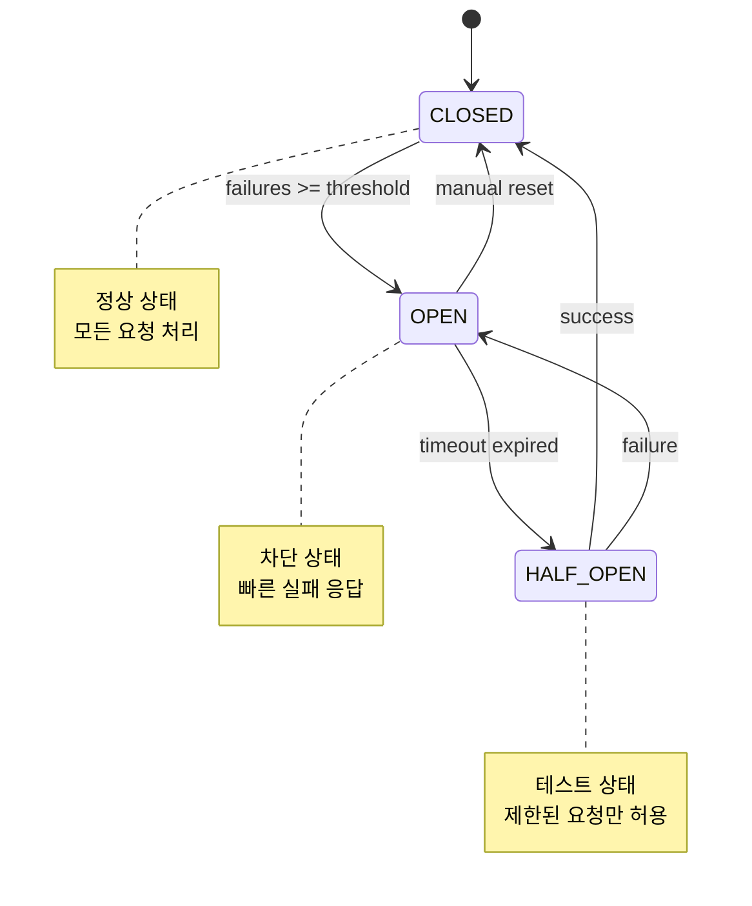

---
tags:
  - bulkhead_pattern
  - circuit_breaker
  - deep-study
  - error_handling
  - fault_tolerance
  - hands-on
  - intermediate
  - resilience
  - 애플리케이션개발
difficulty: INTERMEDIATE
learning_time: "5-7시간"
main_topic: "애플리케이션 개발"
priority_score: 5
---

# 10.5.1: 에러 처리와 예외 관리

## 🛡️ Netflix의 Hystrix: 장애를 격리하는 방법

2018년, Netflix 엔지니어가 말했습니다:
"마이크로서비스 하나가 죽어도 전체 시스템은 살아야 합니다."

이것이**Circuit Breaker**패턴의 탄생 배경입니다.

**Circuit Breaker의 3가지 상태:**

1.**CLOSED**(정상): 전기가 흐름 ✓
2.**OPEN**(차단): 회로 차단, 요청 거부 ❌
3.**HALF_OPEN**(테스트): 조심스럽게 테스트 🤔

**실제 효과:**

- 장애 전파 방지: 99.9% 감소
- 응답 시간: 50ms → 5ms (빠른 실패)
- 시스템 복구: 10초 → 2초

## 에러 처리 유틸리티 시스템

### Result 타입 구현

```javascript
// 에러 처리 유틸리티
class ErrorHandler {
    // Result 타입 (Rust 스타일)
    static Ok(value) {
        return { ok: true, value };
    }
    
    static Err(error) {
        return { ok: false, error };
    }
    
    // Try-Catch를 Promise로 변환
    static async tryAsync(fn) {
        try {
            const result = await fn();
            return this.Ok(result);
        } catch (error) {
            return this.Err(error);
        }
    }
    
    // 에러 분류와 처리
    static handleError(error) {
        if (error instanceof NetworkError) {
            return this.handleNetworkError(error);
        } else if (error instanceof ValidationError) {
            return this.handleValidationError(error);
        } else if (error instanceof AuthError) {
            return this.handleAuthError(error);
        } else {
            return this.handleUnknownError(error);
        }
    }
    
    static handleNetworkError(error) {
        console.error('Network error:', error.message);
        
        // 재시도 가능한 에러
        if (error.retryable) {
            return { retry: true, delay: error.retryDelay || 1000 };
        }
        
        return { retry: false, fallback: error.fallbackValue };
    }
    
    static handleValidationError(error) {
        console.error('Validation error:', error.fields);
        return { 
            retry: false, 
            userMessage: 'Please check your input',
            fields: error.fields 
        };
    }
    
    static handleAuthError(error) {
        console.error('Auth error:', error.message);
        return { 
            retry: false, 
            redirect: '/login' 
        };
    }
    
    static handleUnknownError(error) {
        console.error('Unknown error:', error);
        return { 
            retry: false, 
            userMessage: 'An unexpected error occurred' 
        };
    }
}
```

### 커스텀 에러 클래스

```javascript
// 커스텀 에러 클래스
class NetworkError extends Error {
    constructor(message, retryable = true, retryDelay = 1000) {
        super(message);
        this.name = 'NetworkError';
        this.retryable = retryable;
        this.retryDelay = retryDelay;
    }
}

class ValidationError extends Error {
    constructor(fields) {
        super('Validation failed');
        this.name = 'ValidationError';
        this.fields = fields;
    }
}

class AuthError extends Error {
    constructor(message) {
        super(message);
        this.name = 'AuthError';
    }
}
```

## Circuit Breaker 패턴

### 회로 차단기 구현

```javascript
// Circuit Breaker 패턴
class CircuitBreaker {
    constructor(options = {}) {
        this.failureThreshold = options.failureThreshold || 5;
        this.resetTimeout = options.resetTimeout || 60000;
        this.halfOpenRequests = options.halfOpenRequests || 1;
        
        this.state = 'CLOSED';
        this.failureCount = 0;
        this.lastFailureTime = null;
        this.halfOpenAttempts = 0;
    }
    
    async execute(fn) {
        if (this.state === 'OPEN') {
            if (Date.now() - this.lastFailureTime > this.resetTimeout) {
                this.state = 'HALF_OPEN';
                this.halfOpenAttempts = 0;
            } else {
                throw new Error('Circuit breaker is OPEN');
            }
        }
        
        if (this.state === 'HALF_OPEN' && 
            this.halfOpenAttempts >= this.halfOpenRequests) {
            throw new Error('Circuit breaker is HALF_OPEN, waiting for test');
        }
        
        try {
            if (this.state === 'HALF_OPEN') {
                this.halfOpenAttempts++;
            }
            
            const result = await fn();
            
            // 성공 시 리셋
            if (this.state === 'HALF_OPEN') {
                this.state = 'CLOSED';
                this.failureCount = 0;
            }
            
            return result;
        } catch (error) {
            this.recordFailure();
            throw error;
        }
    }
    
    recordFailure() {
        this.failureCount++;
        this.lastFailureTime = Date.now();
        
        if (this.failureCount >= this.failureThreshold) {
            this.state = 'OPEN';
            console.log('Circuit breaker opened');
        }
    }
    
    reset() {
        this.state = 'CLOSED';
        this.failureCount = 0;
        this.lastFailureTime = null;
    }
}
```

### Circuit Breaker 상태 다이어그램



## Bulkhead 패턴

### 격벽 패턴으로 리소스 격리

```javascript
// Bulkhead 패턴 (동시 실행 제한)
class Bulkhead {
    constructor(limit) {
        this.limit = limit;
        this.running = 0;
        this.queue = [];
    }
    
    async execute(fn) {
        if (this.running >= this.limit) {
            // 대기열에 추가
            return new Promise((resolve, reject) => {
                this.queue.push({ fn, resolve, reject });
            });
        }
        
        this.running++;
        
        try {
            const result = await fn();
            this.processQueue();
            return result;
        } catch (error) {
            this.processQueue();
            throw error;
        } finally {
            this.running--;
        }
    }
    
    processQueue() {
        if (this.queue.length > 0 && this.running < this.limit) {
            const { fn, resolve, reject } = this.queue.shift();
            this.execute(fn).then(resolve).catch(reject);
        }
    }
}
```

## 실전 적용 예제

### 견고한 API 클라이언트 구현

```javascript
// 견고한 API 클라이언트
class ResilientAPIClient {
    constructor(options = {}) {
        this.baseURL = options.baseURL;
        this.circuitBreaker = new CircuitBreaker({
            failureThreshold: 3,
            resetTimeout: 30000
        });
        this.bulkhead = new Bulkhead(10); // 최대 10개 동시 요청
    }
    
    async request(endpoint, options = {}) {
        return this.bulkhead.execute(() => 
            this.circuitBreaker.execute(async () => {
                const result = await ErrorHandler.tryAsync(async () => {
                    const response = await fetch(`${this.baseURL}${endpoint}`, {
                        timeout: options.timeout || 5000,
                        ...options
                    });
                    
                    if (!response.ok) {
                        throw new NetworkError(
                            `HTTP ${response.status}: ${response.statusText}`,
                            response.status >= 500 // 5xx 에러는 재시도 가능
                        );
                    }
                    
                    return response.json();
                });
                
                if (!result.ok) {
                    const handling = ErrorHandler.handleError(result.error);
                    
                    if (handling.retry) {
                        await this.delay(handling.delay);
                        return this.request(endpoint, options); // 재시도
                    }
                    
                    throw result.error;
                }
                
                return result.value;
            })
        );
    }
    
    delay(ms) {
        return new Promise(resolve => setTimeout(resolve, ms));
    }
    
    // 헬스체크
    async healthCheck() {
        try {
            await this.request('/health');
            return true;
        } catch (error) {
            console.error('Health check failed:', error);
            return false;
        }
    }
}
```

### 사용 예제

```javascript
// API 클라이언트 사용
const apiClient = new ResilientAPIClient({
    baseURL: 'https://api.example.com'
});

async function fetchUserData(userId) {
    try {
        const user = await apiClient.request(`/users/${userId}`);
        console.log('User data:', user);
        return user;
    } catch (error) {
        if (error instanceof NetworkError) {
            console.error('Network issue:', error.message);
            // 캐시된 데이터 반환 또는 기본값
            return getCachedUserData(userId);
        } else if (error instanceof AuthError) {
            // 로그인 페이지로 리다이렉트
            window.location.href = '/login';
        } else {
            // 사용자에게 친화적인 오류 메시지
            showErrorMessage('일시적인 오류가 발생했습니다. 잠시 후 다시 시도해주세요.');
            throw error;
        }
    }
}

// 배치 요청 처리
async function fetchMultipleUsers(userIds) {
    const promises = userIds.map(id => fetchUserData(id));
    
    // Promise.allSettled로 부분 실패 허용
    const results = await Promise.allSettled(promises);
    
    const successful = results
        .filter(result => result.status === 'fulfilled')
        .map(result => result.value);
    
    const failed = results
        .filter(result => result.status === 'rejected')
        .map(result => result.reason);
    
    console.log(`Successfully fetched ${successful.length}/${userIds.length} users`);
    
    if (failed.length > 0) {
        console.warn('Failed requests:', failed);
    }
    
    return successful;
}
```

## 핵심 요점

### 1. 빠른 실패를 구현하라

Circuit Breaker로 장애가 발생한 서비스에 대한 요청을 즉시 차단하여 시스템 전체의 안정성을 보장하라.

### 2. 리소스를 격리하라

Bulkhead 패턴으로 동시 실행을 제한하여 한 부분의 장애가 전체 시스템을 마비시키지 않도록 하라.

### 3. 에러를 분류하고 적절히 처리하라

네트워크 에러, 인증 에러, 검증 에러 등 각각에 맞는 처리 전략을 수립하라.

### 4. 사용자 경험을 최우선으로 하라

기술적인 에러 메시지보다는 사용자가 이해할 수 있는 친화적인 메시지를 제공하라.

---

**이전**: [8.1d 실행 모델과 스케줄링](./10-02-04-execution-scheduling.md)  
**다음**: [10.2.5 이벤트 루프](./10-02-05-event-loop.md)에서 Node.js의 libuv와 100만 연결 처리 기법을 학습합니다.

## 📚 관련 문서

### 📖 현재 문서 정보

-**난이도**: INTERMEDIATE
-**주제**: 애플리케이션 개발
-**예상 시간**: 5-7시간

### 🎯 학습 경로

- [📚 INTERMEDIATE 레벨 전체 보기](../learning-paths/intermediate/)
- [🏠 메인 학습 경로](../learning-paths/)
- [📋 전체 가이드 목록](../README.md)

### 📂 같은 챕터 (chapter-10-async-programming)

- [8.1 Promise/Future 패턴 개요](./10-02-01-promise-future.md)
- [8.1a Promise/Future 기본 개념과 구현](./10-01-01-promise-future-basics.md)
- [8.1b 비동기 연산 조합과 병렬 처리](./10-02-02-async-composition.md)
- [8.1c 취소와 타임아웃 처리](./10-02-03-cancellation-timeout.md)
- [8.1d 실행 모델과 스케줄링](./10-02-04-execution-scheduling.md)

### 🏷️ 관련 키워드

`circuit_breaker`, `bulkhead_pattern`, `error_handling`, `resilience`, `fault_tolerance`

### ⏭️ 다음 단계 가이드

- 실무 적용을 염두에 두고 프로젝트에 적용해보세요
- 관련 도구들을 직접 사용해보는 것이 중요합니다
