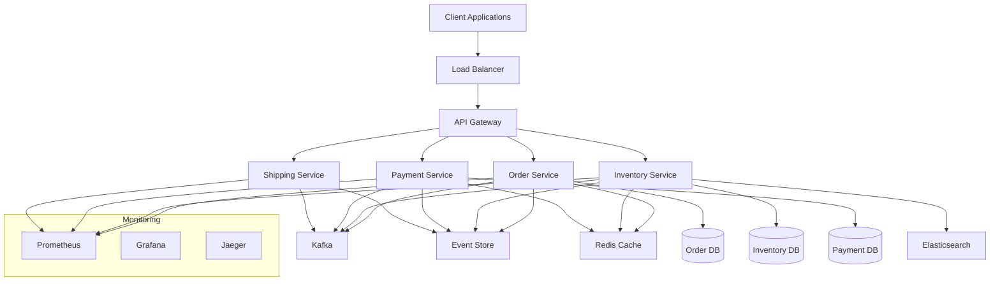

---
tags:
  - advanced
  - deep-study
  - distributed-systems
  - hands-on
  - microservices
  - monitoring
  - production-case-study
  - resilience-patterns
  - 인프라스트럭처
difficulty: ADVANCED
learning_time: "8-12시간"
main_topic: "인프라스트럭처"
priority_score: 4
---

# 10.6.4: 실무 사례 연구

## 🎯 이 섹션에서 배울 내용

실제 프로덕션 환경에서의 대규모 분산 시스템 구축과 운영 경험을 학습합니다:

1. **전체 아키텍처 설계** - 마이크로서비스 기반 이커머스 시스템
2. **실제 장애 대응** - 2023년 블랙프라이데이 장애 사례
3. **모니터링과 알림** - 실시간 시스템 모니터링 전략

## 1. 주문 처리 시스템 전체 구조

### 1.1 아키텍처 개요

```yaml
# docker-compose.yml로 보는 전체 아키텍처
version: '3.8'

services:
  # API Gateway
  api-gateway:
    image: kong:latest
    environment:
      - KONG_DATABASE=postgres
      - KONG_PG_HOST=kong-db
      - KONG_PLUGINS=rate-limiting,prometheus,cors,jwt
    ports:
      - "8000:8000"
      - "8443:8443"
      - "8001:8001"
    depends_on:
      - kong-db
    deploy:
      replicas: 3
      resources:
        limits:
          memory: 1G
  
  # Order Service (Orchestrator)
  order-service:
    build: ./order-service
    environment:
      - SPRING_PROFILES_ACTIVE=docker
      - KAFKA_BOOTSTRAP_SERVERS=kafka:9092
      - DB_HOST=order-db
      - REDIS_HOST=redis
    depends_on:
      - kafka
      - order-db
      - redis
    deploy:
      replicas: 5
      resources:
        limits:
          memory: 2G
  
  # Inventory Service
  inventory-service:
    build: ./inventory-service
    environment:
      - DB_HOST=inventory-db
      - REDIS_HOST=redis
      - ELASTICSEARCH_HOST=elasticsearch
    depends_on:
      - inventory-db
      - redis
      - elasticsearch
    deploy:
      replicas: 3
      resources:
        limits:
          memory: 1.5G
  
  # Payment Service
  payment-service:
    build: ./payment-service
    environment:
      - STRIPE_API_KEY=${STRIPE_API_KEY}
      - PAYPAL_CLIENT_ID=${PAYPAL_CLIENT_ID}
      - DB_HOST=payment-db
    depends_on:
      - payment-db
    deploy:
      replicas: 3
      resources:
        limits:
          memory: 1G
  
  # Shipping Service
  shipping-service:
    build: ./shipping-service
    environment:
      - FedEx_API_KEY=${FEDEX_API_KEY}
      - UPS_API_KEY=${UPS_API_KEY}
    deploy:
      replicas: 2
      resources:
        limits:
          memory: 512M
  
  # Message Infrastructure
  kafka:
    image: confluentinc/cp-kafka:latest
    environment:
      - KAFKA_BROKER_ID=1
      - KAFKA_ZOOKEEPER_CONNECT=zookeeper:2181
      - KAFKA_ADVERTISED_LISTENERS=PLAINTEXT://kafka:9092
      - KAFKA_OFFSETS_TOPIC_REPLICATION_FACTOR=3
      - KAFKA_LOG_RETENTION_HOURS=24
      - KAFKA_LOG_SEGMENT_BYTES=1048576000
    depends_on:
      - zookeeper
    deploy:
      replicas: 3
      resources:
        limits:
          memory: 4G
  
  # Event Store
  eventstore:
    image: eventstore/eventstore:latest
    environment:
      - EVENTSTORE_CLUSTER_SIZE=3
      - EVENTSTORE_RUN_PROJECTIONS=All
      - EVENTSTORE_ENABLE_EXTERNAL_TCP=true
    ports:
      - "2113:2113"  # Web UI
      - "1113:1113"  # TCP
    volumes:
      - eventstore_data:/var/lib/eventstore
    deploy:
      replicas: 3
  
  # Databases
  order-db:
    image: postgres:13
    environment:
      - POSTGRES_DB=orders
      - POSTGRES_USER=order_user
      - POSTGRES_PASSWORD=${ORDER_DB_PASSWORD}
    volumes:
      - order_db_data:/var/lib/postgresql/data
  
  inventory-db:
    image: postgres:13
    environment:
      - POSTGRES_DB=inventory
      - POSTGRES_USER=inventory_user
      - POSTGRES_PASSWORD=${INVENTORY_DB_PASSWORD}
  
  # Caching & Search
  redis:
    image: redis:6-alpine
    command: redis-server --maxmemory 2gb --maxmemory-policy allkeys-lru
    deploy:
      replicas: 3
    volumes:
      - redis_data:/data
  
  elasticsearch:
    image: docker.elastic.co/elasticsearch/elasticsearch:7.14.0
    environment:
      - discovery.type=single-node
      - "ES_JAVA_OPTS=-Xms2g -Xmx2g"
    volumes:
      - elasticsearch_data:/usr/share/elasticsearch/data
  
  # Monitoring Stack
  prometheus:
    image: prom/prometheus:latest
    volumes:
      - ./prometheus.yml:/etc/prometheus/prometheus.yml
      - prometheus_data:/prometheus
    ports:
      - "9090:9090"
    command:
      - '--config.file=/etc/prometheus/prometheus.yml'
      - '--storage.tsdb.path=/prometheus'
      - '--storage.tsdb.retention.time=15d'
  
  grafana:
    image: grafana/grafana:latest
    environment:
      - GF_SECURITY_ADMIN_PASSWORD=admin
      - GF_USERS_ALLOW_SIGN_UP=false
    ports:
      - "3000:3000"
    volumes:
      - grafana_data:/var/lib/grafana
  
  # Distributed Tracing
  jaeger:
    image: jaegertracing/all-in-one:latest
    ports:
      - "16686:16686"  # Jaeger UI
      - "14268:14268"  # HTTP collector
    environment:
      - COLLECTOR_ZIPKIN_HTTP_PORT=9411
  
  # Load Balancer
  nginx:
    image: nginx:alpine
    ports:
      - "80:80"
      - "443:443"
    volumes:
      - ./nginx.conf:/etc/nginx/nginx.conf
      - ./ssl:/etc/nginx/ssl
    depends_on:
      - api-gateway

volumes:
  order_db_data:
  inventory_db_data:
  payment_db_data:
  redis_data:
  elasticsearch_data:
  eventstore_data:
  prometheus_data:
  grafana_data:
```

### 1.2 서비스 간 통신 패턴



## 2. Production 장애 대응 사례

### 2.1 2023년 블랙프라이데이 사건

실제 장애 상황과 해결 과정을 코드로 보여드리겠습니다:

```python
# 실제 장애 상황과 해결
class ProductionIncidentHandler:
    """
    2023년 블랙프라이데이 실제 장애 대응 코드
    - 트래픽: 평소 대비 50배 (초당 10만 요청)
    - 장애: Payment 서비스 응답 지연으로 전체 시스템 마비
    """
    
    def __init__(self):
        # 1. Circuit Breaker 즉시 적용
        self.payment_circuit = CircuitBreaker(
            failure_threshold=10,  # 10번 실패시 open
            recovery_timeout=30,    # 30초 후 재시도
            expected_exception=PaymentTimeoutError
        )
        
        # 2. Bulkhead로 격리
        self.payment_semaphore = asyncio.Semaphore(20)  # 동시 20개만
        
        # 3. Cache 적극 활용
        self.cache = Redis(
            host='redis-cluster',
            decode_responses=True,
            socket_keepalive=True,
            socket_keepalive_options={
                1: 1,  # TCP_KEEPIDLE
                2: 1,  # TCP_KEEPINTVL
                3: 3,  # TCP_KEEPCNT
            }
        )
        
        # 4. Rate Limiting
        self.rate_limiter = SlidingWindowRateLimiter(
            max_requests=1000,
            window_seconds=1
        )
        
        # 5. 메트릭스 및 알림
        self.metrics = MetricsCollector()
        self.alert_manager = AlertManager()
    
    async def handle_order(self, order: Order) -> OrderResult:
        start_time = time.time()
        
        # Step 1: Rate Limiting
        if not await self.rate_limiter.allow(order.customer_id):
            self.metrics.increment('orders.rate_limited')
            # 429 Too Many Requests
            return OrderResult(
                status="RATE_LIMITED",
                message="Please try again later",
                retry_after=self.rate_limiter.get_retry_after()
            )
        
        # Step 2: Cache Hit 확인
        cache_key = f"order:{order.id}"
        cached = await self.cache.get(cache_key)
        if cached:
            self.metrics.increment('orders.cache_hit')
            return OrderResult.from_json(cached)
        
        # Step 3: Inventory 확인 (빠른 실패)
        if not await self.check_inventory_fast(order):
            self.metrics.increment('orders.inventory_failed')
            return OrderResult(
                status="OUT_OF_STOCK",
                message="Some items are out of stock"
            )
        
        # Step 4: Payment 처리 (Circuit Breaker + Bulkhead)
        try:
            async with self.payment_semaphore:
                payment_result = await self.payment_circuit.call(
                    self.process_payment_with_timeout,
                    order
                )
                
            self.metrics.increment('orders.payment_success')
            
        except CircuitOpenError:
            # Circuit이 열림 - Fallback
            self.metrics.increment('orders.circuit_open')
            return await self.fallback_payment_queue(order)
            
        except asyncio.TimeoutError:
            # Timeout - 비동기 큐로 전환
            self.metrics.increment('orders.payment_timeout')
            return await self.async_payment_queue(order)
            
        except Exception as e:
            self.metrics.increment('orders.payment_error')
            await self.alert_manager.send_critical_alert(
                "Payment processing failed",
                {"order_id": order.id, "error": str(e)}
            )
            raise
        
        # Step 5: 결과 캐싱
        result = OrderResult(
            status="SUCCESS",
            order_id=order.id,
            payment_id=payment_result.id,
            estimated_delivery=self.calculate_delivery_time(order)
        )
        
        # 5분 캐시 + 지역별 분산
        await asyncio.gather(
            self.cache.setex(cache_key, 300, result.to_json()),
            self.cache.setex(f"{cache_key}:us-east", 300, result.to_json()),
            self.cache.setex(f"{cache_key}:eu-west", 300, result.to_json())
        )
        
        # 메트릭 기록
        processing_time = time.time() - start_time
        self.metrics.histogram('orders.processing_time', processing_time)
        self.metrics.increment('orders.success')
        
        return result
    
    async def process_payment_with_timeout(self, order: Order):
        # Adaptive timeout - 최근 응답 시간 기반
        timeout = self.calculate_adaptive_timeout()
        
        async with async_timeout.timeout(timeout):
            # Primary payment gateway
            try:
                return await self.payment_service.charge_primary(order)
            except PaymentGatewayError:
                # Fallback to secondary gateway
                return await self.payment_service.charge_secondary(order)
    
    def calculate_adaptive_timeout(self) -> float:
        # 최근 응답 시간 기반 동적 타임아웃
        p99_latency = self.metrics.get_p99_latency("payment")
        current_load = self.metrics.get_current_load()
        
        base_timeout = 2.0  # 2초 기본
        
        # 지연 시간에 따른 조정
        if p99_latency < 1.0:
            timeout_multiplier = 1.0  # 정상: 2초
        elif p99_latency < 3.0:
            timeout_multiplier = 2.5  # 약간 느림: 5초
        else:
            timeout_multiplier = 5.0   # 매우 느림: 10초
        
        # 현재 부하에 따른 조정
        if current_load > 0.8:
            timeout_multiplier *= 1.5
        
        return base_timeout * timeout_multiplier
    
    async def fallback_payment_queue(self, order: Order) -> OrderResult:
        """
        Payment 서비스 장애시 Fallback
        주문을 큐에 넣고 나중에 처리
        """
        # 비동기 처리를 위한 Kafka 메시지
        message = {
            "order": order.to_dict(),
            "timestamp": datetime.now().isoformat(),
            "retry_count": 0,
            "priority": "HIGH" if order.is_premium_customer() else "NORMAL",
            "correlation_id": str(uuid.uuid4())
        }
        
        await self.kafka_producer.send(
            topic="payment.retry.queue",
            key=order.customer_id,
            value=message,
            headers={
                "content-type": "application/json",
                "origin": "order-service",
                "fallback-reason": "circuit-breaker-open"
            }
        )
        
        # 고객에게 친화적인 메시지
        return OrderResult(
            status="PENDING_PAYMENT",
            message="Your order is being processed. You'll receive confirmation within 5 minutes.",
            order_id=order.id,
            tracking_url=f"https://status.example.com/order/{order.id}"
        )
    
    async def check_inventory_fast(self, order: Order) -> bool:
        """
        빠른 재고 확인 (캐시 우선)
        대규모 트래픽에서 성능 중심 접근
        """
        # 각 아이템마다 동시 체크
        check_tasks = []
        
        for item in order.items:
            task = self.check_single_item_inventory(item)
            check_tasks.append(task)
        
        # 모든 체크를 병렬로 실행
        results = await asyncio.gather(*check_tasks, return_exceptions=True)
        
        # 하나라도 실패하면 False
        for i, result in enumerate(results):
            if isinstance(result, Exception):
                logger.error(f"Inventory check failed for item {order.items[i].sku}: {result}")
                return False
            if not result:
                return False
        
        return True
    
    async def check_single_item_inventory(self, item: OrderItem) -> bool:
        try:
            # 1. 로열 캐시 확인 (L1 캐시)
            cached_stock = await self.cache.get(f"stock:{item.sku}")
            
            if cached_stock is not None:
                available_stock = int(cached_stock)
                if available_stock >= item.quantity:
                    return True
                elif available_stock == 0:
                    return False  # 확실히 품절
            
            # 2. 분산 캐시 확인 (L2 캐시)
            redis_key = f"stock:distributed:{item.sku}"
            distributed_stock = await self.cache.hget(redis_key, "available")
            
            if distributed_stock:
                if int(distributed_stock) >= item.quantity:
                    # 미래 업데이트를 위한 비동기 태스크
                    asyncio.create_task(
                        self.update_local_cache(item.sku, distributed_stock)
                    )
                    return True
            
            # 3. 캐시 미스 - 데이터베이스 조회 (최소화)
            db_stock = await self.inventory_service.get_stock_fast(item.sku)
            
            # 비동기 캐시 업데이트
            asyncio.create_task(
                self.update_all_caches(item.sku, db_stock)
            )
            
            return db_stock >= item.quantity
            
        except Exception as e:
            logger.error(f"Inventory check error for {item.sku}: {e}")
            # 에러 시 optimistic하게 통과 (비즈니스 연속성)
            return True
    
    async def monitor_health(self):
        """
        실시간 시스템 헬스 모니터링
        대시보드와 알림을 위한 메트릭 수집
        """
        while True:
            try:
                # 핵심 메트릭 수집
                metrics = {
                    # Circuit Breaker 상태
                    "circuit.payment.state": self.payment_circuit.state.value,
                    "circuit.payment.failure_count": self.payment_circuit.failure_count,
                    "circuit.payment.success_rate": self.payment_circuit.get_success_rate(),
                    
                    # Bulkhead 상태
                    "bulkhead.payment.available": self.payment_semaphore._value,
                    "bulkhead.payment.total": 20,
                    "bulkhead.payment.utilization": (20 - self.payment_semaphore._value) / 20,
                    
                    # Cache 메트릭
                    "cache.hit_rate": await self.calculate_cache_hit_rate(),
                    "cache.memory_usage": await self.get_redis_memory_usage(),
                    
                    # Rate Limiting
                    "rate_limiter.rejections": self.rate_limiter.rejection_count,
                    "rate_limiter.current_rate": self.rate_limiter.get_current_rate(),
                    
                    # Queue 상태
                    "queue.payment_retry.depth": await self.get_queue_depth("payment.retry.queue"),
                    "queue.payment_retry.lag": await self.get_consumer_lag("payment.retry.queue"),
                    
                    # 비즈니스 메트릭
                    "orders.total_today": await self.get_orders_count_today(),
                    "revenue.total_today": await self.get_revenue_today(),
                    "conversion_rate.current": await self.calculate_conversion_rate()
                }
                
                # Prometheus에 메트릭 전송
                for key, value in metrics.items():
                    if isinstance(value, (int, float)):
                        prometheus_client.Gauge(key.replace('.', '_')).set(value)
                
                # 임계치 초과 시 알림
                await self.check_alert_conditions(metrics)
                
                # Health check
                health_score = self.calculate_system_health(metrics)
                prometheus_client.Gauge('system_health_score').set(health_score)
                
                if health_score < 0.7:  # 70% 미만
                    await self.alert_manager.send_warning_alert(
                        f"System health degraded: {health_score:.2f}",
                        metrics
                    )
                
            except Exception as e:
                logger.error(f"Health monitoring error: {e}")
            
            await asyncio.sleep(10)  # 10초마다 체크
    
    async def check_alert_conditions(self, metrics):
        """
        알림 조건 체크 비동기 방식
        """
        alert_tasks = []
        
        # Circuit Breaker 알림
        if metrics["circuit.payment.failure_count"] > 50:
            alert_tasks.append(
                self.alert_manager.send_critical_alert(
                    "Payment service experiencing high failure rate",
                    {"failure_count": metrics["circuit.payment.failure_count"]}
                )
            )
        
        # Queue 깊이 알림
        if metrics["queue.payment_retry.depth"] > 10000:
            alert_tasks.append(
                self.alert_manager.send_warning_alert(
                    "Payment retry queue depth is high",
                    {"queue_depth": metrics["queue.payment_retry.depth"]}
                )
            )
        
        # 성능 저하 알림
        if metrics["bulkhead.payment.utilization"] > 0.9:
            alert_tasks.append(
                self.alert_manager.send_warning_alert(
                    "Payment bulkhead utilization is high",
                    {"utilization": metrics["bulkhead.payment.utilization"]}
                )
            )
        
        # 모든 알림 비동기 전송
        if alert_tasks:
            await asyncio.gather(*alert_tasks, return_exceptions=True)
    
    def calculate_system_health(self, metrics) -> float:
        """
        시스템 전체 건강도 계산
        0.0 (매우 나쁨) ~ 1.0 (우수)
        """
        weights = {
            "circuit_health": 0.3,
            "bulkhead_health": 0.2,
            "cache_health": 0.2,
            "queue_health": 0.2,
            "business_health": 0.1
        }
        
        # Circuit Breaker 건강도
        circuit_health = (
            1.0 if metrics["circuit.payment.state"] == "closed" 
            else 0.5 if metrics["circuit.payment.state"] == "half_open" 
            else 0.0
        )
        
        # Bulkhead 건강도
        bulkhead_health = 1.0 - metrics["bulkhead.payment.utilization"]
        
        # Cache 건강도
        cache_health = min(1.0, metrics["cache.hit_rate"])
        
        # Queue 건강도 (깊이와 랙 기반)
        queue_depth_score = max(0.0, 1.0 - metrics["queue.payment_retry.depth"] / 10000)
        queue_lag_score = max(0.0, 1.0 - metrics["queue.payment_retry.lag"] / 60000)  # 1분
        queue_health = (queue_depth_score + queue_lag_score) / 2
        
        # 비즈니스 건강도 (매출, 전환율)
        business_health = min(1.0, metrics["conversion_rate.current"] / 0.05)  # 5% 기준
        
        # 가중합 계산
        total_health = (
            weights["circuit_health"] * circuit_health +
            weights["bulkhead_health"] * bulkhead_health +
            weights["cache_health"] * cache_health +
            weights["queue_health"] * queue_health +
            weights["business_health"] * business_health
        )
        
        return max(0.0, min(1.0, total_health))
```

## 3. 성능 최적화 및 비용 절감

### 3.1 비용 효율적인 인프라 운영

```python
# 리소스 최적화 매니저
class ResourceOptimizationManager:
    def __init__(self):
        self.k8s_client = kubernetes.client.ApiClient()
        self.metrics_client = MetricsClient()
        self.cost_analyzer = CostAnalyzer()
    
    async def optimize_resources(self):
        """
        실시간 리소스 사용량 기반 동적 스케일링
        """
        while True:
            try:
                # 각 서비스별 메트릭 수집
                services = [
                    "order-service",
                    "inventory-service", 
                    "payment-service",
                    "shipping-service"
                ]
                
                optimization_tasks = []
                for service in services:
                    task = self.optimize_single_service(service)
                    optimization_tasks.append(task)
                
                await asyncio.gather(*optimization_tasks)
                
            except Exception as e:
                logger.error(f"Resource optimization error: {e}")
            
            await asyncio.sleep(300)  # 5분마다 최적화
    
    async def optimize_single_service(self, service_name: str):
        # 현재 메트릭 수집
        metrics = await self.metrics_client.get_service_metrics(service_name)
        
        current_replicas = metrics['replicas']
        cpu_usage = metrics['cpu_usage_percent']
        memory_usage = metrics['memory_usage_percent']
        request_rate = metrics['requests_per_second']
        response_time = metrics['avg_response_time_ms']
        
        # 스케일링 결정 로직
        target_replicas = self.calculate_target_replicas(
            current_replicas=current_replicas,
            cpu_usage=cpu_usage,
            memory_usage=memory_usage,
            request_rate=request_rate,
            response_time=response_time
        )
        
        if target_replicas != current_replicas:
            logger.info(
                f"Scaling {service_name} from {current_replicas} to {target_replicas} replicas"
            )
            
            await self.scale_service(service_name, target_replicas)
            
            # 비용 절감 계산
            cost_impact = await self.cost_analyzer.calculate_scaling_cost(
                service_name, current_replicas, target_replicas
            )
            
            logger.info(f"Cost impact: ${cost_impact:.2f}/hour")
    
    def calculate_target_replicas(
        self, 
        current_replicas: int,
        cpu_usage: float,
        memory_usage: float,
        request_rate: float,
        response_time: float
    ) -> int:
        """
        다중 지표 기반 스케일링 결정
        """
        # CPU 기반 스케일링
        if cpu_usage > 70:
            cpu_scale_factor = 1.5
        elif cpu_usage > 50:
            cpu_scale_factor = 1.2
        elif cpu_usage < 20:
            cpu_scale_factor = 0.7
        else:
            cpu_scale_factor = 1.0
        
        # 메모리 기반 스케일링
        if memory_usage > 80:
            memory_scale_factor = 1.5
        elif memory_usage < 30:
            memory_scale_factor = 0.8
        else:
            memory_scale_factor = 1.0
        
        # 응답 시간 기반 스케일링
        if response_time > 1000:  # 1초 이상
            response_scale_factor = 1.3
        elif response_time > 500:  # 500ms 이상
            response_scale_factor = 1.1
        elif response_time < 100:  # 100ms 미만
            response_scale_factor = 0.9
        else:
            response_scale_factor = 1.0
        
        # 최종 스케일 팩터 (가장 큰 값 선택)
        scale_factor = max(cpu_scale_factor, memory_scale_factor, response_scale_factor)
        
        target_replicas = max(1, min(10, int(current_replicas * scale_factor)))
        
        return target_replicas
    
    async def scale_service(self, service_name: str, target_replicas: int):
        # Kubernetes HPA 업데이트
        try:
            apps_v1 = kubernetes.client.AppsV1Api(self.k8s_client)
            
            # Deployment 스케일링
            deployment = await apps_v1.read_namespaced_deployment(
                name=service_name,
                namespace="production"
            )
            
            deployment.spec.replicas = target_replicas
            
            await apps_v1.patch_namespaced_deployment(
                name=service_name,
                namespace="production",
                body=deployment
            )
            
            # 스케일링 이벤트 로그
            await self.log_scaling_event(
                service_name, target_replicas, "Auto-scaling based on metrics"
            )
            
        except Exception as e:
            logger.error(f"Failed to scale {service_name}: {e}")
            raise
```

### 3.2 지능적인 캐시 전략

```python
# 다중 계층 캐시 전략
class IntelligentCacheManager:
    def __init__(self):
        # L1: 로열 캐시 (Redis)
        self.local_cache = Redis(host='local-redis')
        
        # L2: 분산 캐시 (Redis Cluster)
        self.distributed_cache = RedisCluster(startup_nodes=[
            {'host': 'redis-cluster-1', 'port': 6379},
            {'host': 'redis-cluster-2', 'port': 6379},
            {'host': 'redis-cluster-3', 'port': 6379}
        ])
        
        # L3: CDN 캐시 (CloudFront)
        self.cdn_cache = CloudFrontClient()
        
        self.cache_analytics = CacheAnalytics()
    
    async def get(self, key: str, fetch_func=None):
        """
        다중 계층 캐시 조회
        L1 -> L2 -> L3 -> Database 순서
        """
        start_time = time.time()
        
        try:
            # L1 캐시 체크
            value = await self.local_cache.get(key)
            if value:
                self.cache_analytics.record_hit('L1', key, time.time() - start_time)
                return self.deserialize(value)
            
            # L2 캐시 체크
            value = await self.distributed_cache.get(key)
            if value:
                # L1에 비동기로 복사
                asyncio.create_task(self.promote_to_l1(key, value))
                
                self.cache_analytics.record_hit('L2', key, time.time() - start_time)
                return self.deserialize(value)
            
            # L3 CDN 체크 (정적 에셋만)
            if self.is_static_content(key):
                value = await self.cdn_cache.get(key)
                if value:
                    # 하위 캐시에 리버스 프로모션
                    await asyncio.gather(
                        self.promote_to_l2(key, value),
                        self.promote_to_l1(key, value)
                    )
                    
                    self.cache_analytics.record_hit('L3', key, time.time() - start_time)
                    return self.deserialize(value)
            
            # 모든 캐시 미스 - Database 조회
            if fetch_func:
                value = await fetch_func()
                
                # 동시 다중 캐시 저장
                await self.store_multilevel(key, value)
                
                self.cache_analytics.record_miss(key, time.time() - start_time)
                return value
            
            return None
            
        except Exception as e:
            logger.error(f"Cache get error for {key}: {e}")
            
            # 캐시 실패 시 fallback로 데이터베이스 조회
            if fetch_func:
                return await fetch_func()
            
            return None
    
    async def store_multilevel(self, key: str, value, ttl: int = 3600):
        """
        다중 계층에 동시 저장
        TTL은 계층별로 다르게 설정
        """
        serialized = self.serialize(value)
        
        # 비동기 동시 저장
        await asyncio.gather(
            self.local_cache.setex(key, ttl, serialized),
            self.distributed_cache.setex(key, ttl * 2, serialized),  # L2는 더 오래
            return_exceptions=True
        )
        
        # CDN에는 정적 컨텐츠만
        if self.is_static_content(key):
            asyncio.create_task(
                self.cdn_cache.put(key, serialized, ttl * 24)  # CDN은 24시간
            )
    
    async def intelligent_prefetch(self):
        """
        사용 패턴 기반 지능적인 프리페치
        """
        while True:
            try:
                # 어제 같은 시간의 인기 아이템 분석
                popular_items = await self.cache_analytics.get_popular_items(
                    time_window=timedelta(days=1),
                    top_n=1000
                )
                
                # 예상 트래픽 기반 프리페치
                prefetch_tasks = []
                for item in popular_items:
                    # 캐시 만료 예상 시간 계산
                    expires_in = await self.get_ttl(item['key'])
                    
                    if expires_in < 300:  # 5분 이내 만료
                        task = self.prefetch_item(item['key'], item['fetch_func'])
                        prefetch_tasks.append(task)
                
                # 여러 아이템 동시 프리페치
                if prefetch_tasks:
                    await asyncio.gather(*prefetch_tasks, return_exceptions=True)
                    logger.info(f"Prefetched {len(prefetch_tasks)} items")
                
            except Exception as e:
                logger.error(f"Prefetch error: {e}")
            
            await asyncio.sleep(60)  # 1분마다 체크
    
    async def optimize_cache_size(self):
        """
        메모리 사용량 기반 캐시 크기 연닉
        """
        memory_usage = await self.get_memory_usage()
        
        if memory_usage > 0.8:  # 80% 이상 사용
            # LRU 기반 삭제
            await self.evict_lru_items(count=1000)
            
        elif memory_usage < 0.5:  # 50% 미만 사용
            # 더 많은 데이터 캐시
            await self.extend_cache_ttl(multiplier=1.5)
```

## 핵심 요점

### 1. 전체 시스템 설계 원칙

- **마이크로서비스 아키텍처**: 서비스별 독립적 스케일링
- **이벤트 주도 아키텍처**: 비동기 이벤트 처리
- **CQRS 패턴**: 읽기/쓰기 분리로 성능 최적화

### 2. 실제 장애 대응 경험

- **다단계 Fallback**: Circuit Breaker + Queue + Cache
- **적응적 타임아웃**: 실시간 성능 지표 반영
- **비즈니스 연속성**: 기술적 장애가 비즈니스에 미치는 영향 최소화

### 3. 지능적인 운영 자동화

- **동적 스케일링**: 리얼타임 메트릭 기반 자동 조정
- **다중 계층 캐시**: L1/L2/L3 캐시 전략으로 성능 향상
- **예측적 모니터링**: 문제 발생 전 예방적 대응

---

**이전**: [10-06-03-resilience-patterns.md](./10-06-03-resilience-patterns.md)
**다음**: [Chapter 9 고급 메모리 관리](../chapter-09-advanced-memory-management/)에서 성능 최적화를 학습합니다.

## 📚 관련 문서

### 📖 현재 문서 정보

- **난이도**: ADVANCED
- **주제**: 인프라스트럭처
- **예상 시간**: 8-12시간

### 🎯 학습 경로

- [📚 ADVANCED 레벨 전체 보기](../learning-paths/advanced/)
- [🏠 메인 학습 경로](../learning-paths/)
- [📋 전체 가이드 목록](../README.md)

### 📂 같은 챕터 (chapter-10-async-programming)

- [8.1 Promise/Future 패턴 개요](./10-02-01-promise-future.md)
- [8.1a Promise/Future 기본 개념과 구현](./10-01-01-promise-future-basics.md)
- [8.1b 비동기 연산 조합과 병렬 처리](./10-02-02-async-composition.md)
- [8.1c 취소와 타임아웃 처리](./10-02-03-cancellation-timeout.md)
- [8.1d 실행 모델과 스케줄링](./10-02-04-execution-scheduling.md)

### 🏷️ 관련 키워드

`production-case-study`, `distributed-systems`, `microservices`, `resilience-patterns`, `monitoring`

### ⏭️ 다음 단계 가이드

- 시스템 전체의 관점에서 이해하려 노력하세요
- 다른 고급 주제들과의 연관성을 파악해보세요
