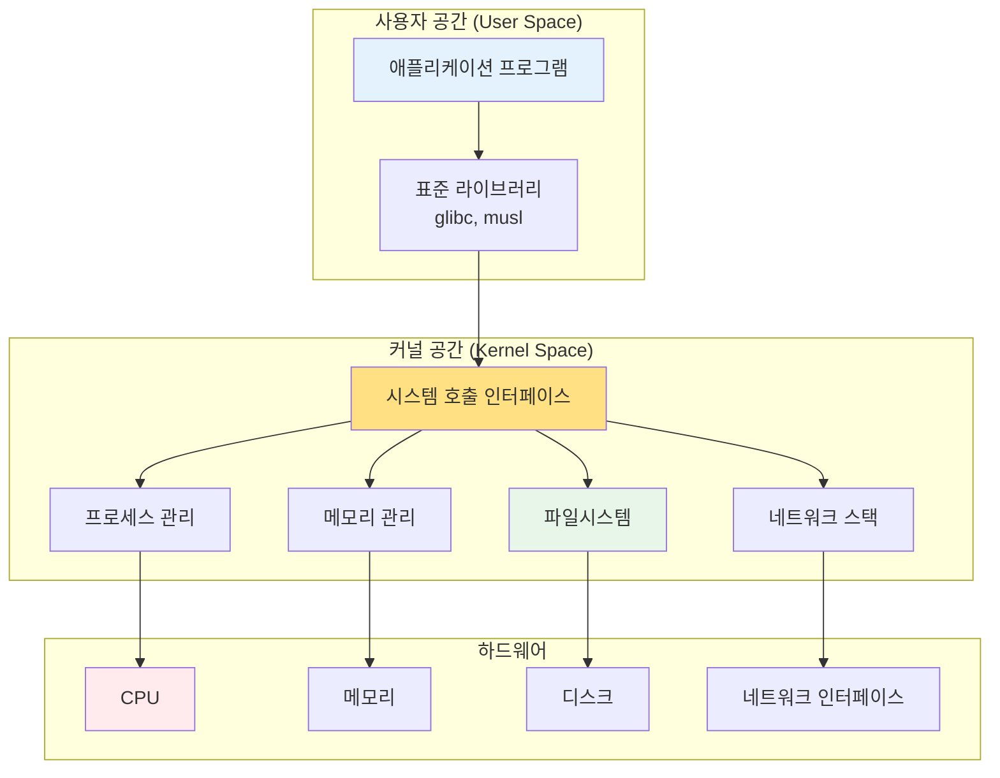
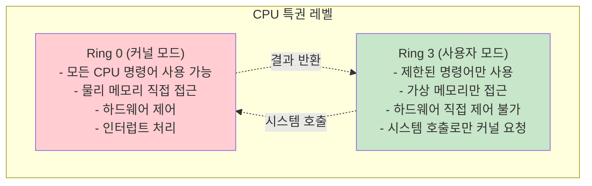
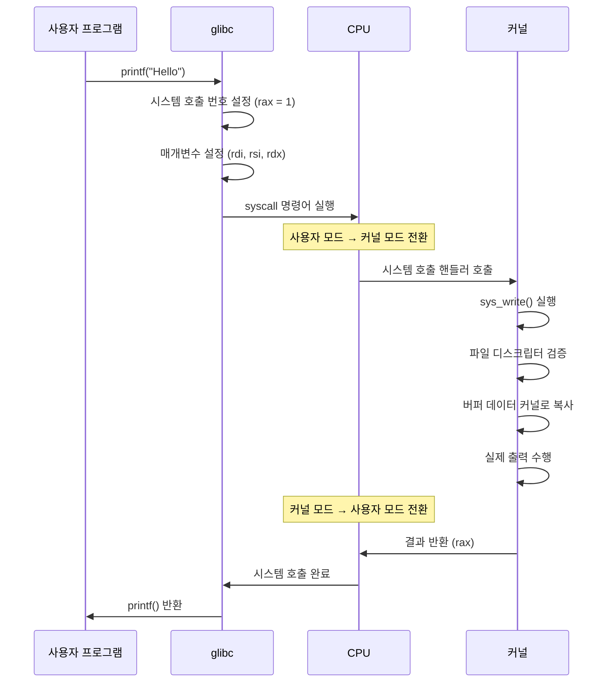
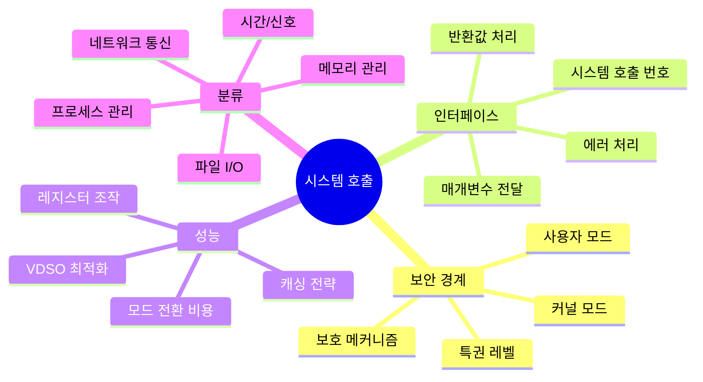

---
tags:
  - SystemCall
  - Kernel
  - UserSpace
  - API
  - Interface
---

# Chapter 10-1: 시스템 호출 기초와 인터페이스

## 이 문서를 읽으면 답할 수 있는 질문들

- 시스템 호출이란 정확히 무엇인가?
- 사용자 공간과 커널 공간은 어떻게 구분되는가?
- printf()를 호출하면 내부에서 어떤 일이 일어나는가?
- 왜 시스템 호출은 일반 함수 호출보다 비용이 클까?
- 직접 시스템 호출을 할 수 있는 방법은?

## 들어가며: 운영체제와의 대화

여러분이 파일을 열고, 네트워크 연결을 만들고, 새로운 프로세스를 생성할 때, 프로그램은 운영체제에게 도움을 요청해야 합니다. 하지만 운영체제의 핵심 부분(커널)은 보안상의 이유로 일반 프로그램이 직접 접근할 수 없는 보호된 영역에 있습니다.

이것은 마치 은행과 같습니다. 고객(사용자 프로그램)이 금고(커널)에 직접 들어갈 수는 없고, 반드시 창구 직원(시스템 호출)을 통해서만 업무를 처리할 수 있습니다.



이 장에서는 프로그램과 운영체제 사이의 이 중요한 인터페이스를 깊이 있게 탐구해보겠습니다.

## 1. 시스템 호출의 본질: 특권 레벨의 경계

### 1.1 왜 두 개의 세계가 필요한가?

현대 프로세서는 보안과 안정성을 위해 **특권 레벨(Privilege Level)**이라는 개념을 제공합니다. x86-64 아키텍처에서는 4개의 링(Ring 0-3)이 있지만, 실제로는 주로 두 개만 사용됩니다:



이런 분리가 없다면 어떤 일이 일어날까요?

```c
// 만약 보호 메커니즘이 없다면...
void malicious_program() {
    // 다른 프로세스의 메모리 읽기
    char* secret = (char*)0x12345678;
    printf("Secret: %s\n", secret);
    
    // 시스템을 멈추기
    asm volatile("cli; hlt");  // 인터럽트 비활성화 후 정지
    
    // 디스크 직접 제어
    outb(0x1F6, 0xA0);  // 하드디스크 컨트롤러 조작
}
```

이런 코드가 실행된다면 시스템은 즉시 다운되거나 보안이 완전히 뚫릴 것입니다.

### 1.2 시스템 호출: 안전한 통로

시스템 호출은 사용자 프로그램이 커널의 서비스를 안전하게 이용할 수 있는 **유일한 정당한 방법**입니다.

```c
// system_call_demo.c
#include <stdio.h>
#include <unistd.h>
#include <sys/types.h>
#include <fcntl.h>

int main() {
    // 각 함수 호출이 어떤 시스템 호출을 사용하는지 관찰
    printf("=== 시스템 호출 데모 ===\n");
    
    // 1. 파일 열기 (open 시스템 호출)
    int fd = open("/etc/passwd", O_RDONLY);
    printf("파일 디스크립터: %d\n", fd);
    
    // 2. 파일 읽기 (read 시스템 호출)
    char buffer[100];
    ssize_t bytes_read = read(fd, buffer, sizeof(buffer) - 1);
    buffer[bytes_read] = '\0';
    
    // 3. 화면에 출력 (write 시스템 호출)
    write(STDOUT_FILENO, buffer, bytes_read);
    
    // 4. 파일 닫기 (close 시스템 호출)
    close(fd);
    
    // 5. 프로세스 ID 가져오기 (getpid 시스템 호출)
    pid_t pid = getpid();
    printf("\n현재 프로세스 ID: %d\n", pid);
    
    return 0;  // 프로그램 종료 (exit_group 시스템 호출)
}
```

이 간단한 프로그램에서만도 7개의 서로 다른 시스템 호출이 사용됩니다!

### 1.3 시스템 호출 번호: 커널의 전화번호부

각 시스템 호출은 고유한 번호를 가집니다. 이는 커널이 어떤 서비스를 제공해야 하는지 식별하는 방법입니다.

```c
// syscall_numbers.c - 시스템 호출 번호 확인
#include <stdio.h>
#include <sys/syscall.h>
#include <unistd.h>

int main() {
    printf("=== 주요 시스템 호출 번호 (x86-64) ===\n");
    printf("SYS_read:     %3ld\n", SYS_read);      // 0
    printf("SYS_write:    %3ld\n", SYS_write);     // 1  
    printf("SYS_open:     %3ld\n", SYS_open);      // 2
    printf("SYS_close:    %3ld\n", SYS_close);     // 3
    printf("SYS_stat:     %3ld\n", SYS_stat);      // 4
    printf("SYS_fstat:    %3ld\n", SYS_fstat);     // 5
    printf("SYS_mmap:     %3ld\n", SYS_mmap);      // 9
    printf("SYS_brk:      %3ld\n", SYS_brk);       // 12
    printf("SYS_clone:    %3ld\n", SYS_clone);     // 56
    printf("SYS_fork:     %3ld\n", SYS_fork);      // 57
    printf("SYS_execve:   %3ld\n", SYS_execve);    // 59
    printf("SYS_exit:     %3ld\n", SYS_exit);      // 60
    printf("SYS_getpid:   %3ld\n", SYS_getpid);    // 39
    
    // 직접 시스템 호출 사용해보기
    long pid = syscall(SYS_getpid);
    printf("\n직접 시스템 호출로 얻은 PID: %ld\n", pid);
    printf("getpid()로 얻은 PID: %d\n", getpid());
    
    return 0;
}
```

## 2. 시스템 호출의 메커니즘: 어떻게 동작하는가?

### 2.1 x86-64에서의 시스템 호출 과정

시스템 호출이 실행되는 전체 과정을 단계별로 살펴봅시다:



### 2.2 레지스터를 통한 매개변수 전달

x86-64에서 시스템 호출은 특정 레지스터를 통해 매개변수를 전달합니다:

```c
// direct_syscall.c - 직접 시스템 호출 구현
#include <stdio.h>
#include <sys/syscall.h>

// 직접 write 시스템 호출 구현
long direct_write(int fd, const void *buf, size_t count) {
    long result;
    
    asm volatile (
        "movl %1, %%edi\n\t"        // fd → rdi
        "movq %2, %%rsi\n\t"        // buf → rsi  
        "movq %3, %%rdx\n\t"        // count → rdx
        "movl $1, %%eax\n\t"        // SYS_write (1) → rax
        "syscall\n\t"               // 시스템 호출 실행
        "movq %%rax, %0"            // 결과 → result
        : "=r" (result)
        : "r" (fd), "r" (buf), "r" (count)
        : "rax", "rdi", "rsi", "rdx", "rcx", "r11", "memory"
    );
    
    return result;
}

int main() {
    const char *msg = "직접 시스템 호출로 출력\n";
    
    // 직접 구현한 시스템 호출 사용
    direct_write(1, msg, 26);
    
    // 비교: 표준 라이브러리 사용
    printf("표준 라이브러리로 출력\n");
    
    return 0;
}
```

### 2.3 시스템 호출의 비용: 왜 느릴까?

시스템 호출이 일반 함수 호출보다 비싼 이유를 실제로 측정해봅시다:

```c
// syscall_benchmark.c
#include <stdio.h>
#include <time.h>
#include <unistd.h>
#include <sys/syscall.h>

// 빈 함수 (일반 함수 호출 비용)
int empty_function() {
    return 42;
}

// 시간 측정 매크로
#define MEASURE_TIME(label, iterations, code) do { \
    struct timespec start, end; \
    clock_gettime(CLOCK_MONOTONIC, &start); \
    for (int i = 0; i < iterations; i++) { \
        code; \
    } \
    clock_gettime(CLOCK_MONOTONIC, &end); \
    long nanos = (end.tv_sec - start.tv_sec) * 1000000000L + \
                 (end.tv_nsec - start.tv_nsec); \
    printf("%s: %ld iterations in %ld ns (%.2f ns per call)\n", \
           label, (long)iterations, nanos, (double)nanos / iterations); \
} while(0)

int main() {
    const int iterations = 1000000;
    
    printf("=== 함수 호출 vs 시스템 호출 성능 비교 ===\n");
    
    // 1. 일반 함수 호출
    MEASURE_TIME("일반 함수 호출", iterations, 
                 empty_function());
    
    // 2. 시스템 호출 (getpid - 가장 빠른 시스템 호출 중 하나)
    MEASURE_TIME("getpid() 시스템 호출", iterations/1000,  // 1000배 적게
                 getpid());
    
    // 3. 직접 시스템 호출
    MEASURE_TIME("직접 syscall", iterations/1000,
                 syscall(SYS_getpid));
    
    printf("\n=== 시스템 호출이 느린 이유 ===\n");
    printf("1. 커널 모드로 전환하는 오버헤드\n");
    printf("2. 레지스터 상태 저장/복원\n"); 
    printf("3. 매개변수 검증 및 복사\n");
    printf("4. 커널 내부 함수 호출\n");
    printf("5. 사용자 모드로 복귀\n");
    
    return 0;
}
```

일반적인 결과:

- 일반 함수 호출: ~1-2ns
- 시스템 호출: ~100-300ns (100-300배 더 느림!)

## 3. 시스템 호출의 분류: 서비스별 카테고리

시스템 호출은 제공하는 서비스에 따라 여러 카테고리로 나눌 수 있습니다:

### 3.1 파일 및 I/O 관련

```c
// file_syscalls_demo.c
#include <stdio.h>
#include <fcntl.h>
#include <unistd.h>
#include <sys/stat.h>

void demonstrate_file_syscalls() {
    printf("=== 파일 관련 시스템 호출 ===\n");
    
    // 1. open - 파일 열기
    int fd = open("test.txt", O_CREAT | O_WRONLY | O_TRUNC, 0644);
    if (fd == -1) {
        perror("open");
        return;
    }
    printf("파일 열기 성공: fd=%d\n", fd);
    
    // 2. write - 파일 쓰기
    const char *data = "Hello, System Call!\n";
    ssize_t written = write(fd, data, 20);
    printf("쓰기 완료: %zd bytes\n", written);
    
    // 3. close - 파일 닫기
    close(fd);
    
    // 4. stat - 파일 정보 확인
    struct stat file_stat;
    if (stat("test.txt", &file_stat) == 0) {
        printf("파일 크기: %ld bytes\n", file_stat.st_size);
        printf("수정 시간: %ld\n", file_stat.st_mtime);
    }
    
    // 5. unlink - 파일 삭제
    unlink("test.txt");
    printf("파일 삭제 완료\n");
}
```

### 3.2 프로세스 및 스레드 관리

```c
// process_syscalls_demo.c
#include <stdio.h>
#include <unistd.h>
#include <sys/wait.h>
#include <sys/types.h>

void demonstrate_process_syscalls() {
    printf("=== 프로세스 관련 시스템 호출 ===\n");
    
    // 1. getpid - 현재 프로세스 ID
    pid_t current_pid = getpid();
    printf("현재 프로세스 ID: %d\n", current_pid);
    
    // 2. getppid - 부모 프로세스 ID  
    pid_t parent_pid = getppid();
    printf("부모 프로세스 ID: %d\n", parent_pid);
    
    // 3. fork - 새 프로세스 생성
    pid_t child_pid = fork();
    
    if (child_pid == 0) {
        // 자식 프로세스
        printf("자식 프로세스: PID=%d, PPID=%d\n", getpid(), getppid());
        
        // 4. execve - 다른 프로그램 실행
        // execl("/bin/echo", "echo", "Hello from child!", NULL);
    } else if (child_pid > 0) {
        // 부모 프로세스
        printf("부모 프로세스: 자식 PID=%d\n", child_pid);
        
        // 5. wait - 자식 프로세스 대기
        int status;
        wait(&status);
        printf("자식 프로세스 종료됨\n");
    } else {
        perror("fork 실패");
    }
}
```

### 3.3 메모리 관리

```c
// memory_syscalls_demo.c
#include <stdio.h>
#include <sys/mman.h>
#include <unistd.h>
#include <string.h>

void demonstrate_memory_syscalls() {
    printf("=== 메모리 관련 시스템 호출 ===\n");
    
    // 1. brk/sbrk - 힙 크기 조정
    void *current_brk = sbrk(0);
    printf("현재 brk 위치: %p\n", current_brk);
    
    // 힙 확장
    void *new_brk = sbrk(4096);  // 4KB 확장
    printf("확장 후 brk: %p\n", sbrk(0));
    
    // 2. mmap - 메모리 매핑
    void *mapped = mmap(NULL, 4096, PROT_READ | PROT_WRITE,
                       MAP_PRIVATE | MAP_ANONYMOUS, -1, 0);
    if (mapped != MAP_FAILED) {
        printf("mmap 성공: %p\n", mapped);
        
        // 매핑된 메모리 사용
        strcpy(mapped, "Hello, mmap!");
        printf("매핑된 메모리 내용: %s\n", (char*)mapped);
        
        // 3. munmap - 메모리 매핑 해제
        munmap(mapped, 4096);
        printf("메모리 매핑 해제됨\n");
    }
    
    // 원래 힙 크기로 복원
    brk(current_brk);
}
```

### 3.4 네트워크 통신

```c
// network_syscalls_demo.c  
#include <stdio.h>
#include <sys/socket.h>
#include <netinet/in.h>
#include <arpa/inet.h>
#include <unistd.h>

void demonstrate_network_syscalls() {
    printf("=== 네트워크 관련 시스템 호출 ===\n");
    
    // 1. socket - 소켓 생성
    int sockfd = socket(AF_INET, SOCK_STREAM, 0);
    if (sockfd == -1) {
        perror("socket");
        return;
    }
    printf("소켓 생성 성공: fd=%d\n", sockfd);
    
    // 2. bind - 주소 바인딩 (서버의 경우)
    struct sockaddr_in addr;
    addr.sin_family = AF_INET;
    addr.sin_port = htons(8080);
    addr.sin_addr.s_addr = INADDR_ANY;
    
    if (bind(sockfd, (struct sockaddr*)&addr, sizeof(addr)) == -1) {
        printf("bind 실패 (포트가 사용 중일 수 있음)\n");
    } else {
        printf("포트 8080에 바인딩 성공\n");
    }
    
    // 3. listen - 연결 대기 (서버의 경우)
    if (listen(sockfd, 5) == -1) {
        printf("listen 설정 실패\n");
    } else {
        printf("연결 대기 상태로 전환\n");
    }
    
    // 4. close - 소켓 닫기
    close(sockfd);
    printf("소켓 닫기 완료\n");
}
```

## 4. glibc vs 직접 시스템 호출

### 4.1 glibc 래퍼 함수의 역할

대부분의 시스템 호출은 glibc가 제공하는 래퍼 함수를 통해 사용됩니다:

```mermaid
graph TD
    subgraph "사용자 프로그램"
        CALL[printf("Hello")]
    end
    
    subgraph "glibc 라이브러리"
        PRINTF[printf()]
        WRITE[write()]
        SYSCALL[syscall stub]
    end
    
    subgraph "커널"
        HANDLER[sys_write()]
        VFS[VFS 레이어]
        TTY[TTY 드라이버]
    end
    
    CALL --> PRINTF
    PRINTF --> WRITE
    WRITE --> SYSCALL
    SYSCALL --> HANDLER
    HANDLER --> VFS
    VFS --> TTY
    
    style PRINTF fill:#E3F2FD
    style WRITE fill:#FFF3E0
    style SYSCALL fill:#FFE082
    style HANDLER fill:#E8F5E9
```

### 4.2 래퍼 함수가 제공하는 가치

```c
// wrapper_comparison.c
#include <stdio.h>
#include <errno.h>
#include <string.h>
#include <sys/syscall.h>
#include <unistd.h>

int main() {
    printf("=== glibc 래퍼 vs 직접 시스템 호출 ===\n");
    
    // 1. glibc 래퍼 사용
    printf("== glibc 래퍼 사용 ==\n");
    int fd1 = open("/nonexistent/file", O_RDONLY);
    if (fd1 == -1) {
        printf("오류 발생: %s\n", strerror(errno));
    }
    
    // 2. 직접 시스템 호출 사용
    printf("\n== 직접 시스템 호출 사용 ==\n");
    long fd2 = syscall(SYS_open, "/nonexistent/file", O_RDONLY);
    if (fd2 == -1) {
        printf("오류 코드: %ld\n", fd2);
        printf("errno: %d (%s)\n", errno, strerror(errno));
    }
    
    printf("\n== 래퍼 함수의 장점 ==\n");
    printf("1. 에러 처리 자동화 (errno 설정)\n");
    printf("2. 타입 안전성 (int vs long)\n");
    printf("3. 포팅 가능성 (아키텍처 독립적)\n");
    printf("4. 추가 기능 (버퍼링, 포맷팅 등)\n");
    printf("5. 디버깅 편의성\n");
    
    return 0;
}
```

### 4.3 언제 직접 시스템 호출을 사용할까?

직접 시스템 호출이 필요한 경우들:

```c
// direct_syscall_cases.c
#include <stdio.h>
#include <sys/syscall.h>
#include <unistd.h>
#include <linux/perf_event.h>

void case1_new_syscalls() {
    printf("=== 케이스 1: 새로운 시스템 호출 ===\n");
    
    // gettid() - glibc 2.30 이전에는 래퍼가 없었음
    pid_t tid = syscall(SYS_gettid);
    printf("스레드 ID: %d\n", tid);
    
    // getrandom() - 비교적 최근 추가된 시스템 호출
    char random_bytes[16];
    long ret = syscall(SYS_getrandom, random_bytes, sizeof(random_bytes), 0);
    if (ret > 0) {
        printf("랜덤 바이트 생성 성공: %ld bytes\n", ret);
    }
}

void case2_performance_critical() {
    printf("\n=== 케이스 2: 성능이 중요한 경우 ===\n");
    
    // 고성능이 필요할 때 래퍼 함수의 오버헤드 제거
    struct timespec start, end;
    clock_gettime(CLOCK_MONOTONIC, &start);
    
    for (int i = 0; i < 100000; i++) {
        syscall(SYS_getpid);  // 직접 호출
    }
    
    clock_gettime(CLOCK_MONOTONIC, &end);
    long nanos = (end.tv_sec - start.tv_sec) * 1000000000L + 
                 (end.tv_nsec - start.tv_nsec);
    printf("100000번 직접 시스템 호출: %ld ns\n", nanos);
}

void case3_special_parameters() {
    printf("\n=== 케이스 3: 특수한 매개변수 ===\n");
    
    // clone() 시스템 호출 - 복잡한 플래그 조합
    // glibc의 fork()보다 더 세밀한 제어 가능
    printf("clone() 시스템 호출로 세밀한 프로세스 제어 가능\n");
}
```

## 5. 시스템 호출 테이블: 커널의 전화번호부

### 5.1 시스템 호출 테이블의 구조

커널은 시스템 호출 번호를 함수 포인터로 매핑하는 테이블을 유지합니다:

```c
// 커널 내부 구조 (실제 커널 코드의 단순화된 버전)
/*
// arch/x86/entry/syscalls/syscall_64.tbl에서 정의
0   common  read            sys_read
1   common  write           sys_write  
2   common  open            sys_open
3   common  close           sys_close
...
*/

// 시스템 호출 핸들러 함수들
asmlinkage long sys_read(unsigned int fd, char __user *buf, size_t count);
asmlinkage long sys_write(unsigned int fd, const char __user *buf, size_t count);
asmlinkage long sys_open(const char __user *filename, int flags, umode_t mode);

// 시스템 호출 테이블
const sys_call_ptr_t sys_call_table[__NR_syscall_max+1] = {
    [0] = sys_read,
    [1] = sys_write,
    [2] = sys_open,
    [3] = sys_close,
    // ... 수백 개의 시스템 호출
};
```

### 5.2 시스템 호출 탐색 도구

실제 시스템에서 지원하는 시스템 호출을 확인해봅시다:

```c
// syscall_explorer.c
#include <stdio.h>
#include <sys/syscall.h>
#include <unistd.h>
#include <errno.h>

void explore_syscalls() {
    printf("=== 시스템 호출 탐색 ===\n");
    
    struct syscall_info {
        int number;
        const char* name;
        const char* description;
    } syscalls[] = {
        {SYS_read, "read", "파일/소켓에서 데이터 읽기"},
        {SYS_write, "write", "파일/소켓에 데이터 쓰기"},
        {SYS_open, "open", "파일 열기"},
        {SYS_close, "close", "파일 닫기"},
        {SYS_mmap, "mmap", "메모리 매핑"},
        {SYS_fork, "fork", "프로세스 복제"},
        {SYS_execve, "execve", "프로그램 실행"},
        {SYS_socket, "socket", "소켓 생성"},
        {SYS_bind, "bind", "소켓 주소 바인딩"},
        {SYS_listen, "listen", "연결 대기"},
        {0, NULL, NULL}
    };
    
    for (int i = 0; syscalls[i].name; i++) {
        printf("%3d: %-10s - %s\n", 
               syscalls[i].number, 
               syscalls[i].name, 
               syscalls[i].description);
    }
    
    // 현재 시스템의 최대 시스템 호출 번호 추정
    printf("\n=== 시스템 호출 범위 탐색 ===\n");
    int max_valid = 0;
    
    for (int i = 0; i < 1000; i++) {  // 0-999 범위 탐색
        long ret = syscall(i);
        if (errno != ENOSYS) {  // 시스템 호출이 존재함
            max_valid = i;
        }
        errno = 0;  // errno 리셋
    }
    
    printf("탐지된 최대 시스템 호출 번호: %d\n", max_valid);
}

int main() {
    explore_syscalls();
    return 0;
}
```

## 6. 아키텍처별 차이점

### 6.1 x86-64 vs ARM64 비교

서로 다른 아키텍처는 다른 시스템 호출 메커니즘을 사용합니다:

```c
// arch_specific_syscalls.c
#include <stdio.h>

void show_architecture_differences() {
    printf("=== 아키텍처별 시스템 호출 차이점 ===\n\n");
    
    printf("** x86-64 (Intel/AMD) **\n");
    printf("- 시스템 호출 명령어: syscall\n");
    printf("- 매개변수 레지스터: rdi, rsi, rdx, r10, r8, r9\n");
    printf("- 반환값 레지스터: rax\n");
    printf("- 최대 매개변수: 6개\n\n");
    
    printf("** ARM64 (AArch64) **\n");
    printf("- 시스템 호출 명령어: svc #0\n");
    printf("- 매개변수 레지스터: x0, x1, x2, x3, x4, x5\n");
    printf("- 반환값 레지스터: x0\n");
    printf("- 최대 매개변수: 6개\n\n");
    
    printf("** 32비트 x86 (i386) **\n");
    printf("- 시스템 호출 명령어: int 0x80 또는 sysenter\n");
    printf("- 매개변수 레지스터: ebx, ecx, edx, esi, edi, ebp\n");
    printf("- 반환값 레지스터: eax\n");
    printf("- 최대 매개변수: 6개\n\n");
    
    // 현재 아키텍처 확인
    #ifdef __x86_64__
        printf("현재 컴파일된 아키텍처: x86-64\n");
    #elif __aarch64__
        printf("현재 컴파일된 아키텍처: ARM64\n");
    #elif __i386__
        printf("현재 컴파일된 아키텍처: x86 (32-bit)\n");
    #else
        printf("현재 컴파일된 아키텍처: 알 수 없음\n");
    #endif
}

int main() {
    show_architecture_differences();
    return 0;
}
```

### 6.2 VDSO: 시스템 호출 최적화

VDSO(Virtual Dynamic Shared Object)는 자주 사용되는 시스템 호출을 최적화합니다:

```c
// vdso_demo.c
#include <stdio.h>
#include <time.h>
#include <sys/time.h>
#include <unistd.h>

void demonstrate_vdso() {
    printf("=== VDSO (Virtual Dynamic Shared Object) ===\n");
    
    struct timespec start, end;
    const int iterations = 1000000;
    
    // 1. gettimeofday() - VDSO로 최적화됨
    clock_gettime(CLOCK_MONOTONIC, &start);
    for (int i = 0; i < iterations; i++) {
        struct timeval tv;
        gettimeofday(&tv, NULL);
    }
    clock_gettime(CLOCK_MONOTONIC, &end);
    
    long vdso_time = (end.tv_sec - start.tv_sec) * 1000000000L + 
                     (end.tv_nsec - start.tv_nsec);
    
    // 2. getpid() - 일반 시스템 호출
    clock_gettime(CLOCK_MONOTONIC, &start);
    for (int i = 0; i < iterations; i++) {
        getpid();
    }
    clock_gettime(CLOCK_MONOTONIC, &end);
    
    long syscall_time = (end.tv_sec - start.tv_sec) * 1000000000L + 
                        (end.tv_nsec - start.tv_nsec);
    
    printf("VDSO 최적화된 gettimeofday(): %.2f ns/call\n", 
           (double)vdso_time / iterations);
    printf("일반 시스템 호출 getpid(): %.2f ns/call\n", 
           (double)syscall_time / iterations);
    printf("성능 차이: %.1fx\n", (double)syscall_time / vdso_time);
    
    // VDSO 매핑 확인
    printf("\n=== 현재 프로세스의 VDSO 매핑 ===\n");
    char command[100];
    sprintf(command, "cat /proc/%d/maps | grep vdso", getpid());
    system(command);
}

int main() {
    demonstrate_vdso();
    return 0;
}
```

## 7. 실습: 시스템 호출 모니터링

### 7.1 strace로 시스템 호출 추적

```bash
# 간단한 프로그램의 시스템 호출 추적
$ strace -c ./syscall_demo

# 파일 관련 시스템 호출만 추적
$ strace -e trace=file ./syscall_demo

# 네트워크 관련 시스템 호출만 추적
$ strace -e trace=network ./server

# 시간 측정과 함께
$ strace -T ./syscall_demo
```

### 7.2 간단한 시스템 호출 추적기 구현

```c
// simple_tracer.c - ptrace를 이용한 간단한 추적기
#include <stdio.h>
#include <sys/ptrace.h>
#include <sys/wait.h>
#include <unistd.h>
#include <sys/user.h>

void trace_child(pid_t child_pid) {
    int status;
    struct user_regs_struct regs;
    
    // 자식 프로세스가 시작되길 대기
    waitpid(child_pid, &status, 0);
    
    while (WIFSTOPPED(status)) {
        // 시스템 호출 진입점에서 레지스터 읽기
        ptrace(PTRACE_GETREGS, child_pid, NULL, &regs);
        
        printf("시스템 호출 %lld 호출됨\n", regs.orig_rax);
        
        // 시스템 호출 완료까지 실행
        ptrace(PTRACE_SYSCALL, child_pid, NULL, NULL);
        waitpid(child_pid, &status, 0);
        
        if (WIFSTOPPED(status)) {
            // 시스템 호출 반환값 확인
            ptrace(PTRACE_GETREGS, child_pid, NULL, &regs);
            printf("  -> 반환값: %lld\n", regs.rax);
            
            // 다음 시스템 호출까지 실행
            ptrace(PTRACE_SYSCALL, child_pid, NULL, NULL);
            waitpid(child_pid, &status, 0);
        }
    }
}

int main(int argc, char *argv[]) {
    if (argc < 2) {
        printf("사용법: %s <명령어>\n", argv[0]);
        return 1;
    }
    
    pid_t child_pid = fork();
    
    if (child_pid == 0) {
        // 자식 프로세스: 추적 당하는 프로그램
        ptrace(PTRACE_TRACEME, 0, NULL, NULL);
        execvp(argv[1], &argv[1]);
    } else {
        // 부모 프로세스: 추적자
        printf("프로세스 %d의 시스템 호출 추적 시작\n", child_pid);
        trace_child(child_pid);
    }
    
    return 0;
}
```

## 8. 정리: 시스템 호출의 핵심 개념

이 장에서 다룬 핵심 내용들을 정리하면:

### 8.1 시스템 호출의 본질



### 8.2 실무에서 기억해야 할 것들

1. **시스템 호출은 비용이 크다**
   - 가능하면 배치(batch) 처리
   - 버퍼링 활용
   - 불필요한 호출 최소화

2. **glibc 래퍼 함수 활용**
   - 대부분의 경우 래퍼 함수 사용 권장
   - 직접 시스템 호출은 특수한 경우에만

3. **아키텍처 독립적 코딩**
   - 시스템 호출 번호는 아키텍처마다 다름
   - 표준 라이브러리 함수 사용 권장

4. **에러 처리 중요성**
   - 모든 시스템 호출은 실패할 수 있음
   - errno를 통한 적절한 에러 처리 필수

## 다음 단계

다음 섹션([10-2: 리눅스 커널 아키텍처](02-kernel-architecture.md))에서는 시스템 호출이 처리되는 **커널의 내부 구조**를 탐구합니다:

- 커널의 전체 아키텍처와 서브시스템
- 모놀리식 vs 마이크로커널 설계 철학  
- 인터럽트와 예외 처리 메커니즘
- 커널 모듈과 디바이스 드라이버
- 커널 공간에서의 메모리 관리

시스템 호출의 요청자(사용자 프로그램) 관점을 이해했으니, 이제 요청을 처리하는 커널의 관점에서 시스템을 바라보겠습니다.
