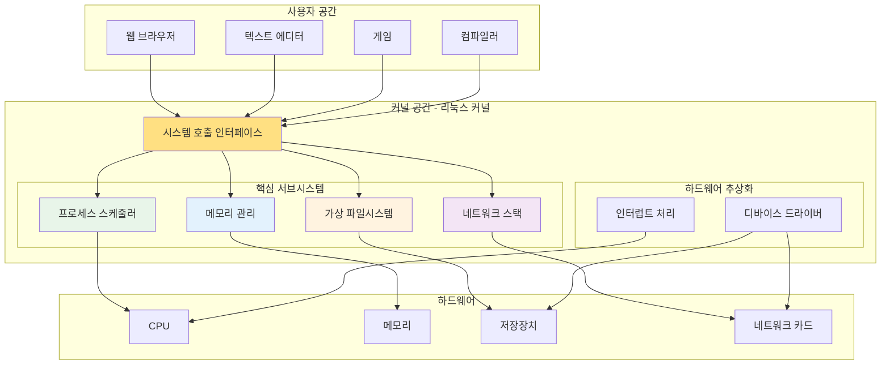
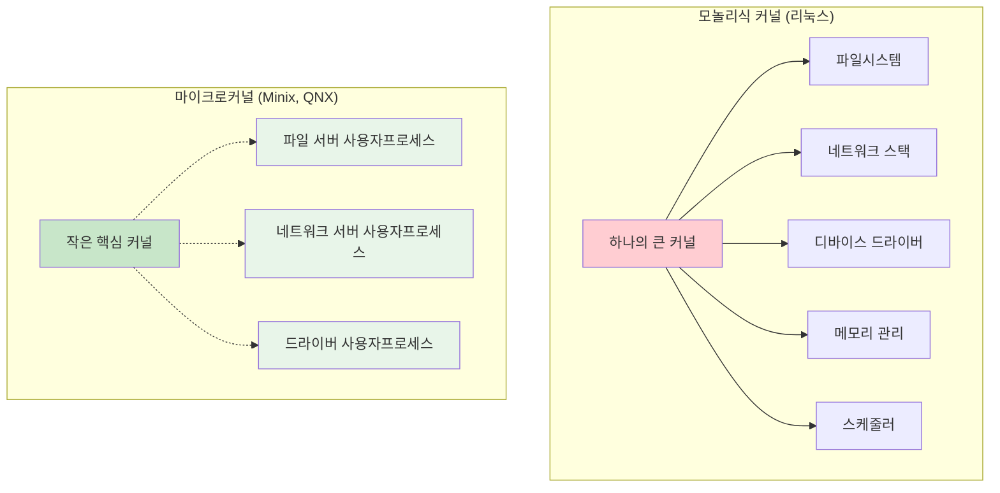
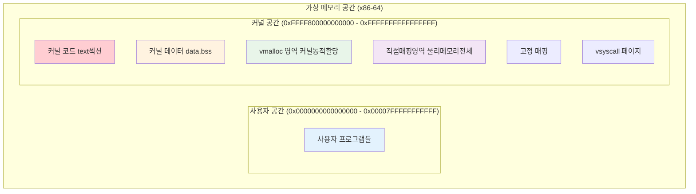
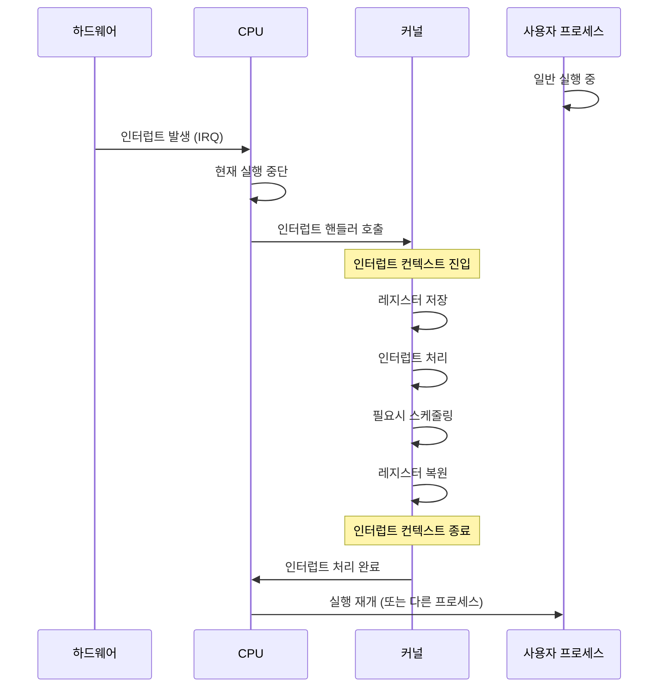
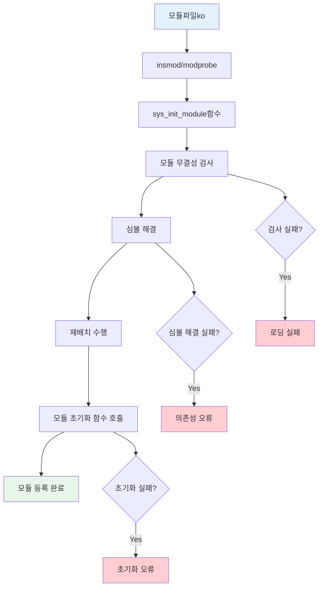
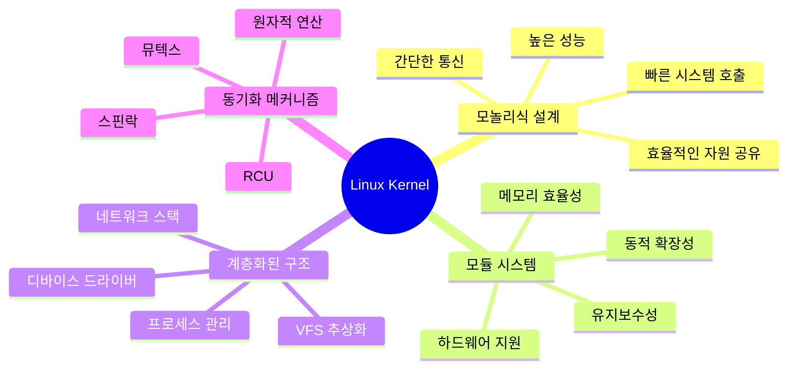

---
tags:
  - Kernel
  - Architecture
  - Linux
  - Monolithic
  - Subsystem
---

# Chapter 10-2: 리눅스 커널 아키텍처

## 이 문서를 읽으면 답할 수 있는 질문들

- 리눅스 커널은 어떤 구조로 설계되었나?
- 모놀리식 커널과 마이크로커널의 차이는?
- 커널의 주요 서브시스템들은 어떻게 협력하는가?
- 인터럽트가 발생하면 커널에서 무슨 일이 일어나는가?
- 커널 모듈은 어떻게 동적으로 로드되는가?

## 들어가며: 운영체제의 심장

리눅스 커널은 현대 컴퓨터 시스템의 심장입니다. 1991년 21살의 리누스 토르발즈가 시작한 작은 프로젝트가, 30년 후 세계에서 가장 널리 사용되는 운영체제 커널이 되었습니다.

하지만 커널이 정확히 무엇을 하는 걸까요? 간단히 말하면, 커널은 **자원 관리자**입니다. CPU 시간, 메모리, 파일, 네트워크 - 이 모든 자원을 여러 프로그램이 안전하고 효율적으로 공유할 수 있도록 중재하는 것이 커널의 역할입니다.



이 장에서는 리눅스 커널의 내부 아키텍처를 깊이 있게 탐구하고, 각 서브시스템이 어떻게 협력하여 안정적인 시스템을 만드는지 알아보겠습니다.

## 1. 커널 설계 철학: 모놀리식 vs 마이크로커널

### 1.1 설계 철학의 대결

운영체제 역사상 가장 큰 논쟁 중 하나는 커널 설계 방식입니다. 두 진영의 철학을 비교해봅시다:



### 1.2 유명한 Torvalds vs Tanenbaum 논쟁

1992년, 젊은 리누스 토르발즈와 저명한 컴퓨터 과학자 앤드류 타넨바움 사이의 유명한 논쟁이 있었습니다:

**타넨바움의 주장 (마이크로커널 지지):**

```text
"Linux is obsolete. 모놀리식 커널은 1970년대 기술이다.
마이크로커널이 미래다. 더 안전하고, 더 안정적이며, 더 모듈화되어 있다."
```

**토르발즈의 반박 (모놀리식 커널 지지):**

```text
"성능이 중요하다. IPC(프로세스 간 통신) 오버헤드는 실용적이지 않다.
단순함이 복잡함보다 낫다."
```

30년이 지난 지금, 리눅스는 전 세계를 정복했고, 마이크로커널은 여전히 틈새 시장에 머물러 있습니다. 실용성이 이론적 순수성을 이긴 사례입니다.

### 1.3 모놀리식 커널의 장단점

**장점:**

```c
// 모놀리식 커널에서의 시스템 호출
long sys_write(unsigned int fd, const char __user *buf, size_t count) {
    // 1. 함수 호출로 VFS 접근 (빠름)
    struct file *file = fget(fd);
    
    // 2. 함수 호출로 파일시스템 접근 (빠름) 
    return file->f_op->write(file, buf, count);
}
```

**단점:**

```c
// 커널 패닉을 일으킬 수 있는 코드
void buggy_driver_function() {
    char *ptr = NULL;
    *ptr = 42;  // NULL 포인터 역참조!
    // 전체 시스템이 다운됨
}
```

### 1.4 리눅스의 절충안: 모듈화

리눅스는 모놀리식 커널이지만, **모듈 시스템**을 통해 마이크로커널의 장점을 일부 취했습니다:

```bash
# 현재 로드된 커널 모듈 확인
$ lsmod
Module                  Size  Used by
nvidia_drm             69632  8
nvidia_modeset       1142784  10 nvidia_drm
nvidia              39051264  865 nvidia_modeset
bluetooth             737280  41 btusb,bnep
...

# 새로운 모듈 로드
$ sudo modprobe usbcore

# 모듈 제거
$ sudo rmmod unused_module

# 모듈 정보 확인
$ modinfo ext4
filename:       /lib/modules/5.4.0/kernel/fs/ext4/ext4.ko
license:        GPL
description:    Fourth Extended Filesystem
```

## 2. 리눅스 커널의 전체 구조

### 2.1 커널 공간의 레이아웃

리눅스 커널은 메모리의 특별한 영역에 상주합니다:



### 2.2 커널 이미지 구조

커널이 메모리에 로드되는 과정을 살펴봅시다:

```c
// 커널 링커 스크립트 (vmlinux.lds)의 개념적 구조
SECTIONS
{
    . = LOAD_OFFSET + LOAD_PHYSICAL_ADDR;
    
    /* 커널 코드 섹션 */
    .text : {
        _text = .;
        *(.text.startup)
        *(.text)
        *(.text.*)
        _etext = .;
    }
    
    /* 읽기 전용 데이터 */
    .rodata : {
        *(.rodata)
        *(.rodata.*)
    }
    
    /* 초기화된 데이터 */
    .data : {
        _data = .;
        *(.data)
        _edata = .;
    }
    
    /* 초기화되지 않은 데이터 */
    .bss : {
        __bss_start = .;
        *(.bss)
        __bss_stop = .;
    }
}
```

### 2.3 커널 심볼 테이블

커널은 내부적으로 방대한 심볼 테이블을 관리합니다:

```bash
# 커널 심볼 테이블 확인
$ cat /proc/kallsyms | head -20
0000000000000000 A fixed_percpu_data
0000000000000000 A __per_cpu_start
0000000000001000 A cpu_debug_store
0000000000002000 A irq_stack_backing_store
0000000000006000 A cpu_tss_rw
...
ffffffff81000000 T _text
ffffffff81000000 T startup_64
ffffffff81000030 T secondary_startup_64
ffffffff81000040 T verify_cpu

# 특정 심볼 찾기
$ grep "sys_write" /proc/kallsyms
ffffffff812a4590 T ksys_write
ffffffff812a45e0 T __x64_sys_write
ffffffff812a45e0 T sys_write
```

## 3. 핵심 서브시스템 탐구

### 3.1 프로세스 스케줄러: CFS (Completely Fair Scheduler)

리눅스의 스케줄러는 어떻게 수십만 개의 태스크를 공정하게 관리할까요?

```c
// 스케줄러 핵심 구조체 (단순화)
struct task_struct {
    int prio, static_prio, normal_prio;
    struct sched_entity se;
    struct sched_rt_entity rt;
    struct sched_dl_entity dl;
    
    // 가상 런타임 (CFS의 핵심)
    u64 vruntime;
    
    // 프로세스 상태
    int state;  // RUNNING, INTERRUPTIBLE, UNINTERRUPTIBLE, etc.
    
    // 메모리 관리
    struct mm_struct *mm;
    
    // 파일 디스크립터
    struct files_struct *files;
    
    // 신호 처리
    struct signal_struct *signal;
};

// CFS 스케줄러의 핵심 알고리즘
static struct task_struct *pick_next_task_fair(struct rq *rq) {
    struct sched_entity *se;
    struct cfs_rq *cfs_rq = &rq->cfs;
    
    // 적색-흑색 트리에서 가장 왼쪽 노드 선택
    // (가장 작은 vruntime을 가진 태스크)
    se = __pick_first_entity(cfs_rq);
    if (!se)
        return NULL;
        
    return task_of(se);
}
```

### 3.2 메모리 관리 서브시스템

```c
// 메모리 관리의 핵심 구조체들
struct mm_struct {
    struct vm_area_struct *mmap;        // VMA 리스트
    struct rb_root mm_rb;               // VMA 적색-흑색 트리
    
    pgd_t *pgd;                         // 페이지 테이블 디렉토리
    
    unsigned long start_code, end_code;  // 코드 영역
    unsigned long start_data, end_data;  // 데이터 영역
    unsigned long start_brk, brk;        // 힙 영역
    unsigned long start_stack;           // 스택 영역
    
    atomic_t mm_users;                   // 참조 카운터
};

// VMA (Virtual Memory Area) - 가상 메모리 영역
struct vm_area_struct {
    unsigned long vm_start;              // 시작 주소
    unsigned long vm_end;                // 끝 주소
    struct vm_area_struct *vm_next;      // 다음 VMA
    
    pgprot_t vm_page_prot;               // 페이지 보호 속성
    unsigned long vm_flags;              // 플래그 (읽기/쓰기/실행)
    
    struct file *vm_file;                // 매핑된 파일 (있다면)
    const struct vm_operations_struct *vm_ops;  // 연산들
};
```

### 3.3 VFS (Virtual File System): 통합 인터페이스

```c
// VFS의 핵심 추상화
struct super_block {
    struct list_head s_list;        // 슈퍼블록 리스트
    dev_t s_dev;                    // 디바이스 식별자
    unsigned char s_blocksize_bits;  // 블록 크기
    unsigned long s_blocksize;
    loff_t s_maxbytes;              // 최대 파일 크기
    struct file_system_type *s_type; // 파일시스템 타입
    
    const struct super_operations *s_op; // 연산 함수들
    struct dentry *s_root;          // 루트 디렉토리
};

struct inode {
    umode_t i_mode;                 // 파일 타입과 권한
    unsigned int i_nlink;           // 하드링크 수
    uid_t i_uid;                    // 소유자 ID
    gid_t i_gid;                    // 그룹 ID
    loff_t i_size;                  // 파일 크기
    
    const struct inode_operations *i_op;
    const struct file_operations *i_fop;
    struct super_block *i_sb;
    
    union {
        struct pipe_inode_info *i_pipe;
        struct block_device *i_bdev;
        struct cdev *i_cdev;
    };
};

// 파일 연산 예제 (ext4 파일시스템)
const struct file_operations ext4_file_operations = {
    .llseek         = ext4_llseek,
    .read_iter      = ext4_file_read_iter,
    .write_iter     = ext4_file_write_iter,
    .unlocked_ioctl = ext4_ioctl,
    .mmap           = ext4_file_mmap,
    .open           = ext4_file_open,
    .release        = ext4_release_file,
    .fsync          = ext4_sync_file,
};
```

### 3.4 네트워크 스택: 계층화된 프로토콜

```c
// 네트워크 스택의 계층 구조
struct net_protocol {
    int (*handler)(struct sk_buff *skb);
    void (*err_handler)(struct sk_buff *skb, u32 info);
    unsigned int no_policy:1,
                 netns_ok:1,
                 icmp_strict_tag_validation:1;
};

// 소켓 구조체
struct socket {
    socket_state state;             // 소켓 상태
    short type;                     // 소켓 타입 (STREAM, DGRAM, etc.)
    unsigned long flags;
    struct file *file;              // 연관된 파일 객체
    struct sock *sk;                // 프로토콜 특화 데이터
    const struct proto_ops *ops;    // 프로토콜 연산
};

// TCP 소켓 (struct sock의 확장)
struct tcp_sock {
    struct inet_connection_sock inet_conn;
    
    u32 rcv_nxt;                    // 다음 예상 시퀀스 번호
    u32 snd_nxt;                    // 다음 전송 시퀀스 번호
    u32 snd_una;                    // 확인되지 않은 첫 번째 바이트
    u32 window_clamp;               // 윈도우 크기 제한
    
    struct sk_buff_head out_of_order_queue; // 순서 없는 패킷 큐
};
```

## 4. 인터럽트와 예외 처리

### 4.1 인터럽트 처리 메커니즘

인터럽트는 커널의 심장박동과 같습니다. 하드웨어 이벤트가 발생할 때마다 커널이 반응해야 합니다.



### 4.2 인터럽트 디스크립터 테이블 (IDT)

```c
// 인터럽트 디스크립터 테이블 설정
struct idt_entry {
    u16 offset_low;      // 핸들러 주소 하위 16비트
    u16 selector;        // 코드 세그먼트 셀렉터
    u8  ist;             // Interrupt Stack Table 인덱스
    u8  type_attributes; // 타입과 속성
    u16 offset_middle;   // 핸들러 주소 중간 16비트
    u32 offset_high;     // 핸들러 주소 상위 32비트
    u32 zero;           // 예약됨
};

// 주요 인터럽트/예외 벡터들
#define DIVIDE_ERROR_VECTOR         0
#define DEBUG_VECTOR                1  
#define NMI_VECTOR                  2
#define BREAKPOINT_VECTOR           3
#define OVERFLOW_VECTOR             4
#define PAGE_FAULT_VECTOR          14
#define TIMER_VECTOR               32
#define KEYBOARD_VECTOR            33
#define NETWORK_VECTOR             34

// 타이머 인터럽트 핸들러 (단순화)
void timer_interrupt_handler(void) {
    // 1. 현재 태스크의 시간 슬라이스 감소
    current->time_slice--;
    
    // 2. 시스템 시간 업데이트
    jiffies++;
    update_wall_time();
    
    // 3. 스케줄러 체크
    if (current->time_slice <= 0) {
        set_need_resched();  // 스케줄링 필요 플래그
    }
    
    // 4. 인터럽트 확인
    send_eoi_to_apic();
}
```

### 4.3 소프트 IRQ와 태스크릿

하드 인터럽트는 빠르게 처리되어야 하므로, 무거운 작업은 소프트 IRQ로 연기됩니다:

```c
// 소프트 IRQ 종류들
enum {
    HI_SOFTIRQ = 0,        // 높은 우선순위 태스크릿
    TIMER_SOFTIRQ,         // 타이머
    NET_TX_SOFTIRQ,        // 네트워크 송신
    NET_RX_SOFTIRQ,        // 네트워크 수신
    BLOCK_SOFTIRQ,         // 블록 I/O
    IRQ_POLL_SOFTIRQ,      // I/O 폴링
    TASKLET_SOFTIRQ,       // 태스크릿
    SCHED_SOFTIRQ,         // 스케줄러
    HRTIMER_SOFTIRQ,       // 고해상도 타이머
    RCU_SOFTIRQ,           // RCU 콜백
};

// 소프트 IRQ 처리 루프
static void run_softirqs(void) {
    unsigned long pending = local_softirq_pending();
    
    if (pending) {
        struct softirq_action *h = softirq_vec;
        
        do {
            if (pending & 1) {
                h->action(h);
            }
            h++;
            pending >>= 1;
        } while (pending);
    }
}

// 네트워크 수신 소프트 IRQ 예제
static void net_rx_action(struct softirq_action *h) {
    struct net_device *dev;
    
    for_each_netdev_rcu(dev) {
        if (test_bit(__LINK_STATE_RX_SCHED, &dev->state)) {
            dev->netdev_ops->ndo_poll(dev);
        }
    }
}
```

## 5. 커널 모듈 시스템

### 5.1 동적 모듈 로딩

리눅스의 강력한 기능 중 하나는 실행 중에 커널 코드를 추가/제거할 수 있다는 것입니다:

```c
// 간단한 커널 모듈 예제
#include <linux/init.h>
#include <linux/module.h>
#include <linux/kernel.h>

static int __init hello_init(void) {
    printk(KERN_INFO "Hello, Kernel World!, ");
    return 0;  // 0 = 성공
}

static void __exit hello_exit(void) {
    printk(KERN_INFO "Goodbye, Kernel World!, ");
}

module_init(hello_init);
module_exit(hello_exit);

MODULE_LICENSE("GPL");
MODULE_AUTHOR("Your Name");
MODULE_DESCRIPTION("A simple Hello World kernel module");
MODULE_VERSION("1.0");
```

### 5.2 모듈 의존성 관리

```c
// 모듈 구조체 (단순화)
struct module {
    enum module_state state;
    struct list_head list;
    char name[MODULE_NAME_LEN];
    
    // 심볼 정보
    const struct kernel_symbol *syms;
    const s32 *crcs;
    unsigned int num_syms;
    
    // 의존성
    struct list_head source_list;
    struct list_head target_list;
    
    // 초기화/정리 함수
    int (*init)(void);
    void (*exit)(void);
    
    // 참조 카운터
    atomic_t refcnt;
};

// 심볼 내보내기 매크로
#define EXPORT_SYMBOL(sym) \
    static const struct kernel_symbol __ksymtab_##sym \
    __used __section("__ksymtab") = { \
        .value = &sym, \
        .name = #sym, \
    }

// 예: 함수를 다른 모듈에서 사용할 수 있도록 내보내기
int my_function(int param) {
    return param * 2;
}
EXPORT_SYMBOL(my_function);
```

### 5.3 모듈 로딩 과정



## 6. 동기화와 락킹

### 6.1 커널 동기화의 중요성

커널은 멀티프로세서 환경에서 수많은 동시 접근을 처리해야 합니다:

```c
// 위험한 코드: 경쟁 조건(Race Condition)
static int global_counter = 0;

void unsafe_increment(void) {
    // 이 연산은 원자적이지 않음!
    // 1. 메모리에서 값 읽기
    // 2. 값 증가
    // 3. 메모리에 값 쓰기
    global_counter++;  // 여러 CPU가 동시에 실행하면 문제!
}

// 안전한 코드: 스핀락 사용
static DEFINE_SPINLOCK(counter_lock);
static int global_counter = 0;

void safe_increment(void) {
    unsigned long flags;
    
    spin_lock_irqsave(&counter_lock, flags);
    global_counter++;
    spin_unlock_irqrestore(&counter_lock, flags);
}
```

### 6.2 다양한 락 메커니즘

```c
// 1. 스핀락 - 짧은 임계 섹션용
spinlock_t my_spinlock;
spin_lock_init(&my_spinlock);

spin_lock(&my_spinlock);
/* 임계 섹션 - 매우 빠르게 실행되어야 함 */
spin_unlock(&my_spinlock);

// 2. 뮤텍스 - 긴 임계 섹션용 (수면 가능)
struct mutex my_mutex;
mutex_init(&my_mutex);

mutex_lock(&my_mutex);
/* 임계 섹션 - 수면이 필요한 작업 가능 */
mutex_unlock(&my_mutex);

// 3. 읽기-쓰기 락 - 읽기는 동시에, 쓰기는 배타적으로
rwlock_t my_rwlock;
rwlock_init(&my_rwlock);

// 읽기 락 (여러 개 동시 가능)
read_lock(&my_rwlock);
/* 읽기 전용 액세스 */
read_unlock(&my_rwlock);

// 쓰기 락 (배타적)
write_lock(&my_rwlock);
/* 쓰기 액세스 */
write_unlock(&my_rwlock);

// 4. RCU (Read-Copy-Update) - 고성능 읽기
struct my_data {
    int value;
    struct rcu_head rcu;
};

struct my_data *data_ptr;

// 읽기 (락 없음!)
rcu_read_lock();
struct my_data *p = rcu_dereference(data_ptr);
if (p) {
    use_data(p->value);
}
rcu_read_unlock();

// 업데이트
struct my_data *new_data = kmalloc(sizeof(*new_data), GFP_KERNEL);
new_data->value = new_value;
rcu_assign_pointer(data_ptr, new_data);
synchronize_rcu();  // 모든 읽기가 끝날 때까지 대기
kfree(old_data);
```

## 7. 커널 메모리 관리

### 7.1 커널 메모리 할당

커널은 사용자 공간과 다른 메모리 할당 메커니즘을 사용합니다:

```c
// 1. kmalloc - 연속된 물리 메모리
void *ptr = kmalloc(1024, GFP_KERNEL);
if (ptr) {
    // 사용
    kfree(ptr);
}

// 2. vmalloc - 연속된 가상 메모리 (물리적으론 불연속 가능)
void *vptr = vmalloc(1024 * 1024);  // 1MB
if (vptr) {
    // 큰 메모리 블록에 유용
    vfree(vptr);
}

// 3. get_free_pages - 페이지 단위 할당
unsigned long page = __get_free_pages(GFP_KERNEL, 2);  // 4 페이지 (16KB)
if (page) {
    // 페이지 정렬된 메모리
    free_pages(page, 2);
}

// 4. slab/slub 할당자 - 자주 사용되는 객체용
struct kmem_cache *my_cache;

// 캐시 생성
my_cache = kmem_cache_create("my_objects", 
                            sizeof(struct my_object),
                            0, SLAB_HWCACHE_ALIGN, NULL);

// 객체 할당
struct my_object *obj = kmem_cache_alloc(my_cache, GFP_KERNEL);

// 객체 해제
kmem_cache_free(my_cache, obj);

// 캐시 제거
kmem_cache_destroy(my_cache);
```

### 7.2 메모리 할당 플래그

```c
// GFP (Get Free Pages) 플래그들
#define GFP_KERNEL    (__GFP_RECLAIM | __GFP_IO | __GFP_FS)    // 표준 커널 할당
#define GFP_ATOMIC    (__GFP_HIGH | __GFP_ATOMIC)              // 원자적 할당 (인터럽트 컨텍스트)
#define GFP_USER      (__GFP_RECLAIM | __GFP_IO | __GFP_FS | __GFP_HARDWALL) // 사용자 페이지
#define GFP_DMA       (__GFP_DMA)                              // DMA 가능한 메모리
#define GFP_DMA32     (__GFP_DMA32)                            // 32비트 주소 지정 가능

// 사용 예제
void interrupt_handler(void) {
    // 인터럽트 컨텍스트에서는 GFP_ATOMIC 사용
    void *buffer = kmalloc(512, GFP_ATOMIC);
    
    if (!buffer) {
        // 할당 실패 처리
        printk(KERN_WARNING "Memory allocation failed in interrupt, ");
        return;
    }
    
    // 처리 후 해제
    kfree(buffer);
}
```

## 8. 커널 디버깅과 진단

### 8.1 커널 로깅 시스템

```c
// printk 우선순위 레벨
#define KERN_EMERG      "<0>"  // 시스템이 사용 불가능
#define KERN_ALERT      "<1>"  // 즉시 조치 필요
#define KERN_CRIT       "<2>"  // 심각한 조건
#define KERN_ERR        "<3>"  // 오류 조건
#define KERN_WARNING    "<4>"  // 경고 조건
#define KERN_NOTICE     "<5>"  // 정상이지만 주목할 만한 조건
#define KERN_INFO       "<6>"  // 정보성 메시지
#define KERN_DEBUG      "<7>"  // 디버그 레벨 메시지

// 사용 예제
void my_function(void) {
    printk(KERN_INFO "Function called successfully, ");
    
    if (error_condition) {
        printk(KERN_ERR "Error: something went wrong (%d), ", error_code);
        return -EINVAL;
    }
    
    printk(KERN_DEBUG "Debug: variable value = %d, ", debug_var);
}
```

### 8.2 커널 OOPS와 패닉

```c
// OOPS가 발생할 수 있는 상황들
void dangerous_function(void) {
    char *ptr = NULL;
    
    // 1. NULL 포인터 역참조
    *ptr = 42;  // OOPS!
    
    // 2. 잘못된 메모리 접근
    ptr = (char *)0xdeadbeef;
    *ptr = 0;  // OOPS!
    
    // 3. 스택 오버플로우
    dangerous_function();  // 무한 재귀, OOPS!
}

// BUG_ON 매크로 - 조건이 참이면 패닉
void checked_function(void *important_ptr) {
    BUG_ON(important_ptr == NULL);  // NULL이면 커널 패닉
    
    // 또는 더 완화된 형태
    if (WARN_ON(important_ptr == NULL)) {
        return -EINVAL;  // 경고만 출력하고 계속
    }
}
```

## 9. 실습: 간단한 커널 모듈 작성

### 9.1 "Hello World" 커널 모듈

```c
// hello.c
#include <linux/init.h>
#include <linux/module.h>
#include <linux/kernel.h>
#include <linux/proc_fs.h>
#include <linux/uaccess.h>

#define PROC_FILENAME "hello_proc"

static struct proc_dir_entry *proc_entry;

// proc 파일 읽기 함수
static ssize_t hello_read(struct file *file, char __user *buffer, 
                         size_t count, loff_t *pos) {
    static const char message[] = "Hello from kernel module!, ";
    size_t message_len = sizeof(message) - 1;
    
    if (*pos >= message_len) {
        return 0;  // EOF
    }
    
    if (count > message_len - *pos) {
        count = message_len - *pos;
    }
    
    if (copy_to_user(buffer, message + *pos, count)) {
        return -EFAULT;
    }
    
    *pos += count;
    return count;
}

// proc 파일 쓰기 함수
static ssize_t hello_write(struct file *file, const char __user *buffer,
                          size_t count, loff_t *pos) {
    printk(KERN_INFO "Hello module: received %zu bytes, ", count);
    return count;
}

// 파일 연산 구조체
static const struct proc_ops hello_proc_ops = {
    .proc_read = hello_read,
    .proc_write = hello_write,
};

// 모듈 초기화
static int __init hello_init(void) {
    printk(KERN_INFO "Hello module: initializing, ");
    
    // /proc/hello_proc 파일 생성
    proc_entry = proc_create(PROC_FILENAME, 0666, NULL, &hello_proc_ops);
    if (!proc_entry) {
        printk(KERN_ERR "Hello module: failed to create proc entry, ");
        return -ENOMEM;
    }
    
    printk(KERN_INFO "Hello module: loaded successfully, ");
    return 0;
}

// 모듈 정리
static void __exit hello_exit(void) {
    if (proc_entry) {
        proc_remove(proc_entry);
    }
    printk(KERN_INFO "Hello module: unloaded, ");
}

module_init(hello_init);
module_exit(hello_exit);

MODULE_LICENSE("GPL");
MODULE_AUTHOR("Your Name");
MODULE_DESCRIPTION("Hello World kernel module with proc interface");
MODULE_VERSION("1.0");
```

### 9.2 Makefile

```makefile
# Makefile
obj-m += hello.o

KERNEL_DIR := /lib/modules/$(shell uname -r)/build
PWD := $(shell pwd)

all:
 $(MAKE) -C $(KERNEL_DIR) M=$(PWD) modules

clean:
 $(MAKE) -C $(KERNEL_DIR) M=$(PWD) clean

install:
 sudo insmod hello.ko

remove:
 sudo rmmod hello

test:
 echo "Testing module..."
 cat /proc/hello_proc
 echo "Hello from userspace!" | sudo tee /proc/hello_proc
 dmesg | tail -5
```

### 9.3 컴파일과 테스트

```bash
# 컴파일
$ make

# 모듈 로드
$ sudo insmod hello.ko

# 테스트
$ cat /proc/hello_proc
Hello from kernel module!

$ echo "Test message" | sudo tee /proc/hello_proc
Test message

$ dmesg | tail -3
[  123.456789] Hello module: loaded successfully
[  124.567890] Hello module: received 13 bytes

# 모듈 제거
$ sudo rmmod hello
$ dmesg | tail -1
[  125.678901] Hello module: unloaded
```

## 10. 정리: 커널 아키텍처의 핵심

### 10.1 리눅스 커널의 강점



### 10.2 실무에서 기억해야 할 것들

1. **커널은 특별한 환경**
   - 페이징 불가능
   - 제한된 스택 크기 (보통 8KB)
   - 인터럽트 컨텍스트에서 수면 불가

2. **메모리 관리가 중요**
   - 적절한 GFP 플래그 사용
   - 할당한 메모리 반드시 해제
   - 메모리 누수는 시스템 전체에 영향

3. **동기화는 필수**
   - 경쟁 조건 항상 고려
   - 적절한 락 메커니즘 선택
   - 데드락 방지

4. **에러 처리 철저히**
   - 모든 할당과 함수 호출 검사
   - 적절한 정리 코드 작성
   - 커널 OOPS/패닉 방지

## 다음 단계

다음 섹션([10-3: 시스템 호출 내부 구현](03-system-call-implementation.md))에서는 시스템 호출이 커널 내부에서 어떻게 처리되는지 상세히 탐구합니다:

- 시스템 호출 테이블과 핸들러의 구체적 구현
- 매개변수 전달과 검증 메커니즘
- 사용자 공간과 커널 공간 간의 데이터 복사
- 에러 처리와 errno 설정
- VDSO와 시스템 호출 최적화

커널의 전체 아키텍처를 이해했으니, 이제 시스템 호출의 구체적인 구현 세부사항을 파헤쳐보겠습니다.
