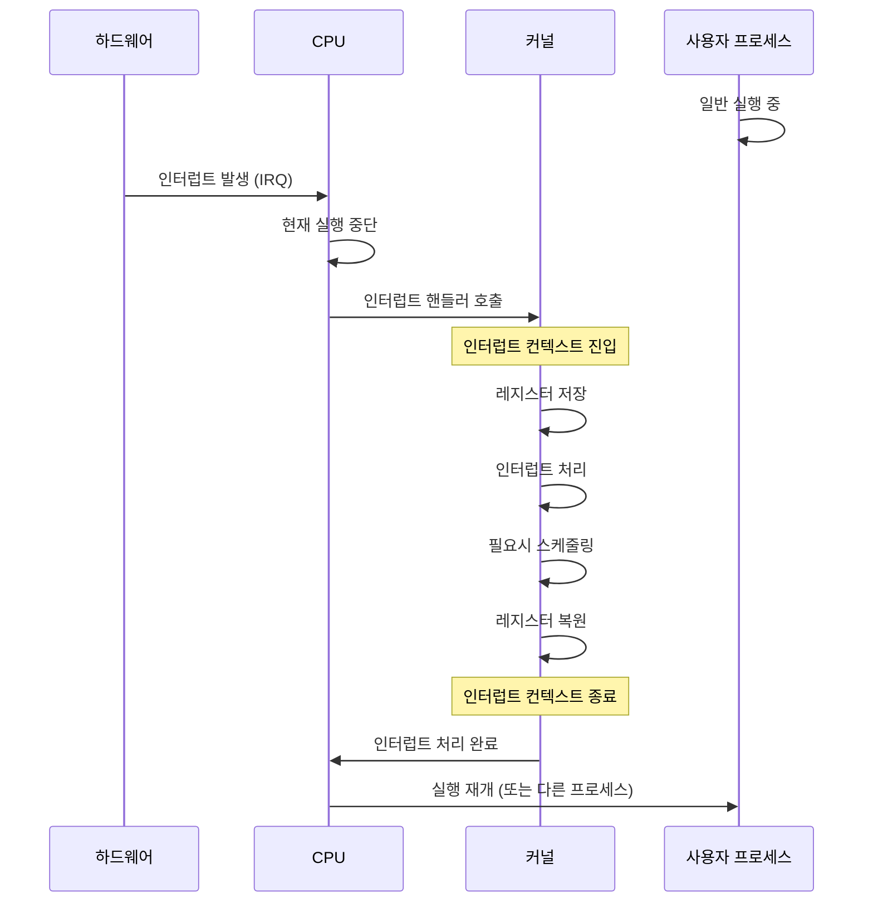
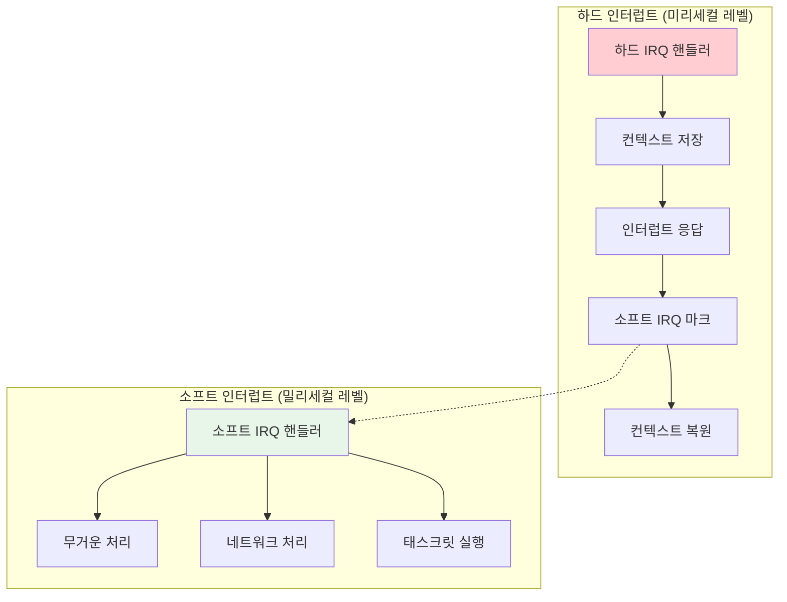
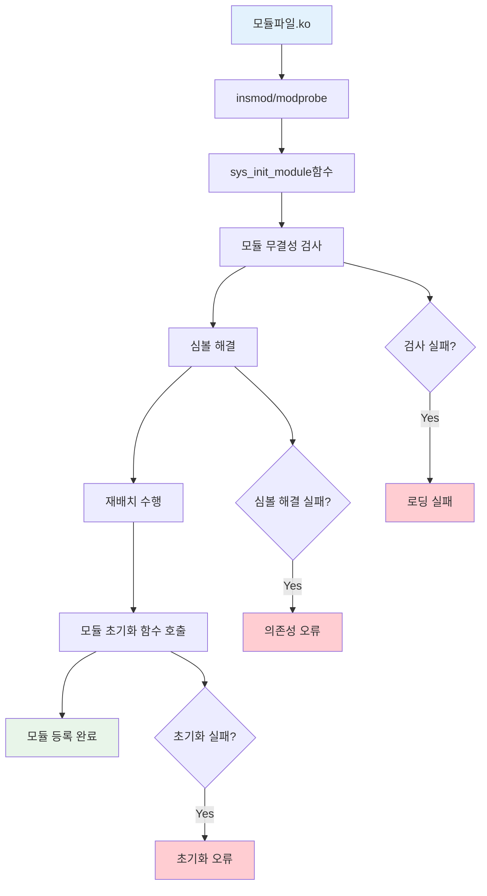

---
tags:
  - Kernel
  - Architecture
  - Linux
  - Interrupt
  - Module System
  - IRQ
  - Device Drivers
---

# Chapter 10-2C: 인터럽트 처리와 모듈 시스템

## 이 섹션에서 학습할 내용

- 커널의 인터럽트 처리 메커니즘
- 소프트 IRQ와 태스크릿의 역할
- 동적 커널 모듈 로딩 시스템
- 모듈 의존성 관리와 심볼 해결

## 들어가며: 커널의 실시간 응답

커널은 단순히 사용자 프로그램의 요청만 처리하는 것이 아닙니다. 하드웨어에서 발생하는 다양한 이벤트(인터럽트)에 실시간으로 응답해야 하며, 동시에 새로운 기능을 동적으로 추가하거나 제거할 수 있어야 합니다.

## 1. 인터럽트와 예외 처리

### 1.1 인터럽트 처리 메커니즘

인터럽트는 커널의 심장박동과 같습니다. 하드웨어 이벤트가 발생할 때마다 커널이 반응해야 합니다.



### 1.2 인터럽트 디스크립터 테이블 (IDT)

```c
// 인터럽트 디스크립터 테이블 설정
struct idt_entry {
    u16 offset_low;      // 핸들러 주소 하위 16비트
    u16 selector;        // 코드 세그먼트 셀렉터
    u8  ist;             // Interrupt Stack Table 인덱스
    u8  type_attributes; // 타입과 속성
    u16 offset_middle;   // 핸들러 주소 중간 16비트
    u32 offset_high;     // 핸들러 주소 상위 32비트
    u32 zero;           // 예약됨
};

// 주요 인터럽트/예외 벡터들
#define DIVIDE_ERROR_VECTOR         0
#define DEBUG_VECTOR                1
#define NMI_VECTOR                  2
#define BREAKPOINT_VECTOR           3
#define OVERFLOW_VECTOR             4
#define PAGE_FAULT_VECTOR          14
#define TIMER_VECTOR               32
#define KEYBOARD_VECTOR            33
#define NETWORK_VECTOR             34

// 타이머 인터럽트 핸들러 (단순화)
void timer_interrupt_handler(void) {
    // 1. 현재 태스크의 시간 슬라이스 감소
    current->time_slice--;

    // 2. 시스템 시간 업데이트
    jiffies++;
    update_wall_time();

    // 3. 스케줄러 체크
    if (current->time_slice <= 0) {
        set_need_resched();  // 스케줄링 필요 플래그
    }

    // 4. 인터럽트 확인
    send_eoi_to_apic();
}
```

### 1.3 소프트 IRQ와 태스크릿

하드 인터럽트는 빠르게 처리되어야 하므로, 무거운 작업은 소프트 IRQ로 연기됩니다:

```c
// 소프트 IRQ 종류들
enum {
    HI_SOFTIRQ = 0,        // 높은 우선순위 태스크릿
    TIMER_SOFTIRQ,         // 타이머
    NET_TX_SOFTIRQ,        // 네트워크 송신
    NET_RX_SOFTIRQ,        // 네트워크 수신
    BLOCK_SOFTIRQ,         // 블록 I/O
    IRQ_POLL_SOFTIRQ,      // I/O 폴링
    TASKLET_SOFTIRQ,       // 태스크릿
    SCHED_SOFTIRQ,         // 스케줄러
    HRTIMER_SOFTIRQ,       // 고해상도 타이머
    RCU_SOFTIRQ,           // RCU 콜백
};

// 소프트 IRQ 처리 루프
static void run_softirqs(void) {
    unsigned long pending = local_softirq_pending();

    if (pending) {
        struct softirq_action *h = softirq_vec;

        do {
            if (pending & 1) {
                h->action(h);
            }
            h++;
            pending >>= 1;
        } while (pending);
    }
}

// 네트워크 수신 소프트 IRQ 예제
static void net_rx_action(struct softirq_action *h) {
    struct net_device *dev;

    for_each_netdev_rcu(dev) {
        if (test_bit(__LINK_STATE_RX_SCHED, &dev->state)) {
            dev->netdev_ops->ndo_poll(dev);
        }
    }
}
```

### 1.4 인터럽트 처리 오버헤드 최소화



## 2. 커널 모듈 시스템

### 2.1 동적 모듈 로딩

리눅스의 강력한 기능 중 하나는 실행 중에 커널 코드를 추가/제거할 수 있다는 것입니다:

```c
// 간단한 커널 모듈 예제
#include <linux/init.h>
#include <linux/module.h>
#include <linux/kernel.h>

static int __init hello_init(void) {
    printk(KERN_INFO "Hello, Kernel World!");
    return 0;  // 0 = 성공
}

static void __exit hello_exit(void) {
    printk(KERN_INFO "Goodbye, Kernel World!");
}

module_init(hello_init);
module_exit(hello_exit);

MODULE_LICENSE("GPL");
MODULE_AUTHOR("Your Name");
MODULE_DESCRIPTION("A simple Hello World kernel module");
MODULE_VERSION("1.0");
```

### 2.2 모듈 의존성 관리

```c
// 모듈 구조체 (단순화)
struct module {
    enum module_state state;
    struct list_head list;
    char name[MODULE_NAME_LEN];

    // 심볼 정보
    const struct kernel_symbol *syms;
    const s32 *crcs;
    unsigned int num_syms;

    // 의존성
    struct list_head source_list;
    struct list_head target_list;

    // 초기화/정리 함수
    int (*init)(void);
    void (*exit)(void);

    // 참조 카운터
    atomic_t refcnt;
};

// 심볼 내보내기 매크로
#define EXPORT_SYMBOL(sym) \
    static const struct kernel_symbol __ksymtab_##sym \
    __used __section("__ksymtab") = { \
        .value = &sym, \
        .name = #sym, \
    }

// 예: 함수를 다른 모듈에서 사용할 수 있도록 내보내기
int my_function(int param) {
    return param * 2;
}
EXPORT_SYMBOL(my_function);
```

### 2.3 모듈 로딩 과정



### 2.4 모듈 심볼 해결 과정

```bash
# 모듈 로딩 시 로그 예제
$ sudo insmod hello.ko
[  123.456] hello: loading module...
[  123.457] hello: symbol resolution complete
[  123.458] hello: relocation successful
[  123.459] hello: Hello, Kernel World!
[  123.460] hello: module loaded successfully

# 모듈 의존성 확인
$ lsmod | grep hello
hello                  16384  0

# 모듈 제거
$ sudo rmmod hello
[  124.567] hello: Goodbye, Kernel World!
[  124.568] hello: module unloaded
```

## 3. 주요 인터럽트 종류와 처리

### 3.1 타이머 인터럽트

```c
// 시스템 타이머 처리
void timer_interrupt(void) {
    // 전역 타이머 카운터 증가
    jiffies_64++;
    
    // 현재 프로세스의 시간 처리
    account_process_tick(current, user_mode(regs));
    
    // 스케줄링 필요 여부 판단
    if (--current->time_slice <= 0) {
        current->time_slice = task_timeslice(current);
        set_need_resched();
    }
    
    // 프로파일링 샘플링
    profile_tick(CPU_PROFILING);
}
```

### 3.2 네트워크 인터럽트

```c
// 네트워크 카드 인터럽트 처리
irqreturn_t network_interrupt_handler(int irq, void *dev_instance) {
    struct net_device *dev = dev_instance;
    
    // 네트워크 카드에서 데이터 읽기
    if (netif_rx_schedule_prep(dev)) {
        // NAPI 폴링 활성화
        __netif_rx_schedule(dev);
    }
    
    return IRQ_HANDLED;
}

// NAPI 폴링 함수
static int napi_poll(struct napi_struct *napi, int budget) {
    struct net_device *dev = napi->dev;
    int work_done = 0;
    
    // 버째에서 패킷 처리
    while (work_done < budget) {
        struct sk_buff *skb = receive_packet(dev);
        if (!skb)
            break;
            
        netif_receive_skb(skb);
        work_done++;
    }
    
    return work_done;
}
```

### 3.3 블록 I/O 인터럽트

```c
// 디스크 I/O 완료 인터럽트
void disk_interrupt_handler(void) {
    struct request *req;
    
    // 완료된 요청 처리
    while ((req = get_completed_request()) != NULL) {
        // I/O 완료 콜백 호출
        req->end_io(req, req->errors ? -EIO : 0);
        
        // 대기 중인 프로세스 깨우기
        if (req->waiting_task) {
            wake_up_process(req->waiting_task);
        }
    }
    
    // 다음 I/O 요청 시작
    start_next_io_request();
}
```

## 핵심 요점

### 1. 인터럽트 처리의 이중 구조

하드 인터럽트는 신속한 응답을, 소프트 IRQ는 복잡한 처리를 담당하여 시스템 응답성을 보장합니다.

### 2. 모듈 시스템의 유연성

동적 모듈 로딩을 통해 시스템 재시작 없이 새로운 기능을 추가하거나 제거할 수 있습니다.

### 3. 심볼 기반 의존성 관리

EXPORT_SYMBOL 메커니즘을 통해 모듈 간 함수와 데이터 공유가 안전하게 이루어집니다.

### 4. 인터럽트 컨텍스트의 제약

인터럽트 컨텍스트에서는 스케줄링이 불가능하므로 GFP_ATOMIC 플래그를 사용해야 합니다.

---

**이전**: [02b-core-subsystems.md](02b-core-subsystems.md)  
**다음**: [02d-sync-memory-debug.md](02d-sync-memory-debug.md)에서 동기화, 메모리 관리, 디버깅 기법을 학습합니다.
