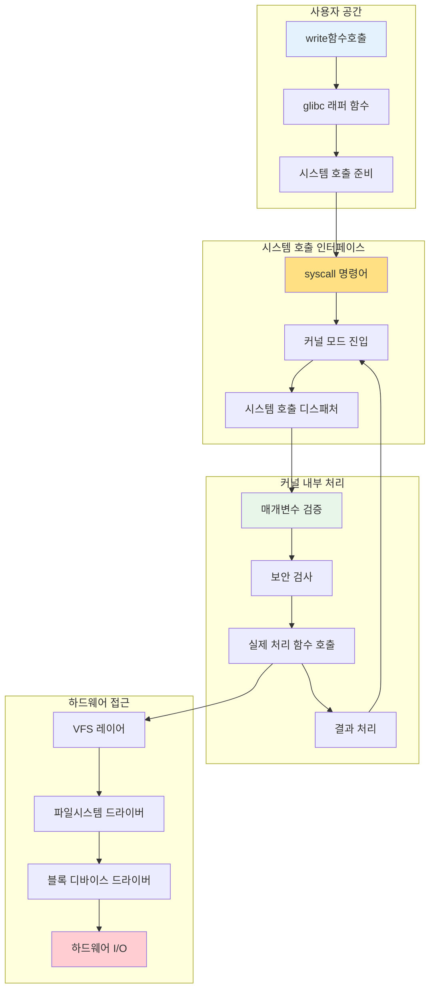
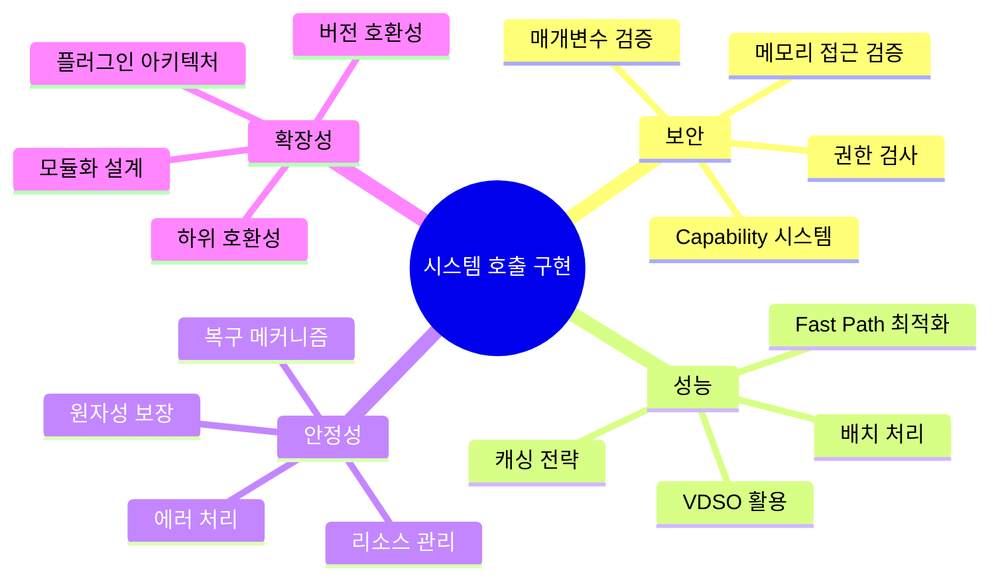

---
tags:
  - SystemCall
  - Implementation
  - Kernel
  - Performance
  - VDSO
---

# Chapter 10-3: 시스템 호출 내부 구현

## 이 문서를 읽으면 답할 수 있는 질문들

- 시스템 호출이 커널 내부에서 어떤 과정을 거쳐 처리되는가?
- 매개변수는 어떻게 검증되고 전달되는가?
- 사용자 공간과 커널 공간 간 데이터 복사는 어떻게 이루어지는가?
- errno는 언제, 어떻게 설정되는가?
- VDSO는 어떻게 시스템 호출을 최적화하는가?

## 들어가며: 시스템 호출의 여행

사용자가 `write(fd, buffer, size)`를 호출하는 순간부터 실제 하드웨어에 데이터가 쓰이기까지, 그 사이에는 복잡하면서도 정교한 메커니즘이 동작합니다. 이는 마치 편지를 보내는 과정과 같습니다 - 우편함에 넣는 순간부터 수신자에게 도달하기까지 많은 중간 과정이 필요합니다.

이 장에서는 시스템 호출의 이 복잡한 여정을 단계별로 따라가며, 각 단계에서 일어나는 일들을 상세히 탐구해보겠습니다.



## 1. 시스템 호출 테이블과 디스패처

### 1.1 시스템 호출 테이블의 구조

커널의 심장부에는 시스템 호출 번호를 실제 구현 함수로 매핑하는 거대한 테이블이 있습니다:

```c
// arch/x86/entry/syscalls/syscall_64.tbl (일부)
// NR    abi  name           entry point
#define __NR_read            0
#define __NR_write           1  
#define __NR_open            2
#define __NR_close           3
...
#define __NR_openat        257
#define __NR_copy_file_range 326

// 실제 시스템 호출 테이블 (단순화)
const sys_call_ptr_t sys_call_table[__NR_syscall_max+1] = {
    [0]   = sys_read,
    [1]   = sys_write,
    [2]   = sys_open,
    [3]   = sys_close,
    // ... 400개 이상의 시스템 호출
    [257] = sys_openat,
    [326] = sys_copy_file_range,
};

// 시스템 호출 함수 포인터 타입
typedef asmlinkage long (*sys_call_ptr_t)(const struct pt_regs *);
```

### 1.2 시스템 호출 디스패처

시스템 호출이 들어오면 커널의 디스패처가 이를 적절한 함수로 라우팅합니다:

```c
// arch/x86/entry/common.c의 핵심 로직 (단순화)
asmlinkage void do_syscall_64(unsigned long nr, struct pt_regs *regs) {
    struct thread_info *ti = current_thread_info();
    
    // 1. 시스템 호출 번호 검증
    if (unlikely(nr >= NR_syscalls)) {
        regs->ax = -ENOSYS;
        return;
    }
    
    // 2. 보안 검사 (seccomp, ptrace 등)
    nr = syscall_trace_enter(regs);
    if (nr >= NR_syscalls || nr < 0) {
        regs->ax = -ENOSYS;
        return;
    }
    
    // 3. 실제 시스템 호출 실행
    regs->ax = sys_call_table[nr](regs);
    
    // 4. 후처리 (추적, 신호 처리 등)
    syscall_trace_exit(regs);
}

// 시스템 호출 진입점 (어셈블리에서 호출)
ENTRY(entry_SYSCALL_64)
    /* 레지스터 저장 */
    movq %rax, %rdi     /* 시스템 호출 번호 */
    movq %rsp, %rsi     /* pt_regs 포인터 */
    call do_syscall_64
    /* 레지스터 복원 후 사용자 모드로 복귀 */
ENDPROC(entry_SYSCALL_64)
```

### 1.3 매개변수 전달 메커니즘

x86-64에서 시스템 호출 매개변수는 특정 레지스터를 통해 전달됩니다:

```c
// 레지스터별 매개변수 매핑
struct pt_regs {
    unsigned long r15, r14, r13, r12, bp, bx;
    unsigned long r11, r10, r9, r8;
    unsigned long ax, cx, dx, si, di;   // 시스템 호출에 사용되는 레지스터들
    unsigned long orig_ax;              // 원본 시스템 호출 번호
    unsigned long ip, cs, flags, sp, ss;
};

// 매개변수 추출 헬퍼 함수들
static inline long syscall_get_nr(struct task_struct *task, struct pt_regs *regs) {
    return regs->orig_ax;
}

static inline void syscall_get_arguments(struct task_struct *task,
                                       struct pt_regs *regs,
                                       unsigned int i, unsigned int n,
                                       unsigned long *args) {
    // x86-64 시스템 호출 ABI:
    // rdi: 1번째 인자
    // rsi: 2번째 인자  
    // rdx: 3번째 인자
    // r10: 4번째 인자 (rcx는 syscall에서 덮어씀)
    // r8:  5번째 인자
    // r9:  6번째 인자
    
    static const unsigned int reg_offset[] = {
        offsetof(struct pt_regs, di),
        offsetof(struct pt_regs, si),
        offsetof(struct pt_regs, dx),
        offsetof(struct pt_regs, r10),
        offsetof(struct pt_regs, r8),
        offsetof(struct pt_regs, r9),
    };
    
    for (unsigned int j = 0; j < n; j++) {
        args[j] = *(unsigned long *)((char *)regs + reg_offset[i + j]);
    }
}
```

## 2. 실제 시스템 호출 구현 예제

### 2.1 sys_write() 시스템 호출 분석

`write()` 시스템 호출의 전체 구현을 따라가 봅시다:

```c
// fs/read_write.c
SYSCALL_DEFINE3(write, unsigned int, fd, const char __user *, buf, size_t, count)
{
    return ksys_write(fd, buf, count);
}

// SYSCALL_DEFINE3 매크로가 실제로 생성하는 코드:
asmlinkage long sys_write(const struct pt_regs *regs)
{
    return __se_sys_write(regs->di, regs->si, regs->dx);
}

static inline long __se_sys_write(unsigned long fd, unsigned long buf, unsigned long count)
{
    return __do_sys_write((unsigned int)fd, (const char __user *)buf, (size_t)count);
}

static inline long __do_sys_write(unsigned int fd, const char __user *buf, size_t count)
{
    return ksys_write(fd, buf, count);
}

// 실제 구현
ssize_t ksys_write(unsigned int fd, const char __user *buf, size_t count)
{
    struct fd f = fdget_pos(fd);           // 파일 디스크립터 얻기
    ssize_t ret = -EBADF;
    
    if (f.file) {
        loff_t pos = file_pos_read(f.file);     // 현재 파일 위치
        ret = vfs_write(f.file, buf, count, &pos);  // VFS 레이어 호출
        if (ret >= 0)
            file_pos_write(f.file, pos);         // 파일 위치 업데이트
        fdput_pos(f);                           // 파일 디스크립터 해제
    }
    
    return ret;
}
```

### 2.2 VFS 레이어에서의 처리

```c
// fs/read_write.c
ssize_t vfs_write(struct file *file, const char __user *buf, size_t count, loff_t *pos)
{
    ssize_t ret;
    
    // 1. 기본적인 검증
    if (!(file->f_mode & FMODE_WRITE))
        return -EBADF;
    if (!(file->f_mode & FMODE_CAN_WRITE))
        return -EINVAL;
    if (unlikely(!access_ok(buf, count)))  // 사용자 메모리 접근 가능성 검사
        return -EFAULT;
    
    ret = rw_verify_area(WRITE, file, pos, count);  // 권한 검사
    if (ret)
        return ret;
    
    if (count > MAX_RW_COUNT)
        count = MAX_RW_COUNT;
    
    // 2. 실제 쓰기 연산
    if (file->f_op->write_iter) {
        // 현대적인 방식: iterator 사용
        struct iov_iter iter;
        iov_iter_init(&iter, WRITE, &iov, 1, count);
        ret = file->f_op->write_iter(&iocb, &iter);
    } else if (file->f_op->write) {
        // 전통적인 방식
        ret = file->f_op->write(file, buf, count, pos);
    } else {
        ret = -EINVAL;
    }
    
    if (ret > 0) {
        fsnotify_modify(file);          // 파일 시스템 이벤트 알림
        add_wchar(current, ret);        // 통계 업데이트
    }
    inc_syscw(current);                 // 시스템 호출 쓰기 카운터 증가
    
    return ret;
}
```

### 2.3 에러 처리와 errno 설정

```c
// 에러 처리 메커니즘
#define EBADF       9   /* Bad file number */
#define EFAULT     14   /* Bad address */
#define EINVAL     22   /* Invalid argument */
#define ENOSYS     38   /* Function not implemented */

// glibc에서 시스템 호출 래퍼가 하는 일
long syscall_wrapper(long number, ...) {
    long result = raw_syscall(number, ...);
    
    if (result < 0 && result >= -4095) {  // 에러 범위 (-4095 ~ -1)
        errno = -result;                   // errno에 양수 에러 코드 설정
        return -1;                         // 사용자에게는 -1 반환
    }
    
    return result;                         // 성공시 실제 반환값
}

// 커널 내부에서 에러 반환
ssize_t my_syscall_implementation(void) {
    if (invalid_parameter)
        return -EINVAL;    // 커널에서는 음수 에러 코드 반환
        
    if (permission_denied)
        return -EACCES;
        
    // 성공시 양수 또는 0 반환
    return bytes_processed;
}
```

## 3. 사용자-커널 공간 데이터 교환

### 3.1 메모리 접근 검증

사용자 공간의 포인터를 커널에서 사용하기 전에는 반드시 검증이 필요합니다:

```c
// include/linux/uaccess.h
static inline int access_ok(const void __user *addr, unsigned long size)
{
    return likely(__access_ok(addr, size));
}

// arch/x86/include/asm/uaccess.h
static inline int __access_ok(const void __user *addr, unsigned long size)
{
    unsigned long limit = current_thread_info()->addr_limit.seg;
    
    return (size <= limit) && (addr <= (void __user *)(limit - size));
}

// 사용 예제
SYSCALL_DEFINE3(write, unsigned int, fd, const char __user *, buf, size_t, count)
{
    // 1. 먼저 사용자 버퍼가 유효한지 검사
    if (!access_ok(buf, count))
        return -EFAULT;
    
    // 2. 이후 안전하게 사용자 데이터에 접근
    return ksys_write(fd, buf, count);
}
```

### 3.2 안전한 데이터 복사

```c
// 사용자 공간에서 커널 공간으로 복사
unsigned long copy_from_user(void *to, const void __user *from, unsigned long n)
{
    if (likely(check_copy_size(to, n, false)))
        n = raw_copy_from_user(to, from, n);
    return n;
}

// 커널 공간에서 사용자 공간으로 복사
unsigned long copy_to_user(void __user *to, const void *from, unsigned long n)
{
    if (likely(check_copy_size(from, n, true)))
        n = raw_copy_to_user(to, from, n);
    return n;
}

// 단일 값 복사 (더 효율적)
#define get_user(x, ptr) __get_user(x, ptr)
#define put_user(x, ptr) __put_user(x, ptr)

// 실제 사용 예제
long sys_example(int __user *user_int, char __user *user_buf, size_t len)
{
    int kernel_int;
    char *kernel_buf;
    
    // 1. 사용자로부터 정수값 복사
    if (get_user(kernel_int, user_int))
        return -EFAULT;
    
    // 2. 커널 버퍼 할당
    kernel_buf = kmalloc(len, GFP_KERNEL);
    if (!kernel_buf)
        return -ENOMEM;
    
    // 3. 사용자 버퍼를 커널 버퍼로 복사
    if (copy_from_user(kernel_buf, user_buf, len)) {
        kfree(kernel_buf);
        return -EFAULT;
    }
    
    // 4. 처리 수행...
    process_data(kernel_buf, len);
    
    // 5. 결과를 사용자 공간으로 복사
    if (copy_to_user(user_buf, kernel_buf, len)) {
        kfree(kernel_buf);
        return -EFAULT;
    }
    
    kfree(kernel_buf);
    return 0;
}
```

### 3.3 페이지 폴트와 예외 처리

사용자 공간 접근 중 페이지 폴트가 발생할 수 있습니다:

```c
// 예외 처리가 있는 메모리 접근
static inline unsigned long __copy_from_user_inatomic(void *to,
                                                     const void __user *from,
                                                     unsigned long n)
{
    pagefault_disable();  // 페이지 폴트 비활성화
    unsigned long ret = raw_copy_from_user(to, from, n);
    pagefault_enable();   // 페이지 폴트 재활성화
    return ret;
}

// 페이지 폴트 핸들러에서 사용자 공간 접근 예외 처리
int fixup_exception(struct pt_regs *regs)
{
    const struct exception_table_entry *fixup;
    
    fixup = search_exception_tables(regs->ip);
    if (fixup) {
        regs->ip = fixup->fixup;    // 예외 처리 코드로 점프
        return 1;
    }
    
    return 0;
}
```

## 4. 성능 최적화와 VDSO

### 4.1 VDSO (Virtual Dynamic Shared Object)

자주 사용되는 시스템 호출들을 최적화하기 위해 VDSO를 사용합니다:

```c
// arch/x86/entry/vdso/vclock_gettime.c
notrace int __vdso_gettimeofday(struct timeval *tv, struct timezone *tz)
{
    if (likely(tv != NULL)) {
        struct timespec ts;
        if (do_realtime(&ts) == VCLOCK_NONE)
            return vdso_fallback_gtod(tv, tz);  // 시스템 호출로 폴백
        
        tv->tv_sec = ts.tv_sec;
        tv->tv_usec = ts.tv_nsec / 1000;
    }
    
    if (unlikely(tz != NULL)) {
        tz->tz_minuteswest = gtod->sys_tz.tz_minuteswest;
        tz->tz_dsttime = gtod->sys_tz.tz_dsttime;
    }
    
    return 0;
}

// 시계 읽기 (시스템 호출 없이!)
notrace static int do_realtime(struct timespec *ts)
{
    unsigned long seq;
    u64 ns;
    int mode;
    
    do {
        seq = gtod_read_begin(gtod);
        mode = gtod->vclock_mode;
        
        if (mode == VCLOCK_NONE)
            return VCLOCK_NONE;
            
        ts->tv_sec = gtod->wall_time_sec;
        ns = gtod->wall_time_snsec;
        ns += vgetsns(&mode);
        ns >>= gtod->shift;
    } while (unlikely(gtod_read_retry(gtod, seq)));
    
    ts->tv_sec += __iter_div_u64_rem(ns, NSEC_PER_SEC, &ns);
    ts->tv_nsec = ns;
    
    return mode;
}
```

### 4.2 Fast Path 최적화

```c
// 빠른 경로 최적화 예제 (read 시스템 호출)
ssize_t vfs_read(struct file *file, char __user *buf, size_t count, loff_t *pos)
{
    ssize_t ret;
    
    // Fast path: 작은 읽기 요청은 빠르게 처리
    if (count <= PAGE_SIZE && (file->f_flags & O_NONBLOCK) == 0) {
        ret = file->f_op->read_iter(...);  // 직접 호출
        if (ret > 0)
            return ret;
    }
    
    // Slow path: 복잡한 처리 (버퍼링, 동기화 등)
    return generic_file_read_iter(...);
}

// 캐시 최적화
static ssize_t generic_perform_write(struct file *file,
                                    struct iov_iter *i, loff_t pos)
{
    struct address_space *mapping = file->f_mapping;
    const struct address_space_operations *a_ops = mapping->a_ops;
    
    do {
        struct page *page;
        unsigned long offset;   // 페이지 내 오프셋
        unsigned long bytes;    // 이번에 쓸 바이트 수
        size_t copied;          // 실제로 복사된 바이트 수
        void *fsdata;
        
        offset = (pos & (PAGE_SIZE - 1));
        bytes = min_t(unsigned long, PAGE_SIZE - offset, iov_iter_count(i));
        
        // 페이지 캐시에서 페이지 찾기 또는 할당
        page = grab_cache_page_write_begin(mapping, pos >> PAGE_SHIFT, flags);
        if (!page) {
            status = -ENOMEM;
            break;
        }
        
        // 사용자 데이터를 페이지로 복사
        copied = iov_iter_copy_from_user_atomic(page, i, offset, bytes);
        flush_dcache_page(page);
        
        // 페이지를 dirty로 표시하고 해제
        status = a_ops->write_end(file, mapping, pos, bytes, copied, page, fsdata);
        
        pos += copied;
        written += copied;
        
        balance_dirty_pages_ratelimited(mapping);  // 더티 페이지 관리
        
    } while (iov_iter_count(i));
    
    return written ? written : status;
}
```

## 5. 시스템 호출별 특수 처리

### 5.1 fork() 시스템 호출의 복잡성

```c
// kernel/fork.c - 프로세스 복제
SYSCALL_DEFINE0(fork)
{
#ifdef CONFIG_MMU
    return _do_fork(SIGCHLD, 0, 0, NULL, NULL, 0);
#else
    return -ENOSYS;  // MMU가 없는 시스템에서는 지원 안함
#endif
}

long _do_fork(unsigned long clone_flags,
              unsigned long stack_start,
              unsigned long stack_size,
              int __user *parent_tidptr,
              int __user *child_tidptr,
              unsigned long tls)
{
    struct task_struct *p;
    int trace = 0;
    pid_t nr;
    
    // 1. 새 태스크 구조체 복제
    p = copy_process(clone_flags, stack_start, stack_size,
                     child_tidptr, NULL, trace, tls, NUMA_NO_NODE);
    
    if (IS_ERR(p))
        return PTR_ERR(p);
    
    // 2. PID 할당
    nr = task_pid_vnr(p);
    
    if (clone_flags & CLONE_PARENT_SETTID)
        put_user(nr, parent_tidptr);
    
    // 3. 자식 프로세스 활성화
    wake_up_new_task(p);
    
    // 4. ptrace 처리
    if (unlikely(trace))
        ptrace_event_pid(trace, pid);
    
    return nr;  // 부모에게는 자식 PID 반환
}
```

### 5.2 execve() 시스템 호출

```c
// fs/exec.c
SYSCALL_DEFINE3(execve,
                const char __user *, filename,
                const char __user *const __user *, argv,
                const char __user *const __user *, envp)
{
    return do_execve(getname(filename), argv, envp);
}

static int do_execve(struct filename *filename,
                     const char __user *const __user *__argv,
                     const char __user *const __user *__envp)
{
    struct user_arg_ptr argv = { .ptr.native = __argv };
    struct user_arg_ptr envp = { .ptr.native = __envp };
    
    return do_execveat_common(AT_FDCWD, filename, argv, envp, 0);
}

// 실제 exec 처리
static int do_execveat_common(int fd, struct filename *filename,
                              struct user_arg_ptr argv,
                              struct user_arg_ptr envp,
                              int flags)
{
    struct linux_binprm *bprm;
    struct file *file;
    int retval;
    
    // 1. 실행 파일 열기
    file = do_open_execat(fd, filename, flags);
    retval = PTR_ERR(file);
    if (IS_ERR(file))
        goto out_ret;
    
    // 2. 바이너리 실행 컨텍스트 준비
    bprm = kzalloc(sizeof(*bprm), GFP_KERNEL);
    if (!bprm)
        goto out_files;
    
    retval = prepare_bprm_creds(bprm);
    if (retval)
        goto out_free;
    
    // 3. 인자와 환경변수 복사
    retval = copy_strings_kernel(1, &bprm->filename, bprm);
    if (retval < 0)
        goto out;
    
    retval = copy_strings(bprm, envp, envp);
    if (retval < 0)
        goto out;
    
    retval = copy_strings(bprm, argv, argv);
    if (retval < 0)
        goto out;
    
    // 4. 바이너리 실행
    retval = exec_binprm(bprm);
    if (retval < 0)
        goto out;
    
    return retval;
}
```

### 5.3 mmap() 시스템 호출

```c
// mm/mmap.c  
SYSCALL_DEFINE6(mmap, unsigned long, addr, unsigned long, len,
                unsigned long, prot, unsigned long, flags,
                unsigned long, fd, unsigned long, off)
{
    long retval;
    
    if (offset_in_page(off))
        return -EINVAL;
        
    retval = vm_mmap_pgoff(file, addr, len, prot, flags, off >> PAGE_SHIFT);
    return retval;
}

unsigned long vm_mmap_pgoff(struct file *file, unsigned long addr,
                           unsigned long len, unsigned long prot,
                           unsigned long flag, unsigned long pgoff)
{
    unsigned long ret;
    struct mm_struct *mm = current->mm;
    
    if (down_write_killable(&mm->mmap_sem))
        return -EINTR;
        
    ret = do_mmap_pgoff(file, addr, len, prot, flag, pgoff, &populate);
    up_write(&mm->mmap_sem);
    
    if (populate)
        mm_populate(ret, populate);
        
    return ret;
}

// 실제 메모리 매핑 수행
unsigned long do_mmap_pgoff(struct file *file, unsigned long addr,
                           unsigned long len, unsigned long prot,
                           unsigned long flags, unsigned long pgoff,
                           unsigned long *populate)
{
    struct mm_struct *mm = current->mm;
    vm_flags_t vm_flags;
    
    *populate = 0;
    
    // 1. 매개변수 검증
    if (!len)
        return -EINVAL;
    
    if (!(flags & MAP_FIXED))
        addr = round_hint_to_min(addr);
    
    len = PAGE_ALIGN(len);
    if (!len)
        return -ENOMEM;
    
    // 2. 가상 메모리 영역 찾기
    addr = get_unmapped_area(file, addr, len, pgoff, flags);
    if (offset_in_page(addr))
        return addr;
    
    // 3. VMA 생성 및 삽입
    vm_flags = calc_vm_prot_bits(prot) | calc_vm_flag_bits(flags) |
               mm->def_flags | VM_MAYREAD | VM_MAYWRITE | VM_MAYEXEC;
    
    return mmap_region(file, addr, len, vm_flags, pgoff);
}
```

## 6. 시스템 호출 성능 분석

### 6.1 성능 측정 도구

```c
// performance_benchmark.c - 시스템 호출 성능 측정
#include <stdio.h>
#include <time.h>
#include <unistd.h>
#include <sys/syscall.h>

#define ITERATIONS 1000000

void benchmark_syscall(const char* name, long (*func)(void)) {
    struct timespec start, end;
    long total_time, avg_time;
    
    // 워밍업
    for (int i = 0; i < 1000; i++) {
        func();
    }
    
    // 실제 측정
    clock_gettime(CLOCK_MONOTONIC, &start);
    for (int i = 0; i < ITERATIONS; i++) {
        func();
    }
    clock_gettime(CLOCK_MONOTONIC, &end);
    
    total_time = (end.tv_sec - start.tv_sec) * 1000000000L + 
                 (end.tv_nsec - start.tv_nsec);
    avg_time = total_time / ITERATIONS;
    
    printf("%s: %ld ns per call, ", name, avg_time);
}

// 테스트할 시스템 호출들
long test_getpid(void) { return getpid(); }
long test_gettid(void) { return syscall(SYS_gettid); }
long test_getuid(void) { return getuid(); }
long test_time(void) { return time(NULL); }

int main() {
    printf("시스템 호출 성능 벤치마크 (%d iterations), ", ITERATIONS);
    printf("==========================================, ");
    
    benchmark_syscall("getpid()", test_getpid);
    benchmark_syscall("gettid()", test_gettid);
    benchmark_syscall("getuid()", test_getuid);
    benchmark_syscall("time()", test_time);
    
    return 0;
}
```

### 6.2 시스템 호출 추적 및 프로파일링

```c
// syscall_tracer.c - 시스템 호출 추적기
#include <stdio.h>
#include <sys/ptrace.h>
#include <sys/wait.h>
#include <sys/user.h>
#include <unistd.h>

const char* syscall_names[] = {
    [0] = "read", [1] = "write", [2] = "open", [3] = "close",
    [4] = "stat", [5] = "fstat", [6] = "lstat", [7] = "poll",
    // ... 더 많은 시스템 호출들
};

void trace_syscalls(pid_t child_pid) {
    int status;
    struct user_regs_struct regs;
    int in_syscall = 0;
    
    while (1) {
        wait(&status);
        
        if (WIFEXITED(status))
            break;
            
        ptrace(PTRACE_GETREGS, child_pid, 0, &regs);
        
        if (!in_syscall) {
            // 시스템 호출 진입
            printf("syscall %s(", syscall_names[regs.orig_rax % 512]);
            printf("0x%llx, 0x%llx, 0x%llx", regs.rdi, regs.rsi, regs.rdx);
            printf(") = ");
            in_syscall = 1;
        } else {
            // 시스템 호출 종료
            printf("%lld, ", regs.rax);
            in_syscall = 0;
        }
        
        ptrace(PTRACE_SYSCALL, child_pid, 0, 0);
    }
}

int main(int argc, char** argv) {
    if (argc < 2) {
        printf("Usage: %s <command>, ", argv[0]);
        return 1;
    }
    
    pid_t child_pid = fork();
    
    if (child_pid == 0) {
        ptrace(PTRACE_TRACEME, 0, 0, 0);
        execvp(argv[1], &argv[1]);
    } else {
        trace_syscalls(child_pid);
    }
    
    return 0;
}
```

## 7. 고급 최적화 기법

### 7.1 배치 시스템 호출

```c
// 여러 작업을 하나의 시스템 호출로 처리
#include <sys/uio.h>

ssize_t efficient_write_multiple(int fd, const char* buffers[], size_t sizes[], int count) {
    struct iovec *iov = malloc(sizeof(struct iovec) * count);
    if (!iov) return -1;
    
    for (int i = 0; i < count; i++) {
        iov[i].iov_base = (void*)buffers[i];
        iov[i].iov_len = sizes[i];
    }
    
    ssize_t result = writev(fd, iov, count);  // 하나의 시스템 호출로 여러 버퍼 쓰기
    free(iov);
    return result;
}

// io_uring을 사용한 비동기 배치 처리
#ifdef HAVE_IO_URING
#include <liburing.h>

int async_batch_operations(void) {
    struct io_uring ring;
    struct io_uring_sqe *sqe;
    struct io_uring_cqe *cqe;
    
    io_uring_queue_init(256, &ring, 0);
    
    // 여러 비동기 작업을 큐에 추가
    for (int i = 0; i < 10; i++) {
        sqe = io_uring_get_sqe(&ring);
        io_uring_prep_read(sqe, fd, buffer[i], size, offset[i]);
    }
    
    // 모든 작업을 한 번에 제출
    io_uring_submit(&ring);
    
    // 결과 수집
    for (int i = 0; i < 10; i++) {
        io_uring_wait_cqe(&ring, &cqe);
        // 결과 처리
        io_uring_cqe_seen(&ring, cqe);
    }
    
    io_uring_queue_exit(&ring);
    return 0;
}
#endif
```

### 7.2 사용자 공간 캐싱

```c
// 시스템 호출 결과 캐싱
struct cached_stat {
    char path[PATH_MAX];
    struct stat st;
    time_t cache_time;
    int valid;
};

static struct cached_stat stat_cache[1024];
static int cache_size = 0;

int cached_stat(const char* path, struct stat* st) {
    time_t now = time(NULL);
    
    // 캐시에서 찾기
    for (int i = 0; i < cache_size; i++) {
        if (stat_cache[i].valid && 
            strcmp(stat_cache[i].path, path) == 0 &&
            (now - stat_cache[i].cache_time) < 5) {  // 5초 캐시
            
            *st = stat_cache[i].st;
            return 0;  // 캐시 히트 - 시스템 호출 없음!
        }
    }
    
    // 캐시 미스 - 실제 시스템 호출
    int result = stat(path, st);
    if (result == 0 && cache_size < 1024) {
        // 결과를 캐시에 저장
        strncpy(stat_cache[cache_size].path, path, PATH_MAX);
        stat_cache[cache_size].st = *st;
        stat_cache[cache_size].cache_time = now;
        stat_cache[cache_size].valid = 1;
        cache_size++;
    }
    
    return result;
}
```

## 8. 정리: 시스템 호출 구현의 핵심

### 8.1 설계 원칙들



### 8.2 성능 최적화 체크리스트

1. **시스템 호출 최소화**
   - 여러 작업을 하나로 배치
   - 캐싱으로 중복 호출 방지
   - 비동기 I/O 활용

2. **메모리 복사 최소화**
   - Zero-copy 기법 사용
   - 적절한 버퍼 크기 선택
   - mmap 활용

3. **커널 구현 최적화**
   - Fast path 제공
   - 락 경합 최소화
   - CPU 캐시 친화적 데이터 구조

4. **에러 처리 효율성**
   - 빠른 실패 (fail-fast)
   - 적절한 에러 코드 사용
   - 복구 가능한 오류와 치명적 오류 구분

## 다음 단계

다음 섹션([10-4: 커널-사용자공간 통신 메커니즘](04-communication-mechanisms.md))에서는 시스템 호출 외의 다양한 커널-사용자 공간 통신 방법들을 탐구합니다:

- procfs와 sysfs를 통한 정보 교환
- netlink 소켓을 이용한 실시간 통신
- 공유 메모리와 mmap 활용
- 신호(signal)와 eventfd 메커니즘
- BPF/eBPF 프로그래밍 기초

시스템 호출의 내부 구현을 이해했으니, 이제 더 다양하고 효율적인 커널 통신 메커니즘들을 살펴보겠습니다.
