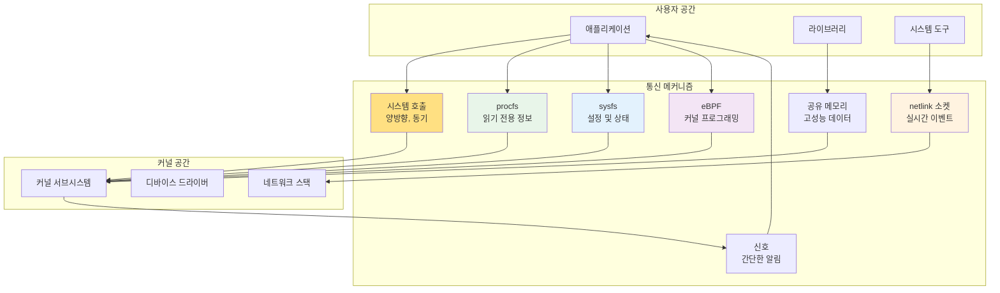
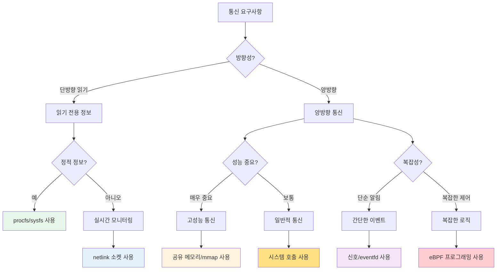

---
tags:
  - Kernel
  - UserSpace
  - Communication
  - procfs
  - sysfs
  - netlink
  - BPF
---

# Chapter 10-4: 커널-사용자공간 통신 메커니즘

## 이 문서를 읽으면 답할 수 있는 질문들

- 시스템 호출 외에 커널과 통신하는 방법은?
- /proc와 /sys 디렉토리는 어떻게 동작하는가?
- netlink 소켓은 언제, 어떻게 사용하는가?
- 공유 메모리로 커널과 통신할 수 있는가?
- eBPF는 어떻게 커널 프로그래밍을 가능하게 하는가?

## 들어가며: 다양한 소통 방법

시스템 호출이 커널과 사용자 공간 사이의 기본적인 통신 방법이라면, 다른 통신 메커니즘들은 각각 특별한 용도를 가지고 있습니다. 마치 사람들이 대화, 편지, 전화, 이메일 등 상황에 맞는 다양한 소통 방법을 사용하는 것처럼 말입니다.



이 장에서는 각각의 통신 메커니즘이 언제, 왜, 어떻게 사용되는지 실제 예제와 함께 탐구해보겠습니다.

## 1. procfs: 실행 중인 시스템의 투명한 창

### 1.1 procfs의 철학과 구조

procfs는 "Everything is a file" 철학의 완벽한 구현체입니다. 프로세스 정보, 커널 상태, 시스템 통계 등 모든 것을 파일처럼 읽을 수 있습니다.

```mermaid
graph TD
    subgraph "/proc 파일시스템"
        PROC_ROOT[/proc]
        
        subgraph "프로세스별 정보"
            PID1[/proc/1234/]
            STATUS[status]
            MAPS[maps]
            FD[fd/]
            CMDLINE[cmdline]
        end
        
        subgraph "시스템 전역 정보"
            CPUINFO[cpuinfo]
            MEMINFO[meminfo]
            VERSION[version]
            STAT[stat]
        end
        
        subgraph "커널 설정"
            SYS[sys/]
            NET_SYS[sys/net/]
            VM[sys/vm/]
        end
    end
    
    PROC_ROOT --> PID1
    PROC_ROOT --> CPUINFO
    PROC_ROOT --> SYS
    PID1 --> STATUS
    PID1 --> MAPS
    PID1 --> FD
    PID1 --> CMDLINE
    
    style PROC_ROOT fill:#E8F5E9
    style PID1 fill:#E3F2FD
    style CPUINFO fill:#FFF3E0
    style SYS fill:#F3E5F5
```

### 1.2 프로세스 정보 읽기

각 프로세스의 상세 정보를 파일로 읽을 수 있습니다:

```c
// proc_reader.c - procfs 정보 읽기 예제
#include <stdio.h>
#include <stdlib.h>
#include <unistd.h>
#include <string.h>

// 프로세스 상태 정보 읽기
void read_process_status(pid_t pid) {
    char path[256];
    char line[512];
    FILE *f;
    
    snprintf(path, sizeof(path), "/proc/%d/status", pid);
    
    f = fopen(path, "r");
    if (!f) {
        perror("fopen status");
        return;
    }
    
    printf("=== 프로세스 %d 상태 정보 ===\n", pid);
    while (fgets(line, sizeof(line), f)) {
        // 주요 정보만 출력
        if (strncmp(line, "Name:", 5) == 0 ||
            strncmp(line, "Pid:", 4) == 0 ||
            strncmp(line, "PPid:", 5) == 0 ||
            strncmp(line, "State:", 6) == 0 ||
            strncmp(line, "VmSize:", 7) == 0 ||
            strncmp(line, "VmRSS:", 6) == 0) {
            printf("%s", line);
        }
    }
    fclose(f);
}

// 프로세스 메모리 맵 읽기
void read_process_maps(pid_t pid) {
    char path[256];
    char line[512];
    FILE *f;
    
    snprintf(path, sizeof(path), "/proc/%d/maps", pid);
    
    f = fopen(path, "r");
    if (!f) {
        perror("fopen maps");
        return;
    }
    
    printf("\n=== 프로세스 %d 메모리 맵 ===\n", pid);
    int count = 0;
    while (fgets(line, sizeof(line), f) && count < 10) {  // 상위 10개만
        printf("%s", line);
        count++;
    }
    if (count == 10) printf("... (더 많은 항목 있음)\n");
    
    fclose(f);
}

// 열린 파일 디스크립터 확인
void read_process_fds(pid_t pid) {
    char path[256];
    char link_target[512];
    DIR *dir;
    struct dirent *entry;
    
    snprintf(path, sizeof(path), "/proc/%d/fd", pid);
    
    dir = opendir(path);
    if (!dir) {
        perror("opendir fd");
        return;
    }
    
    printf("\n=== 프로세스 %d 열린 파일들 ===\n", pid);
    while ((entry = readdir(dir)) != NULL) {
        if (entry->d_name[0] == '.') continue;  // ., .. 스킵
        
        char fd_path[512];
        snprintf(fd_path, sizeof(fd_path), "%s/%s", path, entry->d_name);
        
        ssize_t len = readlink(fd_path, link_target, sizeof(link_target) - 1);
        if (len > 0) {
            link_target[len] = '\0';
            printf("  fd %s -> %s\n", entry->d_name, link_target);
        }
    }
    closedir(dir);
}

int main(int argc, char *argv[]) {
    pid_t pid = getpid();  // 기본값: 자신의 PID
    
    if (argc > 1) {
        pid = atoi(argv[1]);
    }
    
    printf("프로세스 정보 분석 (PID: %d)\n", pid);
    printf("=====================================\n");
    
    read_process_status(pid);
    read_process_maps(pid);
    read_process_fds(pid);
    
    return 0;
}
```

### 1.3 시스템 전역 정보 활용

```c
// system_info.c - 시스템 정보 읽기
#include <stdio.h>
#include <stdlib.h>
#include <string.h>

// CPU 정보 파싱
void read_cpu_info() {
    FILE *f = fopen("/proc/cpuinfo", "r");
    char line[512];
    int cpu_count = 0;
    
    printf("=== CPU 정보 ===\n");
    while (fgets(line, sizeof(line), f)) {
        if (strncmp(line, "processor", 9) == 0) {
            cpu_count++;
        } else if (strncmp(line, "model name", 10) == 0 && cpu_count == 1) {
            printf("CPU 모델: %s", strchr(line, ':') + 2);
        } else if (strncmp(line, "cpu MHz", 7) == 0 && cpu_count == 1) {
            printf("CPU 속도: %s", strchr(line, ':') + 2);
        }
    }
    printf("CPU 코어 수: %d\n", cpu_count);
    fclose(f);
}

// 메모리 정보 파싱
void read_memory_info() {
    FILE *f = fopen("/proc/meminfo", "r");
    char line[512];
    
    printf("\n=== 메모리 정보 ===\n");
    while (fgets(line, sizeof(line), f)) {
        if (strncmp(line, "MemTotal:", 9) == 0 ||
            strncmp(line, "MemFree:", 8) == 0 ||
            strncmp(line, "MemAvailable:", 13) == 0 ||
            strncmp(line, "Cached:", 7) == 0 ||
            strncmp(line, "SwapTotal:", 10) == 0 ||
            strncmp(line, "SwapFree:", 9) == 0) {
            printf("%s", line);
        }
    }
    fclose(f);
}

// 시스템 통계 읽기
void read_system_stat() {
    FILE *f = fopen("/proc/stat", "r");
    char line[512];
    
    printf("\n=== 시스템 통계 ===\n");
    
    // 첫 번째 줄: 전체 CPU 시간
    if (fgets(line, sizeof(line), f)) {
        unsigned long user, nice, system, idle, iowait, irq, softirq;
        sscanf(line, "cpu %lu %lu %lu %lu %lu %lu %lu",
               &user, &nice, &system, &idle, &iowait, &irq, &softirq);
        
        unsigned long total = user + nice + system + idle + iowait + irq + softirq;
        printf("CPU 사용률:\n");
        printf("  User: %.1f%%\n", (double)user * 100 / total);
        printf("  System: %.1f%%\n", (double)system * 100 / total);
        printf("  Idle: %.1f%%\n", (double)idle * 100 / total);
        printf("  I/O Wait: %.1f%%\n", (double)iowait * 100 / total);
    }
    
    fclose(f);
}

int main() {
    read_cpu_info();
    read_memory_info();
    read_system_stat();
    return 0;
}
```

### 1.4 procfs 엔트리 생성하기

커널 모듈에서 자체 procfs 엔트리를 만들 수 있습니다:

```c
// proc_module.c - 커널 모듈에서 procfs 사용
#include <linux/init.h>
#include <linux/module.h>
#include <linux/proc_fs.h>
#include <linux/uaccess.h>
#include <linux/seq_file.h>

#define PROC_NAME "hello_proc"

static struct proc_dir_entry *proc_entry;
static int access_count = 0;

// proc 파일 읽기 (seq_file 인터페이스 사용)
static int hello_proc_show(struct seq_file *m, void *v) {
    seq_printf(m, "Hello from kernel module!\n");
    seq_printf(m, "Access count: %d\n", ++access_count);
    seq_printf(m, "Current PID: %d\n", current->pid);
    seq_printf(m, "Current command: %s\n", current->comm);
    return 0;
}

static int hello_proc_open(struct inode *inode, struct file *file) {
    return single_open(file, hello_proc_show, NULL);
}

// proc 파일 쓰기
static ssize_t hello_proc_write(struct file *file, const char __user *buffer,
                               size_t count, loff_t *pos) {
    char msg[256];
    
    if (count >= sizeof(msg))
        count = sizeof(msg) - 1;
    
    if (copy_from_user(msg, buffer, count))
        return -EFAULT;
    
    msg[count] = '\0';
    printk(KERN_INFO "proc_module: received message: %s", msg);
    
    return count;
}

// proc 파일 연산
static const struct proc_ops hello_proc_ops = {
    .proc_open = hello_proc_open,
    .proc_read = seq_read,
    .proc_write = hello_proc_write,
    .proc_lseek = seq_lseek,
    .proc_release = single_release,
};

static int __init proc_module_init(void) {
    // /proc/hello_proc 생성
    proc_entry = proc_create(PROC_NAME, 0666, NULL, &hello_proc_ops);
    if (!proc_entry) {
        printk(KERN_ERR "proc_module: failed to create proc entry\n");
        return -ENOMEM;
    }
    
    printk(KERN_INFO "proc_module: module loaded, /proc/%s created\n", PROC_NAME);
    return 0;
}

static void __exit proc_module_exit(void) {
    proc_remove(proc_entry);
    printk(KERN_INFO "proc_module: module unloaded\n");
}

module_init(proc_module_init);
module_exit(proc_module_exit);

MODULE_LICENSE("GPL");
MODULE_DESCRIPTION("procfs example module");
```

## 2. sysfs: 커널 객체의 구조화된 인터페이스

### 2.1 sysfs의 설계 철학

sysfs는 커널 객체들의 계층 구조를 파일시스템으로 표현합니다. 각 디렉토리는 커널 객체(kobject)를 나타내고, 각 파일은 그 객체의 속성을 나타냅니다.

```bash
# sysfs 구조 살펴보기
$ ls /sys/
block/  class/  dev/  devices/  firmware/  fs/  kernel/  module/  power/

# 디바이스 계층 구조
$ ls /sys/devices/
LNXSYSTM:00/  pci0000:00/  platform/  pnp0/  system/  virtual/

# 블록 디바이스 정보
$ ls /sys/block/sda/
alignment_offset  bdi/  capability  dev  device/  discard_alignment  
ext_range  holders/  inflight  queue/  range  removable  ro  size  
slaves/  stat  trace/  uevent

# 네트워크 디바이스 설정
$ ls /sys/class/net/eth0/
addr_assign_type  address  broadcast  carrier  device/  dormant  
duplex  flags  ifindex  iflink  link_mode  mtu  operstate  speed  
statistics/  tx_queue_len  type  uevent
```

### 2.2 sysfs 속성 읽기와 쓰기

```c
// sysfs_control.c - sysfs를 통한 시스템 제어
#include <stdio.h>
#include <stdlib.h>
#include <string.h>
#include <unistd.h>
#include <fcntl.h>

// CPU 주파수 제어
int set_cpu_frequency(int cpu, const char* frequency) {
    char path[256];
    int fd;
    
    snprintf(path, sizeof(path), 
             "/sys/devices/system/cpu/cpu%d/cpufreq/scaling_setspeed", cpu);
    
    fd = open(path, O_WRONLY);
    if (fd < 0) {
        perror("open scaling_setspeed");
        return -1;
    }
    
    if (write(fd, frequency, strlen(frequency)) < 0) {
        perror("write frequency");
        close(fd);
        return -1;
    }
    
    close(fd);
    printf("CPU %d 주파수를 %s로 설정했습니다.\n", cpu, frequency);
    return 0;
}

// CPU 거버너 설정
int set_cpu_governor(int cpu, const char* governor) {
    char path[256];
    int fd;
    
    snprintf(path, sizeof(path),
             "/sys/devices/system/cpu/cpu%d/cpufreq/scaling_governor", cpu);
    
    fd = open(path, O_WRONLY);
    if (fd < 0) {
        perror("open scaling_governor");
        return -1;
    }
    
    if (write(fd, governor, strlen(governor)) < 0) {
        perror("write governor");
        close(fd);
        return -1;
    }
    
    close(fd);
    printf("CPU %d 거버너를 %s로 설정했습니다.\n", cpu, governor);
    return 0;
}

// 네트워크 통계 읽기
void read_network_stats(const char* interface) {
    char path[256];
    char buffer[64];
    int fd;
    
    printf("\n=== %s 네트워크 통계 ===\n", interface);
    
    const char* stats[] = {
        "rx_bytes", "rx_packets", "rx_errors", "rx_dropped",
        "tx_bytes", "tx_packets", "tx_errors", "tx_dropped", NULL
    };
    
    for (int i = 0; stats[i]; i++) {
        snprintf(path, sizeof(path), "/sys/class/net/%s/statistics/%s", 
                 interface, stats[i]);
        
        fd = open(path, O_RDONLY);
        if (fd >= 0) {
            ssize_t len = read(fd, buffer, sizeof(buffer) - 1);
            if (len > 0) {
                buffer[len - 1] = '\0';  // 개행 제거
                printf("  %s: %s\n", stats[i], buffer);
            }
            close(fd);
        }
    }
}

// 블록 디바이스 정보 읽기
void read_block_device_info(const char* device) {
    char path[256];
    char buffer[64];
    int fd;
    
    printf("\n=== %s 블록 디바이스 정보 ===\n", device);
    
    // 디바이스 크기
    snprintf(path, sizeof(path), "/sys/block/%s/size", device);
    fd = open(path, O_RDONLY);
    if (fd >= 0) {
        ssize_t len = read(fd, buffer, sizeof(buffer) - 1);
        if (len > 0) {
            buffer[len - 1] = '\0';
            long long sectors = atoll(buffer);
            printf("  크기: %lld 섹터 (%.2f GB)\n", 
                   sectors, sectors * 512.0 / (1024*1024*1024));
        }
        close(fd);
    }
    
    // I/O 통계
    snprintf(path, sizeof(path), "/sys/block/%s/stat", device);
    fd = open(path, O_RDONLY);
    if (fd >= 0) {
        if (read(fd, buffer, sizeof(buffer) - 1) > 0) {
            unsigned long read_ios, read_sectors, write_ios, write_sectors;
            sscanf(buffer, "%lu %*u %lu %*u %lu %*u %lu", 
                   &read_ios, &read_sectors, &write_ios, &write_sectors);
            printf("  읽기: %lu 요청, %lu 섹터\n", read_ios, read_sectors);
            printf("  쓰기: %lu 요청, %lu 섹터\n", write_ios, write_sectors);
        }
        close(fd);
    }
}

int main(int argc, char *argv[]) {
    printf("sysfs 시스템 제어 및 모니터링\n");
    printf("===============================\n");
    
    // 네트워크 인터페이스가 있다면 통계 읽기
    if (access("/sys/class/net/eth0", F_OK) == 0) {
        read_network_stats("eth0");
    } else if (access("/sys/class/net/wlan0", F_OK) == 0) {
        read_network_stats("wlan0");
    }
    
    // 주 블록 디바이스 정보 읽기
    if (access("/sys/block/sda", F_OK) == 0) {
        read_block_device_info("sda");
    } else if (access("/sys/block/nvme0n1", F_OK) == 0) {
        read_block_device_info("nvme0n1");
    }
    
    return 0;
}
```

### 2.3 커널 모듈에서 sysfs 속성 생성

```c
// sysfs_module.c - sysfs 속성을 가진 커널 모듈
#include <linux/init.h>
#include <linux/module.h>
#include <linux/kernel.h>
#include <linux/kobject.h>
#include <linux/sysfs.h>
#include <linux/string.h>

static int my_value = 42;
static char my_string[64] = "Hello from kernel";

// sysfs 속성: my_value (읽기/쓰기 가능)
static ssize_t my_value_show(struct kobject *kobj, struct kobj_attribute *attr, 
                            char *buf) {
    return sprintf(buf, "%d\n", my_value);
}

static ssize_t my_value_store(struct kobject *kobj, struct kobj_attribute *attr,
                             const char *buf, size_t count) {
    int ret = kstrtoint(buf, 10, &my_value);
    if (ret < 0)
        return ret;
    return count;
}
static struct kobj_attribute my_value_attr = __ATTR_RW(my_value);

// sysfs 속성: my_string (읽기/쓰기 가능)
static ssize_t my_string_show(struct kobject *kobj, struct kobj_attribute *attr,
                             char *buf) {
    return sprintf(buf, "%s\n", my_string);
}

static ssize_t my_string_store(struct kobject *kobj, struct kobj_attribute *attr,
                              const char *buf, size_t count) {
    if (count >= sizeof(my_string))
        return -EINVAL;
    
    strncpy(my_string, buf, count);
    if (my_string[count - 1] == '\n')
        my_string[count - 1] = '\0';
    else
        my_string[count] = '\0';
    
    return count;
}
static struct kobj_attribute my_string_attr = __ATTR_RW(my_string);

// 읽기 전용 속성: 모듈 정보
static ssize_t module_info_show(struct kobject *kobj, struct kobj_attribute *attr,
                               char *buf) {
    return sprintf(buf, "Module: %s\nVersion: 1.0\nLoaded: %s", 
                   THIS_MODULE->name,
                   current_kernel_time().tv_sec);
}
static struct kobj_attribute module_info_attr = __ATTR_RO(module_info);

// 속성 그룹
static struct attribute *my_attrs[] = {
    &my_value_attr.attr,
    &my_string_attr.attr,
    &module_info_attr.attr,
    NULL,
};
static struct attribute_group my_attr_group = {
    .attrs = my_attrs,
};

static struct kobject *my_kobj;

static int __init sysfs_module_init(void) {
    int ret;
    
    // /sys/kernel/my_sysfs_module/ 디렉토리 생성
    my_kobj = kobject_create_and_add("my_sysfs_module", kernel_kobj);
    if (!my_kobj)
        return -ENOMEM;
    
    // 속성 파일들 생성
    ret = sysfs_create_group(my_kobj, &my_attr_group);
    if (ret) {
        kobject_put(my_kobj);
        return ret;
    }
    
    printk(KERN_INFO "sysfs_module: loaded, check /sys/kernel/my_sysfs_module/\n");
    return 0;
}

static void __exit sysfs_module_exit(void) {
    sysfs_remove_group(my_kobj, &my_attr_group);
    kobject_put(my_kobj);
    printk(KERN_INFO "sysfs_module: unloaded\n");
}

module_init(sysfs_module_init);
module_exit(sysfs_module_exit);

MODULE_LICENSE("GPL");
MODULE_DESCRIPTION("sysfs example module");
```

## 3. netlink 소켓: 실시간 커널 통신

### 3.1 netlink 소켓의 특징

netlink 소켓은 커널과 사용자 공간 사이의 양방향 통신을 위한 특별한 소켓입니다:

```c
// netlink_example.c - netlink 소켓 기본 사용
#include <stdio.h>
#include <stdlib.h>
#include <string.h>
#include <unistd.h>
#include <sys/socket.h>
#include <linux/netlink.h>
#include <linux/rtnetlink.h>

// 네트워크 인터페이스 변경 모니터링
void monitor_network_changes() {
    int sock;
    struct sockaddr_nl addr;
    char buffer[4096];
    struct nlmsghdr *nlh;
    struct ifinfomsg *ifi;
    
    // netlink 소켓 생성
    sock = socket(AF_NETLINK, SOCK_RAW, NETLINK_ROUTE);
    if (sock < 0) {
        perror("socket");
        return;
    }
    
    // 주소 설정
    memset(&addr, 0, sizeof(addr));
    addr.nl_family = AF_NETLINK;
    addr.nl_groups = RTMGRP_LINK | RTMGRP_IPV4_IFADDR | RTMGRP_IPV6_IFADDR;
    
    if (bind(sock, (struct sockaddr*)&addr, sizeof(addr)) < 0) {
        perror("bind");
        close(sock);
        return;
    }
    
    printf("네트워크 인터페이스 변경 모니터링 시작...\n");
    
    while (1) {
        ssize_t len = recv(sock, buffer, sizeof(buffer), 0);
        if (len < 0) {
            perror("recv");
            break;
        }
        
        // netlink 메시지 파싱
        for (nlh = (struct nlmsghdr*)buffer; 
             NLMSG_OK(nlh, len); 
             nlh = NLMSG_NEXT(nlh, len)) {
            
            switch (nlh->nlmsg_type) {
                case RTM_NEWLINK:
                    printf("인터페이스 추가/변경 이벤트\n");
                    break;
                case RTM_DELLINK:
                    printf("인터페이스 제거 이벤트\n");
                    break;
                case RTM_NEWADDR:
                    printf("IP 주소 추가 이벤트\n");
                    break;
                case RTM_DELADDR:
                    printf("IP 주소 제거 이벤트\n");
                    break;
                case NLMSG_DONE:
                    return;
                case NLMSG_ERROR:
                    printf("netlink 오류\n");
                    break;
                default:
                    printf("알 수 없는 netlink 메시지: %d\n", nlh->nlmsg_type);
            }
        }
    }
    
    close(sock);
}

// 라우팅 테이블 조회
void query_routing_table() {
    int sock;
    struct sockaddr_nl addr;
    struct {
        struct nlmsghdr nlh;
        struct rtmsg rt;
    } req;
    char buffer[4096];
    
    sock = socket(AF_NETLINK, SOCK_RAW, NETLINK_ROUTE);
    if (sock < 0) {
        perror("socket");
        return;
    }
    
    memset(&addr, 0, sizeof(addr));
    addr.nl_family = AF_NETLINK;
    
    if (bind(sock, (struct sockaddr*)&addr, sizeof(addr)) < 0) {
        perror("bind");
        close(sock);
        return;
    }
    
    // 라우팅 테이블 요청 메시지 구성
    memset(&req, 0, sizeof(req));
    req.nlh.nlmsg_len = NLMSG_LENGTH(sizeof(struct rtmsg));
    req.nlh.nlmsg_type = RTM_GETROUTE;
    req.nlh.nlmsg_flags = NLM_F_REQUEST | NLM_F_DUMP;
    req.nlh.nlmsg_seq = 1;
    req.nlh.nlmsg_pid = getpid();
    req.rt.rtm_family = AF_INET;
    req.rt.rtm_table = RT_TABLE_MAIN;
    
    if (send(sock, &req, req.nlh.nlmsg_len, 0) < 0) {
        perror("send");
        close(sock);
        return;
    }
    
    printf("라우팅 테이블:\n");
    
    while (1) {
        ssize_t len = recv(sock, buffer, sizeof(buffer), 0);
        if (len < 0) {
            perror("recv");
            break;
        }
        
        struct nlmsghdr *nlh = (struct nlmsghdr*)buffer;
        if (nlh->nlmsg_type == NLMSG_DONE)
            break;
        
        if (nlh->nlmsg_type == NLMSG_ERROR) {
            printf("netlink 오류\n");
            break;
        }
        
        // 라우팅 정보 파싱 (간단한 형태)
        if (nlh->nlmsg_type == RTM_NEWROUTE) {
            printf("  라우팅 항목 발견\n");
        }
    }
    
    close(sock);
}

int main() {
    printf("netlink 소켓 예제\n");
    printf("=================\n");
    
    query_routing_table();
    
    printf("\n네트워크 변경 모니터링 시작 (Ctrl+C로 중단):\n");
    monitor_network_changes();
    
    return 0;
}
```

### 3.2 커널 모듈에서 netlink 사용

```c
// netlink_kernel.c - 커널에서 netlink 소켓 사용
#include <linux/init.h>
#include <linux/module.h>
#include <linux/kernel.h>
#include <linux/netlink.h>
#include <linux/skbuff.h>
#include <net/sock.h>

#define NETLINK_USER_PROTOCOL 31
#define MSG_SIZE 1024

static struct sock *nl_sock = NULL;

// 사용자 공간으로 메시지 전송
static void send_to_user(int pid, const char *message) {
    struct sk_buff *skb;
    struct nlmsghdr *nlh;
    int msg_len = strlen(message);
    
    skb = nlmsg_new(msg_len, GFP_KERNEL);
    if (!skb) {
        printk(KERN_ERR "netlink_kernel: failed to allocate skb\n");
        return;
    }
    
    nlh = nlmsg_put(skb, 0, 0, NLMSG_DONE, msg_len, 0);
    if (!nlh) {
        kfree_skb(skb);
        return;
    }
    
    strcpy(nlmsg_data(nlh), message);
    
    // 특정 프로세스에게 전송
    nlmsg_unicast(nl_sock, skb, pid);
}

// 사용자 공간으로부터 메시지 수신
static void receive_from_user(struct sk_buff *skb) {
    struct nlmsghdr *nlh;
    char *user_msg;
    int pid;
    
    nlh = nlmsg_hdr(skb);
    user_msg = (char*)nlmsg_data(nlh);
    pid = nlh->nlmsg_pid;
    
    printk(KERN_INFO "netlink_kernel: received from PID %d: %s\n", pid, user_msg);
    
    // 에코 응답 전송
    char response[256];
    snprintf(response, sizeof(response), "Echo: %s", user_msg);
    send_to_user(pid, response);
}

static struct netlink_kernel_cfg cfg = {
    .input = receive_from_user,
};

static int __init netlink_kernel_init(void) {
    // netlink 소켓 생성
    nl_sock = netlink_kernel_create(&init_net, NETLINK_USER_PROTOCOL, &cfg);
    if (!nl_sock) {
        printk(KERN_ERR "netlink_kernel: failed to create netlink socket\n");
        return -ENOMEM;
    }
    
    printk(KERN_INFO "netlink_kernel: module loaded\n");
    return 0;
}

static void __exit netlink_kernel_exit(void) {
    if (nl_sock) {
        netlink_kernel_release(nl_sock);
    }
    printk(KERN_INFO "netlink_kernel: module unloaded\n");
}

module_init(netlink_kernel_init);
module_exit(netlink_kernel_exit);

MODULE_LICENSE("GPL");
MODULE_DESCRIPTION("netlink kernel module example");
```

## 4. 공유 메모리와 mmap

### 4.1 고성능 커널-사용자 통신

```c
// shared_memory_example.c - 공유 메모리를 통한 고성능 통신
#include <stdio.h>
#include <stdlib.h>
#include <string.h>
#include <unistd.h>
#include <sys/mman.h>
#include <sys/stat.h>
#include <fcntl.h>
#include <semaphore.h>
#include <sys/shm.h>

// 공유 메모리 구조체
struct shared_data {
    sem_t sem_producer;
    sem_t sem_consumer;
    int buffer[1024];
    int head;
    int tail;
    int count;
};

// 생산자: 데이터를 공유 메모리에 쓰기
void producer_process() {
    key_t key = ftok("/tmp", 65);
    int shm_id = shmget(key, sizeof(struct shared_data), IPC_CREAT | 0666);
    
    if (shm_id < 0) {
        perror("shmget");
        return;
    }
    
    struct shared_data *data = shmat(shm_id, NULL, 0);
    if (data == (void*)-1) {
        perror("shmat");
        return;
    }
    
    // 세마포어 초기화 (첫 번째 프로세스만)
    sem_init(&data->sem_producer, 1, 1024);  // 빈 슬롯 수
    sem_init(&data->sem_consumer, 1, 0);     // 데이터 개수
    data->head = data->tail = data->count = 0;
    
    printf("생산자: 데이터 생성 중...\n");
    
    for (int i = 0; i < 100; i++) {
        // 빈 슬롯 대기
        sem_wait(&data->sem_producer);
        
        // 데이터 추가
        data->buffer[data->head] = i * i;
        data->head = (data->head + 1) % 1024;
        data->count++;
        
        printf("생산: %d (총 %d개)\n", i * i, data->count);
        
        // 소비자에게 알림
        sem_post(&data->sem_consumer);
        
        usleep(10000);  // 10ms 지연
    }
    
    shmdt(data);
    printf("생산자 완료\n");
}

// 소비자: 공유 메모리에서 데이터 읽기
void consumer_process() {
    sleep(1);  // 생산자가 먼저 시작하도록 대기
    
    key_t key = ftok("/tmp", 65);
    int shm_id = shmget(key, sizeof(struct shared_data), 0666);
    
    if (shm_id < 0) {
        perror("shmget");
        return;
    }
    
    struct shared_data *data = shmat(shm_id, NULL, 0);
    if (data == (void*)-1) {
        perror("shmat");
        return;
    }
    
    printf("소비자: 데이터 처리 중...\n");
    
    int consumed = 0;
    while (consumed < 100) {
        // 데이터 대기
        sem_wait(&data->sem_consumer);
        
        // 데이터 소비
        int value = data->buffer[data->tail];
        data->tail = (data->tail + 1) % 1024;
        data->count--;
        consumed++;
        
        printf("소비: %d (남은 %d개)\n", value, data->count);
        
        // 생산자에게 빈 슬롯 알림
        sem_post(&data->sem_producer);
        
        usleep(15000);  // 15ms 지연 (생산자보다 느림)
    }
    
    shmdt(data);
    printf("소비자 완료\n");
}

int main(int argc, char *argv[]) {
    if (argc != 2) {
        printf("사용법: %s [producer|consumer]\n", argv[0]);
        return 1;
    }
    
    if (strcmp(argv[1], "producer") == 0) {
        producer_process();
    } else if (strcmp(argv[1], "consumer") == 0) {
        consumer_process();
    } else {
        printf("잘못된 인자: %s\n", argv[1]);
        return 1;
    }
    
    return 0;
}
```

### 4.2 mmap을 통한 파일 기반 통신

```c
// mmap_communication.c - mmap을 통한 파일 기반 통신
#include <stdio.h>
#include <stdlib.h>
#include <string.h>
#include <unistd.h>
#include <sys/mman.h>
#include <sys/stat.h>
#include <fcntl.h>

#define SHARED_FILE "/tmp/mmap_shared"
#define SHARED_SIZE 4096

struct message_buffer {
    int message_count;
    int read_index;
    int write_index;
    char messages[100][64];
};

// 메시지 송신자
void sender() {
    int fd = open(SHARED_FILE, O_CREAT | O_RDWR, 0666);
    if (fd < 0) {
        perror("open");
        return;
    }
    
    // 파일 크기 설정
    if (ftruncate(fd, SHARED_SIZE) < 0) {
        perror("ftruncate");
        close(fd);
        return;
    }
    
    // 메모리 매핑
    struct message_buffer *buf = mmap(NULL, SHARED_SIZE, PROT_READ | PROT_WRITE,
                                     MAP_SHARED, fd, 0);
    if (buf == MAP_FAILED) {
        perror("mmap");
        close(fd);
        return;
    }
    
    // 초기화
    memset(buf, 0, sizeof(struct message_buffer));
    
    printf("송신자: 메시지 전송 시작\n");
    
    for (int i = 0; i < 20; i++) {
        while (buf->message_count >= 100) {
            usleep(1000);  // 버퍼가 가득 찰 때까지 대기
        }
        
        snprintf(buf->messages[buf->write_index], 64, "메시지 #%d: Hello!", i);
        buf->write_index = (buf->write_index + 1) % 100;
        buf->message_count++;
        
        printf("전송: 메시지 #%d (버퍼: %d/100)\n", i, buf->message_count);
        
        usleep(100000);  // 100ms 지연
    }
    
    munmap(buf, SHARED_SIZE);
    close(fd);
    printf("송신자 완료\n");
}

// 메시지 수신자
void receiver() {
    sleep(1);  // 송신자가 먼저 시작하도록 대기
    
    int fd = open(SHARED_FILE, O_RDWR);
    if (fd < 0) {
        perror("open");
        return;
    }
    
    struct message_buffer *buf = mmap(NULL, SHARED_SIZE, PROT_READ | PROT_WRITE,
                                     MAP_SHARED, fd, 0);
    if (buf == MAP_FAILED) {
        perror("mmap");
        close(fd);
        return;
    }
    
    printf("수신자: 메시지 수신 시작\n");
    
    int received = 0;
    while (received < 20) {
        while (buf->message_count == 0) {
            usleep(1000);  // 메시지가 올 때까지 대기
        }
        
        printf("수신: %s (버퍼: %d/100)\n", 
               buf->messages[buf->read_index], buf->message_count - 1);
        
        buf->read_index = (buf->read_index + 1) % 100;
        buf->message_count--;
        received++;
        
        usleep(150000);  // 150ms 지연 (송신자보다 느림)
    }
    
    munmap(buf, SHARED_SIZE);
    close(fd);
    printf("수신자 완료\n");
}

int main(int argc, char *argv[]) {
    if (argc != 2) {
        printf("사용법: %s [sender|receiver]\n", argv[0]);
        return 1;
    }
    
    if (strcmp(argv[1], "sender") == 0) {
        sender();
    } else if (strcmp(argv[1], "receiver") == 0) {
        receiver();
    } else {
        printf("잘못된 인자: %s\n", argv[1]);
        return 1;
    }
    
    return 0;
}
```

## 5. 신호(Signal)와 eventfd

### 5.1 신호를 통한 간단한 통신

```c
// signal_communication.c - 신호를 통한 통신
#include <stdio.h>
#include <stdlib.h>
#include <signal.h>
#include <unistd.h>
#include <sys/wait.h>

static int signal_count = 0;

// 신호 핸들러
void signal_handler(int signum) {
    signal_count++;
    printf("신호 %d 수신 (총 %d번)\n", signum, signal_count);
    
    if (signum == SIGUSR1) {
        printf("  -> 사용자 정의 신호 1\n");
    } else if (signum == SIGUSR2) {
        printf("  -> 사용자 정의 신호 2\n");
    }
}

// 신호 송신자
void signal_sender(pid_t target_pid) {
    printf("신호 송신자: PID %d로 신호 전송\n", target_pid);
    
    for (int i = 0; i < 5; i++) {
        kill(target_pid, SIGUSR1);
        printf("SIGUSR1 전송 #%d\n", i + 1);
        sleep(1);
    }
    
    for (int i = 0; i < 3; i++) {
        kill(target_pid, SIGUSR2);
        printf("SIGUSR2 전송 #%d\n", i + 1);
        sleep(1);
    }
    
    // 종료 신호
    kill(target_pid, SIGTERM);
    printf("SIGTERM 전송 (종료 신호)\n");
}

// 신호 수신자
void signal_receiver() {
    printf("신호 수신자: PID %d에서 신호 대기\n", getpid());
    
    // 신호 핸들러 등록
    signal(SIGUSR1, signal_handler);
    signal(SIGUSR2, signal_handler);
    
    // SIGTERM으로 종료할 때까지 대기
    while (1) {
        pause();  // 신호가 올 때까지 대기
        
        if (signal_count >= 8) {  // SIGUSR1(5) + SIGUSR2(3)
            printf("모든 신호 수신 완료, 종료 대기...\n");
        }
    }
}

int main() {
    pid_t pid = fork();
    
    if (pid == 0) {
        // 자식 프로세스: 수신자
        signal_receiver();
    } else if (pid > 0) {
        // 부모 프로세스: 송신자
        sleep(1);  // 자식이 준비할 시간
        signal_sender(pid);
        
        // 자식 프로세스 종료 대기
        wait(NULL);
        printf("통신 완료\n");
    } else {
        perror("fork");
        return 1;
    }
    
    return 0;
}
```

### 5.2 eventfd를 통한 고성능 이벤트 통신

```c
// eventfd_communication.c - eventfd를 통한 이벤트 기반 통신
#include <stdio.h>
#include <stdlib.h>
#include <unistd.h>
#include <sys/eventfd.h>
#include <stdint.h>
#include <pthread.h>

// 생산자 스레드
void* producer_thread(void* arg) {
    int efd = *(int*)arg;
    
    printf("생산자 스레드 시작\n");
    
    for (int i = 0; i < 10; i++) {
        uint64_t value = i + 1;
        
        if (write(efd, &value, sizeof(value)) != sizeof(value)) {
            perror("write eventfd");
            break;
        }
        
        printf("생산자: 이벤트 %lu 생성\n", value);
        sleep(1);
    }
    
    printf("생산자 스레드 종료\n");
    return NULL;
}

// 소비자 스레드
void* consumer_thread(void* arg) {
    int efd = *(int*)arg;
    
    printf("소비자 스레드 시작\n");
    
    while (1) {
        uint64_t value;
        
        ssize_t ret = read(efd, &value, sizeof(value));
        if (ret != sizeof(value)) {
            if (ret == 0) {
                printf("eventfd 닫힘\n");
            } else {
                perror("read eventfd");
            }
            break;
        }
        
        printf("소비자: 이벤트 %lu 처리\n", value);
        
        if (value >= 10) {  // 마지막 이벤트
            break;
        }
    }
    
    printf("소비자 스레드 종료\n");
    return NULL;
}

int main() {
    // eventfd 생성 (세마포어 모드)
    int efd = eventfd(0, EFD_SEMAPHORE);
    if (efd == -1) {
        perror("eventfd");
        return 1;
    }
    
    printf("eventfd 생성됨: fd=%d\n", efd);
    
    pthread_t producer, consumer;
    
    // 스레드 생성
    if (pthread_create(&consumer, NULL, consumer_thread, &efd) != 0) {
        perror("pthread_create consumer");
        close(efd);
        return 1;
    }
    
    if (pthread_create(&producer, NULL, producer_thread, &efd) != 0) {
        perror("pthread_create producer");
        close(efd);
        return 1;
    }
    
    // 스레드 대기
    pthread_join(producer, NULL);
    pthread_join(consumer, NULL);
    
    close(efd);
    printf("eventfd 통신 완료\n");
    
    return 0;
}
```

## 6. eBPF: 커널 프로그래밍의 혁명

### 6.1 eBPF 기본 개념

eBPF(Extended Berkeley Packet Filter)는 사용자가 커널 내부에서 실행되는 작은 프로그램을 작성할 수 있게 해주는 혁신적인 기술입니다.

```c
// simple_ebpf.c - 간단한 eBPF 프로그램
#include <linux/bpf.h>
#include <linux/if_ether.h>
#include <linux/ip.h>
#include <linux/tcp.h>
#include <bpf/bpf_helpers.h>

// 패킷 카운터 맵
struct {
    __uint(type, BPF_MAP_TYPE_ARRAY);
    __uint(max_entries, 256);
    __type(key, __u32);
    __type(value, __u64);
} packet_count SEC(".maps");

// XDP 프로그램: 네트워크 패킷 필터링
SEC("xdp")
int packet_filter(struct xdp_md *ctx) {
    void *data_end = (void *)(long)ctx->data_end;
    void *data = (void *)(long)ctx->data;
    
    // 이더넷 헤더 검사
    struct ethhdr *eth = data;
    if ((void *)(eth + 1) > data_end)
        return XDP_PASS;
    
    // IP 패킷만 처리
    if (eth->h_proto != __constant_htons(ETH_P_IP))
        return XDP_PASS;
    
    // IP 헤더 검사
    struct iphdr *ip = (void *)(eth + 1);
    if ((void *)(ip + 1) > data_end)
        return XDP_PASS;
    
    // 패킷 카운터 업데이트
    __u32 protocol = ip->protocol;
    __u64 *count = bpf_map_lookup_elem(&packet_count, &protocol);
    if (count)
        (*count)++;
    
    // TCP 패킷 특별 처리
    if (ip->protocol == IPPROTO_TCP) {
        struct tcphdr *tcp = (void *)(ip + 1);
        if ((void *)(tcp + 1) > data_end)
            return XDP_PASS;
        
        // 특정 포트 차단 (예: 8080)
        if (tcp->dest == __constant_htons(8080)) {
            return XDP_DROP;  // 패킷 드롭
        }
    }
    
    return XDP_PASS;  // 패킷 통과
}

// 트레이스포인트 프로그램: 시스템 호출 추적
SEC("tracepoint/syscalls/sys_enter_open")
int trace_open(void *ctx) {
    char comm[16];
    bpf_get_current_comm(&comm, sizeof(comm));
    
    bpf_printk("프로세스 %s가 파일을 열었습니다\n", comm);
    return 0;
}

char LICENSE[] SEC("license") = "GPL";
```

### 6.2 eBPF 프로그램 로드와 사용

```c
// ebpf_loader.c - eBPF 프로그램 로더
#include <stdio.h>
#include <stdlib.h>
#include <unistd.h>
#include <bpf/bpf.h>
#include <bpf/libbpf.h>
#include <net/if.h>

int main(int argc, char *argv[]) {
    struct bpf_object *obj;
    struct bpf_program *prog;
    int prog_fd, map_fd;
    int ifindex;
    
    if (argc != 2) {
        printf("사용법: %s <interface>\n", argv[0]);
        return 1;
    }
    
    ifindex = if_nametoindex(argv[1]);
    if (ifindex == 0) {
        printf("인터페이스 %s를 찾을 수 없습니다\n", argv[1]);
        return 1;
    }
    
    // eBPF 오브젝트 파일 로드
    obj = bpf_object__open_file("simple_ebpf.o", NULL);
    if (libbpf_get_error(obj)) {
        printf("eBPF 오브젝트 파일을 열 수 없습니다\n");
        return 1;
    }
    
    // 커널로 로드
    if (bpf_object__load(obj)) {
        printf("eBPF 프로그램을 로드할 수 없습니다\n");
        bpf_object__close(obj);
        return 1;
    }
    
    // XDP 프로그램 찾기
    prog = bpf_object__find_program_by_name(obj, "packet_filter");
    if (!prog) {
        printf("XDP 프로그램을 찾을 수 없습니다\n");
        bpf_object__close(obj);
        return 1;
    }
    
    prog_fd = bpf_program__fd(prog);
    
    // 네트워크 인터페이스에 XDP 프로그램 연결
    if (bpf_set_link_xdp_fd(ifindex, prog_fd, 0) < 0) {
        printf("XDP 프로그램을 인터페이스에 연결할 수 없습니다\n");
        bpf_object__close(obj);
        return 1;
    }
    
    printf("eBPF 프로그램이 %s에 연결되었습니다\n", argv[1]);
    
    // 맵 찾기
    struct bpf_map *map = bpf_object__find_map_by_name(obj, "packet_count");
    if (map) {
        map_fd = bpf_map__fd(map);
        
        printf("패킷 통계 모니터링 중... (Ctrl+C로 중단)\n");
        
        while (1) {
            sleep(5);
            
            printf("\n=== 패킷 통계 ===\n");
            for (__u32 key = 0; key < 256; key++) {
                __u64 value;
                if (bpf_map_lookup_elem(map_fd, &key, &value) == 0 && value > 0) {
                    const char *protocol_name = "알 수 없음";
                    switch (key) {
                        case IPPROTO_TCP: protocol_name = "TCP"; break;
                        case IPPROTO_UDP: protocol_name = "UDP"; break;
                        case IPPROTO_ICMP: protocol_name = "ICMP"; break;
                    }
                    printf("프로토콜 %s (ID %u): %llu 패킷\n", 
                           protocol_name, key, value);
                }
            }
        }
    }
    
    // 정리
    bpf_set_link_xdp_fd(ifindex, -1, 0);  // XDP 프로그램 해제
    bpf_object__close(obj);
    
    return 0;
}
```

## 7. 정리: 통신 메커니즘 선택 가이드

### 7.1 사용 사례별 최적 선택



### 7.2 성능 비교

| 메커니즘 | 지연시간 | 처리량 | 복잡도 | 사용 사례 |
|----------|----------|---------|---------|-----------|
| 시스템 호출 | 중간 (100-300ns) | 중간 | 낮음 | 일반적인 커널 서비스 |
| procfs | 높음 (μs 단위) | 낮음 | 낮음 | 디버깅, 모니터링 |
| sysfs | 높음 (μs 단위) | 낮음 | 낮음 | 설정, 제어 |
| netlink | 중간 (μs 단위) | 높음 | 중간 | 실시간 이벤트 |
| 공유 메모리 | 낮음 (10-50ns) | 매우 높음 | 높음 | 고성능 데이터 교환 |
| 신호 | 높음 (ms 단위) | 낮음 | 낮음 | 간단한 알림 |
| eventfd | 낮음 (100ns) | 높음 | 낮음 | 이벤트 기반 통신 |
| eBPF | 매우 낮음 (<10ns) | 매우 높음 | 매우 높음 | 커널 내 프로그래밍 |

### 7.3 실무 권장사항

1. **개발 초기: procfs/sysfs**
   - 프로토타입과 디버깅에 최적
   - 빠른 구현과 테스트 가능

2. **프로덕션: 시스템 호출**
   - 안정성과 성능의 균형
   - 표준적이고 포팅 가능

3. **고성능 요구: 공유 메모리**
   - 대용량 데이터 교환
   - 실시간 시스템

4. **이벤트 처리: netlink/eventfd**
   - 비동기 이벤트 처리
   - 상태 변경 알림

5. **고급 기능: eBPF**
   - 네트워크 패킷 처리
   - 시스템 모니터링
   - 보안 필터링

## 다음 단계

이제 Chapter 10의 이론적 기초가 완성되었습니다. 다음 섹션들에서는 이런 지식을 바탕으로 실전 디버깅 기법들을 다룰 예정입니다:

- [10-5: 시스템 호출 추적](05-system-call-tracing.md) - strace, ptrace를 이용한 실전 디버깅
- [10-6: 커널 디버깅 기법](06-kernel-debugging-techniques.md) - eBPF, ftrace를 활용한 고급 추적
- [10-7: 성능 프로파일링 도구](07-performance-profiling-tools.md) - 프로덕션 환경 디버깅

커널과 사용자 공간 사이의 다양한 통신 메커니즘을 이해했으니, 이제 이를 활용한 고급 디버깅 기법들을 탐구해보겠습니다.
