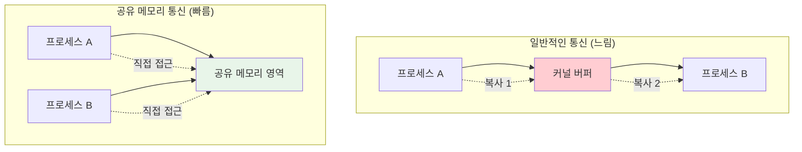

---
tags:
  - Kernel
  - UserSpace
  - SharedMemory
  - mmap
  - Performance
---

# Chapter 10-4c: 공유 메모리와 mmap - 고성능 커널 통신

## 🎯 이 문서를 읽고 나면 얻을 수 있는 것들

이 문서를 마스터하면, 여러분은:

1. **"공유 메모리가 왜 빠른가요?"** - 메모리 기반 통신의 성능 이점을 이해합니다
2. **"mmap은 어떻게 동작하나요?"** - 메모리 매핑의 원리와 활용법을 배웁니다
3. **"프로세스 간 어떻게 데이터를 공유하나요?"** - 공유 메모리 프로그래밍 기법을 익힙니다
4. **"동기화는 어떻게 처리하나요?"** - 세마포어와 뮤텍스를 활용한 안전한 공유를 배웁니다

## 1. 공유 메모리와 mmap 개념

### 1.1 고성능 커널-사용자 통신의 필요성

일반적인 시스템 호출이나 파이프 통신은 데이터를 여러 번 복사해야 하지만, 공유 메모리는 같은 물리 메모리 영역을 여러 프로세스가 직접 접근할 수 있게 해줍니다.



### 1.2 공유 메모리 구현 방식

```c
// shared_memory_example.c - 공유 메모리를 통한 고성능 통신
#include <stdio.h>
#include <stdlib.h>
#include <string.h>
#include <unistd.h>
#include <sys/mman.h>
#include <sys/stat.h>
#include <fcntl.h>
#include <semaphore.h>
#include <sys/shm.h>

// 공유 메모리 구조체
struct shared_data {
    sem_t sem_producer;
    sem_t sem_consumer;
    int buffer[1024];
    int head;
    int tail;
    int count;
};

// 생산자: 데이터를 공유 메모리에 쓰기
void producer_process() {
    key_t key = ftok("/tmp", 65);
    int shm_id = shmget(key, sizeof(struct shared_data), IPC_CREAT | 0666);
    
    if (shm_id < 0) {
        perror("shmget");
        return;
    }
    
    struct shared_data *data = shmat(shm_id, NULL, 0);
    if (data == (void*)-1) {
        perror("shmat");
        return;
    }
    
    // 세마포어 초기화 (첫 번째 프로세스만)
    sem_init(&data->sem_producer, 1, 1024);  // 빈 슬롯 수
    sem_init(&data->sem_consumer, 1, 0);     // 데이터 개수
    data->head = data->tail = data->count = 0;
    
    printf("생산자: 데이터 생성 중...\n");
    
    for (int i = 0; i < 100; i++) {
        // 빈 슬롯 대기
        sem_wait(&data->sem_producer);
        
        // 데이터 추가
        data->buffer[data->head] = i * i;
        data->head = (data->head + 1) % 1024;
        data->count++;
        
        printf("생산: %d (총 %d개)\n", i * i, data->count);
        
        // 소비자에게 알림
        sem_post(&data->sem_consumer);
        
        usleep(10000);  // 10ms 지연
    }
    
    shmdt(data);
    printf("생산자 완료\n");
}

// 소비자: 공유 메모리에서 데이터 읽기
void consumer_process() {
    sleep(1);  // 생산자가 먼저 시작하도록 대기
    
    key_t key = ftok("/tmp", 65);
    int shm_id = shmget(key, sizeof(struct shared_data), 0666);
    
    if (shm_id < 0) {
        perror("shmget");
        return;
    }
    
    struct shared_data *data = shmat(shm_id, NULL, 0);
    if (data == (void*)-1) {
        perror("shmat");
        return;
    }
    
    printf("소비자: 데이터 처리 중...\n");
    
    int consumed = 0;
    while (consumed < 100) {
        // 데이터 대기
        sem_wait(&data->sem_consumer);
        
        // 데이터 소비
        int value = data->buffer[data->tail];
        data->tail = (data->tail + 1) % 1024;
        data->count--;
        consumed++;
        
        printf("소비: %d (남은 %d개)\n", value, data->count);
        
        // 생산자에게 빈 슬롯 알림
        sem_post(&data->sem_producer);
        
        usleep(15000);  // 15ms 지연 (생산자보다 느림)
    }
    
    shmdt(data);
    printf("소비자 완료\n");
}

int main(int argc, char *argv[]) {
    if (argc != 2) {
        printf("사용법: %s [producer|consumer]\n", argv[0]);
        return 1;
    }
    
    if (strcmp(argv[1], "producer") == 0) {
        producer_process();
    } else if (strcmp(argv[1], "consumer") == 0) {
        consumer_process();
    } else {
        printf("잘못된 인자: %s\n", argv[1]);
        return 1;
    }
    
    return 0;
}
```

## 2. mmap을 통한 파일 기반 통신

### 2.1 메모리 매핑의 원리

mmap은 파일을 메모리 주소 공간에 직접 매핑하여, 파일 I/O를 메모리 접근처럼 수행할 수 있게 해줍니다.

```c
// mmap_communication.c - mmap을 통한 파일 기반 통신
#include <stdio.h>
#include <stdlib.h>
#include <string.h>
#include <unistd.h>
#include <sys/mman.h>
#include <sys/stat.h>
#include <fcntl.h>

#define SHARED_FILE "/tmp/mmap_shared"
#define SHARED_SIZE 4096

struct message_buffer {
    int message_count;
    int read_index;
    int write_index;
    char messages[100][64];
};

// 메시지 송신자
void sender() {
    int fd = open(SHARED_FILE, O_CREAT | O_RDWR, 0666);
    if (fd < 0) {
        perror("open");
        return;
    }
    
    // 파일 크기 설정
    if (ftruncate(fd, SHARED_SIZE) < 0) {
        perror("ftruncate");
        close(fd);
        return;
    }
    
    // 메모리 매핑
    struct message_buffer *buf = mmap(NULL, SHARED_SIZE, PROT_READ | PROT_WRITE,
                                     MAP_SHARED, fd, 0);
    if (buf == MAP_FAILED) {
        perror("mmap");
        close(fd);
        return;
    }
    
    // 초기화
    memset(buf, 0, sizeof(struct message_buffer));
    
    printf("송신자: 메시지 전송 시작\n");
    
    for (int i = 0; i < 20; i++) {
        while (buf->message_count >= 100) {
            usleep(1000);  // 버퍼가 가득 찰 때까지 대기
        }
        
        snprintf(buf->messages[buf->write_index], 64, "메시지 #%d: Hello!", i);
        buf->write_index = (buf->write_index + 1) % 100;
        buf->message_count++;
        
        printf("전송: 메시지 #%d (버퍼: %d/100)\n", i, buf->message_count);
        
        usleep(100000);  // 100ms 지연
    }
    
    munmap(buf, SHARED_SIZE);
    close(fd);
    printf("송신자 완료\n");
}

// 메시지 수신자
void receiver() {
    sleep(1);  // 송신자가 먼저 시작하도록 대기
    
    int fd = open(SHARED_FILE, O_RDWR);
    if (fd < 0) {
        perror("open");
        return;
    }
    
    struct message_buffer *buf = mmap(NULL, SHARED_SIZE, PROT_READ | PROT_WRITE,
                                     MAP_SHARED, fd, 0);
    if (buf == MAP_FAILED) {
        perror("mmap");
        close(fd);
        return;
    }
    
    printf("수신자: 메시지 수신 시작\n");
    
    int received = 0;
    while (received < 20) {
        while (buf->message_count == 0) {
            usleep(1000);  // 메시지가 올 때까지 대기
        }
        
        printf("수신: %s (버퍼: %d/100)\n", 
               buf->messages[buf->read_index], buf->message_count - 1);
        
        buf->read_index = (buf->read_index + 1) % 100;
        buf->message_count--;
        received++;
        
        usleep(150000);  // 150ms 지연 (송신자보다 느림)
    }
    
    munmap(buf, SHARED_SIZE);
    close(fd);
    printf("수신자 완료\n");
}

int main(int argc, char *argv[]) {
    if (argc != 2) {
        printf("사용법: %s [sender|receiver]\n", argv[0]);
        return 1;
    }
    
    if (strcmp(argv[1], "sender") == 0) {
        sender();
    } else if (strcmp(argv[1], "receiver") == 0) {
        receiver();
    } else {
        printf("잘못된 인자: %s\n", argv[1]);
        return 1;
    }
    
    return 0;
}
```

### 2.2 익명 메모리 매핑과 프로세스 간 공유

```c
// anonymous_mmap.c - 익명 메모리 매핑을 통한 부모-자식 프로세스 통신
#include <stdio.h>
#include <stdlib.h>
#include <string.h>
#include <unistd.h>
#include <sys/mman.h>
#include <sys/wait.h>
#include <semaphore.h>

struct shared_counter {
    sem_t mutex;
    int counter;
    int max_count;
    char log[1000][64];
};

void child_process(struct shared_counter *shared) {
    printf("자식 프로세스: PID %d 시작\n", getpid());
    
    for (int i = 0; i < 10; i++) {
        // 뮤텍스로 임계 영역 보호
        sem_wait(&shared->mutex);
        
        // 공유 카운터 증가
        int old_value = shared->counter;
        shared->counter++;
        
        // 로그 기록
        snprintf(shared->log[shared->counter], 64, 
                "Child PID %d: %d -> %d", getpid(), old_value, shared->counter);
        
        printf("자식: 카운터 %d -> %d\n", old_value, shared->counter);
        
        sem_post(&shared->mutex);
        
        usleep(50000);  // 50ms 지연
    }
    
    printf("자식 프로세스 종료\n");
}

void parent_process(struct shared_counter *shared) {
    printf("부모 프로세스: PID %d 시작\n", getpid());
    
    for (int i = 0; i < 15; i++) {
        sem_wait(&shared->mutex);
        
        int old_value = shared->counter;
        shared->counter += 2;  // 부모는 2씩 증가
        
        snprintf(shared->log[shared->counter], 64,
                "Parent PID %d: %d -> %d", getpid(), old_value, shared->counter);
        
        printf("부모: 카운터 %d -> %d\n", old_value, shared->counter);
        
        sem_post(&shared->mutex);
        
        usleep(70000);  // 70ms 지연
    }
    
    printf("부모 프로세스 작업 완료\n");
}

int main() {
    // 익명 공유 메모리 생성
    struct shared_counter *shared = mmap(NULL, sizeof(struct shared_counter),
                                        PROT_READ | PROT_WRITE,
                                        MAP_SHARED | MAP_ANONYMOUS, -1, 0);
    
    if (shared == MAP_FAILED) {
        perror("mmap");
        return 1;
    }
    
    // 공유 데이터 초기화
    sem_init(&shared->mutex, 1, 1);  // 프로세스 간 공유 뮤텍스
    shared->counter = 0;
    shared->max_count = 100;
    memset(shared->log, 0, sizeof(shared->log));
    
    printf("익명 mmap 공유 메모리 통신 시작\n");
    printf("===================================\n");
    
    pid_t pid = fork();
    
    if (pid == 0) {
        // 자식 프로세스
        child_process(shared);
    } else if (pid > 0) {
        // 부모 프로세스
        parent_process(shared);
        
        // 자식 프로세스 종료 대기
        wait(NULL);
        
        // 최종 결과 출력
        printf("\n=== 최종 결과 ===\n");
        printf("최종 카운터 값: %d\n", shared->counter);
        
        printf("\n=== 실행 로그 ===\n");
        for (int i = 1; i <= shared->counter && i < 100; i++) {
            if (strlen(shared->log[i]) > 0) {
                printf("%s\n", shared->log[i]);
            }
        }
        
        // 정리
        sem_destroy(&shared->mutex);
        munmap(shared, sizeof(struct shared_counter));
        
    } else {
        perror("fork");
        munmap(shared, sizeof(struct shared_counter));
        return 1;
    }
    
    return 0;
}
```

## 3. 고성능 데이터 교환 패턴

### 3.1 링 버퍼 구현

```c
// ring_buffer_shared.c - 고성능 링 버퍼 공유 메모리
#include <stdio.h>
#include <stdlib.h>
#include <string.h>
#include <unistd.h>
#include <sys/mman.h>
#include <sys/stat.h>
#include <fcntl.h>
#include <stdatomic.h>
#include <pthread.h>

#define BUFFER_SIZE 4096
#define ELEMENT_SIZE 64
#define MAX_ELEMENTS (BUFFER_SIZE / ELEMENT_SIZE)

// 무잠금 링 버퍼 구조체
struct lockfree_ring_buffer {
    atomic_int head;        // 생산자 인덱스
    atomic_int tail;        // 소비자 인덱스
    atomic_int count;       // 현재 원소 개수
    char data[MAX_ELEMENTS][ELEMENT_SIZE];
    
    // 성능 통계
    atomic_long total_produced;
    atomic_long total_consumed;
    atomic_long producer_blocks;
    atomic_long consumer_blocks;
};

// 무잠금 큐에 데이터 추가
int ring_buffer_push(struct lockfree_ring_buffer *rb, const char *data) {
    while (1) {
        int current_count = atomic_load(&rb->count);
        
        // 버퍼가 가득 찬 경우
        if (current_count >= MAX_ELEMENTS) {
            atomic_fetch_add(&rb->producer_blocks, 1);
            usleep(100);  // 잠시 대기
            continue;
        }
        
        // 헤드 인덱스 증가 시도
        int head = atomic_load(&rb->head);
        int next_head = (head + 1) % MAX_ELEMENTS;
        
        if (atomic_compare_exchange_weak(&rb->head, &head, next_head)) {
            // 성공적으로 슬롯 확보
            strcpy(rb->data[head], data);
            atomic_fetch_add(&rb->count, 1);
            atomic_fetch_add(&rb->total_produced, 1);
            return 1;
        }
        
        // CAS 실패 시 다시 시도
    }
}

// 무잠금 큐에서 데이터 제거
int ring_buffer_pop(struct lockfree_ring_buffer *rb, char *data) {
    while (1) {
        int current_count = atomic_load(&rb->count);
        
        // 버퍼가 비어있는 경우
        if (current_count <= 0) {
            atomic_fetch_add(&rb->consumer_blocks, 1);
            usleep(100);  // 잠시 대기
            return 0;  // 데이터 없음
        }
        
        // 테일 인덱스 증가 시도
        int tail = atomic_load(&rb->tail);
        int next_tail = (tail + 1) % MAX_ELEMENTS;
        
        if (atomic_compare_exchange_weak(&rb->tail, &tail, next_tail)) {
            // 성공적으로 데이터 획득
            strcpy(data, rb->data[tail]);
            atomic_fetch_sub(&rb->count, 1);
            atomic_fetch_add(&rb->total_consumed, 1);
            return 1;
        }
        
        // CAS 실패 시 다시 시도
    }
}

// 고성능 생산자
void* high_performance_producer(void *arg) {
    struct lockfree_ring_buffer *rb = (struct lockfree_ring_buffer*)arg;
    char message[ELEMENT_SIZE];
    
    printf("고성능 생산자 시작 (스레드 ID: %lu)\n", pthread_self());
    
    for (int i = 0; i < 10000; i++) {
        snprintf(message, ELEMENT_SIZE, "Message #%d from producer %lu", 
                i, pthread_self());
        
        ring_buffer_push(rb, message);
        
        if (i % 1000 == 0) {
            printf("생산자: %d개 메시지 전송\n", i);
        }
    }
    
    printf("생산자 완료\n");
    return NULL;
}

// 고성능 소비자
void* high_performance_consumer(void *arg) {
    struct lockfree_ring_buffer *rb = (struct lockfree_ring_buffer*)arg;
    char message[ELEMENT_SIZE];
    int consumed = 0;
    
    printf("고성능 소비자 시작 (스레드 ID: %lu)\n", pthread_self());
    
    while (consumed < 10000) {
        if (ring_buffer_pop(rb, message)) {
            consumed++;
            
            if (consumed % 1000 == 0) {
                printf("소비자: %d개 메시지 처리\n", consumed);
            }
        }
    }
    
    printf("소비자 완료\n");
    return NULL;
}

int main() {
    // 공유 메모리 생성
    int fd = shm_open("/high_perf_ring", O_CREAT | O_RDWR, 0666);
    if (fd < 0) {
        perror("shm_open");
        return 1;
    }
    
    if (ftruncate(fd, sizeof(struct lockfree_ring_buffer)) < 0) {
        perror("ftruncate");
        close(fd);
        return 1;
    }
    
    struct lockfree_ring_buffer *rb = mmap(NULL, sizeof(struct lockfree_ring_buffer),
                                          PROT_READ | PROT_WRITE, MAP_SHARED, fd, 0);
    
    if (rb == MAP_FAILED) {
        perror("mmap");
        close(fd);
        return 1;
    }
    
    // 링 버퍼 초기화
    atomic_init(&rb->head, 0);
    atomic_init(&rb->tail, 0);
    atomic_init(&rb->count, 0);
    atomic_init(&rb->total_produced, 0);
    atomic_init(&rb->total_consumed, 0);
    atomic_init(&rb->producer_blocks, 0);
    atomic_init(&rb->consumer_blocks, 0);
    
    printf("무잠금 링 버퍼 성능 테스트 시작\n");
    printf("버퍼 크기: %d 원소\n", MAX_ELEMENTS);
    printf("==================================\n");
    
    // 성능 테스트
    struct timespec start, end;
    clock_gettime(CLOCK_MONOTONIC, &start);
    
    // 생산자/소비자 스레드 생성
    pthread_t producer_thread, consumer_thread;
    
    pthread_create(&consumer_thread, NULL, high_performance_consumer, rb);
    pthread_create(&producer_thread, NULL, high_performance_producer, rb);
    
    // 스레드 완료 대기
    pthread_join(producer_thread, NULL);
    pthread_join(consumer_thread, NULL);
    
    clock_gettime(CLOCK_MONOTONIC, &end);
    
    // 성능 통계 출력
    double elapsed = (end.tv_sec - start.tv_sec) + 
                    (end.tv_nsec - start.tv_nsec) / 1000000000.0;
    
    printf("\n=== 성능 결과 ===\n");
    printf("총 실행 시간: %.3f 초\n", elapsed);
    printf("총 생산된 메시지: %ld\n", atomic_load(&rb->total_produced));
    printf("총 소비된 메시지: %ld\n", atomic_load(&rb->total_consumed));
    printf("생산자 블록 횟수: %ld\n", atomic_load(&rb->producer_blocks));
    printf("소비자 블록 횟수: %ld\n", atomic_load(&rb->consumer_blocks));
    printf("처리량: %.0f 메시지/초\n", 
           atomic_load(&rb->total_consumed) / elapsed);
    
    // 정리
    munmap(rb, sizeof(struct lockfree_ring_buffer));
    close(fd);
    shm_unlink("/high_perf_ring");
    
    return 0;
}
```

### 3.2 NUMA 인식 메모리 할당

```c
// numa_aware_shared.c - NUMA 환경에서의 최적화된 공유 메모리
#include <stdio.h>
#include <stdlib.h>
#include <string.h>
#include <unistd.h>
#include <sys/mman.h>
#include <numa.h>
#include <numaif.h>
#include <pthread.h>

#define SHARED_SIZE (4096 * 1024)  // 4MB

// NUMA 노드별 공유 데이터
struct numa_shared_data {
    int node_id;
    void *data_ptr;
    size_t data_size;
    pthread_mutex_t mutex;
    long operation_count;
};

// NUMA 인식 메모리 할당
void* allocate_numa_memory(int node, size_t size) {
    if (!numa_available()) {
        printf("NUMA가 사용 불가능합니다\n");
        return mmap(NULL, size, PROT_READ | PROT_WRITE,
                   MAP_SHARED | MAP_ANONYMOUS, -1, 0);
    }
    
    // 특정 NUMA 노드에 메모리 할당
    void *ptr = mmap(NULL, size, PROT_READ | PROT_WRITE,
                    MAP_SHARED | MAP_ANONYMOUS, -1, 0);
    
    if (ptr == MAP_FAILED) {
        perror("mmap");
        return NULL;
    }
    
    // NUMA 노드에 바인딩
    unsigned long nodemask = 1UL << node;
    if (mbind(ptr, size, MPOL_BIND, &nodemask, sizeof(nodemask) * 8, 0) < 0) {
        perror("mbind");
        // 바인딩 실패해도 일반 메모리로 사용
    }
    
    printf("NUMA 노드 %d에 %zu바이트 메모리 할당\n", node, size);
    return ptr;
}

// NUMA 노드별 작업자 스레드
void* numa_worker(void *arg) {
    struct numa_shared_data *shared = (struct numa_shared_data*)arg;
    
    // 현재 스레드를 해당 NUMA 노드에 바인딩
    if (numa_available()) {
        struct bitmask *mask = numa_allocate_nodemask();
        numa_bitmask_setbit(mask, shared->node_id);
        numa_sched_setaffinity(0, mask);
        numa_free_nodemask(mask);
        
        printf("스레드 %lu가 NUMA 노드 %d에 바인딩됨\n", 
               pthread_self(), shared->node_id);
    }
    
    // 로컬 노드 메모리에 집중적인 작업 수행
    char *data = (char*)shared->data_ptr;
    
    for (int i = 0; i < 100000; i++) {
        pthread_mutex_lock(&shared->mutex);
        
        // 메모리 집약적 작업 (패턴 쓰기/읽기)
        for (int j = 0; j < 1024; j++) {
            data[j] = (char)(i + j) % 256;
        }
        
        // 검증을 위한 읽기
        int sum = 0;
        for (int j = 0; j < 1024; j++) {
            sum += data[j];
        }
        
        shared->operation_count++;
        
        pthread_mutex_unlock(&shared->mutex);
        
        if (i % 10000 == 0) {
            printf("노드 %d: %d번째 반복 완료\n", shared->node_id, i);
        }
    }
    
    printf("NUMA 노드 %d 작업자 완료 (총 %ld 연산)\n", 
           shared->node_id, shared->operation_count);
    
    return NULL;
}

int main() {
    printf("NUMA 인식 공유 메모리 테스트\n");
    printf("============================\n");
    
    // NUMA 시스템 정보 출력
    if (numa_available()) {
        int max_nodes = numa_max_node() + 1;
        printf("NUMA 노드 수: %d\n", max_nodes);
        
        for (int i = 0; i < max_nodes; i++) {
            if (numa_bitmask_isbitset(numa_nodes_ptr, i)) {
                printf("노드 %d: %ld MB 메모리\n", i, 
                       numa_node_size(i, NULL) / (1024 * 1024));
            }
        }
    } else {
        printf("NUMA 미지원 시스템\n");
    }
    
    printf("\n");
    
    // 사용 가능한 NUMA 노드 수
    int num_nodes = numa_available() ? numa_max_node() + 1 : 1;
    if (num_nodes > 4) num_nodes = 4;  // 최대 4개 노드만 테스트
    
    // 각 NUMA 노드별로 공유 데이터 준비
    struct numa_shared_data *shared_data = 
        malloc(sizeof(struct numa_shared_data) * num_nodes);
    
    pthread_t *threads = malloc(sizeof(pthread_t) * num_nodes);
    
    struct timespec start, end;
    clock_gettime(CLOCK_MONOTONIC, &start);
    
    // 각 NUMA 노드에서 작업자 시작
    for (int i = 0; i < num_nodes; i++) {
        shared_data[i].node_id = i;
        shared_data[i].data_size = SHARED_SIZE / num_nodes;
        shared_data[i].data_ptr = allocate_numa_memory(i, shared_data[i].data_size);
        shared_data[i].operation_count = 0;
        
        pthread_mutex_init(&shared_data[i].mutex, NULL);
        
        if (shared_data[i].data_ptr == NULL) {
            printf("노드 %d 메모리 할당 실패\n", i);
            continue;
        }
        
        pthread_create(&threads[i], NULL, numa_worker, &shared_data[i]);
    }
    
    // 모든 작업자 완료 대기
    for (int i = 0; i < num_nodes; i++) {
        if (shared_data[i].data_ptr) {
            pthread_join(threads[i], NULL);
        }
    }
    
    clock_gettime(CLOCK_MONOTONIC, &end);
    
    // 결과 분석
    double elapsed = (end.tv_sec - start.tv_sec) + 
                    (end.tv_nsec - start.tv_nsec) / 1000000000.0;
    
    long total_operations = 0;
    for (int i = 0; i < num_nodes; i++) {
        total_operations += shared_data[i].operation_count;
    }
    
    printf("\n=== NUMA 최적화 결과 ===\n");
    printf("총 실행 시간: %.3f 초\n", elapsed);
    printf("총 연산 수: %ld\n", total_operations);
    printf("처리량: %.0f 연산/초\n", total_operations / elapsed);
    
    // 정리
    for (int i = 0; i < num_nodes; i++) {
        if (shared_data[i].data_ptr) {
            munmap(shared_data[i].data_ptr, shared_data[i].data_size);
            pthread_mutex_destroy(&shared_data[i].mutex);
        }
    }
    
    free(shared_data);
    free(threads);
    
    return 0;
}
```

## 4. 공유 메모리 성능 최적화

### 4.1 캐시 라인 정렬과 False Sharing 방지

```c
// cache_optimized_shared.c - 캐시 최적화된 공유 메모리
#include <stdio.h>
#include <stdlib.h>
#include <string.h>
#include <unistd.h>
#include <sys/mman.h>
#include <pthread.h>
#include <stdatomic.h>

#define CACHE_LINE_SIZE 64
#define NUM_THREADS 4

// 캐시 라인 정렬된 구조체
struct __attribute__((aligned(CACHE_LINE_SIZE))) cache_aligned_counter {
    atomic_long counter;
    char padding[CACHE_LINE_SIZE - sizeof(atomic_long)];
};

// False sharing이 발생하는 구조체 (나쁜 예)
struct false_sharing_counters {
    atomic_long counter1;
    atomic_long counter2;
    atomic_long counter3;
    atomic_long counter4;
};

// 캐시 최적화된 공유 데이터
struct cache_optimized_data {
    // 각 스레드별로 캐시 라인 정렬된 카운터
    struct cache_aligned_counter thread_counters[NUM_THREADS];
    
    // 공유 상태 변수들 (읽기 전용)
    atomic_int start_flag;
    atomic_int stop_flag;
    
    // 성능 측정을 위한 타임스탬프
    struct timespec start_time;
    struct timespec end_time;
};

// 최적화된 작업자 스레드
void* optimized_worker(void *arg) {
    struct {
        struct cache_optimized_data *shared;
        int thread_id;
    } *params = arg;
    
    struct cache_optimized_data *shared = params->shared;
    int thread_id = params->thread_id;
    
    // 시작 신호 대기
    while (!atomic_load(&shared->start_flag)) {
        usleep(1);
    }
    
    printf("최적화된 작업자 %d 시작\n", thread_id);
    
    // 자신만의 캐시 라인에서 작업 (False sharing 방지)
    struct cache_aligned_counter *my_counter = 
        &shared->thread_counters[thread_id];
    
    while (!atomic_load(&shared->stop_flag)) {
        // 로컬 캐시에서 빠른 증가 연산
        atomic_fetch_add(&my_counter->counter, 1);
    }
    
    printf("최적화된 작업자 %d 완료: %ld 연산\n", 
           thread_id, atomic_load(&my_counter->counter));
    
    return NULL;
}

// False sharing이 발생하는 작업자 (비교용)
void* false_sharing_worker(void *arg) {
    struct {
        struct false_sharing_counters *shared;
        int thread_id;
        atomic_int *start_flag;
        atomic_int *stop_flag;
    } *params = arg;
    
    atomic_long *my_counter;
    switch (params->thread_id) {
        case 0: my_counter = &params->shared->counter1; break;
        case 1: my_counter = &params->shared->counter2; break;
        case 2: my_counter = &params->shared->counter3; break;
        case 3: my_counter = &params->shared->counter4; break;
        default: return NULL;
    }
    
    // 시작 신호 대기
    while (!atomic_load(params->start_flag)) {
        usleep(1);
    }
    
    printf("False sharing 작업자 %d 시작\n", params->thread_id);
    
    // 같은 캐시 라인을 공유하는 카운터들 (성능 저하)
    while (!atomic_load(params->stop_flag)) {
        atomic_fetch_add(my_counter, 1);
    }
    
    printf("False sharing 작업자 %d 완료: %ld 연산\n", 
           params->thread_id, atomic_load(my_counter));
    
    return NULL;
}

void run_optimized_test() {
    printf("\n=== 캐시 최적화된 테스트 ===\n");
    
    // 공유 메모리 할당
    struct cache_optimized_data *shared = 
        mmap(NULL, sizeof(struct cache_optimized_data),
             PROT_READ | PROT_WRITE, MAP_SHARED | MAP_ANONYMOUS, -1, 0);
    
    // 초기화
    for (int i = 0; i < NUM_THREADS; i++) {
        atomic_init(&shared->thread_counters[i].counter, 0);
    }
    atomic_init(&shared->start_flag, 0);
    atomic_init(&shared->stop_flag, 0);
    
    // 스레드 생성
    pthread_t threads[NUM_THREADS];
    struct {
        struct cache_optimized_data *shared;
        int thread_id;
    } params[NUM_THREADS];
    
    for (int i = 0; i < NUM_THREADS; i++) {
        params[i].shared = shared;
        params[i].thread_id = i;
        pthread_create(&threads[i], NULL, optimized_worker, &params[i]);
    }
    
    // 성능 측정 시작
    clock_gettime(CLOCK_MONOTONIC, &shared->start_time);
    atomic_store(&shared->start_flag, 1);
    
    // 5초간 실행
    sleep(5);
    
    atomic_store(&shared->stop_flag, 1);
    clock_gettime(CLOCK_MONOTONIC, &shared->end_time);
    
    // 스레드 종료 대기
    for (int i = 0; i < NUM_THREADS; i++) {
        pthread_join(threads[i], NULL);
    }
    
    // 결과 계산
    long total_ops = 0;
    for (int i = 0; i < NUM_THREADS; i++) {
        total_ops += atomic_load(&shared->thread_counters[i].counter);
    }
    
    double elapsed = (shared->end_time.tv_sec - shared->start_time.tv_sec) +
                    (shared->end_time.tv_nsec - shared->start_time.tv_nsec) / 1e9;
    
    printf("최적화된 결과: %.0f 연산/초\n", total_ops / elapsed);
    
    munmap(shared, sizeof(struct cache_optimized_data));
}

void run_false_sharing_test() {
    printf("\n=== False Sharing 테스트 ===\n");
    
    // 공유 메모리 할당
    struct false_sharing_counters *shared = 
        mmap(NULL, sizeof(struct false_sharing_counters),
             PROT_READ | PROT_WRITE, MAP_SHARED | MAP_ANONYMOUS, -1, 0);
    
    atomic_int start_flag, stop_flag;
    atomic_init(&start_flag, 0);
    atomic_init(&stop_flag, 0);
    
    // 초기화
    atomic_init(&shared->counter1, 0);
    atomic_init(&shared->counter2, 0);
    atomic_init(&shared->counter3, 0);
    atomic_init(&shared->counter4, 0);
    
    // 스레드 생성
    pthread_t threads[NUM_THREADS];
    struct {
        struct false_sharing_counters *shared;
        int thread_id;
        atomic_int *start_flag;
        atomic_int *stop_flag;
    } params[NUM_THREADS];
    
    for (int i = 0; i < NUM_THREADS; i++) {
        params[i].shared = shared;
        params[i].thread_id = i;
        params[i].start_flag = &start_flag;
        params[i].stop_flag = &stop_flag;
        pthread_create(&threads[i], NULL, false_sharing_worker, &params[i]);
    }
    
    // 성능 측정 시작
    struct timespec start_time, end_time;
    clock_gettime(CLOCK_MONOTONIC, &start_time);
    atomic_store(&start_flag, 1);
    
    // 5초간 실행
    sleep(5);
    
    atomic_store(&stop_flag, 1);
    clock_gettime(CLOCK_MONOTONIC, &end_time);
    
    // 스레드 종료 대기
    for (int i = 0; i < NUM_THREADS; i++) {
        pthread_join(threads[i], NULL);
    }
    
    // 결과 계산
    long total_ops = atomic_load(&shared->counter1) + 
                    atomic_load(&shared->counter2) +
                    atomic_load(&shared->counter3) + 
                    atomic_load(&shared->counter4);
    
    double elapsed = (end_time.tv_sec - start_time.tv_sec) +
                    (end_time.tv_nsec - start_time.tv_nsec) / 1e9;
    
    printf("False sharing 결과: %.0f 연산/초\n", total_ops / elapsed);
    
    munmap(shared, sizeof(struct false_sharing_counters));
}

int main() {
    printf("공유 메모리 캐시 최적화 비교 테스트\n");
    printf("===================================\n");
    printf("캐시 라인 크기: %d 바이트\n", CACHE_LINE_SIZE);
    printf("스레드 수: %d\n", NUM_THREADS);
    
    // False sharing 테스트 (성능 저하)
    run_false_sharing_test();
    
    // 최적화된 테스트 (성능 향상)
    run_optimized_test();
    
    return 0;
}
```

## 5. 정리: 공유 메모리 선택 가이드

### 📊 성능 비교

| 통신 방식 | 지연시간 | 처리량 | 복잡도 | 메모리 사용량 |
|-----------|----------|---------|---------|----------------|
| **파이프** | 높음 (μs) | 낮음 | 낮음 | 적음 |
| **소켓** | 높음 (μs) | 중간 | 중간 | 적음 |
| **공유 메모리** | 매우 낮음 (ns) | 매우 높음 | 높음 | 높음 |
| **mmap** | 낮음 (ns) | 높음 | 중간 | 중간 |

### 🎯 사용 시나리오

**공유 메모리를 사용해야 할 때:**

- 대용량 데이터 교환이 필요할 때
- 실시간 성능이 중요할 때
- 프로세스 간 빈번한 통신이 발생할 때
- 메모리 복사 오버헤드를 피하고 싶을 때

**mmap을 사용해야 할 때:**

- 파일 기반 데이터 공유가 필요할 때
- 영구 저장이 필요할 때
- 메모리 매핑된 I/O가 필요할 때
- 다양한 프로세스 간 데이터 공유가 필요할 때

### ⚠️ 주의사항

1. **동기화**: 반드시 세마포어, 뮤텍스 등으로 접근 제어
2. **메모리 정렬**: 캐시 라인 정렬로 성능 최적화
3. **NUMA 인식**: 대규모 시스템에서는 NUMA 토폴로지 고려
4. **정리**: 프로그램 종료 시 공유 메모리 해제 필수

## 다음 단계

고성능 공유 메모리 통신을 이해했으니, 다음 문서에서는 더 간단한 이벤트 통신 방법들을 살펴보겠습니다:

- [10-4d: 신호와 eventfd](04d-signal-eventfd.md) - 가벼운 이벤트 기반 통신
- [10-4e: eBPF 프로그래밍](04e-ebpf-programming.md) - 커널 내에서 실행되는 사용자 정의 코드

공유 메모리는 최고의 성능을 제공하지만, 그만큼 복잡성도 높습니다. 적절한 동기화와 최적화 기법을 함께 사용하면 시스템 호출 오버헤드 없이 나노초 단위의 지연시간을 달성할 수 있습니다!

## 참고 자료

- [POSIX Shared Memory](https://pubs.opengroup.org/onlinepubs/9699919799/functions/shm_open.html)
- [mmap(2) Manual Page](https://man7.org/linux/man-pages/man2/mmap.2.html)
- [NUMA Programming Guide](https://www.kernel.org/doc/html/latest/admin-guide/mm/numa_memory_policy.html)
- [Memory Barriers and Cache Coherency](https://www.kernel.org/doc/Documentation/memory-barriers.txt)
