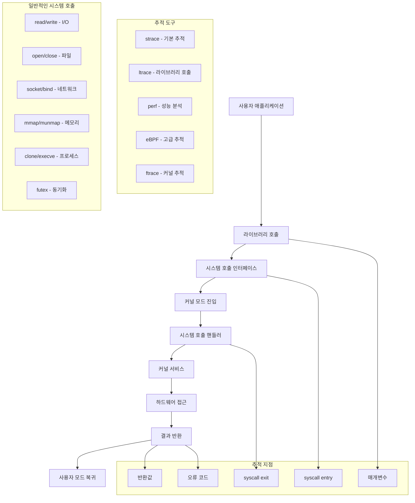

---
tags:
  - Syscall
  - Kernel
  - Debugging
  - strace
  - eBPF
---

# 시스템 호출 추적: "프로세스가 뭘 하고 있는지 모르겠어요"

## 상황: 블랙박스가 된 애플리케이션

"안녕하세요, 운영 중인 Java 애플리케이션이 간헐적으로 응답이 느려지는데 어디서 시간을 소모하는지 파악이 안 됩니다. CPU 사용률은 높지 않은데 뭔가 대기하고 있는 것 같아요. 애플리케이션 로그로는 원인을 찾기 어려운 상황입니다."

이런 상황에서는 시스템 호출 레벨에서 프로세스의 동작을 추적해야 합니다. 시스템 호출은 애플리케이션과 커널 사이의 모든 상호작용을 드러내는 강력한 디버깅 도구입니다.

## 시스템 호출 추적의 이해



## 1. 고급 시스템 호출 추적기

다양한 추적 도구를 통합한 종합 분석 시스템입니다.

```c
// syscall_tracer.c
#define _GNU_SOURCE
#include <stdio.h>
#include <stdlib.h>
#include <string.h>
#include <unistd.h>
#include <sys/ptrace.h>
#include <sys/wait.h>
#include <sys/user.h>
#include <sys/syscall.h>
#include <errno.h>
#include <time.h>
#include <signal.h>
#include <fcntl.h>

typedef struct {
    long syscall_nr;
    char name[32];
    long args[6];
    long retval;
    struct timespec entry_time;
    struct timespec exit_time;
    double duration_us;
} syscall_record_t;

typedef struct {
    long syscall_nr;
    char name[32];
    unsigned long count;
    double total_time_us;
    double min_time_us;
    double max_time_us;
    double avg_time_us;
    unsigned long errors;
} syscall_stats_t;

// 주요 시스템 호출 이름 테이블
static const char* syscall_names[] = {
    [SYS_read] = "read",
    [SYS_write] = "write",
    [SYS_open] = "open",
    [SYS_close] = "close",
    [SYS_stat] = "stat",
    [SYS_fstat] = "fstat",
    [SYS_lstat] = "lstat",
    [SYS_poll] = "poll",
    [SYS_lseek] = "lseek",
    [SYS_mmap] = "mmap",
    [SYS_mprotect] = "mprotect",
    [SYS_munmap] = "munmap",
    [SYS_brk] = "brk",
    [SYS_rt_sigaction] = "rt_sigaction",
    [SYS_rt_sigprocmask] = "rt_sigprocmask",
    [SYS_rt_sigreturn] = "rt_sigreturn",
    [SYS_ioctl] = "ioctl",
    [SYS_pread64] = "pread64",
    [SYS_pwrite64] = "pwrite64",
    [SYS_readv] = "readv",
    [SYS_writev] = "writev",
    [SYS_access] = "access",
    [SYS_pipe] = "pipe",
    [SYS_select] = "select",
    [SYS_sched_yield] = "sched_yield",
    [SYS_mremap] = "mremap",
    [SYS_msync] = "msync",
    [SYS_mincore] = "mincore",
    [SYS_madvise] = "madvise",
    [SYS_shmget] = "shmget",
    [SYS_shmat] = "shmat",
    [SYS_shmctl] = "shmctl",
    [SYS_dup] = "dup",
    [SYS_dup2] = "dup2",
    [SYS_pause] = "pause",
    [SYS_nanosleep] = "nanosleep",
    [SYS_getitimer] = "getitimer",
    [SYS_alarm] = "alarm",
    [SYS_setitimer] = "setitimer",
    [SYS_getpid] = "getpid",
    [SYS_sendfile] = "sendfile",
    [SYS_socket] = "socket",
    [SYS_connect] = "connect",
    [SYS_accept] = "accept",
    [SYS_sendto] = "sendto",
    [SYS_recvfrom] = "recvfrom",
    [SYS_sendmsg] = "sendmsg",
    [SYS_recvmsg] = "recvmsg",
    [SYS_shutdown] = "shutdown",
    [SYS_bind] = "bind",
    [SYS_listen] = "listen",
    [SYS_getsockname] = "getsockname",
    [SYS_getpeername] = "getpeername",
    [SYS_socketpair] = "socketpair",
    [SYS_setsockopt] = "setsockopt",
    [SYS_getsockopt] = "getsockopt",
    [SYS_clone] = "clone",
    [SYS_fork] = "fork",
    [SYS_vfork] = "vfork",
    [SYS_execve] = "execve",
    [SYS_exit] = "exit",
    [SYS_wait4] = "wait4",
    [SYS_kill] = "kill",
    [SYS_uname] = "uname",
    [SYS_semget] = "semget",
    [SYS_semop] = "semop",
    [SYS_semctl] = "semctl",
    [SYS_shmdt] = "shmdt",
    [SYS_msgget] = "msgget",
    [SYS_msgsnd] = "msgsnd",
    [SYS_msgrcv] = "msgrcv",
    [SYS_msgctl] = "msgctl",
    [SYS_fcntl] = "fcntl",
    [SYS_flock] = "flock",
    [SYS_fsync] = "fsync",
    [SYS_fdatasync] = "fdatasync",
    [SYS_truncate] = "truncate",
    [SYS_ftruncate] = "ftruncate",
    [SYS_getdents] = "getdents",
    [SYS_getcwd] = "getcwd",
    [SYS_chdir] = "chdir",
    [SYS_fchdir] = "fchdir",
    [SYS_rename] = "rename",
    [SYS_mkdir] = "mkdir",
    [SYS_rmdir] = "rmdir",
    [SYS_creat] = "creat",
    [SYS_link] = "link",
    [SYS_unlink] = "unlink",
    [SYS_symlink] = "symlink",
    [SYS_readlink] = "readlink",
    [SYS_chmod] = "chmod",
    [SYS_fchmod] = "fchmod",
    [SYS_chown] = "chown",
    [SYS_fchown] = "fchown",
    [SYS_lchown] = "lchown",
    [SYS_umask] = "umask",
    [SYS_gettimeofday] = "gettimeofday",
    [SYS_getrlimit] = "getrlimit",
    [SYS_getrusage] = "getrusage",
    [SYS_sysinfo] = "sysinfo",
    [SYS_times] = "times",
    [SYS_ptrace] = "ptrace",
    [SYS_getuid] = "getuid",
    [SYS_syslog] = "syslog",
    [SYS_getgid] = "getgid",
    [SYS_setuid] = "setuid",
    [SYS_setgid] = "setgid",
    [SYS_geteuid] = "geteuid",
    [SYS_getegid] = "getegid",
    [SYS_setpgid] = "setpgid",
    [SYS_getppid] = "getppid",
    [SYS_getpgrp] = "getpgrp",
    [SYS_setsid] = "setsid",
    [SYS_setreuid] = "setreuid",
    [SYS_setregid] = "setregid",
    [SYS_getgroups] = "getgroups",
    [SYS_setgroups] = "setgroups",
    [SYS_setresuid] = "setresuid",
    [SYS_getresuid] = "getresuid",
    [SYS_setresgid] = "setresgid",
    [SYS_getresgid] = "getresgid",
    [SYS_getpgid] = "getpgid",
    [SYS_setfsuid] = "setfsuid",
    [SYS_setfsgid] = "setfsgid",
    [SYS_getsid] = "getsid",
    [SYS_capget] = "capget",
    [SYS_capset] = "capset",
    [SYS_rt_sigpending] = "rt_sigpending",
    [SYS_rt_sigtimedwait] = "rt_sigtimedwait",
    [SYS_rt_sigqueueinfo] = "rt_sigqueueinfo",
    [SYS_rt_sigsuspend] = "rt_sigsuspend",
    [SYS_sigaltstack] = "sigaltstack",
    [SYS_utime] = "utime",
    [SYS_mknod] = "mknod",
    [SYS_uselib] = "uselib",
    [SYS_personality] = "personality",
    [SYS_ustat] = "ustat",
    [SYS_statfs] = "statfs",
    [SYS_fstatfs] = "fstatfs",
    [SYS_sysfs] = "sysfs",
    [SYS_getpriority] = "getpriority",
    [SYS_setpriority] = "setpriority",
    [SYS_sched_setparam] = "sched_setparam",
    [SYS_sched_getparam] = "sched_getparam",
    [SYS_sched_setscheduler] = "sched_setscheduler",
    [SYS_sched_getscheduler] = "sched_getscheduler",
    [SYS_sched_get_priority_max] = "sched_get_priority_max",
    [SYS_sched_get_priority_min] = "sched_get_priority_min",
    [SYS_sched_rr_get_interval] = "sched_rr_get_interval",
    [SYS_mlock] = "mlock",
    [SYS_munlock] = "munlock",
    [SYS_mlockall] = "mlockall",
    [SYS_munlockall] = "munlockall",
    [SYS_vhangup] = "vhangup",
    [SYS_modify_ldt] = "modify_ldt",
    [SYS_pivot_root] = "pivot_root",
    [SYS__sysctl] = "_sysctl",
    [SYS_prctl] = "prctl",
    [SYS_arch_prctl] = "arch_prctl",
    [SYS_adjtimex] = "adjtimex",
    [SYS_setrlimit] = "setrlimit",
    [SYS_chroot] = "chroot",
    [SYS_sync] = "sync",
    [SYS_acct] = "acct",
    [SYS_settimeofday] = "settimeofday",
    [SYS_mount] = "mount",
    [SYS_umount2] = "umount2",
    [SYS_swapon] = "swapon",
    [SYS_swapoff] = "swapoff",
    [SYS_reboot] = "reboot",
    [SYS_sethostname] = "sethostname",
    [SYS_setdomainname] = "setdomainname",
    [SYS_iopl] = "iopl",
    [SYS_ioperm] = "ioperm",
    [SYS_create_module] = "create_module",
    [SYS_init_module] = "init_module",
    [SYS_delete_module] = "delete_module",
    [SYS_get_kernel_syms] = "get_kernel_syms",
    [SYS_query_module] = "query_module",
    [SYS_quotactl] = "quotactl",
    [SYS_nfsservctl] = "nfsservctl",
    [SYS_getpmsg] = "getpmsg",
    [SYS_putpmsg] = "putpmsg",
    [SYS_afs_syscall] = "afs_syscall",
    [SYS_tuxcall] = "tuxcall",
    [SYS_security] = "security",
    [SYS_gettid] = "gettid",
    [SYS_readahead] = "readahead",
    [SYS_setxattr] = "setxattr",
    [SYS_lsetxattr] = "lsetxattr",
    [SYS_fsetxattr] = "fsetxattr",
    [SYS_getxattr] = "getxattr",
    [SYS_lgetxattr] = "lgetxattr",
    [SYS_fgetxattr] = "fgetxattr",
    [SYS_listxattr] = "listxattr",
    [SYS_llistxattr] = "llistxattr",
    [SYS_flistxattr] = "flistxattr",
    [SYS_removexattr] = "removexattr",
    [SYS_lremovexattr] = "lremovexattr",
    [SYS_fremovexattr] = "fremovexattr",
    [SYS_tkill] = "tkill",
    [SYS_time] = "time",
    [SYS_futex] = "futex",
    [SYS_sched_setaffinity] = "sched_setaffinity",
    [SYS_sched_getaffinity] = "sched_getaffinity",
    [SYS_set_thread_area] = "set_thread_area",
    [SYS_io_setup] = "io_setup",
    [SYS_io_destroy] = "io_destroy",
    [SYS_io_getevents] = "io_getevents",
    [SYS_io_submit] = "io_submit",
    [SYS_io_cancel] = "io_cancel",
    [SYS_get_thread_area] = "get_thread_area",
    [SYS_lookup_dcookie] = "lookup_dcookie",
    [SYS_epoll_create] = "epoll_create",
    [SYS_epoll_ctl_old] = "epoll_ctl_old",
    [SYS_epoll_wait_old] = "epoll_wait_old",
    [SYS_remap_file_pages] = "remap_file_pages",
    [SYS_getdents64] = "getdents64",
    [SYS_set_tid_address] = "set_tid_address",
    [SYS_restart_syscall] = "restart_syscall",
    [SYS_semtimedop] = "semtimedop",
    [SYS_fadvise64] = "fadvise64",
    [SYS_timer_create] = "timer_create",
    [SYS_timer_settime] = "timer_settime",
    [SYS_timer_gettime] = "timer_gettime",
    [SYS_timer_getoverrun] = "timer_getoverrun",
    [SYS_timer_delete] = "timer_delete",
    [SYS_clock_settime] = "clock_settime",
    [SYS_clock_gettime] = "clock_gettime",
    [SYS_clock_getres] = "clock_getres",
    [SYS_clock_nanosleep] = "clock_nanosleep",
    [SYS_exit_group] = "exit_group",
    [SYS_epoll_wait] = "epoll_wait",
    [SYS_epoll_ctl] = "epoll_ctl",
    [SYS_tgkill] = "tgkill",
    [SYS_utimes] = "utimes",
    [SYS_vserver] = "vserver",
    [SYS_mbind] = "mbind",
    [SYS_set_mempolicy] = "set_mempolicy",
    [SYS_get_mempolicy] = "get_mempolicy",
    [SYS_mq_open] = "mq_open",
    [SYS_mq_unlink] = "mq_unlink",
    [SYS_mq_timedsend] = "mq_timedsend",
    [SYS_mq_timedreceive] = "mq_timedreceive",
    [SYS_mq_notify] = "mq_notify",
    [SYS_mq_getsetattr] = "mq_getsetattr",
    [SYS_kexec_load] = "kexec_load",
    [SYS_waitid] = "waitid",
    [SYS_add_key] = "add_key",
    [SYS_request_key] = "request_key",
    [SYS_keyctl] = "keyctl",
    [SYS_ioprio_set] = "ioprio_set",
    [SYS_ioprio_get] = "ioprio_get",
    [SYS_inotify_init] = "inotify_init",
    [SYS_inotify_add_watch] = "inotify_add_watch",
    [SYS_inotify_rm_watch] = "inotify_rm_watch",
    [SYS_migrate_pages] = "migrate_pages",
    [SYS_openat] = "openat",
    [SYS_mkdirat] = "mkdirat",
    [SYS_mknodat] = "mknodat",
    [SYS_fchownat] = "fchownat",
    [SYS_futimesat] = "futimesat",
    [SYS_newfstatat] = "newfstatat",
    [SYS_unlinkat] = "unlinkat",
    [SYS_renameat] = "renameat",
    [SYS_linkat] = "linkat",
    [SYS_symlinkat] = "symlinkat",
    [SYS_readlinkat] = "readlinkat",
    [SYS_fchmodat] = "fchmodat",
    [SYS_faccessat] = "faccessat",
    [SYS_pselect6] = "pselect6",
    [SYS_ppoll] = "ppoll",
    [SYS_unshare] = "unshare",
    [SYS_set_robust_list] = "set_robust_list",
    [SYS_get_robust_list] = "get_robust_list",
    [SYS_splice] = "splice",
    [SYS_tee] = "tee",
    [SYS_sync_file_range] = "sync_file_range",
    [SYS_vmsplice] = "vmsplice",
    [SYS_move_pages] = "move_pages",
    [SYS_utimensat] = "utimensat",
    [SYS_epoll_pwait] = "epoll_pwait",
    [SYS_signalfd] = "signalfd",
    [SYS_timerfd_create] = "timerfd_create",
    [SYS_eventfd] = "eventfd",
    [SYS_fallocate] = "fallocate",
    [SYS_timerfd_settime] = "timerfd_settime",
    [SYS_timerfd_gettime] = "timerfd_gettime",
    [SYS_accept4] = "accept4",
    [SYS_signalfd4] = "signalfd4",
    [SYS_eventfd2] = "eventfd2",
    [SYS_epoll_create1] = "epoll_create1",
    [SYS_dup3] = "dup3",
    [SYS_pipe2] = "pipe2",
    [SYS_inotify_init1] = "inotify_init1",
    [SYS_preadv] = "preadv",
    [SYS_pwritev] = "pwritev",
    [SYS_rt_tgsigqueueinfo] = "rt_tgsigqueueinfo",
    [SYS_perf_event_open] = "perf_event_open",
    [SYS_recvmmsg] = "recvmmsg",
    [SYS_fanotify_init] = "fanotify_init",
    [SYS_fanotify_mark] = "fanotify_mark",
    [SYS_prlimit64] = "prlimit64",
    [SYS_name_to_handle_at] = "name_to_handle_at",
    [SYS_open_by_handle_at] = "open_by_handle_at",
    [SYS_clock_adjtime] = "clock_adjtime",
    [SYS_syncfs] = "syncfs",
    [SYS_sendmmsg] = "sendmmsg",
    [SYS_setns] = "setns",
    [SYS_getcpu] = "getcpu",
    [SYS_process_vm_readv] = "process_vm_readv",
    [SYS_process_vm_writev] = "process_vm_writev"
};

const char* get_syscall_name(long syscall_nr) {
    if (syscall_nr >= 0 && syscall_nr < sizeof(syscall_names)/sizeof(syscall_names[0])) {
        if (syscall_names[syscall_nr]) {
            return syscall_names[syscall_nr];
        }
    }
    return "unknown";
}

// 시간 차이 계산 (마이크로초)
double timespec_diff_us(struct timespec *start, struct timespec *end) {
    double diff = (end->tv_sec - start->tv_sec) * 1000000.0;
    diff += (end->tv_nsec - start->tv_nsec) / 1000.0;
    return diff;
}

// 레지스터에서 시스템 호출 정보 추출
void get_syscall_info(pid_t pid, syscall_record_t* record, int is_entry) {
    struct user_regs_struct regs;
    
    if (ptrace(PTRACE_GETREGS, pid, NULL, &regs) == -1) {
        perror("ptrace GETREGS");
        return;
    }
    
    if (is_entry) {
        record->syscall_nr = regs.orig_rax;
        record->args[0] = regs.rdi;
        record->args[1] = regs.rsi;
        record->args[2] = regs.rdx;
        record->args[3] = regs.r10;
        record->args[4] = regs.r8;
        record->args[5] = regs.r9;
        strcpy(record->name, get_syscall_name(record->syscall_nr));
        clock_gettime(CLOCK_MONOTONIC, &record->entry_time);
    } else {
        record->retval = regs.rax;
        clock_gettime(CLOCK_MONOTONIC, &record->exit_time);
        record->duration_us = timespec_diff_us(&record->entry_time, &record->exit_time);
    }
}

// 시스템 호출 인수 형식화
void format_syscall_args(syscall_record_t* record, char* buffer, size_t buffer_size) {
    switch (record->syscall_nr) {
        case SYS_read:
        case SYS_write:
            snprintf(buffer, buffer_size, "fd=%ld, buf=0x%lx, count=%ld", 
                    record->args[0], record->args[1], record->args[2]);
            break;
        case SYS_open:
        case SYS_openat:
            snprintf(buffer, buffer_size, "pathname=0x%lx, flags=%ld, mode=%ld", 
                    record->args[0], record->args[1], record->args[2]);
            break;
        case SYS_close:
            snprintf(buffer, buffer_size, "fd=%ld", record->args[0]);
            break;
        case SYS_socket:
            snprintf(buffer, buffer_size, "domain=%ld, type=%ld, protocol=%ld", 
                    record->args[0], record->args[1], record->args[2]);
            break;
        case SYS_connect:
        case SYS_bind:
            snprintf(buffer, buffer_size, "sockfd=%ld, addr=0x%lx, addrlen=%ld", 
                    record->args[0], record->args[1], record->args[2]);
            break;
        case SYS_mmap:
            snprintf(buffer, buffer_size, "addr=0x%lx, length=%ld, prot=%ld, flags=%ld, fd=%ld, offset=%ld", 
                    record->args[0], record->args[1], record->args[2], 
                    record->args[3], record->args[4], record->args[5]);
            break;
        case SYS_futex:
            snprintf(buffer, buffer_size, "uaddr=0x%lx, op=%ld, val=%ld, timeout=0x%lx", 
                    record->args[0], record->args[1], record->args[2], record->args[3]);
            break;
        default:
            snprintf(buffer, buffer_size, "%ld, %ld, %ld, %ld, %ld, %ld", 
                    record->args[0], record->args[1], record->args[2], 
                    record->args[3], record->args[4], record->args[5]);
            break;
    }
}

// 상세한 시스템 호출 추적
void trace_syscalls(pid_t pid, int detailed, int summary) {
    syscall_record_t current_record = {0};
    syscall_stats_t stats[400] = {0};  // 최대 400개 시스템 호출
    int in_syscall = 0;
    int total_syscalls = 0;
    
    printf("시스템 호출 추적 시작 (PID: %d)\n", pid);
    if (detailed) {
        printf("%-15s %-6s %-50s %-12s %-8s\n", 
               "시간", "PID", "시스템호출(인수)", "반환값", "시간(μs)");
        printf("%-15s %-6s %-50s %-12s %-8s\n", 
               "----", "---", "----------", "------", "------");
    }
    
    if (ptrace(PTRACE_ATTACH, pid, NULL, NULL) == -1) {
        perror("ptrace ATTACH");
        return;
    }
    
    waitpid(pid, NULL, 0);
    
    if (ptrace(PTRACE_SETOPTIONS, pid, NULL, PTRACE_O_TRACESYSGOOD) == -1) {
        perror("ptrace SETOPTIONS");
        goto cleanup;
    }
    
    while (1) {
        if (ptrace(PTRACE_SYSCALL, pid, NULL, NULL) == -1) {
            perror("ptrace SYSCALL");
            break;
        }
        
        int status;
        if (waitpid(pid, &status, 0) == -1) {
            perror("waitpid");
            break;
        }
        
        if (WIFEXITED(status)) {
            printf("프로세스가 종료되었습니다 (코드: %d)\n", WEXITSTATUS(status));
            break;
        }
        
        if (WIFSTOPPED(status) && WSTOPSIG(status) == (SIGTRAP | 0x80)) {
            if (!in_syscall) {
                // 시스템 호출 진입
                get_syscall_info(pid, &current_record, 1);
                in_syscall = 1;
                
                if (detailed) {
                    struct tm *tm_info;
                    time_t now = time(NULL);
                    tm_info = localtime(&now);
                    
                    char time_str[16];
                    strftime(time_str, sizeof(time_str), "%H:%M:%S", tm_info);
                    
                    char args_str[256];
                    format_syscall_args(&current_record, args_str, sizeof(args_str));
                    
                    printf("%-15s %-6d %-20s(%-25s ", 
                           time_str, pid, current_record.name, args_str);
                    fflush(stdout);
                }
                
            } else {
                // 시스템 호출 종료
                get_syscall_info(pid, &current_record, 0);
                in_syscall = 0;
                total_syscalls++;
                
                // 통계 업데이트
                long syscall_nr = current_record.syscall_nr;
                if (syscall_nr >= 0 && syscall_nr < 400) {
                    syscall_stats_t* stat = &stats[syscall_nr];
                    
                    if (stat->count == 0) {
                        stat->syscall_nr = syscall_nr;
                        strcpy(stat->name, current_record.name);
                        stat->min_time_us = current_record.duration_us;
                        stat->max_time_us = current_record.duration_us;
                        stat->total_time_us = current_record.duration_us;
                    } else {
                        if (current_record.duration_us < stat->min_time_us) {
                            stat->min_time_us = current_record.duration_us;
                        }
                        if (current_record.duration_us > stat->max_time_us) {
                            stat->max_time_us = current_record.duration_us;
                        }
                        stat->total_time_us += current_record.duration_us;
                    }
                    
                    stat->count++;
                    stat->avg_time_us = stat->total_time_us / stat->count;
                    
                    if (current_record.retval < 0) {
                        stat->errors++;
                    }
                }
                
                if (detailed) {
                    printf(") = %-12ld %-8.1f\n", 
                           current_record.retval, current_record.duration_us);
                }
                
                // 느린 시스템 호출 감지
                if (current_record.duration_us > 1000) {  // 1ms 이상
                    if (!detailed) {
                        printf("⚠️ 느린 시스템 호출: %s (%.1f μs)\n", 
                               current_record.name, current_record.duration_us);
                    }
                }
            }
        }
    }
    
    // 요약 통계 출력
    if (summary) {
        printf("\n=== 시스템 호출 요약 통계 ===\n");
        printf("총 시스템 호출: %d개\n\n", total_syscalls);
        
        printf("%-20s %-8s %-12s %-12s %-12s %-12s %-8s\n",
               "시스템호출", "횟수", "총시간(μs)", "평균(μs)", "최소(μs)", "최대(μs)", "오류");
        printf("%-20s %-8s %-12s %-12s %-12s %-12s %-8s\n",
               "----------", "----", "----------", "--------", "--------", "--------", "----");
        
        // 가장 많이 호출된 시스템 호출들 정렬
        syscall_stats_t* sorted_stats[50];
        int stats_count = 0;
        
        for (int i = 0; i < 400; i++) {
            if (stats[i].count > 0) {
                sorted_stats[stats_count++] = &stats[i];
                if (stats_count >= 50) break;
            }
        }
        
        // 호출 횟수로 정렬
        for (int i = 0; i < stats_count - 1; i++) {
            for (int j = i + 1; j < stats_count; j++) {
                if (sorted_stats[i]->count < sorted_stats[j]->count) {
                    syscall_stats_t* temp = sorted_stats[i];
                    sorted_stats[i] = sorted_stats[j];
                    sorted_stats[j] = temp;
                }
            }
        }
        
        for (int i = 0; i < stats_count && i < 20; i++) {
            syscall_stats_t* stat = sorted_stats[i];
            printf("%-20s %-8lu %-12.1f %-12.1f %-12.1f %-12.1f %-8lu\n",
                   stat->name, stat->count, stat->total_time_us, stat->avg_time_us,
                   stat->min_time_us, stat->max_time_us, stat->errors);
        }
    }

cleanup:
    if (ptrace(PTRACE_DETACH, pid, NULL, NULL) == -1) {
        perror("ptrace DETACH");
    }
}

// 특정 시스템 호출 필터링
void filter_syscalls(pid_t pid, const char* syscall_filter) {
    printf("특정 시스템 호출 필터링: %s (PID: %d)\n", syscall_filter, pid);
    
    // 필터할 시스템 호출 번호 찾기
    long filter_nr = -1;
    for (int i = 0; i < sizeof(syscall_names)/sizeof(syscall_names[0]); i++) {
        if (syscall_names[i] && strcmp(syscall_names[i], syscall_filter) == 0) {
            filter_nr = i;
            break;
        }
    }
    
    if (filter_nr == -1) {
        printf("알 수 없는 시스템 호출: %s\n", syscall_filter);
        return;
    }
    
    if (ptrace(PTRACE_ATTACH, pid, NULL, NULL) == -1) {
        perror("ptrace ATTACH");
        return;
    }
    
    waitpid(pid, NULL, 0);
    ptrace(PTRACE_SETOPTIONS, pid, NULL, PTRACE_O_TRACESYSGOOD);
    
    syscall_record_t record = {0};
    int in_syscall = 0;
    int match_count = 0;
    
    printf("%-15s %-50s %-12s %-10s\n", 
           "시간", "호출", "반환값", "시간(μs)");
    printf("%-15s %-50s %-12s %-10s\n", 
           "----", "----", "------", "--------");
    
    while (1) {
        if (ptrace(PTRACE_SYSCALL, pid, NULL, NULL) == -1) break;
        
        int status;
        if (waitpid(pid, &status, 0) == -1) break;
        
        if (WIFEXITED(status)) break;
        
        if (WIFSTOPPED(status) && WSTOPSIG(status) == (SIGTRAP | 0x80)) {
            if (!in_syscall) {
                get_syscall_info(pid, &record, 1);
                in_syscall = 1;
            } else {
                get_syscall_info(pid, &record, 0);
                in_syscall = 0;
                
                // 필터링된 시스템 호출인지 확인
                if (record.syscall_nr == filter_nr) {
                    match_count++;
                    
                    struct tm *tm_info;
                    time_t now = time(NULL);
                    tm_info = localtime(&now);
                    
                    char time_str[16];
                    strftime(time_str, sizeof(time_str), "%H:%M:%S", tm_info);
                    
                    char args_str[256];
                    format_syscall_args(&record, args_str, sizeof(args_str));
                    
                    printf("%-15s %-50s %-12ld %-10.1f\n",
                           time_str, args_str, record.retval, record.duration_us);
                }
            }
        }
    }
    
    printf("\n총 %s 호출: %d회\n", syscall_filter, match_count);
    ptrace(PTRACE_DETACH, pid, NULL, NULL);
}

int main(int argc, char* argv[]) {
    if (argc < 3) {
        printf("사용법: %s <options> <PID>\n", argv[0]);
        printf("Options:\n");
        printf("  -d, --detailed     상세한 시스템 호출 로그\n");
        printf("  -s, --summary      요약 통계만 표시\n");
        printf("  -f, --filter NAME  특정 시스템 호출만 추적\n");
        printf("  -h, --help         도움말\n");
        printf("\n예시:\n");
        printf("  %s -d 1234              # PID 1234의 상세 추적\n", argv[0]);
        printf("  %s -s 1234              # PID 1234의 요약 통계\n", argv[0]);
        printf("  %s -f read 1234         # read 시스템 호출만 추적\n", argv[0]);
        return 1;
    }
    
    int detailed = 0;
    int summary = 0;
    char* filter = NULL;
    pid_t target_pid = 0;
    
    // 인수 파싱
    for (int i = 1; i < argc; i++) {
        if (strcmp(argv[i], "-d") == 0 || strcmp(argv[i], "--detailed") == 0) {
            detailed = 1;
        } else if (strcmp(argv[i], "-s") == 0 || strcmp(argv[i], "--summary") == 0) {
            summary = 1;
        } else if (strcmp(argv[i], "-f") == 0 || strcmp(argv[i], "--filter") == 0) {
            if (i + 1 < argc) {
                filter = argv[++i];
            }
        } else if (strcmp(argv[i], "-h") == 0 || strcmp(argv[i], "--help") == 0) {
            // 도움말은 위에서 이미 표시됨
            return 0;
        } else {
            target_pid = atoi(argv[i]);
        }
    }
    
    if (target_pid <= 0) {
        printf("올바른 PID를 입력해주세요.\n");
        return 1;
    }
    
    // 프로세스 존재 확인
    if (kill(target_pid, 0) == -1) {
        perror("프로세스 확인 실패");
        return 1;
    }
    
    printf("=== 시스템 호출 추적기 ===\n");
    printf("대상 PID: %d\n", target_pid);
    
    if (filter) {
        filter_syscalls(target_pid, filter);
    } else {
        trace_syscalls(target_pid, detailed, summary || !detailed);
    }
    
    return 0;
}
```

계속해서 다음 도구들을 작성하겠습니다...
