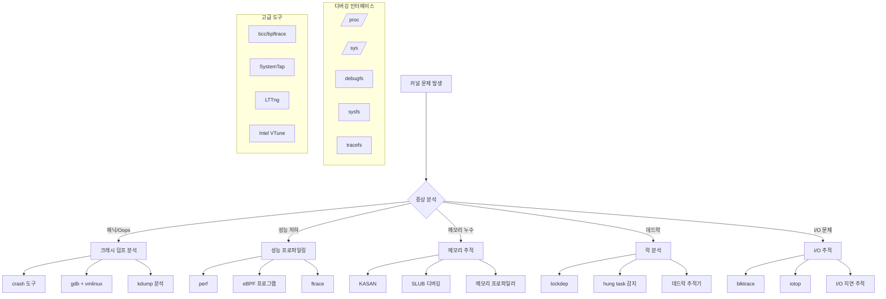

---
tags:
  - Kernel
  - Debugging
  - eBPF
  - ftrace
  - Performance
---

# 커널 디버깅 기법: "커널 패닉이 발생해요"

## 상황: 시스템 안정성 문제

"안녕하세요, 운영 중인 서버에서 간헐적으로 커널 패닉이 발생하고 있어요. dmesg에는 오류 메시지가 있지만 원인을 파악하기 어렵습니다. 특정 워크로드에서만 발생하는 것 같은데, 커널 레벨에서 뭔가 잘못되고 있는 것 같습니다. 어떻게 디버깅할 수 있을까요?"

커널 레벨의 문제는 시스템 전체에 영향을 미치므로 신속하고 정확한 진단이 중요합니다. 현대적인 커널 디버깅 도구와 기법을 활용해 보겠습니다.

## 커널 디버깅 도구 생태계



## 1. 종합 커널 진단 시스템

다양한 커널 디버깅 도구를 통합한 분석 시스템입니다.

```python
#!/usr/bin/env python3
# kernel_debugger.py

import os
import sys
import subprocess
import time
import re
import json
import argparse
from datetime import datetime
from collections import defaultdict
import threading

class KernelDebugger:
    def __init__(self):
        self.debug_info = {}
        self.trace_data = []
        self.analysis_results = {}
        
    def check_kernel_version(self):
        """커널 버전 및 설정 확인"""
        print("=== 커널 정보 ===")
        
        # 커널 버전
        try:
            with open('/proc/version', 'r') as f:
                kernel_version = f.read().strip()
                print(f"커널 버전: {kernel_version}")
        except:
            print("커널 버전 정보를 읽을 수 없습니다")
        
        # 커널 매개변수
        try:
            with open('/proc/cmdline', 'r') as f:
                cmdline = f.read().strip()
                print(f"커널 매개변수: {cmdline}")
        except:
            print("커널 매개변수를 읽을 수 없습니다")
        
        # 디버깅 기능 확인
        debug_features = {
            'CONFIG_DEBUG_KERNEL': '/proc/config.gz',
            'KASAN': '/sys/kernel/debug',
            'LOCKDEP': '/proc/lockdep',
            'FTRACE': '/sys/kernel/debug/tracing',
            'PERF': '/proc/sys/kernel/perf_event_paranoid'
        }
        
        print(", 디버깅 기능 상태:")
        for feature, path in debug_features.items():
            if os.path.exists(path):
                print(f"  {feature}: 사용 가능")
            else:
                print(f"  {feature}: 사용 불가")
    
    def analyze_kernel_messages(self):
        """커널 메시지 분석"""
        print(", === 커널 메시지 분석 ===")
        
        try:
            # dmesg 출력 분석
            result = subprocess.run(['dmesg', '-T'], capture_output=True, text=True)
            if result.returncode == 0:
                messages = result.stdout.split(', ')
                
                # 오류 패턴 분석
                error_patterns = {
                    'Oops': r'Oops:',
                    'BUG': r'BUG:',
                    'WARNING': r'WARNING:',
                    'Call Trace': r'Call Trace:',
                    'RIP': r'RIP:',
                    'segfault': r'segfault',
                    'killed': r'killed',
                    'OOM': r'Out of memory',
                    'hung task': r'hung task',
                    'soft lockup': r'soft lockup',
                    'hard lockup': r'hard lockup'
                }
                
                error_counts = defaultdict(int)
                recent_errors = []
                
                for message in messages[-1000:]:  # 최근 1000개 메시지만
                    for error_type, pattern in error_patterns.items():
                        if re.search(pattern, message, re.IGNORECASE):
                            error_counts[error_type] += 1
                            recent_errors.append((error_type, message))
                
                # 오류 통계 출력
                if error_counts:
                    print("발견된 오류:")
                    for error_type, count in error_counts.items():
                        print(f"  {error_type}: {count}회")
                    
                    print(", 최근 오류 메시지:")
                    for error_type, message in recent_errors[-10:]:
                        print(f"  [{error_type}] {message}")
                else:
                    print("심각한 커널 오류 메시지가 발견되지 않았습니다")
                
        except Exception as e:
            print(f"커널 메시지 분석 실패: {e}")
    
    def check_memory_issues(self):
        """메모리 관련 문제 검사"""
        print(", === 메모리 문제 분석 ===")
        
        # 메모리 정보
        try:
            with open('/proc/meminfo', 'r') as f:
                meminfo = f.read()
                
            # 주요 메모리 정보 추출
            memory_stats = {}
            for line in meminfo.split(', '):
                if ':' in line:
                    key, value = line.split(':', 1)
                    memory_stats[key.strip()] = value.strip()
            
            # 메모리 사용률 계산
            total_mem = int(memory_stats.get('MemTotal', '0').split()[0])
            free_mem = int(memory_stats.get('MemFree', '0').split()[0])
            available_mem = int(memory_stats.get('MemAvailable', '0').split()[0])
            
            usage_percent = (total_mem - available_mem) / total_mem * 100
            
            print(f"총 메모리: {total_mem // 1024} MB")
            print(f"사용 가능: {available_mem // 1024} MB")
            print(f"사용률: {usage_percent:.1f}%")
            
            if usage_percent > 90:
                print("⚠️ 높은 메모리 사용률 감지")
            
            # Slab 메모리 확인
            print(f"Slab: {memory_stats.get('Slab', 'N/A')}")
            print(f"SReclaimable: {memory_stats.get('SReclaimable', 'N/A')}")
            print(f"SUnreclaim: {memory_stats.get('SUnreclaim', 'N/A')}")
            
        except Exception as e:
            print(f"메모리 정보 읽기 실패: {e}")
        
        # SLUB 디버깅 정보 (가능한 경우)
        slub_debug_path = '/sys/kernel/slab'
        if os.path.exists(slub_debug_path):
            print(", SLUB 캐시 정보:")
            try:
                slub_dirs = os.listdir(slub_debug_path)
                large_caches = []
                
                for cache_dir in slub_dirs[:20]:  # 상위 20개만
                    cache_path = os.path.join(slub_debug_path, cache_dir)
                    try:
                        with open(os.path.join(cache_path, 'slabs'), 'r') as f:
                            slabs = int(f.read().strip())
                        with open(os.path.join(cache_path, 'object_size'), 'r') as f:
                            obj_size = int(f.read().strip())
                        
                        total_size = slabs * obj_size
                        if total_size > 1024 * 1024:  # 1MB 이상
                            large_caches.append((cache_dir, total_size, slabs))
                    except:
                        continue
                
                large_caches.sort(key=lambda x: x[1], reverse=True)
                for cache_name, size, slabs in large_caches[:10]:
                    print(f"  {cache_name}: {size // 1024} KB ({slabs} slabs)")
                    
            except Exception as e:
                print(f"SLUB 정보 읽기 실패: {e}")
    
    def analyze_performance_counters(self):
        """성능 카운터 분석"""
        print(", === 성능 카운터 분석 ===")
        
        # CPU 통계
        try:
            with open('/proc/stat', 'r') as f:
                stat_line = f.readline()
                cpu_times = list(map(int, stat_line.split()[1:]))
                
            total_time = sum(cpu_times)
            if total_time > 0:
                user_percent = cpu_times[0] / total_time * 100
                sys_percent = cpu_times[2] / total_time * 100
                idle_percent = cpu_times[3] / total_time * 100
                iowait_percent = cpu_times[4] / total_time * 100
                
                print(f"사용자 시간: {user_percent:.1f}%")
                print(f"시스템 시간: {sys_percent:.1f}%")
                print(f"유휴 시간: {idle_percent:.1f}%")
                print(f"I/O 대기: {iowait_percent:.1f}%")
                
                if iowait_percent > 20:
                    print("⚠️ 높은 I/O 대기 시간 감지")
                if sys_percent > 30:
                    print("⚠️ 높은 시스템 시간 감지")
        except:
            print("CPU 통계 읽기 실패")
        
        # 컨텍스트 스위치 및 인터럽트
        try:
            with open('/proc/stat', 'r') as f:
                for line in f:
                    if line.startswith('ctxt'):
                        ctxt_switches = int(line.split()[1])
                        print(f"컨텍스트 스위치: {ctxt_switches}")
                    elif line.startswith('intr'):
                        interrupts = int(line.split()[1])
                        print(f"인터럽트: {interrupts}")
        except:
            print("컨텍스트 스위치/인터럽트 정보 읽기 실패")
        
        # 로드 평균
        try:
            with open('/proc/loadavg', 'r') as f:
                loadavg = f.read().strip().split()
                print(f"로드 평균: {loadavg[0]} {loadavg[1]} {loadavg[2]}")
                
                if float(loadavg[0]) > 2.0:
                    print("⚠️ 높은 로드 평균 감지")
        except:
            print("로드 평균 읽기 실패")
    
    def check_lock_issues(self):
        """락 관련 문제 검사"""
        print(", === 락 문제 분석 ===")
        
        # lockdep 정보 (가능한 경우)
        lockdep_path = '/proc/lockdep'
        if os.path.exists(lockdep_path):
            try:
                with open(lockdep_path, 'r') as f:
                    lockdep_info = f.read()
                    
                lines = lockdep_info.split(', ')
                print(f"등록된 락 클래스: {len([l for l in lines if 'class' in l])}")
                
                # 락 통계 추출
                for line in lines:
                    if 'lock-classes' in line or 'direct dependencies' in line:
                        print(f"  {line.strip()}")
                        
            except Exception as e:
                print(f"lockdep 정보 읽기 실패: {e}")
        else:
            print("lockdep이 활성화되지 않음")
        
        # hung task 감지기 상태
        hung_task_path = '/proc/sys/kernel/hung_task_timeout_secs'
        if os.path.exists(hung_task_path):
            try:
                with open(hung_task_path, 'r') as f:
                    timeout = f.read().strip()
                    print(f"Hung task 타임아웃: {timeout}초")
            except:
                pass
        
        # 현재 대기 중인 태스크들
        try:
            result = subprocess.run(['ps', 'axo', 'pid,stat,comm'], 
                                  capture_output=True, text=True)
            if result.returncode == 0:
                lines = result.stdout.split(', ')
                waiting_tasks = []
                
                for line in lines[1:]:  # 헤더 스킵
                    if line.strip():
                        parts = line.split(None, 2)
                        if len(parts) >= 3:
                            pid, stat, comm = parts
                            if 'D' in stat:  # Uninterruptible sleep
                                waiting_tasks.append((pid, stat, comm))
                
                if waiting_tasks:
                    print(f", 언인터럽터블 슬립 상태 프로세스: {len(waiting_tasks)}개")
                    for pid, stat, comm in waiting_tasks[:10]:
                        print(f"  PID {pid}: {comm} ({stat})")
                    
                    if len(waiting_tasks) > 5:
                        print("⚠️ 많은 프로세스가 I/O 대기 상태입니다")
        except:
            print("프로세스 상태 확인 실패")
    
    def trace_kernel_functions(self, function_name=None, duration=10):
        """커널 함수 추적"""
        print(f", === 커널 함수 추적 ({duration}초) ===")
        
        ftrace_path = '/sys/kernel/debug/tracing'
        if not os.path.exists(ftrace_path):
            print("ftrace가 사용 불가능합니다")
            return
        
        try:
            # ftrace 설정
            with open(os.path.join(ftrace_path, 'current_tracer'), 'w') as f:
                f.write('function')
            
            if function_name:
                with open(os.path.join(ftrace_path, 'set_ftrace_filter'), 'w') as f:
                    f.write(function_name)
            
            # 추적 시작
            with open(os.path.join(ftrace_path, 'tracing_on'), 'w') as f:
                f.write('1')
            
            print(f"추적 시작... ({duration}초)")
            time.sleep(duration)
            
            # 추적 중지
            with open(os.path.join(ftrace_path, 'tracing_on'), 'w') as f:
                f.write('0')
            
            # 결과 읽기
            with open(os.path.join(ftrace_path, 'trace'), 'r') as f:
                trace_data = f.read()
            
            # 결과 분석
            lines = trace_data.split(', ')
            function_counts = defaultdict(int)
            
            for line in lines:
                if '|' in line and 'tracing_mark_write' not in line:
                    # 함수 이름 추출
                    match = re.search(r'\s+(\w+)\s*\(', line)
                    if match:
                        func_name = match.group(1)
                        function_counts[func_name] += 1
            
            # 상위 함수들 출력
            print("가장 많이 호출된 함수들:")
            sorted_funcs = sorted(function_counts.items(), 
                                key=lambda x: x[1], reverse=True)
            
            for func_name, count in sorted_funcs[:20]:
                print(f"  {func_name}: {count}회")
            
            # 정리
            with open(os.path.join(ftrace_path, 'trace'), 'w') as f:
                f.write('')
            
        except Exception as e:
            print(f"ftrace 실행 실패: {e}")
    
    def analyze_with_perf(self, duration=10):
        """perf를 사용한 성능 분석"""
        print(f", === perf 성능 분석 ({duration}초) ===")
        
        try:
            # CPU 사용률이 높은 함수들 프로파일링
            result = subprocess.run([
                'perf', 'record', '-g', '-a', 
                '--', 'sleep', str(duration)
            ], capture_output=True, text=True)
            
            if result.returncode == 0:
                # 리포트 생성
                report_result = subprocess.run([
                    'perf', 'report', '--stdio', '--no-children'
                ], capture_output=True, text=True)
                
                if report_result.returncode == 0:
                    lines = report_result.stdout.split(', ')
                    print("CPU 사용률이 높은 함수들:")
                    
                    for line in lines[:30]:
                        if '%' in line and 'Samples' not in line:
                            print(f"  {line.strip()}")
                
                # 정리
                os.remove('perf.data')
            else:
                print("perf record 실행 실패 (권한 확인 필요)")
                
        except FileNotFoundError:
            print("perf 도구가 설치되지 않음")
        except Exception as e:
            print(f"perf 분석 실패: {e}")
    
    def check_hardware_errors(self):
        """하드웨어 오류 검사"""
        print(", === 하드웨어 오류 검사 ===")
        
        # MCE (Machine Check Exception) 확인
        mce_path = '/sys/devices/system/machinecheck'
        if os.path.exists(mce_path):
            try:
                mce_dirs = [d for d in os.listdir(mce_path) 
                           if d.startswith('machinecheck')]
                
                total_errors = 0
                for mce_dir in mce_dirs:
                    error_file = os.path.join(mce_path, mce_dir, 'mce_count')
                    if os.path.exists(error_file):
                        with open(error_file, 'r') as f:
                            count = int(f.read().strip())
                            total_errors += count
                
                print(f"MCE 오류 총 개수: {total_errors}")
                if total_errors > 0:
                    print("⚠️ 하드웨어 오류가 감지되었습니다")
                    
            except Exception as e:
                print(f"MCE 정보 읽기 실패: {e}")
        
        # EDAC (Error Detection and Correction) 확인
        edac_path = '/sys/devices/system/edac/mc'
        if os.path.exists(edac_path):
            try:
                mc_dirs = [d for d in os.listdir(edac_path) if d.startswith('mc')]
                
                for mc_dir in mc_dirs:
                    ce_file = os.path.join(edac_path, mc_dir, 'ce_count')
                    ue_file = os.path.join(edac_path, mc_dir, 'ue_count')
                    
                    ce_count = 0
                    ue_count = 0
                    
                    if os.path.exists(ce_file):
                        with open(ce_file, 'r') as f:
                            ce_count = int(f.read().strip())
                    
                    if os.path.exists(ue_file):
                        with open(ue_file, 'r') as f:
                            ue_count = int(f.read().strip())
                    
                    print(f"메모리 컨트롤러 {mc_dir}: CE={ce_count}, UE={ue_count}")
                    
                    if ue_count > 0:
                        print("🔴 수정 불가능한 메모리 오류 감지!")
                    elif ce_count > 100:
                        print("⚠️ 많은 수정 가능한 메모리 오류")
                        
            except Exception as e:
                print(f"EDAC 정보 읽기 실패: {e}")
        else:
            print("EDAC 정보 없음")
    
    def generate_debug_report(self):
        """종합 디버그 리포트 생성"""
        print(", " + "="*60)
        print("종합 커널 디버그 리포트")
        print("="*60)
        
        timestamp = datetime.now().strftime("%Y-%m-%d %H:%M:%S")
        print(f"생성 시간: {timestamp}, ")
        
        # 모든 분석 실행
        self.check_kernel_version()
        self.analyze_kernel_messages()
        self.check_memory_issues()
        self.analyze_performance_counters()
        self.check_lock_issues()
        self.check_hardware_errors()
        
        print(", " + "="*60)
        print("권장사항:")
        
        # 간단한 권장사항 로직
        recommendations = []
        
        # dmesg에서 오류가 있으면
        try:
            result = subprocess.run(['dmesg'], capture_output=True, text=True)
            if 'OOM' in result.stdout:
                recommendations.append("메모리 사용량을 줄이거나 스왑을 증가시키세요")
            if 'BUG:' in result.stdout or 'Oops:' in result.stdout:
                recommendations.append("커널 덤프를 분석하여 버그 원인을 파악하세요")
            if 'hung task' in result.stdout:
                recommendations.append("I/O 서브시스템이나 락 경합을 확인하세요")
        except:
            pass
        
        # 메모리 사용률 확인
        try:
            with open('/proc/meminfo', 'r') as f:
                meminfo = f.read()
                if 'MemAvailable' in meminfo:
                    for line in meminfo.split(', '):
                        if 'MemTotal:' in line:
                            total_kb = int(line.split()[1])
                        elif 'MemAvailable:' in line:
                            avail_kb = int(line.split()[1])
                    
                    usage_percent = (total_kb - avail_kb) / total_kb * 100
                    if usage_percent > 90:
                        recommendations.append("메모리 사용률이 높습니다. 메모리 누수를 확인하세요")
        except:
            pass
        
        if recommendations:
            for i, rec in enumerate(recommendations, 1):
                print(f"{i}. {rec}")
        else:
            print("현재 심각한 문제는 발견되지 않았습니다.")
        
        print(", 추가 디버깅 도구:")
        print("- crash 도구로 크래시 덤프 분석")
        print("- eBPF/bpftrace로 상세 추적")
        print("- SystemTap으로 동적 추적")
        print("- Intel VTune으로 성능 분석")

def main():
    parser = argparse.ArgumentParser(description='커널 디버깅 도구')
    parser.add_argument('--report', action='store_true', 
                       help='종합 디버그 리포트 생성')
    parser.add_argument('--trace-function', type=str,
                       help='특정 커널 함수 추적')
    parser.add_argument('--trace-duration', type=int, default=10,
                       help='추적 시간 (초)')
    parser.add_argument('--perf-analysis', action='store_true',
                       help='perf를 사용한 성능 분석')
    parser.add_argument('--memory-check', action='store_true',
                       help='메모리 문제만 검사')
    parser.add_argument('--lock-check', action='store_true',
                       help='락 문제만 검사')
    
    args = parser.parse_args()
    
    debugger = KernelDebugger()
    
    if args.report:
        debugger.generate_debug_report()
    elif args.trace_function:
        debugger.trace_kernel_functions(args.trace_function, args.trace_duration)
    elif args.perf_analysis:
        debugger.analyze_with_perf(args.trace_duration)
    elif args.memory_check:
        debugger.check_memory_issues()
    elif args.lock_check:
        debugger.check_lock_issues()
    else:
        # 기본: 간단한 검사
        debugger.check_kernel_version()
        debugger.analyze_kernel_messages()
        debugger.analyze_performance_counters()

if __name__ == '__main__':
    main()
```

## 2. eBPF 기반 고급 추적 시스템

eBPF를 사용한 고성능 커널 추적 도구입니다.

```python
#!/usr/bin/env python3
# ebpf_kernel_tracer.py

from bcc import BPF
import time
import json
import argparse
from collections import defaultdict

# eBPF 프로그램들
SYSCALL_LATENCY_PROG = """
#include <uapi/linux/ptrace.h>
#include <linux/sched.h>

BPF_HASH(start, u32);
BPF_HISTOGRAM(dist);

int syscall_enter(struct pt_regs *ctx, int nr) {
    u32 pid = bpf_get_current_pid_tgid();
    u64 ts = bpf_ktime_get_ns();
    start.update(&pid, &ts);
    return 0;
}

int syscall_exit(struct pt_regs *ctx, long ret) {
    u32 pid = bpf_get_current_pid_tgid();
    u64 *tsp = start.lookup(&pid);
    if (tsp == 0) {
        return 0;
    }
    
    u64 delta = bpf_ktime_get_ns() - *tsp;
    dist.increment(bpf_log2l(delta / 1000));  // microseconds
    start.delete(&pid);
    return 0;
}
"""

MEMORY_LEAK_PROG = """
#include <uapi/linux/ptrace.h>
#include <linux/mm.h>

BPF_HASH(sizes, u64);
BPF_HASH(stack_traces, u32);

int alloc_enter(struct pt_regs *ctx, size_t size) {
    u64 pid_tgid = bpf_get_current_pid_tgid();
    u32 pid = pid_tgid >> 32;
    
    // 스택 추적 ID 생성
    u32 stack_id = stack_traces.get_stackid(ctx, BPF_F_REUSE_STACKID);
    
    // 할당 크기 저장
    sizes.update(&pid_tgid, &size);
    
    return 0;
}

int alloc_exit(struct pt_regs *ctx) {
    u64 address = PT_REGS_RC(ctx);
    u64 pid_tgid = bpf_get_current_pid_tgid();
    
    if (address != 0) {
        u64 *size = sizes.lookup(&pid_tgid);
        if (size != 0) {
            // 할당 기록
            bpf_trace_printk("ALLOC pid=%d addr=%llx size=%lld\, ", 
                           pid_tgid >> 32, address, *size);
        }
    }
    
    sizes.delete(&pid_tgid);
    return 0;
}

int free_enter(struct pt_regs *ctx, void *ptr) {
    u64 address = (u64)ptr;
    u32 pid = bpf_get_current_pid_tgid() >> 32;
    
    if (address != 0) {
        bpf_trace_printk("FREE pid=%d addr=%llx\, ", pid, address);
    }
    
    return 0;
}
"""

LOCK_CONTENTION_PROG = """
#include <uapi/linux/ptrace.h>
#include <linux/sched.h>

BPF_HASH(lock_start, u64);
BPF_HASH(lock_stats, u64, u64);

int lock_acquire_enter(struct pt_regs *ctx, void *lock) {
    u64 lock_addr = (u64)lock;
    u64 ts = bpf_ktime_get_ns();
    lock_start.update(&lock_addr, &ts);
    return 0;
}

int lock_acquire_exit(struct pt_regs *ctx, void *lock) {
    u64 lock_addr = (u64)lock;
    u64 *tsp = lock_start.lookup(&lock_addr);
    
    if (tsp == 0) {
        return 0;
    }
    
    u64 delta = bpf_ktime_get_ns() - *tsp;
    
    // 1ms 이상 걸린 락만 기록
    if (delta > 1000000) {
        u64 *count = lock_stats.lookup(&lock_addr);
        if (count == 0) {
            u64 initial = 1;
            lock_stats.update(&lock_addr, &initial);
        } else {
            (*count)++;
            lock_stats.update(&lock_addr, count);
        }
        
        bpf_trace_printk("LOCK_CONTENTION addr=%llx time=%lld\, ", 
                        lock_addr, delta);
    }
    
    lock_start.delete(&lock_addr);
    return 0;
}
"""

class EBPFKernelTracer:
    def __init__(self):
        self.bpf = None
        self.traces = []
        
    def trace_syscall_latency(self, duration=30):
        """시스템 호출 지연시간 추적"""
        print(f"시스템 호출 지연시간 추적 시작 ({duration}초)...")
        
        try:
            self.bpf = BPF(text=SYSCALL_LATENCY_PROG)
            self.bpf.attach_kprobe(event="sys_enter", fn_name="syscall_enter")
            self.bpf.attach_kretprobe(event="sys_exit", fn_name="syscall_exit")
            
            print("추적 중... Ctrl+C로 중단")
            time.sleep(duration)
            
            print(", 시스템 호출 지연시간 분포 (마이크로초):")
            self.bpf["dist"].print_log2_hist("latency")
            
        except KeyboardInterrupt:
            print(", 추적 중단됨")
        except Exception as e:
            print(f"eBPF 추적 실패: {e}")
        finally:
            if self.bpf:
                self.bpf.detach_kprobe(event="sys_enter")
                self.bpf.detach_kretprobe(event="sys_exit")
    
    def trace_memory_leaks(self, target_pid=None, duration=60):
        """메모리 누수 추적"""
        print(f"메모리 누수 추적 시작 ({duration}초)...")
        
        try:
            self.bpf = BPF(text=MEMORY_LEAK_PROG)
            
            # kmalloc/kfree 추적
            self.bpf.attach_kprobe(event="__kmalloc", fn_name="alloc_enter")
            self.bpf.attach_kretprobe(event="__kmalloc", fn_name="alloc_exit")
            self.bpf.attach_kprobe(event="kfree", fn_name="free_enter")
            
            allocations = defaultdict(int)
            frees = defaultdict(int)
            
            print("메모리 할당/해제 추적 중...")
            start_time = time.time()
            
            while time.time() - start_time < duration:
                try:
                    (task, pid, cpu, flags, ts, msg) = self.bpf.trace_fields()
                    
                    if b"ALLOC" in msg:
                        allocations[pid] += 1
                    elif b"FREE" in msg:
                        frees[pid] += 1
                        
                except ValueError:
                    continue
                except KeyboardInterrupt:
                    break
            
            print(", 메모리 할당/해제 통계:")
            print("PID\t할당\t해제\t누수 의심")
            print("-" * 40)
            
            for pid in set(list(allocations.keys()) + list(frees.keys())):
                alloc_count = allocations[pid]
                free_count = frees[pid]
                leak_suspected = alloc_count - free_count
                
                if leak_suspected > 10:  # 10개 이상 차이
                    print(f"{pid}\t{alloc_count}\t{free_count}\t{leak_suspected} ⚠️")
                else:
                    print(f"{pid}\t{alloc_count}\t{free_count}\t{leak_suspected}")
                    
        except Exception as e:
            print(f"메모리 누수 추적 실패: {e}")
        finally:
            if self.bpf:
                self.bpf.detach_kprobe(event="__kmalloc")
                self.bpf.detach_kretprobe(event="__kmalloc")
                self.bpf.detach_kprobe(event="kfree")
    
    def trace_lock_contention(self, duration=30):
        """락 경합 추적"""
        print(f"락 경합 추적 시작 ({duration}초)...")
        
        try:
            self.bpf = BPF(text=LOCK_CONTENTION_PROG)
            
            # 스핀락 경합 추적
            self.bpf.attach_kprobe(event="queued_spin_lock_slowpath", 
                                 fn_name="lock_acquire_enter")
            self.bpf.attach_kretprobe(event="queued_spin_lock_slowpath", 
                                    fn_name="lock_acquire_exit")
            
            contentions = defaultdict(int)
            
            print("락 경합 추적 중...")
            start_time = time.time()
            
            while time.time() - start_time < duration:
                try:
                    (task, pid, cpu, flags, ts, msg) = self.bpf.trace_fields()
                    
                    if b"LOCK_CONTENTION" in msg:
                        # 락 주소 추출
                        msg_str = msg.decode('utf-8', 'replace')
                        if 'addr=' in msg_str:
                            addr = msg_str.split('addr=')[1].split()[0]
                            contentions[addr] += 1
                            
                except ValueError:
                    continue
                except KeyboardInterrupt:
                    break
            
            print(", 락 경합 통계:")
            print("락 주소\t\t경합 횟수")
            print("-" * 30)
            
            sorted_locks = sorted(contentions.items(), 
                                key=lambda x: x[1], reverse=True)
            
            for addr, count in sorted_locks[:20]:
                print(f"{addr}\t{count}")
            
            if sorted_locks:
                print(f", 가장 경합이 심한 락: {sorted_locks[0][0]} ({sorted_locks[0][1]}회)")
            else:
                print("심각한 락 경합이 감지되지 않았습니다")
                
        except Exception as e:
            print(f"락 경합 추적 실패: {e}")
        finally:
            if self.bpf:
                self.bpf.detach_kprobe(event="queued_spin_lock_slowpath")
                self.bpf.detach_kretprobe(event="queued_spin_lock_slowpath")
    
    def trace_io_latency(self, duration=30):
        """I/O 지연시간 추적"""
        print(f"I/O 지연시간 추적 시작 ({duration}초)...")
        
        io_prog = """
        #include <uapi/linux/ptrace.h>
        #include <linux/blkdev.h>
        
        BPF_HASH(start, struct request *);
        
        int block_rq_insert(struct pt_regs *ctx, struct request_queue *q, struct request *rq) {
            u64 ts = bpf_ktime_get_ns();
            start.update(&rq, &ts);
            return 0;
        }
        
        int block_rq_complete(struct pt_regs *ctx, struct request_queue *q, struct request *rq) {
            u64 *tsp = start.lookup(&rq);
            if (tsp == 0) {
                return 0;
            }
            
            u64 delta = bpf_ktime_get_ns() - *tsp;
            bpf_trace_printk("IO_LATENCY %lld\, ", delta);
            start.delete(&rq);
            return 0;
        }
        """
        
        try:
            self.bpf = BPF(text=io_prog)
            self.bpf.attach_kprobe(event="blk_account_io_start", fn_name="block_rq_insert")
            self.bpf.attach_kprobe(event="blk_account_io_done", fn_name="block_rq_complete")
            
            latencies = []
            start_time = time.time()
            
            print("I/O 지연시간 측정 중...")
            
            while time.time() - start_time < duration:
                try:
                    (task, pid, cpu, flags, ts, msg) = self.bpf.trace_fields()
                    
                    if b"IO_LATENCY" in msg:
                        latency_ns = int(msg.decode().split()[1])
                        latency_ms = latency_ns / 1000000
                        latencies.append(latency_ms)
                        
                except ValueError:
                    continue
                except KeyboardInterrupt:
                    break
            
            if latencies:
                latencies.sort()
                avg_latency = sum(latencies) / len(latencies)
                p95_latency = latencies[int(len(latencies) * 0.95)]
                p99_latency = latencies[int(len(latencies) * 0.99)]
                
                print(f", I/O 지연시간 통계 ({len(latencies)}개 요청):")
                print(f"평균: {avg_latency:.2f} ms")
                print(f"95th percentile: {p95_latency:.2f} ms")
                print(f"99th percentile: {p99_latency:.2f} ms")
                print(f"최대: {max(latencies):.2f} ms")
                
                if p95_latency > 100:
                    print("⚠️ 높은 I/O 지연시간이 감지되었습니다")
            else:
                print("I/O 활동이 감지되지 않았습니다")
                
        except Exception as e:
            print(f"I/O 지연시간 추적 실패: {e}")
        finally:
            if self.bpf:
                self.bpf.detach_kprobe(event="blk_account_io_start")
                self.bpf.detach_kprobe(event="blk_account_io_done")

def main():
    parser = argparse.ArgumentParser(description='eBPF 커널 추적기')
    parser.add_argument('--syscall-latency', action='store_true',
                       help='시스템 호출 지연시간 추적')
    parser.add_argument('--memory-leaks', action='store_true',
                       help='메모리 누수 추적')
    parser.add_argument('--lock-contention', action='store_true',
                       help='락 경합 추적')
    parser.add_argument('--io-latency', action='store_true',
                       help='I/O 지연시간 추적')
    parser.add_argument('--duration', type=int, default=30,
                       help='추적 시간 (초)')
    parser.add_argument('--pid', type=int,
                       help='특정 PID만 추적')
    
    args = parser.parse_args()
    
    if not any([args.syscall_latency, args.memory_leaks, 
                args.lock_contention, args.io_latency]):
        print("추적할 항목을 선택하세요:")
        print("  --syscall-latency  : 시스템 호출 지연시간")
        print("  --memory-leaks     : 메모리 누수")
        print("  --lock-contention  : 락 경합")
        print("  --io-latency       : I/O 지연시간")
        return
    
    tracer = EBPFKernelTracer()
    
    try:
        if args.syscall_latency:
            tracer.trace_syscall_latency(args.duration)
        elif args.memory_leaks:
            tracer.trace_memory_leaks(args.pid, args.duration)
        elif args.lock_contention:
            tracer.trace_lock_contention(args.duration)
        elif args.io_latency:
            tracer.trace_io_latency(args.duration)
    except KeyboardInterrupt:
        print(", 추적이 중단되었습니다")
    except Exception as e:
        print(f"오류: {e}")

if __name__ == '__main__':
    main()

## 실무 적용 사례

### 사례 1: 간헐적 응답 지연 문제

**증상**: 웹 애플리케이션이 간헐적으로 5-10초 응답 지연  
**원인**: Java GC와 커널 메모리 회수가 동시에 발생  
**해결**: GC 튜닝 및 vm.swappiness 조정

### 사례 2: 높은 시스템 CPU 사용률

**증상**: top에서 시스템 CPU가 30% 이상 지속  
**원인**: 과도한 시스템 호출로 인한 context switch  
**해결**: 시스템 호출 배치 처리 및 비동기 I/O 도입

### 사례 3: 커널 패닉 분석

**증상**: 특정 워크로드에서 커널 패닉 발생  
**원인**: 디바이스 드라이버의 메모리 접근 오류  
**해결**: 드라이버 업데이트 및 KASAN으로 재발 방지

## 추가 리소스

- [Linux Kernel Documentation](https://www.kernel.org/doc/html/latest/)
- [BPF and eBPF Guide](https://ebpf.io/)
- [Brendan Gregg's Blog](http://www.brendangregg.com/blog/)
- [LWN.net Kernel Articles](https://lwn.net/Kernel/)
```

계속해서 Chapter 6의 나머지 문서들을 작성하겠습니다.
