---
tags:
  - Memory
  - Performance
  - Optimization
  - Cache
  - Memory Leak
---

# 11.3 메모리 성능 최적화

## 2020년 4월, 메모리의 배신

2020년 4월 7일, 재택근무가 시작된 지 한 달째 되던 날. 우리 애플리케이션이 갑자기 느려지기 시작했다.

**이상한 현상들:**

- 서버 시작 후 1시간: 응답시간 200ms ✅
- 2시간 후: 응답시간 500ms 🤔
- 4시간 후: 응답시간 2초 😨
- 8시간 후: OutOfMemoryError 💥

CPU 사용률은 20%인데, 메모리는 계속 증가만 했다. "메모리 누수구나!"라고 생각했지만, 실제로는 **메모리 비효율성**이 진짜 문제였다.

**놀라운 발견:**

- 동일한 데이터를 여러 번 복사하는 코드
- 캐시 미스로 인한 성능 저하 (L1 캐시 히트율 30%)
- 메모리 할당/해제 오버헤드
- 메모리 단편화로 인한 성능 저하

이 경험을 통해 깨달았다: **메모리는 단순한 저장 공간이 아니라 성능의 핵심 요소**라는 것을.

## 메모리 계층구조와 성능

### 메모리 계층의 현실

```mermaid
graph TD
    subgraph "Memory Hierarchy"
        CPU[CPU Registers<br/>~0.3ns<br/>64B]
        L1[L1 Cache<br/>~1ns<br/>32KB]
        L2[L2 Cache<br/>~3ns<br/>256KB]  
        L3[L3 Cache<br/>~12ns<br/>8MB]
        RAM[Main Memory<br/>~100ns<br/>16GB]
        SSD[SSD Storage<br/>~25μs<br/>512GB]
        HDD[HDD Storage<br/>~10ms<br/>4TB]
    end
    
    CPU --> L1
    L1 --> L2
    L2 --> L3
    L3 --> RAM
    RAM --> SSD
    SSD --> HDD
    
    style L1 fill:#e8f5e8
    style L2 fill:#fff3e0
    style L3 fill:#ffebee
    style RAM fill:#f3e5f5
```



### 실제 성능 차이 측정

```c
// memory_latency_test.c
#include <stdio.h>
#include <stdlib.h>
#include <time.h>
#include <string.h>

#define KB (1024)
#define MB (1024 * KB)

// 캐시 레벨별 접근 시간 측정
void measure_memory_latency() {
    // L1 캐시 크기 (32KB) 테스트
    int* l1_array = malloc(32 * KB);
    
    // L2 캐시 크기 (256KB) 테스트  
    int* l2_array = malloc(256 * KB);
    
    // L3 캐시 크기 (8MB) 테스트
    int* l3_array = malloc(8 * MB);
    
    // 메인 메모리 (128MB) 테스트
    int* ram_array = malloc(128 * MB);
    
    clock_t start, end;
    volatile int sum = 0;  // 컴파일러 최적화 방지
    
    printf("Memory Level\tSize\t\tAccess Time\n");
    printf("===========================================\n");
    
    // L1 캐시 테스트 (순차 접근)
    start = clock();
    for (int i = 0; i < 32 * KB / sizeof(int); i++) {
        sum += l1_array[i];
    }
    end = clock();
    printf("L1 Cache\t32KB\t\t%.2f ns/access\n", 
           (double)(end - start) * 1000000000 / CLOCKS_PER_SEC / (32 * KB / sizeof(int)));
    
    // L2 캐시 테스트
    start = clock();
    for (int i = 0; i < 256 * KB / sizeof(int); i++) {
        sum += l2_array[i];
    }
    end = clock();
    printf("L2 Cache\t256KB\t\t%.2f ns/access\n",
           (double)(end - start) * 1000000000 / CLOCKS_PER_SEC / (256 * KB / sizeof(int)));
    
    // L3 캐시 테스트
    start = clock();
    for (int i = 0; i < 8 * MB / sizeof(int); i++) {
        sum += l3_array[i];
    }
    end = clock();
    printf("L3 Cache\t8MB\t\t%.2f ns/access\n",
           (double)(end - start) * 1000000000 / CLOCKS_PER_SEC / (8 * MB / sizeof(int)));
    
    // 메인 메모리 테스트 (랜덤 접근으로 캐시 미스 유발)
    start = clock();
    for (int i = 0; i < 1000000; i++) {
        int idx = (i * 7919) % (128 * MB / sizeof(int));  // 랜덤 접근
        sum += ram_array[idx];
    }
    end = clock();
    printf("Main Memory\t128MB\t\t%.2f ns/access (random)\n",
           (double)(end - start) * 1000000000 / CLOCKS_PER_SEC / 1000000);
    
    printf("Total sum: %d (prevent optimization)\n", sum);
    
    free(l1_array);
    free(l2_array);
    free(l3_array);
    free(ram_array);
}

// 캐시 친화적 vs 비친화적 알고리즘 비교
void compare_cache_algorithms() {
    const int SIZE = 1000;
    int matrix[SIZE][SIZE];
    
    // 초기화
    for (int i = 0; i < SIZE; i++) {
        for (int j = 0; j < SIZE; j++) {
            matrix[i][j] = i * SIZE + j;
        }
    }
    
    clock_t start, end;
    volatile long sum = 0;
    
    // 캐시 친화적: 행 우선 접근 (row-major)
    printf("\n캐시 친화적 접근 (row-major):\n");
    start = clock();
    for (int i = 0; i < SIZE; i++) {
        for (int j = 0; j < SIZE; j++) {
            sum += matrix[i][j];  // 연속된 메모리 접근
        }
    }
    end = clock();
    double cache_friendly_time = (double)(end - start) / CLOCKS_PER_SEC;
    printf("시간: %.4f초, 합계: %ld\n", cache_friendly_time, sum);
    
    // 캐시 비친화적: 열 우선 접근 (column-major)  
    printf("캐시 비친화적 접근 (column-major):\n");
    sum = 0;
    start = clock();
    for (int j = 0; j < SIZE; j++) {
        for (int i = 0; i < SIZE; i++) {
            sum += matrix[i][j];  // 비연속된 메모리 접근
        }
    }
    end = clock();
    double cache_unfriendly_time = (double)(end - start) / CLOCKS_PER_SEC;
    printf("시간: %.4f초, 합계: %ld\n", cache_unfriendly_time, sum);
    
    printf("성능 차이: %.1f배 느림\n", cache_unfriendly_time / cache_friendly_time);
}

int main() {
    measure_memory_latency();
    compare_cache_algorithms();
    return 0;
}
```

## 캐시 최적화 기법

### 1. 데이터 지역성 (Data Locality) 최적화

```c
// 시간적 지역성 (Temporal Locality) 최적화
void optimize_temporal_locality() {
    int* data = malloc(1000000 * sizeof(int));
    
    // ❌ 나쁜 예: 데이터를 여러 번 순회
    for (int i = 0; i < 1000000; i++) {
        data[i] = i;
    }
    for (int i = 0; i < 1000000; i++) {
        data[i] = data[i] * 2;
    }
    for (int i = 0; i < 1000000; i++) {
        data[i] = data[i] + 1;
    }
    
    free(data);
    data = malloc(1000000 * sizeof(int));
    
    // ✅ 좋은 예: 한 번 순회로 모든 작업 완료
    for (int i = 0; i < 1000000; i++) {
        data[i] = i;
        data[i] = data[i] * 2;
        data[i] = data[i] + 1;
    }
    
    free(data);
}

// 공간적 지역성 (Spatial Locality) 최적화
typedef struct {
    int id;
    char name[64];
    double score;
    int active;      // 자주 사용
    char padding[60]; // 많은 공간 차지하지만 거의 사용 안함
} Student;

typedef struct {
    int id;
    int active;      // 자주 사용하는 데이터를 함께 배치
    double score;
} OptimizedStudent;

typedef struct {
    char name[64];
    char padding[60]; // 덜 사용하는 데이터는 별도 구조체
} StudentDetail;

void compare_data_layout() {
    const int COUNT = 100000;
    
    // ❌ 캐시 비친화적 구조체
    Student* students = malloc(COUNT * sizeof(Student));
    
    clock_t start = clock();
    for (int i = 0; i < COUNT; i++) {
        if (students[i].active) {  // 128바이트마다 4바이트만 사용
            students[i].score += 1.0;
        }
    }
    clock_t end = clock();
    printf("비최적화 구조체: %.4f초\n", (double)(end - start) / CLOCKS_PER_SEC);
    
    free(students);
    
    // ✅ 캐시 친화적 구조체
    OptimizedStudent* opt_students = malloc(COUNT * sizeof(OptimizedStudent));
    
    start = clock();
    for (int i = 0; i < COUNT; i++) {
        if (opt_students[i].active) {  // 16바이트마다 필요한 데이터만
            opt_students[i].score += 1.0;
        }
    }
    end = clock();
    printf("최적화 구조체: %.4f초\n", (double)(end - start) / CLOCKS_PER_SEC);
    
    free(opt_students);
}
```

### 2. 캐시 차단 (Cache Blocking) 기법

```c
// 행렬 곱셈 최적화 예제
void matrix_multiply_naive(int** A, int** B, int** C, int n) {
    // ❌ 캐시 비친화적 구현
    for (int i = 0; i < n; i++) {
        for (int j = 0; j < n; j++) {
            C[i][j] = 0;
            for (int k = 0; k < n; k++) {
                C[i][j] += A[i][k] * B[k][j];  // B[k][j]가 캐시 미스 유발
            }
        }
    }
}

void matrix_multiply_blocked(int** A, int** B, int** C, int n, int block_size) {
    // ✅ 캐시 차단으로 최적화
    for (int ii = 0; ii < n; ii += block_size) {
        for (int jj = 0; jj < n; jj += block_size) {
            for (int kk = 0; kk < n; kk += block_size) {
                
                // 블록 내에서 연산
                int i_max = (ii + block_size < n) ? ii + block_size : n;
                int j_max = (jj + block_size < n) ? jj + block_size : n;
                int k_max = (kk + block_size < n) ? kk + block_size : n;
                
                for (int i = ii; i < i_max; i++) {
                    for (int j = jj; j < j_max; j++) {
                        for (int k = kk; k < k_max; k++) {
                            C[i][j] += A[i][k] * B[k][j];
                        }
                    }
                }
            }
        }
    }
}

void benchmark_matrix_multiply() {
    const int n = 512;
    const int block_size = 64;  // L1 캐시 크기에 맞춘 블록 크기
    
    // 행렬 할당 및 초기화
    int** A = malloc(n * sizeof(int*));
    int** B = malloc(n * sizeof(int*));
    int** C = malloc(n * sizeof(int*));
    int** C_blocked = malloc(n * sizeof(int*));
    
    for (int i = 0; i < n; i++) {
        A[i] = malloc(n * sizeof(int));
        B[i] = malloc(n * sizeof(int));
        C[i] = malloc(n * sizeof(int));
        C_blocked[i] = malloc(n * sizeof(int));
        
        for (int j = 0; j < n; j++) {
            A[i][j] = rand() % 100;
            B[i][j] = rand() % 100;
            C[i][j] = 0;
            C_blocked[i][j] = 0;
        }
    }
    
    // 기본 구현 벤치마크
    clock_t start = clock();
    matrix_multiply_naive(A, B, C, n);
    clock_t end = clock();
    printf("기본 행렬 곱셈: %.4f초\n", (double)(end - start) / CLOCKS_PER_SEC);
    
    // 캐시 차단 구현 벤치마크
    start = clock();
    matrix_multiply_blocked(A, B, C_blocked, n, block_size);
    end = clock();
    printf("캐시 차단 행렬 곱셈: %.4f초\n", (double)(end - start) / CLOCKS_PER_SEC);
    
    // 메모리 해제
    for (int i = 0; i < n; i++) {
        free(A[i]); free(B[i]); free(C[i]); free(C_blocked[i]);
    }
    free(A); free(B); free(C); free(C_blocked);
}
```

### 3. 프리페칭 (Prefetching) 활용

```c
#ifdef __GNUC__
// GCC 컴파일러 내장 프리페칭 함수
void optimized_array_sum(int* arr, int size) {
    long sum = 0;
    
    for (int i = 0; i < size; i++) {
        // 다음 캐시 라인을 미리 로드
        if (i + 64 < size) {
            __builtin_prefetch(&arr[i + 64], 0, 3);
            // 0: 읽기용, 1: 쓰기용
            // 3: 모든 레벨 캐시에 유지
        }
        
        sum += arr[i];
    }
    
    printf("Sum: %ld\n", sum);
}
#endif

// 소프트웨어 프리페칭 시뮬레이션
void manual_prefetch_example() {
    const int SIZE = 1000000;
    int* data = malloc(SIZE * sizeof(int));
    
    // 데이터 초기화
    for (int i = 0; i < SIZE; i++) {
        data[i] = i;
    }
    
    clock_t start, end;
    volatile long sum = 0;
    
    // 프리페칭 없는 버전
    start = clock();
    for (int i = 0; i < SIZE; i++) {
        sum += data[i];
    }
    end = clock();
    printf("프리페칭 없음: %.4f초\n", (double)(end - start) / CLOCKS_PER_SEC);
    
    // 수동 프리페칭 시뮬레이션 (더 넓은 스트라이드로 미리 접근)
    sum = 0;
    start = clock();
    
    // 첫 번째 패스: 프리페칭
    for (int i = 0; i < SIZE; i += 64) {  // 캐시 라인 크기만큼 건너뛰며
        volatile int prefetch = data[i];  // 미리 로드
    }
    
    // 두 번째 패스: 실제 계산
    for (int i = 0; i < SIZE; i++) {
        sum += data[i];
    }
    
    end = clock();
    printf("수동 프리페칭: %.4f초\n", (double)(end - start) / CLOCKS_PER_SEC);
    
    free(data);
}
```

## 메모리 할당 최적화

### 1. 메모리 풀 (Memory Pool) 구현

```c
// memory_pool.h
typedef struct MemoryBlock {
    struct MemoryBlock* next;
    char data[];
} MemoryBlock;

typedef struct {
    MemoryBlock* free_list;
    void* pool_start;
    size_t block_size;
    size_t pool_size;
    size_t blocks_allocated;
    size_t blocks_total;
} MemoryPool;

// 메모리 풀 생성
MemoryPool* create_memory_pool(size_t block_size, size_t num_blocks) {
    MemoryPool* pool = malloc(sizeof(MemoryPool));
    if (!pool) return NULL;
    
    // 블록 크기를 정렬에 맞춰 조정
    block_size = (block_size + sizeof(void*) - 1) & ~(sizeof(void*) - 1);
    
    size_t total_size = (sizeof(MemoryBlock) + block_size) * num_blocks;
    pool->pool_start = malloc(total_size);
    
    if (!pool->pool_start) {
        free(pool);
        return NULL;
    }
    
    pool->block_size = block_size;
    pool->pool_size = total_size;
    pool->blocks_allocated = 0;
    pool->blocks_total = num_blocks;
    pool->free_list = NULL;
    
    // 프리 리스트 초기화
    char* current = (char*)pool->pool_start;
    for (size_t i = 0; i < num_blocks; i++) {
        MemoryBlock* block = (MemoryBlock*)current;
        block->next = pool->free_list;
        pool->free_list = block;
        current += sizeof(MemoryBlock) + block_size;
    }
    
    return pool;
}

// 메모리 할당
void* pool_alloc(MemoryPool* pool) {
    if (!pool->free_list) {
        printf("메모리 풀 고갈!\n");
        return NULL;
    }
    
    MemoryBlock* block = pool->free_list;
    pool->free_list = block->next;
    pool->blocks_allocated++;
    
    return block->data;
}

// 메모리 해제
void pool_free(MemoryPool* pool, void* ptr) {
    if (!ptr) return;
    
    MemoryBlock* block = (MemoryBlock*)((char*)ptr - offsetof(MemoryBlock, data));
    block->next = pool->free_list;
    pool->free_list = block;
    pool->blocks_allocated--;
}

// 메모리 풀 파괴
void destroy_memory_pool(MemoryPool* pool) {
    if (pool) {
        free(pool->pool_start);
        free(pool);
    }
}

// 성능 비교 테스트
void benchmark_memory_allocation() {
    const int ITERATIONS = 1000000;
    const int BLOCK_SIZE = 128;
    
    clock_t start, end;
    
    // 표준 malloc/free 성능 측정
    start = clock();
    void** ptrs = malloc(ITERATIONS * sizeof(void*));
    
    for (int i = 0; i < ITERATIONS; i++) {
        ptrs[i] = malloc(BLOCK_SIZE);
    }
    
    for (int i = 0; i < ITERATIONS; i++) {
        free(ptrs[i]);
    }
    
    free(ptrs);
    end = clock();
    
    double malloc_time = (double)(end - start) / CLOCKS_PER_SEC;
    printf("malloc/free: %.4f초\n", malloc_time);
    
    // 메모리 풀 성능 측정
    MemoryPool* pool = create_memory_pool(BLOCK_SIZE, ITERATIONS);
    ptrs = malloc(ITERATIONS * sizeof(void*));
    
    start = clock();
    
    for (int i = 0; i < ITERATIONS; i++) {
        ptrs[i] = pool_alloc(pool);
    }
    
    for (int i = 0; i < ITERATIONS; i++) {
        pool_free(pool, ptrs[i]);
    }
    
    end = clock();
    
    double pool_time = (double)(end - start) / CLOCKS_PER_SEC;
    printf("메모리 풀: %.4f초\n", pool_time);
    printf("성능 향상: %.1f배\n", malloc_time / pool_time);
    
    free(ptrs);
    destroy_memory_pool(pool);
}
```

### 2. 스택 할당자 (Stack Allocator)

```c
// 빠른 임시 메모리 할당용
typedef struct {
    char* buffer;
    size_t size;
    size_t top;
} StackAllocator;

StackAllocator* create_stack_allocator(size_t size) {
    StackAllocator* allocator = malloc(sizeof(StackAllocator));
    allocator->buffer = malloc(size);
    allocator->size = size;
    allocator->top = 0;
    return allocator;
}

void* stack_alloc(StackAllocator* allocator, size_t size) {
    // 정렬 조정
    size = (size + 7) & ~7;
    
    if (allocator->top + size > allocator->size) {
        return NULL;  // 스택 오버플로우
    }
    
    void* ptr = allocator->buffer + allocator->top;
    allocator->top += size;
    return ptr;
}

// 마지막 할당 지점까지 되돌리기
void stack_reset_to(StackAllocator* allocator, size_t position) {
    if (position <= allocator->size) {
        allocator->top = position;
    }
}

// 전체 스택 리셋
void stack_reset(StackAllocator* allocator) {
    allocator->top = 0;
}

void destroy_stack_allocator(StackAllocator* allocator) {
    free(allocator->buffer);
    free(allocator);
}

// 사용 예시: 함수 내 임시 메모리 할당
void process_data_with_stack_allocator() {
    StackAllocator* temp_allocator = create_stack_allocator(1024 * 1024); // 1MB
    
    size_t checkpoint = temp_allocator->top;
    
    // 임시 버퍼들 할당
    int* temp_array1 = (int*)stack_alloc(temp_allocator, 1000 * sizeof(int));
    char* temp_string = (char*)stack_alloc(temp_allocator, 256);
    double* temp_array2 = (double*)stack_alloc(temp_allocator, 500 * sizeof(double));
    
    // 작업 수행
    for (int i = 0; i < 1000; i++) {
        temp_array1[i] = i * i;
    }
    strcpy(temp_string, "임시 문자열");
    
    for (int i = 0; i < 500; i++) {
        temp_array2[i] = i * 3.14;
    }
    
    // 자동으로 모든 할당 해제 (매우 빠름)
    stack_reset_to(temp_allocator, checkpoint);
    
    destroy_stack_allocator(temp_allocator);
}
```

## 메모리 누수 탐지 및 방지

### 1. RAII 패턴 (C++에서 주로 사용, C에서는 매크로로 구현)

```c
// C에서 RAII 스타일 구현
#define DECLARE_AUTO_FREE(type, var, init) \
    type var __attribute__((cleanup(cleanup_##type))) = init

void cleanup_charp(char** ptr) {
    if (*ptr) {
        free(*ptr);
        *ptr = NULL;
    }
}

void cleanup_intp(int** ptr) {
    if (*ptr) {
        free(*ptr);
        *ptr = NULL;
    }
}

void cleanup_FILE(FILE** fp) {
    if (*fp) {
        fclose(*fp);
        *fp = NULL;
    }
}

// 사용 예시 (GCC 컴파일러에서만 동작)
void example_auto_cleanup() {
    // 함수 종료 시 자동으로 정리
    DECLARE_AUTO_FREE(char*, buffer, malloc(1000));
    DECLARE_AUTO_FREE(int*, numbers, malloc(100 * sizeof(int)));
    DECLARE_AUTO_FREE(FILE*, file, fopen("test.txt", "w"));
    
    if (!buffer || !numbers || !file) {
        return; // 자동으로 정리됨
    }
    
    // 작업 수행
    strcpy(buffer, "Hello World");
    for (int i = 0; i < 100; i++) {
        numbers[i] = i;
    }
    fprintf(file, "데이터 처리 완료\n");
    
    // 함수 종료 시 자동으로 free() 및 fclose() 호출
}
```

### 2. 메모리 사용량 추적 시스템

```c
// 메모리 추적 시스템
typedef struct MemoryTracker {
    size_t total_allocated;
    size_t peak_usage;
    size_t current_usage;
    int allocation_count;
    int free_count;
} MemoryTracker;

static MemoryTracker g_memory_tracker = {0};

void* tracked_malloc(size_t size) {
    void* ptr = malloc(size + sizeof(size_t));
    if (!ptr) return NULL;
    
    // 크기 정보를 포인터 앞에 저장
    *(size_t*)ptr = size;
    
    // 통계 업데이트
    g_memory_tracker.total_allocated += size;
    g_memory_tracker.current_usage += size;
    g_memory_tracker.allocation_count++;
    
    if (g_memory_tracker.current_usage > g_memory_tracker.peak_usage) {
        g_memory_tracker.peak_usage = g_memory_tracker.current_usage;
    }
    
    return (char*)ptr + sizeof(size_t);
}

void tracked_free(void* ptr) {
    if (!ptr) return;
    
    // 원래 포인터로 되돌리기
    char* original_ptr = (char*)ptr - sizeof(size_t);
    size_t size = *(size_t*)original_ptr;
    
    // 통계 업데이트
    g_memory_tracker.current_usage -= size;
    g_memory_tracker.free_count++;
    
    free(original_ptr);
}

void print_memory_stats() {
    printf("=== 메모리 사용 통계 ===\n");
    printf("총 할당량: %zu bytes\n", g_memory_tracker.total_allocated);
    printf("최대 사용량: %zu bytes\n", g_memory_tracker.peak_usage);
    printf("현재 사용량: %zu bytes\n", g_memory_tracker.current_usage);
    printf("할당 횟수: %d\n", g_memory_tracker.allocation_count);
    printf("해제 횟수: %d\n", g_memory_tracker.free_count);
    printf("누수 가능성: %d 블록\n", 
           g_memory_tracker.allocation_count - g_memory_tracker.free_count);
}

// 사용 예시
void test_memory_tracking() {
    char* buffer1 = tracked_malloc(1000);
    int* buffer2 = tracked_malloc(500 * sizeof(int));
    char* buffer3 = tracked_malloc(2000);
    
    print_memory_stats();
    
    tracked_free(buffer1);
    tracked_free(buffer2);
    // buffer3는 의도적으로 해제하지 않음 (누수 시뮬레이션)
    
    printf("\n해제 후:\n");
    print_memory_stats();
}
```

### 3. Valgrind를 이용한 메모리 분석

```bash
#!/bin/bash
# memory_analysis.sh - Valgrind 메모리 분석 스크립트

# 메모리 누수 검사
echo "=== 메모리 누수 검사 ==="
valgrind --tool=memcheck \
         --leak-check=full \
         --show-leak-kinds=all \
         --track-origins=yes \
         --verbose \
         ./your_program

# 캐시 성능 분석
echo -e "\n=== 캐시 성능 분석 ==="
valgrind --tool=cachegrind ./your_program

# 캐시그라인드 결과 분석
echo -e "\n=== 캐시 통계 ==="
cg_annotate cachegrind.out.*

# 힙 사용량 프로파일링
echo -e "\n=== 힙 사용량 프로파일링 ==="
valgrind --tool=massif ./your_program

# 힙 사용량 그래프 생성
ms_print massif.out.* > heap_usage.txt
echo "힙 사용량 리포트: heap_usage.txt"

# 메모리 오류 요약
echo -e "\n=== 메모리 오류 요약 ==="
echo "1. Invalid reads/writes: 잘못된 메모리 접근"
echo "2. Use after free: 해제된 메모리 사용"  
echo "3. Double free: 중복 해제"
echo "4. Memory leaks: 메모리 누수"
echo "5. Uninitialized values: 초기화되지 않은 값 사용"
```

## 고성능 메모리 관리 라이브러리

### jemalloc 활용

```c
// jemalloc 성능 비교
#ifdef USE_JEMALLOC
#include <jemalloc/jemalloc.h>
#endif

void benchmark_allocators() {
    const int ITERATIONS = 100000;
    const int MAX_SIZE = 1024;
    
    void** ptrs = malloc(ITERATIONS * sizeof(void*));
    clock_t start, end;
    
    printf("메모리 할당자 성능 비교:\n");
    
    // 시스템 기본 malloc
    start = clock();
    for (int i = 0; i < ITERATIONS; i++) {
        ptrs[i] = malloc(rand() % MAX_SIZE + 1);
    }
    for (int i = 0; i < ITERATIONS; i++) {
        free(ptrs[i]);
    }
    end = clock();
    printf("기본 malloc: %.4f초\n", (double)(end - start) / CLOCKS_PER_SEC);

#ifdef USE_JEMALLOC
    // jemalloc
    start = clock();
    for (int i = 0; i < ITERATIONS; i++) {
        ptrs[i] = je_malloc(rand() % MAX_SIZE + 1);
    }
    for (int i = 0; i < ITERATIONS; i++) {
        je_free(ptrs[i]);
    }
    end = clock();
    printf("jemalloc: %.4f초\n", (double)(end - start) / CLOCKS_PER_SEC);
#endif
    
    free(ptrs);
}

// jemalloc 통계 확인
void print_jemalloc_stats() {
#ifdef USE_JEMALLOC
    je_malloc_stats_print(NULL, NULL, NULL);
#endif
}
```

### 메모리 매핑 (Memory Mapping) 활용

```c
#include <sys/mman.h>
#include <fcntl.h>

// 대용량 파일 처리를 위한 메모리 매핑
void* map_large_file(const char* filename, size_t* file_size) {
    int fd = open(filename, O_RDONLY);
    if (fd == -1) {
        perror("파일 열기 실패");
        return NULL;
    }
    
    // 파일 크기 확인
    struct stat st;
    if (fstat(fd, &st) == -1) {
        close(fd);
        return NULL;
    }
    *file_size = st.st_size;
    
    // 메모리 매핑
    void* mapped = mmap(NULL, *file_size, PROT_READ, MAP_PRIVATE, fd, 0);
    close(fd);
    
    if (mapped == MAP_FAILED) {
        perror("메모리 매핑 실패");
        return NULL;
    }
    
    return mapped;
}

// 메모리 매핑 vs 전통적 파일 I/O 비교
void compare_file_access() {
    const char* filename = "large_data.bin";
    size_t file_size;
    clock_t start, end;
    
    // 전통적 방법: fread
    start = clock();
    FILE* fp = fopen(filename, "rb");
    if (fp) {
        char* buffer = malloc(1024 * 1024);  // 1MB 버퍼
        size_t total_read = 0;
        size_t bytes_read;
        
        while ((bytes_read = fread(buffer, 1, 1024 * 1024, fp)) > 0) {
            total_read += bytes_read;
            // 데이터 처리 시뮬레이션
            volatile char checksum = 0;
            for (size_t i = 0; i < bytes_read; i++) {
                checksum ^= buffer[i];
            }
        }
        
        free(buffer);
        fclose(fp);
    }
    end = clock();
    printf("fread 방식: %.4f초\n", (double)(end - start) / CLOCKS_PER_SEC);
    
    // 메모리 매핑 방법
    start = clock();
    char* mapped = (char*)map_large_file(filename, &file_size);
    if (mapped) {
        // 전체 파일을 메모리처럼 접근
        volatile char checksum = 0;
        for (size_t i = 0; i < file_size; i++) {
            checksum ^= mapped[i];
        }
        
        munmap(mapped, file_size);
    }
    end = clock();
    printf("mmap 방식: %.4f초\n", (double)(end - start) / CLOCKS_PER_SEC);
}
```

## 실전 메모리 최적화 사례

### 문자열 처리 최적화

```c
// 문자열 연결 최적화
typedef struct {
    char* buffer;
    size_t capacity;
    size_t length;
} StringBuilder;

StringBuilder* sb_create(size_t initial_capacity) {
    StringBuilder* sb = malloc(sizeof(StringBuilder));
    sb->buffer = malloc(initial_capacity);
    sb->capacity = initial_capacity;
    sb->length = 0;
    sb->buffer[0] = '\0';
    return sb;
}

void sb_append(StringBuilder* sb, const char* str) {
    size_t str_len = strlen(str);
    
    // 용량 부족시 확장 (2배씩 증가)
    if (sb->length + str_len >= sb->capacity) {
        size_t new_capacity = sb->capacity;
        while (new_capacity <= sb->length + str_len) {
            new_capacity *= 2;
        }
        sb->buffer = realloc(sb->buffer, new_capacity);
        sb->capacity = new_capacity;
    }
    
    strcpy(sb->buffer + sb->length, str);
    sb->length += str_len;
}

char* sb_to_string(StringBuilder* sb) {
    char* result = malloc(sb->length + 1);
    strcpy(result, sb->buffer);
    return result;
}

void sb_destroy(StringBuilder* sb) {
    free(sb->buffer);
    free(sb);
}

// 성능 비교 테스트
void compare_string_building() {
    const int ITERATIONS = 10000;
    const char* append_str = "Hello ";
    
    clock_t start, end;
    
    // ❌ 비효율적: 매번 realloc + strcpy
    start = clock();
    char* result1 = malloc(1);
    result1[0] = '\0';
    
    for (int i = 0; i < ITERATIONS; i++) {
        size_t old_len = strlen(result1);
        size_t new_len = old_len + strlen(append_str);
        result1 = realloc(result1, new_len + 1);
        strcat(result1, append_str);
    }
    end = clock();
    printf("비효율적 문자열 빌딩: %.4f초\n", (double)(end - start) / CLOCKS_PER_SEC);
    free(result1);
    
    // ✅ 효율적: StringBuilder 사용
    start = clock();
    StringBuilder* sb = sb_create(256);
    
    for (int i = 0; i < ITERATIONS; i++) {
        sb_append(sb, append_str);
    }
    
    char* result2 = sb_to_string(sb);
    end = clock();
    printf("StringBuilder: %.4f초\n", (double)(end - start) / CLOCKS_PER_SEC);
    
    free(result2);
    sb_destroy(sb);
}
```

## 레슨 런

### 1. 메모리 계층을 이해하라

**캐시는 단순한 저장소가 아니라 성능의 핵심**이다. L1 캐시와 메인 메모리의 속도 차이는 100배 이상이다.

### 2. 데이터 지역성을 고려하라

- **시간적 지역성**: 방금 사용한 데이터를 다시 사용
- **공간적 지역성**: 연속된 메모리 위치 접근

### 3. 메모리 할당을 최적화하라

빈번한 malloc/free는 성능 킬러다. **메모리 풀이나 스택 할당자**를 활용하자.

### 4. 메모리 누수를 방지하라

**자동화된 도구**를 사용하라. Valgrind, AddressSanitizer, 커스텀 추적 시스템 등.

### 5. 프로파일링으로 검증하라

추측하지 말고 **측정**하라. 캐시 미스율, 메모리 사용량, 할당 패턴을 정확히 파악하자.

---

**다음 장에서는** I/O 성능 최적화를 통해 디스크와 네트워크 병목을 해결하는 방법을 학습한다. 메모리 최적화와 함께 시스템 전체 성능을 극대화해보자.
