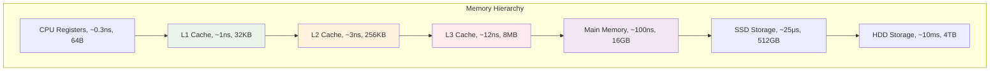

---
tags:
  - Memory
  - Performance
  - Cache
  - Memory Hierarchy
---

# 11.3a 메모리 계층구조와 캐시 최적화

## 2020년 4월, 메모리의 배신

2020년 4월 7일, 재택근무가 시작된 지 한 달째 되던 날. 우리 애플리케이션이 갑자기 느려지기 시작했다.

**이상한 현상들:**

- 서버 시작 후 1시간: 응답시간 200ms ✅
- 2시간 후: 응답시간 500ms 🤔
- 4시간 후: 응답시간 2초 😨
- 8시간 후: OutOfMemoryError 💥

CPU 사용률은 20%인데, 메모리는 계속 증가만 했다. "메모리 누수구나!"라고 생각했지만, 실제로는 **메모리 비효율성**이 진짜 문제였다.

**놀라운 발견:**

- 동일한 데이터를 여러 번 복사하는 코드
- 캐시 미스로 인한 성능 저하 (L1 캐시 히트율 30%)
- 메모리 할당/해제 오버헤드
- 메모리 단편화로 인한 성능 저하

이 경험을 통해 깨달았다: **메모리는 단순한 저장 공간이 아니라 성능의 핵심 요소**라는 것을.

## 메모리 계층구조와 성능

### 메모리 계층의 현실



### 실제 성능 차이 측정

```c
// memory_latency_test.c
#include <stdio.h>
#include <stdlib.h>
#include <time.h>
#include <string.h>

#define KB (1024)
#define MB (1024 * KB)

// 캐시 레벨별 접근 시간 측정
void measure_memory_latency() {
    // L1 캐시 크기 (32KB) 테스트
    int* l1_array = malloc(32 * KB);
    
    // L2 캐시 크기 (256KB) 테스트  
    int* l2_array = malloc(256 * KB);
    
    // L3 캐시 크기 (8MB) 테스트
    int* l3_array = malloc(8 * MB);
    
    // 메인 메모리 (128MB) 테스트
    int* ram_array = malloc(128 * MB);
    
    clock_t start, end;
    volatile int sum = 0;  // 컴파일러 최적화 방지
    
    printf("Memory Level\tSize\t\tAccess Time\n");
    printf("===========================================\n");
    
    // L1 캐시 테스트 (순차 접근)
    start = clock();
    for (int i = 0; i < 32 * KB / sizeof(int); i++) {
        sum += l1_array[i];
    }
    end = clock();
    printf("L1 Cache\t32KB\t\t%.2f ns/access\n", 
           (double)(end - start) * 1000000000 / CLOCKS_PER_SEC / (32 * KB / sizeof(int)));
    
    // L2 캐시 테스트
    start = clock();
    for (int i = 0; i < 256 * KB / sizeof(int); i++) {
        sum += l2_array[i];
    }
    end = clock();
    printf("L2 Cache\t256KB\t\t%.2f ns/access\n",
           (double)(end - start) * 1000000000 / CLOCKS_PER_SEC / (256 * KB / sizeof(int)));
    
    // L3 캐시 테스트
    start = clock();
    for (int i = 0; i < 8 * MB / sizeof(int); i++) {
        sum += l3_array[i];
    }
    end = clock();
    printf("L3 Cache\t8MB\t\t%.2f ns/access\n",
           (double)(end - start) * 1000000000 / CLOCKS_PER_SEC / (8 * MB / sizeof(int)));
    
    // 메인 메모리 테스트 (랜덤 접근으로 캐시 미스 유발)
    start = clock();
    for (int i = 0; i < 1000000; i++) {
        int idx = (i * 7919) % (128 * MB / sizeof(int));  // 랜덤 접근
        sum += ram_array[idx];
    }
    end = clock();
    printf("Main Memory\t128MB\t\t%.2f ns/access (random)\n",
           (double)(end - start) * 1000000000 / CLOCKS_PER_SEC / 1000000);
    
    printf("Total sum: %d (prevent optimization)\n", sum);
    
    free(l1_array);
    free(l2_array);
    free(l3_array);
    free(ram_array);
}

// 캐시 친화적 vs 비친화적 알고리즘 비교
void compare_cache_algorithms() {
    const int SIZE = 1000;
    int matrix[SIZE][SIZE];
    
    // 초기화
    for (int i = 0; i < SIZE; i++) {
        for (int j = 0; j < SIZE; j++) {
            matrix[i][j] = i * SIZE + j;
        }
    }
    
    clock_t start, end;
    volatile long sum = 0;
    
    // 캐시 친화적: 행 우선 접근 (row-major)
    printf("\n캐시 친화적 접근 (row-major):\n");
    start = clock();
    for (int i = 0; i < SIZE; i++) {
        for (int j = 0; j < SIZE; j++) {
            sum += matrix[i][j];  // 연속된 메모리 접근
        }
    }
    end = clock();
    double cache_friendly_time = (double)(end - start) / CLOCKS_PER_SEC;
    printf("시간: %.4f초, 합계: %ld\n", cache_friendly_time, sum);
    
    // 캐시 비친화적: 열 우선 접근 (column-major)  
    printf("캐시 비친화적 접근 (column-major):\n");
    sum = 0;
    start = clock();
    for (int j = 0; j < SIZE; j++) {
        for (int i = 0; i < SIZE; i++) {
            sum += matrix[i][j];  // 비연속된 메모리 접근
        }
    }
    end = clock();
    double cache_unfriendly_time = (double)(end - start) / CLOCKS_PER_SEC;
    printf("시간: %.4f초, 합계: %ld\n", cache_unfriendly_time, sum);
    
    printf("성능 차이: %.1f배 느림\n", cache_unfriendly_time / cache_friendly_time);
}

int main() {
    measure_memory_latency();
    compare_cache_algorithms();
    return 0;
}
```

## 캐시 최적화 기법

### 1. 데이터 지역성 (Data Locality) 최적화

```c
// 시간적 지역성 (Temporal Locality) 최적화
void optimize_temporal_locality() {
    int* data = malloc(1000000 * sizeof(int));
    
    // ❌ 나쁜 예: 데이터를 여러 번 순회
    for (int i = 0; i < 1000000; i++) {
        data[i] = i;
    }
    for (int i = 0; i < 1000000; i++) {
        data[i] = data[i] * 2;
    }
    for (int i = 0; i < 1000000; i++) {
        data[i] = data[i] + 1;
    }
    
    free(data);
    data = malloc(1000000 * sizeof(int));
    
    // ✅ 좋은 예: 한 번 순회로 모든 작업 완료
    for (int i = 0; i < 1000000; i++) {
        data[i] = i;
        data[i] = data[i] * 2;
        data[i] = data[i] + 1;
    }
    
    free(data);
}

// 공간적 지역성 (Spatial Locality) 최적화
typedef struct {
    int id;
    char name[64];
    double score;
    int active;      // 자주 사용
    char padding[60]; // 많은 공간 차지하지만 거의 사용 안함
} Student;

typedef struct {
    int id;
    int active;      // 자주 사용하는 데이터를 함께 배치
    double score;
} OptimizedStudent;

typedef struct {
    char name[64];
    char padding[60]; // 덜 사용하는 데이터는 별도 구조체
} StudentDetail;

void compare_data_layout() {
    const int COUNT = 100000;
    
    // ❌ 캐시 비친화적 구조체
    Student* students = malloc(COUNT * sizeof(Student));
    
    clock_t start = clock();
    for (int i = 0; i < COUNT; i++) {
        if (students[i].active) {  // 128바이트마다 4바이트만 사용
            students[i].score += 1.0;
        }
    }
    clock_t end = clock();
    printf("비최적화 구조체: %.4f초\n", (double)(end - start) / CLOCKS_PER_SEC);
    
    free(students);
    
    // ✅ 캐시 친화적 구조체
    OptimizedStudent* opt_students = malloc(COUNT * sizeof(OptimizedStudent));
    
    start = clock();
    for (int i = 0; i < COUNT; i++) {
        if (opt_students[i].active) {  // 16바이트마다 필요한 데이터만
            opt_students[i].score += 1.0;
        }
    }
    end = clock();
    printf("최적화 구조체: %.4f초\n", (double)(end - start) / CLOCKS_PER_SEC);
    
    free(opt_students);
}
```

### 2. 캐시 차단 (Cache Blocking) 기법

```c
// 행렬 곱셈 최적화 예제
void matrix_multiply_naive(int** A, int** B, int** C, int n) {
    // ❌ 캐시 비친화적 구현
    for (int i = 0; i < n; i++) {
        for (int j = 0; j < n; j++) {
            C[i][j] = 0;
            for (int k = 0; k < n; k++) {
                C[i][j] += A[i][k] * B[k][j];  // B[k][j]가 캐시 미스 유발
            }
        }
    }
}

void matrix_multiply_blocked(int** A, int** B, int** C, int n, int block_size) {
    // ✅ 캐시 차단으로 최적화
    for (int ii = 0; ii < n; ii += block_size) {
        for (int jj = 0; jj < n; jj += block_size) {
            for (int kk = 0; kk < n; kk += block_size) {
                
                // 블록 내에서 연산
                int i_max = (ii + block_size < n) ? ii + block_size : n;
                int j_max = (jj + block_size < n) ? jj + block_size : n;
                int k_max = (kk + block_size < n) ? kk + block_size : n;
                
                for (int i = ii; i < i_max; i++) {
                    for (int j = jj; j < j_max; j++) {
                        for (int k = kk; k < k_max; k++) {
                            C[i][j] += A[i][k] * B[k][j];
                        }
                    }
                }
            }
        }
    }
}

void benchmark_matrix_multiply() {
    const int n = 512;
    const int block_size = 64;  // L1 캐시 크기에 맞춘 블록 크기
    
    // 행렬 할당 및 초기화
    int** A = malloc(n * sizeof(int*));
    int** B = malloc(n * sizeof(int*));
    int** C = malloc(n * sizeof(int*));
    int** C_blocked = malloc(n * sizeof(int*));
    
    for (int i = 0; i < n; i++) {
        A[i] = malloc(n * sizeof(int));
        B[i] = malloc(n * sizeof(int));
        C[i] = malloc(n * sizeof(int));
        C_blocked[i] = malloc(n * sizeof(int));
        
        for (int j = 0; j < n; j++) {
            A[i][j] = rand() % 100;
            B[i][j] = rand() % 100;
            C[i][j] = 0;
            C_blocked[i][j] = 0;
        }
    }
    
    // 기본 구현 벤치마크
    clock_t start = clock();
    matrix_multiply_naive(A, B, C, n);
    clock_t end = clock();
    printf("기본 행렬 곱셈: %.4f초\n", (double)(end - start) / CLOCKS_PER_SEC);
    
    // 캐시 차단 구현 벤치마크
    start = clock();
    matrix_multiply_blocked(A, B, C_blocked, n, block_size);
    end = clock();
    printf("캐시 차단 행렬 곱셈: %.4f초\n", (double)(end - start) / CLOCKS_PER_SEC);
    
    // 메모리 해제
    for (int i = 0; i < n; i++) {
        free(A[i]); free(B[i]); free(C[i]); free(C_blocked[i]);
    }
    free(A); free(B); free(C); free(C_blocked);
}
```

### 3. 프리페칭 (Prefetching) 활용

```c
#ifdef __GNUC__
// GCC 컴파일러 내장 프리페칭 함수
void optimized_array_sum(int* arr, int size) {
    long sum = 0;
    
    for (int i = 0; i < size; i++) {
        // 다음 캐시 라인을 미리 로드
        if (i + 64 < size) {
            __builtin_prefetch(&arr[i + 64], 0, 3);
            // 0: 읽기용, 1: 쓰기용
            // 3: 모든 레벨 캐시에 유지
        }
        
        sum += arr[i];
    }
    
    printf("Sum: %ld\n", sum);
}
#endif

// 소프트웨어 프리페칭 시뮬레이션
void manual_prefetch_example() {
    const int SIZE = 1000000;
    int* data = malloc(SIZE * sizeof(int));
    
    // 데이터 초기화
    for (int i = 0; i < SIZE; i++) {
        data[i] = i;
    }
    
    clock_t start, end;
    volatile long sum = 0;
    
    // 프리페칭 없는 버전
    start = clock();
    for (int i = 0; i < SIZE; i++) {
        sum += data[i];
    }
    end = clock();
    printf("프리페칭 없음: %.4f초\n", (double)(end - start) / CLOCKS_PER_SEC);
    
    // 수동 프리페칭 시뮬레이션 (더 넓은 스트라이드로 미리 접근)
    sum = 0;
    start = clock();
    
    // 첫 번째 패스: 프리페칭
    for (int i = 0; i < SIZE; i += 64) {  // 캐시 라인 크기만큼 건너뛰며
        volatile int prefetch = data[i];  // 미리 로드
    }
    
    // 두 번째 패스: 실제 계산
    for (int i = 0; i < SIZE; i++) {
        sum += data[i];
    }
    
    end = clock();
    printf("수동 프리페칭: %.4f초\n", (double)(end - start) / CLOCKS_PER_SEC);
    
    free(data);
}
```

## 핵심 요점

### 1. 메모리 계층을 이해하라

**캐시는 단순한 저장소가 아니라 성능의 핵심**이다. L1 캐시와 메인 메모리의 속도 차이는 100배 이상이다.

### 2. 데이터 지역성을 고려하라

- **시간적 지역성**: 방금 사용한 데이터를 다시 사용
- **공간적 지역성**: 연속된 메모리 위치 접근

### 3. 캐시 친화적 알고리즘을 사용하라

- 캐시 차단(Cache Blocking)으로 큰 데이터셋 처리 최적화
- 프리페칭으로 메모리 대기 시간 감소
- 구조체 레이아웃 최적화로 캐시 효율성 향상

---

**다음**: [11.3b 메모리 할당 최적화](03b-memory-allocation.md)에서 메모리 풀, 스택 할당자 등 고성능 메모리 할당 기법을 학습합니다.
