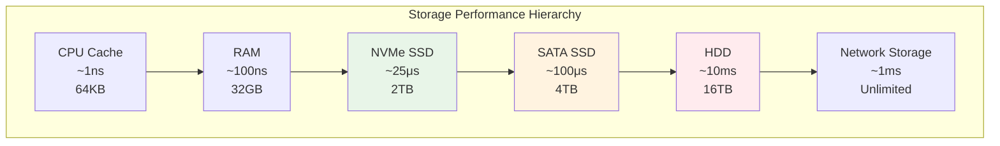

---
tags:
  - IO
  - Performance
  - Disk
  - Network
  - Async
  - Optimization
---

# 11.4 I/O 성능 최적화

## 2021년 7월, I/O 병목의 늪

2021년 7월, 우리 데이터 처리 시스템에 심각한 문제가 발생했다. CPU는 10%만 사용하고 메모리도 충분한데, 전체 시스템이 느려터졌다.

**당시 상황:**

- 1GB 파일 처리 시간: 45분 😨
- CPU 대기 시간 (iowait): 89%
- 디스크 사용률 (%util): 100%
- 초당 처리 파일 수: 2개

**원인 분석 결과:**

- 동기식 I/O로 인한 스레드 블로킹
- 작은 단위 (4KB)의 랜덤 읽기/쓰기
- 버퍼링 없는 직접 파일 접근
- 네트워크 I/O와 디스크 I/O 혼재로 인한 대기

**최적화 후 결과:**

- 1GB 파일 처리 시간: 3분 ⚡ (15배 개선)
- CPU 사용률: 85%
- 초당 처리 파일 수: 50개

이 경험을 통해 깨달았다: **I/O는 현대 시스템 성능의 가장 큰 병목**이라는 것을.

## I/O 서브시스템의 이해

### 스토리지 계층구조와 성능



### I/O 패턴 분석 도구

```bash
#!/bin/bash
# io_analysis.sh - I/O 성능 분석 스크립트

echo "=== 현재 I/O 상태 분석 ==="

# 1. 전체 I/O 통계
echo "1. 전체 I/O 통계:"
iostat -x 1 3

echo -e "\n2. 프로세스별 I/O 사용량:"
iotop -a -o

echo -e "\n3. 디스크별 상세 통계:"
for disk in $(lsblk -d -n -o NAME | grep -v loop); do
    echo "--- /dev/$disk ---"
    iostat -x /dev/$disk 1 1
    
    # 큐 깊이 확인
    echo "큐 깊이: $(cat /sys/block/$disk/queue/nr_requests)"
    echo "스케줄러: $(cat /sys/block/$disk/queue/scheduler)"
done

echo -e "\n4. 파일 시스템 캐시 통계:"
cat /proc/meminfo | grep -E "Cached|Buffers|Dirty"

echo -e "\n5. I/O 대기 시간 분석:"
vmstat 1 5 | awk 'NR>2 {sum+=$16; count++} END {print "평균 I/O 대기:", sum/count "%"}'

echo -e "\n6. 파일 디스크립터 사용량:"
echo "시스템 전체: $(cat /proc/sys/fs/file-nr | cut -f1)"
echo "프로세스별 상위 10개:"
lsof | awk '{print $2}' | sort | uniq -c | sort -nr | head -10

echo -e "\n=== I/O 병목 진단 ==="
echo "디스크 사용률 > 90%: I/O 병목 가능성 높음"
echo "평균 대기시간 > 10ms: 디스크 포화 상태"
echo "큐 깊이가 높음: 비동기 I/O 고려 필요"
```

## 동기 vs 비동기 I/O

### 동기 I/O의 한계

```c
// synchronous_io.c - 동기 I/O 예제
#include <stdio.h>
#include <stdlib.h>
#include <time.h>
#include <sys/stat.h>

// 동기식 파일 복사 (비효율적)
void sync_file_copy(const char* source, const char* dest) {
    FILE* src = fopen(source, "rb");
    FILE* dst = fopen(dest, "wb");
    
    if (!src || !dst) {
        perror("파일 열기 실패");
        return;
    }
    
    char buffer[4096];  // 작은 버퍼 사용
    size_t bytes_read;
    
    clock_t start = clock();
    
    // 동기식으로 읽기/쓰기 반복
    while ((bytes_read = fread(buffer, 1, sizeof(buffer), src)) > 0) {
        fwrite(buffer, 1, bytes_read, dst);
        // 각 I/O 작업마다 블로킹 발생
    }
    
    clock_t end = clock();
    
    fclose(src);
    fclose(dst);
    
    printf("동기 I/O 복사 시간: %.2f초\n", 
           (double)(end - start) / CLOCKS_PER_SEC);
}

// 버퍼 크기 최적화 버전
void optimized_sync_copy(const char* source, const char* dest) {
    FILE* src = fopen(source, "rb");
    FILE* dst = fopen(dest, "wb");
    
    if (!src || !dst) {
        perror("파일 열기 실패");
        return;
    }
    
    // 더 큰 버퍼 사용 (64KB)
    char* buffer = malloc(65536);
    size_t bytes_read;
    
    clock_t start = clock();
    
    while ((bytes_read = fread(buffer, 1, 65536, src)) > 0) {
        fwrite(buffer, 1, bytes_read, dst);
    }
    
    clock_t end = clock();
    
    free(buffer);
    fclose(src);
    fclose(dst);
    
    printf("최적화된 동기 I/O: %.2f초\n", 
           (double)(end - start) / CLOCKS_PER_SEC);
}

int main() {
    // 테스트 파일 생성 (100MB)
    printf("테스트 파일 생성 중...\n");
    FILE* test_file = fopen("test_large.bin", "wb");
    char data[1024];
    for (int i = 0; i < 1024; i++) data[i] = i % 256;
    
    for (int i = 0; i < 100 * 1024; i++) {  // 100MB
        fwrite(data, 1, 1024, test_file);
    }
    fclose(test_file);
    
    // 성능 비교
    sync_file_copy("test_large.bin", "copy1.bin");
    optimized_sync_copy("test_large.bin", "copy2.bin");
    
    // 정리
    remove("test_large.bin");
    remove("copy1.bin");
    remove("copy2.bin");
    
    return 0;
}
```

### Linux AIO (Asynchronous I/O) 활용

```c
// async_io.c - 비동기 I/O 예제
#include <stdio.h>
#include <stdlib.h>
#include <string.h>
#include <unistd.h>
#include <fcntl.h>
#include <libaio.h>  // -laio 링크 필요
#include <sys/time.h>

#define BUFFER_SIZE 65536
#define MAX_EVENTS 32

typedef struct {
    char* buffer;
    int fd;
    off_t offset;
    size_t size;
} AsyncRequest;

// 비동기 파일 읽기
void async_file_read(const char* filename) {
    int fd = open(filename, O_RDONLY | O_DIRECT);  // Direct I/O 사용
    if (fd == -1) {
        perror("파일 열기 실패");
        return;
    }
    
    // AIO 컨텍스트 초기화
    io_context_t ctx = 0;
    if (io_setup(MAX_EVENTS, &ctx) != 0) {
        perror("io_setup 실패");
        close(fd);
        return;
    }
    
    struct stat st;
    fstat(fd, &st);
    size_t file_size = st.st_size;
    
    printf("파일 크기: %zu bytes\n", file_size);
    
    // 여러 비동기 요청 준비
    struct iocb* iocbs[MAX_EVENTS];
    AsyncRequest requests[MAX_EVENTS];
    
    int num_requests = 0;
    off_t offset = 0;
    
    struct timeval start, end;
    gettimeofday(&start, NULL);
    
    // 비동기 읽기 요청 제출
    while (offset < file_size && num_requests < MAX_EVENTS) {
        size_t read_size = (file_size - offset > BUFFER_SIZE) ? 
                          BUFFER_SIZE : (file_size - offset);
        
        // 정렬된 메모리 할당 (Direct I/O 요구사항)
        if (posix_memalign((void**)&requests[num_requests].buffer, 
                          4096, BUFFER_SIZE) != 0) {
            perror("메모리 정렬 실패");
            break;
        }
        
        requests[num_requests].fd = fd;
        requests[num_requests].offset = offset;
        requests[num_requests].size = read_size;
        
        // iocb 구조체 설정
        iocbs[num_requests] = malloc(sizeof(struct iocb));
        io_prep_pread(iocbs[num_requests], 
                     fd, 
                     requests[num_requests].buffer,
                     read_size, 
                     offset);
        
        offset += read_size;
        num_requests++;
    }
    
    printf("비동기 요청 %d개 제출\n", num_requests);
    
    // 모든 요청 제출
    if (io_submit(ctx, num_requests, iocbs) != num_requests) {
        perror("io_submit 실패");
    }
    
    // 완료된 요청들 처리
    struct io_event events[MAX_EVENTS];
    int completed = 0;
    
    while (completed < num_requests) {
        int ret = io_getevents(ctx, 1, MAX_EVENTS, events, NULL);
        if (ret < 0) {
            perror("io_getevents 실패");
            break;
        }
        
        for (int i = 0; i < ret; i++) {
            struct iocb* iocb = (struct iocb*)events[i].obj;
            long res = events[i].res;
            
            if (res < 0) {
                printf("I/O 에러: %s\n", strerror(-res));
            } else {
                printf("완료: %ld bytes 읽음\n", res);
                // 실제로는 여기서 데이터 처리
            }
            completed++;
        }
    }
    
    gettimeofday(&end, NULL);
    
    double elapsed = (end.tv_sec - start.tv_sec) + 
                    (end.tv_usec - start.tv_usec) / 1000000.0;
    
    printf("비동기 I/O 완료 시간: %.2f초\n", elapsed);
    printf("처리량: %.2f MB/s\n", 
           (file_size / 1024.0 / 1024.0) / elapsed);
    
    // 정리
    for (int i = 0; i < num_requests; i++) {
        free(requests[i].buffer);
        free(iocbs[i]);
    }
    
    io_destroy(ctx);
    close(fd);
}

int main() {
    async_file_read("test_file.bin");
    return 0;
}
```

### io_uring - 차세대 비동기 I/O

```c
// io_uring_example.c - io_uring 활용 예제
#include <stdio.h>
#include <stdlib.h>
#include <string.h>
#include <fcntl.h>
#include <unistd.h>
#include <sys/stat.h>
#include <liburing.h>  // -luring 링크 필요

#define QUEUE_DEPTH 32
#define BUFFER_SIZE 65536

// io_uring을 이용한 고성능 파일 복사
void uring_file_copy(const char* source, const char* dest) {
    struct io_uring ring;
    int src_fd, dst_fd;
    struct stat st;
    
    // 파일 열기
    src_fd = open(source, O_RDONLY);
    dst_fd = open(dest, O_WRONLY | O_CREAT | O_TRUNC, 0644);
    
    if (src_fd < 0 || dst_fd < 0) {
        perror("파일 열기 실패");
        return;
    }
    
    fstat(src_fd, &st);
    size_t file_size = st.st_size;
    
    // io_uring 초기화
    if (io_uring_queue_init(QUEUE_DEPTH, &ring, 0) < 0) {
        perror("io_uring_queue_init 실패");
        return;
    }
    
    printf("io_uring 파일 복사 시작 (크기: %zu bytes)\n", file_size);
    
    struct timeval start, end;
    gettimeofday(&start, NULL);
    
    // 파이프라인 방식으로 읽기/쓰기 동시 처리
    char* buffers[2];
    buffers[0] = malloc(BUFFER_SIZE);
    buffers[1] = malloc(BUFFER_SIZE);
    
    off_t offset = 0;
    int active_buffer = 0;
    int read_pending = 0;
    int write_pending = 0;
    size_t total_copied = 0;
    
    while (offset < file_size || read_pending || write_pending) {
        struct io_uring_sqe *sqe;
        struct io_uring_cqe *cqe;
        
        // 읽기 요청 제출
        if (offset < file_size && !read_pending) {
            size_t read_size = (file_size - offset > BUFFER_SIZE) ? 
                              BUFFER_SIZE : (file_size - offset);
            
            sqe = io_uring_get_sqe(&ring);
            io_uring_prep_read(sqe, src_fd, buffers[active_buffer], 
                              read_size, offset);
            io_uring_sqe_set_data(sqe, (void*)1);  // 읽기 식별자
            
            read_pending = 1;
            offset += read_size;
        }
        
        // 요청 제출
        io_uring_submit(&ring);
        
        // 완료 이벤트 처리
        if (io_uring_wait_cqe(&ring, &cqe) < 0) {
            perror("io_uring_wait_cqe 실패");
            break;
        }
        
        int is_read = (intptr_t)io_uring_cqe_get_data(cqe);
        int result = cqe->res;
        
        if (result < 0) {
            printf("I/O 오류: %s\n", strerror(-result));
            io_uring_cqe_seen(&ring, cqe);
            break;
        }
        
        if (is_read && result > 0) {
            // 읽기 완료 - 쓰기 요청 제출
            read_pending = 0;
            
            sqe = io_uring_get_sqe(&ring);
            io_uring_prep_write(sqe, dst_fd, buffers[active_buffer], 
                               result, total_copied);
            io_uring_sqe_set_data(sqe, (void*)0);  // 쓰기 식별자
            
            write_pending = 1;
            active_buffer = 1 - active_buffer;  // 버퍼 스왑
            
        } else if (!is_read && result > 0) {
            // 쓰기 완료
            write_pending = 0;
            total_copied += result;
        }
        
        io_uring_cqe_seen(&ring, cqe);
    }
    
    gettimeofday(&end, NULL);
    
    double elapsed = (end.tv_sec - start.tv_sec) + 
                    (end.tv_usec - start.tv_usec) / 1000000.0;
    
    printf("io_uring 복사 완료: %.2f초\n", elapsed);
    printf("처리량: %.2f MB/s\n", 
           (file_size / 1024.0 / 1024.0) / elapsed);
    
    // 정리
    free(buffers[0]);
    free(buffers[1]);
    io_uring_queue_exit(&ring);
    close(src_fd);
    close(dst_fd);
}

int main() {
    // 테스트 파일 생성
    int fd = open("test_uring.bin", O_WRONLY | O_CREAT | O_TRUNC, 0644);
    char data[1024];
    for (int i = 0; i < 1024; i++) data[i] = i % 256;
    
    for (int i = 0; i < 100 * 1024; i++) {  // 100MB
        write(fd, data, 1024);
    }
    close(fd);
    
    // io_uring 파일 복사 테스트
    uring_file_copy("test_uring.bin", "copy_uring.bin");
    
    // 정리
    unlink("test_uring.bin");
    unlink("copy_uring.bin");
    
    return 0;
}
```

## 네트워크 I/O 최적화

### epoll을 이용한 고성능 서버

```c
// epoll_server.c - epoll 기반 고성능 서버
#include <stdio.h>
#include <stdlib.h>
#include <string.h>
#include <unistd.h>
#include <fcntl.h>
#include <errno.h>
#include <sys/socket.h>
#include <sys/epoll.h>
#include <netinet/in.h>
#include <arpa/inet.h>

#define MAX_EVENTS 1000
#define BUFFER_SIZE 4096

// 소켓을 논블로킹 모드로 설정
int set_nonblocking(int fd) {
    int flags = fcntl(fd, F_GETFL, 0);
    if (flags == -1) return -1;
    
    return fcntl(fd, F_SETFL, flags | O_NONBLOCK);
}

// 클라이언트 연결 처리
void handle_client(int epoll_fd, int client_fd) {
    char buffer[BUFFER_SIZE];
    ssize_t bytes_read;
    
    while ((bytes_read = read(client_fd, buffer, sizeof(buffer))) > 0) {
        // 에코 서버: 받은 데이터를 그대로 전송
        if (write(client_fd, buffer, bytes_read) != bytes_read) {
            perror("write 오류");
            break;
        }
    }
    
    if (bytes_read == -1 && errno != EAGAIN && errno != EWOULDBLOCK) {
        perror("read 오류");
    }
    
    if (bytes_read == 0) {
        // 클라이언트 연결 종료
        printf("클라이언트 연결 종료: fd=%d\n", client_fd);
        epoll_ctl(epoll_fd, EPOLL_CTL_DEL, client_fd, NULL);
        close(client_fd);
    }
}

// epoll 기반 서버 메인 루프
void run_epoll_server(int port) {
    int server_fd, epoll_fd;
    struct sockaddr_in server_addr;
    struct epoll_event event, events[MAX_EVENTS];
    
    // 서버 소켓 생성
    server_fd = socket(AF_INET, SOCK_STREAM, 0);
    if (server_fd == -1) {
        perror("socket 생성 실패");
        return;
    }
    
    // 소켓 옵션 설정
    int opt = 1;
    setsockopt(server_fd, SOL_SOCKET, SO_REUSEADDR, &opt, sizeof(opt));
    
    // 논블로킹 모드 설정
    set_nonblocking(server_fd);
    
    // 서버 주소 설정
    memset(&server_addr, 0, sizeof(server_addr));
    server_addr.sin_family = AF_INET;
    server_addr.sin_addr.s_addr = INADDR_ANY;
    server_addr.sin_port = htons(port);
    
    // 바인드 및 리슨
    if (bind(server_fd, (struct sockaddr*)&server_addr, sizeof(server_addr)) == -1) {
        perror("bind 실패");
        close(server_fd);
        return;
    }
    
    if (listen(server_fd, SOMAXCONN) == -1) {
        perror("listen 실패");
        close(server_fd);
        return;
    }
    
    // epoll 인스턴스 생성
    epoll_fd = epoll_create1(0);
    if (epoll_fd == -1) {
        perror("epoll_create1 실패");
        close(server_fd);
        return;
    }
    
    // 서버 소켓을 epoll에 추가
    event.events = EPOLLIN;
    event.data.fd = server_fd;
    if (epoll_ctl(epoll_fd, EPOLL_CTL_ADD, server_fd, &event) == -1) {
        perror("epoll_ctl 실패");
        close(server_fd);
        close(epoll_fd);
        return;
    }
    
    printf("epoll 서버 시작 (포트: %d)\n", port);
    
    // 메인 이벤트 루프
    while (1) {
        int event_count = epoll_wait(epoll_fd, events, MAX_EVENTS, -1);
        
        if (event_count == -1) {
            perror("epoll_wait 실패");
            break;
        }
        
        for (int i = 0; i < event_count; i++) {
            if (events[i].data.fd == server_fd) {
                // 새로운 클라이언트 연결
                struct sockaddr_in client_addr;
                socklen_t client_len = sizeof(client_addr);
                
                int client_fd = accept(server_fd, 
                                     (struct sockaddr*)&client_addr, 
                                     &client_len);
                
                if (client_fd == -1) {
                    perror("accept 실패");
                    continue;
                }
                
                // 클라이언트 소켓을 논블로킹 모드로 설정
                set_nonblocking(client_fd);
                
                // epoll에 클라이언트 소켓 추가
                event.events = EPOLLIN | EPOLLET;  // Edge-triggered 모드
                event.data.fd = client_fd;
                
                if (epoll_ctl(epoll_fd, EPOLL_CTL_ADD, client_fd, &event) == -1) {
                    perror("클라이언트 소켓 epoll_ctl 실패");
                    close(client_fd);
                    continue;
                }
                
                printf("새 클라이언트 연결: %s:%d (fd=%d)\n",
                       inet_ntoa(client_addr.sin_addr),
                       ntohs(client_addr.sin_port),
                       client_fd);
                
            } else {
                // 클라이언트 데이터 처리
                handle_client(epoll_fd, events[i].data.fd);
            }
        }
    }
    
    close(server_fd);
    close(epoll_fd);
}

int main() {
    run_epoll_server(8080);
    return 0;
}
```

### 네트워크 성능 최적화 기법

```c
// network_optimization.c - 네트워크 최적화 예제
#include <stdio.h>
#include <stdlib.h>
#include <string.h>
#include <unistd.h>
#include <sys/socket.h>
#include <netinet/in.h>
#include <netinet/tcp.h>

// TCP 소켓 최적화 설정
void optimize_tcp_socket(int socket_fd) {
    int opt;
    
    // 1. TCP_NODELAY: Nagle 알고리즘 비활성화
    opt = 1;
    if (setsockopt(socket_fd, IPPROTO_TCP, TCP_NODELAY, &opt, sizeof(opt)) < 0) {
        perror("TCP_NODELAY 설정 실패");
    }
    
    // 2. SO_REUSEADDR: 주소 재사용 허용
    opt = 1;
    if (setsockopt(socket_fd, SOL_SOCKET, SO_REUSEADDR, &opt, sizeof(opt)) < 0) {
        perror("SO_REUSEADDR 설정 실패");
    }
    
    // 3. 송신 버퍼 크기 증가
    opt = 1024 * 1024;  // 1MB
    if (setsockopt(socket_fd, SOL_SOCKET, SO_SNDBUF, &opt, sizeof(opt)) < 0) {
        perror("SO_SNDBUF 설정 실패");
    }
    
    // 4. 수신 버퍼 크기 증가
    opt = 1024 * 1024;  // 1MB
    if (setsockopt(socket_fd, SOL_SOCKET, SO_RCVBUF, &opt, sizeof(opt)) < 0) {
        perror("SO_RCVBUF 설정 실패");
    }
    
    // 5. TCP_CORK: 작은 패킷들을 합쳐서 전송
    opt = 1;
    if (setsockopt(socket_fd, IPPROTO_TCP, TCP_CORK, &opt, sizeof(opt)) < 0) {
        perror("TCP_CORK 설정 실패");
    }
    
    printf("TCP 소켓 최적화 완료\n");
}

// 대량 데이터 전송을 위한 최적화된 send 함수
ssize_t optimized_send(int socket_fd, const void* data, size_t size) {
    const char* ptr = (const char*)data;
    size_t remaining = size;
    ssize_t total_sent = 0;
    
    // 큰 청크로 나누어 전송
    const size_t chunk_size = 65536;  // 64KB
    
    while (remaining > 0) {
        size_t send_size = (remaining > chunk_size) ? chunk_size : remaining;
        
        ssize_t sent = send(socket_fd, ptr, send_size, MSG_NOSIGNAL);
        if (sent <= 0) {
            if (sent == -1 && (errno == EAGAIN || errno == EWOULDBLOCK)) {
                // 논블로킹 소켓에서 일시적으로 보낼 수 없음
                usleep(1000);  // 1ms 대기
                continue;
            }
            return -1;  // 에러 발생
        }
        
        ptr += sent;
        remaining -= sent;
        total_sent += sent;
    }
    
    return total_sent;
}

// sendfile() 시스템 콜을 이용한 제로 카피 전송
#include <sys/sendfile.h>

ssize_t zero_copy_file_send(int socket_fd, const char* filename) {
    int file_fd = open(filename, O_RDONLY);
    if (file_fd == -1) {
        perror("파일 열기 실패");
        return -1;
    }
    
    struct stat st;
    fstat(file_fd, &st);
    size_t file_size = st.st_size;
    
    printf("제로 카피로 파일 전송 시작: %zu bytes\n", file_size);
    
    struct timeval start, end;
    gettimeofday(&start, NULL);
    
    // sendfile()로 커널에서 직접 전송 (유저 공간 복사 없음)
    ssize_t sent = sendfile(socket_fd, file_fd, NULL, file_size);
    
    gettimeofday(&end, NULL);
    
    double elapsed = (end.tv_sec - start.tv_sec) + 
                    (end.tv_usec - start.tv_usec) / 1000000.0;
    
    printf("제로 카피 전송 완료: %.2f초, %.2f MB/s\n", 
           elapsed, (file_size / 1024.0 / 1024.0) / elapsed);
    
    close(file_fd);
    return sent;
}

// 벡터 I/O (scatter-gather)를 이용한 효율적 전송
#include <sys/uio.h>

ssize_t vectorized_send(int socket_fd, struct iovec* iov, int iovcnt) {
    // writev()로 여러 버퍼를 한 번에 전송
    ssize_t total_sent = 0;
    int current_iov = 0;
    
    while (current_iov < iovcnt) {
        ssize_t sent = writev(socket_fd, &iov[current_iov], iovcnt - current_iov);
        
        if (sent <= 0) {
            if (sent == -1 && (errno == EAGAIN || errno == EWOULDBLOCK)) {
                usleep(1000);
                continue;
            }
            return -1;
        }
        
        total_sent += sent;
        
        // 전송된 만큼 iovec 조정
        while (current_iov < iovcnt && sent >= iov[current_iov].iov_len) {
            sent -= iov[current_iov].iov_len;
            current_iov++;
        }
        
        if (current_iov < iovcnt) {
            iov[current_iov].iov_base = (char*)iov[current_iov].iov_base + sent;
            iov[current_iov].iov_len -= sent;
        }
    }
    
    return total_sent;
}

// HTTP 응답 예시 (헤더 + 바디를 vectorized I/O로 전송)
void send_http_response(int client_fd, const char* body, size_t body_len) {
    char header[512];
    snprintf(header, sizeof(header),
             "HTTP/1.1 200 OK\r\n"
             "Content-Type: text/html\r\n"
             "Content-Length: %zu\r\n"
             "Connection: keep-alive\r\n"
             "\r\n", body_len);
    
    // vectorized I/O로 헤더와 바디를 한 번에 전송
    struct iovec iov[2];
    iov[0].iov_base = header;
    iov[0].iov_len = strlen(header);
    iov[1].iov_base = (void*)body;
    iov[1].iov_len = body_len;
    
    ssize_t sent = vectorized_send(client_fd, iov, 2);
    printf("HTTP 응답 전송: %zd bytes\n", sent);
}
```

## 디스크 I/O 최적화

### 파일 시스템 최적화

```bash
#!/bin/bash
# filesystem_optimization.sh - 파일 시스템 최적화

echo "=== 파일 시스템 성능 최적화 ==="

# 1. 마운트 옵션 최적화
echo "1. 추천 마운트 옵션:"
echo "   - noatime: 접근 시간 업데이트 비활성화"
echo "   - barrier=0: 쓰기 배리어 비활성화 (위험하지만 빠름)"
echo "   - data=writeback: 저널링 모드 변경"

# 현재 마운트 옵션 확인
echo "현재 마운트 상태:"
mount | grep -E "ext[34]|xfs|btrfs"

# 2. 파일 시스템별 최적화
echo -e "\n2. 파일 시스템별 최적화:"

# ext4 최적화
echo "ext4 최적화:"
echo "  sudo tune2fs -o journal_data_writeback /dev/sdX"
echo "  sudo mount -o remount,noatime,barrier=0,data=writeback /"

# XFS 최적화  
echo "XFS 최적화:"
echo "  sudo mount -o remount,noatime,nobarrier,logbufs=8,logbsize=256k /"

# 3. I/O 스케줄러 최적화
echo -e "\n3. I/O 스케줄러 확인 및 변경:"
for disk in $(lsblk -d -n -o NAME | grep -v loop); do
    scheduler=$(cat /sys/block/$disk/queue/scheduler)
    echo "$disk: $scheduler"
    
    # SSD의 경우 noop 또는 deadline 권장
    # HDD의 경우 cfq 권장
    echo "SSD라면: echo noop > /sys/block/$disk/queue/scheduler"
    echo "HDD라면: echo cfq > /sys/block/$disk/queue/scheduler"
done

# 4. 파일 시스템 캐시 조정
echo -e "\n4. 시스템 캐시 설정:"
echo "현재 설정:"
cat /proc/sys/vm/dirty_ratio
cat /proc/sys/vm/dirty_background_ratio
cat /proc/sys/vm/dirty_writeback_centisecs

echo "성능 최적화 설정:"
echo "echo 40 > /proc/sys/vm/dirty_ratio"          # 더 많은 더티 페이지 허용
echo "echo 10 > /proc/sys/vm/dirty_background_ratio"
echo "echo 500 > /proc/sys/vm/dirty_writeback_centisecs"  # 더 자주 플러시

# 5. 대용량 파일 처리를 위한 readahead 조정
echo -e "\n5. readahead 설정:"
for disk in $(lsblk -d -n -o NAME | grep -v loop); do
    current_readahead=$(blockdev --getra /dev/$disk)
    echo "/dev/$disk 현재 readahead: $current_readahead"
    echo "대용량 순차 읽기 최적화: blockdev --setra 4096 /dev/$disk"
done
```

### 고성능 파일 I/O 라이브러리

```c
// high_performance_io.c - 고성능 파일 I/O
#include <stdio.h>
#include <stdlib.h>
#include <string.h>
#include <unistd.h>
#include <fcntl.h>
#include <sys/mman.h>
#include <sys/stat.h>

// 메모리 매핑을 이용한 파일 처리
void* mmap_file_read(const char* filename, size_t* file_size) {
    int fd = open(filename, O_RDONLY);
    if (fd == -1) {
        perror("파일 열기 실패");
        return NULL;
    }
    
    struct stat st;
    if (fstat(fd, &st) == -1) {
        perror("fstat 실패");
        close(fd);
        return NULL;
    }
    
    *file_size = st.st_size;
    
    // 파일을 메모리에 매핑
    void* mapped = mmap(NULL, *file_size, PROT_READ, MAP_PRIVATE, fd, 0);
    close(fd);
    
    if (mapped == MAP_FAILED) {
        perror("mmap 실패");
        return NULL;
    }
    
    // 순차 접근 힌트 제공
    madvise(mapped, *file_size, MADV_SEQUENTIAL);
    
    return mapped;
}

// Direct I/O를 이용한 버퍼 캐시 우회
void direct_io_example(const char* filename) {
    // O_DIRECT 플래그로 버퍼 캐시 우회
    int fd = open(filename, O_RDONLY | O_DIRECT);
    if (fd == -1) {
        perror("Direct I/O 파일 열기 실패");
        return;
    }
    
    // Direct I/O는 정렬된 메모리 버퍼 필요
    void* buffer;
    size_t buffer_size = 65536;  // 64KB
    
    if (posix_memalign(&buffer, 4096, buffer_size) != 0) {
        perror("정렬된 메모리 할당 실패");
        close(fd);
        return;
    }
    
    printf("Direct I/O 읽기 시작\n");
    
    struct timeval start, end;
    gettimeofday(&start, NULL);
    
    ssize_t total_read = 0;
    ssize_t bytes_read;
    
    while ((bytes_read = read(fd, buffer, buffer_size)) > 0) {
        total_read += bytes_read;
        // 실제로는 여기서 데이터 처리
    }
    
    gettimeofday(&end, NULL);
    
    double elapsed = (end.tv_sec - start.tv_sec) + 
                    (end.tv_usec - start.tv_usec) / 1000000.0;
    
    printf("Direct I/O 완료: %zd bytes, %.2f초\n", total_read, elapsed);
    printf("처리량: %.2f MB/s\n", 
           (total_read / 1024.0 / 1024.0) / elapsed);
    
    free(buffer);
    close(fd);
}

// 대용량 파일 스트리밍 처리
typedef struct {
    int fd;
    char* buffer;
    size_t buffer_size;
    size_t buffer_pos;
    size_t buffer_end;
    off_t file_pos;
} StreamReader;

StreamReader* stream_reader_create(const char* filename, size_t buffer_size) {
    StreamReader* reader = malloc(sizeof(StreamReader));
    if (!reader) return NULL;
    
    reader->fd = open(filename, O_RDONLY);
    if (reader->fd == -1) {
        free(reader);
        return NULL;
    }
    
    reader->buffer = malloc(buffer_size);
    if (!reader->buffer) {
        close(reader->fd);
        free(reader);
        return NULL;
    }
    
    reader->buffer_size = buffer_size;
    reader->buffer_pos = 0;
    reader->buffer_end = 0;
    reader->file_pos = 0;
    
    return reader;
}

int stream_reader_read_line(StreamReader* reader, char* line, size_t max_len) {
    size_t line_pos = 0;
    
    while (line_pos < max_len - 1) {
        // 버퍼가 비어있으면 새로 읽기
        if (reader->buffer_pos >= reader->buffer_end) {
            ssize_t bytes_read = read(reader->fd, reader->buffer, reader->buffer_size);
            if (bytes_read <= 0) {
                break;  // EOF 또는 에러
            }
            
            reader->buffer_pos = 0;
            reader->buffer_end = bytes_read;
            reader->file_pos += bytes_read;
        }
        
        char c = reader->buffer[reader->buffer_pos++];
        
        if (c == '\n') {
            break;
        }
        
        line[line_pos++] = c;
    }
    
    line[line_pos] = '\0';
    return line_pos;
}

void stream_reader_destroy(StreamReader* reader) {
    if (reader) {
        close(reader->fd);
        free(reader->buffer);
        free(reader);
    }
}

// 대용량 텍스트 파일 처리 예제
void process_large_text_file(const char* filename) {
    StreamReader* reader = stream_reader_create(filename, 1024 * 1024);  // 1MB 버퍼
    if (!reader) {
        printf("스트림 리더 생성 실패\n");
        return;
    }
    
    char line[4096];
    int line_count = 0;
    
    struct timeval start, end;
    gettimeofday(&start, NULL);
    
    while (stream_reader_read_line(reader, line, sizeof(line)) > 0) {
        line_count++;
        // 실제로는 여기서 라인 처리
        
        if (line_count % 100000 == 0) {
            printf("처리된 라인: %d\n", line_count);
        }
    }
    
    gettimeofday(&end, NULL);
    
    double elapsed = (end.tv_sec - start.tv_sec) + 
                    (end.tv_usec - start.tv_usec) / 1000000.0;
    
    printf("총 %d 라인 처리 완료: %.2f초\n", line_count, elapsed);
    printf("처리 속도: %.0f 라인/초\n", line_count / elapsed);
    
    stream_reader_destroy(reader);
}

int main() {
    // 1. 메모리 맵 파일 읽기 테스트
    size_t file_size;
    void* mapped = mmap_file_read("test.txt", &file_size);
    if (mapped) {
        printf("메모리 맵으로 %zu bytes 읽음\n", file_size);
        munmap(mapped, file_size);
    }
    
    // 2. Direct I/O 테스트
    direct_io_example("test.bin");
    
    // 3. 스트리밍 텍스트 처리 테스트
    process_large_text_file("large_text.txt");
    
    return 0;
}
```

## I/O 성능 모니터링

### 실시간 I/O 모니터링 도구

```bash
#!/bin/bash
# io_monitoring.sh - I/O 성능 모니터링

echo "=== I/O 성능 실시간 모니터링 ==="

# 1. iostat으로 전체 디스크 I/O 상태
echo "1. 디스크 I/O 통계 (5초간):"
iostat -x 1 5

# 2. iotop으로 프로세스별 I/O 사용량
echo -e "\n2. 프로세스별 I/O 사용량 (상위 10개):"
iotop -b -n 1 | head -20

# 3. 각 디스크별 큐 상태
echo -e "\n3. 디스크 큐 상태:"
for disk in $(lsblk -d -n -o NAME | grep -v loop); do
    echo "=== /dev/$disk ==="
    echo "큐 깊이: $(cat /sys/block/$disk/queue/nr_requests)"
    echo "스케줄러: $(cat /sys/block/$disk/queue/scheduler)"
    echo "읽기 앞서읽기: $(cat /sys/block/$disk/queue/read_ahead_kb)"
    
    # I/O 통계
    echo "I/O 통계:"
    cat /sys/block/$disk/stat | awk '{
        printf "읽기: %d 섹터, 쓰기: %d 섹터\n", $3, $7
        printf "읽기 시간: %d ms, 쓰기 시간: %d ms\n", $4, $8
        printf "진행 중인 I/O: %d, 총 I/O 시간: %d ms\n", $9, $10
    }'
done

# 4. 파일 시스템 캐시 상태
echo -e "\n4. 파일 시스템 캐시 상태:"
free -h | grep -E "Mem:|Buffer|Cache"
cat /proc/meminfo | grep -E "Cached|Buffers|Dirty|Writeback"

# 5. I/O 압박 상황 확인
echo -e "\n5. I/O 압박 및 대기 상태:"
vmstat 1 3 | awk 'NR>2 {
    printf "I/O 대기: %d%%, 시스템: %d%%, 사용자: %d%%, 유휴: %d%%\n", 
           $16, $14, $13, $15
}'

# 6. 네트워크 I/O 상태
echo -e "\n6. 네트워크 I/O 상태:"
ss -s  # 소켓 통계
netstat -i  # 인터페이스별 통계

# 7. 실행 중인 프로세스의 I/O 패턴 분석
echo -e "\n7. 현재 I/O 집약적 프로세스:"
ps aux --sort=-%cpu | head -10 | while read user pid cpu mem vsz rss tty stat start time command; do
    if [ "$pid" != "PID" ] && [ -r "/proc/$pid/io" ]; then
        echo "PID: $pid, 명령어: $command"
        cat /proc/$pid/io 2>/dev/null | head -4
        echo "---"
    fi
done

# 8. I/O 병목 진단
echo -e "\n8. I/O 병목 진단:"
avg_util=$(iostat -x 1 3 | awk '/^[sv]d/ {sum+=$10; count++} END {if(count>0) print sum/count; else print 0}')
echo "평균 디스크 사용률: ${avg_util}%"

if (( $(echo "$avg_util > 80" | bc -l) )); then
    echo "⚠️ 디스크 I/O 병목 발생 가능성 높음"
    echo "권장사항:"
    echo "  - 비동기 I/O 사용 검토"
    echo "  - 더 빠른 스토리지(SSD) 고려"
    echo "  - I/O 패턴 최적화 (순차 vs 랜덤)"
else
    echo "✅ 디스크 I/O 상태 양호"
fi
```

## 레슨 런

### 1. I/O는 현대 시스템의 가장 큰 병목이다

CPU나 메모리가 빨라져도 **디스크와 네트워크 I/O가 전체 성능을 제한**한다. 비동기 I/O로 이를 극복하자.

### 2. 적절한 버퍼 크기가 성능을 좌우한다

너무 작으면 시스템 콜 오버헤드가 크고, 너무 크면 메모리 낭비다. **64KB ~ 1MB가 일반적으로 최적**이다.

### 3. 제로 카피 기법을 활용하라

sendfile(), splice(), mmap() 등을 사용해 **불필요한 메모리 복사를 제거**하자.

### 4. 파일 시스템과 I/O 스케줄러를 최적화하라

workload에 맞는 **마운트 옵션과 I/O 스케줄러**를 선택하는 것만으로도 큰 성능 향상을 얻을 수 있다.

### 5. 모니터링으로 병목을 정확히 파악하라

iostat, iotop 등으로 **실제 I/O 패턴을 분석**하고 최적화하자. 추측은 금물이다.

---

**다음 장에서는** 시스템 전체 성능 튜닝을 통해 CPU, 메모리, I/O를 종합적으로 최적화하는 방법을 학습한다. 개별 최적화를 넘어 **전체적인 균형**을 맞춰보자.
