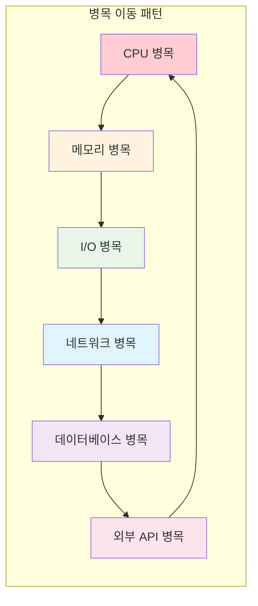

---
tags:
  - Performance
  - System Tuning
  - Optimization
  - Production
  - Monitoring
---

# 11.5 시스템 전체 성능 튜닝

## 2022년 11월, 완벽한 폭풍의 날

2022년 11월 11일, 더블 11(쌍십일) 세일 당일. 우리 시스템에 평소의 50배 트래픽이 몰렸다.

**당시 각 컴포넌트별 성능:**

- CPU 최적화: ✅ 완료 (평균 사용률 60%)
- 메모리 최적화: ✅ 완료 (캐시 히트율 95%)
- I/O 최적화: ✅ 완료 (비동기 I/O 도입)

하지만 **시스템 전체**는 여전히 버거웠다.

**예상치 못한 병목들:**

- 로드 밸런서가 먼저 포화 (단일 장애점)
- 데이터베이스 커넥션 풀 고갈
- 네트워크 대역폭 초과 (1Gbps → 8Gbps 필요)
- JVM 가비지 컬렉션으로 인한 주기적 지연
- TCP 연결 수 한계 도달

**깨달음:** 개별 최적화는 완벽했지만, **시스템 전체의 균형**이 맞지 않았다.

## 시스템 성능의 전체론적 접근

### 성능 병목의 이동 법칙



**핵심 원리**: 한 곳의 병목을 해결하면 다른 곳에서 새로운 병목이 나타난다.

### 시스템 성능 균형점 찾기

```bash
#!/bin/bash
# system_balance_analyzer.sh - 시스템 균형점 분석

echo "=== 시스템 성능 균형 분석 ==="

# 1. 각 리소스별 사용률 측정
cpu_usage=$(top -bn1 | grep "Cpu(s)" | awk '{print $2}' | cut -d'%' -f1)
mem_usage=$(free | grep Mem | awk '{printf "%.1f", $3/$2 * 100}')
disk_usage=$(iostat -x 1 1 | awk '/^[sv]d/ {sum+=$10; count++} END {printf "%.1f", sum/count}')

echo "현재 리소스 사용률:"
echo "  CPU: ${cpu_usage}%"
echo "  Memory: ${mem_usage}%"
echo "  Disk: ${disk_usage}%"

# 2. 병목점 식별
bottleneck=""
max_usage=0

if (( $(echo "$cpu_usage > $max_usage" | bc -l) )); then
    bottleneck="CPU"
    max_usage=$cpu_usage
fi

if (( $(echo "$mem_usage > $max_usage" | bc -l) )); then
    bottleneck="Memory"
    max_usage=$mem_usage
fi

if (( $(echo "$disk_usage > $max_usage" | bc -l) )); then
    bottleneck="Disk"
    max_usage=$disk_usage
fi

echo "주요 병목점: $bottleneck (${max_usage}%)"

# 3. 균형도 계산
balance_score=$(echo "scale=2; 100 - (($cpu_usage - $mem_usage)^2 + ($mem_usage - $disk_usage)^2 + ($disk_usage - $cpu_usage)^2) / 100" | bc -l)
echo "시스템 균형도: ${balance_score}/100"

if (( $(echo "$balance_score > 80" | bc -l) )); then
    echo "✅ 시스템이 잘 균형잡혀 있습니다."
elif (( $(echo "$balance_score > 60" | bc -l) )); then
    echo "⚠️ 약간의 불균형이 있습니다."
else
    echo "🚨 심각한 불균형 - 전체적인 최적화가 필요합니다."
fi

# 4. 네트워크 상태 확인
echo -e "\n네트워크 상태:"
ss -s | grep -E "TCP:|UDP:"

# 5. 프로세스별 리소스 소비 Top 5
echo -e "\nTop 5 리소스 소비 프로세스:"
ps aux --sort=-%cpu | head -6
```

## 운영 체제 레벨 튜닝

### 커널 매개변수 최적화

```bash
#!/bin/bash
# kernel_tuning.sh - 커널 매개변수 최적화

echo "=== 커널 매개변수 성능 최적화 ==="

# sysctl 설정 백업
sudo cp /etc/sysctl.conf /etc/sysctl.conf.backup.$(date +%Y%m%d)

cat << 'EOF' > /tmp/performance_tuning.conf
# ============ 네트워크 최적화 ============

# TCP 버퍼 크기 자동 조정 활성화
net.ipv4.tcp_window_scaling = 1

# TCP 송신/수신 버퍼 크기 증가
net.core.rmem_max = 134217728          # 128MB
net.core.wmem_max = 134217728          # 128MB
net.ipv4.tcp_rmem = 4096 87380 134217728
net.ipv4.tcp_wmem = 4096 65536 134217728

# TCP 연결 수 증가
net.core.somaxconn = 65535             # Listen 큐 크기
net.core.netdev_max_backlog = 5000     # 네트워크 디바이스 큐

# TIME_WAIT 소켓 재사용 (주의: NAT 환경에서는 문제 가능)
net.ipv4.tcp_tw_reuse = 1

# SYN flood 공격 방어
net.ipv4.tcp_syncookies = 1
net.ipv4.tcp_max_syn_backlog = 8192

# TCP Keepalive 설정
net.ipv4.tcp_keepalive_time = 600      # 10분
net.ipv4.tcp_keepalive_intvl = 60      # 1분
net.ipv4.tcp_keepalive_probes = 3

# TCP 혼잡 제어 알고리즘 (BBR 권장)
net.core.default_qdisc = fq
net.ipv4.tcp_congestion_control = bbr

# ============ 메모리 관리 최적화 ============

# 가상 메모리 설정
vm.swappiness = 10                     # 스왑 사용 최소화
vm.dirty_ratio = 15                    # 더티 페이지 비율
vm.dirty_background_ratio = 5
vm.dirty_expire_centisecs = 12000      # 1.2초 후 플러시
vm.dirty_writeback_centisecs = 1500    # 0.15초마다 체크

# 메모리 과할당 허용
vm.overcommit_memory = 1

# OOM killer 조정
vm.oom_kill_allocating_task = 1

# ============ 파일 시스템 최적화 ============

# 파일 디스크립터 한계 증가
fs.file-max = 2097152
fs.nr_open = 2097152

# inotify 한계 증가
fs.inotify.max_user_watches = 524288
fs.inotify.max_user_instances = 512

# ============ 프로세스 및 스레드 ============

# 프로세스 ID 범위 확장
kernel.pid_max = 4194303

# Core dump 설정
kernel.core_pattern = /tmp/core-%e-%p-%t

# ============ 보안 설정 ============

# ASLR (Address Space Layout Randomization)
kernel.randomize_va_space = 2

# SysRq 키 비활성화 (보안)
kernel.sysrq = 0

EOF

# 설정 적용
echo "커널 매개변수 적용 중..."
sudo sysctl -p /tmp/performance_tuning.conf

# 영구 적용을 위해 sysctl.conf에 추가
sudo cat /tmp/performance_tuning.conf >> /etc/sysctl.conf

echo "✅ 커널 매개변수 최적화 완료"

# 현재 적용된 주요 설정 확인
echo -e "\n현재 적용된 주요 설정:"
echo "TCP 버퍼 크기: $(sysctl net.ipv4.tcp_rmem)"
echo "최대 연결 수: $(sysctl net.core.somaxconn)"
echo "가상 메모리 스왑: $(sysctl vm.swappiness)"
echo "혼잡 제어: $(sysctl net.ipv4.tcp_congestion_control)"
```

### CPU 친화도 및 프로세스 우선순위

```c
// cpu_affinity.c - CPU 친화도 설정 예제
#define _GNU_SOURCE
#include <stdio.h>
#include <stdlib.h>
#include <sched.h>
#include <unistd.h>
#include <sys/time.h>
#include <sys/resource.h>
#include <pthread.h>

// CPU 코어에 프로세스/스레드 고정
void set_cpu_affinity(int cpu_id) {
    cpu_set_t mask;
    CPU_ZERO(&mask);
    CPU_SET(cpu_id, &mask);
    
    if (sched_setaffinity(0, sizeof(mask), &mask) == -1) {
        perror("sched_setaffinity 실패");
        return;
    }
    
    printf("프로세스를 CPU %d에 고정했습니다.\n", cpu_id);
}

// 프로세스 우선순위 설정
void set_process_priority(int nice_value) {
    if (setpriority(PRIO_PROCESS, 0, nice_value) == -1) {
        perror("setpriority 실패");
        return;
    }
    
    printf("프로세스 우선순위를 %d로 설정했습니다.\n", nice_value);
}

// 실시간 스케줄링 설정
void set_realtime_scheduling() {
    struct sched_param param;
    param.sched_priority = 50;  // 1-99 범위
    
    if (sched_setscheduler(0, SCHED_FIFO, &param) == -1) {
        perror("실시간 스케줄링 설정 실패");
        return;
    }
    
    printf("실시간 스케줄링 모드로 설정했습니다.\n");
}

// CPU 바인딩 성능 테스트
void* cpu_intensive_task(void* arg) {
    int thread_id = *(int*)arg;
    
    // 현재 실행 중인 CPU 확인
    int current_cpu = sched_getcpu();
    printf("스레드 %d가 CPU %d에서 실행 중\n", thread_id, current_cpu);
    
    // CPU 집약적 작업 시뮬레이션
    volatile long sum = 0;
    for (long i = 0; i < 1000000000L; i++) {
        sum += i;
    }
    
    printf("스레드 %d 완료 (CPU %d), 결과: %ld\n", 
           thread_id, sched_getcpu(), sum);
    
    return NULL;
}

void test_cpu_binding() {
    const int num_threads = 4;
    pthread_t threads[num_threads];
    int thread_ids[num_threads];
    
    printf("\n=== CPU 바인딩 성능 테스트 ===\n");
    
    struct timeval start, end;
    gettimeofday(&start, NULL);
    
    // 각 스레드를 다른 CPU에 바인딩
    for (int i = 0; i < num_threads; i++) {
        thread_ids[i] = i;
        pthread_create(&threads[i], NULL, cpu_intensive_task, &thread_ids[i]);
        
        // 스레드 CPU 친화도 설정
        cpu_set_t mask;
        CPU_ZERO(&mask);
        CPU_SET(i % sysconf(_SC_NPROCESSORS_ONLN), &mask);
        pthread_setaffinity_np(threads[i], sizeof(mask), &mask);
    }
    
    // 모든 스레드 완료 대기
    for (int i = 0; i < num_threads; i++) {
        pthread_join(threads[i], NULL);
    }
    
    gettimeofday(&end, NULL);
    
    double elapsed = (end.tv_sec - start.tv_sec) + 
                    (end.tv_usec - start.tv_usec) / 1000000.0;
    
    printf("CPU 바인딩 테스트 완료: %.2f초\n", elapsed);
}

int main() {
    printf("시스템 CPU 코어 수: %ld\n", sysconf(_SC_NPROCESSORS_ONLN));
    
    // 1. CPU 친화도 설정 (메인 프로세스를 CPU 0에 고정)
    set_cpu_affinity(0);
    
    // 2. 프로세스 우선순위 설정 (높은 우선순위)
    set_process_priority(-10);
    
    // 3. CPU 바인딩 성능 테스트
    test_cpu_binding();
    
    // 4. 실시간 스케줄링 테스트 (root 권한 필요)
    printf("\n실시간 스케줄링 시도 중...\n");
    set_realtime_scheduling();
    
    return 0;
}
```

## 애플리케이션 레벨 최적화

### JVM 튜닝 (Java 애플리케이션용)

```bash
#!/bin/bash
# jvm_tuning.sh - JVM 성능 최적화

echo "=== JVM 성능 최적화 설정 ==="

# 시스템 메모리 확인
TOTAL_MEM=$(free -g | awk 'NR==2{print $2}')
echo "시스템 총 메모리: ${TOTAL_MEM}GB"

# JVM 힙 크기 계산 (시스템 메모리의 75%)
HEAP_SIZE=$((TOTAL_MEM * 3 / 4))
if [ $HEAP_SIZE -lt 1 ]; then
    HEAP_SIZE=1
fi

echo "권장 힙 크기: ${HEAP_SIZE}GB"

# JVM 옵션 생성
JVM_OPTS=""

# ============ 메모리 설정 ============
JVM_OPTS="$JVM_OPTS -Xms${HEAP_SIZE}g"           # 초기 힙 크기
JVM_OPTS="$JVM_OPTS -Xmx${HEAP_SIZE}g"           # 최대 힙 크기
JVM_OPTS="$JVM_OPTS -XX:NewRatio=3"              # Old:Young = 3:1
JVM_OPTS="$JVM_OPTS -XX:MaxMetaspaceSize=512m"   # Metaspace 크기

# ============ GC 최적화 ============
# G1 GC 사용 (Java 9+에서 기본값)
JVM_OPTS="$JVM_OPTS -XX:+UseG1GC"
JVM_OPTS="$JVM_OPTS -XX:MaxGCPauseMillis=200"    # 최대 GC 일시정지 시간
JVM_OPTS="$JVM_OPTS -XX:G1HeapRegionSize=16m"    # G1 힙 리전 크기
JVM_OPTS="$JVM_OPTS -XX:+G1UseAdaptiveIHOP"      # 적응형 IHOP

# 또는 ZGC 사용 (Java 11+, 대용량 힙용)
# JVM_OPTS="$JVM_OPTS -XX:+UnlockExperimentalVMOptions -XX:+UseZGC"

# ============ JIT 컴파일러 최적화 ============
JVM_OPTS="$JVM_OPTS -XX:+TieredCompilation"      # 계층형 컴파일레이션
JVM_OPTS="$JVM_OPTS -XX:TieredStopAtLevel=4"     # C2 컴파일러까지 사용
JVM_OPTS="$JVM_OPTS -XX:CompileThreshold=1000"   # 컴파일 임계값

# ============ 성능 모니터링 ============
JVM_OPTS="$JVM_OPTS -XX:+PrintGC"                # GC 로그 출력
JVM_OPTS="$JVM_OPTS -XX:+PrintGCDetails"
JVM_OPTS="$JVM_OPTS -XX:+PrintGCTimeStamps"
JVM_OPTS="$JVM_OPTS -XX:+PrintGCApplicationStoppedTime"
JVM_OPTS="$JVM_OPTS -Xloggc:/var/log/gc.log"
JVM_OPTS="$JVM_OPTS -XX:+UseGCLogFileRotation"
JVM_OPTS="$JVM_OPTS -XX:NumberOfGCLogFiles=10"
JVM_OPTS="$JVM_OPTS -XX:GCLogFileSize=100M"

# ============ JFR (Java Flight Recorder) ============
JVM_OPTS="$JVM_OPTS -XX:+FlightRecorder"
JVM_OPTS="$JVM_OPTS -XX:StartFlightRecording=duration=60s,filename=/tmp/flight.jfr"

# ============ 네트워크 최적화 ============
JVM_OPTS="$JVM_OPTS -Djava.net.preferIPv4Stack=true"
JVM_OPTS="$JVM_OPTS -Djava.awt.headless=true"

# ============ 보안 최적화 (필요시) ============
JVM_OPTS="$JVM_OPTS -Djava.security.egd=file:/dev/urandom"  # 엔트로피 소스

echo "최적화된 JVM 옵션:"
echo "JAVA_OPTS=\"$JVM_OPTS\""

# 설정 파일에 저장
echo "export JAVA_OPTS=\"$JVM_OPTS\"" > /tmp/jvm_optimized.sh
echo "JVM 설정이 /tmp/jvm_optimized.sh에 저장되었습니다."

# 사용법 안내
echo -e "\n사용법:"
echo "source /tmp/jvm_optimized.sh"
echo "java \$JAVA_OPTS -jar your-application.jar"

# GC 로그 분석 도구 추천
echo -e "\nGC 로그 분석 도구:"
echo "1. GCViewer: https://github.com/chewiebug/GCViewer"
echo "2. GCPlot: https://gcplot.com/"
echo "3. CRaC (Coordinated Restore at Checkpoint): Java 17+"
```

### 데이터베이스 연결 풀 최적화

```java
// ConnectionPoolOptimizer.java - 데이터베이스 연결 풀 최적화
import com.zaxxer.hikari.HikariConfig;
import com.zaxxer.hikari.HikariDataSource;
import java.sql.Connection;
import java.sql.SQLException;
import java.util.concurrent.TimeUnit;

public class ConnectionPoolOptimizer {
    
    public static HikariDataSource createOptimizedPool(
            String jdbcUrl, 
            String username, 
            String password) {
        
        HikariConfig config = new HikariConfig();
        
        // 기본 연결 정보
        config.setJdbcUrl(jdbcUrl);
        config.setUsername(username);
        config.setPassword(password);
        
        // ============ 연결 풀 크기 최적화 ============
        // 공식: CPU 코어 수 * 2 + 1 (I/O bound 작업의 경우)
        int coreCount = Runtime.getRuntime().availableProcessors();
        int maxPoolSize = coreCount * 2 + 1;
        
        config.setMinimumIdle(5);                    // 최소 유휴 연결 수
        config.setMaximumPoolSize(maxPoolSize);      // 최대 연결 수
        
        // ============ 타임아웃 설정 ============
        config.setConnectionTimeout(30000);         // 연결 대기 시간 (30초)
        config.setIdleTimeout(600000);              // 유휴 연결 타임아웃 (10분)
        config.setMaxLifetime(1800000);             // 연결 최대 수명 (30분)
        config.setLeakDetectionThreshold(60000);    // 연결 누수 탐지 (1분)
        
        // ============ 유효성 검사 ============
        config.setValidationTimeout(5000);          // 유효성 검사 타임아웃
        config.setConnectionTestQuery("SELECT 1");  // 연결 테스트 쿼리
        
        // ============ 성능 최적화 ============
        config.addDataSourceProperty("cachePrepStmts", "true");
        config.addDataSourceProperty("prepStmtCacheSize", "250");
        config.addDataSourceProperty("prepStmtCacheSqlLimit", "2048");
        config.addDataSourceProperty("useServerPrepStmts", "true");
        config.addDataSourceProperty("useLocalSessionState", "true");
        config.addDataSourceProperty("rewriteBatchedStatements", "true");
        config.addDataSourceProperty("cacheResultSetMetadata", "true");
        config.addDataSourceProperty("cacheServerConfiguration", "true");
        config.addDataSourceProperty("elideSetAutoCommits", "true");
        config.addDataSourceProperty("maintainTimeStats", "false");
        
        // ============ 모니터링 설정 ============
        config.setPoolName("OptimizedPool");
        config.setRegisterMbeans(true);             // JMX 모니터링 활성화
        
        System.out.println("데이터베이스 연결 풀 설정:");
        System.out.println("  CPU 코어 수: " + coreCount);
        System.out.println("  최대 연결 수: " + maxPoolSize);
        System.out.println("  최소 유휴 연결 수: " + config.getMinimumIdle());
        
        return new HikariDataSource(config);
    }
    
    // 연결 풀 성능 모니터링
    public static void monitorPool(HikariDataSource dataSource) {
        System.out.println("=== 연결 풀 모니터링 ===");
        System.out.println("활성 연결 수: " + dataSource.getHikariPoolMXBean().getActiveConnections());
        System.out.println("유휴 연결 수: " + dataSource.getHikariPoolMXBean().getIdleConnections());
        System.out.println("대기 중인 스레드 수: " + dataSource.getHikariPoolMXBean().getThreadsAwaitingConnection());
        System.out.println("총 연결 수: " + dataSource.getHikariPoolMXBean().getTotalConnections());
    }
    
    // 연결 풀 성능 테스트
    public static void performanceTest(HikariDataSource dataSource) throws SQLException {
        System.out.println("=== 연결 풀 성능 테스트 ===");
        
        long startTime = System.nanoTime();
        int iterations = 1000;
        
        for (int i = 0; i < iterations; i++) {
            try (Connection conn = dataSource.getConnection()) {
                // 간단한 쿼리 실행
                conn.prepareStatement("SELECT 1").executeQuery();
            }
        }
        
        long endTime = System.nanoTime();
        long duration = TimeUnit.NANOSECONDS.toMillis(endTime - startTime);
        
        System.out.println("총 " + iterations + "회 연결 테스트 완료");
        System.out.println("총 소요 시간: " + duration + "ms");
        System.out.println("평균 연결 시간: " + (duration / (double) iterations) + "ms");
        System.out.println("초당 연결 수: " + (iterations * 1000L / duration));
    }
    
    public static void main(String[] args) throws SQLException {
        // 연결 풀 생성
        HikariDataSource dataSource = createOptimizedPool(
            "jdbc:mysql://localhost:3306/testdb",
            "user",
            "password"
        );
        
        // 성능 테스트 실행
        performanceTest(dataSource);
        
        // 모니터링 정보 출력
        monitorPool(dataSource);
        
        // 정리
        dataSource.close();
    }
}
```

## 로드 밸런싱 및 캐싱 전략

### Nginx 로드 밸런서 최적화

```nginx
# nginx_optimization.conf - Nginx 성능 최적화 설정

# ============ 전역 설정 ============
user nginx;
worker_processes auto;                    # CPU 코어 수만큼 자동 설정
worker_rlimit_nofile 65535;              # 파일 디스크립터 한계

error_log /var/log/nginx/error.log warn;
pid /var/run/nginx.pid;

events {
    worker_connections 4096;              # worker당 최대 연결 수
    use epoll;                           # Linux에서 가장 효율적
    multi_accept on;                     # 한 번에 여러 연결 수락
    accept_mutex off;                    # 연결 분산을 위해 비활성화
}

http {
    # ============ 기본 설정 ============
    include /etc/nginx/mime.types;
    default_type application/octet-stream;
    
    # ============ 로깅 최적화 ============
    log_format main '$remote_addr - $remote_user [$time_local] "$request" '
                   '$status $body_bytes_sent "$http_referer" '
                   '"$http_user_agent" $request_time $upstream_response_time';
    
    # 로그 버퍼링으로 I/O 최적화
    access_log /var/log/nginx/access.log main buffer=64k flush=5s;
    
    # ============ 성능 최적화 ============
    sendfile on;                         # 커널에서 직접 파일 전송
    tcp_nopush on;                       # sendfile과 함께 사용
    tcp_nodelay on;                      # keep-alive 연결에서 지연 없애기
    
    keepalive_timeout 30s;               # Keep-alive 연결 유지 시간
    keepalive_requests 1000;             # Keep-alive 연결당 최대 요청 수
    
    # ============ 압축 설정 ============
    gzip on;
    gzip_vary on;
    gzip_min_length 1000;
    gzip_comp_level 6;
    gzip_types
        application/atom+xml
        application/geo+json
        application/javascript
        application/x-javascript
        application/json
        application/ld+json
        application/manifest+json
        application/rdf+xml
        application/rss+xml
        application/xhtml+xml
        application/xml
        font/eot
        font/otf
        font/ttf
        image/svg+xml
        text/css
        text/javascript
        text/plain
        text/xml;
    
    # ============ 버퍼 크기 최적화 ============
    client_body_buffer_size 16k;
    client_header_buffer_size 1k;
    client_max_body_size 8m;
    large_client_header_buffers 4 16k;
    
    # ============ 타임아웃 설정 ============
    client_body_timeout 12s;
    client_header_timeout 12s;
    send_timeout 10s;
    
    # ============ 업스트림 서버 정의 ============
    upstream app_servers {
        # 로드 밸런싱 방식
        least_conn;                      # 최소 연결 방식
        
        # 백엔드 서버들
        server 192.168.1.10:8080 max_fails=3 fail_timeout=30s weight=3;
        server 192.168.1.11:8080 max_fails=3 fail_timeout=30s weight=3;
        server 192.168.1.12:8080 max_fails=3 fail_timeout=30s weight=2;
        
        # 연결 풀링
        keepalive 32;                    # 업스트림과의 연결 유지
        keepalive_requests 100;
        keepalive_timeout 60s;
    }
    
    # ============ 캐싱 설정 ============
    proxy_cache_path /var/cache/nginx/app
                     levels=1:2
                     keys_zone=app_cache:10m
                     max_size=1g
                     inactive=60m
                     use_temp_path=off;
    
    server {
        listen 80 default_server reuseport;
        server_name _;
        
        # ============ 정적 파일 최적화 ============
        location ~* \.(jpg|jpeg|png|gif|ico|css|js)$ {
            expires 1y;
            add_header Cache-Control "public, immutable";
            add_header Vary Accept-Encoding;
            
            # 정적 파일은 직접 서빙
            root /var/www/html;
        }
        
        # ============ API 프록시 설정 ============
        location /api/ {
            # 프록시 헤더 설정
            proxy_set_header Host $host;
            proxy_set_header X-Real-IP $remote_addr;
            proxy_set_header X-Forwarded-For $proxy_add_x_forwarded_for;
            proxy_set_header X-Forwarded-Proto $scheme;
            
            # 연결 재사용
            proxy_http_version 1.1;
            proxy_set_header Connection "";
            
            # 타임아웃 설정
            proxy_connect_timeout 5s;
            proxy_send_timeout 60s;
            proxy_read_timeout 60s;
            
            # 버퍼 설정
            proxy_buffering on;
            proxy_buffer_size 4k;
            proxy_buffers 8 4k;
            proxy_busy_buffers_size 8k;
            
            # 캐싱 설정 (적절한 경우에만)
            proxy_cache app_cache;
            proxy_cache_valid 200 302 10m;
            proxy_cache_valid 404 1m;
            proxy_cache_use_stale error timeout updating http_500 http_502 http_503 http_504;
            proxy_cache_background_update on;
            proxy_cache_lock on;
            
            # 업스트림으로 전달
            proxy_pass http://app_servers;
        }
        
        # ============ 헬스 체크 ============
        location /nginx-health {
            access_log off;
            return 200 "healthy\n";
            add_header Content-Type text/plain;
        }
        
        # ============ 보안 헤더 ============
        add_header X-Frame-Options "SAMEORIGIN" always;
        add_header X-XSS-Protection "1; mode=block" always;
        add_header X-Content-Type-Options "nosniff" always;
        add_header Referrer-Policy "no-referrer-when-downgrade" always;
        
        # 서버 정보 숨기기
        server_tokens off;
    }
}
```

### Redis 캐싱 최적화

```python
# redis_optimization.py - Redis 캐싱 최적화
import redis
import time
import json
import hashlib
from typing import Any, Optional, Callable
import functools
import asyncio
import aioredis
import logging

class OptimizedRedisCache:
    def __init__(self, 
                 host='localhost', 
                 port=6379, 
                 db=0,
                 max_connections=50,
                 connection_pool_class=redis.BlockingConnectionPool):
        
        # 연결 풀 최적화
        self.pool = connection_pool_class(
            host=host,
            port=port,
            db=db,
            max_connections=max_connections,
            retry_on_timeout=True,
            health_check_interval=30,
            socket_keepalive=True,
            socket_keepalive_options={
                1: 1,  # TCP_KEEPIDLE
                2: 3,  # TCP_KEEPINTVL  
                3: 5,  # TCP_KEEPCNT
            }
        )
        
        self.redis_client = redis.Redis(connection_pool=self.pool)
        
        # 캐시 통계
        self.stats = {
            'hits': 0,
            'misses': 0,
            'errors': 0
        }
        
        logging.info(f"Redis 캐시 초기화: {host}:{port}")
    
    def _make_key(self, prefix: str, *args, **kwargs) -> str:
        """캐시 키 생성"""
        key_parts = [prefix]
        key_parts.extend(str(arg) for arg in args)
        key_parts.extend(f"{k}={v}" for k, v in sorted(kwargs.items()))
        
        key_string = ":".join(key_parts)
        
        # 긴 키는 해시로 축약
        if len(key_string) > 200:
            key_hash = hashlib.md5(key_string.encode()).hexdigest()
            return f"{prefix}:hash:{key_hash}"
        
        return key_string
    
    def cache_result(self, 
                    prefix: str, 
                    ttl: int = 3600,
                    serialize_func: Callable = json.dumps,
                    deserialize_func: Callable = json.loads):
        """결과 캐싱 데코레이터"""
        def decorator(func):
            @functools.wraps(func)
            def wrapper(*args, **kwargs):
                cache_key = self._make_key(prefix, *args, **kwargs)
                
                try:
                    # 캐시에서 조회
                    cached_result = self.redis_client.get(cache_key)
                    
                    if cached_result is not None:
                        self.stats['hits'] += 1
                        logging.debug(f"캐시 히트: {cache_key}")
                        return deserialize_func(cached_result)
                    
                    # 캐시 미스 - 함수 실행
                    self.stats['misses'] += 1
                    result = func(*args, **kwargs)
                    
                    # 결과 캐싱
                    serialized_result = serialize_func(result)
                    self.redis_client.setex(cache_key, ttl, serialized_result)
                    
                    logging.debug(f"캐시 저장: {cache_key}")
                    return result
                    
                except Exception as e:
                    self.stats['errors'] += 1
                    logging.error(f"캐시 오류: {e}")
                    # 캐시 오류 시에도 함수는 정상 실행
                    return func(*args, **kwargs)
            
            return wrapper
        return decorator
    
    def bulk_cache_results(self, items: dict, prefix: str, ttl: int = 3600):
        """대량 캐시 저장 (파이프라인 사용)"""
        pipeline = self.redis_client.pipeline()
        
        for key, value in items.items():
            cache_key = self._make_key(prefix, key)
            serialized_value = json.dumps(value)
            pipeline.setex(cache_key, ttl, serialized_value)
        
        pipeline.execute()
        logging.info(f"대량 캐시 저장: {len(items)}개 아이템")
    
    def get_cache_stats(self):
        """캐시 통계 반환"""
        total_requests = self.stats['hits'] + self.stats['misses']
        hit_rate = (self.stats['hits'] / total_requests * 100) if total_requests > 0 else 0
        
        return {
            'hit_rate': f"{hit_rate:.2f}%",
            'hits': self.stats['hits'],
            'misses': self.stats['misses'],
            'errors': self.stats['errors'],
            'total_requests': total_requests
        }
    
    def warm_up_cache(self, warm_up_func: Callable):
        """캐시 웜업"""
        start_time = time.time()
        warm_up_func()
        duration = time.time() - start_time
        
        logging.info(f"캐시 웜업 완료: {duration:.2f}초")

# 사용 예제
cache = OptimizedRedisCache(max_connections=100)

@cache.cache_result("user_profile", ttl=1800)  # 30분 캐싱
def get_user_profile(user_id: int):
    """사용자 프로필 조회 (DB에서)"""
    # 실제로는 DB 조회
    time.sleep(0.1)  # DB 조회 시뮬레이션
    return {
        'user_id': user_id,
        'name': f'User {user_id}',
        'email': f'user{user_id}@example.com'
    }

@cache.cache_result("expensive_calculation", ttl=7200)  # 2시간 캐싱
def expensive_calculation(n: int):
    """비용이 많이 드는 계산"""
    time.sleep(1)  # 계산 시뮬레이션
    return sum(i * i for i in range(n))

def benchmark_cache_performance():
    """캐시 성능 벤치마크"""
    print("=== 캐시 성능 벤치마크 ===")
    
    # 첫 번째 호출 (캐시 미스)
    start = time.time()
    for i in range(100):
        get_user_profile(i % 10)  # 10명의 사용자를 반복 조회
    first_run = time.time() - start
    
    # 두 번째 호출 (캐시 히트)
    start = time.time()
    for i in range(100):
        get_user_profile(i % 10)
    second_run = time.time() - start
    
    print(f"첫 번째 실행 (캐시 미스): {first_run:.3f}초")
    print(f"두 번째 실행 (캐시 히트): {second_run:.3f}초")
    print(f"성능 향상: {first_run / second_run:.1f}배")
    
    # 캐시 통계 출력
    stats = cache.get_cache_stats()
    print(f"캐시 통계: {stats}")

if __name__ == "__main__":
    benchmark_cache_performance()
```

## 시스템 성능 종합 모니터링

### 통합 성능 대시보드

```python
# performance_dashboard.py - 성능 모니터링 대시보드
import psutil
import time
import json
import threading
from datetime import datetime, timedelta
from collections import deque, defaultdict
import matplotlib.pyplot as plt
import matplotlib.animation as animation
from typing import Dict, List, Deque

class SystemPerformanceMonitor:
    def __init__(self, history_size: int = 300):  # 5분간 데이터 (1초 간격)
        self.history_size = history_size
        
        # 성능 데이터 히스토리
        self.cpu_history: Deque[float] = deque(maxlen=history_size)
        self.memory_history: Deque[float] = deque(maxlen=history_size)
        self.disk_io_history: Deque[Dict] = deque(maxlen=history_size)
        self.network_io_history: Deque[Dict] = deque(maxlen=history_size)
        self.timestamps: Deque[datetime] = deque(maxlen=history_size)
        
        # 프로세스별 리소스 사용량
        self.process_stats: Dict[str, Dict] = {}
        
        # 알림 임계값
        self.thresholds = {
            'cpu': 80.0,
            'memory': 85.0,
            'disk_io': 90.0,
            'network_io': 80.0
        }
        
        # 모니터링 상태
        self.monitoring = False
        self.monitor_thread = None
        
        print("시스템 성능 모니터 초기화 완료")
    
    def start_monitoring(self):
        """모니터링 시작"""
        if not self.monitoring:
            self.monitoring = True
            self.monitor_thread = threading.Thread(target=self._monitor_loop, daemon=True)
            self.monitor_thread.start()
            print("성능 모니터링 시작")
    
    def stop_monitoring(self):
        """모니터링 중지"""
        self.monitoring = False
        if self.monitor_thread:
            self.monitor_thread.join()
        print("성능 모니터링 중지")
    
    def _monitor_loop(self):
        """모니터링 메인 루프"""
        last_disk_io = psutil.disk_io_counters()
        last_net_io = psutil.net_io_counters()
        
        while self.monitoring:
            try:
                # 타임스탬프
                now = datetime.now()
                self.timestamps.append(now)
                
                # CPU 사용률
                cpu_percent = psutil.cpu_percent(interval=None)
                self.cpu_history.append(cpu_percent)
                
                # 메모리 사용률
                memory = psutil.virtual_memory()
                self.memory_history.append(memory.percent)
                
                # 디스크 I/O
                current_disk_io = psutil.disk_io_counters()
                if last_disk_io:
                    disk_io_diff = {
                        'read_bytes': current_disk_io.read_bytes - last_disk_io.read_bytes,
                        'write_bytes': current_disk_io.write_bytes - last_disk_io.write_bytes,
                        'read_count': current_disk_io.read_count - last_disk_io.read_count,
                        'write_count': current_disk_io.write_count - last_disk_io.write_count,
                    }
                    self.disk_io_history.append(disk_io_diff)
                last_disk_io = current_disk_io
                
                # 네트워크 I/O
                current_net_io = psutil.net_io_counters()
                if last_net_io:
                    net_io_diff = {
                        'bytes_sent': current_net_io.bytes_sent - last_net_io.bytes_sent,
                        'bytes_recv': current_net_io.bytes_recv - last_net_io.bytes_recv,
                        'packets_sent': current_net_io.packets_sent - last_net_io.packets_sent,
                        'packets_recv': current_net_io.packets_recv - last_net_io.packets_recv,
                    }
                    self.network_io_history.append(net_io_diff)
                last_net_io = current_net_io
                
                # 프로세스별 통계 업데이트
                self._update_process_stats()
                
                # 임계값 체크 및 알림
                self._check_thresholds(cpu_percent, memory.percent)
                
                time.sleep(1)
                
            except Exception as e:
                print(f"모니터링 오류: {e}")
                time.sleep(1)
    
    def _update_process_stats(self):
        """프로세스별 리소스 사용량 업데이트"""
        try:
            processes = []
            for proc in psutil.process_iter(['pid', 'name', 'cpu_percent', 'memory_percent']):
                try:
                    pinfo = proc.info
                    if pinfo['cpu_percent'] > 1.0:  # CPU 1% 이상 사용하는 프로세스만
                        processes.append(pinfo)
                except (psutil.NoSuchProcess, psutil.AccessDenied):
                    pass
            
            # CPU 사용률 기준으로 정렬
            processes.sort(key=lambda x: x['cpu_percent'], reverse=True)
            
            # 상위 10개 프로세스만 저장
            self.process_stats = {
                f"{proc['name']}({proc['pid']})": {
                    'cpu_percent': proc['cpu_percent'],
                    'memory_percent': proc['memory_percent']
                }
                for proc in processes[:10]
            }
            
        except Exception as e:
            print(f"프로세스 통계 업데이트 오류: {e}")
    
    def _check_thresholds(self, cpu_percent: float, memory_percent: float):
        """임계값 체크 및 알림"""
        alerts = []
        
        if cpu_percent > self.thresholds['cpu']:
            alerts.append(f"🚨 CPU 사용률 높음: {cpu_percent:.1f}%")
        
        if memory_percent > self.thresholds['memory']:
            alerts.append(f"🚨 메모리 사용률 높음: {memory_percent:.1f}%")
        
        for alert in alerts:
            print(f"[{datetime.now().strftime('%H:%M:%S')}] {alert}")
    
    def get_current_stats(self) -> Dict:
        """현재 시스템 통계 반환"""
        if not self.cpu_history:
            return {}
        
        # 최근 1분간 평균
        recent_size = min(60, len(self.cpu_history))
        
        return {
            'timestamp': datetime.now().isoformat(),
            'cpu': {
                'current': self.cpu_history[-1],
                'avg_1min': sum(list(self.cpu_history)[-recent_size:]) / recent_size,
                'cores': psutil.cpu_count()
            },
            'memory': {
                'current': self.memory_history[-1],
                'avg_1min': sum(list(self.memory_history)[-recent_size:]) / recent_size,
                'total_gb': psutil.virtual_memory().total / (1024**3)
            },
            'disk_io': {
                'total_read_mb': sum(io.get('read_bytes', 0) for io in self.disk_io_history) / (1024**2),
                'total_write_mb': sum(io.get('write_bytes', 0) for io in self.disk_io_history) / (1024**2),
            },
            'network_io': {
                'total_sent_mb': sum(io.get('bytes_sent', 0) for io in self.network_io_history) / (1024**2),
                'total_recv_mb': sum(io.get('bytes_recv', 0) for io in self.network_io_history) / (1024**2),
            },
            'top_processes': self.process_stats
        }
    
    def generate_report(self, duration_minutes: int = 5) -> str:
        """성능 리포트 생성"""
        stats = self.get_current_stats()
        if not stats:
            return "데이터 없음"
        
        report = f"""
=== 시스템 성능 리포트 ({duration_minutes}분간) ===
생성 시간: {stats['timestamp']}

🖥️  CPU:
   현재: {stats['cpu']['current']:.1f}%
   평균: {stats['cpu']['avg_1min']:.1f}%
   코어: {stats['cpu']['cores']}개

🧠 메모리:
   현재: {stats['memory']['current']:.1f}%
   평균: {stats['memory']['avg_1min']:.1f}%
   총량: {stats['memory']['total_gb']:.1f}GB

💾 디스크 I/O:
   읽기: {stats['disk_io']['total_read_mb']:.1f}MB
   쓰기: {stats['disk_io']['total_write_mb']:.1f}MB

🌐 네트워크 I/O:
   송신: {stats['network_io']['total_sent_mb']:.1f}MB
   수신: {stats['network_io']['total_recv_mb']:.1f}MB

🔥 리소스 집약적 프로세스:
"""
        
        for process_name, proc_stats in list(stats['top_processes'].items())[:5]:
            report += f"   {process_name}: CPU {proc_stats['cpu_percent']:.1f}%, MEM {proc_stats['memory_percent']:.1f}%\n"
        
        return report
    
    def save_stats_to_file(self, filename: str):
        """통계를 JSON 파일로 저장"""
        stats = self.get_current_stats()
        with open(filename, 'w') as f:
            json.dump(stats, f, indent=2)
        print(f"통계가 {filename}에 저장되었습니다.")

def main():
    # 성능 모니터 생성 및 시작
    monitor = SystemPerformanceMonitor()
    monitor.start_monitoring()
    
    try:
        # 5분간 모니터링
        print("5분간 시스템 성능을 모니터링합니다...")
        time.sleep(300)  # 5분
        
        # 리포트 생성
        print(monitor.generate_report())
        
        # 통계를 파일로 저장
        monitor.save_stats_to_file('system_performance.json')
        
    except KeyboardInterrupt:
        print("\n모니터링을 중단합니다.")
    
    finally:
        monitor.stop_monitoring()

if __name__ == "__main__":
    main()
```

## 레슨 런

### 1. 전체론적 접근이 핵심이다

**개별 최적화만으로는 부족하다.** CPU, 메모리, I/O, 네트워크가 모두 균형을 이뤄야 진정한 성능 향상을 얻을 수 있다.

### 2. 병목은 계속 이동한다

하나의 병목을 해결하면 **다른 곳에서 새로운 병목이 나타난다.** 지속적인 모니터링과 조정이 필요하다.

### 3. 모니터링이 최적화의 기반이다

**측정할 수 없으면 최적화할 수 없다.** 실시간 모니터링 시스템을 구축하고 데이터 기반으로 결정하자.

### 4. 캐싱은 성능의 승수다

적절한 캐싱 전략은 **성능을 10배 이상 향상**시킬 수 있다. Redis, CDN, 애플리케이션 캐시를 적극 활용하자.

### 5. 운영 체제 튜닝을 간과하지 마라

**커널 매개변수, 네트워크 스택, 파일 시스템 설정**이 애플리케이션 성능에 직접적인 영향을 미친다.

---

**Chapter 11: Performance Optimization 완료! 🚀**

이제 우리는 성능 분석 방법론부터 시스템 전체 튜닝까지 **완전한 성능 최적화 여정**을 마스터했습니다. CPU, 메모리, I/O, 네트워크의 개별 최적화는 물론, 이들이 조화롭게 작동하는 **균형잡힌 시스템**을 구축할 수 있게 되었습니다.

마지막으로 **Chapter 10: Syscall & Kernel**을 완성하여 전체 CS 가이드를 마무리하겠습니다!
