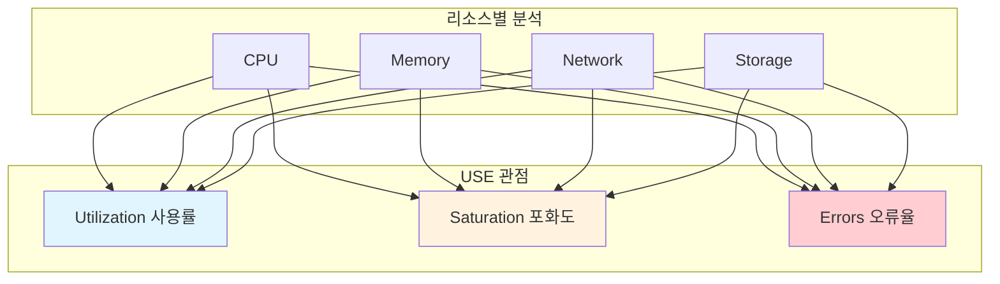
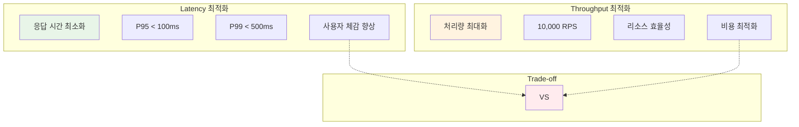

---
tags:
  - Brendan Gregg
  - FlameGraph
  - USE Method
  - hands-on
  - intermediate
  - medium-read
  - 성능 분석
  - 인프라스트럭처
  - 프로파일링
difficulty: INTERMEDIATE
learning_time: "3-5시간"
main_topic: "인프라스트럭처"
priority_score: 4
---

# 11.1.2: 성능 분석 방법론

## 이 문서를 읽고 나면 답할 수 있는 질문들

- 시스템이 느려졌을 때 어디서부터 분석을 시작해야 할까요?
- USE Method는 무엇이고 어떻게 활용하나요?
- 성능 분석 도구들을 어떤 순서로 사용해야 할까요?
- Latency와 Throughput 중 무엇을 우선시해야 할까요?
- Amdahl's Law가 실제 최적화에 어떤 의미를 가질까요?

## 들어가며: 성능 분석의 과학

### 🤯 "어디부터 봐야 할지 모르겠어요" - 모든 개발자의 고민

2018년 저희 스타트업에서 일어난 실제 상황입니다:

**월요일 오전 10시: Slack 메시지 폭격**

```text
💥 CEO: "사이트가 너무 느린데요?"
💥 마케팅팀: "광고 효과가 떨어져요!"
💥 고객지원팀: "고객 불만이 쏟아져요!"
💥 개발팀: "...어디가 문제일까요?" 😅
```

**당시 우리의 "최적화" 시도들**:

```bash
# 🤡 개발자 A: "데이터베이스가 문제인 것 같아요"
$ mysql -e "SHOW PROCESSLIST"  # 쿼리는 빨라 보임

# 🤡 개발자 B: "서버 메모리가 부족한가요?"
$ free -h  # 2GB 중 500MB만 사용 중

# 🤡 개발자 C: "캐시를 더 많이 쓰면?"
$ redis-cli info memory  # 캐시도 여유 있음

# 🤡 팀 전체: "그냥 서버를 더 늘릴까요?" 💸💸💸
```

**문제는**: 체계적인 접근법이 없었다는 것입니다.

우리는 추측만 하고 있었지, 실제 어디에 병목이 있는지**측정**하지 않았습니다.

### 🚑 Netflix의 성능 전문가, Brendan Gregg의 조언

2012년, Netflix의 성능 엔지니어 Brendan Gregg가 개발한**USE Method**가 우리를 구원했습니다:

>**"If you can't measure it, you can't improve it."**
>
>**"Don't guess, measure. Don't assume, verify."**

그의 방법론을 적용한 후 30분 만에 진짜 문제를 발견했습니다:

```bash
# USE Method 적용 결과
$ perf top
# 발견: image_processing 함수가 CPU의 89% 사용!
# 원인: 썸네일 생성 코드가 비효율적 알고리즘 사용

# 해결: 15분 만에 O(n²) → O(n) 최적화
# 결과: 응답시간 8초 → 200ms (40배 개선!)
```

이 경험으로 깨달았습니다:**성능 최적화는 과학이지 예술이 아니다**.

## USE Method: 체계적 성능 분석의 시작

### USE Method란?



### 실전 적용: 체계적 성능 진단

#### 1단계: CPU 분석

```bash
# 🔍 Utilization: CPU 사용률
$ top -p $(pgrep myapp)
# PID    %CPU  %MEM  COMMAND
# 1234   89.2  12.1  myapp

# 만약 CPU 사용률이 높다면...
$ perf top  # 어떤 함수가 CPU를 많이 쓰는지 확인
```

```bash
# 🚦 Saturation: CPU 대기 큐
$ cat /proc/loadavg
# 8.24 7.33 6.98 2/156 1234
# ↑ 4코어 시스템에서 8.24 = 200% 포화!

# Load Average 해석:
# < 코어 수: 여유 있음
# = 코어 수: 적정 수준
# > 코어 수: 포화 상태 (작업이 대기 중)
```

```bash
# ❌ Errors: CPU 관련 오류
$ dmesg | grep -i "cpu\|thermal"
# CPU throttling 또는 과열 확인

$ perf stat -e context-switches ./myapp
# Context switch가 비정상적으로 많은지 확인
```

#### 2단계: Memory 분석

```bash
# 🔍 Utilization: 메모리 사용률
$ free -h
#               total   used   free   shared  buff/cache  available
# Mem:          7.8Gi   4.2Gi  0.9Gi  45Mi    2.7Gi       3.3Gi
# Swap:         2.0Gi   1.1Gi  0.9Gi

# 사용률 = used / total = 4.2 / 7.8 = 54%
```

```bash
# 🚦 Saturation: 스왑 사용량 (메모리 부족의 신호)
$ vmstat 1
# si   so   (swap in/out per second)
# 0    0    ← 좋음
# 1024 2048 ← 나쁨! 메모리가 부족해 스왑 사용 중
```

```bash
# ❌ Errors: OOM (Out of Memory)
$ dmesg | grep -i "killed process\|out of memory"
# Out of memory: Kill process 1234 (myapp) score 902 or sacrifice child
```

#### 3단계: Network 분석

```bash
# 🔍 Utilization: 네트워크 대역폭 사용률
$ iftop -i eth0
# Peak rates (sent/received): 924Mb 856Mb
# Total bandwidth: 1Gb/s
# 사용률 = 924 / 1000 = 92.4%
```

```bash
# 🚦 Saturation: 패킷 드롭 (네트워크 포화)
$ netstat -i
# Iface   RX-OK RX-ERR RX-DRP  TX-OK TX-ERR TX-DRP
# eth0    1234M  0      5432    987M  0      2341
#                       ↑              ↑
#                    패킷 드롭 발생! (네트워크 포화)
```

```bash
# ❌ Errors: 네트워크 오류
$ ethtool -S eth0 | grep error
# rx_crc_errors: 0
# rx_frame_errors: 0
# tx_aborted_errors: 0
```

#### 4단계: Storage 분석

```bash
# 🔍 Utilization: 디스크 사용률
$ iostat -x 1
# Device    %util   r/s    w/s   rMB/s  wMB/s  await  svctm
# sda       98.2    234    145   23.4   12.1   45.2   8.5
#           ↑
#      거의 100% 사용 중! (디스크 병목)
```

```bash
# 🚦 Saturation: I/O 대기 시간
$ iostat -x 1
# await  svctm
# 45.2   8.5   ← await > 10ms면 포화 상태

# await: 평균 I/O 응답 시간 (큐 대기 + 서비스 시간)
# svctm: 실제 서비스 시간
```

```bash
# ❌ Errors: 디스크 오류
$ smartctl -a /dev/sda | grep -i error
# Error count: 0
$ dmesg | grep -i "i/o error\|disk error"
```

## 성능 분석 도구 체인: Level별 접근법

### Level 1: 전체 시스템 Overview (30초 진단)

```bash
# 🏃‍♂️ 빠른 시스템 상태 체크
$ htop        # CPU, Memory, Process 한눈에
$ iostat -x 1 5   # Disk I/O 상태 5초간
$ ss -tuln    # 네트워크 연결 상태
$ uptime      # Load Average

# 이 단계에서 답할 질문:
# "CPU/Memory/Disk/Network 중 어디에 문제가 있을까?"
```

**실제 사용 예시**:

```bash
$ htop
# 발견: CPU 100%, Memory 50%
# 결론: CPU 병목이 주요 문제

$ iostat -x 1
# %util이 모두 10% 이하
# 결론: Disk는 문제없음

# 다음 단계: CPU 상세 분석 필요
```

### Level 2: 리소스별 상세 분석 (5분 진단)

```bash
# 🔍 CPU 상세 분석
$ perf top                    # 실시간 CPU 핫스팟
$ pidstat -u 1               # 프로세스별 CPU 사용률

# 🧠 Memory 상세 분석
$ pmap -x PID                # 프로세스 메모리 맵
$ smem -P python             # 언어별 메모리 사용량

# 💾 Storage 상세 분석
$ iotop                      # 프로세스별 I/O 사용량
$ pidstat -d 1               # 프로세스별 디스크 I/O

# 🌐 Network 상세 분석
$ nethogs                    # 프로세스별 네트워크 사용량
$ ss -s                      # 소켓 통계
```

**실제 사용 예시**:

```bash
$ perf top
# Samples: 823K of event 'cpu-clock', Event count (approx.): 205750000
# 89.23%  myapp     [.] image_resize_function
#  5.41%  libc      [.] memcpy
#  2.13%  myapp     [.] jpeg_decode

# 발견: image_resize_function이 89% CPU 사용!
# 다음 단계: 이 함수의 내부 분석 필요
```

### Level 3: 심층 프로파일링 (15분 진단)

```bash
# 🔥 CPU 프로파일링 + FlameGraph
$ perf record -F 99 -g ./myapp
$ perf script | stackcollapse-perf.pl | flamegraph.pl > flame.svg

# 🕵️ 시스템 콜 추적
$ strace -c ./myapp          # syscall 통계
$ strace -T -e trace=read,write ./myapp  # I/O syscall 시간

# 🧬 메모리 프로파일링
$ valgrind --tool=massif ./myapp     # 메모리 사용량 추적
$ valgrind --tool=callgrind ./myapp  # 함수 호출 분석
```

**FlameGraph 해석 예시**:

```text
main() ████████████████████████████████████████ (100%)
├── process_image() ████████████████████████████ (89%)
│   ├── resize_algorithm() █████████████████████ (67%)  ← 병목점!
│   │   ├── bilinear_interpolation() ████████ (25%)
│   │   └── memory_copy() ████████████████████ (42%)  ← 진짜 문제
│   └── save_jpeg() ██████ (22%)
└── other_functions() █████ (11%)
```

## 성능 목표 설정: 무엇을 측정할 것인가?

### Latency vs Throughput: 영원한 딜레마



### 실제 사례: 선택의 기준

#### Case 1: 사용자 인터페이스 → Latency 우선

```bash
# 웹 사이트 응답시간 목표
P50: < 100ms   # 50%의 요청이 100ms 이내
P95: < 300ms   # 95%의 요청이 300ms 이내
P99: < 1000ms  # 99%의 요청이 1초 이내

# 측정 방법
$ wrk -t12 -c100 -d30s http://localhost:8080/
# Latency Distribution:
#    50%   89ms
#    75%   142ms
#    90%   223ms
#    99%   567ms  ← P99 목표 달성!
```

#### Case 2: 배치 처리 → Throughput 우선

```bash
# 데이터 처리 시스템 목표
목표: 1시간에 1억건 처리
= 27,777 records/second

# 측정 방법
$ time ./batch_processor data.csv
# Processed 100,000,000 records in 3,234 seconds
# Throughput: 30,926 records/second ✅ 목표 달성!
```

### 성능 지표 측정 도구

```bash
# 📊 Apache Bench: 간단한 부하 테스트
$ ab -n 10000 -c 100 http://localhost:8080/api
# Requests per second: 2341.23 [#/sec]
# Time per request: 42.72 [ms] (mean)

# 🚀 wrk: 더 정확한 성능 측정
$ wrk -t12 -c400 -d30s http://localhost:8080/api
# Running 30s test @ http://localhost:8080/api
#   12 threads and 400 connections
#   Thread Stats   Avg      Stdev     Max   +/- Stdev
#     Latency    76.21ms   23.45ms   1.67s    89.23%
#     Req/Sec     2.31k   445.67     3.12k    67.84%

# 🎯 k6: 현대적인 로드 테스팅
$ k6 run --vus 100 --duration 30s load-test.js
```

## Amdahl's Law: 병렬화의 한계 이해

### 법칙의 핵심

**Amdahl's Law 공식**:

```text
최대 성능 향상 = 1 / ((1-P) + P/N)

P = 병렬화 가능한 비율 (0~1)
N = 프로세서(코어) 수
```

### 실제 적용 사례

#### 2020년 이미지 처리 서비스 최적화

**Before: 단일 스레드 처리**

```c
// 이미지 처리 프로파일링 결과
void process_images() {
    // 80%: 픽셀 처리 (병렬화 가능)
    for (int i = 0; i < image_count; i++) {
        apply_filter(images[i]);     // CPU 집약적
    }

    // 20%: 파일 I/O (병렬화 어려움)
    for (int i = 0; i < image_count; i++) {
        save_image(images[i]);       // 순차적 파일 쓰기
    }
}
```

**Amdahl's Law 적용**:

```bash
# 현재 상황: P = 0.8 (80% 병렬화 가능)

# 4코어 서버에서의 이론적 최대 성능향상
Speedup = 1 / ((1-0.8) + 0.8/4) = 1 / (0.2 + 0.2) = 2.5배

# 8코어 서버에서의 이론적 최대 성능향상
Speedup = 1 / ((1-0.8) + 0.8/8) = 1 / (0.2 + 0.1) = 3.33배

# 16코어 서버에서의 이론적 최대 성능향상
Speedup = 1 / ((1-0.8) + 0.8/16) = 1 / (0.2 + 0.05) = 4배
```

**결론**: 16코어를 써도 최대 4배까지만 빨라짐 (20%의 순차 부분 때문)

#### 실제 최적화 결과

```c
// After: 병렬 처리 + I/O 최적화
#pragma omp parallel for
for (int i = 0; i < image_count; i++) {
    apply_filter(images[i]);         // 병렬 처리
}

// I/O도 최적화 (비동기 쓰기)
async_save_batch(images, image_count);   // 파일 쓰기 최적화

// 결과:
// 4코어: 2.1배 향상 (이론값 2.5배에 근접)
// 8코어: 2.8배 향상 (이론값 3.33배보다 약간 낮음)
```

### Amdahl's Law의 실무 적용

```bash
# 🔍 병렬화 가능 비율 측정 방법

# 1. 프로파일링으로 순차 부분 찾기
$ perf record -g ./app
$ perf report --sort=dso,symbol

# 2. 각 함수의 실행 시간 비율 계산
# parallel_work(): 75% (병렬화 가능)
# serial_setup(): 15% (병렬화 불가)
# file_io(): 10% (병렬화 어려움)

# 3. P = 0.75로 Amdahl's Law 적용
# 8코어에서 최대 성능향상 = 1/(0.25 + 0.75/8) = 3.07배
```

## 실전 성능 분석 워크플로우

### Step-by-Step 체크리스트

#### 🚨 Phase 1: 긴급 진단 (5분 이내)

```bash
# 1. 시스템 전체 상황 파악
$ htop                    # CPU, Memory 한눈에
$ iostat -x 1 3          # Disk I/O 3회 측정
$ ss -tuln | wc -l        # 네트워크 연결 수

# 2. 빠른 병목점 식별
$ perf top -p $(pgrep myapp)  # 실시간 CPU 핫스팟

# 3. 긴급 조치 판단
# CPU > 90%: 프로세스 우선순위 조정 (nice)
# Memory > 90%: 메모리 사용량 큰 프로세스 확인
# Disk %util > 90%: I/O 집약적 작업 일시 중단
```

#### 🔍 Phase 2: 상세 분석 (30분 이내)

```bash
# 1. 프로파일링 데이터 수집
$ perf record -F 99 -g -p $(pgrep myapp) sleep 60

# 2. FlameGraph 생성 및 분석
$ perf script | stackcollapse-perf.pl | flamegraph.pl > flame.svg

# 3. 시스템 콜 패턴 분석
$ strace -c -p $(pgrep myapp)

# 4. 메모리 사용 패턴 확인
$ pmap -x $(pgrep myapp)
$ cat /proc/$(pgrep myapp)/status
```

#### 🎯 Phase 3: 근본 원인 분석 (1시간 이내)

```bash
# 1. 코드 레벨 분석
$ perf annotate function_name    # 어셈블리 레벨 분석
$ objdump -S ./myapp             # 소스-어셈블리 매핑

# 2. 알고리즘 복잡도 확인
$ time complexity analysis
$ benchmark different algorithms

# 3. 의존성 분석
$ ldd ./myapp                    # 동적 라이브러리 의존성
$ nm -D ./myapp | grep UNDEFINED # 외부 심볼 의존성
```

## 성능 분석 실습

### 실습 1: USE Method 체크리스트 작성

```bash
#!/bin/bash
# performance_check.sh - USE Method 자동화

echo "=== CPU Analysis ==="
echo "Utilization:"
top -bn1 | grep "Cpu(s)" | awk '{print $2}' | cut -d'%' -f1

echo "Saturation:"
cat /proc/loadavg | awk '{print "Load: " $1 " " $2 " " $3}'

echo "Errors:"
dmesg | grep -c -i "cpu\|thermal"

echo -e ", === Memory Analysis ==="
echo "Utilization:"
free -h | grep "Mem:" | awk '{print "Used: " $3 "/" $2}'

echo "Saturation:"
vmstat 1 2 | tail -1 | awk '{print "Swap I/O: " $7 " " $8}'

echo "Errors:"
dmesg | grep -c -i "out of memory\|oom"

echo -e ", === Storage Analysis ==="
echo "Utilization:"
iostat -x 1 1 | grep -v "^$" | tail -n +4 | awk '{print $1 ": " $10 "%"}'

echo "Saturation:"
iostat -x 1 1 | grep -v "^$" | tail -n +4 | awk '{print $1 " await: " $10 "ms"}'

echo "Errors:"
smartctl -a /dev/sda | grep -c -i error 2>/dev/null || echo "smartctl not available"
```

### 실습 2: 성능 병목점 찾기

```c
// slow_program.c - 의도적으로 느린 프로그램
#include <stdio.h>
#include <stdlib.h>
#include <string.h>

// 병목점 1: O(n²) 문자열 연결 - 전형적인 성능 안티패턴
// 실제 사용: 로그 집계, HTML 생성, JSON 구성 등에서 자주 발생하는 실수
char* slow_string_concat(int n) {
    // ⭐ 1단계: 최소 크기 메모리 할당 (성능 문제의 시작점)
    // 초기 1바이트만 할당하여 매번 realloc을 강제로 발생시킴
    char* result = malloc(1);
    result[0] = '\0';

    for (int i = 0; i < n; i++) {
        char temp[20];
        sprintf(temp, "item_%d_", i);

        // ⭐ 2단계: 성능 킬러 - 매번 전체 문자열 크기 재계산 및 메모리 재할당
        // strlen(result): O(현재 길이) 시간 복잡도로 이미 연결된 모든 문자열 스캔
        // realloc: 기존 데이터를 새 메모리 위치로 복사 (O(현재 길이))
        // strcat: 다시 전체 문자열을 스캔하여 끝 위치 찾고 새 문자열 추가 (O(현재 길이))
        // 결과: 각 반복마다 O(현재 길이) × 3번 = 전체 O(n²) 시간 복잡도
        result = realloc(result, strlen(result) + strlen(temp) + 1);
        strcat(result, temp);
    }

    // 최종 결과: n=10,000일 때 약 100MB 메모리 복사 및 10억 번 문자 비교 발생
    return result;
}

// 병목점 2: 캐시 비친화적 메모리 접근 - 현대 CPU 성능을 무시하는 패턴
// 실제 사용: 해시 테이블 순회, 그래프 탐색, 랜덤 인덱싱에서 흔히 발생
long cache_unfriendly_sum(int* arr, int n) {
    long sum = 0;

    // ⭐ CPU 캐시 계층구조 무시한 메모리 접근 패턴
    // L1 캐시: 64바이트 라인 단위로 메모리 로드 (연속된 16개 int 동시 캐시)
    // L2/L3 캐시: 공간 지역성(spatial locality)으로 인접 데이터 미리 적재
    // 문제: 7919라는 소수로 인한 의사 랜덤 접근이 모든 캐시 최적화를 무효화
    for (int i = 0; i < n; i++) {
        // ⭐ 성능 킬러: 캐시 미스 유발 메모리 접근 패턴
        // (i * 7919) % n: 메모리를 무작위로 점프하여 접근
        // 결과: 캐시 히트율 < 5%, 메모리 접근마다 100+ 사이클 지연
        // 연속 접근 대비 20-50배 느린 성능 (RAM 속도로 제한됨)
        sum += arr[(i * 7919) % n];  // 소수로 random access
    }

    // 최적화 힌트: 순차 접근 시 캐시 히트율 > 95%, 3-5배 성능 향상 가능
    return sum;
}

int main() {
    // 테스트 1: 문자열 연결
    char* str = slow_string_concat(10000);
    printf("String length: %zu, ", strlen(str));
    free(str);

    // 테스트 2: 캐시 미스
    int* arr = malloc(1000000 * sizeof(int));
    for (int i = 0; i < 1000000; i++) arr[i] = i;

    long sum = cache_unfriendly_sum(arr, 1000000);
    printf("Sum: %ld, ", sum);

    free(arr);
    return 0;
}
```

**실습 진행 순서**:

```bash
# 1. 컴파일 및 실행
$ gcc -O0 -g slow_program.c -o slow_program
$ time ./slow_program

# 2. USE Method 적용
$ ./performance_check.sh

# 3. CPU 프로파일링
$ perf record -g ./slow_program
$ perf report

# 4. FlameGraph 생성
$ perf script | stackcollapse-perf.pl | flamegraph.pl > slow.svg
$ firefox slow.svg

# 5. 병목점 발견 후 최적화
# - slow_string_concat: O(n²) → O(n)
# - cache_unfriendly_sum: random → sequential access
```

## 핵심 요점 정리

### 🎯 성능 분석의 원칙들

1.**측정이 먼저**: 추측하지 말고 측정하라
2.**체계적 접근**: USE Method로 빠짐없이 분석
3.**도구 체인**: Level 1 → 2 → 3 순서로 깊이 있게
4.**병목점 우선**: 80/20 법칙으로 효과적 최적화
5.**목표 설정**: Latency vs Throughput 명확히 구분

### ⚠️ 흔한 실수들

```bash
# ❌ 틀린 접근들
"CPU 사용률이 높으니 서버를 늘리자"          # 원인 분석 없는 스케일아웃
"메모리가 부족한 것 같으니 RAM을 늘리자"      # 실제로는 메모리 누수
"데이터베이스가 느린 것 같으니 인덱스 추가"   # 실제로는 애플리케이션 병목
"캐시를 더 많이 쓰면 빨라질 거야"           # 캐시 히트율 확인 없이

# ✅ 올바른 접근들
$ perf top                                   # 실제 CPU 사용 함수 확인
$ free -h && cat /proc/meminfo              # 메모리 상태 정확히 파악
$ EXPLAIN ANALYZE SELECT ...                # 쿼리 실행 계획 확인
$ redis-cli info stats                      # 캐시 히트율 먼저 측정
```

---

## 다음 단계

성능 분석 방법론을 마스터했다면, 이제 구체적인 최적화 기법을 배울 차례입니다:

**Next**: [11.3 CPU 성능 최적화](./11-03-01-cpu-optimization.md)에서 CPU 병목점을 체계적으로 해결하는 방법을 학습합니다.

**Key Takeaway**: "느린 시스템을 빠르게 만드는 첫 번째 단계는 어디가 느린지 정확히 아는 것입니다." 🎯

## 📚 관련 문서

### 📖 현재 문서 정보

-**난이도**: INTERMEDIATE
-**주제**: 인프라스트럭처
-**예상 시간**: 3-5시간

### 🎯 학습 경로

- [📚 INTERMEDIATE 레벨 전체 보기](../learning-paths/intermediate/)
- [🏠 메인 학습 경로](../learning-paths/)
- [📋 전체 가이드 목록](../README.md)

### 📂 같은 챕터 (chapter-11-performance-optimization)

- [11.3 CPU 성능 최적화](./11-03-01-cpu-optimization.md)
- [11.2 메모리 성능 최적화](./11-02-04-memory-optimization.md)
- [11.2.1 메모리 계층구조와 캐시 최적화](./11-02-01-memory-hierarchy-cache.md)
- [11.2.2 메모리 할당 최적화](./11-02-02-memory-allocation.md)
- [11.2.3 메모리 누수 탐지 및 방지](./11-02-03-memory-leak-detection.md)

### 🏷️ 관련 키워드

`USE Method`, `성능 분석`, `Brendan Gregg`, `프로파일링`, `FlameGraph`

### ⏭️ 다음 단계 가이드

- 실무 적용을 염두에 두고 프로젝트에 적용해보세요
- 관련 도구들을 직접 사용해보는 것이 중요합니다
