---
tags:
  - IO성능
  - hands-on
  - intermediate
  - medium-read
  - 동기비동기
  - 버퍼링
  - 성능측정
  - 스토리지계층
  - 시스템프로그래밍
difficulty: INTERMEDIATE
learning_time: "4-6시간"
main_topic: "시스템 프로그래밍"
priority_score: 4
---

# 11.4a I/O 기초 및 동기 vs 비동기

## I/O 시스템의 한계를 극복하는 첫 번째 단계

I/O 성능을 최적화하기 전에 먼저 I/O 서브시스템의 구조와 동기/비동기 I/O의 차이점을 이해해야 합니다. 이는 모든 I/O 최적화의 기초가 되는 핵심 개념들입니다.

## I/O 서브시스템의 이해

### 스토리지 계층구조와 성능

```mermaid
graph TD
    subgraph "Storage Performance Hierarchy"
        CPU_CACHE["CPU Cache, ~1ns, 64KB"]
        MEMORY["RAM, ~100ns, 32GB"]
        NVME["NVMe SSD, ~25μs, 2TB"]
        SATA_SSD["SATA SSD, ~100μs, 4TB"]
        HDD["HDD, ~10ms, 16TB"]
        NETWORK["Network Storage, ~1ms, Unlimited"]
    end
    
    CPU_CACHE --> MEMORY
    MEMORY --> NVME
    NVME --> SATA_SSD
    SATA_SSD --> HDD
    HDD --> NETWORK
    
    style NVME fill:#e8f5e8
    style SATA_SSD fill:#fff3e0
    style HDD fill:#ffebee
```



**성능 차이의 실제 의미:**

스토리지 계층 간의 성능 차이는 상상을 초월합니다. CPU 캐시를 1초라고 하면:

- RAM 접근: 1.7분
- NVMe SSD: 7시간
- SATA SSD: 1.2일
- HDD: 4개월
- 네트워크 스토리지: 11일

이러한 극단적인 차이 때문에 I/O는 시스템의 가장 큰 병목이 됩니다.

### I/O 패턴 분석 도구

```bash
#!/bin/bash
# io_analysis.sh - I/O 성능 분석 스크립트

echo "=== 현재 I/O 상태 분석 ==="

# 1. 전체 I/O 통계
echo "1. 전체 I/O 통계:"
iostat -x 1 3

echo -e "\n2. 프로세스별 I/O 사용량:"
iotop -a -o

echo -e "\n3. 디스크별 상세 통계:"
for disk in $(lsblk -d -n -o NAME | grep -v loop); do
    echo "--- /dev/$disk ---"
    iostat -x /dev/$disk 1 1
    
    # 큐 깊이 확인
    echo "큐 깊이: $(cat /sys/block/$disk/queue/nr_requests)"
    echo "스케줄러: $(cat /sys/block/$disk/queue/scheduler)"
done

echo -e "\n4. 파일 시스템 캐시 통계:"
cat /proc/meminfo | grep -E "Cached|Buffers|Dirty"

echo -e "\n5. I/O 대기 시간 분석:"
vmstat 1 5 | awk 'NR>2 {sum+=$16; count++} END {print "평균 I/O 대기:", sum/count "%"}'

echo -e "\n6. 파일 디스크립터 사용량:"
echo "시스템 전체: $(cat /proc/sys/fs/file-nr | cut -f1)"
echo "프로세스별 상위 10개:"
lsof | awk '{print $2}' | sort | uniq -c | sort -nr | head -10

echo -e "\n=== I/O 병목 진단 ==="
echo "디스크 사용률 > 90%: I/O 병목 가능성 높음"
echo "평균 대기시간 > 10ms: 디스크 포화 상태"
echo "큐 깊이가 높음: 비동기 I/O 고려 필요"
```

## 동기 vs 비동기 I/O

### 동기 I/O의 한계

동기 I/O는 구현이 간단하지만, 각 I/O 작업이 완료될 때까지 스레드가 블로킹되어 성능에 심각한 제약을 가합니다.

```c
// synchronous_io.c - 동기 I/O 예제
#include <stdio.h>
#include <stdlib.h>
#include <time.h>
#include <sys/stat.h>

// 동기식 파일 복사 (비효율적)
void sync_file_copy(const char* source, const char* dest) {
    FILE* src = fopen(source, "rb");
    FILE* dst = fopen(dest, "wb");
    
    if (!src || !dst) {
        perror("파일 열기 실패");
        return;
    }
    
    char buffer[4096];  // 작은 버퍼 사용
    size_t bytes_read;
    
    clock_t start = clock();
    
    // 동기식으로 읽기/쓰기 반복
    // 각 fread()와 fwrite()는 완료될 때까지 블로킹
    while ((bytes_read = fread(buffer, 1, sizeof(buffer), src)) > 0) {
        fwrite(buffer, 1, bytes_read, dst);
        // 각 I/O 작업마다 블로킹 발생
    }
    
    clock_t end = clock();
    
    fclose(src);
    fclose(dst);
    
    printf("동기 I/O 복사 시간: %.2f초\n", 
           (double)(end - start) / CLOCKS_PER_SEC);
}

// 버퍼 크기 최적화 버전
void optimized_sync_copy(const char* source, const char* dest) {
    FILE* src = fopen(source, "rb");
    FILE* dst = fopen(dest, "wb");
    
    if (!src || !dst) {
        perror("파일 열기 실패");
        return;
    }
    
    // 더 큰 버퍼 사용 (64KB)
    // 더 큰 버퍼는 시스템 콜 횟수를 줄여 성능 향상
    char* buffer = malloc(65536);
    size_t bytes_read;
    
    clock_t start = clock();
    
    while ((bytes_read = fread(buffer, 1, 65536, src)) > 0) {
        fwrite(buffer, 1, bytes_read, dst);
    }
    
    clock_t end = clock();
    
    free(buffer);
    fclose(src);
    fclose(dst);
    
    printf("최적화된 동기 I/O: %.2f초\n", 
           (double)(end - start) / CLOCKS_PER_SEC);
}

int main() {
    // 테스트 파일 생성 (100MB)
    printf("테스트 파일 생성 중...\n");
    FILE* test_file = fopen("test_large.bin", "wb");
    char data[1024];
    for (int i = 0; i < 1024; i++) data[i] = i % 256;
    
    for (int i = 0; i < 100 * 1024; i++) {  // 100MB
        fwrite(data, 1, 1024, test_file);
    }
    fclose(test_file);
    
    // 성능 비교
    sync_file_copy("test_large.bin", "copy1.bin");
    optimized_sync_copy("test_large.bin", "copy2.bin");
    
    // 정리
    remove("test_large.bin");
    remove("copy1.bin");
    remove("copy2.bin");
    
    return 0;
}
```

**실행 결과 예시:**

```text
테스트 파일 생성 중...
동기 I/O 복사 시간: 2.45초
최적화된 동기 I/O: 0.85초
```

버퍼 크기만 늘려도 약 3배의 성능 향상을 얻을 수 있습니다.

### 비동기 I/O의 개념

비동기 I/O는 I/O 작업을 요청한 후 완료를 기다리지 않고 다른 작업을 계속 진행할 수 있게 해줍니다.

```c
// async_concept.c - 비동기 I/O 개념 설명
#include <stdio.h>
#include <stdlib.h>
#include <unistd.h>
#include <fcntl.h>
#include <errno.h>

// 논블로킹 I/O의 기본 개념
void nonblocking_io_example() {
    int fd = open("test_file.txt", O_WRONLY | O_CREAT | O_NONBLOCK, 0644);
    if (fd == -1) {
        perror("파일 열기 실패");
        return;
    }
    
    char buffer[1024];
    for (int i = 0; i < 1024; i++) buffer[i] = 'A' + (i % 26);
    
    printf("논블로킹 쓰기 시작...\n");
    
    for (int i = 0; i < 10; i++) {
        ssize_t written = write(fd, buffer, sizeof(buffer));
        
        if (written == -1) {
            if (errno == EAGAIN || errno == EWOULDBLOCK) {
                printf("일시적으로 쓸 수 없음 - 다른 작업 진행\n");
                // 다른 작업을 할 수 있음
                usleep(1000);  // 1ms 대기
                continue;
            } else {
                perror("쓰기 오류");
                break;
            }
        }
        
        printf("청크 %d: %zd bytes 쓰기 완료\n", i+1, written);
        
        // I/O 작업 사이에 다른 계산 작업 수행 가능
        int dummy_calc = 0;
        for (int j = 0; j < 1000; j++) {
            dummy_calc += j * j;
        }
        printf("계산 작업 완료 (결과: %d)\n", dummy_calc % 1000);
    }
    
    close(fd);
    printf("논블로킹 I/O 완료\n");
}

int main() {
    nonblocking_io_example();
    return 0;
}
```

### I/O 모델 비교

```c
// io_models_comparison.c - 다양한 I/O 모델 비교
#include <stdio.h>
#include <stdlib.h>
#include <time.h>
#include <unistd.h>
#include <fcntl.h>
#include <sys/select.h>

// 1. 블로킹 I/O 모델
void blocking_io_model() {
    printf("=== 블로킹 I/O 모델 ===\n");
    
    int fd = open("test_input.txt", O_RDONLY);
    if (fd == -1) {
        perror("파일 열기 실패");
        return;
    }
    
    char buffer[1024];
    clock_t start = clock();
    
    // 데이터가 준비될 때까지 블로킹
    ssize_t bytes_read = read(fd, buffer, sizeof(buffer));
    
    clock_t end = clock();
    
    printf("블로킹 I/O: %zd bytes 읽음, 시간: %.2f초\n", 
           bytes_read, (double)(end - start) / CLOCKS_PER_SEC);
    
    close(fd);
}

// 2. 논블로킹 I/O 모델  
void nonblocking_io_model() {
    printf("=== 논블로킹 I/O 모델 ===\n");
    
    int fd = open("test_input.txt", O_RDONLY | O_NONBLOCK);
    if (fd == -1) {
        perror("파일 열기 실패");
        return;
    }
    
    char buffer[1024];
    clock_t start = clock();
    int attempts = 0;
    ssize_t bytes_read = 0;
    
    // 논블로킹으로 반복 시도
    while (bytes_read <= 0) {
        bytes_read = read(fd, buffer, sizeof(buffer));
        attempts++;
        
        if (bytes_read == -1) {
            if (errno == EAGAIN || errno == EWOULDBLOCK) {
                printf("시도 %d: 데이터 준비되지 않음\n", attempts);
                usleep(10000);  // 10ms 대기
                continue;
            } else {
                perror("읽기 오류");
                break;
            }
        }
    }
    
    clock_t end = clock();
    
    printf("논블로킹 I/O: %zd bytes 읽음, %d회 시도, 시간: %.2f초\n", 
           bytes_read, attempts, (double)(end - start) / CLOCKS_PER_SEC);
    
    close(fd);
}

// 3. I/O 멀티플렉싱 (select)
void io_multiplexing_model() {
    printf("=== I/O 멀티플렉싱 모델 ===\n");
    
    int fd1 = open("test_input.txt", O_RDONLY | O_NONBLOCK);
    int fd2 = open("test_input2.txt", O_RDONLY | O_NONBLOCK);
    
    if (fd1 == -1 || fd2 == -1) {
        perror("파일 열기 실패");
        return;
    }
    
    char buffer[1024];
    clock_t start = clock();
    
    fd_set readfds;
    int max_fd = (fd1 > fd2) ? fd1 : fd2;
    
    FD_ZERO(&readfds);
    FD_SET(fd1, &readfds);
    FD_SET(fd2, &readfds);
    
    struct timeval timeout;
    timeout.tv_sec = 5;
    timeout.tv_usec = 0;
    
    // 여러 파일 디스크립터 중 준비된 것 대기
    int ready = select(max_fd + 1, &readfds, NULL, NULL, &timeout);
    
    if (ready > 0) {
        if (FD_ISSET(fd1, &readfds)) {
            ssize_t bytes = read(fd1, buffer, sizeof(buffer));
            printf("파일1에서 %zd bytes 읽음\n", bytes);
        }
        
        if (FD_ISSET(fd2, &readfds)) {
            ssize_t bytes = read(fd2, buffer, sizeof(buffer));
            printf("파일2에서 %zd bytes 읽음\n", bytes);
        }
    } else if (ready == 0) {
        printf("타임아웃 발생\n");
    } else {
        perror("select 오류");
    }
    
    clock_t end = clock();
    printf("멀티플렉싱 I/O 시간: %.2f초\n", 
           (double)(end - start) / CLOCKS_PER_SEC);
    
    close(fd1);
    close(fd2);
}

int main() {
    // 테스트 파일 생성
    int fd = open("test_input.txt", O_WRONLY | O_CREAT | O_TRUNC, 0644);
    if (fd != -1) {
        write(fd, "Hello, World! This is test data.\n", 33);
        close(fd);
    }
    
    fd = open("test_input2.txt", O_WRONLY | O_CREAT | O_TRUNC, 0644);
    if (fd != -1) {
        write(fd, "Second test file data.\n", 22);
        close(fd);
    }
    
    // 각 I/O 모델 테스트
    blocking_io_model();
    printf("\n");
    nonblocking_io_model();
    printf("\n");
    io_multiplexing_model();
    
    // 정리
    unlink("test_input.txt");
    unlink("test_input2.txt");
    
    return 0;
}
```

### 버퍼링 최적화 전략

```c
// buffer_optimization.c - 버퍼링 전략 비교
#include <stdio.h>
#include <stdlib.h>
#include <string.h>
#include <time.h>
#include <unistd.h>

// 다양한 버퍼 크기로 성능 테스트
void buffer_size_performance_test() {
    const char* filename = "test_buffer.bin";
    const size_t file_size = 100 * 1024 * 1024;  // 100MB
    size_t buffer_sizes[] = {1024, 4096, 16384, 65536, 262144, 1048576};
    int num_sizes = sizeof(buffer_sizes) / sizeof(buffer_sizes[0]);
    
    // 테스트 파일 생성
    FILE* test_file = fopen(filename, "wb");
    char* test_data = malloc(1024);
    for (int i = 0; i < 1024; i++) test_data[i] = i % 256;
    
    for (size_t i = 0; i < file_size / 1024; i++) {
        fwrite(test_data, 1, 1024, test_file);
    }
    fclose(test_file);
    free(test_data);
    
    printf("버퍼 크기별 성능 비교 (100MB 파일)\n");
    printf("%-10s %-15s %-15s %-15s\n", "버퍼크기", "읽기시간(초)", "쓰기시간(초)", "처리량(MB/s)");
    printf("------------------------------------------------------------\n");
    
    for (int i = 0; i < num_sizes; i++) {
        size_t buffer_size = buffer_sizes[i];
        char* buffer = malloc(buffer_size);
        
        // 읽기 성능 테스트
        FILE* src = fopen(filename, "rb");
        clock_t start = clock();
        
        size_t total_read = 0;
        size_t bytes_read;
        while ((bytes_read = fread(buffer, 1, buffer_size, src)) > 0) {
            total_read += bytes_read;
        }
        
        clock_t read_end = clock();
        double read_time = (double)(read_end - start) / CLOCKS_PER_SEC;
        
        fclose(src);
        
        // 쓰기 성능 테스트
        FILE* dst = fopen("test_output.bin", "wb");
        src = fopen(filename, "rb");
        start = clock();
        
        while ((bytes_read = fread(buffer, 1, buffer_size, src)) > 0) {
            fwrite(buffer, 1, bytes_read, dst);
        }
        
        clock_t write_end = clock();
        double write_time = (double)(write_end - start) / CLOCKS_PER_SEC;
        
        fclose(src);
        fclose(dst);
        
        double avg_time = (read_time + write_time) / 2;
        double throughput = (file_size / 1024.0 / 1024.0) / avg_time;
        
        printf("%-10zu %-15.3f %-15.3f %-15.2f\n", 
               buffer_size, read_time, write_time, throughput);
        
        free(buffer);
        unlink("test_output.bin");
    }
    
    unlink(filename);
}

// 커스텀 버퍼링 구현
typedef struct {
    char* buffer;
    size_t size;
    size_t pos;
    size_t valid;
    FILE* file;
} BufferedReader;

BufferedReader* buffered_reader_create(const char* filename, size_t buffer_size) {
    BufferedReader* reader = malloc(sizeof(BufferedReader));
    if (!reader) return NULL;
    
    reader->file = fopen(filename, "rb");
    if (!reader->file) {
        free(reader);
        return NULL;
    }
    
    reader->buffer = malloc(buffer_size);
    if (!reader->buffer) {
        fclose(reader->file);
        free(reader);
        return NULL;
    }
    
    reader->size = buffer_size;
    reader->pos = 0;
    reader->valid = 0;
    
    return reader;
}

int buffered_reader_getc(BufferedReader* reader) {
    // 버퍼가 비어있거나 끝에 도달했으면 새로 읽기
    if (reader->pos >= reader->valid) {
        reader->valid = fread(reader->buffer, 1, reader->size, reader->file);
        reader->pos = 0;
        
        if (reader->valid == 0) {
            return EOF;  // 파일 끝
        }
    }
    
    return (unsigned char)reader->buffer[reader->pos++];
}

void buffered_reader_destroy(BufferedReader* reader) {
    if (reader) {
        if (reader->file) fclose(reader->file);
        if (reader->buffer) free(reader->buffer);
        free(reader);
    }
}

// 커스텀 버퍼링 성능 테스트
void custom_buffering_test() {
    const char* filename = "test_custom_buffer.txt";
    
    // 테스트 파일 생성 (텍스트)
    FILE* test_file = fopen(filename, "w");
    for (int i = 0; i < 1000000; i++) {
        fprintf(test_file, "Line %d: This is a test line with some text data.\n", i);
    }
    fclose(test_file);
    
    printf("\n커스텀 버퍼링 vs 표준 라이브러리 성능 비교\n");
    
    // 1. 표준 라이브러리 getc()
    clock_t start = clock();
    FILE* file = fopen(filename, "r");
    int char_count = 0;
    int c;
    while ((c = getc(file)) != EOF) {
        char_count++;
    }
    fclose(file);
    clock_t std_end = clock();
    double std_time = (double)(std_end - start) / CLOCKS_PER_SEC;
    
    // 2. 커스텀 버퍼링
    start = clock();
    BufferedReader* reader = buffered_reader_create(filename, 65536);
    char_count = 0;
    while ((c = buffered_reader_getc(reader)) != EOF) {
        char_count++;
    }
    buffered_reader_destroy(reader);
    clock_t custom_end = clock();
    double custom_time = (double)(custom_end - start) / CLOCKS_PER_SEC;
    
    printf("문자 수: %d\n", char_count);
    printf("표준 getc(): %.3f초\n", std_time);
    printf("커스텀 버퍼링: %.3f초\n", custom_time);
    printf("성능 향상: %.1fx\n", std_time / custom_time);
    
    unlink(filename);
}

int main() {
    printf("=== I/O 버퍼링 최적화 테스트 ===\n\n");
    
    buffer_size_performance_test();
    custom_buffering_test();
    
    return 0;
}
```

## 핵심 요점

### 1. I/O는 시스템의 가장 큰 성능 제약

스토리지 계층 간의 성능 차이는 수백만 배에 이르며, 이는 모든 애플리케이션의 성능에 직접적인 영향을 미칩니다.

### 2. 버퍼 크기 최적화의 중요성

적절한 버퍼 크기(일반적으로 64KB ~ 1MB)를 사용하면 시스템 콜 오버헤드를 크게 줄일 수 있습니다.

### 3. 비동기 I/O의 필요성

동기 I/O는 구현이 간단하지만, 높은 성능이 요구되는 시스템에서는 비동기 I/O가 필수입니다.

---

**이전**: [I/O 성능 최적화 개요](11-33-io-optimization.md)  
**다음**: [고급 비동기 I/O 최적화](11-34-async-io-optimization.md)에서 Linux AIO와 io_uring을 학습합니다.

## 📚 관련 문서

### 📖 현재 문서 정보

- **난이도**: INTERMEDIATE
- **주제**: 시스템 프로그래밍
- **예상 시간**: 4-6시간

### 🎯 학습 경로

- [📚 INTERMEDIATE 레벨 전체 보기](../learning-paths/intermediate/)
- [🏠 메인 학습 경로](../learning-paths/)
- [📋 전체 가이드 목록](../README.md)

### 📂 같은 챕터 (chapter-11-performance-optimization)

- [Chapter 11-1: 성능 분석 방법론](./11-30-performance-methodology.md)
- [11.2 CPU 성능 최적화](./11-31-cpu-optimization.md)
- [11.3 메모리 성능 최적화](./11-32-memory-optimization.md)
- [11.3a 메모리 계층구조와 캐시 최적화](./11-10-memory-hierarchy-cache.md)
- [11.3b 메모리 할당 최적화](./11-11-memory-allocation.md)

### 🏷️ 관련 키워드

`IO성능`, `동기비동기`, `버퍼링`, `스토리지계층`, `성능측정`

### ⏭️ 다음 단계 가이드

- 실무 적용을 염두에 두고 프로젝트에 적용해보세요
- 관련 도구들을 직접 사용해보는 것이 중요합니다
