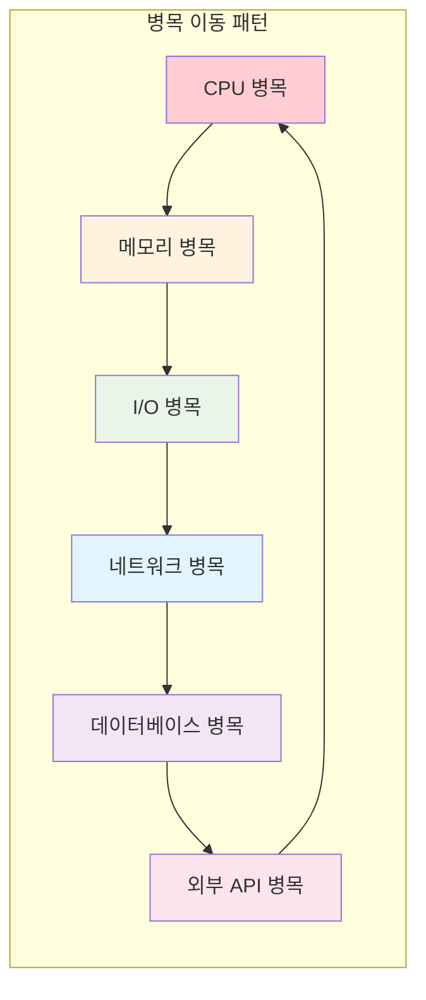

---
tags:
  - bottleneck_diagnosis
  - hands-on
  - intermediate
  - load_balancing
  - medium-read
  - performance_analysis
  - resource_utilization
  - system_monitoring
  - 인프라스트럭처
difficulty: INTERMEDIATE
learning_time: "4-6시간"
main_topic: "인프라스트럭처"
priority_score: 4
---

# 11.5a 시스템 성능 분석과 병목 진단

## 2022년 11월, 완벽한 폭풍의 날

2022년 11월 11일, 더블 11(쌍십일) 세일 당일. 우리 시스템에 평소의 50배 트래픽이 몰렸다.

**당시 각 컴포넌트별 성능:**

- CPU 최적화: ✅ 완료 (평균 사용률 60%)
- 메모리 최적화: ✅ 완료 (캐시 히트율 95%)
- I/O 최적화: ✅ 완료 (비동기 I/O 도입)

하지만 **시스템 전체**는 여전히 버거웠다.

**예상치 못한 병목들:**

- 로드 밸런서가 먼저 포화 (단일 장애점)
- 데이터베이스 커넥션 풀 고갈
- 네트워크 대역폭 초과 (1Gbps → 8Gbps 필요)
- JVM 가비지 컬렉션으로 인한 주기적 지연
- TCP 연결 수 한계 도달

**깨달음:** 개별 최적화는 완벽했지만, **시스템 전체의 균형**이 맞지 않았다.

## 시스템 성능의 전체론적 접근

### 성능 병목의 이동 법칙



**핵심 원리**: 한 곳의 병목을 해결하면 다른 곳에서 새로운 병목이 나타난다.

### 시스템 성능 균형점 찾기

```bash
#!/bin/bash
# system_balance_analyzer.sh - 시스템 균형점 분석

echo "=== 시스템 성능 균형 분석 ==="

# 1. 각 리소스별 사용률 측정
cpu_usage=$(top -bn1 | grep "Cpu(s)" | awk '{print $2}' | cut -d'%' -f1)
mem_usage=$(free | grep Mem | awk '{printf "%.1f", $3/$2 * 100}')
disk_usage=$(iostat -x 1 1 | awk '/^[sv]d/ {sum+=$10; count++} END {printf "%.1f", sum/count}')

echo "현재 리소스 사용률:"
echo "  CPU: ${cpu_usage}%"
echo "  Memory: ${mem_usage}%"
echo "  Disk: ${disk_usage}%"

# 2. 병목점 식별
bottleneck=""
max_usage=0

if (( $(echo "$cpu_usage > $max_usage" | bc -l) )); then
    bottleneck="CPU"
    max_usage=$cpu_usage
fi

if (( $(echo "$mem_usage > $max_usage" | bc -l) )); then
    bottleneck="Memory"
    max_usage=$mem_usage
fi

if (( $(echo "$disk_usage > $max_usage" | bc -l) )); then
    bottleneck="Disk"
    max_usage=$disk_usage
fi

echo "주요 병목점: $bottleneck (${max_usage}%)"

# 3. 균형도 계산
balance_score=$(echo "scale=2; 100 - (($cpu_usage - $mem_usage)^2 + ($mem_usage - $disk_usage)^2 + ($disk_usage - $cpu_usage)^2) / 100" | bc -l)
echo "시스템 균형도: ${balance_score}/100"

if (( $(echo "$balance_score > 80" | bc -l) )); then
    echo "✅ 시스템이 잘 균형잡혀 있습니다."
elif (( $(echo "$balance_score > 60" | bc -l) )); then
    echo "⚠️ 약간의 불균형이 있습니다."
else
    echo "🚨 심각한 불균형 - 전체적인 최적화가 필요합니다."
fi

# 4. 네트워크 상태 확인
echo -e ", 네트워크 상태:"
ss -s | grep -E "TCP:|UDP:"

# 5. 프로세스별 리소스 소비 Top 5
echo -e ", Top 5 리소스 소비 프로세스:"
ps aux --sort=-%cpu | head -6
```

## 핵심 요점

### 1. 시스템 관점의 성능 분석

시스템의 각 구성 요소가 어떻게 상호작용하는지 이해하고 전체적인 성능 최적화 접근

### 2. 병목점의 동적 특성

성능 병목은 고정되어 있지 않으며, 한 영역의 최적화로 인해 다른 영역에서 새로운 병목이 발생

### 3. 균형잡힌 최적화

각 리소스의 사용률이 고르게 분포되도록 하여 시스템 전체의 처리량 극대화

---

**다음**: [11-37-os-kernel-tuning.md](11-37-os-kernel-tuning.md)에서 운영체제와 커널 수준의 성능 튜닝을 학습합니다.

## 📚 관련 문서

### 📖 현재 문서 정보

- **난이도**: INTERMEDIATE
- **주제**: 인프라스트럭처
- **예상 시간**: 4-6시간

### 🎯 학습 경로

- [📚 INTERMEDIATE 레벨 전체 보기](../learning-paths/intermediate/)
- [🏠 메인 학습 경로](../learning-paths/)
- [📋 전체 가이드 목록](../README.md)

### 📂 같은 챕터 (chapter-11-performance-optimization)

- [Chapter 11-1: 성능 분석 방법론](./11-30-performance-methodology.md)
- [11.2 CPU 성능 최적화](./11-31-cpu-optimization.md)
- [11.3 메모리 성능 최적화](./11-32-memory-optimization.md)
- [11.3a 메모리 계층구조와 캐시 최적화](./11-10-memory-hierarchy-cache.md)
- [11.3b 메모리 할당 최적화](./11-11-memory-allocation.md)

### 🏷️ 관련 키워드

`performance_analysis`, `bottleneck_diagnosis`, `system_monitoring`, `resource_utilization`, `load_balancing`

### ⏭️ 다음 단계 가이드

- 실무 적용을 염두에 두고 프로젝트에 적용해보세요
- 관련 도구들을 직접 사용해보는 것이 중요합니다
