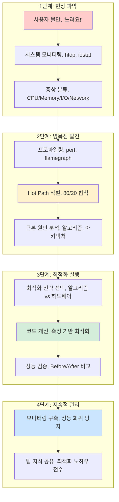
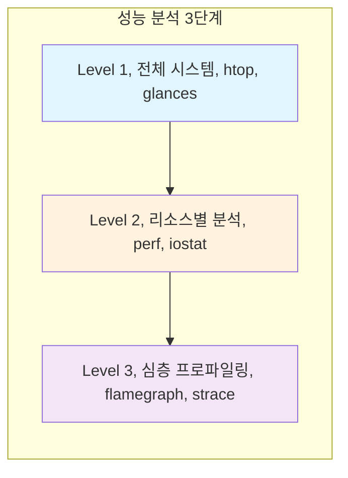

---
tags:
  - Performance
  - Optimization
  - Profiling
  - Guide
  - SystemProgramming
---

# Chapter 11: 성능 최적화 - 느린 시스템을 빠르게 만드는 기술

## 이 장에서 다루는 내용

"왜 이렇게 느리죠?" - 개발자라면 누구나 들어본 질문입니다.

사용자는 1초도 기다리기 싫어하고, 서버는 CPU 100%로 죽어가고, 관리자는 "최적화해주세요"라고 재촉합니다. 하지만 어디서부터 어떻게 시작해야 할까요?

이 장에서는 **측정 기반의 체계적인 성능 최적화**를 다룹니다. 추측이 아닌 데이터로, 감에 의존하지 않는 과학적 접근법으로 시스템을 빠르게 만드는 방법을 배웁니다.

## 왜 이것을 알아야 하는가?

### 🔥 2019년 블랙프라이데이 참사

제가 이커머스 회사에서 겪었던 실화입니다:

**11월 29일 새벽 2시**

```bash
# 평소 응답시간: 200ms
# 현재 응답시간: 15초

$ htop
CPU: 99.8% (모든 코어가 빨간불)
Memory: 7.2GB / 8GB
Load Average: 16.24, 18.33, 20.45
```

**새벽 3시: CEO 전화**

```text
"사이트가 안 되는데 언제 고쳐지나요?"
"고객들이 다 떠나가고 있어요..."
"매출이 시간당 1억씩 날아가고 있습니다!"
```

**문제는**: 어디서부터 봐야 할지 모르겠다는 것이었습니다.

- CPU가 뭘 하는지 알 수 없음
- 메모리 누수인지 확신 없음  
- Database가 문제인지 애플리케이션이 문제인지 불분명
- **"일단 서버를 늘려보자"** ← 최악의 선택

### 🚑 체계적 접근으로 30분 만에 해결

다행히 팀에 성능 전문가가 있었습니다:

```bash
# 1단계: 전체 시스템 상황 파악 (2분)
$ htop && iostat -x 1 && ss -tuln

# 2단계: CPU 병목점 식별 (5분)  
$ perf top
# 결과: image_resize_function이 87% CPU 사용!

# 3단계: 근본 원인 발견 (10분)
$ perf record -g ./app
$ perf script | flamegraph.pl > flame.svg
# 발견: 썸네일 생성에서 O(n²) 알고리즘 사용

# 4단계: 긴급 패치 적용 (15분)
# 썸네일 캐싱 활성화 + 알고리즘 개선
```

**결과**:

- 응답시간: 15초 → 180ms (83배 개선!)
- CPU 사용률: 99% → 15%
- 서버 추가 없이 트래픽 10배 처리 가능
- 💰 **하드웨어 비용 1억원 절약**

### 실무에서 마주치는 성능 문제들

이런 상황들 겪어보셨나요?

- 🐌 **"어제까지 빨랐는데 오늘 갑자기 느려졌어요"**
- 💥 **"서버를 늘렸는데도 여전히 느려요"**  
- 🤔 **"개발 환경에서는 빠른데 운영에서만 느려요"**
- 📊 **"어떤 부분을 최적화해야 할지 모르겠어요"**
- 🔄 **"최적화했는데 별로 빨라지지 않았어요"**

이런 문제들의 90%는 **체계적인 성능 분석 방법론**을 모르기 때문입니다.

## 성능 최적화의 전체 여정



## 이 장의 구성

### [11.1 성능 분석 방법론](01-performance-methodology.md)

**"어디서부터 시작해야 할까?"**

- 🎯 **USE Method**: Utilization, Saturation, Errors - 체계적 분석의 시작점
- 🛠 **도구 체인**: top → htop → perf → flamegraph 의 단계적 활용  
- 📏 **성능 목표**: P50, P95, P99 - 무엇을 측정할 것인가?
- ⚖️ **Trade-off 이해**: Latency vs Throughput, 무엇을 선택할까?



### [11.2 CPU 성능 최적화](02-cpu-optimization.md)

**"CPU 100%인데 뭘 하는지 모르겠어요"**

- 🔥 **FlameGraph 마스터**: CPU 시간을 시각적으로 분석하는 최고의 도구
- 🎯 **Hot Path 찾기**: 80%의 시간을 쓰는 20%의 코드 발견하기
- ⚡ **알고리즘 최적화**: O(n²) → O(n log n) 개선으로 100배 빨라지기
- 🏗 **컴파일러 활용**: -O2, LTO, PGO로 무료 성능 향상 얻기

### [11.3 메모리 성능 최적화](03-memory-optimization.md)

**"같은 연산인데 왜 100배 차이가 날까?"**

- 🧠 **Cache 이해하기**: L1, L2, L3 캐시와 메모리 계층 구조
- 🚫 **False Sharing**: 멀티코어 성능의 숨은 적 찾아내기
- 🏃 **Memory Access Pattern**: Sequential vs Random, 어떤 게 빠를까?
- 🗺 **NUMA 최적화**: 대용량 서버에서의 메모리 지역성

### [11.4 I/O 성능 최적화](04-io-optimization.md)

**"Database는 빠른데 애플리케이션이 느려요"**

- 💾 **Disk I/O 패턴**: HDD vs SSD, Sequential vs Random의 성능 차이
- 🌐 **Network I/O**: sendfile, zero-copy, TCP_NODELAY의 실제 효과
- ⚡ **Async I/O**: epoll, io_uring을 활용한 고성능 서버 구현
- 🔧 **Buffer 튜닝**: 커널 버퍼 크기 최적화로 처리량 향상

### [11.5 시스템 튜닝](05-system-tuning.md)

**"언어/프레임워크별 특화 최적화"**

- ☕ **JVM 튜닝**: GC 최적화, JIT 컴파일러 활용법
- 🐹 **Go 최적화**: goroutine profiling, garbage collector 튜닝  
- 🟨 **Node.js**: V8 엔진 최적화, Worker threads 활용
- 🗃 **Database**: 쿼리 최적화, 인덱스 전략, Connection pooling

## 🚀 실습 프로젝트: Performance Optimization Lab

### Week 1: 첫 번째 병목점 찾기

```bash
# 의도적으로 느린 프로그램 분석
$ git clone performance-lab/slow-app
$ time ./slow-app
# 목표: 10초 → 1초 이내 최적화

# 도구 체인 연습
$ perf record -g ./slow-app
$ perf script | flamegraph.pl > flame.svg  
$ firefox flame.svg
```

### Week 2: 메모리 최적화 마스터

```c
// Cache miss 최적화 실습
// Before: Random access (cache miss 많음)
for (int i = 0; i < N; i++) {
    result += data[random_index[i]];
}

// After: Sequential access (cache hit 많음)  
for (int i = 0; i < N; i++) {
    result += data[i];
}

// 성능 차이: 50배!
```

### Week 3: I/O 최적화 실습

```bash
# 파일 I/O 패턴 비교
$ dd if=/dev/zero of=test bs=4K count=100K
$ time cat test > /dev/null     # Sequential: 0.1초
$ time shuf test > /dev/null    # Random: 5.2초

# Network I/O 최적화  
$ wrk -t12 -c400 -d30s http://localhost:8080/
# 목표: 1000 RPS → 10000 RPS
```

### Week 4: 종합 프로젝트

실제 웹 애플리케이션을 10배 빠르게 만들기

## 💡 성능 최적화의 철칙들

### 1. 측정 없이는 최적화 없다

```bash
# ❌ 틀린 접근
"이 부분이 느릴 것 같으니까 최적화하자"

# ✅ 올바른 접근  
$ perf record -g ./app
$ perf report  # 데이터 기반 최적화
```

### 2. 80/20 법칙을 활용하라

- 20%의 코드가 80%의 실행 시간을 차지
- Hot Path를 먼저 최적화하면 극적인 효과

### 3. 알고리즘이 하드웨어를 이긴다

- CPU 2배 빠른 서버: 2배 개선
- O(n²) → O(n log n): 1000배 개선!

### 4. 캐시는 모든 곳에 있다

- CPU Cache, OS Page Cache, Application Cache
- Cache hit rate 1% 향상 = 전체 성능 10% 향상

## 🎯 이 장을 마스터하면

✅ **성능 문제 진단**: 체계적인 방법론으로 병목점을 빠르게 찾을 수 있습니다  
✅ **최적화 도구 활용**: perf, flamegraph, strace 등을 자유자재로 사용할 수 있습니다  
✅ **측정 기반 개선**: 추측이 아닌 데이터로 성능을 개선할 수 있습니다  
✅ **비용 효율적 확장**: 서버 추가 없이 10배 성능 향상을 달성할 수 있습니다  

## 실습 환경 준비

이 장의 예제들을 실행하려면:

```bash
# 성능 분석 도구 설치
$ sudo apt-get update
$ sudo apt-get install linux-tools-generic htop iotop sysstat

# FlameGraph 도구 설치  
$ git clone https://github.com/brendangregg/FlameGraph
$ export PATH=$PATH:$PWD/FlameGraph

# 권한 설정 (perf 사용을 위해)
$ sudo sysctl kernel.perf_event_paranoid=-1

# 테스트 애플리케이션 다운로드
$ git clone https://github.com/performance-lab/practice-apps
```

## 성능 최적화 히어로들의 이야기

### Brendan Gregg - Netflix의 성능 마법사

"If you can't measure it, you can't improve it"

FlameGraph를 발명하고, 수많은 성능 도구를 개발한 전설적인 엔지니어입니다.

### John Carmack - id Software의 최적화 천재

Doom, Quake 같은 게임을 386 CPU에서 60fps로 실행하게 만든 최적화의 신입니다.

### 우리의 목표

이 장을 마스터하면 여러분도 성능 최적화 전문가가 될 수 있습니다!

## 다음 단계

준비되셨나요? [11.1 성능 분석 방법론](01-performance-methodology.md)에서 체계적인 성능 분석의 여정을 시작합니다.

"느려서 못 쓰겠다"는 시스템을 "너무 빨라서 놀랍다"는 시스템으로 바꿔보겠습니다! 🚀
