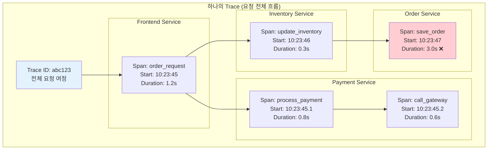

---
tags:
  - distributed-tracing
  - fundamentals
  - medium-read
  - microservices
  - observability
  - span
  - theoretical
  - trace
  - 인프라스트럭처
difficulty: FUNDAMENTALS
learning_time: "2-3시간"
main_topic: "인프라스트럭처"
priority_score: 4
---

# 13.2a 분산 추적 기초 - 미로에서 길을 찾는 첫 번째 단계

## 서론: 2024년 3월, 고객의 주문이 사라진 미스터리

우리 e-커머스 플랫폼에서 발생한 기묘한 현상이었습니다. 고객이 주문 버튼을 누르면 "주문이 완료되었습니다"라는 메시지가 나오지만, 실제로는 주문이 처리되지 않는 경우가 간헐적으로 발생했습니다.

### 🕵️ 3월 15일 오전 10:00 - 사라진 주문의 미스터리

```bash
# 고객 리포트: "주문했는데 내 계정에 안 보여요"
고객 ID: user_12345
주문 시간: 2024-03-15 10:23:45
주문 번호: ORD-2024-0315-001

# 각 서비스 로그를 개별 확인...
```

**Frontend Service 로그:**

```bash
[10:23:45] INFO  OrderController - Order request received
[10:23:45] INFO  OrderController - Calling payment service...
[10:23:46] INFO  OrderController - Payment successful, proceeding...
[10:23:46] INFO  OrderController - Order completed successfully
[10:23:46] INFO  OrderController - Response sent to client: {"status": "success", "orderId": "ORD-2024-0315-001"}
```

**Payment Service 로그:**

```bash
[10:23:45] INFO  PaymentProcessor - Processing payment for user_12345
[10:23:45] INFO  PaymentProcessor - Amount: $199.99, Method: credit_card
[10:23:46] INFO  PaymentProcessor - Payment gateway response: SUCCESS
[10:23:46] INFO  PaymentProcessor - Payment completed, notifying inventory...
```

**Inventory Service 로그:**

```bash
[10:23:46] INFO  InventoryManager - Received inventory update request
[10:23:46] INFO  InventoryManager - Product: laptop_model_x, Quantity: 1
[10:23:46] INFO  InventoryManager - Inventory updated successfully
[10:23:46] INFO  InventoryManager - Calling order processing service...
```

**Order Processing Service 로그:**

```bash
[10:23:47] ERROR OrderProcessor - Database connection timeout
[10:23:47] ERROR OrderProcessor - Failed to save order: Connection timed out after 30000ms
[10:23:47] WARN  OrderProcessor - Retrying order save... (attempt 1/3)
[10:23:48] ERROR OrderProcessor - Database connection timeout
[10:23:48] ERROR OrderProcessor - Retrying order save... (attempt 2/3)  
[10:23:49] ERROR OrderProcessor - Database connection timeout
[10:23:49] ERROR OrderProcessor - Order save failed after 3 attempts
[10:23:49] ERROR OrderProcessor - 🔥 Order ORD-2024-0315-001 LOST!
```

**문제 발견까지 걸린 시간: 4시간**

각 서비스의 로그가 분산되어 있어서, 전체 요청 흐름을 파악하는 데 엄청난 시간이 걸렸습니다. 이 경험으로 우리는 **분산 추적(Distributed Tracing)**의 필요성을 절감했습니다.

## 🔍 Distributed Tracing의 핵심 개념

### 📊 Trace, Span, Context의 이해



### 분산 추적의 핵심 구성요소

#### 1. **Trace (추적)**

하나의 요청이 시스템을 통과하는 전체 여정을 나타냅니다.

```python
# Trace 예시 구조
trace = {
    "trace_id": "abc123def456",
    "start_time": "2024-03-15T10:23:45.000Z",
    "end_time": "2024-03-15T10:23:49.200Z",
    "duration": "4.2s",
    "services_involved": ["frontend", "payment", "inventory", "order"],
    "spans": [...],  # 모든 Span들
    "status": "ERROR"
}
```

#### 2. **Span (구간)**

하나의 작업 단위를 나타냅니다. 각 서비스의 특정 작업이나 함수 호출을 추적합니다.

```python
# Span 예시 구조
span = {
    "span_id": "span_001",
    "parent_span_id": None,  # 루트 Span
    "operation_name": "process_order",
    "service_name": "frontend-service",
    "start_time": "2024-03-15T10:23:45.000Z",
    "end_time": "2024-03-15T10:23:46.200Z",
    "duration": "1.2s",
    "tags": {
        "user_id": "user_12345",
        "order_amount": "$199.99",
        "payment_method": "credit_card"
    },
    "status": "OK"
}
```

#### 3. **Context (컨텍스트)**

서비스 간 추적 정보를 전달하는 메커니즘입니다.

```python
# HTTP 헤더를 통한 컨텍스트 전파
headers = {
    "traceparent": "00-abc123def456-span001-01",
    "tracestate": "vendor1=value1,vendor2=value2",
    "baggage": "user_tier=premium,region=us-east"
}
```

### 🔧 추적 정보의 구조화

```python
from dataclasses import dataclass
from typing import Dict, List, Optional
from datetime import datetime

@dataclass
class SpanData:
    """Span 데이터 구조"""
    span_id: str
    parent_span_id: Optional[str]
    operation_name: str
    service_name: str
    start_time: datetime
    end_time: Optional[datetime]
    duration_ms: Optional[float]
    tags: Dict[str, str]
    logs: List[Dict[str, str]]
    status: str  # OK, ERROR, TIMEOUT
    
    def add_tag(self, key: str, value: str):
        """태그 추가"""
        self.tags[key] = value
    
    def add_log(self, level: str, message: str, timestamp: datetime = None):
        """로그 이벤트 추가"""
        self.logs.append({
            "level": level,
            "message": message,
            "timestamp": (timestamp or datetime.now()).isoformat()
        })
    
    def finish(self):
        """Span 완료 처리"""
        self.end_time = datetime.now()
        self.duration_ms = (self.end_time - self.start_time).total_seconds() * 1000

@dataclass 
class TraceData:
    """Trace 데이터 구조"""
    trace_id: str
    root_span_id: str
    start_time: datetime
    end_time: Optional[datetime]
    total_duration_ms: Optional[float]
    spans: List[SpanData]
    services: List[str]
    status: str
    error_count: int
    
    def add_span(self, span: SpanData):
        """Span 추가"""
        self.spans.append(span)
        
        # 서비스 목록 업데이트
        if span.service_name not in self.services:
            self.services.append(span.service_name)
        
        # 에러 카운트 업데이트
        if span.status == "ERROR":
            self.error_count += 1
            self.status = "ERROR"
    
    def get_service_durations(self) -> Dict[str, float]:
        """서비스별 총 소요시간 계산"""
        service_durations = {}
        
        for span in self.spans:
            if span.duration_ms and span.service_name:
                if span.service_name not in service_durations:
                    service_durations[span.service_name] = 0
                service_durations[span.service_name] += span.duration_ms
        
        return service_durations
    
    def find_critical_path(self) -> List[SpanData]:
        """임계 경로 찾기 (가장 오래 걸린 경로)"""
        # 루트 Span부터 시작해서 가장 긴 경로 찾기
        def get_span_by_id(span_id: str) -> Optional[SpanData]:
            for span in self.spans:
                if span.span_id == span_id:
                    return span
            return None
        
        def find_longest_path(current_span: SpanData) -> List[SpanData]:
            children = [s for s in self.spans if s.parent_span_id == current_span.span_id]
            
            if not children:
                return [current_span]
            
            longest_child_path = []
            max_duration = 0
            
            for child in children:
                child_path = find_longest_path(child)
                total_duration = sum(s.duration_ms or 0 for s in child_path)
                
                if total_duration > max_duration:
                    max_duration = total_duration
                    longest_child_path = child_path
            
            return [current_span] + longest_child_path
        
        root_span = get_span_by_id(self.root_span_id)
        if root_span:
            return find_longest_path(root_span)
        
        return []
```

## 핵심 요점

### 1. **분산 추적의 필요성**

- 마이크로서비스 간 요청 흐름 파악
- 성능 병목 지점 식별
- 에러 전파 경로 추적
- 의존성 관계 시각화

### 2. **핵심 개념 이해**

- **Trace**: 전체 요청 여정
- **Span**: 개별 작업 단위
- **Context**: 서비스 간 정보 전파

### 3. **데이터 구조화**

- 계층적 Span 구조
- 태그와 로그를 통한 상세 정보
- 시간 기반 성능 분석

---

**다음**: [12-18-opentelemetry-implementation.md](12-18-opentelemetry-implementation.md)에서 OpenTelemetry를 사용한 실제 분산 추적 구현을 학습합니다.

## 📚 관련 문서

### 📖 현재 문서 정보

- **난이도**: FUNDAMENTALS
- **주제**: 인프라스트럭처
- **예상 시간**: 2-3시간

### 🎯 학습 경로

- [📚 FUNDAMENTALS 레벨 전체 보기](../learning-paths/fundamentals/)
- [🏠 메인 학습 경로](../learning-paths/)
- [📋 전체 가이드 목록](../README.md)

### 📂 같은 챕터 (chapter-13-observability-debugging)

- [13.1 로깅 및 모니터링 시스템 - 시스템의 눈과 귀 개요](./12-40-logging-monitoring.md)
- [13.1A 관찰 가능성 기초 - 시스템을 보는 눈](./12-10-observability-foundations.md)
- [13.1a 구조화된 로깅 - 검색 가능한 로그 시스템](./12-11-structured-logging.md)
- [13.1b 메트릭 수집 - 시스템 건강도 측정](./12-12-metrics-collection.md)
- [13.1B 구조화된 로깅 - 검색 가능한 로그](./12-13-structured-logging.md)

### 🏷️ 관련 키워드

`distributed-tracing`, `observability`, `microservices`, `span`, `trace`

### ⏭️ 다음 단계 가이드

- 기초 개념을 충분히 이해한 후 INTERMEDIATE 레벨로 진행하세요
- 실습 위주의 학습을 권장합니다
