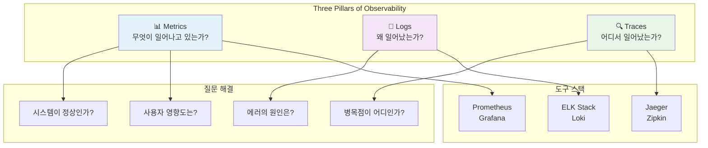

---
tags:
  - FileDescriptor
  - FileSystem
  - IO
  - SystemProgramming
  - VFS
  - deep-study
  - hands-on
  - intermediate
  - 시스템프로그래밍
difficulty: INTERMEDIATE
learning_time: "12-20시간"
main_topic: "시스템 프로그래밍"
priority_score: 4
---

# Chapter 13: 관찰가능성과 디버깅 - 시스템을 들여다보는 기술

## 이 장에서 다루는 내용

로깅, 모니터링, 분산 추적부터 고급 디버깅까지 시스템 관찰가능성의 모든 것을 다룹니다.

## 왜 이것을 알아야 하는가?

### 🚨 2021년 10월 21일 새벽 3시 - 실화

제가 핀테크 스타트업에서 겪었던 최악의 장애 상황입니다:

**새벽 3:15 - 알람 폭격**

```text
📱 PagerDuty: "API response time > 5s"
📱 Slack: "#alerts API 500 error rate > 10%"
📱 Phone: "CEO님 직통전화"
📱 SMS: "고객 컴플레인 급증"
```

**새벽 3:20 - 혼란 상황**

```bash
# 🤷‍♂️ 개발자들의 첫 반응
"로그를 봐야겠다"
$ tail -f /var/log/app.log
# 수천 줄이 초당 흘러가는데 뭐가 문제인지 알 수 없음

"CPU는 어떻지?"
$ htop
# CPU 사용률 정상

"데이터베이스 문제인가?"
$ mysql -e "SHOW PROCESSLIST"
# 쿼리도 정상적으로 실행됨
```

**새벽 3:45 - 여전히 원인 불명**

```text
😰 CEO: "언제 복구되나요?"
😰 고객지원: "고객이 계속 전화해요!"
😰 개발팀: "뭐가 문제인지 모르겠어요..."
```

**문제**: **관찰 가능성(Observability)**이 전혀 없었습니다.

- 어떤 서비스에서 에러가 발생하는지 알 수 없음
- 에러의 근본 원인을 추적할 방법 없음
- 시스템 상태를 종합적으로 파악할 도구 없음
- 장애 복구까지 4시간 소요 😭

### 🎯 Observability 도입 후: 같은 장애 5분 만에 해결

6개월 후 같은 유형의 장애가 발생했을 때:

**새벽 2:30 - 자동 감지**

```bash
# Prometheus Alert Manager
ALERT: payment-service error rate > 5%
Labels: service=payment-service, severity=critical
Duration: 2m

# Grafana Dashboard 확인
- Payment Service: ERROR 🔴
- User Service: OK 🟢
- Order Service: OK 🟢
# 즉시 문제 서비스 식별!
```

**새벽 2:32 - 근본 원인 발견**

```bash
# Jaeger distributed tracing으로 추적
$ curl jaeger-query:16686/api/traces?service=payment-service

Trace ID: 1a2b3c4d5e6f
├─ user-service: 45ms ✅
├─ order-service: 67ms ✅
└─ payment-service: TIMEOUT ❌
    └─ third-party-payment-api: 30000ms (timeout!)

# 원인: 외부 결제 API 장애
```

**새벽 2:35 - 즉시 복구**

```yaml
# Circuit Breaker 활성화로 fallback 처리
apiVersion: v1
kind: ConfigMap
metadata:
  name: payment-config
data:
  circuit_breaker_enabled: "true"
  fallback_payment_method: "queue"

# 결과: 결제는 큐에 저장, 나중에 배치 처리
# 사용자는 "결제 처리 중" 메시지 확인
# 서비스 정상화!
```

**총 해결 시간: 5분** ⚡

## Observability의 3 Pillars



### Metrics: 시스템의 생체 신호

**"환자가 살아있나요?"**를 확인하는 것과 같습니다.

```bash
# 핵심 메트릭들
1. Golden Signals (SRE 핵심 4가지)
   - Latency: 응답 시간 (P50, P95, P99)
   - Traffic: 초당 요청 수 (RPS)
   - Errors: 에러율 (%)
   - Saturation: 리소스 사용률 (%)

2. USE Method (인프라 관점)
   - Utilization: CPU, Memory 사용률
   - Saturation: 대기 큐 길이
   - Errors: 하드웨어/커널 에러

3. RED Method (서비스 관점)
   - Rate: 초당 요청 수
   - Errors: 에러 개수/비율
   - Duration: 응답 시간 분포
```

### Logs: 시스템의 일기장

**"무슨 일이 일어났나요?"**를 기록하는 것입니다.

```json
// 구조화된 로그 예시
{
  "timestamp": "2023-10-21T03:15:42Z",
  "level": "ERROR",
  "service": "payment-service",
  "trace_id": "1a2b3c4d5e6f",
  "user_id": "user_12345",
  "error": "timeout connecting to payment gateway",
  "duration_ms": 30000,
  "upstream_service": "stripe-api"
}
```

### Traces: 요청의 여행 경로

**"이 요청이 어디를 거쳤나요?"**를 추적하는 것입니다.

```text
Request ID: abc123def456
│
├─ API Gateway: 2ms
├─ Auth Service: 15ms
├─ User Service: 23ms
├─ Order Service: 45ms
└─ Payment Service: 30000ms ❌
   └─ Stripe API: timeout
```

## 이 장의 구성

### [13.1 로깅 및 모니터링 시스템](13-40-logging-monitoring.md)

**"시스템이 건강한가?"**

- 📊 **Prometheus 완전 정복**: 메트릭 수집, PromQL 쿼리 마스터
- 📈 **Grafana 대시보드**: 시각화와 알림 설정
- ⚡ **Golden Signals**: Latency, Traffic, Errors, Saturation 구현
- 🎯 **Custom Metrics**: 비즈니스 메트릭 정의와 수집

```prometheus
# 실제 사용하는 핵심 쿼리들
# API 에러율 (지난 5분)
rate(http_requests_total{status=~"5.."}[5m]) / rate(http_requests_total[5m]) * 100

# P95 응답 시간
histogram_quantile(0.95, rate(http_request_duration_seconds_bucket[5m]))

# 서비스별 처리량
sum(rate(http_requests_total[1m])) by (service)
```

### [13.2 분산 추적 시스템](13-17-distributed-tracing.md)

**"무슨 일이 벌어졌나?"**

- 📝 **구조화된 로깅**: JSON 로그, Correlation ID 활용
- 🔍 **ELK Stack**: Elasticsearch, Logstash, Kibana 구축
- 🚀 **로그 파이프라인**: Fluentd, Vector를 활용한 실시간 수집
- 💡 **로그 분석**: 패턴 인식, 이상 탐지, 알림 설정

**실제 운영 사례**: 초당 10만 건 로그 처리 시스템 구축

### [13.3 메트릭 수집 및 알림](13-19-metrics-alerts.md)

**"요청이 어디서 느려졌나?"**

- 🔗 **OpenTelemetry**: 표준 계측 라이브러리 활용
- 🕵️ **Jaeger 구축**: 분산 추적 시스템 운영
- 📍 **Trace 분석**: Span, Context Propagation 이해
- ⚖️ **Sampling 전략**: 성능 vs 관찰 가능성 트레이드오프

```go
// OpenTelemetry 계측 예시
func handleOrder(ctx context.Context, order Order) error {
    // 새로운 span 생성
    ctx, span := tracer.Start(ctx, "process-order")
    defer span.End()

    // 속성 추가
    span.SetAttributes(
        attribute.String("order.id", order.ID),
        attribute.Int("order.amount", order.Amount),
    )

    // 하위 서비스 호출 (자동으로 연결됨)
    err := paymentService.Charge(ctx, order.Amount)
    if err != nil {
        span.RecordError(err)
        span.SetStatus(codes.Error, err.Error())
        return err
    }

    return nil
}
```

### [13.4 성능 프로파일링](13-31-performance-profiling.md)

**"Production에서 어떻게 디버깅하나?"**

- 🛠 **Live Debugging**: Production에서 안전한 디버깅 방법
- 📊 **Performance Profiling**: 실시간 성능 분석
- 🔄 **Chaos Engineering**: 장애 상황 시뮬레이션
- 📋 **Runbook 작성**: 장애 대응 플레이북

### [13.5 디버깅 기법 및 문제 해결](13-41-debugging-troubleshooting.md)

**"장애가 발생하면 어떻게 대응하나?"**

- 🚨 **On-call 문화**: 효과적인 장애 대응 조직
- 📱 **Alert Management**: PagerDuty, OpsGenie 활용
- 🔍 **Post-mortem**: 장애 분석과 개선 방안 도출
- 📈 **SLI/SLO**: 서비스 수준 목표 설정과 관리

## 🚀 실습 프로젝트: Full-Stack Observability

### Week 1: 모니터링 스택 구축

```bash
# Prometheus + Grafana + AlertManager 설치
$ git clone observability-lab/monitoring-stack
$ docker-compose up -d

# 서비스들 확인
$ docker ps
prometheus:9090   # 메트릭 수집
grafana:3000      # 시각화 대시보드
alertmanager:9093 # 알림 관리

# 샘플 애플리케이션 배포
$ kubectl apply -f sample-app.yaml
# Go, Python, Node.js 마이크로서비스들
```

### Week 2: 로그 파이프라인 구축

```yaml
# ELK Stack with Fluentd
version: '3'
services:
  elasticsearch:
    image: elastic/elasticsearch:8.5.0
    environment:
      - discovery.type=single-node

  kibana:
    image: elastic/kibana:8.5.0
    ports:
      - "5601:5601"

  fluentd:
    image: fluentd:v1.16-1
    volumes:
      - ./fluentd.conf:/fluentd/etc/fluent.conf
```

### Week 3: 분산 추적 구현

```bash
# Jaeger All-in-One 배포
$ docker run -d --name jaeger \
  -p 16686:16686 \
  -p 14268:14268 \
  jaegertracing/all-in-one:1.39

# OpenTelemetry 계측
$ npm install @opentelemetry/auto-instrumentations-node
$ export OTEL_EXPORTER_JAEGER_ENDPOINT=http://localhost:14268/api/traces
$ node --require @opentelemetry/auto-instrumentations-node/register app.js
```

### Week 4: 장애 시뮬레이션과 대응

```bash
# Chaos Monkey 실행
$ chaoskube --interval=10m --dry-run=false
# 무작위로 Pod 종료하여 장애 상황 시뮬레이션

# 대응 프로세스 연습
1. 알림 수신 → Slack 확인
2. 대시보드 접속 → 상황 파악
3. 로그 분석 → 원인 추정
4. Trace 조회 → 병목점 식별
5. 복구 작업 → 서비스 정상화
6. Post-mortem 작성
```

## 💡 Observability 모범 사례들

### 1. 모든 것을 로깅하지 마라

```bash
# ❌ 나쁜 예: 과도한 로깅
logger.debug("Entering function processOrder")
logger.debug("Order ID: %s", orderId)
logger.debug("Validating order...")
logger.debug("Order validation successful")
logger.debug("Calling payment service...")
# 의미 없는 로그로 시스템 부하 증가

# ✅ 좋은 예: 의미 있는 로깅
logger.info("Processing order", {
    "order_id": orderId,
    "user_id": userId,
    "amount": amount,
    "trace_id": traceId
})

if err := paymentService.Charge(amount); err != nil {
    logger.error("Payment failed", {
        "order_id": orderId,
        "error": err.Error(),
        "trace_id": traceId
    })
}
```

### 2. 상관 관계 ID (Correlation ID) 활용

```go
// 모든 로그에 동일한 trace_id 포함
func ProcessOrder(ctx context.Context, order Order) {
    traceID := trace.SpanFromContext(ctx).SpanContext().TraceID()

    log.Info("Order received", map[string]interface{}{
        "trace_id": traceID,
        "order_id": order.ID,
    })

    // 다른 서비스 호출시에도 context 전달
    payment.Charge(ctx, order.Amount)  // traceID 자동 전파
}
```

### 3. 적절한 메트릭 카디널리티 유지

```prometheus
# ❌ 높은 카디널리티 (메모리 폭발)
http_requests_total{user_id="user1", endpoint="/api/users/user1"}
http_requests_total{user_id="user2", endpoint="/api/users/user2"}
# 사용자마다 별도 메트릭 = 메모리 사용량 폭증

# ✅ 낮은 카디널리티
http_requests_total{method="GET", endpoint="/api/users", status="200"}
http_requests_total{method="POST", endpoint="/api/orders", status="201"}
# 엔드포인트별로 집계 = 메모리 효율적
```

## 🎯 Observability 성숙도 모델

### Level 1: Reactive (반응적)

```text
🔴 현재 상황: "장애 발생 후 알게 됨"

특징:
- 고객이 먼저 문제 신고
- 로그 파일 수동 확인
- 장애 원인 파악에 수시간 소요
- 반복적인 수동 작업
```

### Level 2: Proactive (예방적)

```text
🟡 현재 상황: "문제를 미리 감지"

특징:
- 기본 모니터링 도구 구축 (Grafana, Prometheus)
- 임계치 기반 알림 설정
- 주요 메트릭 대시보드 구축
- 장애 대응 시간 단축 (30분 이내)
```

### Level 3: Predictive (예측적)

```text
🟢 목표 상황: "문제를 예측하고 자동 해결"

특징:
- AI/ML 기반 이상 탐지
- 자동 스케일링과 자가 치유
- 비즈니스 메트릭과 기술 메트릭 연결
- 장애 예방률 90% 이상
```

## 실무 적용 체크리스트

### 🚀 Phase 1: 기본 관찰성 구축 (1주)

```bash
# 필수 도구 설치
✅ Prometheus + Grafana 구축
✅ 기본 시스템 메트릭 수집 (CPU, Memory, Disk)
✅ 애플리케이션 health check 엔드포인트
✅ 장애 알림 채널 설정 (Slack, Email)

# 핵심 대시보드 생성
✅ Golden Signals 대시보드
✅ Infrastructure 대시보드
✅ 비즈니스 메트릭 대시보드
```

### 📊 Phase 2: 고급 분석 구축 (2주)

```bash
# 로그 중앙화
✅ 구조화된 로깅 표준 정의
✅ 로그 수집 파이프라인 구축
✅ 로그 검색/분석 도구 도입

# 분산 추적
✅ OpenTelemetry 계측
✅ Jaeger/Zipkin 구축
✅ 핵심 요청 경로 추적
```

### 🔬 Phase 3: 지능형 관찰성 (4주)

```bash
# 고급 기능
✅ 이상 탐지 알고리즘 도입
✅ 자동 근본 원인 분석
✅ Chaos Engineering 도입
✅ SLI/SLO 기반 관리
```

## 🎯 이 장을 마스터하면

✅ **장애 조기 감지**: 고객보다 먼저 문제를 발견할 수 있습니다
✅ **빠른 원인 분석**: 분산 추적으로 병목점을 즉시 식별할 수 있습니다
✅ **효과적인 알림**: 노이즈 없는 의미 있는 알림 시스템을 구축할 수 있습니다
✅ **데이터 기반 의사결정**: 메트릭과 로그를 바탕으로 시스템을 개선할 수 있습니다

## 다음 단계

준비되셨나요? [13.1 로깅 및 모니터링 시스템](13-40-logging-monitoring.md)에서 구조화된 로깅부터 지능적인 알림 시스템까지 체계적인 관찰 가능성을 구축해보겠습니다.

"보이지 않으면 관리할 수 없습니다." 시스템에 눈과 귀를 달아 완벽한 관찰 가능성을 확보해봅시다! 👀🔍

## 📚 관련 문서

### 📖 현재 문서 정보

- **난이도**: INTERMEDIATE
- **주제**: 시스템 프로그래밍
- **예상 시간**: 12-20시간

### 🎯 학습 경로

- [📚 INTERMEDIATE 레벨 전체 보기](../learning-paths/intermediate/)
- [🏠 메인 학습 경로](../learning-paths/)
- [📋 전체 가이드 목록](../README.md)

### 📂 같은 챕터 (chapter-13-observability-debugging)

- [Chapter 13-01: Tracing Fundamentals](./13-01-tracing-fundamentals.md)
- [Chapter 13-10: Observability Foundations](./13-10-observability-foundations.md)
- [Chapter 13-11: Structured Logging](./13-11-structured-logging.md)
- [Chapter 13-12: Metrics Collection](./13-12-metrics-collection.md)
- [Chapter 13-13: Structured Logging](./13-13-structured-logging.md)
- [Chapter 13-14: Alert Management](./13-14-alert-management.md)
- [Chapter 13-15: Metrics Collection](./13-15-metrics-collection.md)
- [Chapter 13-16: Alert Management](./13-16-alert-management.md)
- [Chapter 13-17: Distributed Tracing](./13-17-distributed-tracing.md)
- [Chapter 13-18: Opentelemetry Implementation](./13-18-opentelemetry-implementation.md)
- [Chapter 13-19: Metrics Alerts](./13-19-metrics-alerts.md)
- [Chapter 13-30: Sampling Optimization](./13-30-sampling-optimization.md)
- [Chapter 13-31: Performance Profiling](./13-31-performance-profiling.md)
- [Chapter 13-40: Logging Monitoring](./13-40-logging-monitoring.md)
- [Chapter 13-41: Debugging Troubleshooting](./13-41-debugging-troubleshooting.md)
- [Chapter 13-42: Systematic Debugging Frameworks](./13-42-systematic-debugging-frameworks.md)
- [Chapter 13-43: Distributed Debugging](./13-43-distributed-debugging.md)
- [Chapter 13-44: Smart Debugging Tools](./13-44-smart-debugging-tools.md)
- [Chapter 13-45: Log Analysis Debugging](./13-45-log-analysis-debugging.md)
- [Chapter 13-50: Best Practices Lessons](./13-50-best-practices-lessons.md)

### 🏷️ 관련 키워드

`FileDescriptor`, `VFS`, `IO`, `FileSystem`, `SystemProgramming`

### ⏭️ 다음 단계 가이드

- 실무 적용을 염두에 두고 프로젝트에 적용해보세요
- 관련 도구들을 직접 사용해보는 것이 중요합니다
