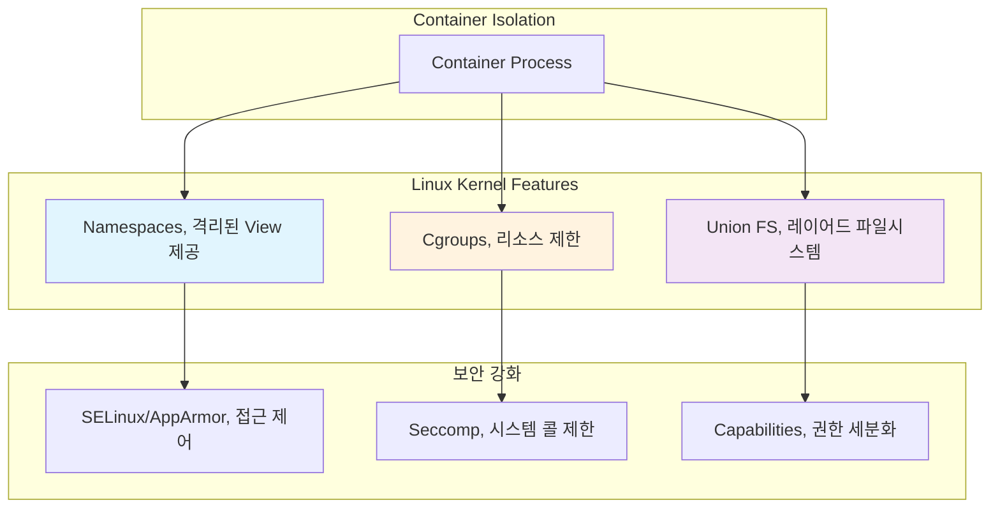

---
tags:
  - cgroup
  - container
  - deep-study
  - docker
  - hands-on
  - intermediate
  - linux
  - namespace
  - 인프라스트럭처
difficulty: INTERMEDIATE
learning_time: "6-10시간"
main_topic: "인프라스트럭처"
priority_score: 4
---

# 12.1 Container 핵심 기술 - 격리의 과학

## 이 문서를 읽고 나면 답할 수 있는 질문들

- 컨테이너는 가상머신과 어떻게 다른가요?
- Linux namespace는 어떻게 격리를 만드나요?
- Cgroup은 어떻게 리소스를 제한하나요?
- Union Filesystem은 왜 필요한가요?
- Docker 없이도 컨테이너를 만들 수 있나요?

## 들어가며: 컨테이너의 진실

### 🎭 "컨테이너는 가상머신이 아니다"

많은 사람들이 컨테이너를 "가벼운 가상머신" 정도로 이해하지만, 이는 완전히 다른 기술입니다.

**2014년 제가 처음 Docker를 접했을 때의 착각**:

```text
🤔 내 생각: "Docker = VMware의 가벼운 버전"

🔍 실제로는:
Virtual Machine = 완전히 다른 OS 실행 (하드웨어 가상화)
Container = 같은 OS 커널 공유 (프로세스 격리)
```

**실험으로 확인해보기**:

```bash
# 호스트 OS
$ uname -r
5.15.0-56-generic

# 컨테이너 안에서
$ docker run ubuntu uname -r
5.15.0-56-generic  # 똑같은 커널!

# VM 안에서는
$ vagrant up ubuntu
$ vagrant ssh
vagrant@ubuntu:~$ uname -r
5.4.0-77-generic  # 다른 커널!
```

### 🧬 컨테이너 격리의 3대 기술

컨테이너의 격리는 Linux 커널의 3가지 핵심 기능으로 이루어집니다:



## Linux Namespaces: 각자의 세상 만들기

### Namespace란?

**Namespace는 "이름 공간"의 격리**입니다. 같은 이름이라도 다른 namespace에 있으면 다른 대상을 가리킵니다.

**일상 생활의 예시**:

```text
🏠 집 주소: "서울시 강남구 123번지"
🏢 회사 주소: "서울시 강남구 123번지"

같은 주소여도 다른 건물 (namespace가 다름)
```

### 7가지 Namespace 종류

#### 1. PID Namespace: 프로세스 ID 격리

```bash
# 호스트에서 보는 프로세스들
$ ps aux | grep nginx
root     1234  nginx: master process
www      1235  nginx: worker process

# 컨테이너 안에서는
$ docker exec container_id ps aux
PID   COMMAND
1     nginx: master process  # PID 1부터 시작!
2     nginx: worker process
```

**직접 실험해보기**:

```bash
# 새로운 PID namespace 생성
$ sudo unshare -p -f bash
# 이 bash는 새로운 PID namespace에서 실행됨

# 하지만 /proc이 여전히 호스트를 가리킴
$ ps aux  # 여전히 호스트의 프로세스들이 보임

# /proc을 새로 마운트해야 진짜 격리
$ mount -t proc proc /proc
$ ps aux  # 이제 현재 namespace의 프로세스만 보임!
```

#### 2. Network Namespace: 네트워크 스택 격리

```bash
# 호스트의 네트워크 인터페이스
$ ip addr show
1: lo: <LOOPBACK,UP>
2: eth0: <BROADCAST,UP> inet 192.168.1.100/24

# 새 네트워크 namespace 생성
$ sudo ip netns add test_ns
$ sudo ip netns exec test_ns ip addr show
1: lo: <LOOPBACK> state DOWN  # 새로운 네트워크 스택!

# 컨테이너의 네트워크도 이렇게 격리됨
$ docker run -it nginx ip addr show
1: lo: <LOOPBACK,UP>
12: eth0: <BROADCAST,UP> inet 172.17.0.2/16  # 컨테이너 전용 IP
```

**네트워크 namespace 연결하기**:

```bash
# veth pair로 호스트와 컨테이너 연결
$ sudo ip link add veth0 type veth peer name veth1
$ sudo ip link set veth1 netns test_ns

# 호스트 쪽 설정
$ sudo ip addr add 10.0.0.1/24 dev veth0
$ sudo ip link set veth0 up

# namespace 쪽 설정
$ sudo ip netns exec test_ns ip addr add 10.0.0.2/24 dev veth1
$ sudo ip netns exec test_ns ip link set veth1 up

# 이제 통신 가능!
$ ping 10.0.0.2  # 성공!
```

#### 3. Mount Namespace: 파일시스템 격리

```bash
# 호스트의 마운트 포인트들
$ mount | head -5
/dev/sda1 on / type ext4
/dev/sda2 on /home type ext4
tmpfs on /tmp type tmpfs

# 새 마운트 namespace에서
$ sudo unshare -m bash
$ mount | wc -l
42  # 호스트와 동일한 마운트 포인트들

# 하지만 이제 독립적으로 마운트 가능
$ mount -t tmpfs tmpfs /opt
$ ls /opt  # 비어있음 (새로 마운트한 tmpfs)

# 호스트에서는 변화 없음
$ ls /opt  # 기존 내용 그대로
```

#### 4. UTS Namespace: 호스트명 격리

```bash
# 호스트 이름 확인
$ hostname
my-laptop

# 새 UTS namespace에서
$ sudo unshare -u bash
$ hostname container-test
$ hostname
container-test

# 호스트에서는 변화 없음 (다른 terminal에서)
$ hostname
my-laptop  # 여전히 원래 이름
```

#### 5. IPC Namespace: 프로세스 간 통신 격리

```bash
# 호스트의 IPC 자원들
$ ipcs -q  # 메시지 큐
$ ipcs -m  # 공유 메모리
$ ipcs -s  # 세마포어

# 새 IPC namespace에서는 독립적
$ sudo unshare -i bash
$ ipcs -q  # 비어있음 (새로운 IPC namespace)
```

#### 6. User Namespace: 사용자 ID 격리

```bash
# 일반 사용자로 실행하지만...
$ whoami
cheol

# User namespace에서는 root가 될 수 있음!
$ unshare -U bash  # root 권한 없이도 실행 가능
$ whoami
nobody  # 매핑 안 된 상태

# UID 매핑 설정
$ echo '0 1000 1' > /proc/self/uid_map
$ whoami
root  # namespace 안에서는 root!

# 하지만 호스트에서는 여전히 일반 사용자
```

#### 7. Cgroup Namespace: 리소스 제어 정보 격리

```bash
# 호스트의 cgroup 정보
$ cat /proc/self/cgroup
12:pids:/user.slice/user-1000.slice
11:memory:/user.slice/user-1000.slice

# Cgroup namespace에서는 다른 뷰
$ sudo unshare -C bash
$ cat /proc/self/cgroup
12:pids:/
11:memory:/  # 루트부터 시작하는 것처럼 보임
```

## Control Groups (Cgroups): 리소스 제한의 마법사

### Cgroup이란?

**Control Groups**는 프로세스 그룹의 리소스 사용량을 **제한, 격리, 모니터링**하는 Linux 커널 기능입니다.

### Cgroup v1 vs v2

```bash
# Cgroup 버전 확인
$ mount | grep cgroup
cgroup on /sys/fs/cgroup/systemd type cgroup  # v1
cgroup2 on /sys/fs/cgroup type cgroup2        # v2 (현재 권장)
```

### 실전 Cgroup 활용

#### 1. Memory 제한 실습

```bash
# 메모리 제한 cgroup 생성
$ sudo mkdir /sys/fs/cgroup/memory/test_container
$ cd /sys/fs/cgroup/memory/test_container

# 100MB 메모리 제한 설정
$ echo $((100*1024*1024)) | sudo tee memory.limit_in_bytes
104857600

# 현재 프로세스를 이 cgroup에 추가
$ echo $$ | sudo tee cgroup.procs

# 메모리 사용량 확인
$ cat memory.usage_in_bytes
2097152  # 현재 2MB 사용 중

# 100MB 이상 메모리 할당 시도
$ python3 -c "
data = bytearray(150 * 1024 * 1024)  # 150MB 할당 시도
print('Allocated 150MB')
"
# Killed (OOM Killer에 의해 종료)
```

#### 2. CPU 제한 실습

```bash
# CPU 제한 cgroup 생성
$ sudo mkdir /sys/fs/cgroup/cpu/test_cpu
$ cd /sys/fs/cgroup/cpu/test_cpu

# CPU 사용률을 50%로 제한
$ echo 50000 | sudo tee cpu.cfs_quota_us   # 50ms
$ echo 100000 | sudo tee cpu.cfs_period_us  # 100ms
# 결과: 50ms/100ms = 50% CPU 사용률

# 현재 프로세스를 cgroup에 추가
$ echo $$ | sudo tee cgroup.procs

# CPU 집약적 작업 실행
$ yes > /dev/null &  # 무한 루프 실행
$ top -p $!  # CPU 사용률이 ~50%로 제한됨!
```

#### 3. I/O 제한 실습

```bash
# I/O 제한 cgroup 생성
$ sudo mkdir /sys/fs/cgroup/blkio/test_io
$ cd /sys/fs/cgroup/blkio/test_io

# 디스크 쓰기 속도를 10MB/s로 제한
$ echo "8:0 $((10*1024*1024))" | sudo tee blkio.throttle.write_bps_device
# 8:0은 /dev/sda의 major:minor 번호

$ echo $$ | sudo tee cgroup.procs

# 큰 파일 쓰기 테스트
$ time dd if=/dev/zero of=test.file bs=1M count=100
# 약 10초 소요 (10MB/s 제한으로 인해)
```

### Docker에서의 Cgroup 활용

```bash
# Docker 컨테이너의 리소스 제한
$ docker run -it \
    --memory=512m \           # 512MB 메모리 제한
    --cpus=1.5 \             # 1.5 CPU 제한
    --device-read-bps=/dev/sda:10mb \  # 10MB/s 읽기 제한
    ubuntu bash

# 실제 cgroup 설정 확인
$ docker exec container_id cat /sys/fs/cgroup/memory/memory.limit_in_bytes
536870912  # 512MB

# 컨테이너가 종료되면 cgroup도 자동 정리
$ docker stop container_id
# /sys/fs/cgroup/*/docker/container_id 디렉토리 삭제됨
```

## Union Filesystem: 레이어의 마법

### Union FS가 필요한 이유

**문제**: 컨테이너 이미지를 효율적으로 저장하고 공유하려면?

```bash
# 만약 각 이미지를 통째로 저장한다면...
Ubuntu 기본 이미지: 200MB
+ Python 설치: 300MB
+ Django 설치: 350MB
+ 내 애플리케이션: 400MB

총 10개 컨테이너 = 4GB * 10 = 40GB 필요! 😱
```

**해결**: 레이어를 공유하자!

```bash
# Union FS로 레이어 공유
기본 Ubuntu 레이어:    200MB (1개만 저장)
Python 레이어:        100MB (1개만 저장)
Django 레이어:         50MB (1개만 저장)
애플리케이션 레이어:    50MB (각각 저장)

총 10개 컨테이너 = 350MB + (50MB * 10) = 850MB! ✅
```

### OverlayFS 실습

**OverlayFS는 현재 Docker의 기본 스토리지 드라이버입니다.**

```bash
# 실습용 디렉토리 구조 생성
$ mkdir -p overlay-demo/{lower,upper,work,merged}
$ cd overlay-demo

# Lower layer (읽기 전용 기본 레이어)
$ echo "base file" > lower/base.txt
$ echo "config v1" > lower/config.txt

# Upper layer (쓰기 가능 레이어)
$ echo "app file" > upper/app.txt
$ echo "config v2" > upper/config.txt  # 같은 이름 파일로 덮어쓰기

# OverlayFS 마운트
$ sudo mount -t overlay overlay \
    -o lowerdir=lower,upperdir=upper,workdir=work \
    merged

# 합쳐진 결과 확인
$ ls merged/
app.txt   base.txt   config.txt

$ cat merged/config.txt
config v2  # upper의 내용이 우선!

# 새 파일 생성
$ echo "new content" > merged/new.txt

# upper 디렉토리에 저장됨
$ ls upper/
app.txt   config.txt   new.txt  # new.txt 추가!

$ ls lower/
base.txt  config.txt  # 변화 없음 (읽기 전용)
```

### Docker 이미지 레이어 분석

```bash
# Docker 이미지의 레이어 구조 확인
$ docker history nginx:alpine
IMAGE          SIZE      CREATED BY
a6eb2a334a9f   41MB     /bin/sh -c #(nop) CMD ["nginx"]
b1e7e0ad346a   0B       /bin/sh -c #(nop) EXPOSE 80
c41b9462ea4b   1.09kB   /bin/sh -c #(nop) COPY file:
f2303c6c8865   30.4MB   /bin/sh -c apk add --no-cache nginx
5216338b40a7   5.58MB   /bin/sh -c #(nop) ADD file: (Alpine base)

# 실제 레이어 파일들 위치
$ docker inspect nginx:alpine | grep MergedDir
"MergedDir": "/var/lib/docker/overlay2/abc123.../merged"

$ sudo ls /var/lib/docker/overlay2/
abc123def456  # 실제 레이어 데이터
ghi789jkl012
```

### 커스텀 Union FS 구현

```bash
#!/bin/bash
# simple-container.sh - 미니 컨테이너 구현

# 1. 루트 파일시스템 준비
mkdir -p container-root/{bin,lib,lib64,etc,proc,sys,dev,tmp}

# 2. 필수 바이너리 복사
cp /bin/bash container-root/bin/
cp /lib/x86_64-linux-gnu/libc.so.6 container-root/lib/
cp /lib64/ld-linux-x86-64.so.2 container-root/lib64/

# 3. 네임스페이스 격리 + chroot
sudo unshare -p -f -n -m -u -i --mount-proc \
    chroot container-root /bin/bash

# 이제 우리만의 미니 컨테이너에서 실행 중!
```

## 컨테이너 보안: 격리의 한계와 보강

### 컨테이너 탈출 (Container Escape)

**컨테이너는 완벽하게 격리되지 않습니다.** 특정 조건에서는 호스트에 접근할 수 있습니다.

#### 위험한 설정들

```bash
# 1. Privileged 모드 (매우 위험!)
$ docker run --privileged -it ubuntu
# 호스트의 모든 디바이스에 접근 가능
# 커널 모듈 로드 가능
# 사실상 호스트와 동일한 권한

# 2. 호스트 디렉토리 마운트
$ docker run -v /:/host-root ubuntu
# 호스트의 전체 파일시스템 접근 가능

# 3. 과도한 Capability 부여
$ docker run --cap-add=ALL ubuntu
# 모든 Linux capability 획득
```

#### 안전한 컨테이너 실행

```bash
# 1. 비특권 사용자로 실행
FROM ubuntu
RUN useradd -m -u 1000 appuser
USER appuser  # root가 아닌 사용자로 실행

# 2. 불필요한 capability 제거
$ docker run \
    --cap-drop=ALL \          # 모든 capability 제거
    --cap-add=NET_BIND_SERVICE \  # 필요한 것만 추가
    myapp

# 3. 읽기 전용 루트 파일시스템
$ docker run --read-only \
    -v /app/tmp:/tmp \         # 쓰기 필요한 디렉토리만 마운트
    myapp

# 4. Seccomp 프로필 적용
$ docker run \
    --security-opt seccomp=seccomp-profile.json \
    myapp
```

### AppArmor/SELinux 통합

```bash
# AppArmor 프로필로 컨테이너 제한
$ docker run \
    --security-opt apparmor=docker-default \
    ubuntu

# SELinux 라벨로 격리 강화
$ docker run \
    --security-opt label=type:container_t \
    fedora
```

## 실습: 컨테이너 밑바닥부터 구현하기

### 미션: bash 스크립트로 컨테이너 만들기

```bash
#!/bin/bash
# my-container.sh - 컨테이너 from scratch

set -e

CONTAINER_ID=$(uuidgen | head -c 8)
CONTAINER_ROOT="/tmp/container-$CONTAINER_ID"

echo "🚀 Creating container $CONTAINER_ID"

# 1단계: 루트 파일시스템 구축
create_rootfs() {
    echo "📁 Setting up rootfs..."
    mkdir -p $CONTAINER_ROOT/{bin,lib,lib64,etc,proc,sys,dev,tmp,var,usr}

    # 필수 바이너리 복사
    cp /bin/{bash,ls,ps,cat,echo} $CONTAINER_ROOT/bin/

    # 라이브러리 의존성 복사
    for binary in bash ls ps cat echo; do
        ldd /bin/$binary | grep -o '/lib[^ ]*' | while read lib; do
            mkdir -p $CONTAINER_ROOT/$(dirname $lib)
            cp $lib $CONTAINER_ROOT/$lib 2>/dev/null || true
        done
    done

    # /etc/passwd 생성 (ps 명령을 위해)
    echo "root:x:0:0:root:/root:/bin/bash" > $CONTAINER_ROOT/etc/passwd
}

# 2단계: Cgroup 설정
setup_cgroups() {
    echo "⚙️ Setting up cgroups..."

    # Memory 제한 (100MB)
    MEMORY_CGROUP="/sys/fs/cgroup/memory/container-$CONTAINER_ID"
    sudo mkdir -p $MEMORY_CGROUP
    echo $((100*1024*1024)) | sudo tee $MEMORY_CGROUP/memory.limit_in_bytes > /dev/null

    # CPU 제한 (50%)
    CPU_CGROUP="/sys/fs/cgroup/cpu/container-$CONTAINER_ID"
    sudo mkdir -p $CPU_CGROUP
    echo 50000 | sudo tee $CPU_CGROUP/cpu.cfs_quota_us > /dev/null
    echo 100000 | sudo tee $CPU_CGROUP/cpu.cfs_period_us > /dev/null
}

# 3단계: 컨테이너 실행
# Docker 런타임의 핵심 구현 - 7단계 컨테이너 격리 프로세스
# 실제 사용: containerd, CRI-O, Podman 등 모든 컨테이너 런타임의 기본 동작
run_container() {
    echo "🎯 Starting container..."

    # ⭐ 컨테이너 실행의 7단계 프로세스
    # 이는 Linux 네임스페이스 + cgroup + chroot의 조합으로 진정한 컨테이너 격리 구현
    # PID를 cgroup에 추가하고 네임스페이스 격리로 실행
    sudo unshare -p -f -n -m -u -i bash -c "
        # ⭐ 1단계: Cgroup 리소스 제한 적용 (Docker의 --memory, --cpus 옵션 구현)
        # 현재 프로세스를 사전에 생성한 cgroup에 등록하여 리소스 사용량 제한
        # 실제 동작: 메모리 100MB, CPU 50% 제한이 이 시점부터 적용됨
        echo \$\$ > /sys/fs/cgroup/memory/container-$CONTAINER_ID/cgroup.procs
        echo \$\$ > /sys/fs/cgroup/cpu/container-$CONTAINER_ID/cgroup.procs

        # ⭐ 2단계: UTS 네임스페이스 격리 (컨테이너 고유 호스트명 설정)
        # unshare -u로 생성된 독립 UTS 네임스페이스에서 호스트명 변경
        # 실제 효과: 호스트와 다른 hostname, domainname 사용 가능
        hostname container-$CONTAINER_ID

        # ⭐ 3단계: Mount 네임스페이스 준비 (독립 파일시스템 구성 시작)
        # bind mount로 컨테이너 루트를 자기 자신에게 마운트 (pivot_root 준비)
        # 실제 목적: chroot 이전에 마운트 포인트 독립성 확보
        mount --bind $CONTAINER_ROOT $CONTAINER_ROOT
        cd $CONTAINER_ROOT

        # ⭐ 4단계: 가상 파일시스템 마운트 (컨테이너 내부에서 시스템 정보 접근)
        # /proc: 프로세스 정보 가상 파일시스템 (ps, top 명령 동작을 위해 필수)
        # /sys: 시스템/하드웨어 정보 가상 파일시스템 (udev, systemd 등을 위해 필요)
        mount -t proc proc proc/
        mount -t sysfs sysfs sys/

        # ⭐ 5단계: 파일시스템 격리 완성 (chroot로 루트 디렉토리 변경)
        # exec chroot: 현재 프로세스를 대체하여 새로운 루트 파일시스템에서 실행
        # 실제 결과: 컨테이너 내부에서는 호스트의 파일시스템을 볼 수 없음
        exec chroot . /bin/bash -c '
            # ⭐ 6단계: 컨테이너 환경 정보 출력 (격리 상태 검증)
            echo \"🎉 Welcome to container $CONTAINER_ID!\"
            echo \"Hostname: \$(hostname)\"  # UTS 네임스페이스 격리 확인
            echo \"PID 1 process: \$(ps aux | head -2 | tail -1)\"  # PID 네임스페이스 격리 확인
            echo \"Memory limit: \$(cat /sys/fs/cgroup/memory/memory.limit_in_bytes 2>/dev/null || echo \"N/A\")\"  # Cgroup 제한 확인

            # ⭐ 7단계: 컨테이너 대화형 쉘 실행 (사용자 상호작용 환경 제공)
            # 이 bash는 완전히 격리된 환경에서 PID 1으로 실행됨 (init 프로세스 역할)
            /bin/bash
        '
    "
}

# 4단계: 정리
cleanup() {
    echo "🧹 Cleaning up..."
    sudo umount $CONTAINER_ROOT/proc 2>/dev/null || true
    sudo umount $CONTAINER_ROOT/sys 2>/dev/null || true
    sudo umount $CONTAINER_ROOT 2>/dev/null || true
    sudo rm -rf $CONTAINER_ROOT
    sudo rmdir /sys/fs/cgroup/memory/container-$CONTAINER_ID 2>/dev/null || true
    sudo rmdir /sys/fs/cgroup/cpu/container-$CONTAINER_ID 2>/dev/null || true
}

# 신호 처리로 정리 보장
trap cleanup EXIT

# 메인 실행
create_rootfs
setup_cgroups
run_container
```

### 실행 및 테스트

```bash
# 스크립트 실행
$ chmod +x my-container.sh
$ sudo ./my-container.sh

# 컨테이너 안에서 테스트
🎉 Welcome to container 1a2b3c4d!
Hostname: container-1a2b3c4d
PID 1 process: root 1 bash
Memory limit: 104857600

# 격리 확인
$ ps aux  # 컨테이너 내부 프로세스만 보임
$ hostname  # 컨테이너 전용 호스트명
$ ls /  # 격리된 파일시스템

# 리소스 제한 테스트
$ python3 -c "data = bytearray(150*1024*1024)"  # OOM으로 종료됨
```

## 핵심 요점 정리

### 🎯 컨테이너 격리의 핵심

1. **Namespace**: "무엇을 볼 수 있는가?"
2. **Cgroup**: "얼마나 사용할 수 있는가?"
3. **Union FS**: "어떻게 효율적으로 저장할 수 있는가?"
4. **보안 모듈**: "무엇을 할 수 있는가?"

### ⚠️ 컨테이너의 한계

```bash
# 컨테이너가 해결하지 못하는 것들
1. 커널 레벨 격리 (VM과 달리 커널 공유)
2. 완전한 보안 격리 (privileged 모드의 위험성)
3. 성능 오버헤드 (namespace/cgroup 전환 비용)
4. 호스트 OS 의존성 (Linux 컨테이너는 Linux에서만)
```

### 🚀 실무 적용 팁

1. **항상 비특권 사용자로 실행**
2. **필요한 capability만 최소한으로 부여**
3. **seccomp/AppArmor 프로필 활용**
4. **호스트 디렉토리 마운트 최소화**
5. **정기적인 보안 스캔 실시**

---

## 다음 단계

컨테이너의 내부 동작 원리를 이해했다면, 이제 Docker를 실무에서 효과적으로 활용하는 방법을 배워보겠습니다:

**Next**: [12.2 Docker 오케스트레이션](13-11-docker-orchestration.md)에서 Dockerfile 최적화부터 Production 배포까지의 모든 것을 다룹니다.

**Key Takeaway**: "컨테이너는 마법이 아니라 Linux 커널 기능들의 정교한 조합입니다. 원리를 이해하면 더 안전하고 효율적으로 사용할 수 있습니다."

## 📚 관련 문서

### 📖 현재 문서 정보

- **난이도**: INTERMEDIATE
- **주제**: 인프라스트럭처
- **예상 시간**: 6-10시간

### 🎯 학습 경로

- [📚 INTERMEDIATE 레벨 전체 보기](../learning-paths/intermediate/)
- [🏠 메인 학습 경로](../learning-paths/)
- [📋 전체 가이드 목록](../README.md)

### 📂 같은 챕터 (chapter-12-container-kubernetes)

- [12.2 Docker 오케스트레이션 및 프로덕션 배포](./13-11-docker-orchestration.md)
- [12.3 Kubernetes 기본 개념 및 아키텍처](./13-01-kubernetes-fundamentals.md)
- [12.4 Kubernetes 고급 기능 및 운영](./13-20-kubernetes-advanced.md)
- [12.5 Kubernetes 운영 및 트러블슈팅](./13-12-kubernetes-operations.md)

### 🏷️ 관련 키워드

`container`, `namespace`, `cgroup`, `docker`, `linux`

### ⏭️ 다음 단계 가이드

- 실무 적용을 염두에 두고 프로젝트에 적용해보세요
- 관련 도구들을 직접 사용해보는 것이 중요합니다
