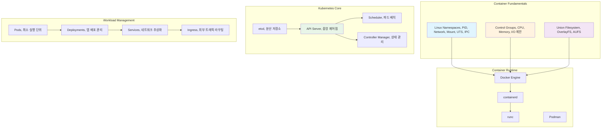

---
tags:
  - FileDescriptor
  - FileSystem
  - IO
  - SystemProgramming
  - VFS
  - deep-study
  - hands-on
  - intermediate
  - 시스템프로그래밍
difficulty: INTERMEDIATE
learning_time: "12-20시간"
main_topic: "시스템 프로그래밍"
priority_score: 4
---

# Chapter 12: 컨테이너와 쿠버네티스 - 현대적 애플리케이션 배포

## 이 장에서 다루는 내용

컨테이너 내부 구조부터 쿠버네티스 운영까지 현대적 인프라의 핵심을 학습합니다.

## 왜 이것을 알아야 하는가?

### 📦 2008년, Docker 없던 시절의 배포 지옥

제가 2008년 첫 직장에서 겪었던 실제 상황입니다:

**금요일 오후 6시: 운영 배포**

```bash
# 개발 환경 (내 맥북)
$ python --version
Python 2.7.3

$ pip list | head -5
Django==1.4.2
requests==1.2.3
mysql-python==1.2.4

$ python manage.py runserver
# 완벽하게 동작! 🎉
```

**운영 서버 (CentOS 5.8)**

```bash
# 운영팀: "Python 업그레이드는 안 됩니다"
$ python --version
Python 2.4.3  # 😱 버전이 다름

$ yum install python-django
# Django 1.0.4 설치됨 (버전 충돌!)

$ python manage.py runserver
# ImportError: No module named 'requests'
# 의존성 지옥의 시작...
```text

**밤 12시: 여전히 안 되는 배포**

```text
개발자: "제 컴퓨터에서는 잘 되는데요?"
운영팀: "운영 서버 환경은 바꿀 수 없어요"
DBA: "MySQL 5.0에서 5.5로 업그레이드? 안 됩니다"
보안팀: "새로운 패키지 설치는 보안 검토 필요해요"
```

**결국 주말 내내 삽질** 😭

### 🚀 Docker 혁명: "Build once, Run anywhere"

2013년 Docker가 등장하면서 모든 게 바뀌었습니다:

**Dockerfile로 환경 표준화**

```dockerfile
# 모든 환경에서 동일한 실행 환경
FROM python:2.7.3
COPY requirements.txt /app/
RUN pip install -r /app/requirements.txt
COPY . /app/
WORKDIR /app
CMD ["python", "manage.py", "runserver"]
```

**한 번 빌드하면 어디서나 실행**

```bash
# 개발자 로컬
$ docker build -t myapp:latest .
$ docker run myapp:latest
# 완벽하게 동작!

# 스테이징 서버
$ docker run myapp:latest
# 똑같이 동작!

# 운영 서버
$ docker run myapp:latest
# 여전히 똑같이 동작! 🎉

# 개발자: "드디어 금요일 6시에 퇴근할 수 있다!" 🍺
```

### 🎭 컨테이너의 마법: 격리의 과학

하지만 컨테이너는 단순한 패키징 도구가 아닙니다. 그 뒤에는 **Linux 커널의 고급 기능들**이 숨어 있습니다:

- **Namespace**: 각 컨테이너가 독립된 세계를 보도록
- **Cgroup**: 리소스 사용량을 통제
- **Union FS**: 레이어 기반 효율적 저장
- **네트워크 격리**: 가상 네트워크 스택

### 🎪 Kubernetes: 컨테이너 오케스트레이션의 왕

컨테이너 하나를 관리하는 건 쉽습니다. 하지만 1000개는?

```bash
# 2015년의 악몽: 수동 컨테이너 관리
$ docker run -d app1
$ docker run -d app2
$ docker run -d app3
...
$ docker run -d app999  # 😱

# 하나가 죽으면?
$ docker ps | grep Exited  # 수십 개 컨테이너가 죽어있음
$ docker start app42 app67 app123 app456...  # 하나씩 재시작

# 트래픽 급증하면?
$ docker run -d app1  # 수동으로 스케일링
$ docker run -d app1
$ docker run -d app1  # 언제까지 수동으로 할 거야? 😭
```

**Kubernetes가 해결해준 것들**:

```yaml
# 선언적 관리: "이렇게 되어야 한다"
apiVersion: apps/v1
kind: Deployment
metadata:
  name: myapp
spec:
  replicas: 10  # 10개 인스턴스 유지
  template:
    spec:
      containers:
      - name: myapp
        image: myapp:latest

# Kubernetes가 자동으로:
# 1. 10개 인스턴스 실행
# 2. 죽은 인스턴스 자동 재시작
# 3. 트래픽에 따른 자동 스케일링
# 4. 무중단 배포
```

## 컨테이너와 Kubernetes의 전체 생태계



## 이 장의 구성

### [12.1 Container 핵심 기술](12-10-container-internals.md)

**"Docker는 어떻게 격리를 만드는가?"**

- 🏠 **Linux Namespace**: 각 컨테이너가 독립된 세계를 보는 방법
- 🎛️ **Control Groups**: CPU, 메모리, I/O 리소스 제한의 원리
- 📁 **Union Filesystem**: 레이어 기반 이미지 시스템의 마법
- 🔧 **Container Runtime**: Docker vs containerd vs Podman의 차이점

**실습**: 컨테이너를 밑바닥부터 만들어보기

```bash
# namespace와 cgroup만으로 간단한 컨테이너 구현
$ sudo unshare -p -f --mount-proc chroot rootfs /bin/bash
# 내가 만든 미니 컨테이너에서 실행 중!
```

### [12.2 Docker 오케스트레이션](12-11-docker-orchestration.md)

**"Dockerfile 최적화부터 Production 배포까지"**

- 🐋 **Docker 아키텍처**: Client-Daemon-Registry 구조 이해
- 📋 **Dockerfile 최적화**: 멀티스테이지 빌드, 레이어 캐싱 활용
- 🌐 **Docker 네트워킹**: bridge, host, overlay 네트워크 심화
- 💾 **Volume과 Storage**: 데이터 영속성과 성능 최적화

**실제 사례**: 이미지 크기 1GB → 50MB 최적화하기

### [12.3 Kubernetes 기본 원리](12-01-kubernetes-fundamentals.md)

**"k8s 클러스터는 어떻게 동작하는가?"**

- 🎯 **Control Plane**: API Server, etcd, Scheduler, Controller Manager
- 💪 **Node Components**: kubelet, kube-proxy, Container Runtime
- 📦 **Workload Resources**: Pod, Deployment, Service, ConfigMap
- 🌐 **네트워킹**: CNI, Service Mesh, Ingress Controller

**실습**: 클러스터 설치부터 첫 애플리케이션 배포까지

### [12.4 Kubernetes 고급 기능](12-20-kubernetes-advanced.md)

**"Production에서 안정적으로 운영하기"**

- 🚀 **배포 전략**: Rolling Update, Blue-Green, Canary 배포
- 📊 **모니터링**: Prometheus + Grafana + AlertManager 구축
- 🛡️ **보안**: RBAC, Network Policy, Pod Security Standards
- 🔧 **트러블슈팅**: Pod 디버깅, 네트워크 문제 해결

### [12.5 Kubernetes 운영](12-12-kubernetes-operations.md)

**"대규모 클러스터 운영 노하우"**

- ⚖️ **Auto Scaling**: HPA, VPA, Cluster Autoscaler 완전 정복
- 📈 **Service Mesh**: Istio를 활용한 마이크로서비스 관리
- 🗃️ **Stateful Applications**: 데이터베이스, 메시지큐 운영
- 🔄 **GitOps**: ArgoCD를 활용한 선언적 배포

## 🚀 실습 프로젝트: Container & Kubernetes Lab

### Week 1: 컨테이너 마스터하기

```bash
# 미션 1: 컨테이너 밑바닥부터 구현
$ git clone container-lab/build-your-own-container
$ make build
# 목표: namespace, cgroup, chroot만으로 컨테이너 구현

# 미션 2: Docker 최적화 챌린지
$ docker build -t myapp:fat .   # Before: 1.2GB
$ docker build -t myapp:slim .  # After: 45MB
# 목표: 이미지 크기 95% 감소
```

### Week 2: Kubernetes 클러스터 구축

```bash
# 로컬 k8s 클러스터 설치 (3가지 방법 비교)
$ kind create cluster --name dev-cluster
$ minikube start --driver=docker
$ k3s server --write-kubeconfig-mode 644

# 첫 애플리케이션 배포
$ kubectl create deployment hello-k8s --image=nginx
$ kubectl expose deployment hello-k8s --type=LoadBalancer --port=80
```

### Week 3: Production 운영 시뮬레이션

```bash
# 장애 상황 시뮬레이션
$ kubectl delete node worker-1  # 노드 장애
$ kubectl scale deployment myapp --replicas=0  # 전체 서비스 다운
$ kubectl cordon worker-2  # 노드 유지보수

# 복구 프로세스 실습
$ kubectl get events --sort-by=.metadata.creationTimestamp
$ kubectl logs -f deployment/myapp
$ kubectl describe pod myapp-xxx-yyy
```

### Week 4: 고급 패턴 적용

```yaml
# Canary 배포 구현
apiVersion: argoproj.io/v1alpha1
kind: Rollout
metadata:
  name: myapp-rollout
spec:
  strategy:
    canary:
      steps:
      - setWeight: 10  # 10% 트래픽
      - pause: {duration: 30s}
      - setWeight: 50  # 50% 트래픽
      - pause: {duration: 30s}
      - setWeight: 100 # 100% 트래픽
```

## 💡 Container & Kubernetes의 핵심 원리들

### 1. 격리는 환상이다

```bash
# 컨테이너는 격리되어 있지만...
$ docker run -it ubuntu /bin/bash
root@container:/# ps aux  # 호스트의 프로세스는 안 보임

# 하지만 실제로는 같은 커널 공유
$ docker run --privileged -v /:/host ubuntu
root@container:/# chroot /host
root@host:/# ps aux  # 이제 호스트 프로세스 보임!
```

### 2. 이미지는 읽기 전용이다

```bash
# 컨테이너에서 파일 수정해도...
$ docker run -it ubuntu
root@container:/# echo "hello" > /tmp/test.txt
root@container:/# exit

$ docker run -it ubuntu
root@container:/# cat /tmp/test.txt  # 파일이 없음!
# 각 컨테이너는 새로운 쓰기 가능 레이어를 가짐
```

### 3. Kubernetes는 원하는 상태를 유지한다

```yaml
# 선언: "replica 3개를 원한다"
spec:
  replicas: 3

# Kubernetes 내부:
# 1. 현재 상태 확인 (2개 실행 중)
# 2. 차이 계산 (1개 부족)
# 3. 액션 실행 (1개 추가 생성)
# 4. 지속적 모니터링
```

## 🏗️ 컨테이너 시대의 아키텍처 변화

### Before: Monolithic + Physical Servers

```text
┌─────────────────────────────┐
│     Physical Server         │
│  ┌───────────────────────┐  │
│  │    Monolithic App     │  │
│  │  ┌─────┬─────┬─────┐  │  │
│  │  │ Web │ API │ DB  │  │  │
│  │  └─────┴─────┴─────┘  │  │
│  └───────────────────────┘  │
└─────────────────────────────┘

문제점:
- 하나 장애시 전체 다운
- 스케일링 어려움
- 배포 위험성 높음
- 리소스 낭비
```

### After: Microservices + Container + Kubernetes

```text
┌─────────────────────────────────────────────────┐
│              Kubernetes Cluster                │
│  ┌──────┐  ┌──────┐  ┌──────┐  ┌──────┐        │
│  │ Pod  │  │ Pod  │  │ Pod  │  │ Pod  │        │
│  │ Web  │  │ API  │  │ Auth │  │ DB   │        │
│  └──────┘  └──────┘  └──────┘  └──────┘        │
│     │         │         │         │           │
│  ┌─────────────────────────────────────────┐   │
│  │         Service Mesh Network        │   │
│  └─────────────────────────────────────────┘   │
└─────────────────────────────────────────────────┘

장점:
- 독립적 장애 격리
- 개별 서비스 스케일링
- 무중단 배포 가능
- 리소스 효율성 극대화
```

## 🎯 이 장을 마스터하면

✅ **컨테이너 원리 이해**: Linux namespace, cgroup의 동작 원리를 깊이 있게 알 수 있습니다
✅ **Docker 최적화**: 이미지 크기 최적화, 보안 강화, 성능 튜닝을 할 수 있습니다
✅ **Kubernetes 운영**: Production 클러스터를 안정적으로 운영할 수 있습니다
✅ **현대 DevOps**: CI/CD 파이프라인과 GitOps 워크플로우를 구축할 수 있습니다

## 실습 환경 준비

이 장의 실습을 위해 필요한 도구들:

```bash
# Docker 설치 (Ubuntu/Debian)
$ curl -fsSL https://get.docker.com -o get-docker.sh
$ sudo sh get-docker.sh
$ sudo usermod -aG docker $USER

# kubectl 설치
$ curl -LO "https://dl.k8s.io/release/$(curl -L -s https://dl.k8s.io/release/stable.txt)/bin/linux/amd64/kubectl"
$ sudo install -o root -g root -m 0755 kubectl /usr/local/bin/kubectl

# Kind (Kubernetes in Docker) 설치
$ curl -Lo ./kind https://kind.sigs.k8s.io/dl/v0.20.0/kind-linux-amd64
$ chmod +x ./kind
$ sudo mv ./kind /usr/local/bin/kind

# 로컬 클러스터 생성
$ kind create cluster --name lab-cluster
$ kubectl cluster-info
```

## Container & Kubernetes 히어로들의 이야기

### Solomon Hykes - Docker 창시자
>
> **"Docker is about making it easier to get great software from the developer's laptop to the server"**

2010년, 프랑스의 작은 PaaS 회사 dotCloud에서 내부 도구로 시작된 Docker가 세상을 바꿨습니다.

### Brendan Burns - Kubernetes 공동 창시자
>
> **"Kubernetes is the Linux of the cloud"**

Google에서 Borg 시스템을 운영하던 경험을 바탕으로 오픈소스 컨테이너 오케스트레이터를 만들었습니다.

### Joe Beda - Kubernetes 공동 창시자
>
> **"We wanted to democratize the same infrastructure tooling that Google uses internally"**

Google의 10년간 컨테이너 운영 노하우를 모든 개발자가 쓸 수 있게 만들었습니다.

## 흥미로운 사실들 🤓

### Docker의 이름 유래

Docker = "Dock Worker" (항구 노동자)
컨테이너를 효율적으로 옮기는 항구 노동자에서 영감을 받았습니다.

### Kubernetes의 이름 유래

Kubernetes = 그리스어로 "키잡이, 조타수"
컨테이너라는 배를 조종하는 선장의 의미입니다. (그래서 로고가 배 키 모양 ⚓)

### 컨테이너는 새로운 개념이 아니다

- 1979년: Unix chroot (파일시스템 격리)
- 2000년: FreeBSD Jails (완전한 격리)
- 2005년: Solaris Zones
- 2008년: LXC (Linux Containers)
- 2013년: Docker (사용자 친화적 인터페이스)

## 다음 단계

### 기반 지식

- [Chapter 3: Virtual Memory](../chapter-03-memory-system/index.md) - 컨테이너 격리의 기반이 되는 메모리 가상화
- [Chapter 4: Process & Thread](../chapter-01-process-thread/index.md) - 프로세스 격리와 네임스페이스 이해
- [Chapter 7: Network Programming](../chapter-07-network-programming/index.md) - 컨테이너 네트워킹의 기반 원리

### 연관 주제

- [Chapter 11: Performance Optimization](../chapter-11-performance-optimization/index.md) - 컨테이너와 Kubernetes 성능 최적화
- [Chapter 12: Observability & Debugging](../chapter-12-observability-debugging/index.md) - 컨테이너 환경 모니터링과 디버깅
- [Chapter 15: Security Engineering](../chapter-17-security-engineering/index.md) - 컨테이너 보안과 Zero Trust 아키텍처

### 고급 주제

- [Chapter 14: Distributed Systems](../chapter-14-distributed-systems/index.md) - 마이크로서비스와 분산 시스템 설계
- [Chapter 16: System Design Patterns](../chapter-16-system-design-patterns/index.md) - 클라우드 네이티브 아키텍처 패턴

준비되셨나요? [12.1 Container 핵심 기술](12-10-container-internals.md)에서 Linux 커널 레벨부터 컨테이너의 동작 원리를 파헤쳐보겠습니다.

"개발 환경과 운영 환경이 다르다"는 변명은 이제 그만! 컨테이너로 **"Build once, Run anywhere"**를 실현해봅시다!

## 📚 관련 문서

### 📖 현재 문서 정보

- **난이도**: INTERMEDIATE
- **주제**: 시스템 프로그래밍
- **예상 시간**: 12-20시간

### 🎯 학습 경로

- [📚 INTERMEDIATE 레벨 전체 보기](../learning-paths/intermediate/)
- [🏠 메인 학습 경로](../learning-paths/)
- [📋 전체 가이드 목록](../README.md)

### 📂 같은 챕터 (chapter-12-container-kubernetes)

- [Chapter 12-01: Kubernetes Fundamentals](./12-01-kubernetes-fundamentals.md)
- [Chapter 12-10: Container Internals](./12-10-container-internals.md)
- [Chapter 12-11: Docker Orchestration](./12-11-docker-orchestration.md)
- [Chapter 12-12: Kubernetes Operations](./12-12-kubernetes-operations.md)
- [Chapter 12-20: Kubernetes Advanced](./12-20-kubernetes-advanced.md)

### 🏷️ 관련 키워드

`FileDescriptor`, `VFS`, `IO`, `FileSystem`, `SystemProgramming`

### ⏭️ 다음 단계 가이드

- 실무 적용을 염두에 두고 프로젝트에 적용해보세요
- 관련 도구들을 직접 사용해보는 것이 중요합니다
