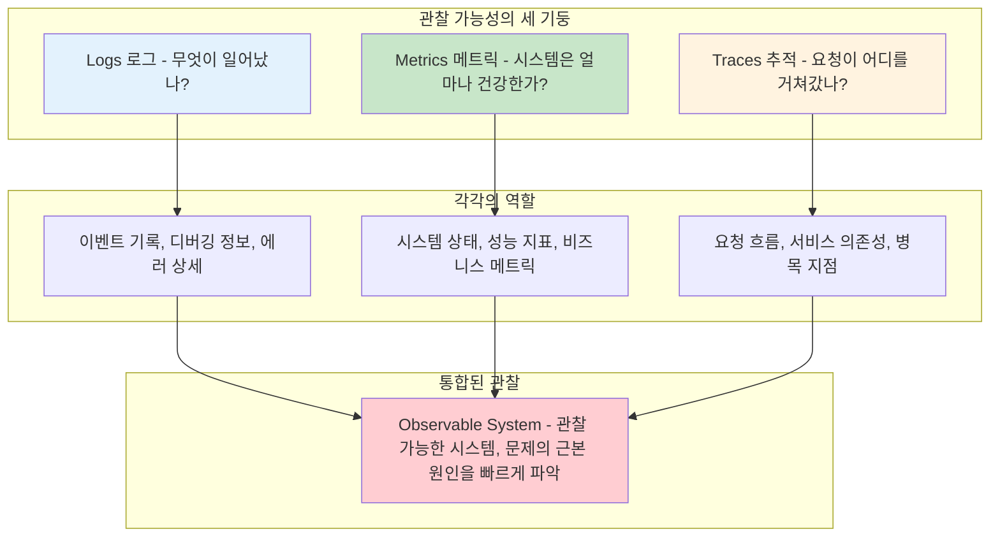

---
tags:
  - Observability
  - Logging
  - Monitoring
  - Foundations
  - Guide
---

# 13.1A 관찰 가능성 기초 - 시스템을 보는 눈

## 서론: 2023년 12월, 새벽 3시의 장애 추적

크리스마스 이브 새벽 3시, 우리 e-커머스 플랫폼에서 갑작스러운 장애가 발생했습니다. 고객들의 주문이 처리되지 않고 있었지만, 정작 어디서 문제가 발생했는지 찾는 데만 2시간이 걸렸습니다.

### 🔥 12월 24일 새벽 3:00 - 침묵하는 시스템

```bash
# 상황: 갑작스러운 주문 처리 중단
📊 주문 성공률: 95% → 12% (급락)
💳 결제 실패율: 5% → 78% (폭증)
📱 고객 컴플레인: 0건 → 247건 (30분 내)

# 하지만 우리가 본 것은...
$ systemctl status payment-service
● payment-service.service - Payment Processing Service
   Loaded: loaded (/etc/systemd/system/payment-service.service; enabled)
   Active: active (running) since Dec 24 02:45:12 2023
   ...

$ curl http://payment-service:8080/health
HTTP/1.1 200 OK
{"status": "healthy", "timestamp": "2023-12-24T03:15:42Z"}

# 😱 모든 서비스가 "정상"이라고 말하고 있었습니다!
```

**새벽 3:30 - 수동 로그 파고들기 시작**

```bash
# Payment Service 로그를 일일이 확인
$ tail -f /var/log/payment-service/app.log
2023-12-24 03:14:23 INFO  PaymentController - Processing payment for order 12345
2023-12-24 03:14:24 INFO  PaymentController - Processing payment for order 12346
2023-12-24 03:14:25 INFO  PaymentController - Processing payment for order 12347
# ... 정상적인 로그만 계속 출력

# Database 연결 로그 확인
$ tail -f /var/log/payment-service/db.log
2023-12-24 03:14:23 DEBUG Connection pool: 18/20 active connections
2023-12-24 03:14:24 DEBUG Connection pool: 19/20 active connections  
2023-12-24 03:14:25 DEBUG Connection pool: 20/20 active connections
2023-12-24 03:14:26 ERROR Connection pool exhausted! Waiting for available connection...
2023-12-24 03:14:46 ERROR Connection timeout after 20 seconds
2023-12-24 03:14:46 ERROR java.sql.SQLException: Connection is not available

# 🎯 발견! 커넥션 풀 고갈이 원인이었습니다!
```

**새벽 5:00 - 문제 해결 후 반성**

문제를 해결한 후, 우리는 중요한 깨달음을 얻었습니다:

- **로그가 분산되어 있어서 전체 상황 파악이 어려웠음**
- **메트릭이 없어서 커넥션 풀 상태를 몰랐음**
- **알림 시스템이 없어서 문제를 늦게 발견했음**
- **디버깅에 필요한 정보가 로그에 부족했음**

이 경험으로 우리는 **체계적인 관찰 가능성(Observability) 시스템**을 구축하게 되었습니다.

## 🔍 관찰 가능성(Observability)의 세 기둥

### 📊 Logs, Metrics, Traces의 황금 삼각형



### 1. 로그(Logs) - 무엇이 일어났는가?

로그는 시스템에서 발생하는 이벤트들의 기록입니다:

**특징:**

- **이벤트 중심**: 특정 시점에 무엇이 일어났는지 기록
- **텍스트 형태**: 사람이 읽기 쉬운 형태로 저장
- **디버깅 정보**: 에러 메시지, 스택 트레이스, 실행 흐름
- **컨텍스트 보존**: 요청 ID, 사용자 정보 등 문맥 정보

**활용:**

- 문제 발생 후 원인 분석
- 비즈니스 로직 추적
- 보안 이벤트 감지
- 규정 준수를 위한 감사 로그

### 2. 메트릭(Metrics) - 시스템은 얼마나 건강한가?

메트릭은 시스템의 수치화된 상태 정보입니다:

**특징:**

- **숫자 중심**: 측정 가능한 수치 데이터
- **시계열 데이터**: 시간에 따른 변화 추적
- **집계 가능**: 평균, 백분위수, 합계 등 계산
- **효율적 저장**: 적은 저장 공간으로 대량 데이터 처리

**활용:**

- 시스템 성능 모니터링
- 자동 알림 및 스케일링
- 용량 계획 및 예측
- SLA/SLO 모니터링

### 3. 추적(Traces) - 요청이 어디를 거쳐갔나?

추적은 분산 시스템에서 단일 요청의 전체 여정을 기록합니다:

**특징:**

- **요청 중심**: 하나의 요청이 여러 서비스를 거치는 전체 흐름
- **계층적 구조**: 서비스 호출의 부모-자식 관계
- **타이밍 정보**: 각 서비스별 처리 시간과 대기 시간
- **의존성 시각화**: 서비스 간 호출 관계와 병목 지점

**활용:**

- 마이크로서비스 디버깅
- 성능 병목 지점 분석
- 서비스 의존성 파악
- 장애 영향 범위 분석

## 🎯 관찰 가능성 설계 원칙

### 1. 일관성 (Consistency)

모든 시스템 컴포넌트에서 동일한 방식으로 관찰 데이터를 생성해야 합니다:

```bash
✅ 일관된 접근:
- 로그 포맷 통일 (JSON 구조화)
- 메트릭 명명 규칙 통일
- 추적 컨텍스트 전파 방식 통일
- 에러 코드 체계 통일

❌ 일관성 부족:
- 서비스마다 다른 로그 포맷
- 중복되거나 모호한 메트릭 이름
- 추적 정보 누락 구간
- 에러 처리 방식 불일치
```

### 2. 문맥 보존 (Context Preservation)

요청의 전체 생명주기 동안 필요한 문맥 정보를 유지해야 합니다:

```bash
🔗 보존해야 할 문맥:
- 요청 ID (Request/Trace ID)
- 사용자 식별 정보
- 세션 정보
- A/B 테스트 변형
- 지역 정보 (Region/AZ)
- 서비스 버전
```

### 3. 액션 가능성 (Actionability)

관찰 데이터는 실제 문제 해결로 이어져야 합니다:

```bash
💡 액션 가능한 관찰 데이터:
- 문제의 근본 원인을 찾는 데 도움
- 해결 방법에 대한 힌트 제공
- 비즈니스 영향도 측정 가능
- 자동화된 대응 트리거 가능

⚠️ 액션 불가능한 데이터:
- 의미 없는 DEBUG 로그 스팸
- 임계값 없는 단순 수집 메트릭
- 컨텍스트 없는 에러 메시지
- 비즈니스 영향을 알 수 없는 알림
```

### 4. 성능 고려 (Performance Consideration)

관찰 가능성은 시스템 성능에 최소한의 영향을 주어야 합니다:

```bash
⚡ 성능 최적화 전략:
- 비동기 로그 전송
- 샘플링을 통한 추적 오버헤드 제어
- 메트릭 집계 최적화
- 백프레셔 처리 메커니즘

📊 성능 영향 측정:
- 레이턴시 증가 < 5%
- 메모리 사용량 증가 < 10%
- CPU 사용량 증가 < 5%
- 네트워크 오버헤드 모니터링
```

## 핵심 요점

### 1. 관찰 가능성의 세 기둥 이해

관찰 가능성은 로그, 메트릭, 추적이 유기적으로 결합되어 완성됩니다.

### 2. 실제 장애 경험의 교훈

체계적인 관찰 시스템이 없으면 간단한 문제도 오랜 시간이 걸려 해결됩니다.

### 3. 설계 원칙의 중요성

일관성, 문맥 보존, 액션 가능성, 성능 고려가 성공적인 관찰 시스템의 핵심입니다.

---

**다음**: [13.1B 구조화된 로깅](01b-structured-logging.md)에서 검색 가능하고 분석하기 쉬운 로그 시스템 구축을 학습합니다.
