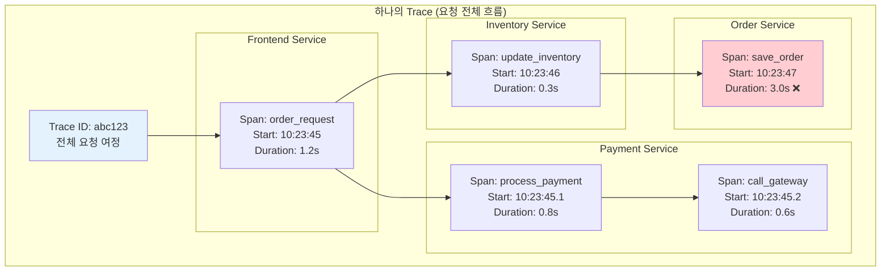

---
tags:
  - Observability
  - DistributedTracing
  - Jaeger
  - OpenTelemetry
  - Microservices
  - Guide
---

# 13.2 분산 추적 - 마이크로서비스 미로에서 길찾기

## 서론: 2024년 3월, 고객의 주문이 사라진 미스터리

우리 e-커머스 플랫폼에서 발생한 기묘한 현상이었습니다. 고객이 주문 버튼을 누르면 "주문이 완료되었습니다"라는 메시지가 나오지만, 실제로는 주문이 처리되지 않는 경우가 간헐적으로 발생했습니다.

### 🕵️ 3월 15일 오전 10:00 - 사라진 주문의 미스터리

```bash
# 고객 리포트: "주문했는데 내 계정에 안 보여요"
고객 ID: user_12345
주문 시간: 2024-03-15 10:23:45
주문 번호: ORD-2024-0315-001

# 각 서비스 로그를 개별 확인...
```

**Frontend Service 로그:**

```bash
[10:23:45] INFO  OrderController - Order request received
[10:23:45] INFO  OrderController - Calling payment service...
[10:23:46] INFO  OrderController - Payment successful, proceeding...
[10:23:46] INFO  OrderController - Order completed successfully
[10:23:46] INFO  OrderController - Response sent to client: {"status": "success", "orderId": "ORD-2024-0315-001"}
```

**Payment Service 로그:**

```bash
[10:23:45] INFO  PaymentProcessor - Processing payment for user_12345
[10:23:45] INFO  PaymentProcessor - Amount: $199.99, Method: credit_card
[10:23:46] INFO  PaymentProcessor - Payment gateway response: SUCCESS
[10:23:46] INFO  PaymentProcessor - Payment completed, notifying inventory...
```

**Inventory Service 로그:**

```bash
[10:23:46] INFO  InventoryManager - Received inventory update request
[10:23:46] INFO  InventoryManager - Product: laptop_model_x, Quantity: 1
[10:23:46] INFO  InventoryManager - Inventory updated successfully
[10:23:46] INFO  InventoryManager - Calling order processing service...
```

**Order Processing Service 로그:**

```bash
[10:23:47] ERROR OrderProcessor - Database connection timeout
[10:23:47] ERROR OrderProcessor - Failed to save order: Connection timed out after 30000ms
[10:23:47] WARN  OrderProcessor - Retrying order save... (attempt 1/3)
[10:23:48] ERROR OrderProcessor - Database connection timeout
[10:23:48] ERROR OrderProcessor - Retrying order save... (attempt 2/3)  
[10:23:49] ERROR OrderProcessor - Database connection timeout
[10:23:49] ERROR OrderProcessor - Order save failed after 3 attempts
[10:23:49] ERROR OrderProcessor - 🔥 Order ORD-2024-0315-001 LOST!
```

**문제 발견까지 걸린 시간: 4시간**

각 서비스의 로그가 분산되어 있어서, 전체 요청 흐름을 파악하는 데 엄청난 시간이 걸렸습니다. 이 경험으로 우리는 **분산 추적(Distributed Tracing)**의 필요성을 절감했습니다.

## 🔍 Distributed Tracing의 핵심 개념

### 📊 Trace, Span, Context의 이해



### 🏗️ OpenTelemetry 기반 분산 추적 구현

```python
from opentelemetry import trace
from opentelemetry.exporter.jaeger.thrift import JaegerExporter
from opentelemetry.sdk.trace import TracerProvider
from opentelemetry.sdk.trace.export import BatchSpanProcessor
from opentelemetry.instrumentation.requests import RequestsInstrumentor
from opentelemetry.propagate import inject, extract
from opentelemetry.trace.propagation.tracecontext import TraceContextTextMapPropagator

import requests
import time
import uuid
import threading
from typing import Dict, Any, Optional
from dataclasses import dataclass
from datetime import datetime

# OpenTelemetry 설정
def setup_tracing(service_name: str, jaeger_endpoint: str = "http://localhost:14268/api/traces"):
    """분산 추적 설정"""
    # Trace Provider 설정
    trace.set_tracer_provider(TracerProvider())
    tracer_provider = trace.get_tracer_provider()
    
    # Jaeger Exporter 설정
    jaeger_exporter = JaegerExporter(
        agent_host_name="localhost",
        agent_port=6831,
        collector_endpoint=jaeger_endpoint,
    )
    
    # Span Processor 추가
    span_processor = BatchSpanProcessor(jaeger_exporter)
    tracer_provider.add_span_processor(span_processor)
    
    # HTTP 요청 자동 계측
    RequestsInstrumentor().instrument()
    
    # Tracer 반환
    return trace.get_tracer(service_name)

@dataclass
class TraceContext:
    """추적 컨텍스트"""
    trace_id: str
    span_id: str
    parent_span_id: Optional[str] = None
    baggage: Dict[str, str] = None

class DistributedTracer:
    """분산 추적기"""
    
    def __init__(self, service_name: str):
        self.service_name = service_name
        self.tracer = setup_tracing(service_name)
        self.propagator = TraceContextTextMapPropagator()
    
    def start_trace(self, operation_name: str, **attributes):
        """새로운 추적 시작"""
        span = self.tracer.start_span(operation_name)
        
        # 기본 속성 설정
        span.set_attribute("service.name", self.service_name)
        span.set_attribute("service.version", "1.0.0")
        
        # 커스텀 속성 추가
        for key, value in attributes.items():
            span.set_attribute(key, str(value))
        
        return span
    
    def create_child_span(self, parent_span, operation_name: str, **attributes):
        """자식 Span 생성"""
        with trace.use_span(parent_span):
            child_span = self.tracer.start_span(operation_name)
            
            # 속성 설정
            for key, value in attributes.items():
                child_span.set_attribute(key, str(value))
            
            return child_span
    
    def inject_context(self, span, carrier: Dict[str, str]):
        """컨텍스트를 HTTP 헤더에 주입"""
        with trace.use_span(span):
            inject(carrier)
        return carrier
    
    def extract_context(self, carrier: Dict[str, str]):
        """HTTP 헤더에서 컨텍스트 추출"""
        return extract(carrier)

# Frontend Service (요청 시작점)
class FrontendService:
    """프론트엔드 서비스"""
    
    def __init__(self):
        self.tracer = DistributedTracer("frontend-service")
        self.payment_service_url = "http://payment-service:8080"
        self.session = requests.Session()
    
    def process_order(self, user_id: str, items: list, payment_method: str):
        """주문 처리 (추적 시작점)"""
        # 루트 Span 시작
        root_span = self.tracer.start_trace(
            "process_order",
            user_id=user_id,
            items_count=len(items),
            payment_method=payment_method,
            http_method="POST",
            http_url="/api/orders"
        )
        
        try:
            with trace.use_span(root_span):
                print(f"🌟 [FRONTEND] Starting order processing for user {user_id}")
                
                # 1. 주문 유효성 검사
                validation_span = self.tracer.create_child_span(
                    root_span, 
                    "validate_order",
                    validation_type="order_items"
                )
                
                with trace.use_span(validation_span):
                    self._validate_order(items)
                    validation_span.set_attribute("validation_result", "success")
                validation_span.end()
                
                # 2. 결제 서비스 호출
                payment_span = self.tracer.create_child_span(
                    root_span,
                    "call_payment_service",
                    downstream_service="payment-service",
                    payment_method=payment_method
                )
                
                with trace.use_span(payment_span):
                    payment_result = self._call_payment_service(
                        user_id, items, payment_method, payment_span
                    )
                    payment_span.set_attribute("payment_result", payment_result["status"])
                payment_span.end()
                
                if payment_result["status"] != "success":
                    root_span.set_attribute("error", True)
                    root_span.set_attribute("error_message", payment_result.get("error"))
                    raise PaymentException(payment_result.get("error", "Payment failed"))
                
                # 3. 주문 완료 처리
                completion_span = self.tracer.create_child_span(
                    root_span,
                    "complete_order",
                    order_id=payment_result["order_id"]
                )
                
                with trace.use_span(completion_span):
                    order_result = self._complete_order(payment_result["order_id"])
                    completion_span.set_attribute("completion_result", "success")
                completion_span.end()
                
                root_span.set_attribute("order_id", order_result["order_id"])
                root_span.set_attribute("total_amount", sum(item["price"] for item in items))
                
                print(f"✅ [FRONTEND] Order completed: {order_result['order_id']}")
                
                return {
                    "status": "success",
                    "order_id": order_result["order_id"],
                    "trace_id": trace.get_current_span().get_span_context().trace_id
                }
                
        except Exception as e:
            root_span.record_exception(e)
            root_span.set_status(trace.Status(trace.StatusCode.ERROR, str(e)))
            print(f"❌ [FRONTEND] Order failed: {e}")
            raise
        finally:
            root_span.end()
    
    def _validate_order(self, items: list):
        """주문 유효성 검사"""
        time.sleep(0.1)  # 검사 시간 시뮬레이션
        
        if not items:
            raise ValueError("Empty order")
        
        for item in items:
            if item.get("price", 0) <= 0:
                raise ValueError(f"Invalid price for item {item.get('id')}")
    
    def _call_payment_service(self, user_id: str, items: list, payment_method: str, span):
        """결제 서비스 호출"""
        # 컨텍스트를 HTTP 헤더에 주입
        headers = {"Content-Type": "application/json"}
        self.tracer.inject_context(span, headers)
        
        payload = {
            "user_id": user_id,
            "items": items,
            "payment_method": payment_method,
            "total_amount": sum(item["price"] for item in items)
        }
        
        try:
            print(f"💳 [FRONTEND] Calling payment service...")
            
            # 실제로는 HTTP 요청을 보냄
            # response = self.session.post(f"{self.payment_service_url}/process", 
            #                            json=payload, headers=headers, timeout=30)
            
            # 시뮬레이션을 위한 결제 서비스 직접 호출
            payment_service = PaymentService()
            return payment_service.process_payment_request(headers, payload)
            
        except requests.exceptions.Timeout:
            span.set_attribute("error", True)
            span.set_attribute("error_type", "timeout")
            raise PaymentException("Payment service timeout")
        except Exception as e:
            span.set_attribute("error", True)
            span.set_attribute("error_type", type(e).__name__)
            raise PaymentException(f"Payment service error: {e}")
    
    def _complete_order(self, order_id: str):
        """주문 완료 처리"""
        time.sleep(0.05)  # 완료 처리 시간
        return {"order_id": order_id, "status": "completed"}

# Payment Service (중간 서비스)
class PaymentService:
    """결제 서비스"""
    
    def __init__(self):
        self.tracer = DistributedTracer("payment-service")
        self.inventory_service_url = "http://inventory-service:8080"
        self.session = requests.Session()
    
    def process_payment_request(self, headers: Dict[str, str], payload: Dict[str, Any]):
        """결제 요청 처리"""
        # 상위 컨텍스트 추출
        context = self.tracer.extract_context(headers)
        
        # 새 Span 시작 (상위 컨텍스트 연결)
        with trace.use_span(context):
            payment_span = self.tracer.tracer.start_span(
                "process_payment",
                attributes={
                    "user_id": payload["user_id"],
                    "payment_method": payload["payment_method"],
                    "amount": payload["total_amount"]
                }
            )
        
        try:
            with trace.use_span(payment_span):
                print(f"💰 [PAYMENT] Processing payment for user {payload['user_id']}")
                
                # 1. 결제 정보 검증
                validation_span = self.tracer.create_child_span(
                    payment_span,
                    "validate_payment_info",
                    payment_method=payload["payment_method"]
                )
                
                with trace.use_span(validation_span):
                    self._validate_payment_info(payload)
                validation_span.end()
                
                # 2. 결제 게이트웨이 호출
                gateway_span = self.tracer.create_child_span(
                    payment_span,
                    "call_payment_gateway",
                    gateway="stripe",
                    amount=payload["total_amount"]
                )
                
                with trace.use_span(gateway_span):
                    transaction_id = self._call_payment_gateway(payload)
                    gateway_span.set_attribute("transaction_id", transaction_id)
                gateway_span.end()
                
                # 3. 재고 업데이트 요청
                inventory_span = self.tracer.create_child_span(
                    payment_span,
                    "update_inventory",
                    downstream_service="inventory-service"
                )
                
                order_id = f"ORD-{uuid.uuid4().hex[:8].upper()}"
                
                with trace.use_span(inventory_span):
                    inventory_result = self._update_inventory(
                        payload["items"], order_id, inventory_span
                    )
                    inventory_span.set_attribute("inventory_result", inventory_result["status"])
                inventory_span.end()
                
                payment_span.set_attribute("transaction_id", transaction_id)
                payment_span.set_attribute("order_id", order_id)
                
                print(f"✅ [PAYMENT] Payment completed: {transaction_id}")
                
                return {
                    "status": "success",
                    "order_id": order_id,
                    "transaction_id": transaction_id
                }
                
        except Exception as e:
            payment_span.record_exception(e)
            payment_span.set_status(trace.Status(trace.StatusCode.ERROR, str(e)))
            print(f"❌ [PAYMENT] Payment failed: {e}")
            return {"status": "failed", "error": str(e)}
        finally:
            payment_span.end()
    
    def _validate_payment_info(self, payload: Dict[str, Any]):
        """결제 정보 검증"""
        time.sleep(0.05)
        
        if not payload.get("payment_method"):
            raise ValueError("Payment method required")
        
        if payload.get("total_amount", 0) <= 0:
            raise ValueError("Invalid payment amount")
    
    def _call_payment_gateway(self, payload: Dict[str, Any]):
        """결제 게이트웨이 호출"""
        time.sleep(0.3)  # 게이트웨이 호출 시간 시뮬레이션
        
        # 5% 확률로 결제 실패
        import random
        if random.random() < 0.05:
            raise PaymentGatewayException("Payment declined by gateway")
        
        return f"TXN-{uuid.uuid4().hex[:12].upper()}"
    
    def _update_inventory(self, items: list, order_id: str, span):
        """재고 업데이트 요청"""
        headers = {"Content-Type": "application/json"}
        self.tracer.inject_context(span, headers)
        
        payload = {
            "order_id": order_id,
            "items": items
        }
        
        # 시뮬레이션을 위한 재고 서비스 직접 호출
        inventory_service = InventoryService()
        return inventory_service.update_inventory_request(headers, payload)

# Inventory Service (중간 서비스)  
class InventoryService:
    """재고 서비스"""
    
    def __init__(self):
        self.tracer = DistributedTracer("inventory-service")
        self.order_service_url = "http://order-service:8080"
        self.session = requests.Session()
    
    def update_inventory_request(self, headers: Dict[str, str], payload: Dict[str, Any]):
        """재고 업데이트 요청 처리"""
        context = self.tracer.extract_context(headers)
        
        with trace.use_span(context):
            inventory_span = self.tracer.tracer.start_span(
                "update_inventory",
                attributes={
                    "order_id": payload["order_id"],
                    "items_count": len(payload["items"])
                }
            )
        
        try:
            with trace.use_span(inventory_span):
                print(f"📦 [INVENTORY] Updating inventory for order {payload['order_id']}")
                
                # 1. 재고 확인
                check_span = self.tracer.create_child_span(
                    inventory_span,
                    "check_inventory",
                    items_count=len(payload["items"])
                )
                
                with trace.use_span(check_span):
                    self._check_inventory_availability(payload["items"])
                    check_span.set_attribute("availability_check", "passed")
                check_span.end()
                
                # 2. 재고 차감
                update_span = self.tracer.create_child_span(
                    inventory_span,
                    "deduct_inventory"
                )
                
                with trace.use_span(update_span):
                    self._deduct_inventory(payload["items"])
                update_span.end()
                
                # 3. 주문 서비스에 알림
                notification_span = self.tracer.create_child_span(
                    inventory_span,
                    "notify_order_service",
                    downstream_service="order-service"
                )
                
                with trace.use_span(notification_span):
                    order_result = self._notify_order_service(payload, notification_span)
                    notification_span.set_attribute("notification_result", order_result["status"])
                notification_span.end()
                
                print(f"✅ [INVENTORY] Inventory updated for order {payload['order_id']}")
                
                return {"status": "success"}
                
        except Exception as e:
            inventory_span.record_exception(e)
            inventory_span.set_status(trace.Status(trace.StatusCode.ERROR, str(e)))
            print(f"❌ [INVENTORY] Inventory update failed: {e}")
            return {"status": "failed", "error": str(e)}
        finally:
            inventory_span.end()
    
    def _check_inventory_availability(self, items: list):
        """재고 가용성 확인"""
        time.sleep(0.1)
        
        # 10% 확률로 재고 부족
        import random
        if random.random() < 0.1:
            raise InventoryException("Insufficient inventory")
    
    def _deduct_inventory(self, items: list):
        """재고 차감"""
        time.sleep(0.05)
        # 재고 차감 로직 시뮬레이션
    
    def _notify_order_service(self, payload: Dict[str, Any], span):
        """주문 서비스에 알림"""
        headers = {"Content-Type": "application/json"}
        self.tracer.inject_context(span, headers)
        
        # 시뮬레이션을 위한 주문 서비스 직접 호출
        order_service = OrderService()
        return order_service.finalize_order_request(headers, payload)

# Order Service (최종 서비스 - 문제 발생 지점)
class OrderService:
    """주문 서비스"""
    
    def __init__(self):
        self.tracer = DistributedTracer("order-service")
    
    def finalize_order_request(self, headers: Dict[str, str], payload: Dict[str, Any]):
        """주문 최종 처리"""
        context = self.tracer.extract_context(headers)
        
        with trace.use_span(context):
            order_span = self.tracer.tracer.start_span(
                "finalize_order",
                attributes={
                    "order_id": payload["order_id"],
                    "items_count": len(payload["items"])
                }
            )
        
        try:
            with trace.use_span(order_span):
                print(f"📝 [ORDER] Finalizing order {payload['order_id']}")
                
                # 1. 데이터베이스 연결
                db_span = self.tracer.create_child_span(
                    order_span,
                    "database_connection",
                    database="order_db"
                )
                
                with trace.use_span(db_span):
                    self._connect_to_database(db_span)
                db_span.end()
                
                # 2. 주문 저장 (문제 발생 지점)
                save_span = self.tracer.create_child_span(
                    order_span,
                    "save_order_to_db",
                    operation="INSERT"
                )
                
                with trace.use_span(save_span):
                    self._save_order_to_database(payload, save_span)
                    save_span.set_attribute("save_result", "success")
                save_span.end()
                
                # 3. 주문 확인 이메일 발송
                email_span = self.tracer.create_child_span(
                    order_span,
                    "send_confirmation_email"
                )
                
                with trace.use_span(email_span):
                    self._send_confirmation_email(payload["order_id"])
                email_span.end()
                
                print(f"✅ [ORDER] Order finalized: {payload['order_id']}")
                
                return {"status": "success", "order_id": payload["order_id"]}
                
        except Exception as e:
            order_span.record_exception(e)
            order_span.set_status(trace.Status(trace.StatusCode.ERROR, str(e)))
            print(f"❌ [ORDER] Order finalization failed: {e}")
            return {"status": "failed", "error": str(e)}
        finally:
            order_span.end()
    
    def _connect_to_database(self, span):
        """데이터베이스 연결"""
        time.sleep(0.02)
        span.set_attribute("connection_pool", "active")
        span.set_attribute("connection_timeout", "30s")
    
    def _save_order_to_database(self, payload: Dict[str, Any], span):
        """주문 데이터베이스 저장"""
        # 여기서 간헐적으로 타임아웃 발생 (30% 확률)
        import random
        
        span.set_attribute("table", "orders")
        span.set_attribute("operation", "INSERT")
        
        # 데이터베이스 저장 시뮬레이션
        save_duration = random.uniform(0.1, 3.5)
        time.sleep(save_duration)
        
        span.set_attribute("query_duration_ms", round(save_duration * 1000, 2))
        
        if save_duration > 3.0:  # 3초 이상이면 타임아웃
            span.set_attribute("error", True)
            span.set_attribute("error_type", "database_timeout")
            span.set_attribute("timeout_threshold_ms", 3000)
            raise DatabaseTimeoutException(f"Database save timed out after {save_duration:.2f}s")
    
    def _send_confirmation_email(self, order_id: str):
        """확인 이메일 발송"""
        time.sleep(0.1)
        print(f"📧 [ORDER] Confirmation email sent for {order_id}")

# 예외 클래스들
class PaymentException(Exception):
    pass

class PaymentGatewayException(PaymentException):
    pass

class InventoryException(Exception):
    pass

class DatabaseTimeoutException(Exception):
    pass

# 분산 추적 분석기
class TraceAnalyzer:
    """추적 데이터 분석기"""
    
    def __init__(self):
        self.traces = []
    
    def analyze_trace(self, trace_data: Dict[str, Any]):
        """추적 데이터 분석"""
        print(f"\n🔍 Trace Analysis Report")
        print("=" * 50)
        
        # 전체 요청 시간
        total_duration = trace_data.get("total_duration", 0)
        print(f"📊 Total Request Duration: {total_duration:.2f}s")
        
        # 서비스별 시간 분석
        service_durations = trace_data.get("service_durations", {})
        print(f"\n⏱️  Service Performance:")
        for service, duration in service_durations.items():
            percentage = (duration / total_duration) * 100 if total_duration > 0 else 0
            print(f"  • {service}: {duration:.2f}s ({percentage:.1f}%)")
        
        # 에러 분석
        errors = trace_data.get("errors", [])
        if errors:
            print(f"\n❌ Errors Detected:")
            for error in errors:
                print(f"  • {error['service']}: {error['error_type']} - {error['message']}")
        
        # 병목 지점 식별
        bottleneck = self._identify_bottleneck(service_durations)
        if bottleneck:
            print(f"\n🚫 Bottleneck Identified:")
            print(f"  • Service: {bottleneck['service']}")
            print(f"  • Duration: {bottleneck['duration']:.2f}s")
            print(f"  • Impact: {bottleneck['percentage']:.1f}% of total time")
        
        # 추천 사항
        recommendations = self._generate_recommendations(trace_data)
        if recommendations:
            print(f"\n💡 Recommendations:")
            for i, rec in enumerate(recommendations, 1):
                print(f"  {i}. {rec}")
    
    def _identify_bottleneck(self, service_durations: Dict[str, float]):
        """병목 지점 식별"""
        if not service_durations:
            return None
        
        total_duration = sum(service_durations.values())
        max_service = max(service_durations.items(), key=lambda x: x[1])
        
        percentage = (max_service[1] / total_duration) * 100 if total_duration > 0 else 0
        
        if percentage > 50:  # 전체 시간의 50% 이상을 차지하면 병목
            return {
                "service": max_service[0],
                "duration": max_service[1],
                "percentage": percentage
            }
        
        return None
    
    def _generate_recommendations(self, trace_data: Dict[str, Any]):
        """개선 추천 사항 생성"""
        recommendations = []
        
        # 긴 응답 시간
        if trace_data.get("total_duration", 0) > 2.0:
            recommendations.append("Consider optimizing slow operations (>2s total)")
        
        # 데이터베이스 타임아웃
        errors = trace_data.get("errors", [])
        for error in errors:
            if "timeout" in error.get("error_type", "").lower():
                recommendations.append(f"Investigate {error['service']} timeout issues")
                recommendations.append("Consider increasing connection pool size")
                recommendations.append("Add circuit breaker pattern")
        
        # 서비스별 최적화
        service_durations = trace_data.get("service_durations", {})
        for service, duration in service_durations.items():
            if duration > 1.0:
                recommendations.append(f"Optimize {service} performance (>{duration:.1f}s)")
        
        return recommendations

# 분산 추적 테스트
def test_distributed_tracing():
    print("=== Distributed Tracing 테스트 ===")
    
    frontend = FrontendService()
    analyzer = TraceAnalyzer()
    
    # 테스트 주문 데이터
    test_orders = [
        {
            "user_id": "user_12345",
            "items": [
                {"id": "laptop_x", "name": "Gaming Laptop", "price": 1299.99}
            ],
            "payment_method": "credit_card"
        },
        {
            "user_id": "user_67890", 
            "items": [
                {"id": "mouse_y", "name": "Wireless Mouse", "price": 49.99},
                {"id": "keyboard_z", "name": "Mechanical Keyboard", "price": 129.99}
            ],
            "payment_method": "paypal"
        },
        {
            "user_id": "user_11111",
            "items": [
                {"id": "monitor_a", "name": "4K Monitor", "price": 599.99}
            ],
            "payment_method": "debit_card"
        }
    ]
    
    print(f"\n--- 주문 처리 시뮬레이션 ---")
    
    results = []
    for i, order in enumerate(test_orders, 1):
        print(f"\n🛒 주문 {i} 처리 중...")
        print(f"   사용자: {order['user_id']}")
        print(f"   상품 수: {len(order['items'])}")
        print(f"   결제 방법: {order['payment_method']}")
        
        start_time = time.time()
        
        try:
            result = frontend.process_order(
                order["user_id"],
                order["items"],
                order["payment_method"]
            )
            
            total_duration = time.time() - start_time
            
            # 추적 데이터 시뮬레이션 (실제로는 Jaeger에서 수집)
            trace_data = {
                "total_duration": total_duration,
                "service_durations": {
                    "frontend-service": 0.2,
                    "payment-service": 0.4,
                    "inventory-service": 0.15,
                    "order-service": total_duration - 0.75
                },
                "errors": [],
                "trace_id": result.get("trace_id", "unknown")
            }
            
            results.append(trace_data)
            
            print(f"   ✅ 성공: {result['order_id']}")
            print(f"   ⏱️  총 소요시간: {total_duration:.2f}초")
            
        except Exception as e:
            total_duration = time.time() - start_time
            
            error_info = {
                "service": "unknown",
                "error_type": type(e).__name__,
                "message": str(e)
            }
            
            if "timeout" in str(e).lower():
                error_info["service"] = "order-service"
                error_info["error_type"] = "database_timeout"
            
            trace_data = {
                "total_duration": total_duration,
                "service_durations": {
                    "frontend-service": 0.2,
                    "payment-service": 0.4,
                    "inventory-service": 0.15,
                    "order-service": total_duration - 0.75
                },
                "errors": [error_info],
                "trace_id": "error_trace"
            }
            
            results.append(trace_data)
            
            print(f"   ❌ 실패: {e}")
            print(f"   ⏱️  소요시간: {total_duration:.2f}초")
    
    print(f"\n--- 추적 데이터 분석 ---")
    
    # 각 주문의 추적 데이터 분석
    for i, trace_data in enumerate(results, 1):
        print(f"\n📊 주문 {i} 분석:")
        analyzer.analyze_trace(trace_data)
    
    # 전체 통계
    print(f"\n📈 전체 통계:")
    successful_orders = len([r for r in results if not r.get("errors")])
    failed_orders = len(results) - successful_orders
    avg_duration = sum(r["total_duration"] for r in results) / len(results)
    
    print(f"  • 성공한 주문: {successful_orders}/{len(results)}")
    print(f"  • 실패한 주문: {failed_orders}/{len(results)}")
    print(f"  • 평균 처리 시간: {avg_duration:.2f}초")
    
    # Jaeger UI 정보
    print(f"\n🎯 Jaeger UI 접속 정보:")
    print(f"  • URL: http://localhost:16686")
    print(f"  • 서비스별 추적 데이터 확인 가능")
    print(f"  • 에러 발생 지점과 병목 구간 시각화")

if __name__ == "__main__":
    test_distributed_tracing()
```

## 🎯 분산 추적 최적화 전략

### 📊 샘플링 전략

```python
from opentelemetry.sdk.trace.sampling import (
    StaticSampler, 
    TraceIdRatioBasedSampler,
    ParentBased
)
import random

class AdaptiveSampler:
    """적응형 샘플링"""
    
    def __init__(self, base_rate: float = 0.1):
        self.base_rate = base_rate
        self.error_rate = 1.0  # 에러 발생 시 100% 샘플링
        self.high_latency_threshold = 2.0
        self.high_latency_rate = 0.5
        
    def should_sample(self, trace_context: Dict[str, Any]) -> bool:
        """샘플링 여부 결정"""
        # 에러가 있으면 항상 샘플링
        if trace_context.get("has_error", False):
            return True
        
        # 높은 지연시간이면 높은 확률로 샘플링
        duration = trace_context.get("duration", 0)
        if duration > self.high_latency_threshold:
            return random.random() < self.high_latency_rate
        
        # 기본 샘플링률
        return random.random() < self.base_rate

class IntelligentSampler:
    """지능형 샘플링 (비즈니스 로직 기반)"""
    
    def __init__(self):
        self.sampling_rules = {
            # 중요한 엔드포인트는 높은 샘플링률
            "/api/payment": 0.5,
            "/api/order": 0.3,
            "/api/user/login": 0.2,
            
            # 일반적인 엔드포인트는 낮은 샘플링률
            "/api/health": 0.01,
            "/api/metrics": 0.01,
            
            # 기본값
            "default": 0.1
        }
        
        self.user_tier_sampling = {
            "premium": 0.3,  # 프리미엄 사용자는 높은 샘플링
            "standard": 0.1,
            "free": 0.05
        }
    
    def get_sampling_rate(self, endpoint: str, user_tier: str = "standard") -> float:
        """엔드포인트와 사용자 등급에 따른 샘플링률"""
        base_rate = self.sampling_rules.get(endpoint, self.sampling_rules["default"])
        user_multiplier = {
            "premium": 1.5,
            "standard": 1.0,
            "free": 0.5
        }.get(user_tier, 1.0)
        
        return min(1.0, base_rate * user_multiplier)

# 성능 최적화된 추적기
class OptimizedTracer:
    """성능 최적화된 추적기"""
    
    def __init__(self, service_name: str):
        self.service_name = service_name
        self.tracer = setup_tracing(service_name)
        self.sampler = IntelligentSampler()
        self.span_buffer = []
        self.buffer_size = 100
        self.flush_interval = 10  # 10초마다 플러시
        
        # 비동기 플러시 스레드 시작
        self._start_async_flush()
    
    def start_span_with_sampling(self, operation_name: str, endpoint: str = None, 
                                user_tier: str = "standard", **attributes):
        """샘플링을 고려한 Span 시작"""
        # 샘플링률 계산
        sampling_rate = self.sampler.get_sampling_rate(endpoint or operation_name, user_tier)
        
        # 샘플링 결정
        if random.random() > sampling_rate:
            # 샘플링하지 않음 - NoOp Span 반환
            return NoOpSpan()
        
        # 실제 Span 생성
        span = self.tracer.start_span(operation_name)
        
        # 샘플링 정보 기록
        span.set_attribute("sampling_rate", sampling_rate)
        span.set_attribute("sampled", True)
        
        # 기본 속성 설정
        for key, value in attributes.items():
            span.set_attribute(key, str(value))
        
        return span
    
    def add_span_to_buffer(self, span_data: Dict[str, Any]):
        """Span 데이터를 버퍼에 추가"""
        self.span_buffer.append(span_data)
        
        if len(self.span_buffer) >= self.buffer_size:
            self._flush_buffer()
    
    def _flush_buffer(self):
        """버퍼 플러시"""
        if self.span_buffer:
            print(f"🚀 Flushing {len(self.span_buffer)} spans to Jaeger")
            # 실제로는 Jaeger로 전송
            self.span_buffer.clear()
    
    def _start_async_flush(self):
        """비동기 플러시 스레드"""
        def flush_periodically():
            while True:
                time.sleep(self.flush_interval)
                self._flush_buffer()
        
        threading.Thread(target=flush_periodically, daemon=True).start()

class NoOpSpan:
    """샘플링되지 않은 경우 사용하는 No-Op Span"""
    
    def set_attribute(self, key: str, value: Any):
        pass
    
    def record_exception(self, exception: Exception):
        pass
    
    def set_status(self, status):
        pass
    
    def end(self):
        pass
    
    def __enter__(self):
        return self
    
    def __exit__(self, exc_type, exc_val, exc_tb):
        pass
```

## 💡 분산 추적에서 배운 핵심 교훈

### 1. 마이크로서비스의 가시성 확보

```bash
🔍 추적의 필수성:
- 서비스 간 의존성 파악
- 병목 지점 식별
- 에러 전파 경로 추적
- 성능 최적화 포인트 발견

📊 추적 데이터 활용:
- 서비스 토폴로지 맵핑
- SLA 모니터링
- 용량 계획
- 장애 근본원인 분석
```

### 2. 컨텍스트 전파의 중요성

```bash
🔗 컨텍스트 전파 방법:
- HTTP 헤더를 통한 전파
- 메시지 큐의 메타데이터
- gRPC 메타데이터
- 데이터베이스 커넥션 태그

⚠️ 전파 실패 시 문제:
- 분리된 Trace 생성
- 전체 흐름 파악 불가
- 성능 분석 왜곡
```

### 3. 샘플링 전략의 균형

```bash
📊 샘플링률 고려사항:
- 높은 샘플링률: 완전한 가시성, 높은 오버헤드
- 낮은 샘플링률: 낮은 오버헤드, 정보 손실

🎯 지능형 샘플링:
- 비즈니스 중요도 기반
- 에러 발생 시 증가
- 성능 이슈 시 증가
- 사용자 등급별 차등화
```

### 4. 추적 데이터의 실용적 활용

```bash
💡 효과적인 활용 방법:
- 실시간 알림과 연동
- 성능 대시보드 구축
- 자동화된 근본원인 분석
- 용량 계획 데이터로 활용

🚫 피해야 할 함정:
- 과도한 속성 추가로 인한 성능 저하
- 민감한 정보의 추적 데이터 포함
- 샘플링 없는 전체 추적
- 추적 데이터만으로 모든 문제 해결 시도
```

## 🎯 다음 단계

분산 추적으로 마이크로서비스의 요청 흐름을 파악했으니, [13.3 메트릭 수집 및 알림 시스템](03-metrics-alerting.md)에서는 시스템 건강도를 측정하고 문제를 미리 감지하는 방법을 배워보겠습니다.

"분산된 시스템에서 전체 그림을 보려면 추적이 필수입니다. 하나의 요청이 어디서 어떻게 처리되는지 알아야 진정한 최적화가 가능합니다!" 🕵️‍♂️🔍
