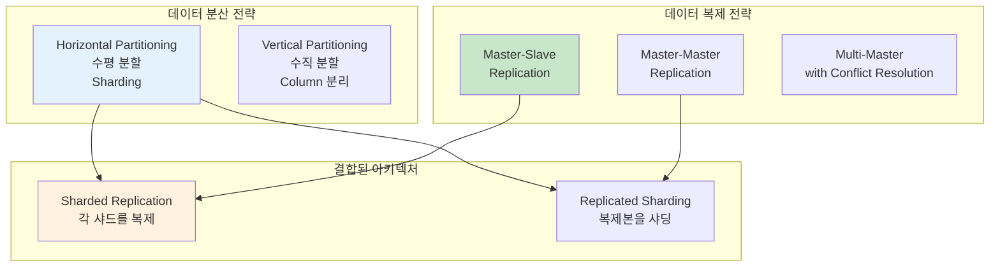

---
tags:
  - DistributedSystems
  - Sharding
  - Replication
  - ConsistentHashing
  - Guide
---

# 14.3 분산 데이터 관리 - 데이터를 나누고 복제하는 기술

## 서론: 2021년 7월, 데이터베이스가 터진 날

우리 소셜미디어 플랫폼이 갑자기 인기를 끌면서 사용자 수가 10만 명에서 1000만 명으로 폭증했던 때입니다. 단일 MySQL 서버로는 더 이상 감당할 수 없는 상황이 되었습니다.

### 🔥 7월 15일 새벽 3시: 데이터베이스의 한계

```bash
# 기존 시스템 (단일 MySQL)
┌─────────────────────────────────┐
│        MySQL Server             │
│  ┌─────────────────────────────┐│
│  │     Users Table             ││
│  │  - 10,000,000 rows         ││  
│  │  - 500GB data              ││
│  │  - 2GB RAM buffer          ││
│  └─────────────────────────────┘│
└─────────────────────────────────┘

# 성능 지표 (참사 상황)
Query Average Time: 15.3초  # 평소 0.1초
Active Connections: 2000/2000  # 풀 고갈
Lock Wait Time: 45초
Disk I/O: 98% 사용률
CPU: 99% 지속적 사용

# 실제 쿼리 성능
mysql> SELECT * FROM users WHERE id = 5000000;
# 15초 후에 결과 반환... 😱

mysql> INSERT INTO posts (user_id, content) VALUES (1234567, 'Hello');
# 30초 후에 완료... 😭
```

**새벽 3:30 - CTO의 긴급 결정**

"단일 서버로는 한계다. 데이터를 나누자!"

하지만 어떻게 나눌 것인가? 어떻게 복제할 것인가? 데이터 일관성은 어떻게 보장할 것인가?

이때부터 **분산 데이터 관리**의 여정이 시작되었습니다.

## 🔄 데이터 분산의 두 가지 축



## 🔪 Sharding: 데이터를 나누는 기술

### 📊 Sharding 전략 비교

#### 1. Range-based Sharding (범위 기반 샤딩)

```python
class RangeBasedSharding:
    def __init__(self):
        self.shards = {
            'shard1': {'range': (0, 3333333), 'server': 'db1.company.com'},
            'shard2': {'range': (3333334, 6666666), 'server': 'db2.company.com'},
            'shard3': {'range': (6666667, 9999999), 'server': 'db3.company.com'}
        }
    
    def get_shard(self, user_id):
        """사용자 ID 범위에 따른 샤드 결정"""
        for shard_name, config in self.shards.items():
            start, end = config['range']
            if start <= user_id <= end:
                return config['server']
        
        raise ValueError(f"No shard found for user_id: {user_id}")
    
    def query_user(self, user_id):
        """사용자 정보 조회"""
        shard_server = self.get_shard(user_id)
        
        # 해당 샤드에서 쿼리 실행
        db = connect_to_database(shard_server)
        result = db.execute("""
            SELECT * FROM users WHERE id = %s
        """, user_id)
        
        return result

# 실제 사용
sharding = RangeBasedSharding()

# 다른 샤드들에 분산 저장
print(sharding.get_shard(1000000))    # db1.company.com
print(sharding.get_shard(5000000))    # db2.company.com  
print(sharding.get_shard(8000000))    # db3.company.com

# 장점: 범위 쿼리 효율적
# SELECT * FROM users WHERE id BETWEEN 1000000 AND 2000000
# → 하나의 샤드에서만 실행

# 단점: Hot Spot 문제
# 새 사용자들이 계속 높은 ID를 가짐 → shard3에 부하 집중
```

**Range Sharding의 Hot Spot 문제 해결**:

```python
class ImprovedRangeSharding:
    def __init__(self):
        # 동적 범위 조정을 위한 메타데이터
        self.shard_metadata = {
            'shard1': {'range': (0, 2000000), 'load': 0.3},
            'shard2': {'range': (2000001, 5000000), 'load': 0.5}, 
            'shard3': {'range': (5000001, 10000000), 'load': 0.9}  # 핫스팟!
        }
    
    def rebalance_shards(self):
        """부하가 높은 샤드 분할"""
        for shard_id, metadata in self.shard_metadata.items():
            if metadata['load'] > 0.8:  # 80% 이상 부하
                print(f"Rebalancing {shard_id} (load: {metadata['load']})")
                
                # 새 샤드 생성
                self.split_shard(shard_id)
    
    def split_shard(self, shard_id):
        """샤드 분할"""
        old_metadata = self.shard_metadata[shard_id]
        start, end = old_metadata['range']
        mid = (start + end) // 2
        
        # 기존 샤드 범위 축소
        self.shard_metadata[shard_id]['range'] = (start, mid)
        
        # 새 샤드 생성  
        new_shard_id = f"{shard_id}_split"
        self.shard_metadata[new_shard_id] = {
            'range': (mid + 1, end),
            'load': 0.0
        }
        
        print(f"Created {new_shard_id} for range ({mid+1}, {end})")
```

#### 2. Hash-based Sharding (해시 기반 샤딩)

```python
import hashlib

class HashBasedSharding:
    def __init__(self, num_shards=8):
        self.num_shards = num_shards
        self.shards = {
            i: f"db{i}.company.com" for i in range(num_shards)
        }
    
    def get_shard(self, key):
        """키의 해시값을 기반으로 샤드 결정"""
        hash_value = int(hashlib.md5(str(key).encode()).hexdigest(), 16)
        shard_id = hash_value % self.num_shards
        return self.shards[shard_id]
    
    def query_user(self, user_id):
        """사용자 정보 조회"""
        shard_server = self.get_shard(user_id)
        
        db = connect_to_database(shard_server)
        result = db.execute("""
            SELECT * FROM users WHERE id = %s
        """, user_id)
        
        return result
    
    def query_by_email(self, email):
        """이메일로 사용자 검색 (모든 샤드 조회 필요)"""
        results = []
        
        # 🚨 문제: 모든 샤드를 조회해야 함
        for shard_id, server in self.shards.items():
            db = connect_to_database(server)
            result = db.execute("""
                SELECT * FROM users WHERE email = %s
            """, email)
            if result:
                results.extend(result)
        
        return results

# 실제 사용
hash_sharding = HashBasedSharding(num_shards=8)

# 동일한 키는 항상 같은 샤드
print(hash_sharding.get_shard("user123"))  # db3.company.com
print(hash_sharding.get_shard("user123"))  # db3.company.com (동일)

# 다른 키는 고르게 분산
print(hash_sharding.get_shard("user456"))  # db7.company.com
print(hash_sharding.get_shard("user789"))  # db1.company.com

# 장점: 균등한 분산, Hot Spot 방지
# 단점: 범위 쿼리 불가, 샤드 추가 시 대규모 재배치 필요
```

**Hash Sharding의 확장성 문제**:

```python
# 문제 상황: 샤드 추가 시 대부분 데이터 이동 필요
class NaiveHashSharding:
    def __init__(self, num_shards):
        self.num_shards = num_shards
    
    def get_shard(self, key):
        return hash(key) % self.num_shards

# 기존: 8개 샤드
old_sharding = NaiveHashSharding(8)
user_123_shard = old_sharding.get_shard("user123")  # shard 3

# 확장: 16개 샤드
new_sharding = NaiveHashSharding(16) 
user_123_new_shard = new_sharding.get_shard("user123")  # shard 11

# 😱 결과: 대부분의 데이터가 다른 샤드로 이동해야 함!
# 확장 시 전체 시스템 다운타임 발생
```

#### 3. Consistent Hashing (일관된 해싱)

이 문제를 해결하는 것이 **Consistent Hashing**입니다:

```python
import hashlib
import bisect

class ConsistentHashing:
    def __init__(self, nodes=None, replicas=3):
        self.replicas = replicas  # 가상 노드 개수
        self.ring = {}           # 해시링
        self.sorted_keys = []    # 정렬된 키 목록
        
        if nodes:
            for node in nodes:
                self.add_node(node)
    
    def _hash(self, key):
        """SHA-1 해시 함수"""
        return int(hashlib.sha1(str(key).encode()).hexdigest(), 16)
    
    def add_node(self, node):
        """노드 추가 (가상 노드들 생성)"""
        for i in range(self.replicas):
            virtual_key = self._hash(f"{node}:{i}")
            self.ring[virtual_key] = node
            bisect.insort(self.sorted_keys, virtual_key)
        
        print(f"Added node {node} with {self.replicas} virtual nodes")
    
    def remove_node(self, node):
        """노드 제거"""
        for i in range(self.replicas):
            virtual_key = self._hash(f"{node}:{i}")
            del self.ring[virtual_key]
            self.sorted_keys.remove(virtual_key)
        
        print(f"Removed node {node}")
    
    def get_node(self, key):
        """키에 해당하는 노드 찾기"""
        if not self.ring:
            return None
        
        hash_key = self._hash(key)
        
        # 시계방향으로 첫 번째 노드 찾기
        idx = bisect.bisect_right(self.sorted_keys, hash_key)
        
        # 링의 끝에 도달하면 처음으로 돌아감
        if idx == len(self.sorted_keys):
            idx = 0
        
        return self.ring[self.sorted_keys[idx]]
    
    def get_nodes(self, key, count=3):
        """키에 해당하는 여러 노드 찾기 (복제용)"""
        if not self.ring:
            return []
        
        hash_key = self._hash(key)
        idx = bisect.bisect_right(self.sorted_keys, hash_key)
        
        nodes = []
        seen = set()
        
        for _ in range(count):
            if idx >= len(self.sorted_keys):
                idx = 0
            
            node = self.ring[self.sorted_keys[idx]]
            if node not in seen:
                nodes.append(node)
                seen.add(node)
            
            idx += 1
            
            if len(nodes) == count or len(seen) == len(set(self.ring.values())):
                break
        
        return nodes

# Consistent Hashing 시뮬레이션
def simulate_consistent_hashing():
    print("=== Consistent Hashing 시뮬레이션 ===")
    
    # 초기 4개 노드
    ch = ConsistentHashing(['server1', 'server2', 'server3', 'server4'])
    
    # 테스트 키들의 초기 배치
    test_keys = ['user123', 'user456', 'user789', 'user111', 'user222']
    
    print("\n--- 초기 배치 ---")
    initial_placement = {}
    for key in test_keys:
        node = ch.get_node(key)
        initial_placement[key] = node
        print(f"{key} → {node}")
    
    # 새 노드 추가
    print("\n--- server5 추가 후 ---")
    ch.add_node('server5')
    
    moved_keys = 0
    for key in test_keys:
        old_node = initial_placement[key]
        new_node = ch.get_node(key) 
        
        if old_node != new_node:
            moved_keys += 1
            print(f"{key}: {old_node} → {new_node} ✨ 이동")
        else:
            print(f"{key}: {old_node} (그대로)")
    
    print(f"\n이동된 키: {moved_keys}/{len(test_keys)} ({moved_keys/len(test_keys)*100:.1f}%)")
    print("👍 일반 해싱이라면 80% 이상 이동했을 것!")

# 실행
simulate_consistent_hashing()

# 예상 출력:
# === Consistent Hashing 시뮬레이션 ===
# Added node server1 with 3 virtual nodes
# Added node server2 with 3 virtual nodes  
# Added node server3 with 3 virtual nodes
# Added node server4 with 3 virtual nodes
#
# --- 초기 배치 ---
# user123 → server2
# user456 → server4
# user789 → server1
# user111 → server3
# user222 → server2
#
# --- server5 추가 후 ---
# Added node server5 with 3 virtual nodes
# user123: server2 (그대로)
# user456: server4 (그대로)  
# user789: server5 ✨ 이동
# user111: server3 (그대로)
# user222: server2 (그대로)
#
# 이동된 키: 1/5 (20.0%)
# 👍 일반 해싱이라면 80% 이상 이동했을 것!
```

### 🎯 실전 샤딩 아키텍처 설계

```python
class ProductionShardingSystem:
    """실제 운영 환경을 고려한 샤딩 시스템"""
    
    def __init__(self):
        self.consistent_hash = ConsistentHashing()
        self.shard_metadata = {}  # 샤드별 메타데이터
        self.connection_pools = {}  # 커넥션 풀
        
        # 초기 샤드 설정
        self.initialize_shards()
    
    def initialize_shards(self):
        """초기 샤드 구성"""
        initial_shards = [
            'shard1-primary.db.company.com',
            'shard2-primary.db.company.com', 
            'shard3-primary.db.company.com',
            'shard4-primary.db.company.com'
        ]
        
        for shard in initial_shards:
            self.add_shard(shard)
    
    def add_shard(self, shard_address):
        """새 샤드 추가"""
        # Consistent Hash에 추가
        self.consistent_hash.add_node(shard_address)
        
        # 메타데이터 설정
        self.shard_metadata[shard_address] = {
            'status': 'active',
            'created_at': time.time(),
            'replica_addresses': [
                shard_address.replace('primary', 'replica1'),
                shard_address.replace('primary', 'replica2')
            ]
        }
        
        # 커넥션 풀 생성
        self.connection_pools[shard_address] = create_connection_pool(
            shard_address, 
            pool_size=20
        )
        
        print(f"Shard added: {shard_address}")
    
    def write_data(self, key, data):
        """데이터 쓰기 (복제 포함)"""
        # Primary 샤드 결정
        primary_shard = self.consistent_hash.get_node(key)
        
        # 복제본 샤드들 결정
        replica_shards = self.shard_metadata[primary_shard]['replica_addresses']
        
        try:
            # 1. Primary에 쓰기
            primary_conn = self.connection_pools[primary_shard]
            primary_conn.execute("""
                INSERT INTO data_table (key, value, created_at) 
                VALUES (%s, %s, %s)
            """, key, data, time.time())
            
            # 2. 복제본들에 비동기 쓰기
            for replica in replica_shards:
                self.async_write_to_replica(replica, key, data)
            
            return {'status': 'success', 'shard': primary_shard}
            
        except DatabaseException as e:
            # Primary 장애 시 복제본을 Primary로 승격
            return self.handle_primary_failure(primary_shard, key, data)
    
    def read_data(self, key, consistency_level='eventual'):
        """데이터 읽기 (일관성 레벨 선택)"""
        primary_shard = self.consistent_hash.get_node(key)
        
        if consistency_level == 'strong':
            # 강한 일관성: Primary에서만 읽기
            conn = self.connection_pools[primary_shard]
            result = conn.execute("""
                SELECT value FROM data_table WHERE key = %s
            """, key)
            return result
            
        elif consistency_level == 'eventual':
            # 최종 일관성: 아무 복제본에서 읽기 (성능 우선)
            all_shards = [primary_shard] + \
                        self.shard_metadata[primary_shard]['replica_addresses']
            
            # 가장 빠른 응답을 주는 샤드에서 읽기
            return self.read_from_fastest_replica(all_shards, key)
    
    def read_from_fastest_replica(self, shards, key):
        """여러 복제본 중 가장 빠른 응답 사용"""
        import asyncio
        import concurrent.futures
        
        async def read_from_shard(shard):
            conn = self.connection_pools[shard]
            return conn.execute("""
                SELECT value FROM data_table WHERE key = %s
            """, key)
        
        # 모든 복제본에서 동시에 읽기 시도
        with concurrent.futures.ThreadPoolExecutor() as executor:
            futures = [
                executor.submit(self.read_from_single_shard, shard, key) 
                for shard in shards
            ]
            
            # 첫 번째로 완료된 결과 반환
            for future in concurrent.futures.as_completed(futures):
                try:
                    result = future.result(timeout=1.0)  # 1초 타임아웃
                    return result
                except Exception:
                    continue
        
        raise Exception("All replicas failed")
    
    def rebalance_data(self):
        """데이터 리밸런싱"""
        print("Starting data rebalancing...")
        
        # 각 샤드의 부하 확인
        shard_loads = self.analyze_shard_loads()
        
        for shard, load in shard_loads.items():
            if load > 0.8:  # 80% 이상 부하
                print(f"High load detected on {shard}: {load:.2f}")
                self.scale_out_shard(shard)
    
    def scale_out_shard(self, overloaded_shard):
        """과부하 샤드 확장"""
        # 새 샤드 생성
        new_shard = self.create_new_shard()
        
        # 데이터 이동 (백그라운드)
        self.migrate_data_async(overloaded_shard, new_shard)
        
        print(f"Scaling out {overloaded_shard} → {new_shard}")

# 사용 예시
sharding_system = ProductionShardingSystem()

# 데이터 쓰기 (자동 샤딩)
result = sharding_system.write_data("user:123456", {
    "name": "John Doe",
    "email": "john@example.com",  
    "created_at": "2023-07-15T10:30:00Z"
})
print(f"Write result: {result}")

# 데이터 읽기 (강한 일관성)
user_data = sharding_system.read_data("user:123456", consistency_level='strong')
print(f"User data: {user_data}")

# 데이터 읽기 (최종 일관성 - 빠른 성능)
user_data_fast = sharding_system.read_data("user:123456", consistency_level='eventual')
print(f"User data (fast): {user_data_fast}")
```

## 🔄 Replication: 데이터를 복제하는 전략

### 📈 Master-Slave Replication

```python
class MasterSlaveReplication:
    def __init__(self, master_address, slave_addresses):
        self.master = DatabaseConnection(master_address)
        self.slaves = [DatabaseConnection(addr) for addr in slave_addresses]
        self.slave_lag_info = {}  # 복제 지연 정보
        
    def write(self, query, params):
        """쓰기는 Master에만"""
        try:
            result = self.master.execute(query, params)
            
            # 복제 지연 시간 추적
            self.track_replication_lag()
            
            return result
        except Exception as e:
            raise MasterFailureException(f"Master write failed: {e}")
    
    def read(self, query, params, consistency_level='eventual'):
        """읽기 전략 선택"""
        if consistency_level == 'strong':
            # 강한 일관성: Master에서만 읽기
            return self.master.execute(query, params)
        
        elif consistency_level == 'eventual':
            # 최종 일관성: 부하 분산된 읽기
            return self.read_from_slave_with_load_balancing(query, params)
        
        elif consistency_level == 'read_your_writes':
            # Read-your-writes: 최근 쓴 사용자는 Master에서 읽기
            return self.read_with_session_consistency(query, params)
    
    def read_from_slave_with_load_balancing(self, query, params):
        """슬레이브 로드밸런싱 읽기"""
        # 건강한 슬레이브들 중에서 선택
        healthy_slaves = self.get_healthy_slaves()
        
        if not healthy_slaves:
            # 모든 슬레이브가 죽었으면 Master에서 읽기
            print("⚠️  All slaves down, reading from master")
            return self.master.execute(query, params)
        
        # Round-robin 방식으로 슬레이브 선택
        selected_slave = self.select_slave_round_robin(healthy_slaves)
        
        try:
            return selected_slave.execute(query, params)
        except Exception as e:
            # 슬레이브 실패 시 다른 슬레이브나 Master로 폴백
            print(f"⚠️  Slave failed, trying fallback: {e}")
            return self.read_fallback(query, params, failed_slave=selected_slave)
    
    def track_replication_lag(self):
        """복제 지연 모니터링"""
        master_position = self.master.execute("SHOW MASTER STATUS")[0]['Position']
        
        for i, slave in enumerate(self.slaves):
            try:
                slave_status = slave.execute("SHOW SLAVE STATUS")[0]
                slave_position = slave_status['Exec_Master_Log_Pos']
                
                lag = master_position - slave_position
                self.slave_lag_info[f"slave_{i}"] = {
                    'lag_bytes': lag,
                    'seconds_behind_master': slave_status['Seconds_Behind_Master'],
                    'last_checked': time.time()
                }
                
            except Exception as e:
                print(f"⚠️  Slave {i} health check failed: {e}")
                self.slave_lag_info[f"slave_{i}"] = {
                    'status': 'unhealthy',
                    'error': str(e),
                    'last_checked': time.time()
                }
    
    def get_healthy_slaves(self):
        """건강한 슬레이브 목록 반환"""
        healthy = []
        
        for i, slave in enumerate(self.slaves):
            slave_key = f"slave_{i}"
            if slave_key in self.slave_lag_info:
                lag_info = self.slave_lag_info[slave_key]
                
                # 복제 지연이 5초 이내이고 에러가 없으면 건강함
                if (lag_info.get('seconds_behind_master', 0) < 5 and 
                    'error' not in lag_info):
                    healthy.append(slave)
        
        return healthy

# 실제 사용 예시
replication = MasterSlaveReplication(
    master_address="master-db.company.com:3306",
    slave_addresses=[
        "slave1-db.company.com:3306", 
        "slave2-db.company.com:3306",
        "slave3-db.company.com:3306"
    ]
)

# 쓰기 (Master에만)
replication.write("""
    INSERT INTO posts (user_id, content, created_at) 
    VALUES (%s, %s, %s)
""", (12345, "Hello World", time.time()))

# 읽기 (최종 일관성 - 빠름)
posts = replication.read("""
    SELECT * FROM posts WHERE user_id = %s ORDER BY created_at DESC LIMIT 10
""", (12345,), consistency_level='eventual')

# 읽기 (강한 일관성 - 느림)
latest_post = replication.read("""
    SELECT * FROM posts WHERE user_id = %s ORDER BY created_at DESC LIMIT 1  
""", (12345,), consistency_level='strong')
```

### 🔄 Master-Master Replication

```python
class MasterMasterReplication:
    def __init__(self, node_addresses):
        self.nodes = [DatabaseConnection(addr) for addr in node_addresses]
        self.current_node = 0  # 현재 활성 노드
        self.conflict_resolver = ConflictResolver()
        
    def write(self, query, params, node_preference=None):
        """양방향 복제 쓰기"""
        target_node = node_preference or self.current_node
        
        try:
            # 선택된 노드에 쓰기
            result = self.nodes[target_node].execute(query, params)
            
            # 다른 노드들로 비동기 복제 (MySQL의 경우 자동)
            self.verify_replication_health()
            
            return result
            
        except Exception as e:
            # 현재 노드 실패 시 다른 노드로 자동 전환
            return self.failover_write(query, params, failed_node=target_node)
    
    def failover_write(self, query, params, failed_node):
        """장애조치 쓰기"""
        print(f"⚠️  Node {failed_node} failed, attempting failover")
        
        for i, node in enumerate(self.nodes):
            if i == failed_node:
                continue
                
            try:
                result = node.execute(query, params)
                self.current_node = i  # 활성 노드 변경
                print(f"✅ Failover successful to node {i}")
                return result
                
            except Exception as e:
                print(f"⚠️  Failover to node {i} also failed: {e}")
                continue
        
        raise AllNodesFailed("All master nodes are down")
    
    def read(self, query, params):
        """읽기 (아무 노드에서나)"""
        # 라운드 로빈으로 부하 분산
        node_index = self.get_next_read_node()
        
        try:
            return self.nodes[node_index].execute(query, params)
        except Exception:
            # 해당 노드 실패 시 다른 노드에서 재시도
            return self.read_with_fallback(query, params, failed_node=node_index)
    
    def handle_write_conflict(self, table, record_id):
        """쓰기 충돌 해결"""
        print(f"🔥 Write conflict detected on {table}:{record_id}")
        
        # 각 노드에서 해당 레코드 버전 수집
        versions = {}
        for i, node in enumerate(self.nodes):
            try:
                record = node.execute(f"""
                    SELECT *, last_modified FROM {table} WHERE id = %s
                """, (record_id,))
                
                if record:
                    versions[f"node_{i}"] = record[0]
                    
            except Exception as e:
                print(f"Failed to get version from node {i}: {e}")
        
        if len(versions) > 1:
            # 여러 버전이 존재 → 충돌!
            resolved_version = self.conflict_resolver.resolve(versions)
            
            # 해결된 버전을 모든 노드에 적용
            self.apply_resolved_version(table, record_id, resolved_version)
            
            return resolved_version
        else:
            return list(versions.values())[0] if versions else None

class ConflictResolver:
    """충돌 해결 전략들"""
    
    def resolve(self, versions):
        """충돌 해결 (여러 전략 중 선택)"""
        # 전략 1: Last-Write-Wins (마지막 쓰기 승리)
        return self.last_write_wins(versions)
    
    def last_write_wins(self, versions):
        """마지막 수정 시간 기준으로 선택"""
        latest_version = None
        latest_timestamp = 0
        
        for node_id, version in versions.items():
            timestamp = version.get('last_modified', 0)
            if timestamp > latest_timestamp:
                latest_timestamp = timestamp
                latest_version = version
        
        print(f"✅ Conflict resolved by Last-Write-Wins: {latest_timestamp}")
        return latest_version
    
    def vector_clock_resolution(self, versions):
        """Vector Clock 기반 충돌 해결"""
        # Vector Clock 구현 (복잡하므로 개념만)
        # 각 노드별로 논리적 시계를 유지하여 인과관계 파악
        pass
    
    def application_level_merge(self, versions):
        """애플리케이션 레벨에서 병합"""
        # 예: 사용자 프로필 정보의 경우 각 필드별로 최신 값 선택
        merged = {}
        
        for node_id, version in versions.items():
            for field, value in version.items():
                if field not in merged or version['last_modified'] > merged.get('last_modified', 0):
                    merged[field] = value
        
        return merged

# 사용 예시
mm_replication = MasterMasterReplication([
    "master1-db.company.com:3306",
    "master2-db.company.com:3306"  
])

# 양방향 복제 쓰기
mm_replication.write("""
    UPDATE users SET last_login = %s WHERE id = %s
""", (time.time(), 12345))

# 충돌 상황 시뮬레이션
# Node 1: UPDATE users SET name = 'John' WHERE id = 12345 at 10:00:00
# Node 2: UPDATE users SET name = 'Johnny' WHERE id = 12345 at 10:00:05
# → 충돌 감지 및 해결 (Last-Write-Wins: 'Johnny')
```

## 🎯 Vector Clocks: 분산 환경에서의 시간 추적

```python
class VectorClock:
    """분산 시스템의 논리적 시계"""
    
    def __init__(self, node_id, nodes):
        self.node_id = node_id
        self.nodes = nodes
        self.clock = {node: 0 for node in nodes}  # 각 노드별 시계
    
    def tick(self):
        """로컬 이벤트 발생 시 자신의 시계 증가"""
        self.clock[self.node_id] += 1
    
    def update(self, other_clock):
        """다른 노드의 메시지 받을 때 시계 업데이트"""
        # 각 노드별로 최대값 선택 후 자신의 시계 증가
        for node in self.nodes:
            self.clock[node] = max(self.clock[node], other_clock.get(node, 0))
        
        # 자신의 시계 증가
        self.clock[self.node_id] += 1
    
    def compare(self, other_clock):
        """두 Vector Clock 비교"""
        # self < other: 모든 component가 작거나 같고, 적어도 하나는 작음
        self_less = all(self.clock[node] <= other_clock.get(node, 0) for node in self.nodes)
        any_smaller = any(self.clock[node] < other_clock.get(node, 0) for node in self.nodes)
        
        # other < self: 반대
        other_less = all(other_clock.get(node, 0) <= self.clock[node] for node in self.nodes) 
        any_other_smaller = any(other_clock.get(node, 0) < self.clock[node] for node in self.nodes)
        
        if self_less and any_smaller:
            return -1  # self < other (happens-before)
        elif other_less and any_other_smaller:
            return 1   # self > other  
        else:
            return 0   # concurrent (동시 발생)

# Vector Clock을 활용한 분산 데이터 버전 관리
class DistributedDataWithVectorClock:
    def __init__(self, node_id, peer_nodes):
        self.node_id = node_id
        self.vector_clock = VectorClock(node_id, [node_id] + peer_nodes)
        self.data_store = {}  # key -> {value, vector_clock}
        
    def write_local(self, key, value):
        """로컬 쓰기"""
        # Vector Clock 증가
        self.vector_clock.tick()
        
        # 데이터 저장
        self.data_store[key] = {
            'value': value,
            'vector_clock': self.vector_clock.clock.copy(),
            'node_id': self.node_id,
            'timestamp': time.time()
        }
        
        print(f"Node {self.node_id}: Write {key}={value}, VC={self.vector_clock.clock}")
    
    def receive_update(self, key, value, sender_clock, sender_node):
        """다른 노드로부터 업데이트 받기"""
        # Vector Clock 업데이트
        self.vector_clock.update(sender_clock)
        
        if key not in self.data_store:
            # 새로운 키: 그대로 저장
            self.data_store[key] = {
                'value': value,
                'vector_clock': sender_clock.copy(),
                'node_id': sender_node,
                'timestamp': time.time()
            }
            print(f"Node {self.node_id}: New key {key}={value}")
            
        else:
            # 기존 키: 충돌 해결 필요
            local_data = self.data_store[key]
            comparison = self.compare_vector_clocks(local_data['vector_clock'], sender_clock)
            
            if comparison == -1:
                # 로컬 < 원격: 원격 데이터가 더 새로움
                print(f"Node {self.node_id}: Updating {key}: {local_data['value']} → {value}")
                self.data_store[key] = {
                    'value': value,
                    'vector_clock': sender_clock.copy(),
                    'node_id': sender_node,
                    'timestamp': time.time()
                }
                
            elif comparison == 1:
                # 로컬 > 원격: 로컬 데이터가 더 새로움  
                print(f"Node {self.node_id}: Ignoring older update for {key}")
                
            else:
                # 동시 발생: 충돌!
                print(f"🔥 Node {self.node_id}: Conflict detected for {key}!")
                self.handle_conflict(key, value, sender_clock, sender_node)
    
    def handle_conflict(self, key, remote_value, remote_clock, sender_node):
        """Vector Clock 충돌 해결"""
        local_data = self.data_store[key]
        
        print(f"Conflict resolution for {key}:")
        print(f"  Local: {local_data['value']} (VC: {local_data['vector_clock']})")
        print(f"  Remote: {remote_value} (VC: {remote_clock})")
        
        # 해결 전략 1: 노드 ID 기준 (deterministic)
        if self.node_id < sender_node:
            # 노드 ID가 작은 쪽 우선
            print(f"  Resolution: Keep local (node {self.node_id} < {sender_node})")
        else:
            # 원격 데이터 채택
            print(f"  Resolution: Accept remote (node {self.node_id} > {sender_node})")
            self.data_store[key] = {
                'value': remote_value,
                'vector_clock': remote_clock.copy(),
                'node_id': sender_node,
                'timestamp': time.time()
            }
        
        # 해결 전략 2: 애플리케이션별 병합
        # 예: Set의 경우 합집합, Counter의 경우 합계 등

# Vector Clock 시뮬레이션
def simulate_vector_clocks():
    print("=== Vector Clock Conflict Resolution 시뮬레이션 ===")
    
    # 3개 노드 네트워크
    nodes = ['A', 'B', 'C']
    node_a = DistributedDataWithVectorClock('A', ['B', 'C'])
    node_b = DistributedDataWithVectorClock('B', ['A', 'C']) 
    node_c = DistributedDataWithVectorClock('C', ['A', 'B'])
    
    print("\n--- 순차적 업데이트 (충돌 없음) ---")
    # 1. A가 쓰기
    node_a.write_local('user:123', 'Alice')
    
    # 2. B가 A의 업데이트를 받음
    node_b.receive_update('user:123', 'Alice', 
                         node_a.data_store['user:123']['vector_clock'], 'A')
    
    # 3. B가 업데이트
    node_b.write_local('user:123', 'Alice Smith')
    
    # 4. A가 B의 업데이트를 받음  
    node_a.receive_update('user:123', 'Alice Smith',
                         node_b.data_store['user:123']['vector_clock'], 'B')
    
    print("\n--- 동시 업데이트 (충돌 발생) ---")
    
    # 5. A와 C가 동시에 다른 값으로 업데이트 (네트워크 분할 상황)
    node_a.write_local('user:456', 'Bob')
    node_c.write_local('user:456', 'Robert')
    
    # 6. 네트워크 복구 후 서로의 업데이트를 받음
    print("\n--- 네트워크 복구: 충돌 감지 및 해결 ---")
    node_a.receive_update('user:456', 'Robert',
                         node_c.data_store['user:456']['vector_clock'], 'C')
    
    node_c.receive_update('user:456', 'Bob', 
                         node_a.data_store['user:456']['vector_clock'], 'A')

# 실행
simulate_vector_clocks()
```

## 💡 분산 데이터 관리에서 배운 핵심 교훈

### 1. 완벽한 분산 데이터 시스템은 없다

```bash
✅ 받아들여야 할 현실:
- Sharding하면 트랜잭션 복잡성 증가
- Replication하면 일관성 문제 발생
- 확장성과 일관성은 트레이드오프
- 네트워크 분할과 충돌은 정상 상황
```

### 2. 데이터 특성에 맞는 전략 선택

```python
# 사용자 프로필: 강한 일관성 필요
user_data = read_with_strong_consistency(user_id)

# 상품 추천: 최종 일관성으로 충분  
recommendations = read_with_eventual_consistency(user_id)

# 실시간 피드: 약한 일관성도 허용
feed = read_from_nearest_replica(user_id)
```

### 3. 관찰과 보상을 통한 실용적 접근

```python
# 이상적인 ACID 대신 실용적 해결책
def practical_distributed_transaction():
    try:
        # 1. 낙관적 처리 (빠름)
        result = process_optimistically()
        
        # 2. 비동기 검증
        schedule_async_validation(result.transaction_id)
        
        # 3. 문제 발견 시 보상
        if validation_failed:
            compensate_transaction(result.transaction_id)
            notify_user_with_apology()
        
        return result
    except Exception:
        # 4. 실패 시 명확한 에러
        raise TransactionFailedException()
```

### 4. 모니터링과 자동화의 중요성

```bash
📊 분산 데이터 시스템 필수 지표:
- 샤드별 부하 분산
- 복제 지연 시간  
- 충돌 발생 빈도
- 데이터 이동 진행률
- 노드 헬스체크 상태
```

## 🎯 다음 단계

분산 데이터 관리의 기반을 다졌으니, [14.4 분산 시스템 패턴](04-distributed-patterns.md)에서는 Circuit Breaker, Saga, CQRS 같은 실전 패턴들을 배워보겠습니다.

"데이터를 나누면 복잡해지지만, 올바른 전략과 도구가 있으면 확장 가능한 시스템을 만들 수 있습니다!" 🗄️⚡
