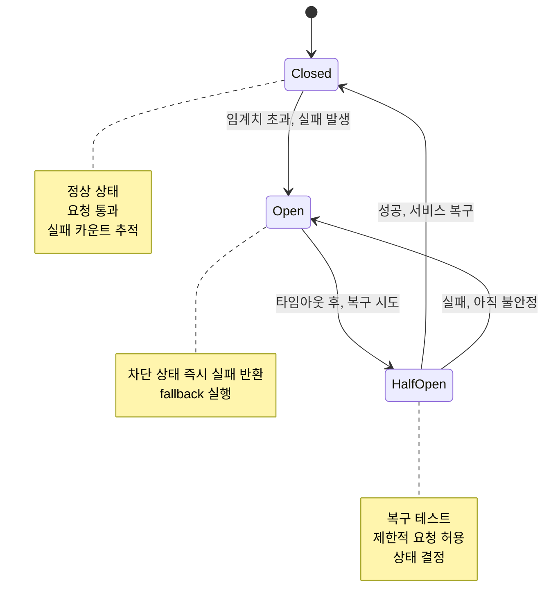

---
tags:
  - DistributedSystems
  - CircuitBreaker
  - Saga
  - CQRS
  - Patterns
  - Guide
---

# 14.4 분산 시스템 패턴 - 현실 세계의 검증된 해결책들

## 서론: 2022년 2월, 마이크로서비스 지옥에서 탈출한 날

우리 회사가 모놀리스에서 마이크로서비스로 전환한 지 6개월이 지났을 때입니다. 처음엔 "이제 서비스별로 독립 배포할 수 있다!"고 기뻐했지만, 곧 새로운 지옥이 시작되었습니다.

### 🔥 2월 14일 밸런타인데이: 연쇄 장애의 악몽

```bash
# 우리의 마이크로서비스 아키텍처
┌─────────────┐    ┌─────────────┐    ┌─────────────┐
│ User Service│◄───┤Order Service├───►│Payment Svc  │
└─────────────┘    └─────────────┘    └─────────────┘
       │                   │                   │
       ▼                   ▼                   ▼
┌─────────────┐    ┌─────────────┐    ┌─────────────┐
│Profile Svc  │    │Inventory Svc│    │ Email Svc   │
└─────────────┘    └─────────────┘    └─────────────┘

# 밸런타인데이 오후 2시: 트래픽 폭증
Normal Load: 1,000 RPS
Valentine Load: 15,000 RPS (15배!)
```

**오후 2:15 - 첫 번째 도미노: Payment Service 다운**

```python
# Payment Service 로그
[14:15:23] INFO: Processing payment request user_123
[14:15:25] INFO: Processing payment request user_456  
[14:15:27] INFO: Processing payment request user_789
...
[14:15:45] ERROR: Connection pool exhausted! (200/200 connections)
[14:15:46] ERROR: Database connection timeout after 30s
[14:15:47] FATAL: OutOfMemoryError - GC overhead limit exceeded
[14:15:48] SYSTEM: Payment Service CRASHED 💥
```

**오후 2:16 - 두 번째 도미노: 연쇄 장애 시작**

```python
# Order Service가 Payment Service를 계속 호출
def process_order(order_data):
    try:
        # Payment Service 호출 (이미 죽음)
        payment_result = payment_service.charge(
            user_id=order_data['user_id'],
            amount=order_data['amount']
        )
        # 30초 타임아웃까지 대기... 😱
        
    except TimeoutException:
        # 재시도 로직 (더 나쁘게 만듦)
        for i in range(5):
            try:
                payment_result = payment_service.charge(...)
                break
            except:
                time.sleep(2 ** i)  # 지수 백오프
        
        raise PaymentServiceUnavailableException()

# 결과: Order Service도 응답 불가
# 모든 스레드가 Payment Service 호출에서 블록됨
```

**오후 2:20 - 전체 시스템 마비**

```bash
📊 시스템 상태:
- Payment Service: 💀 DEAD
- Order Service: 🐌 99% threads blocked  
- User Service: 🐌 90% threads blocked (Order Service 호출 중)
- Inventory Service: 🐌 85% threads blocked
- Email Service: 🐌 75% threads blocked

💔 사용자 경험:
"주문 버튼을 눌렀는데 30초째 로딩 중..."
"회원가입도 안 돼요!"  
"상품 검색도 안 되네요..."

😭 CEO: "단일 서버였을 땐 이런 일이 없었는데!"
```

이 날 우리는 **분산 시스템의 냉혹한 현실**을 배웠습니다. 그리고 **Circuit Breaker, Bulkhead, Saga 패턴** 등을 도입하게 되었습니다.

## ⚡ Circuit Breaker Pattern: 연쇄 장애의 방화벽

### 🔌 Circuit Breaker의 작동 원리

전기 회로의 차단기에서 영감을 받은 패턴입니다:



### 🛠️ Production-Ready Circuit Breaker 구현

```python
import time
import threading
from enum import Enum
from typing import Callable, Any, Optional
from dataclasses import dataclass

class CircuitState(Enum):
    CLOSED = "closed"      # 정상 상태
    OPEN = "open"          # 차단 상태  
    HALF_OPEN = "half_open" # 복구 테스트

@dataclass
class CircuitBreakerConfig:
    failure_threshold: int = 5           # 실패 임계치
    recovery_timeout: float = 60.0       # 복구 시도 간격 (초)
    expected_exception: tuple = (Exception,)  # 감지할 예외 타입
    timeout: float = 30.0               # 호출 타임아웃
    half_open_max_calls: int = 3        # half-open에서 최대 호출 수

class CircuitBreakerError(Exception):
    """Circuit Breaker가 열려있을 때 발생하는 예외"""
    pass

class CircuitBreaker:
    def __init__(self, config: CircuitBreakerConfig):
        self.config = config
        self.state = CircuitState.CLOSED
        self.failure_count = 0
        self.last_failure_time = None
        self.half_open_calls = 0
        self.lock = threading.RLock()  # 스레드 안전성
        
        # 메트릭 수집
        self.total_calls = 0
        self.successful_calls = 0
        self.failed_calls = 0
        self.circuit_open_count = 0
    
    def call(self, func: Callable, *args, fallback: Optional[Callable] = None, **kwargs) -> Any:
        """Circuit Breaker를 통한 함수 호출"""
        with self.lock:
            self.total_calls += 1
            
            # 현재 상태 확인
            current_state = self._get_current_state()
            
            if current_state == CircuitState.OPEN:
                # Circuit이 열려있음 - 즉시 실패
                self.circuit_open_count += 1
                
                if fallback:
                    try:
                        return fallback(*args, **kwargs)
                    except Exception as e:
                        raise CircuitBreakerError(f"Circuit breaker OPEN and fallback failed: {e}")
                else:
                    raise CircuitBreakerError("Circuit breaker OPEN - service unavailable")
            
            # CLOSED 또는 HALF_OPEN 상태에서 호출 시도
            try:
                # 타임아웃과 함께 함수 실행
                result = self._call_with_timeout(func, *args, **kwargs)
                
                # 성공 시 처리
                self._on_success()
                return result
                
            except self.config.expected_exception as e:
                # 예상된 예외 발생 시 처리  
                self._on_failure()
                
                # fallback 실행 시도
                if fallback:
                    try:
                        return fallback(*args, **kwargs)
                    except Exception as fb_error:
                        raise CircuitBreakerError(f"Primary call failed: {e}, Fallback failed: {fb_error}")
                else:
                    raise e
    
    def _get_current_state(self) -> CircuitState:
        """현재 상태 계산"""
        if self.state == CircuitState.CLOSED:
            if self.failure_count >= self.config.failure_threshold:
                self._transition_to_open()
                return CircuitState.OPEN
            return CircuitState.CLOSED
        
        elif self.state == CircuitState.OPEN:
            if self._should_attempt_reset():
                self._transition_to_half_open()
                return CircuitState.HALF_OPEN
            return CircuitState.OPEN
        
        else:  # HALF_OPEN
            return CircuitState.HALF_OPEN
    
    def _should_attempt_reset(self) -> bool:
        """복구 시도 시점인지 확인"""
        return (self.last_failure_time and 
                time.time() - self.last_failure_time >= self.config.recovery_timeout)
    
    def _transition_to_open(self):
        """OPEN 상태로 전환"""
        self.state = CircuitState.OPEN
        self.last_failure_time = time.time()
        print(f"🔴 Circuit Breaker OPENED (failures: {self.failure_count})")
    
    def _transition_to_half_open(self):
        """HALF_OPEN 상태로 전환"""
        self.state = CircuitState.HALF_OPEN  
        self.half_open_calls = 0
        print(f"🟡 Circuit Breaker HALF_OPEN - testing recovery")
    
    def _transition_to_closed(self):
        """CLOSED 상태로 전환"""
        self.state = CircuitState.CLOSED
        self.failure_count = 0
        self.half_open_calls = 0
        print(f"🟢 Circuit Breaker CLOSED - service recovered")
    
    def _on_success(self):
        """호출 성공 시 처리"""
        self.successful_calls += 1
        
        if self.state == CircuitState.HALF_OPEN:
            self.half_open_calls += 1
            if self.half_open_calls >= self.config.half_open_max_calls:
                # 충분한 성공 호출 확인됨 - CLOSED로 전환
                self._transition_to_closed()
        
        elif self.state == CircuitState.CLOSED:
            # 연속 성공 시 실패 카운트 리셋 (점진적 회복)
            self.failure_count = max(0, self.failure_count - 1)
    
    def _on_failure(self):
        """호출 실패 시 처리"""
        self.failed_calls += 1
        self.failure_count += 1
        self.last_failure_time = time.time()
        
        if self.state == CircuitState.HALF_OPEN:
            # HALF_OPEN에서 실패 시 다시 OPEN으로
            self._transition_to_open()
    
    def _call_with_timeout(self, func: Callable, *args, **kwargs) -> Any:
        """타임아웃과 함께 함수 호출"""
        import signal
        
        def timeout_handler(signum, frame):
            raise TimeoutError(f"Function call timed out after {self.config.timeout}s")
        
        # 타임아웃 설정 (Unix 시스템에서만 동작)
        old_handler = signal.signal(signal.SIGALRM, timeout_handler)
        signal.alarm(int(self.config.timeout))
        
        try:
            result = func(*args, **kwargs)
            signal.alarm(0)  # 타임아웃 해제
            return result
        finally:
            signal.signal(signal.SIGALRM, old_handler)
    
    def get_metrics(self) -> dict:
        """메트릭 반환"""
        success_rate = (self.successful_calls / self.total_calls * 100) if self.total_calls > 0 else 0
        
        return {
            'state': self.state.value,
            'total_calls': self.total_calls,
            'successful_calls': self.successful_calls,
            'failed_calls': self.failed_calls,  
            'success_rate': f"{success_rate:.2f}%",
            'failure_count': self.failure_count,
            'circuit_open_count': self.circuit_open_count,
            'last_failure_time': self.last_failure_time
        }

# Circuit Breaker 사용 예시
class PaymentServiceClient:
    def __init__(self):
        self.circuit_breaker = CircuitBreaker(CircuitBreakerConfig(
            failure_threshold=3,
            recovery_timeout=30.0,
            timeout=10.0
        ))
    
    def charge_payment(self, user_id: str, amount: float):
        """결제 처리 (Circuit Breaker 적용)"""
        def primary_call():
            # 실제 Payment Service 호출
            return self._call_payment_api(user_id, amount)
        
        def fallback_call():
            # Fallback: 결제를 큐에 저장하고 나중에 처리
            return self._queue_payment_for_later(user_id, amount)
        
        return self.circuit_breaker.call(
            primary_call,
            fallback=fallback_call
        )
    
    def _call_payment_api(self, user_id: str, amount: float):
        """실제 Payment API 호출"""
        import requests
        
        response = requests.post(
            'https://payment-service/api/charge',
            json={'user_id': user_id, 'amount': amount},
            timeout=10
        )
        
        if response.status_code != 200:
            raise Exception(f"Payment API failed: {response.status_code}")
        
        return response.json()
    
    def _queue_payment_for_later(self, user_id: str, amount: float):
        """Fallback: 결제를 큐에 저장"""
        payment_queue.publish({
            'user_id': user_id,
            'amount': amount,
            'timestamp': time.time(),
            'retry_count': 0
        })
        
        return {
            'status': 'queued',
            'message': '결제가 큐에 저장되었습니다. 잠시 후 처리됩니다.',
            'user_id': user_id
        }

# 실사용 시뮬레이션
def simulate_circuit_breaker():
    print("=== Circuit Breaker 시뮬레이션 ===")
    
    payment_client = PaymentServiceClient()
    
    print(", --- 정상 상황 (Circuit Breaker CLOSED) ---")
    for i in range(3):
        try:
            result = payment_client.charge_payment(f"user_{i}", 100.0)
            print(f"✅ Payment {i}: {result['status']}")
        except Exception as e:
            print(f"❌ Payment {i}: {e}")
    
    print(f", 📊 Metrics: {payment_client.circuit_breaker.get_metrics()}")
    
    print(", --- 장애 상황 시뮬레이션 (Payment Service 다운) ---")
    # Payment Service가 다운되었다고 가정
    original_call = payment_client._call_payment_api
    payment_client._call_payment_api = lambda user_id, amount: exec('raise Exception("Service unavailable")')
    
    for i in range(5):
        try:
            result = payment_client.charge_payment(f"user_{i}", 100.0)
            print(f"✅ Payment {i}: {result['status']}")
        except Exception as e:
            print(f"❌ Payment {i}: {e}")
    
    print(f", 📊 Metrics: {payment_client.circuit_breaker.get_metrics()}")
    
    print(", --- Circuit Breaker OPEN 상태에서 호출 ---")
    for i in range(3):
        try:
            result = payment_client.charge_payment(f"user_{i}", 100.0)
            print(f"✅ Payment {i}: {result['status']} (fallback)")
        except Exception as e:
            print(f"❌ Payment {i}: {e}")
    
    print(f", 📊 Final Metrics: {payment_client.circuit_breaker.get_metrics()}")

# 실행
simulate_circuit_breaker()
```

## 🚢 Bulkhead Pattern: 격리를 통한 장애 전파 차단

### 🛡️ Bulkhead의 개념

타이타닉호의 격벽에서 영감을 받은 패턴입니다. 한 부분의 장애가 전체로 퍼지지 않도록 격리합니다.

```python
import threading
from concurrent.futures import ThreadPoolExecutor, as_completed
from queue import Queue, Full
from typing import Dict, Any, Callable

class BulkheadExecutor:
    """서비스별로 격리된 스레드 풀을 제공하는 Bulkhead"""
    
    def __init__(self):
        self.executors: Dict[str, ThreadPoolExecutor] = {}
        self.configs = {}
        self.metrics = {}
    
    def register_service(self, service_name: str, max_workers: int = 10, queue_size: int = 100):
        """서비스별 전용 스레드 풀 등록"""
        self.executors[service_name] = ThreadPoolExecutor(
            max_workers=max_workers,
            thread_name_prefix=f"{service_name}-pool"
        )
        
        self.configs[service_name] = {
            'max_workers': max_workers,
            'queue_size': queue_size
        }
        
        self.metrics[service_name] = {
            'submitted_tasks': 0,
            'completed_tasks': 0, 
            'failed_tasks': 0,
            'rejected_tasks': 0
        }
        
        print(f"🚢 Bulkhead registered for {service_name}: {max_workers} workers, queue={queue_size}")
    
    def submit(self, service_name: str, func: Callable, *args, **kwargs):
        """격리된 스레드 풀에서 작업 실행"""
        if service_name not in self.executors:
            raise ValueError(f"Service {service_name} not registered")
        
        executor = self.executors[service_name]
        
        try:
            # 큐가 가득차면 즉시 거부 (추가 격리)
            if self._is_queue_full(service_name):
                self.metrics[service_name]['rejected_tasks'] += 1
                raise Exception(f"Service {service_name} bulkhead queue is full")
            
            self.metrics[service_name]['submitted_tasks'] += 1
            future = executor.submit(self._wrapped_call, service_name, func, *args, **kwargs)
            return future
            
        except Exception as e:
            self.metrics[service_name]['rejected_tasks'] += 1
            raise e
    
    def _wrapped_call(self, service_name: str, func: Callable, *args, **kwargs):
        """실행 래퍼 (메트릭 수집)"""
        try:
            result = func(*args, **kwargs)
            self.metrics[service_name]['completed_tasks'] += 1
            return result
        except Exception as e:
            self.metrics[service_name]['failed_tasks'] += 1
            raise e
    
    def _is_queue_full(self, service_name: str) -> bool:
        """큐 포화 상태 확인"""
        executor = self.executors[service_name]
        queue_size = self.configs[service_name]['queue_size']
        
        # ThreadPoolExecutor의 내부 큐 크기 확인 (근사치)
        return executor._work_queue.qsize() >= queue_size
    
    def get_metrics(self, service_name: str) -> Dict[str, Any]:
        """서비스별 메트릭 반환"""
        if service_name not in self.metrics:
            return {}
        
        metrics = self.metrics[service_name].copy()
        executor = self.executors[service_name]
        
        # 스레드 풀 상태 추가
        metrics.update({
            'active_threads': executor._threads and len(executor._threads) or 0,
            'queue_size': executor._work_queue.qsize(),
            'max_workers': self.configs[service_name]['max_workers']
        })
        
        return metrics

# 실제 적용: Order Service with Bulkhead
class OrderService:
    def __init__(self):
        self.bulkhead = BulkheadExecutor()
        
        # 각 외부 서비스별로 격리된 리소스 할당
        self.bulkhead.register_service('payment', max_workers=5, queue_size=50)
        self.bulkhead.register_service('inventory', max_workers=3, queue_size=30)  
        self.bulkhead.register_service('email', max_workers=2, queue_size=20)
        self.bulkhead.register_service('analytics', max_workers=1, queue_size=10)  # 낮은 우선순위
    
    def process_order(self, order_data):
        """주문 처리 (Bulkhead 적용)"""
        order_id = order_data['id']
        print(f"🛒 Processing order {order_id}")
        
        try:
            # 각 서비스 호출을 격리된 스레드 풀에서 실행
            futures = {}
            
            # Payment Service 호출 (가장 중요)
            futures['payment'] = self.bulkhead.submit(
                'payment', 
                self._charge_payment,
                order_data['user_id'], 
                order_data['amount']
            )
            
            # Inventory Service 호출
            futures['inventory'] = self.bulkhead.submit(
                'inventory',
                self._reserve_inventory,
                order_data['items']
            )
            
            # Email Service 호출 (덜 중요)
            futures['email'] = self.bulkhead.submit(
                'email',
                self._send_confirmation_email,
                order_data['user_id'],
                order_id
            )
            
            # Analytics Service 호출 (선택사항)
            futures['analytics'] = self.bulkhead.submit(
                'analytics', 
                self._track_order_event,
                order_data
            )
            
            # 핵심 서비스들의 완료를 기다림 (Payment, Inventory)
            critical_services = ['payment', 'inventory']
            for service in critical_services:
                try:
                    result = futures[service].result(timeout=10)  # 10초 타임아웃
                    print(f"✅ {service}: {result['status']}")
                except Exception as e:
                    print(f"❌ {service} failed: {e}")
                    # 핵심 서비스 실패 시 주문 실패
                    raise Exception(f"Order failed due to {service} failure")
            
            # 비핵심 서비스들은 실패해도 주문 성공
            optional_services = ['email', 'analytics']
            for service in optional_services:
                try:
                    result = futures[service].result(timeout=5)  # 더 짧은 타임아웃
                    print(f"✅ {service}: {result['status']}")
                except Exception as e:
                    print(f"⚠️  {service} failed (non-critical): {e}")
                    # 비핵심 서비스 실패는 무시
            
            return {'status': 'success', 'order_id': order_id}
            
        except Exception as e:
            return {'status': 'failed', 'error': str(e)}
    
    def _charge_payment(self, user_id: str, amount: float):
        """결제 처리 (시뮬레이션)"""
        time.sleep(0.5)  # 외부 API 호출 시뮬레이션
        
        # 10% 확률로 실패 시뮬레이션
        if random.random() < 0.1:
            raise Exception("Payment gateway timeout")
        
        return {'status': 'charged', 'amount': amount}
    
    def _reserve_inventory(self, items: list):
        """재고 예약 (시뮬레이션)"""
        time.sleep(0.3)
        
        # 5% 확률로 재고 부족
        if random.random() < 0.05:
            raise Exception("Insufficient inventory")
        
        return {'status': 'reserved', 'items': len(items)}
    
    def _send_confirmation_email(self, user_id: str, order_id: str):
        """확인 이메일 발송 (시뮬레이션)"""  
        time.sleep(1.0)  # 이메일 서비스는 느림
        
        # 20% 확률로 실패 (이메일 서비스는 불안정)
        if random.random() < 0.2:
            raise Exception("Email service unavailable")
        
        return {'status': 'sent', 'order_id': order_id}
    
    def _track_order_event(self, order_data):
        """주문 이벤트 추적 (시뮬레이션)"""
        time.sleep(0.1)
        return {'status': 'tracked', 'event': 'order_created'}

# Bulkhead Pattern 시뮬레이션
def simulate_bulkhead_pattern():
    print("=== Bulkhead Pattern 시뮬레이션 ===")
    
    order_service = OrderService()
    
    # 정상 주문들
    print(", --- 정상 주문 처리 ---")
    for i in range(3):
        order = {
            'id': f'order_{i}',
            'user_id': f'user_{i}',
            'amount': 100.0,
            'items': [{'id': 'item1', 'quantity': 1}]
        }
        
        result = order_service.process_order(order)
        print(f"Order {i}: {result['status']}")
    
    # 메트릭 확인
    print(", --- Bulkhead 메트릭 ---")
    for service in ['payment', 'inventory', 'email', 'analytics']:
        metrics = order_service.bulkhead.get_metrics(service)
        print(f"{service}: {metrics}")
    
    print(", --- 장애 상황: Email Service 다운 ---")
    # Email Service가 모든 요청에 실패한다고 가정
    original_email = order_service._send_confirmation_email
    order_service._send_confirmation_email = lambda user_id, order_id: exec('raise Exception("Email service completely down")')
    
    # Email 서비스가 죽어도 다른 서비스는 정상 동작
    for i in range(2):
        order = {
            'id': f'order_email_down_{i}',
            'user_id': f'user_{i}',
            'amount': 150.0,
            'items': [{'id': 'item2', 'quantity': 2}]
        }
        
        result = order_service.process_order(order)
        print(f"Order during email outage {i}: {result['status']} (주문은 성공)")
    
    print(", --- 최종 Bulkhead 메트릭 ---")
    for service in ['payment', 'inventory', 'email', 'analytics']:
        metrics = order_service.bulkhead.get_metrics(service)
        success_rate = (metrics['completed_tasks'] / max(metrics['submitted_tasks'], 1)) * 100
        print(f"{service}: Success Rate = {success_rate:.1f}%, Queue = {metrics['queue_size']}")

# 실행
simulate_bulkhead_pattern()
```

## 📚 Saga Pattern: 분산 트랜잭션의 구세주

### 🎭 Saga Pattern의 두 가지 방식

분산 환경에서는 ACID 트랜잭션이 불가능합니다. Saga는 **보상 트랜잭션(Compensation)**을 통해 일관성을 달성합니다.

#### 1. Orchestration-based Saga

중앙 조정자(Orchestrator)가 모든 단계를 관리:

```python
from enum import Enum
from dataclasses import dataclass
from typing import List, Dict, Any, Callable
import uuid

class SagaStepStatus(Enum):
    PENDING = "pending"
    SUCCESS = "success"
    FAILED = "failed"
    COMPENSATED = "compensated"

@dataclass
class SagaStep:
    name: str
    action: Callable
    compensation: Callable
    status: SagaStepStatus = SagaStepStatus.PENDING
    result: Any = None
    error: str = None

class SagaOrchestrator:
    """중앙 집중식 Saga 패턴 구현"""
    
    def __init__(self):
        self.saga_instances: Dict[str, 'SagaExecution'] = {}
    
    def create_saga(self, saga_id: str, steps: List[SagaStep]) -> str:
        """새로운 Saga 생성"""
        if not saga_id:
            saga_id = str(uuid.uuid4())
        
        saga_execution = SagaExecution(saga_id, steps)
        self.saga_instances[saga_id] = saga_execution
        
        return saga_id
    
    def execute_saga(self, saga_id: str) -> Dict[str, Any]:
        """Saga 실행"""
        if saga_id not in self.saga_instances:
            raise ValueError(f"Saga {saga_id} not found")
        
        saga = self.saga_instances[saga_id]
        return saga.execute()

class SagaExecution:
    def __init__(self, saga_id: str, steps: List[SagaStep]):
        self.saga_id = saga_id
        self.steps = steps
        self.completed_steps: List[int] = []
        self.current_step = 0
    
    def execute(self) -> Dict[str, Any]:
        """Saga 단계별 실행"""
        print(f"🎭 Starting Saga {self.saga_id}")
        
        try:
            # Forward execution (정방향 실행)
            for i, step in enumerate(self.steps):
                self.current_step = i
                print(f"📋 Executing step {i+1}: {step.name}")
                
                try:
                    # 단계 실행
                    step.result = step.action()
                    step.status = SagaStepStatus.SUCCESS
                    self.completed_steps.append(i)
                    
                    print(f"✅ Step {i+1} ({step.name}): {step.result}")
                    
                except Exception as e:
                    # 단계 실패 시 보상 트랜잭션 실행
                    step.error = str(e)
                    step.status = SagaStepStatus.FAILED
                    
                    print(f"❌ Step {i+1} ({step.name}) failed: {e}")
                    print(f"🔄 Starting compensation...")
                    
                    self._compensate()
                    
                    return {
                        'saga_id': self.saga_id,
                        'status': 'FAILED', 
                        'failed_step': step.name,
                        'error': str(e)
                    }
            
            # 모든 단계 성공
            print(f"🎉 Saga {self.saga_id} completed successfully")
            return {
                'saga_id': self.saga_id,
                'status': 'SUCCESS',
                'completed_steps': len(self.completed_steps)
            }
            
        except Exception as e:
            print(f"💥 Saga {self.saga_id} failed unexpectedly: {e}")
            self._compensate()
            return {'saga_id': self.saga_id, 'status': 'FAILED', 'error': str(e)}
    
    def _compensate(self):
        """보상 트랜잭션 실행 (역순으로)"""
        print(f"🔙 Starting compensation for Saga {self.saga_id}")
        
        # 완료된 단계들을 역순으로 보상
        for step_index in reversed(self.completed_steps):
            step = self.steps[step_index]
            
            try:
                print(f"🔄 Compensating step {step_index+1}: {step.name}")
                compensation_result = step.compensation()
                step.status = SagaStepStatus.COMPENSATED
                
                print(f"✅ Compensation {step_index+1}: {compensation_result}")
                
            except Exception as e:
                print(f"💥 Compensation failed for step {step_index+1}: {e}")
                # 보상 실패는 심각한 문제 - 수동 개입 필요
                raise Exception(f"CRITICAL: Compensation failed for {step.name}: {e}")
        
        print(f"🔙 Compensation completed for Saga {self.saga_id}")

# 실제 E-commerce Order Saga 구현
class ECommerceOrderSaga:
    def __init__(self):
        self.orchestrator = SagaOrchestrator()
        
        # 외부 서비스 클라이언트들
        self.payment_service = PaymentServiceClient()
        self.inventory_service = InventoryServiceClient()
        self.shipping_service = ShippingServiceClient()
        self.loyalty_service = LoyaltyServiceClient()
    
    def create_order_saga(self, order_data: Dict[str, Any]) -> str:
        """주문 처리 Saga 생성"""
        order_id = order_data['order_id']
        
        # Saga 단계 정의
        steps = [
            # 1. 재고 예약
            SagaStep(
                name="reserve_inventory",
                action=lambda: self.inventory_service.reserve_items(
                    order_data['items']
                ),
                compensation=lambda: self.inventory_service.release_reservation(
                    order_data['items']
                )
            ),
            
            # 2. 결제 처리
            SagaStep(
                name="process_payment", 
                action=lambda: self.payment_service.charge_payment(
                    order_data['user_id'],
                    order_data['total_amount']
                ),
                compensation=lambda: self.payment_service.refund_payment(
                    order_data['user_id'],
                    order_data['total_amount']
                )
            ),
            
            # 3. 배송 준비
            SagaStep(
                name="prepare_shipping",
                action=lambda: self.shipping_service.create_shipment(
                    order_data['user_id'],
                    order_data['shipping_address']
                ),
                compensation=lambda: self.shipping_service.cancel_shipment(
                    order_data['order_id']
                )
            ),
            
            # 4. 포인트 지급
            SagaStep(
                name="award_loyalty_points",
                action=lambda: self.loyalty_service.award_points(
                    order_data['user_id'],
                    order_data['total_amount'] * 0.01  # 1% 적립
                ),
                compensation=lambda: self.loyalty_service.deduct_points(
                    order_data['user_id'],
                    order_data['total_amount'] * 0.01
                )
            )
        ]
        
        saga_id = f"order_saga_{order_id}"
        return self.orchestrator.create_saga(saga_id, steps)
    
    def process_order(self, order_data: Dict[str, Any]) -> Dict[str, Any]:
        """주문 처리 (Saga 패턴 적용)"""
        saga_id = self.create_order_saga(order_data)
        result = self.orchestrator.execute_saga(saga_id)
        
        return result

# 외부 서비스 클라이언트들 (Mock)
class PaymentServiceClient:
    def charge_payment(self, user_id: str, amount: float):
        # 실제로는 외부 결제 API 호출
        print(f"💳 Charging ${amount} to user {user_id}")
        
        # 30% 확률로 결제 실패 시뮬레이션
        if random.random() < 0.3:
            raise Exception("Payment declined by bank")
        
        return {'transaction_id': f'txn_{uuid.uuid4()}', 'status': 'charged'}
    
    def refund_payment(self, user_id: str, amount: float):
        print(f"🔙 Refunding ${amount} to user {user_id}")
        return {'status': 'refunded'}

class InventoryServiceClient:
    def reserve_items(self, items: List[Dict]):
        print(f"📦 Reserving {len(items)} items")
        
        # 10% 확률로 재고 부족
        if random.random() < 0.1:
            raise Exception("Insufficient inventory")
        
        return {'reservation_id': f'res_{uuid.uuid4()}', 'status': 'reserved'}
    
    def release_reservation(self, items: List[Dict]):
        print(f"🔙 Releasing reservation for {len(items)} items")
        return {'status': 'released'}

class ShippingServiceClient:
    def create_shipment(self, user_id: str, address: str):
        print(f"🚚 Creating shipment to {address}")
        return {'shipment_id': f'ship_{uuid.uuid4()}', 'status': 'preparing'}
    
    def cancel_shipment(self, order_id: str):
        print(f"🔙 Cancelling shipment for order {order_id}")
        return {'status': 'cancelled'}

class LoyaltyServiceClient:
    def award_points(self, user_id: str, points: float):
        print(f"⭐ Awarding {points:.0f} points to user {user_id}")
        return {'points_awarded': points}
    
    def deduct_points(self, user_id: str, points: float):
        print(f"🔙 Deducting {points:.0f} points from user {user_id}")
        return {'points_deducted': points}

# Saga Pattern 시뮬레이션
def simulate_saga_pattern():
    print("=== Saga Pattern 시뮬레이션 ===")
    
    order_saga = ECommerceOrderSaga()
    
    # 주문 데이터
    order_data = {
        'order_id': 'order_12345',
        'user_id': 'user_789',
        'items': [
            {'id': 'item_1', 'quantity': 2, 'price': 50.0},
            {'id': 'item_2', 'quantity': 1, 'price': 100.0}
        ],
        'total_amount': 200.0,
        'shipping_address': '123 Main St, City, State'
    }
    
    print(", --- 성공 케이스 ---")
    result1 = order_saga.process_order(order_data)
    print(f"Order Result: {result1}")
    
    print(", --- 실패 케이스 (보상 트랜잭션 실행) ---")
    order_data_2 = order_data.copy()
    order_data_2['order_id'] = 'order_67890'
    
    # 실패 확률을 높여서 보상 트랜잭션 시뮬레이션
    for _ in range(3):  # 여러 번 시도해서 실패 케이스 확인
        result2 = order_saga.process_order(order_data_2)
        print(f"Order Result: {result2}")
        
        if result2['status'] == 'FAILED':
            print("💡 보상 트랜잭션이 실행되어 시스템 일관성이 유지됨")
            break

# 실행
simulate_saga_pattern()
```

#### 2. Choreography-based Saga

각 서비스가 이벤트를 발행하고 구독하여 자율적으로 동작:

```python
from typing import List, Dict, Any, Callable
import threading
import queue
import time

class Event:
    def __init__(self, event_type: str, data: Dict[str, Any], correlation_id: str):
        self.event_type = event_type
        self.data = data
        self.correlation_id = correlation_id
        self.timestamp = time.time()

class EventBus:
    """간단한 인메모리 이벤트 버스"""
    
    def __init__(self):
        self.subscribers: Dict[str, List[Callable]] = {}
        self.lock = threading.Lock()
    
    def subscribe(self, event_type: str, handler: Callable):
        """이벤트 구독"""
        with self.lock:
            if event_type not in self.subscribers:
                self.subscribers[event_type] = []
            self.subscribers[event_type].append(handler)
    
    def publish(self, event: Event):
        """이벤트 발행"""
        print(f"📢 Event published: {event.event_type} (correlation_id: {event.correlation_id})")
        
        with self.lock:
            handlers = self.subscribers.get(event.event_type, [])
        
        for handler in handlers:
            try:
                # 비동기로 처리 (실제로는 메시지큐 사용)
                threading.Thread(
                    target=handler, 
                    args=(event,),
                    daemon=True
                ).start()
            except Exception as e:
                print(f"❌ Event handler failed: {e}")

# 이벤트 기반 서비스들
class OrderService:
    """주문 서비스 (Saga 시작점)"""
    
    def __init__(self, event_bus: EventBus):
        self.event_bus = event_bus
        self.orders = {}  # 주문 상태 저장
        
        # 보상 이벤트 구독
        self.event_bus.subscribe('PaymentFailed', self._handle_payment_failed)
        self.event_bus.subscribe('InventoryReservationFailed', self._handle_inventory_failed)
    
    def create_order(self, order_data: Dict[str, Any]) -> str:
        """주문 생성 (Saga 시작)"""
        order_id = order_data['order_id']
        correlation_id = f"saga_{order_id}"
        
        # 주문 상태 저장
        self.orders[order_id] = {
            'status': 'created',
            'data': order_data,
            'correlation_id': correlation_id
        }
        
        print(f"🛒 Order created: {order_id}")
        
        # OrderCreated 이벤트 발행
        self.event_bus.publish(Event(
            'OrderCreated',
            order_data,
            correlation_id
        ))
        
        return correlation_id
    
    def _handle_payment_failed(self, event: Event):
        """결제 실패 시 주문 취소"""
        order_id = event.data.get('order_id')
        print(f"💳❌ Payment failed for order {order_id} - cancelling order")
        
        if order_id in self.orders:
            self.orders[order_id]['status'] = 'cancelled'
            
            # 주문 취소 이벤트 발행
            self.event_bus.publish(Event(
                'OrderCancelled',
                {'order_id': order_id, 'reason': 'payment_failed'},
                event.correlation_id
            ))
    
    def _handle_inventory_failed(self, event: Event):
        """재고 부족 시 주문 취소"""
        order_id = event.data.get('order_id')
        print(f"📦❌ Inventory failed for order {order_id} - cancelling order")
        
        if order_id in self.orders:
            self.orders[order_id]['status'] = 'cancelled'
            
            self.event_bus.publish(Event(
                'OrderCancelled',
                {'order_id': order_id, 'reason': 'inventory_failed'},
                event.correlation_id
            ))

class InventoryService:
    """재고 서비스"""
    
    def __init__(self, event_bus: EventBus):
        self.event_bus = event_bus
        self.reservations = {}
        
        # 이벤트 구독
        self.event_bus.subscribe('OrderCreated', self._handle_order_created)
        self.event_bus.subscribe('PaymentFailed', self._handle_payment_failed)
        self.event_bus.subscribe('OrderCancelled', self._handle_order_cancelled)
    
    def _handle_order_created(self, event: Event):
        """주문 생성 시 재고 예약"""
        order_data = event.data
        order_id = order_data['order_id']
        
        try:
            print(f"📦 Reserving inventory for order {order_id}")
            
            # 재고 예약 로직 (시뮬레이션)
            if random.random() < 0.2:  # 20% 확률로 재고 부족
                raise Exception("Insufficient inventory")
            
            # 예약 성공
            self.reservations[order_id] = {
                'items': order_data['items'],
                'status': 'reserved'
            }
            
            # 재고 예약 성공 이벤트
            self.event_bus.publish(Event(
                'InventoryReserved',
                {'order_id': order_id, 'items': order_data['items']},
                event.correlation_id
            ))
            
        except Exception as e:
            print(f"📦❌ Inventory reservation failed: {e}")
            
            # 재고 예약 실패 이벤트
            self.event_bus.publish(Event(
                'InventoryReservationFailed',
                {'order_id': order_id, 'error': str(e)},
                event.correlation_id
            ))
    
    def _handle_payment_failed(self, event: Event):
        """결제 실패 시 재고 예약 취소 (보상)"""
        order_id = event.data.get('order_id')
        
        if order_id in self.reservations:
            print(f"🔙 Releasing inventory reservation for order {order_id}")
            del self.reservations[order_id]
    
    def _handle_order_cancelled(self, event: Event):
        """주문 취소 시 재고 예약 취소"""
        order_id = event.data.get('order_id')
        
        if order_id in self.reservations:
            print(f"🔙 Releasing inventory for cancelled order {order_id}")
            del self.reservations[order_id]

class PaymentService:
    """결제 서비스"""
    
    def __init__(self, event_bus: EventBus):
        self.event_bus = event_bus
        self.payments = {}
        
        # 이벤트 구독
        self.event_bus.subscribe('InventoryReserved', self._handle_inventory_reserved)
        self.event_bus.subscribe('OrderCancelled', self._handle_order_cancelled)
    
    def _handle_inventory_reserved(self, event: Event):
        """재고 예약 성공 시 결제 처리"""
        order_id = event.data['order_id']
        
        try:
            print(f"💳 Processing payment for order {order_id}")
            
            # 결제 처리 로직 (시뮬레이션)
            if random.random() < 0.3:  # 30% 확률로 결제 실패
                raise Exception("Payment declined")
            
            # 결제 성공
            self.payments[order_id] = {
                'status': 'charged',
                'amount': 200.0  # 임시 금액
            }
            
            # 결제 성공 이벤트
            self.event_bus.publish(Event(
                'PaymentSucceeded',
                {'order_id': order_id, 'amount': 200.0},
                event.correlation_id
            ))
            
        except Exception as e:
            print(f"💳❌ Payment failed: {e}")
            
            # 결제 실패 이벤트
            self.event_bus.publish(Event(
                'PaymentFailed', 
                {'order_id': order_id, 'error': str(e)},
                event.correlation_id
            ))
    
    def _handle_order_cancelled(self, event: Event):
        """주문 취소 시 결제 환불 (보상)"""
        order_id = event.data.get('order_id')
        
        if order_id in self.payments:
            print(f"🔙 Refunding payment for cancelled order {order_id}")
            self.payments[order_id]['status'] = 'refunded'

class ShippingService:
    """배송 서비스"""
    
    def __init__(self, event_bus: EventBus):
        self.event_bus = event_bus
        self.shipments = {}
        
        # 이벤트 구독
        self.event_bus.subscribe('PaymentSucceeded', self._handle_payment_succeeded)
        self.event_bus.subscribe('OrderCancelled', self._handle_order_cancelled)
    
    def _handle_payment_succeeded(self, event: Event):
        """결제 성공 시 배송 준비"""
        order_id = event.data['order_id']
        
        print(f"🚚 Preparing shipment for order {order_id}")
        
        self.shipments[order_id] = {
            'status': 'preparing',
            'tracking_number': f'TRACK_{order_id}'
        }
        
        # 배송 준비 완료 이벤트 (Saga 성공 종료)
        self.event_bus.publish(Event(
            'ShipmentPrepared',
            {'order_id': order_id, 'tracking_number': f'TRACK_{order_id}'},
            event.correlation_id
        ))
    
    def _handle_order_cancelled(self, event: Event):
        """주문 취소 시 배송 취소"""
        order_id = event.data.get('order_id')
        
        if order_id in self.shipments:
            print(f"🔙 Cancelling shipment for order {order_id}")
            self.shipments[order_id]['status'] = 'cancelled'

# Choreography Saga 시뮬레이션
def simulate_choreography_saga():
    print("=== Choreography-based Saga 시뮬레이션 ===")
    
    # 이벤트 버스 생성
    event_bus = EventBus()
    
    # 서비스들 생성 (이벤트 구독 자동 설정)
    order_service = OrderService(event_bus)
    inventory_service = InventoryService(event_bus)
    payment_service = PaymentService(event_bus)
    shipping_service = ShippingService(event_bus)
    
    # 주문 데이터
    order_data = {
        'order_id': 'choreography_order_123',
        'user_id': 'user_456',
        'items': [{'id': 'item_1', 'quantity': 1}],
        'total_amount': 200.0
    }
    
    print(", --- 주문 처리 시작 (이벤트 체인 시작) ---")
    correlation_id = order_service.create_order(order_data)
    
    # 이벤트 처리 시간 대기
    print(", --- 이벤트 처리 대기 중... ---")
    time.sleep(2)
    
    print(f", --- Saga 결과 확인 ---")
    print(f"Order status: {order_service.orders.get(order_data['order_id'], {}).get('status', 'unknown')}")
    print(f"Inventory reservations: {len(inventory_service.reservations)}")
    print(f"Payments: {len(payment_service.payments)}")
    print(f"Shipments: {len(shipping_service.shipments)}")

# 실행
import random
simulate_choreography_saga()
```

## 🔄 CQRS (Command Query Responsibility Segregation)

### 📊 CQRS Pattern 구현

읽기와 쓰기를 완전히 분리하여 각각 최적화:

```python
from abc import ABC, abstractmethod
from typing import Dict, List, Any
import json
import threading
from dataclasses import dataclass
from datetime import datetime

# Command 측 (쓰기)
class Command(ABC):
    pass

@dataclass 
class CreateUserCommand(Command):
    user_id: str
    email: str
    name: str

@dataclass
class UpdateUserEmailCommand(Command):
    user_id: str
    new_email: str

class CommandHandler(ABC):
    @abstractmethod
    def handle(self, command: Command) -> Dict[str, Any]:
        pass

class UserCommandHandler(CommandHandler):
    """사용자 도메인 Command Handler"""
    
    def __init__(self, event_store: 'EventStore'):
        self.event_store = event_store
        self.users = {}  # 실제로는 데이터베이스
    
    def handle(self, command: Command) -> Dict[str, Any]:
        if isinstance(command, CreateUserCommand):
            return self._create_user(command)
        elif isinstance(command, UpdateUserEmailCommand):
            return self._update_user_email(command)
        else:
            raise ValueError(f"Unsupported command: {type(command)}")
    
    def _create_user(self, command: CreateUserCommand) -> Dict[str, Any]:
        # 비즈니스 로직 검증
        if command.user_id in self.users:
            raise ValueError(f"User {command.user_id} already exists")
        
        # 도메인 이벤트 생성
        event = UserCreatedEvent(
            user_id=command.user_id,
            email=command.email,
            name=command.name,
            timestamp=datetime.now()
        )
        
        # 이벤트 저장 (Event Sourcing)
        self.event_store.append(command.user_id, event)
        
        # 상태 업데이트
        self.users[command.user_id] = {
            'email': command.email,
            'name': command.name,
            'created_at': event.timestamp
        }
        
        return {'status': 'success', 'user_id': command.user_id}
    
    def _update_user_email(self, command: UpdateUserEmailCommand) -> Dict[str, Any]:
        if command.user_id not in self.users:
            raise ValueError(f"User {command.user_id} not found")
        
        old_email = self.users[command.user_id]['email']
        
        # 도메인 이벤트 생성
        event = UserEmailUpdatedEvent(
            user_id=command.user_id,
            old_email=old_email,
            new_email=command.new_email,
            timestamp=datetime.now()
        )
        
        # 이벤트 저장
        self.event_store.append(command.user_id, event)
        
        # 상태 업데이트
        self.users[command.user_id]['email'] = command.new_email
        
        return {'status': 'success', 'old_email': old_email, 'new_email': command.new_email}

# Query 측 (읽기)
class Query(ABC):
    pass

@dataclass
class GetUserQuery(Query):
    user_id: str

@dataclass  
class GetUsersByEmailDomainQuery(Query):
    domain: str

class QueryHandler(ABC):
    @abstractmethod
    def handle(self, query: Query) -> Any:
        pass

class UserQueryHandler(QueryHandler):
    """사용자 도메인 Query Handler (읽기 최적화)"""
    
    def __init__(self):
        # 읽기 최적화된 데이터 저장소 (Materialized Views)
        self.user_profiles = {}           # 기본 프로필 정보
        self.users_by_email_domain = {}   # 이메일 도메인별 인덱스
        self.user_activity_summary = {}   # 활동 요약 정보
    
    def handle(self, query: Query) -> Any:
        if isinstance(query, GetUserQuery):
            return self._get_user(query)
        elif isinstance(query, GetUsersByEmailDomainQuery):
            return self._get_users_by_email_domain(query)
        else:
            raise ValueError(f"Unsupported query: {type(query)}")
    
    def _get_user(self, query: GetUserQuery) -> Dict[str, Any]:
        """개별 사용자 조회 (캐시된 데이터)"""
        user_data = self.user_profiles.get(query.user_id)
        if not user_data:
            return None
        
        # 여러 View에서 데이터 조합
        result = user_data.copy()
        result['activity'] = self.user_activity_summary.get(query.user_id, {})
        
        return result
    
    def _get_users_by_email_domain(self, query: GetUsersByEmailDomainQuery) -> List[Dict[str, Any]]:
        """도메인별 사용자 목록 (인덱스 활용)"""
        user_ids = self.users_by_email_domain.get(query.domain, [])
        
        users = []
        for user_id in user_ids:
            user_data = self.user_profiles.get(user_id)
            if user_data:
                users.append(user_data)
        
        return users
    
    def update_read_model(self, event: 'DomainEvent'):
        """이벤트를 받아서 읽기 모델 업데이트"""
        if isinstance(event, UserCreatedEvent):
            self._handle_user_created(event)
        elif isinstance(event, UserEmailUpdatedEvent):
            self._handle_user_email_updated(event)
    
    def _handle_user_created(self, event: 'UserCreatedEvent'):
        """사용자 생성 이벤트 처리"""
        # 기본 프로필 저장
        self.user_profiles[event.user_id] = {
            'user_id': event.user_id,
            'email': event.email,
            'name': event.name,
            'created_at': event.timestamp,
            'updated_at': event.timestamp
        }
        
        # 이메일 도메인별 인덱스 업데이트
        domain = event.email.split('@')[1]
        if domain not in self.users_by_email_domain:
            self.users_by_email_domain[domain] = []
        self.users_by_email_domain[domain].append(event.user_id)
        
        # 활동 요약 초기화
        self.user_activity_summary[event.user_id] = {
            'login_count': 0,
            'last_login': None,
            'orders_count': 0
        }
    
    def _handle_user_email_updated(self, event: 'UserEmailUpdatedEvent'):
        """이메일 업데이트 이벤트 처리"""
        # 프로필 업데이트
        if event.user_id in self.user_profiles:
            self.user_profiles[event.user_id]['email'] = event.new_email
            self.user_profiles[event.user_id]['updated_at'] = event.timestamp
        
        # 도메인 인덱스 재구성
        old_domain = event.old_email.split('@')[1]
        new_domain = event.new_email.split('@')[1]
        
        if old_domain in self.users_by_email_domain:
            self.users_by_email_domain[old_domain].remove(event.user_id)
        
        if new_domain not in self.users_by_email_domain:
            self.users_by_email_domain[new_domain] = []
        self.users_by_email_domain[new_domain].append(event.user_id)

# Event Sourcing
class DomainEvent:
    def __init__(self, timestamp: datetime = None):
        self.timestamp = timestamp or datetime.now()

@dataclass
class UserCreatedEvent(DomainEvent):
    user_id: str
    email: str
    name: str

@dataclass
class UserEmailUpdatedEvent(DomainEvent):
    user_id: str
    old_email: str
    new_email: str

class EventStore:
    """이벤트 저장소"""
    
    def __init__(self):
        self.events: Dict[str, List[DomainEvent]] = {}
        self.global_events: List[DomainEvent] = []
        self.subscribers: List[Callable] = []
        self.lock = threading.Lock()
    
    def append(self, aggregate_id: str, event: DomainEvent):
        """이벤트 추가"""
        with self.lock:
            if aggregate_id not in self.events:
                self.events[aggregate_id] = []
            
            self.events[aggregate_id].append(event)
            self.global_events.append(event)
            
            print(f"📝 Event stored: {type(event).__name__} for {aggregate_id}")
        
        # 구독자들에게 알림 (비동기)
        for subscriber in self.subscribers:
            threading.Thread(target=subscriber, args=(event,), daemon=True).start()
    
    def get_events(self, aggregate_id: str) -> List[DomainEvent]:
        """특정 Aggregate의 모든 이벤트 조회"""
        return self.events.get(aggregate_id, [])
    
    def subscribe(self, handler: Callable[[DomainEvent], None]):
        """이벤트 구독"""
        self.subscribers.append(handler)

# CQRS 시스템 통합
class CQRSSystem:
    def __init__(self):
        self.event_store = EventStore()
        
        # Command 측
        self.command_handlers = {
            CreateUserCommand: UserCommandHandler(self.event_store),
            UpdateUserEmailCommand: UserCommandHandler(self.event_store)
        }
        
        # Query 측  
        self.query_handler = UserQueryHandler()
        
        # 이벤트 구독 (Query 모델 업데이트)
        self.event_store.subscribe(self.query_handler.update_read_model)
    
    def execute_command(self, command: Command) -> Dict[str, Any]:
        """커맨드 실행"""
        handler_class = type(command)
        if handler_class not in self.command_handlers:
            raise ValueError(f"No handler for command: {handler_class}")
        
        handler = self.command_handlers[handler_class]
        return handler.handle(command)
    
    def execute_query(self, query: Query) -> Any:
        """쿼리 실행"""
        return self.query_handler.handle(query)

# CQRS 패턴 시뮬레이션
def simulate_cqrs_pattern():
    print("=== CQRS Pattern 시뮬레이션 ===")
    
    cqrs = CQRSSystem()
    
    print(", --- Command 실행 (쓰기) ---")
    
    # 사용자 생성
    create_cmd = CreateUserCommand(
        user_id="user123",
        email="john@example.com", 
        name="John Doe"
    )
    result1 = cqrs.execute_command(create_cmd)
    print(f"Create User: {result1}")
    
    # 또 다른 사용자 생성
    create_cmd2 = CreateUserCommand(
        user_id="user456",
        email="jane@example.com",
        name="Jane Smith"  
    )
    result2 = cqrs.execute_command(create_cmd2)
    print(f"Create User 2: {result2}")
    
    # 이메일 업데이트
    update_cmd = UpdateUserEmailCommand(
        user_id="user123",
        new_email="john.doe@company.com"
    )
    result3 = cqrs.execute_command(update_cmd)
    print(f"Update Email: {result3}")
    
    print(", --- 이벤트 처리 대기 ---")
    time.sleep(0.1)  # 비동기 이벤트 처리 대기
    
    print(", --- Query 실행 (읽기) ---")
    
    # 개별 사용자 조회
    get_user_query = GetUserQuery(user_id="user123")
    user_data = cqrs.execute_query(get_user_query)
    print(f"Get User: {user_data}")
    
    # 도메인별 사용자 조회  
    domain_query = GetUsersByEmailDomainQuery(domain="company.com")
    company_users = cqrs.execute_query(domain_query)
    print(f"Company Users: {len(company_users)} users")
    
    example_domain_query = GetUsersByEmailDomainQuery(domain="example.com")
    example_users = cqrs.execute_query(example_domain_query)
    print(f"Example.com Users: {len(example_users)} users")
    
    print(", --- Event Store 확인 ---")
    events = cqrs.event_store.get_events("user123")
    print(f"User123 Events: {[type(e).__name__ for e in events]}")

# 실행
simulate_cqrs_pattern()
```

## 💡 분산 시스템 패턴에서 배운 핵심 교훈

### 1. 장애는 전파된다 - 격리가 핵심

```bash
🔥 교훈: 하나의 서비스 장애가 전체를 망칠 수 있다
✅ 해결책:
- Circuit Breaker로 연쇄 장애 방지  
- Bulkhead로 리소스 격리
- Fallback으로 서비스 지속성 확보
```

### 2. 분산 트랜잭션은 복잡하다 - Saga로 해결

```bash
💔 현실: ACID 트랜잭션은 분산 환경에서 불가능
✅ 대안:
- Saga Pattern으로 보상 트랜잭션
- 최종 일관성 수용
- 비즈니스 로직에 맞는 롤백 전략
```

### 3. 읽기와 쓰기는 다르다 - CQRS로 분리

```bash
📊 통찰: 읽기와 쓰기는 최적화 방향이 다르다
✅ CQRS 이점:
- 읽기: 비정규화, 캐싱, 복제본 활용
- 쓰기: 정규화, 일관성, 트랜잭션 보장
- 각각 독립적 확장 가능
```

### 4. 이벤트는 시스템을 연결하는 혈관

```bash
🔗 Event-Driven Architecture:
- 서비스 간 느슨한 결합
- 비동기 처리로 성능 향상
- 감사 추적과 디버깅 용이
- 새로운 기능 추가 시 기존 코드 변경 최소화
```

## 🎯 다음 단계

분산 시스템의 핵심 패턴들을 마스터했으니, [14.5 Event-Driven Architecture](05-event-driven-architecture.md)에서는 이벤트 기반 아키텍처의 심화된 패턴들과 실제 구현 방법을 배워보겠습니다.

"패턴은 검증된 해결책입니다. 바퀴를 다시 발명하지 말고 검증된 패턴을 활용하세요!" 🎨⚡
