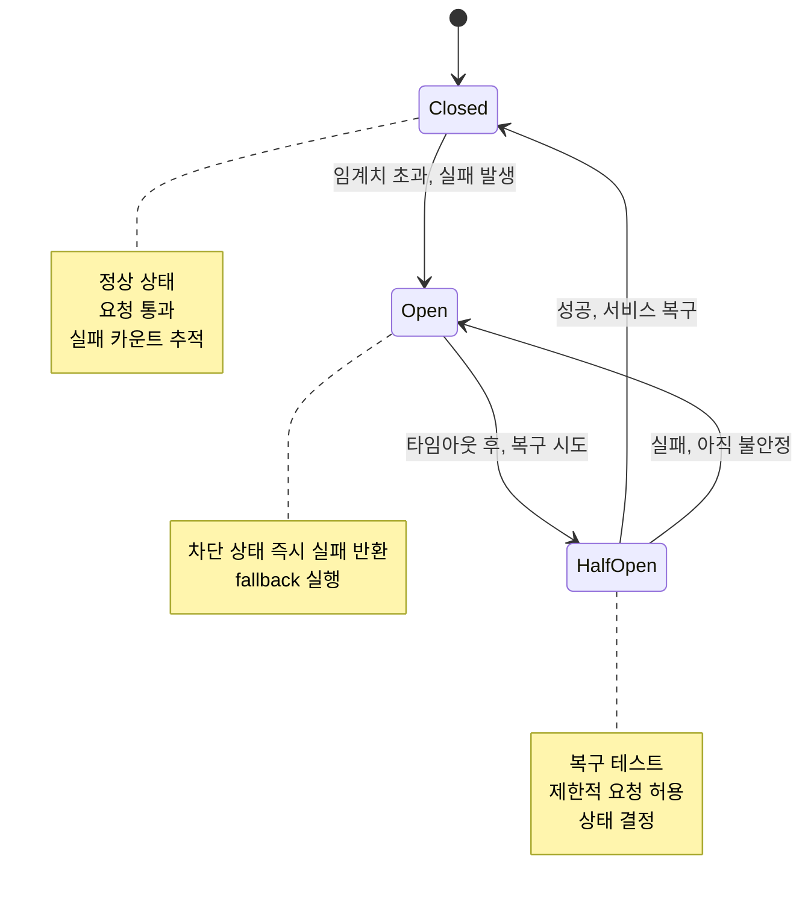

---
tags:
  - DistributedSystems
  - CircuitBreaker
  - FaultTolerance
  - Resilience
  - Guide
---

# 14.4A Circuit Breaker Pattern - 연쇄 장애의 방화벽

## 2022년 2월, 밸런타인데이 재난의 시작

우리 회사가 모놀리스에서 마이크로서비스로 전환한 지 6개월이 지났을 때입니다. 처음엔 "이제 서비스별로 독립 배포할 수 있다!"고 기뻐했지만, 곧 새로운 지옥이 시작되었습니다.

### 🔥 2월 14일 밸런타인데이: 연쇄 장애의 악몽

```bash
# 우리의 마이크로서비스 아키텍처
┌─────────────┐    ┌─────────────┐    ┌─────────────┐
│ User Service│◄───┤Order Service├───►│Payment Svc  │
└─────────────┘    └─────────────┘    └─────────────┘
       │                   │                   │
       ▼                   ▼                   ▼
┌─────────────┐    ┌─────────────┐    ┌─────────────┐
│Profile Svc  │    │Inventory Svc│    │ Email Svc   │
└─────────────┘    └─────────────┘    └─────────────┘

# 밸런타인데이 오후 2시: 트래픽 폭증
Normal Load: 1,000 RPS
Valentine Load: 15,000 RPS (15배!)
```

**오후 2:15 - 첫 번째 도미노: Payment Service 다운**

```python
# Payment Service 로그
[14:15:23] INFO: Processing payment request user_123
[14:15:25] INFO: Processing payment request user_456  
[14:15:27] INFO: Processing payment request user_789
...
[14:15:45] ERROR: Connection pool exhausted! (200/200 connections)
[14:15:46] ERROR: Database connection timeout after 30s
[14:15:47] FATAL: OutOfMemoryError - GC overhead limit exceeded
[14:15:48] SYSTEM: Payment Service CRASHED 💥
```

**오후 2:16 - 두 번째 도미노: 연쇄 장애 시작**

```python
# Order Service가 Payment Service를 계속 호출
def process_order(order_data):
    try:
        # Payment Service 호출 (이미 죽음)
        payment_result = payment_service.charge(
            user_id=order_data['user_id'],
            amount=order_data['amount']
        )
        # 30초 타임아웃까지 대기... 😱
        
    except TimeoutException:
        # 재시도 로직 (더 나쁘게 만듦)
        for i in range(5):
            try:
                payment_result = payment_service.charge(...)
                break
            except:
                time.sleep(2 ** i)  # 지수 백오프
        
        raise PaymentServiceUnavailableException()

# 결과: Order Service도 응답 불가
# 모든 스레드가 Payment Service 호출에서 블록됨
```

**오후 2:20 - 전체 시스템 마비**

```bash
📊 시스템 상태:
- Payment Service: 💀 DEAD
- Order Service: 🐌 99% threads blocked  
- User Service: 🐌 90% threads blocked (Order Service 호출 중)
- Inventory Service: 🐌 85% threads blocked
- Email Service: 🐌 75% threads blocked

💔 사용자 경험:
"주문 버튼을 눌렀는데 30초째 로딩 중..."
"회원가입도 안 돼요!"  
"상품 검색도 안 되네요..."

😭 CEO: "단일 서버였을 땐 이런 일이 없었는데!"
```

이 날 우리는 **분산 시스템의 냉혹한 현실**을 배웠습니다. 그리고 **Circuit Breaker 패턴**을 도입하게 되었습니다.

## ⚡ Circuit Breaker Pattern: 연쇄 장애의 방화벽

### 🔌 Circuit Breaker의 작동 원리

전기 회로의 차단기에서 영감을 받은 패턴입니다:



### 🛠️ Production-Ready Circuit Breaker 구현

```python
import time
import threading
from enum import Enum
from typing import Callable, Any, Optional
from dataclasses import dataclass

class CircuitState(Enum):
    CLOSED = "closed"      # 정상 상태
    OPEN = "open"          # 차단 상태  
    HALF_OPEN = "half_open" # 복구 테스트

@dataclass
class CircuitBreakerConfig:
    failure_threshold: int = 5           # 실패 임계치
    recovery_timeout: float = 60.0       # 복구 시도 간격 (초)
    expected_exception: tuple = (Exception,)  # 감지할 예외 타입
    timeout: float = 30.0               # 호출 타임아웃
    half_open_max_calls: int = 3        # half-open에서 최대 호출 수

class CircuitBreakerError(Exception):
    """Circuit Breaker가 열려있을 때 발생하는 예외"""
    pass

class CircuitBreaker:
    def __init__(self, config: CircuitBreakerConfig):
        self.config = config
        self.state = CircuitState.CLOSED
        self.failure_count = 0
        self.last_failure_time = None
        self.half_open_calls = 0
        self.lock = threading.RLock()  # 스레드 안전성
        
        # 메트릭 수집
        self.total_calls = 0
        self.successful_calls = 0
        self.failed_calls = 0
        self.circuit_open_count = 0
    
    def call(self, func: Callable, *args, fallback: Optional[Callable] = None, **kwargs) -> Any:
        """Circuit Breaker를 통한 함수 호출"""
        with self.lock:
            self.total_calls += 1
            
            # 현재 상태 확인
            current_state = self._get_current_state()
            
            if current_state == CircuitState.OPEN:
                # Circuit이 열려있음 - 즉시 실패
                self.circuit_open_count += 1
                
                if fallback:
                    try:
                        return fallback(*args, **kwargs)
                    except Exception as e:
                        raise CircuitBreakerError(f"Circuit breaker OPEN and fallback failed: {e}")
                else:
                    raise CircuitBreakerError("Circuit breaker OPEN - service unavailable")
            
            # CLOSED 또는 HALF_OPEN 상태에서 호출 시도
            try:
                # 타임아웃과 함께 함수 실행
                result = self._call_with_timeout(func, *args, **kwargs)
                
                # 성공 시 처리
                self._on_success()
                return result
                
            except self.config.expected_exception as e:
                # 예상된 예외 발생 시 처리  
                self._on_failure()
                
                # fallback 실행 시도
                if fallback:
                    try:
                        return fallback(*args, **kwargs)
                    except Exception as fb_error:
                        raise CircuitBreakerError(f"Primary call failed: {e}, Fallback failed: {fb_error}")
                else:
                    raise e
    
    def _get_current_state(self) -> CircuitState:
        """현재 상태 계산"""
        if self.state == CircuitState.CLOSED:
            if self.failure_count >= self.config.failure_threshold:
                self._transition_to_open()
                return CircuitState.OPEN
            return CircuitState.CLOSED
        
        elif self.state == CircuitState.OPEN:
            if self._should_attempt_reset():
                self._transition_to_half_open()
                return CircuitState.HALF_OPEN
            return CircuitState.OPEN
        
        else:  # HALF_OPEN
            return CircuitState.HALF_OPEN
    
    def _should_attempt_reset(self) -> bool:
        """복구 시도 시점인지 확인"""
        return (self.last_failure_time and 
                time.time() - self.last_failure_time >= self.config.recovery_timeout)
    
    def _transition_to_open(self):
        """OPEN 상태로 전환"""
        self.state = CircuitState.OPEN
        self.last_failure_time = time.time()
        print(f"🔴 Circuit Breaker OPENED (failures: {self.failure_count})")
    
    def _transition_to_half_open(self):
        """HALF_OPEN 상태로 전환"""
        self.state = CircuitState.HALF_OPEN  
        self.half_open_calls = 0
        print(f"🟡 Circuit Breaker HALF_OPEN - testing recovery")
    
    def _transition_to_closed(self):
        """CLOSED 상태로 전환"""
        self.state = CircuitState.CLOSED
        self.failure_count = 0
        self.half_open_calls = 0
        print(f"🟢 Circuit Breaker CLOSED - service recovered")
    
    def _on_success(self):
        """호출 성공 시 처리"""
        self.successful_calls += 1
        
        if self.state == CircuitState.HALF_OPEN:
            self.half_open_calls += 1
            if self.half_open_calls >= self.config.half_open_max_calls:
                # 충분한 성공 호출 확인됨 - CLOSED로 전환
                self._transition_to_closed()
        
        elif self.state == CircuitState.CLOSED:
            # 연속 성공 시 실패 카운트 리셋 (점진적 회복)
            self.failure_count = max(0, self.failure_count - 1)
    
    def _on_failure(self):
        """호출 실패 시 처리"""
        self.failed_calls += 1
        self.failure_count += 1
        self.last_failure_time = time.time()
        
        if self.state == CircuitState.HALF_OPEN:
            # HALF_OPEN에서 실패 시 다시 OPEN으로
            self._transition_to_open()
    
    def _call_with_timeout(self, func: Callable, *args, **kwargs) -> Any:
        """타임아웃과 함께 함수 호출"""
        import signal
        
        def timeout_handler(signum, frame):
            raise TimeoutError(f"Function call timed out after {self.config.timeout}s")
        
        # 타임아웃 설정 (Unix 시스템에서만 동작)
        old_handler = signal.signal(signal.SIGALRM, timeout_handler)
        signal.alarm(int(self.config.timeout))
        
        try:
            result = func(*args, **kwargs)
            signal.alarm(0)  # 타임아웃 해제
            return result
        finally:
            signal.signal(signal.SIGALRM, old_handler)
    
    def get_metrics(self) -> dict:
        """메트릭 반환"""
        success_rate = (self.successful_calls / self.total_calls * 100) if self.total_calls > 0 else 0
        
        return {
            'state': self.state.value,
            'total_calls': self.total_calls,
            'successful_calls': self.successful_calls,
            'failed_calls': self.failed_calls,  
            'success_rate': f"{success_rate:.2f}%",
            'failure_count': self.failure_count,
            'circuit_open_count': self.circuit_open_count,
            'last_failure_time': self.last_failure_time
        }

# Circuit Breaker 사용 예시
class PaymentServiceClient:
    def __init__(self):
        self.circuit_breaker = CircuitBreaker(CircuitBreakerConfig(
            failure_threshold=3,
            recovery_timeout=30.0,
            timeout=10.0
        ))
    
    def charge_payment(self, user_id: str, amount: float):
        """결제 처리 (Circuit Breaker 적용)"""
        def primary_call():
            # 실제 Payment Service 호출
            return self._call_payment_api(user_id, amount)
        
        def fallback_call():
            # Fallback: 결제를 큐에 저장하고 나중에 처리
            return self._queue_payment_for_later(user_id, amount)
        
        return self.circuit_breaker.call(
            primary_call,
            fallback=fallback_call
        )
    
    def _call_payment_api(self, user_id: str, amount: float):
        """실제 Payment API 호출"""
        import requests
        
        response = requests.post(
            'https://payment-service/api/charge',
            json={'user_id': user_id, 'amount': amount},
            timeout=10
        )
        
        if response.status_code != 200:
            raise Exception(f"Payment API failed: {response.status_code}")
        
        return response.json()
    
    def _queue_payment_for_later(self, user_id: str, amount: float):
        """Fallback: 결제를 큐에 저장"""
        payment_queue.publish({
            'user_id': user_id,
            'amount': amount,
            'timestamp': time.time(),
            'retry_count': 0
        })
        
        return {
            'status': 'queued',
            'message': '결제가 큐에 저장되었습니다. 잠시 후 처리됩니다.',
            'user_id': user_id
        }

# 실사용 시뮬레이션
def simulate_circuit_breaker():
    print("=== Circuit Breaker 시뮬레이션 ===")
    
    payment_client = PaymentServiceClient()
    
    print(", --- 정상 상황 (Circuit Breaker CLOSED) ---")
    for i in range(3):
        try:
            result = payment_client.charge_payment(f"user_{i}", 100.0)
            print(f"✅ Payment {i}: {result['status']}")
        except Exception as e:
            print(f"❌ Payment {i}: {e}")
    
    print(f", 📊 Metrics: {payment_client.circuit_breaker.get_metrics()}")
    
    print(", --- 장애 상황 시뮬레이션 (Payment Service 다운) ---")
    # Payment Service가 다운되었다고 가정
    original_call = payment_client._call_payment_api
    payment_client._call_payment_api = lambda user_id, amount: exec('raise Exception("Service unavailable")')
    
    for i in range(5):
        try:
            result = payment_client.charge_payment(f"user_{i}", 100.0)
            print(f"✅ Payment {i}: {result['status']}")
        except Exception as e:
            print(f"❌ Payment {i}: {e}")
    
    print(f", 📊 Metrics: {payment_client.circuit_breaker.get_metrics()}")
    
    print(", --- Circuit Breaker OPEN 상태에서 호출 ---")
    for i in range(3):
        try:
            result = payment_client.charge_payment(f"user_{i}", 100.0)
            print(f"✅ Payment {i}: {result['status']} (fallback)")
        except Exception as e:
            print(f"❌ Payment {i}: {e}")
    
    print(f", 📊 Final Metrics: {payment_client.circuit_breaker.get_metrics()}")

# 실행
simulate_circuit_breaker()
```

## 핵심 요점

### 1. 즉시 실패 (Fail Fast)

Circuit Breaker는 장애 서비스에 대해 즉시 실패를 반환하여 시스템 리소스를 보호합니다.

### 2. 자동 복구 감지

Half-Open 상태에서 제한적인 요청을 통해 서비스 복구를 자동으로 감지합니다.

### 3. Fallback 메커니즘

주 서비스 실패 시 대안적인 동작을 제공하여 사용자 경험을 유지합니다.

---

**이전**: [분산 패턴 개요](04-distributed-patterns.md)  
**다음**: [Bulkhead Pattern](04b-bulkhead-pattern.md)에서 리소스 격리를 통한 장애 전파 차단을 학습합니다.
