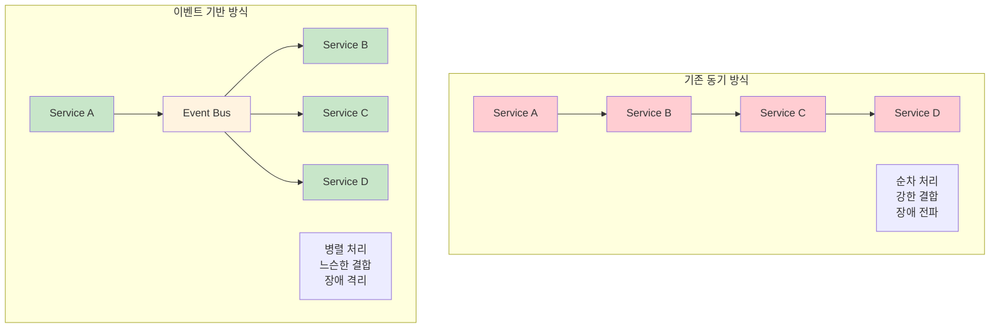

---
tags:
  - DistributedSystems
  - EventDriven
  - EventSourcing
  - MessageQueue
  - Streaming
  - Guide
---

# 14.5 Event-Driven Architecture - 이벤트로 연결되는 느슨한 결합 시스템

## 서론: 2023년 5월, 실시간 추천 시스템을 만든 날

우리 스트리밍 플랫폼에서 "사용자가 영화를 시청하는 순간 실시간으로 맞춤형 추천을 제공하자"는 프로젝트가 시작되었습니다. 문제는 이 기능을 구현하려면 7개의 서로 다른 시스템이 실시간으로 협력해야 한다는 것이었습니다.

### 🎬 기존 아키텍처의 한계

```bash
# 기존 동기 방식 (Request-Response)
사용자가 "어벤져스" 시청 시작
    ↓
🎬 Video Service: 시청 기록 저장
    ↓ (동기 호출)
👤 User Service: 사용자 취향 업데이트  
    ↓ (동기 호출)
🤖 ML Service: 추천 모델 재학습
    ↓ (동기 호출)  
📊 Analytics Service: 통계 업데이트
    ↓ (동기 호출)
📧 Notification Service: 친구들에게 알림
    ↓ (동기 호출)
💎 Badge Service: 시청 뱃지 지급
    ↓ (동기 호출) 
🏆 Ranking Service: 랭킹 업데이트

# 문제점들
총 응답 시간: 2.3초 (각 서비스 0.3초씩)
장애 전파: ML Service 다운 시 전체 시청 불가
강한 결합: 새로운 기능 추가 시 기존 코드 수정 필요
확장성 부족: 사용자 증가 시 모든 서비스에 부하 집중
```

**5월 12일 오후 4시: 시스템 마비**

```python
# Video Service 로그
[16:00:15] INFO: User 12345 started watching "Avengers"
[16:00:15] DEBUG: Calling user-service for preference update...
[16:00:20] ERROR: user-service timeout after 5 seconds
[16:00:20] DEBUG: Retrying user-service call...
[16:00:25] ERROR: user-service timeout after 5 seconds
[16:00:25] FATAL: Unable to record watch event - rolling back
[16:00:25] ERROR: Video playback failed for user 12345

# 결과: ML Service 장애로 아무도 영화를 볼 수 없는 상황 😱
```

**5월 15일: Event-Driven Architecture 도입 결정**

이 문제를 해결하기 위해 우리는 **Event-Driven Architecture**로 시스템을 재구성했습니다.

## 🌊 Event-Driven Architecture의 핵심 개념

### 📡 이벤트 기반 통신 패러다임



## 🚌 Message Queue vs Event Streaming

### 📮 Message Queue 방식 (Apache RabbitMQ)

**특징**: 메시지를 한 번만 소비하는 점대점 통신

```python
import pika
import json
import threading
import time
from typing import Dict, List, Callable

class RabbitMQEventBus:
    """RabbitMQ 기반 이벤트 버스"""
    
    def __init__(self, connection_url="amqp://localhost"):
        self.connection_url = connection_url
        self.connection = None
        self.channel = None
        self.subscribers = {}
        self.connect()
    
    def connect(self):
        """RabbitMQ 연결"""
        self.connection = pika.BlockingConnection(
            pika.URLParameters(self.connection_url)
        )
        self.channel = self.connection.channel()
        print("🐰 Connected to RabbitMQ")
    
    def publish(self, event_type: str, payload: Dict, routing_key: str = ""):
        """이벤트 발행"""
        # Exchange 선언 (Topic 타입 - 라우팅 키 기반)
        self.channel.exchange_declare(
            exchange='events',
            exchange_type='topic',
            durable=True
        )
        
        message = {
            'event_type': event_type,
            'payload': payload,
            'timestamp': time.time()
        }
        
        # 메시지 발행
        self.channel.basic_publish(
            exchange='events',
            routing_key=routing_key or event_type,
            body=json.dumps(message),
            properties=pika.BasicProperties(
                delivery_mode=2  # 메시지 영속화
            )
        )
        
        print(f"📢 Event published: {event_type} (routing_key: {routing_key})")
    
    def subscribe(self, event_pattern: str, handler: Callable, queue_name: str = None):
        """이벤트 구독"""
        if not queue_name:
            queue_name = f"queue_{event_pattern}_{int(time.time())}"
        
        # 큐 선언
        self.channel.queue_declare(queue=queue_name, durable=True)
        
        # 큐를 exchange에 바인딩
        self.channel.queue_bind(
            exchange='events',
            queue=queue_name,
            routing_key=event_pattern
        )
        
        # 메시지 처리 함수
        def callback(ch, method, properties, body):
            try:
                message = json.loads(body)
                print(f"📨 Received: {message['event_type']}")
                
                # 핸들러 실행
                handler(message)
                
                # 메시지 ACK
                ch.basic_ack(delivery_tag=method.delivery_tag)
                
            except Exception as e:
                print(f"❌ Handler error: {e}")
                # NACK - 메시지를 다시 큐에 넣거나 Dead Letter Queue로 전송
                ch.basic_nack(delivery_tag=method.delivery_tag, requeue=False)
        
        # 소비자 설정
        self.channel.basic_qos(prefetch_count=1)  # 한 번에 하나씩 처리
        self.channel.basic_consume(
            queue=queue_name,
            on_message_callback=callback
        )
        
        print(f"🔍 Subscribed to pattern '{event_pattern}' with queue '{queue_name}'")
        
        # 별도 스레드에서 메시지 소비
        def consume():
            self.channel.start_consuming()
        
        consumer_thread = threading.Thread(target=consume, daemon=True)
        consumer_thread.start()

# RabbitMQ를 사용한 영화 스트리밍 서비스
class VideoService:
    """비디오 서비스 (이벤트 발행자)"""
    
    def __init__(self, event_bus: RabbitMQEventBus):
        self.event_bus = event_bus
        self.active_sessions = {}
    
    def start_watching(self, user_id: str, video_id: str, video_title: str):
        """시청 시작 (이벤트 발행)"""
        session_id = f"session_{user_id}_{int(time.time())}"
        
        # 세션 저장 (로컬 상태)
        self.active_sessions[session_id] = {
            'user_id': user_id,
            'video_id': video_id,
            'video_title': video_title,
            'start_time': time.time()
        }
        
        print(f"🎬 User {user_id} started watching '{video_title}'")
        
        # 시청 시작 이벤트 발행
        self.event_bus.publish(
            event_type='video.watch_started',
            payload={
                'user_id': user_id,
                'video_id': video_id,
                'video_title': video_title,
                'session_id': session_id
            },
            routing_key='video.watch_started'
        )
        
        # 즉시 응답 반환 (다른 서비스들은 비동기로 처리)
        return {
            'status': 'success',
            'session_id': session_id,
            'message': 'Video started successfully'
        }

class RecommendationService:
    """추천 서비스 (이벤트 소비자)"""
    
    def __init__(self, event_bus: RabbitMQEventBus):
        self.event_bus = event_bus
        self.user_preferences = {}
        
        # 이벤트 구독
        self.event_bus.subscribe(
            event_pattern='video.watch_started',
            handler=self.handle_watch_started,
            queue_name='recommendation_service_queue'
        )
    
    def handle_watch_started(self, message):
        """시청 시작 이벤트 처리"""
        payload = message['payload']
        user_id = payload['user_id']
        video_title = payload['video_title']
        
        print(f"🤖 Updating recommendations for user {user_id} based on '{video_title}'")
        
        # 사용자 취향 업데이트 (시뮬레이션)
        if user_id not in self.user_preferences:
            self.user_preferences[user_id] = {'genres': [], 'actors': []}
        
        # ML 로직 시뮬레이션 (실제로는 복잡한 추천 알고리즘)
        time.sleep(0.5)  # ML 처리 시간 시뮬레이션
        
        if 'Marvel' in video_title:
            self.user_preferences[user_id]['genres'].append('superhero')
        
        # 추천 업데이트 완료 이벤트 발행
        self.event_bus.publish(
            event_type='recommendation.updated',
            payload={
                'user_id': user_id,
                'recommendations': self.get_recommendations(user_id)
            },
            routing_key='recommendation.updated'
        )
    
    def get_recommendations(self, user_id: str) -> List[str]:
        """사용자 추천 목록 생성"""
        preferences = self.user_preferences.get(user_id, {})
        
        if 'superhero' in preferences.get('genres', []):
            return ['Iron Man', 'Thor', 'Captain America', 'Spider-Man']
        else:
            return ['The Matrix', 'Inception', 'Interstellar', 'The Dark Knight']

class NotificationService:
    """알림 서비스 (이벤트 소비자)"""
    
    def __init__(self, event_bus: RabbitMQEventBus):
        self.event_bus = event_bus
        self.sent_notifications = []
        
        # 여러 이벤트 타입 구독
        self.event_bus.subscribe(
            event_pattern='video.watch_started',
            handler=self.handle_watch_started,
            queue_name='notification_service_queue'
        )
        
        self.event_bus.subscribe(
            event_pattern='recommendation.updated', 
            handler=self.handle_recommendation_updated,
            queue_name='notification_recommendation_queue'
        )
    
    def handle_watch_started(self, message):
        """시청 시작 알림"""
        payload = message['payload']
        user_id = payload['user_id']
        video_title = payload['video_title']
        
        print(f"📧 Sending notification: User {user_id} is watching '{video_title}'")
        
        # 친구들에게 알림 전송 (시뮬레이션)
        notification = {
            'type': 'watch_started',
            'user_id': user_id,
            'message': f"Your friend started watching {video_title}!",
            'timestamp': time.time()
        }
        
        self.sent_notifications.append(notification)
    
    def handle_recommendation_updated(self, message):
        """추천 업데이트 알림"""
        payload = message['payload']
        user_id = payload['user_id']
        recommendations = payload['recommendations']
        
        print(f"📱 Sending push notification: New recommendations for user {user_id}")
        
        notification = {
            'type': 'recommendation_updated',
            'user_id': user_id,
            'message': f"We have new recommendations for you: {', '.join(recommendations[:2])}...",
            'timestamp': time.time()
        }
        
        self.sent_notifications.append(notification)

# 장애 내성을 가진 서비스 (일부 실패해도 시스템 동작)
class AnalyticsService:
    """분석 서비스 (장애 시뮬레이션)"""
    
    def __init__(self, event_bus: RabbitMQEventBus):
        self.event_bus = event_bus
        self.failure_rate = 0.3  # 30% 확률로 실패
        
        self.event_bus.subscribe(
            event_pattern='video.*',  # 모든 비디오 관련 이벤트
            handler=self.handle_video_event,
            queue_name='analytics_service_queue'
        )
    
    def handle_video_event(self, message):
        """비디오 이벤트 분석 (일부러 실패 시뮬레이션)"""
        import random
        
        if random.random() < self.failure_rate:
            print(f"💥 Analytics service failed to process {message['event_type']}")
            raise Exception("Analytics processing failed")
        
        print(f"📊 Analytics processed: {message['event_type']}")

# Message Queue 시뮬레이션  
def simulate_message_queue():
    print("=== Message Queue (RabbitMQ) 시뮬레이션 ===")
    
    # RabbitMQ 연결이 없으면 Mock 사용
    try:
        event_bus = RabbitMQEventBus()
    except Exception:
        print("⚠️  RabbitMQ not available, using mock implementation")
        event_bus = MockEventBus()
    
    # 서비스들 생성
    video_service = VideoService(event_bus)
    recommendation_service = RecommendationService(event_bus)
    notification_service = NotificationService(event_bus)
    analytics_service = AnalyticsService(event_bus)
    
    print("\n--- 영화 시청 시작 ---")
    
    # 사용자들이 영화 시청 시작
    users = [
        ('user123', 'video456', 'Avengers: Endgame'),
        ('user789', 'video123', 'The Dark Knight'),
        ('user456', 'video789', 'Iron Man')
    ]
    
    for user_id, video_id, video_title in users:
        result = video_service.start_watching(user_id, video_id, video_title)
        print(f"✅ {result['message']} (session: {result['session_id']})")
    
    print("\n--- 이벤트 처리 대기 ---")
    time.sleep(3)  # 비동기 이벤트 처리 대기
    
    print(f"\n--- 결과 확인 ---")
    print(f"추천 서비스: {len(recommendation_service.user_preferences)}명의 취향 업데이트")
    print(f"알림 서비스: {len(notification_service.sent_notifications)}개 알림 전송")
    print("📈 Analytics Service: 일부 실패했지만 전체 시스템은 정상 동작")

# Mock Event Bus (RabbitMQ 없을 때 사용)
class MockEventBus:
    def __init__(self):
        self.subscribers = {}
        
    def publish(self, event_type, payload, routing_key=""):
        print(f"📢 [MOCK] Event published: {event_type}")
        # 구독자들에게 전달
        for pattern, handlers in self.subscribers.items():
            if self.matches_pattern(routing_key or event_type, pattern):
                for handler in handlers:
                    try:
                        message = {'event_type': event_type, 'payload': payload}
                        threading.Thread(target=handler, args=(message,), daemon=True).start()
                    except Exception as e:
                        print(f"❌ Handler error: {e}")
    
    def subscribe(self, event_pattern, handler, queue_name=None):
        if event_pattern not in self.subscribers:
            self.subscribers[event_pattern] = []
        self.subscribers[event_pattern].append(handler)
        print(f"🔍 [MOCK] Subscribed to pattern '{event_pattern}'")
    
    def matches_pattern(self, event, pattern):
        # 간단한 패턴 매칭 (실제로는 더 복잡)
        if pattern.endswith('*'):
            return event.startswith(pattern[:-1])
        return event == pattern

# 실행
simulate_message_queue()
```

### 🌊 Event Streaming 방식 (Apache Kafka)

**특징**: 이벤트 스트림을 여러 소비자가 독립적으로 소비

```python
from kafka import KafkaProducer, KafkaConsumer
import json
import threading
import time
from typing import Dict, List

class KafkaEventStream:
    """Kafka 기반 이벤트 스트리밍"""
    
    def __init__(self, bootstrap_servers=['localhost:9092']):
        self.bootstrap_servers = bootstrap_servers
        self.producer = None
        self.consumers = {}
        self.connect()
    
    def connect(self):
        """Kafka 프로듀서 연결"""
        try:
            self.producer = KafkaProducer(
                bootstrap_servers=self.bootstrap_servers,
                value_serializer=lambda v: json.dumps(v).encode('utf-8'),
                key_serializer=lambda k: k.encode('utf-8') if k else None,
                acks='all',  # 모든 복제본에 쓰기 확인
                retries=3,
                batch_size=16384,
                linger_ms=10
            )
            print("🚀 Connected to Kafka")
        except Exception as e:
            print(f"⚠️  Kafka not available: {e}")
            self.producer = None
    
    def publish(self, topic: str, event_data: Dict, key: str = None):
        """이벤트 스트림에 발행"""
        if not self.producer:
            print(f"📢 [MOCK] Publishing to {topic}: {event_data['event_type']}")
            return
        
        message = {
            'event_type': event_data.get('event_type', 'unknown'),
            'payload': event_data.get('payload', {}),
            'timestamp': time.time()
        }
        
        try:
            # 비동기 전송
            future = self.producer.send(
                topic=topic,
                value=message,
                key=key
            )
            
            # 전송 확인 (선택적)
            record_metadata = future.get(timeout=10)
            print(f"📢 Event published to {topic} (partition: {record_metadata.partition}, offset: {record_metadata.offset})")
            
        except Exception as e:
            print(f"❌ Failed to publish event: {e}")
    
    def subscribe(self, topics: List[str], group_id: str, handler):
        """이벤트 스트림 구독"""
        if not self.producer:  # Kafka 사용 불가시 Mock
            print(f"🔍 [MOCK] Subscribed to topics {topics} with group {group_id}")
            return
        
        try:
            consumer = KafkaConsumer(
                *topics,
                bootstrap_servers=self.bootstrap_servers,
                group_id=group_id,
                value_deserializer=lambda m: json.loads(m.decode('utf-8')),
                key_deserializer=lambda k: k.decode('utf-8') if k else None,
                auto_offset_reset='latest',  # 최신 메시지부터
                enable_auto_commit=True
            )
            
            self.consumers[group_id] = consumer
            
            def consume_messages():
                print(f"🔍 Starting consumer {group_id} for topics {topics}")
                
                for message in consumer:
                    try:
                        print(f"📨 [{group_id}] Received from {message.topic}: {message.value['event_type']}")
                        
                        # 핸들러 실행
                        handler(message.value, message.topic, message.partition, message.offset)
                        
                    except Exception as e:
                        print(f"❌ [{group_id}] Handler error: {e}")
            
            # 별도 스레드에서 메시지 소비
            consumer_thread = threading.Thread(target=consume_messages, daemon=True)
            consumer_thread.start()
            
        except Exception as e:
            print(f"❌ Failed to create consumer {group_id}: {e}")

# Kafka를 사용한 실시간 스트리밍 플랫폼
class StreamingVideoService:
    """스트리밍 비디오 서비스"""
    
    def __init__(self, event_stream: KafkaEventStream):
        self.event_stream = event_stream
        self.viewing_sessions = {}
    
    def start_streaming(self, user_id: str, video_id: str, quality: str = "1080p"):
        """스트리밍 시작"""
        session_id = f"stream_{user_id}_{int(time.time())}"
        
        session_data = {
            'user_id': user_id,
            'video_id': video_id,
            'quality': quality,
            'start_time': time.time(),
            'session_id': session_id
        }
        
        self.viewing_sessions[session_id] = session_data
        
        print(f"🎥 Streaming started: {video_id} for user {user_id} in {quality}")
        
        # 스트리밍 시작 이벤트 발행 (파티셔닝 키: user_id)
        self.event_stream.publish(
            topic='video-events',
            event_data={
                'event_type': 'streaming.started',
                'payload': session_data
            },
            key=user_id  # 같은 사용자의 이벤트는 같은 파티션으로
        )
        
        return {'status': 'success', 'session_id': session_id}
    
    def update_quality(self, session_id: str, new_quality: str):
        """스트리밍 품질 변경"""
        if session_id not in self.viewing_sessions:
            raise ValueError(f"Session {session_id} not found")
        
        session = self.viewing_sessions[session_id]
        old_quality = session['quality']
        session['quality'] = new_quality
        
        print(f"📊 Quality changed: {old_quality} → {new_quality} for session {session_id}")
        
        # 품질 변경 이벤트 발행
        self.event_stream.publish(
            topic='video-events',
            event_data={
                'event_type': 'streaming.quality_changed',
                'payload': {
                    'session_id': session_id,
                    'user_id': session['user_id'],
                    'old_quality': old_quality,
                    'new_quality': new_quality
                }
            },
            key=session['user_id']
        )
    
    def send_heartbeat(self, session_id: str):
        """하트비트 전송 (시청 진행 상황)"""
        if session_id not in self.viewing_sessions:
            return
        
        session = self.viewing_sessions[session_id]
        
        # 하트비트 이벤트 발행 (고빈도)
        self.event_stream.publish(
            topic='video-heartbeat',  # 별도 토픽 (고빈도 이벤트)
            event_data={
                'event_type': 'streaming.heartbeat',
                'payload': {
                    'session_id': session_id,
                    'user_id': session['user_id'],
                    'current_time': time.time() - session['start_time']
                }
            },
            key=session['user_id']
        )

class RealTimeAnalyticsService:
    """실시간 분석 서비스"""
    
    def __init__(self, event_stream: KafkaEventStream):
        self.event_stream = event_stream
        self.metrics = {
            'concurrent_viewers': 0,
            'quality_distribution': {},
            'user_sessions': {}
        }
        
        # 여러 토픽 구독
        self.event_stream.subscribe(
            topics=['video-events', 'video-heartbeat'],
            group_id='realtime_analytics',
            handler=self.process_event
        )
    
    def process_event(self, message, topic, partition, offset):
        """실시간 이벤트 처리"""
        event_type = message['event_type']
        payload = message['payload']
        
        if event_type == 'streaming.started':
            self._handle_streaming_started(payload)
        elif event_type == 'streaming.quality_changed':
            self._handle_quality_changed(payload)
        elif event_type == 'streaming.heartbeat':
            self._handle_heartbeat(payload)
    
    def _handle_streaming_started(self, payload):
        """스트리밍 시작 처리"""
        self.metrics['concurrent_viewers'] += 1
        
        quality = payload['quality']
        if quality not in self.metrics['quality_distribution']:
            self.metrics['quality_distribution'][quality] = 0
        self.metrics['quality_distribution'][quality] += 1
        
        self.metrics['user_sessions'][payload['session_id']] = payload
        
        print(f"📊 Analytics: Concurrent viewers = {self.metrics['concurrent_viewers']}")
    
    def _handle_quality_changed(self, payload):
        """품질 변경 처리"""
        old_quality = payload['old_quality']
        new_quality = payload['new_quality']
        
        # 품질 분포 업데이트
        self.metrics['quality_distribution'][old_quality] -= 1
        if new_quality not in self.metrics['quality_distribution']:
            self.metrics['quality_distribution'][new_quality] = 0
        self.metrics['quality_distribution'][new_quality] += 1
        
        print(f"📊 Quality distribution updated: {self.metrics['quality_distribution']}")
    
    def _handle_heartbeat(self, payload):
        """하트비트 처리 (세션 활성도 추적)"""
        session_id = payload['session_id']
        if session_id in self.metrics['user_sessions']:
            self.metrics['user_sessions'][session_id]['last_heartbeat'] = time.time()
    
    def get_real_time_metrics(self):
        """실시간 메트릭 조회"""
        # 비활성 세션 정리 (마지막 하트비트 후 30초 경과)
        current_time = time.time()
        inactive_sessions = []
        
        for session_id, session_data in self.metrics['user_sessions'].items():
            if current_time - session_data.get('last_heartbeat', 0) > 30:
                inactive_sessions.append(session_id)
        
        for session_id in inactive_sessions:
            del self.metrics['user_sessions'][session_id]
            self.metrics['concurrent_viewers'] -= 1
        
        return self.metrics.copy()

class PersonalizationService:
    """개인화 서비스 (ML 기반)"""
    
    def __init__(self, event_stream: KafkaEventStream):
        self.event_stream = event_stream
        self.user_profiles = {}
        
        # 이벤트 구독 (별도 컨슈머 그룹)
        self.event_stream.subscribe(
            topics=['video-events'],
            group_id='personalization_ml',
            handler=self.update_user_profile
        )
    
    def update_user_profile(self, message, topic, partition, offset):
        """사용자 프로필 업데이트"""
        event_type = message['event_type']
        
        if event_type == 'streaming.started':
            payload = message['payload']
            user_id = payload['user_id']
            video_id = payload['video_id']
            quality = payload['quality']
            
            # 사용자 프로필 업데이트
            if user_id not in self.user_profiles:
                self.user_profiles[user_id] = {
                    'watched_videos': [],
                    'preferred_quality': '1080p',
                    'viewing_hours': 0
                }
            
            profile = self.user_profiles[user_id]
            profile['watched_videos'].append(video_id)
            profile['preferred_quality'] = quality  # 최근 선택한 품질로 업데이트
            
            # ML 모델 업데이트 (시뮬레이션)
            print(f"🤖 Updating ML model for user {user_id} (watched: {len(profile['watched_videos'])} videos)")
            
            # 개인화된 추천 생성 후 이벤트 발행
            recommendations = self.generate_recommendations(user_id)
            
            self.event_stream.publish(
                topic='recommendation-events',
                event_data={
                    'event_type': 'recommendation.updated',
                    'payload': {
                        'user_id': user_id,
                        'recommendations': recommendations,
                        'model_version': 'v2.1'
                    }
                },
                key=user_id
            )
    
    def generate_recommendations(self, user_id: str) -> List[str]:
        """개인화된 추천 생성"""
        profile = self.user_profiles.get(user_id, {})
        watched_count = len(profile.get('watched_videos', []))
        
        # 간단한 추천 로직
        if watched_count > 5:
            return ['Premium Content A', 'Premium Content B', 'Premium Content C']
        else:
            return ['Popular Content 1', 'Popular Content 2', 'Popular Content 3']

# Event Streaming 시뮬레이션
def simulate_event_streaming():
    print("=== Event Streaming (Kafka) 시뮬레이션 ===")
    
    # Kafka 연결
    event_stream = KafkaEventStream()
    
    # 서비스들 생성
    video_service = StreamingVideoService(event_stream)
    analytics_service = RealTimeAnalyticsService(event_stream)
    personalization_service = PersonalizationService(event_stream)
    
    print("\n--- 스트리밍 시작 ---")
    
    # 여러 사용자가 동시 스트리밍 시작
    users = [
        ('alice', 'video_marvel_endgame', '4K'),
        ('bob', 'video_dark_knight', '1080p'),
        ('carol', 'video_inception', '720p'),
        ('david', 'video_matrix', '1080p')
    ]
    
    sessions = []
    for user_id, video_id, quality in users:
        result = video_service.start_streaming(user_id, video_id, quality)
        sessions.append(result['session_id'])
        time.sleep(0.1)  # 약간의 시간차
    
    print("\n--- 스트리밍 중 이벤트들 ---")
    
    # 품질 변경
    video_service.update_quality(sessions[0], '1080p')  # Alice: 4K → 1080p
    video_service.update_quality(sessions[2], '1080p')  # Carol: 720p → 1080p
    
    # 하트비트 전송 (시뮬레이션)
    for _ in range(3):
        for session_id in sessions:
            video_service.send_heartbeat(session_id)
        time.sleep(1)
    
    print("\n--- 이벤트 처리 대기 ---")
    time.sleep(2)
    
    print("\n--- 실시간 메트릭 확인 ---")
    metrics = analytics_service.get_real_time_metrics()
    print(f"동시 시청자: {metrics['concurrent_viewers']}명")
    print(f"품질 분포: {metrics['quality_distribution']}")
    print(f"개인화 프로필: {len(personalization_service.user_profiles)}명")

# 실행
simulate_event_streaming()
```

## 📊 Event Sourcing: 모든 변경을 이벤트로 저장

### 🗃️ Event Store 구현

모든 데이터 변경을 이벤트로 저장하여 완전한 감사 추적과 시점별 상태 복원을 제공:

```python
from dataclasses import dataclass
from datetime import datetime
from typing import List, Dict, Any, Optional
import json
import threading

@dataclass
class DomainEvent:
    """도메인 이벤트 기본 클래스"""
    aggregate_id: str
    event_type: str
    event_data: Dict[str, Any]
    event_version: int
    timestamp: datetime
    correlation_id: str = None
    causation_id: str = None

class EventStore:
    """이벤트 저장소"""
    
    def __init__(self):
        self.events: Dict[str, List[DomainEvent]] = {}  # aggregate_id -> events
        self.global_sequence = 0
        self.snapshots: Dict[str, Dict] = {}  # aggregate_id -> snapshot
        self.lock = threading.RLock()
        self.subscribers = []
    
    def append_events(self, aggregate_id: str, expected_version: int, events: List[DomainEvent]):
        """이벤트 추가 (낙관적 동시성 제어)"""
        with self.lock:
            current_events = self.events.get(aggregate_id, [])
            current_version = len(current_events)
            
            # 버전 충돌 검사
            if expected_version != current_version:
                raise ConcurrencyException(
                    f"Expected version {expected_version}, but current version is {current_version}"
                )
            
            # 이벤트 추가
            if aggregate_id not in self.events:
                self.events[aggregate_id] = []
            
            for i, event in enumerate(events):
                event.event_version = current_version + i + 1
                self.events[aggregate_id].append(event)
                self.global_sequence += 1
                
                print(f"📝 Event stored: {event.event_type} v{event.event_version} for {aggregate_id}")
            
            # 구독자들에게 알림
            for event in events:
                self._notify_subscribers(event)
    
    def get_events(self, aggregate_id: str, from_version: int = 0) -> List[DomainEvent]:
        """특정 Aggregate의 이벤트 조회"""
        events = self.events.get(aggregate_id, [])
        return [e for e in events if e.event_version > from_version]
    
    def save_snapshot(self, aggregate_id: str, snapshot: Dict[str, Any], version: int):
        """스냅샷 저장 (성능 최적화)"""
        self.snapshots[aggregate_id] = {
            'data': snapshot,
            'version': version,
            'timestamp': datetime.now()
        }
        print(f"📸 Snapshot saved for {aggregate_id} at version {version}")
    
    def get_snapshot(self, aggregate_id: str) -> Optional[Dict]:
        """스냅샷 조회"""
        return self.snapshots.get(aggregate_id)
    
    def subscribe(self, handler):
        """이벤트 구독"""
        self.subscribers.append(handler)
    
    def _notify_subscribers(self, event: DomainEvent):
        """구독자들에게 이벤트 알림"""
        for subscriber in self.subscribers:
            try:
                threading.Thread(
                    target=subscriber,
                    args=(event,),
                    daemon=True
                ).start()
            except Exception as e:
                print(f"❌ Subscriber notification failed: {e}")

class ConcurrencyException(Exception):
    """동시성 충돌 예외"""
    pass

# Event Sourcing을 사용한 은행 계좌 도메인
class BankAccount:
    """은행 계좌 Aggregate"""
    
    def __init__(self, account_id: str):
        self.account_id = account_id
        self.balance = 0.0
        self.is_active = True
        self.overdraft_limit = 0.0
        self.version = 0
        self.uncommitted_events: List[DomainEvent] = []
    
    @classmethod
    def create_account(cls, account_id: str, initial_deposit: float, overdraft_limit: float = 0.0):
        """새 계좌 생성"""
        account = cls(account_id)
        
        # 계좌 생성 이벤트 추가
        event = DomainEvent(
            aggregate_id=account_id,
            event_type="AccountCreated",
            event_data={
                'initial_deposit': initial_deposit,
                'overdraft_limit': overdraft_limit
            },
            event_version=0,
            timestamp=datetime.now()
        )
        
        account._apply_event(event)
        return account
    
    def deposit(self, amount: float, description: str = ""):
        """입금"""
        if amount <= 0:
            raise ValueError("Deposit amount must be positive")
        
        event = DomainEvent(
            aggregate_id=self.account_id,
            event_type="MoneyDeposited",
            event_data={
                'amount': amount,
                'description': description,
                'balance_before': self.balance
            },
            event_version=0,  # 저장시 설정됨
            timestamp=datetime.now()
        )
        
        self._apply_event(event)
    
    def withdraw(self, amount: float, description: str = ""):
        """출금"""
        if amount <= 0:
            raise ValueError("Withdrawal amount must be positive")
        
        # 비즈니스 로직: 잔고 + 마이너스 한도 확인
        available_balance = self.balance + self.overdraft_limit
        if amount > available_balance:
            raise InsufficientFundsException(
                f"Insufficient funds. Available: {available_balance}, Requested: {amount}"
            )
        
        event = DomainEvent(
            aggregate_id=self.account_id,
            event_type="MoneyWithdrawn",
            event_data={
                'amount': amount,
                'description': description,
                'balance_before': self.balance
            },
            event_version=0,
            timestamp=datetime.now()
        )
        
        self._apply_event(event)
    
    def close_account(self):
        """계좌 해지"""
        if not self.is_active:
            raise ValueError("Account is already closed")
        
        if self.balance < 0:
            raise ValueError("Cannot close account with negative balance")
        
        event = DomainEvent(
            aggregate_id=self.account_id,
            event_type="AccountClosed",
            event_data={
                'final_balance': self.balance
            },
            event_version=0,
            timestamp=datetime.now()
        )
        
        self._apply_event(event)
    
    def _apply_event(self, event: DomainEvent):
        """이벤트 적용 (상태 변경)"""
        if event.event_type == "AccountCreated":
            self.balance = event.event_data['initial_deposit']
            self.overdraft_limit = event.event_data['overdraft_limit']
            self.is_active = True
            
        elif event.event_type == "MoneyDeposited":
            self.balance += event.event_data['amount']
            
        elif event.event_type == "MoneyWithdrawn":
            self.balance -= event.event_data['amount']
            
        elif event.event_type == "AccountClosed":
            self.is_active = False
        
        self.uncommitted_events.append(event)
    
    def mark_events_as_committed(self):
        """이벤트 커밋 표시"""
        self.version += len(self.uncommitted_events)
        self.uncommitted_events.clear()
    
    def get_uncommitted_events(self) -> List[DomainEvent]:
        """미커밋 이벤트 조회"""
        return self.uncommitted_events.copy()
    
    @classmethod
    def from_history(cls, account_id: str, events: List[DomainEvent]):
        """이벤트 히스토리로부터 Aggregate 재구성"""
        account = cls(account_id)
        
        for event in events:
            account._apply_event_without_recording(event)
        
        account.version = len(events)
        account.uncommitted_events.clear()
        return account
    
    def _apply_event_without_recording(self, event: DomainEvent):
        """이벤트 적용 (기록 없이 - 히스토리 재구성용)"""
        if event.event_type == "AccountCreated":
            self.balance = event.event_data['initial_deposit']
            self.overdraft_limit = event.event_data['overdraft_limit']
            self.is_active = True
            
        elif event.event_type == "MoneyDeposited":
            self.balance += event.event_data['amount']
            
        elif event.event_type == "MoneyWithdrawn":
            self.balance -= event.event_data['amount']
            
        elif event.event_type == "AccountClosed":
            self.is_active = False

class InsufficientFundsException(Exception):
    pass

# Repository 패턴 with Event Sourcing
class EventSourcedAccountRepository:
    """Event Sourcing 기반 계좌 리포지토리"""
    
    def __init__(self, event_store: EventStore):
        self.event_store = event_store
    
    def save(self, account: BankAccount):
        """계좌 저장 (이벤트 저장)"""
        uncommitted_events = account.get_uncommitted_events()
        
        if uncommitted_events:
            self.event_store.append_events(
                account.account_id,
                account.version,
                uncommitted_events
            )
            account.mark_events_as_committed()
    
    def get_by_id(self, account_id: str) -> Optional[BankAccount]:
        """ID로 계좌 조회 (이벤트 재구성)"""
        # 스냅샷 확인
        snapshot = self.event_store.get_snapshot(account_id)
        
        if snapshot:
            # 스냅샷이 있으면 스냅샷 이후 이벤트만 조회
            account = BankAccount(account_id)
            account.balance = snapshot['data']['balance']
            account.is_active = snapshot['data']['is_active']
            account.overdraft_limit = snapshot['data']['overdraft_limit']
            account.version = snapshot['version']
            
            # 스냅샷 이후 이벤트들 적용
            events_after_snapshot = self.event_store.get_events(account_id, snapshot['version'])
            for event in events_after_snapshot:
                account._apply_event_without_recording(event)
            
            account.version = snapshot['version'] + len(events_after_snapshot)
        else:
            # 스냅샷이 없으면 모든 이벤트로 재구성
            events = self.event_store.get_events(account_id)
            
            if not events:
                return None
                
            account = BankAccount.from_history(account_id, events)
        
        account.uncommitted_events.clear()
        return account
    
    def create_snapshot(self, account_id: str):
        """스냅샷 생성 (성능 최적화)"""
        account = self.get_by_id(account_id)
        if account:
            snapshot_data = {
                'balance': account.balance,
                'is_active': account.is_active,
                'overdraft_limit': account.overdraft_limit
            }
            
            self.event_store.save_snapshot(account_id, snapshot_data, account.version)

# Event Sourcing 시뮬레이션
def simulate_event_sourcing():
    print("=== Event Sourcing 시뮬레이션 ===")
    
    # Event Store와 Repository 생성
    event_store = EventStore()
    account_repo = EventSourcedAccountRepository(event_store)
    
    print("\n--- 계좌 생성 및 거래 ---")
    
    # 새 계좌 생성
    account = BankAccount.create_account("ACC001", initial_deposit=1000.0, overdraft_limit=500.0)
    account_repo.save(account)
    
    print(f"✅ 계좌 생성: ACC001, 초기 잔고: $1000")
    
    # 거래 실행
    transactions = [
        ('deposit', 500.0, '급여 입금'),
        ('withdraw', 200.0, 'ATM 출금'),
        ('withdraw', 800.0, '임대료 지불'),  
        ('deposit', 300.0, '환급'),
        ('withdraw', 1200.0, '대출 상환')  # 마이너스 한도 사용
    ]
    
    for transaction_type, amount, description in transactions:
        try:
            if transaction_type == 'deposit':
                account.deposit(amount, description)
            else:
                account.withdraw(amount, description)
            
            account_repo.save(account)
            print(f"✅ {transaction_type.title()}: ${amount} - {description} (잔고: ${account.balance})")
            
        except Exception as e:
            print(f"❌ {transaction_type.title()} 실패: {e}")
    
    print(f"\n현재 잔고: ${account.balance}")
    
    print("\n--- 이벤트 히스토리 조회 ---")
    events = event_store.get_events("ACC001")
    for event in events:
        print(f"📝 {event.timestamp.strftime('%H:%M:%S')} - {event.event_type}: {event.event_data}")
    
    print("\n--- 특정 시점 상태 복원 ---")
    # 처음 3개 이벤트만으로 상태 복원
    partial_events = events[:3]
    past_account = BankAccount.from_history("ACC001", partial_events)
    print(f"📅 3번째 이벤트 시점 잔고: ${past_account.balance}")
    
    print("\n--- 스냅샷 생성 및 활용 ---")
    account_repo.create_snapshot("ACC001")
    
    # 스냅샷 기반으로 계좌 재구성
    recovered_account = account_repo.get_by_id("ACC001")
    print(f"📸 스냅샷 기반 복구 잔고: ${recovered_account.balance}")
    
    print("\n--- 동시성 테스트 ---")
    try:
        # 동시에 두 개의 거래 시도 (버전 충돌)
        account1 = account_repo.get_by_id("ACC001")
        account2 = account_repo.get_by_id("ACC001")
        
        account1.deposit(100.0, "Transaction 1")
        account2.deposit(200.0, "Transaction 2")
        
        account_repo.save(account1)  # 성공
        account_repo.save(account2)  # 버전 충돌로 실패해야 함
        
    except ConcurrencyException as e:
        print(f"✅ 동시성 충돌 감지: {e}")

# 실행
simulate_event_sourcing()
```

## 💡 Event-Driven Architecture에서 배운 핵심 교훈

### 1. 동기 vs 비동기의 트레이드오프

```bash
🚀 비동기 이벤트 처리의 장점:
- 높은 처리량과 확장성
- 서비스 간 느슨한 결합
- 장애 격리와 내성
- 새로운 기능 추가 용이

⚠️ 비동기의 복잡성:
- 최종 일관성 (Eventual Consistency)
- 이벤트 순서 보장 어려움
- 디버깅과 추적의 복잡성
- 중복 처리 가능성
```

### 2. Message Queue vs Event Streaming 선택

```bash
📮 Message Queue (RabbitMQ):
✅ 적합한 경우: 작업 큐, 트랜잭션 처리, 순서 보장 필요
✅ 장점: 메시지 보장, 라우팅 유연성, 백프레셔 처리
❌ 단점: 메시지 소모 후 사라짐, 재처리 어려움

🌊 Event Streaming (Kafka):  
✅ 적합한 경우: 실시간 분석, 이벤트 소싱, 다중 소비자
✅ 장점: 이벤트 보존, 재처리 가능, 높은 처리량
❌ 단점: 복잡한 설정, 저장소 용량 필요
```

### 3. Event Sourcing의 강력함과 복잡성

```bash
💪 Event Sourcing 장점:
- 완전한 감사 추적
- 시점별 상태 복원 가능
- 비즈니스 로직의 명확한 표현
- 확장 가능한 읽기 모델

⚠️ Event Sourcing 도전과제:
- 이벤트 스키마 진화
- 스냅샷 관리
- 쿼리의 복잡성
- 개발자 학습 곡선
```

### 4. 실무 적용 가이드라인

```python
# 언제 Event-Driven을 사용할까?
✅ 사용하기 좋은 경우:
- 마이크로서비스 간 통신
- 실시간 알림 시스템
- 데이터 파이프라인
- 감사와 로깅
- 비즈니스 이벤트 추적

❌ 피해야 할 경우:
- 단순한 CRUD 애플리케이션
- 강한 일관성이 필수인 시스템
- 실시간 응답이 중요한 인터페이스
- 팀의 기술 역량이 부족한 경우
```

## 🎯 Event-Driven Architecture 성숙도 모델

### Level 1: Event Notification

```bash
📢 기본 레벨: 단순 이벤트 알림
특징:
- 서비스 간 상태 변경 알림
- 동기 호출 대신 비동기 이벤트
- 기본적인 디커플링

예시:
UserService → UserCreated 이벤트 → EmailService가 환영 이메일 발송
```

### Level 2: Event-Carried State Transfer

```bash
📦 중급 레벨: 이벤트에 상태 정보 포함
특징:
- 이벤트에 필요한 모든 데이터 포함
- 수신 서비스가 외부 호출 없이 처리 가능
- 네트워크 트래픽 감소

예시:
OrderCreated 이벤트에 사용자 정보, 상품 정보 모두 포함
```

### Level 3: Event Sourcing

```bash
🗄️ 고급 레벨: 이벤트가 유일한 진실의 원천
특징:
- 모든 상태 변경을 이벤트로 저장
- 언제든 과거 상태 복원 가능
- 완벽한 감사 추적

예시:
AccountCreated, MoneyDeposited, MoneyWithdrawn 이벤트로 계좌 잔고 관리
```

## 🎯 다음 단계

Event-Driven Architecture의 핵심을 마스터했습니다. 이제 **14장 Distributed Systems**의 모든 주제를 다뤘으니, 실전에서 이런 패턴들을 조합해서 사용하는 방법을 연습해보시기 바랍니다.

"이벤트는 시스템을 연결하는 혈관입니다. 적절한 이벤트 설계로 확장 가능하고 유지보수 가능한 시스템을 만들 수 있습니다!" 🌊⚡
