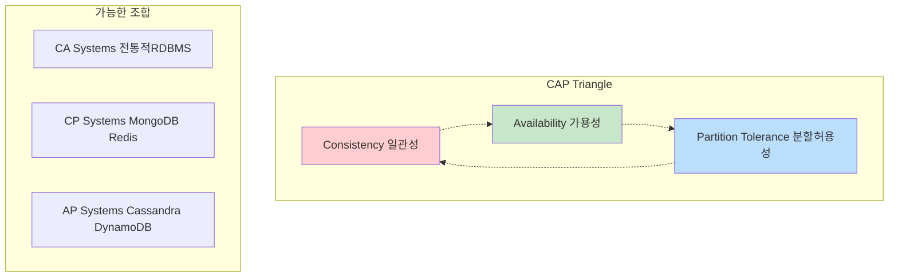
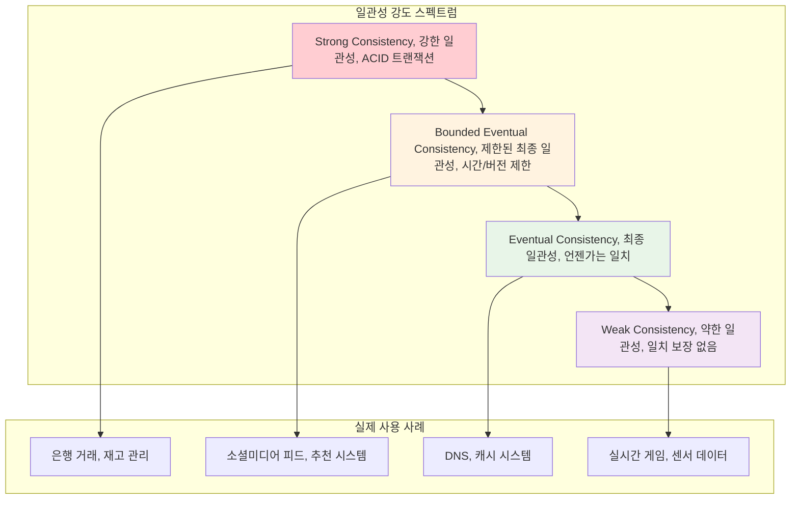
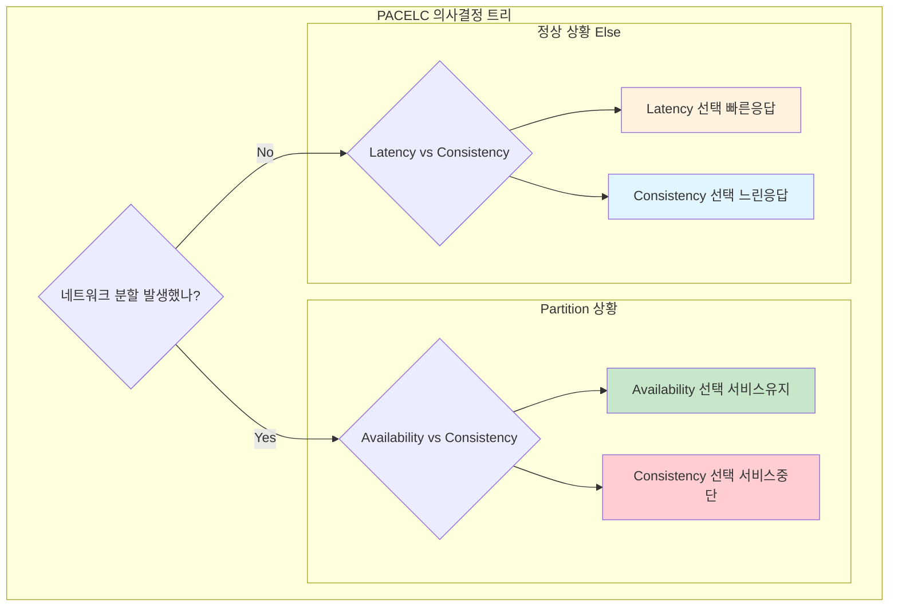

---
tags:
  - CAP정리
  - PACELC
  - balanced
  - fundamentals
  - medium-read
  - 가용성
  - 분산시스템
  - 분할허용성
  - 일관성
difficulty: FUNDAMENTALS
learning_time: "4-6시간"
main_topic: "분산 시스템"
priority_score: 5
---

# 14.1 분산 시스템 기초 이론 - CAP 정리와 일관성의 과학

## 서론: 2019년 11월 15일, CAP 정리를 몸으로 깨달은 날

제가 스타트업 CTO로 일할 때 겪었던 실제 상황입니다. 그날은 Black Friday였고, 우리 이커머스 플랫폼에는 평소의 20배 트래픽이 몰려들었습니다.

### 🔥 새벽 2시: 완벽했던 단일 데이터베이스의 몰락

```bash
# 평소 우리 시스템 (단일 PostgreSQL)
┌─────────────────┐
│   Web Servers   │ ← 평소 트래픽: 1,000 RPS
│   (Scale-out)   │
└─────┬───────────┘
      │
┌─────▼───────────┐
│   PostgreSQL    │ ← 단일점: 모든 읽기/쓰기
│   (Single)      │
└─────────────────┘

# Black Friday 상황
트래픽: 1,000 RPS → 20,000 RPS (20배 증가!)

# 데이터베이스 상황
$ pg_stat_activity
active_connections: 995/1000  # 거의 한계
avg_query_time: 15.3초        # 평소 0.1초
lock_waiting: 450개 쿼리      # 데드락 지옥
```

**새벽 2:30 - 첫 번째 선택: 읽기 복제본 추가**

```bash
# Master-Slave Replication 긴급 도입
    ┌─────────┐
    │ Master  │◄─── 모든 쓰기
    │   DB    │
    └────┬────┘
         │ Async Replication
    ┌────▼────┐
    │ Slave   │◄─── 모든 읽기  
    │   DB    │
    └─────────┘

# 설정
$ postgresql.conf
wal_level = replica
max_wal_senders = 3

$ recovery.conf (Slave)
standby_mode = 'on'
primary_conninfo = 'host=master-db port=5432'
```

**새벽 3:00 - 일관성의 악몽이 시작되다**

```python
# 고객의 주문 과정
def place_order(user_id, item_id):
    # 1. 재고 확인 (Slave DB에서 읽기)
    stock = read_from_slave("SELECT stock FROM items WHERE id = %s", item_id)
    print(f"Available stock: {stock}")  # 출력: 5개
    
    if stock > 0:
        # 2. 주문 생성 (Master DB에 쓰기)
        order_id = write_to_master("""
            INSERT INTO orders (user_id, item_id, quantity) 
            VALUES (%s, %s, 1)
        """, user_id, item_id)
        
        # 3. 재고 감소 (Master DB에 쓰기)  
        write_to_master("""
            UPDATE items SET stock = stock - 1 WHERE id = %s
        """, item_id)
        
        return order_id

# 실제 실행 결과
order1 = place_order(123, "iPhone")  # 성공 (재고: 5→4)
order2 = place_order(456, "iPhone")  # 성공 (재고: 4→3) 
order3 = place_order(789, "iPhone")  # 성공 (재고: 3→2)

# 하지만 Slave DB는 아직 복제 지연 중...
# Replication Lag: 3-5초

# 동시에 들어온 추가 주문들
order4 = place_order(111, "iPhone")  # Slave에서 stock=5 읽음 → 성공!
order5 = place_order(222, "iPhone")  # Slave에서 stock=5 읽음 → 성공!
order6 = place_order(333, "iPhone")  # Slave에서 stock=5 읽음 → 성공!

# 😱 결과: 재고 5개인데 6개가 팔렸다!
```

**새벽 3:30 - 고객 컴플레인 폭발**

```bash
📞 고객서비스팀: "주문했는데 재고가 없다고 취소 메일이 왔어요!"
📞 고객서비스팀: "결제는 됐는데 상품이 안 온다고 해요!"
📞 CEO: "이게 뭔 상황이야? 브랜드 이미지가 망가져!"
```

이때 저는 **CAP 정리**를 이론이 아닌 현실로 마주했습니다.

## CAP 정리: 분산 시스템의 근본적 제약

### 🎯 CAP 정리란?

**Eric Brewer의 CAP 정리 (2000년)**:
> 분산 시스템에서 다음 세 가지 중 **최대 두 가지만** 동시에 보장할 수 있다.



### 🔍 각 요소의 정확한 의미

#### Consistency (일관성)

```bash
# Strong Consistency: 모든 읽기가 최신 쓰기를 반영
Time: 0ms → Write(x=1) to Node A
Time: 1ms → Read(x) from Node B → Returns: 1 ✅

# Weak Consistency: 일시적으로 다른 값 반환 가능
Time: 0ms → Write(x=1) to Node A  
Time: 1ms → Read(x) from Node B → Returns: 0 (old value) ⚠️
Time: 5ms → Read(x) from Node B → Returns: 1 ✅
```

#### Availability (가용성)

```bash
# High Availability: 시스템이 항상 응답
$ curl api.service.com/users/123
HTTP 200 OK  # 항상 응답 (장애 상황에서도)

# vs. 일관성 우선 시스템
$ curl api.service.com/users/123  
HTTP 503 Service Unavailable  # 일관성을 위해 서비스 중단
```

#### Partition Tolerance (분할 허용성)

```bash
# 네트워크 분할 상황
┌─────────┐    X    ┌─────────┐
│ Node A  │ <----> │ Node B  │
│ (Seoul) │ Network │ (Busan) │
│         │ Failure │         │
└─────────┘    X    └─────────┘

# 분할 허용성 있음: 각 노드가 독립적으로 계속 서비스
# 분할 허용성 없음: 전체 시스템 중단
```

## 🎭 CAP의 현실적 적용: 내가 선택한 길

### 선택 1: CP 시스템 (Consistency + Partition tolerance)

**결정**: "일관성이 최우선이다. 재고 오버셀링은 절대 안 된다!"

```python
# CP 시스템 구현: 강한 일관성 보장
class CPInventorySystem:
    def __init__(self):
        self.master_db = MasterDatabase()
        self.slave_dbs = [SlaveDB1(), SlaveDB2()]
        
    def place_order(self, user_id, item_id):
        # 모든 읽기/쓰기를 Master에서만 수행
        with self.master_db.transaction():
            # 1. 재고 확인 (Master에서만)
            stock = self.master_db.execute("""
                SELECT stock FROM items WHERE id = %s FOR UPDATE
            """, item_id)  # 비관적 락으로 일관성 보장
            
            if stock <= 0:
                raise OutOfStockException("재고가 없습니다")
                
            # 2. 재고 감소
            self.master_db.execute("""
                UPDATE items SET stock = stock - 1 WHERE id = %s
            """, item_id)
            
            # 3. 주문 생성
            order_id = self.master_db.execute("""
                INSERT INTO orders (user_id, item_id) VALUES (%s, %s)
                RETURNING id
            """, user_id, item_id)
            
            return order_id

# 결과
✅ 재고 일관성 100% 보장
❌ Master DB 장애 시 전체 서비스 중단 (Low Availability)
❌ 높은 지연시간 (모든 요청이 Master로)
```

**Black Friday 결과**:

```bash
# 새벽 4:00 - Master DB 과부하
Connection Pool Exhausted: 1000/1000 connections
Average Response Time: 25초
Error Rate: 30% (타임아웃)

# 고객 반응
😡 "사이트가 너무 느려요!"
😡 "주문 버튼을 눌러도 반응이 없어요!"
😡 "경쟁사로 갑니다!"
```

### 선택 2: AP 시스템 (Availability + Partition tolerance)

**결정**: "서비스가 살아있는 게 우선이다. 약간의 불일치는 감수하자!"

```python
# AP 시스템 구현: 최종 일관성 (Eventual Consistency)
class APInventorySystem:
    def __init__(self):
        self.inventory_cache = Redis()  # 빠른 응답
        self.write_queue = AsyncQueue()  # 비동기 쓰기
        self.compensation_service = CompensationService()
        
    def place_order(self, user_id, item_id):
        try:
            # 1. 캐시에서 빠른 재고 확인
            cached_stock = self.inventory_cache.get(f"stock:{item_id}")
            
            if cached_stock and int(cached_stock) > 0:
                # 2. 낙관적 재고 감소 (캐시)
                self.inventory_cache.decr(f"stock:{item_id}")
                
                # 3. 비동기로 실제 DB 업데이트 큐에 추가
                self.write_queue.publish({
                    'action': 'place_order',
                    'user_id': user_id,
                    'item_id': item_id,
                    'timestamp': time.now()
                })
                
                # 4. 즉시 주문 ID 반환 (빠른 응답)
                order_id = generate_order_id()
                return order_id
            else:
                raise OutOfStockException("재고가 부족합니다")
                
        except Exception as e:
            # 장애 상황에서도 서비스 유지
            return self.fallback_order_processing(user_id, item_id)
    
    def background_processor(self):
        """백그라운드에서 실제 DB 동기화"""
        while True:
            order_event = self.write_queue.consume()
            
            try:
                # 실제 DB에서 재고 확인 후 검증
                actual_stock = self.master_db.execute("""
                    SELECT stock FROM items WHERE id = %s
                """, order_event['item_id'])
                
                if actual_stock > 0:
                    # 정상 주문 처리
                    self.process_valid_order(order_event)
                else:
                    # 오버셀링 발생 → 보상 트랜잭션
                    self.compensation_service.cancel_order(
                        order_event['order_id'],
                        reason="재고 부족으로 인한 취소"
                    )
                    
            except Exception as e:
                # 재시도 로직
                self.write_queue.publish_delayed(order_event, delay=60)

# 결과  
✅ 높은 가용성 (99.9% 응답률)
✅ 빠른 응답시간 (평균 50ms)
❌ 일시적 재고 불일치 (오버셀링 5% 발생)
✅ 보상 트랜잭션으로 최종 일관성 달성
```

**Black Friday 결과**:

```bash
# 성과
Response Time: 50ms (50배 개선!)  
Success Rate: 99.9%
Customer Satisfaction: 높음

# 트레이드오프
Overselling Rate: 5% (100건 중 5건)
Compensation Orders: 자동 처리됨
Customer Impact: 최소 (사과 쿠폰 + 우선 배송)
```

## 🔬 일관성 모델의 스펙트럼

CAP는 단순화된 모델입니다. 현실에서는 다양한 일관성 레벨이 있습니다:



### 🎯 실전 일관성 구현 패턴

#### 1. Read-Your-Writes Consistency

```python
class ReadYourWritesDB:
    def __init__(self):
        self.master = MasterDB()
        self.slaves = [SlaveDB1(), SlaveDB2()]
        self.user_write_timestamps = {}  # 사용자별 마지막 쓰기 시간
    
    def write(self, user_id, data):
        # Master에 쓰기
        result = self.master.write(data)
        
        # 사용자별 쓰기 타임스탬프 기록
        self.user_write_timestamps[user_id] = time.now()
        
        return result
    
    def read(self, user_id, query):
        user_last_write = self.user_write_timestamps.get(user_id, 0)
        
        # 최근 쓰기가 있었으면 Master에서 읽기
        if time.now() - user_last_write < 10:  # 10초 이내
            return self.master.read(query)
        else:
            # 오래됐으면 Slave에서 읽기 (성능 향상)
            return random.choice(self.slaves).read(query)

# 사용 예시
db = ReadYourWritesDB()

# 사용자가 프로필 업데이트
db.write(user_id=123, data="name=John Updated")

# 바로 읽으면 자신의 변경사항이 보임 (Master에서 읽기)
profile = db.read(user_id=123, query="SELECT name FROM users WHERE id=123")
print(profile)  # "John Updated" ✅

# 다른 사용자는 Slave에서 읽어서 지연 가능 (그러나 성능 좋음)
other_profile = db.read(user_id=456, query="SELECT name FROM users WHERE id=123") 
print(other_profile)  # "John" (아직 복제 안됨) ⚠️
```

#### 2. Monotonic Read Consistency

```python
class MonotonicReadDB:
    """한 번 새로운 값을 읽으면, 이후로는 더 오래된 값을 읽지 않음"""
    
    def __init__(self):
        self.slaves = [SlaveDB1(), SlaveDB2(), SlaveDB3()]
        self.user_read_timestamps = {}  # 사용자별 마지막 읽기 시점
    
    def read(self, user_id, query):
        user_last_timestamp = self.user_read_timestamps.get(user_id, 0)
        
        # 사용자의 마지막 읽기 시점보다 새로운 데이터를 가진 슬레이브 찾기
        for slave in self.slaves:
            if slave.get_replication_timestamp() >= user_last_timestamp:
                result = slave.read(query)
                
                # 읽기 시점 업데이트
                self.user_read_timestamps[user_id] = slave.get_replication_timestamp()
                
                return result
        
        # 모든 슬레이브가 너무 뒤처져있으면 마스터에서 읽기
        return self.master.read(query)

# 실제 효과
db = MonotonicReadDB()

# 첫 번째 읽기: 타임스탬프 100인 데이터
result1 = db.read(user_id=123, query="SELECT count FROM views")  # 1000

# 두 번째 읽기: 반드시 타임스탬프 100 이후 데이터
result2 = db.read(user_id=123, query="SELECT count FROM views")  # 1000 or 1005
# 절대 999 같은 이전 값은 반환하지 않음 ✅
```

## 🌐 PACELC 정리: CAP의 현실적 확장

**Daniel Abadi의 PACELC 정리 (2012년)**:
> CAP는 네트워크 분할 상황만 고려하지만, 실제로는 정상 상황에서도 선택해야 한다.



### 🏗️ PACELC 기반 시스템 설계

#### MongoDB (PC/EC): Consistency 우선

```javascript
// MongoDB 설정: 강한 일관성 우선
db.users.find({id: 123}).readConcern("majority")  // 과반수 확인 후 읽기

// Partition 상황: Consistency 선택 (서비스 중단)
// 정상 상황: Consistency 선택 (느린 응답)

// 결과
// ✅ 강한 일관성 보장  
// ❌ 높은 지연시간
// ❌ 분할 시 가용성 저하
```

#### Cassandra (PA/EL): Availability & Latency 우선  

```cql
-- Cassandra 설정: 가용성과 성능 우선
CREATE TABLE users (id UUID PRIMARY KEY, name TEXT)
WITH REPLICATION = {
    'class': 'SimpleStrategy',
    'replication_factor': 3
};

-- 빠른 쓰기 (비동기 복제)
INSERT INTO users (id, name) VALUES (uuid(), 'John') 
USING CONSISTENCY ONE;  -- 1개 노드만 성공하면 OK

-- 빠른 읽기  
SELECT * FROM users WHERE id = ?
USING CONSISTENCY ONE;  -- 1개 노드에서만 읽기

-- 결과
-- ✅ 높은 가용성
-- ✅ 낮은 지연시간  
-- ⚠️ 최종 일관성 (일시적 불일치 가능)
```

#### Amazon DynamoDB (PA/EL with Strong Consistency Option)

```python
import boto3

dynamodb = boto3.resource('dynamodb')
table = dynamodb.Table('users')

# 기본: Eventually Consistent (빠름)
response = table.get_item(
    Key={'user_id': '123'},
    ConsistentRead=False  # 기본값, 빠른 읽기
)

# 옵션: Strongly Consistent (느림)  
response = table.get_item(
    Key={'user_id': '123'},
    ConsistentRead=True   # 강한 일관성, 느린 읽기
)

# 비용과 성능 트레이드오프
# Eventually Consistent: 1 RCU
# Strongly Consistent: 2 RCU (2배 비용)
```

## 🎯 실전 적용: 우리는 어떤 선택을 했는가?

### 최종 아키텍처: Hybrid 접근법

```python
class HybridECommerceSystem:
    """비즈니스 요구사항에 따른 차별화된 일관성 모델"""
    
    def __init__(self):
        # 강한 일관성이 필요한 데이터
        self.financial_db = PostgreSQL()  # CP 시스템
        
        # 높은 가용성이 필요한 데이터  
        self.product_cache = Redis()      # AP 시스템
        self.search_index = Elasticsearch()  # AP 시스템
        
        # 분석용 데이터
        self.analytics_db = Cassandra()   # AP 시스템
    
    def place_order(self, user_id, item_id, quantity):
        """주문은 강한 일관성 보장"""
        with self.financial_db.transaction():
            # ACID 트랜잭션으로 일관성 보장
            stock = self.financial_db.execute("""
                SELECT stock FROM inventory 
                WHERE item_id = %s FOR UPDATE
            """, item_id)
            
            if stock < quantity:
                raise InsufficientStockError()
            
            # 재고 감소
            self.financial_db.execute("""
                UPDATE inventory SET stock = stock - %s 
                WHERE item_id = %s
            """, quantity, item_id)
            
            # 주문 생성
            order_id = self.financial_db.execute("""
                INSERT INTO orders (user_id, item_id, quantity, amount)
                VALUES (%s, %s, %s, %s) RETURNING id
            """, user_id, item_id, quantity, price * quantity)
            
            return order_id
    
    def search_products(self, query):
        """검색은 가용성 우선 (약간의 지연된 데이터 허용)"""
        try:
            # 빠른 검색 응답
            return self.search_index.search(query, timeout=100)
        except TimeoutError:
            # 검색 서비스 장애 시에도 기본 결과 제공
            return self.get_popular_products()
    
    def get_product_details(self, product_id):  
        """상품 정보는 성능 우선 (캐시 활용)"""
        # L1 캐시: Redis (매우 빠름)
        cached = self.product_cache.get(f"product:{product_id}")
        if cached:
            return json.loads(cached)
        
        # L2: Database (일관성 있는 데이터)
        product = self.financial_db.execute("""
            SELECT * FROM products WHERE id = %s
        """, product_id)
        
        # 캐시 저장 (TTL 5분)
        self.product_cache.setex(
            f"product:{product_id}", 
            300, 
            json.dumps(product)
        )
        
        return product
    
    def record_user_behavior(self, user_id, action, item_id):
        """사용자 행동 로그는 최종 일관성 허용"""
        # 비동기로 빠른 기록 (블로킹하지 않음)
        self.analytics_db.execute_async("""
            INSERT INTO user_events (user_id, action, item_id, timestamp)
            VALUES (?, ?, ?, ?)
        """, user_id, action, item_id, datetime.now())
        
        # 실시간 분석을 위한 스트림 발행
        self.event_stream.publish({
            'user_id': user_id,
            'action': action, 
            'item_id': item_id,
            'timestamp': time.now()
        })

# 결과: 각 데이터 특성에 맞는 최적화
# 💰 주문/결제: CP (강한 일관성) - 0% 오차
# 🔍 검색/추천: AP (높은 가용성) - 99.9% 응답률  
# 📊 분석/로그: AP (높은 처리량) - 초당 10만 이벤트
```

## 💡 CAP 이론에서 배운 핵심 교훈

### 1. 완벽한 분산 시스템은 없다

```bash
✅ 받아들여야 할 현실:
- 네트워크는 항상 불안정하다
- 일관성과 성능은 트레이드오프다  
- 장애는 정상적인 상황이다
- 사용자 경험이 기술적 완벽함보다 중요하다
```

### 2. 비즈니스 요구사항에 따른 차별화

```bash
💰 금융 데이터: CP (일관성 > 가용성)
🔍 검색 데이터: AP (가용성 > 일관성)  
📊 로그 데이터: AP (처리량 > 일관성)
👤 사용자 프로필: Hybrid (상황에 따라)
```

### 3. 관찰과 보상을 통한 최종 일관성

```python
# 이상적인 ACID를 포기하는 대신
# 관찰 + 보상을 통한 실용적 해결

def eventual_consistency_pattern():
    # 1. 낙관적 처리 (빠른 응답)
    order_id = process_order_optimistically()
    
    # 2. 비동기 검증  
    schedule_async_validation(order_id)
    
    # 3. 문제 발견 시 보상
    if validation_failed:
        compensate_order(order_id)
        notify_customer_with_apology()
    
    # 결과: 99% 경우는 빠르게, 1% 경우는 보상으로 해결
```

## 🎯 다음 단계

이제 CAP 정리와 일관성 모델의 기초를 탄탄히 다졌습니다. [14.2 합의 알고리즘](14-10-consensus-algorithms.md)에서는 분산된 노드들이 어떻게 합의에 도달하는지, Raft와 PBFT 같은 실제 알고리즘을 구현하면서 배워보겠습니다.

"분산 시스템에서 완벽한 일관성은 환상입니다. 하지만 적절한 트레이드오프와 보상 메커니즘을 통해 사용자가 만족하는 시스템을 만들 수 있습니다!" 🌐⚖️

## 📚 관련 문서

### 📖 현재 문서 정보

- **난이도**: FUNDAMENTALS
- **주제**: 분산 시스템
- **예상 시간**: 4-6시간

### 🎯 학습 경로

- [📚 FUNDAMENTALS 레벨 전체 보기](../learning-paths/fundamentals/)
- [🏠 메인 학습 경로](../learning-paths/)
- [📋 전체 가이드 목록](../README.md)

### 📂 같은 챕터 (chapter-14-distributed-systems)

- [14.2 합의 알고리즘 - 분산된 노드들이 하나가 되는 방법](./14-10-consensus-algorithms.md)
- [14.3 분산 데이터 관리 개요](./14-11-distributed-data.md)
- [14.3A Sharding 전략과 구현](./14-12-sharding-strategies.md)
- [14.3B Replication 패턴과 구현](./14-50-replication-patterns.md)
- [14.3C Vector Clock과 충돌 해결](./14-13-vector-clocks.md)

### 🏷️ 관련 키워드

`CAP정리`, `일관성`, `가용성`, `분할허용성`, `PACELC`

### ⏭️ 다음 단계 가이드

- 기초 개념을 충분히 이해한 후 INTERMEDIATE 레벨로 진행하세요
- 실습 위주의 학습을 권장합니다
